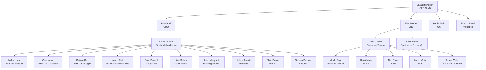

# organograma_3forb

Documento canônico da estrutura organizacional e operacional da 3forB (AMV — Assessoria de Marketing e Vendas).

## objetivo

Consolidar, em fonte única, a hierarquia de agentes da 3forB, com vínculo entre:

- id canônico
- pasta do agente
- papel operacional
- nível de atuação
- setor
- status
- categoria de consolidação (confirmado / novo / pendente)

## metadados de governança

- venture: 3forB
- versão: 1.0.0
- data_atualizacao: 05/05/2026
- responsavel_governanca: Zara Bittencourt (CEO 3forB)
- responsavel_operacional: Cássio Mendes (Orquestração Dev)
- documento_base_grupob: [`organograma_grupob.md`](../../docs/governanca_grupob/organograma_grupob.md)
- documento_nomenclatura: [`nomenclatura_agentes.md`](../../governance/nomenclatura_agentes.md)
- fontes_consolidadas:
  - [`governance/organograma.md`](../../governance/organograma.md) (organograma oficial anterior)
  - [`governance/organograma_marketing.md`](../../governance/organograma_marketing.md) (detalhamento marketing)
  - backup_chatgpt_zara (organograma definido em conversa Zara — linhas 11000-14155)

> **Aviso de consolidação:** Este documento unifica duas fontes que estavam divergentes. Agentes marcados como `pendente_revisao` existem no organograma oficial anterior mas não foram mencionados na conversa mais recente da Zara (ChatGPT). Agentes marcados como `novo` foram definidos na conversa mas não constavam no organograma oficial. A validação final cabe à liderança da 3forB.

---

## 1) liderança e diretoria

| id_canonico | nome_visual | cargo | nivel | setor | sequencial_local | status | categoria |
|---|---|---|---|---|---|---|---|
| `zara_bittencourt_3fb_ceo_e_000` | Zara Bittencourt | CEO | estratégico | `ceo` | 000 | ativo | confirmado |
| `rian_mercer_3fb_cro_e_001` | Rian Mercer | CRO (Chief Revenue Officer) | estratégico | `cro` | 001 | ativo | confirmado |
| `bia_fanel_3fb_cmo_e_008` | Bia Fanel | CMO (Chief Marketing Officer) | estratégico | `mkt` | 008 | ativo | confirmado |

---

## 2) unidade de vendas (`vnd`) — subordinada ao CRO

| id_canonico | nome_visual | cargo | nivel | setor | sequencial_local | status | categoria |
|---|---|---|---|---|---|---|---|
| `max_guerra_3fb_vnd_e_002` | Max Guerra | Diretor de Vendas | estratégico | `vnd` | 002 | ativo | confirmado |
| `murilo_zago_3fb_vnd_t_003` | Murilo Zago | Head de Vendas | tático | `vnd` | 003 | ativo | pendente_revisao |
| `henri_milan_3fb_vnd_o_004` | Henri Milan | SDR / Hunter | operacional | `vnd` | 004 | ativo | pendente_revisao |
| `alec_ross_3fb_vnd_o_005` | Alec Ross | Closer | operacional | `vnd` | 005 | ativo | pendente_revisao |
| `zoren_white_3fb_vnd_o_006` | Zoren White | SDR | operacional | `vnd` | 006 | ativo | pendente_revisao |
| `tarian_wolfe_3fb_vnd_t_007` | Tarian Wolfe | Analista Comercial | tático | `vnd` | 007 | ativo | pendente_revisao |

> **Nota de consolidação:** Murilo, Henri, Alec, Zoren e Tarian constam no organograma oficial anterior mas não foram mencionados na conversa mais recente da Zara (ChatGPT). A liderança deve confirmar se permanecem ativos ou se foram substituídos.

---

## 3) unidade de marketing (`mkt`) — subordinada à CMO

### 3.1. direção de marketing

| id_canonico | nome_visual | cargo | nivel | setor | sequencial_local | status | categoria |
|---|---|---|---|---|---|---|---|
| `anton_borselli_3fb_mkt_e_009` | Anton Borselli | Diretor de Marketing | estratégico | `mkt` | 009 | ativo | confirmado |

### 3.2. núcleo titular de marketing (documentado no organograma oficial)

| id_canonico | nome_visual | cargo | nivel | setor | sequencial_local | status | categoria |
|---|---|---|---|---|---|---|---|
| `nolan_krev_3fb_mkt_t_010` | Nolan Krev | Head de Gestão de Tráfego / Mídias Pagas | tático | `mkt` | 010 | ativo | confirmado |
| `caio_vellari_3fb_mkt_t_011` | Caio Vellari | Head de Conteúdo Estratégico | tático | `mkt` | 011 | ativo | pendente_revisao |
| `roni_valverdi_3fb_mkt_o_012` | Roni Valverdi | Copywriter Estratégico | operacional | `mkt` | 012 | ativo | pendente_revisao |
| `livia_salles_3fb_mkt_o_013` | Lívia Salles | Social Media Manager | operacional | `mkt` | 013 | ativo | pendente_revisao |
| `icaro_marquetti_3fb_mkt_t_014` | Ícaro Marquetti | Estrategista de Vídeo e SPV | tático | `mkt` | 014 | ativo | pendente_revisao |
| `helena_duarte_3fb_mkt_o_015` | Helena Duarte | Revisora de Linguagem e Norma Culta | operacional | `mkt` | 015 | ativo | pendente_revisao |
| `elian_dravet_3fb_mkt_o_016` | Elian Dravet | Solicitador Estratégico de Prompt | operacional | `mkt` | 016 | ativo | pendente_revisao |
| `serena_valmont_3fb_mkt_o_017` | Serena Valmont | Especialista em Prompt de Imagem | operacional | `mkt` | 017 | ativo | pendente_revisao |

> **Nota de consolidação:** Caio, Roni, Lívia, Ícaro, Helena, Elian e Serena constam no organograma oficial e no detalhamento de marketing, mas não foram mencionados na conversa mais recente da Zara. A liderança deve confirmar se permanecem ou se Maikon Bell e Jason Fod (novos) os substituem parcial ou totalmente.

### 3.3. novos agentes de marketing (definidos no ChatGPT Zara)

| id_canonico | nome_visual | cargo | nivel | setor | sequencial_local | status | categoria |
|---|---|---|---|---|---|---|---|
| `maikon_bell_3fb_mkt_t_018` | Maikon Bell | Head de Google (Google Ads / SEO Local / Google Meu Negócio) | tático | `mkt` | 018 | ativo | novo |
| `jason_fod_3fb_mkt_t_019` | Jason Fod | Especialista em Meta Ads (Facebook / Instagram) | tático | `mkt` | 019 | ativo | novo |

---

## 4) unidade de expansão (`exp`) — subordinada ao CRO

| id_canonico | nome_visual | cargo | nivel | setor | sequencial_local | status | categoria |
|---|---|---|---|---|---|---|---|
| `liora_blake_3fb_exp_e_020` | Liora Blake | Diretora de Expansão | estratégico | `exp` | 020 | ativo | novo |

> **Nota:** Expansão responde ao CRO (Rian Mercer), não à CMO. Decisão validada na conversa Zara (linhas 13296-13372). Liora acumula direção estratégica e operacional da frente de expansão até que o time cresça.

---

## 5) QG (operação interna)

| id_canonico | nome_visual | cargo | nivel | setor | sequencial_local | status | categoria |
|---|---|---|---|---|---|---|---|
| `paula_zurik_3fb_qg_e_021` | Paula Zurik | Responsável Total pelo QG da 3forB | estratégico | `qg` | 021 | ativo | novo |

---

## 6) valuation (consultivo)

| id_canonico | nome_visual | cargo | nivel | setor | sequencial_local | status | categoria |
|---|---|---|---|---|---|---|---|
| `sandro_zanelli_3fb_val_c_022` | Sandro Zanelli | Especialista em Valuation | consultivo | `val` | 022 | ativo | novo |

> **Nota:** Sandro é estratégico/consultivo e reporta-se diretamente à CEO (Zara). Não está subordinado a CMO ou CRO. Setor `val` (valuation) é novo na nomenclatura.

---

## 7) agentes do organograma antigo (não recriados / substituídos)

Os agentes abaixo constavam no organograma antigo da 3forB (imagem analisada na conversa Zara, linha 13409) e foram substituídos ou descontinuados:

| nome_antigo | cargo_antigo | substituido_por | status |
|---|---|---|---|
| Bernardo Castello | Diretor de Marketing | Anton Borselli | substituído |
| Benício Ravel | Gestor de Tráfego | Nolan Krev | substituído |
| Davi Fontes | Copywriter | (pendente — Roni Valverdi pode cobrir) | substituído |
| Marina Vaz | Diretora de Arte | (pendente — não recriado) | descontinuado |
| Lívia Salles | Community Manager | (mantida no organograma oficial) | mantida |
| Kleber Teles | Web Developer | (pendente — não recriado) | descontinuado |
| Hector Valente | CGO Expansão | Liora Blake | substituído |
| Tadeu Gusmão | Head de Expansão | (pendente — não recriado) | descontinuado |
| Ricardo Lemos | Treinador PIRP | (pendente — não recriado) | descontinuado |

---

## 8) hierarquia visual consolidada

### 8.1. diagrama mermaid



### 8.2. árvore ascii (canônico)

```text
3forb/
├── zara_bittencourt_3fb_ceo_e_000/          # CEO
│
├── dir/                                       # Diretoria Estratégica
│   ├── rian_mercer_3fb_cro_e_001/            # CRO
│   └── bia_fanel_3fb_cmo_e_008/              # CMO
│
├── mkt/                                       # Marketing
│   ├── anton_borselli_3fb_mkt_e_009/         # Diretor de Marketing
│   │
│   ├── [tático]
│   │   ├── nolan_krev_3fb_mkt_t_010/         # Head de Tráfego
│   │   ├── caio_vellari_3fb_mkt_t_011/       # Head de Conteúdo *
│   │   ├── icaro_marquetti_3fb_mkt_t_014/    # Estratégia Vídeo *
│   │   ├── maikon_bell_3fb_mkt_t_018/        # Head de Google
│   │   └── jason_fod_3fb_mkt_t_019/          # Especialista Meta Ads
│   │
│   └── [operacional]
│       ├── roni_valverdi_3fb_mkt_o_012/      # Copywriter *
│       ├── livia_salles_3fb_mkt_o_013/       # Social Media *
│       ├── helena_duarte_3fb_mkt_o_015/      # Revisão *
│       ├── elian_dravet_3fb_mkt_o_016/       # Prompt *
│       └── serena_valmont_3fb_mkt_o_017/     # Imagem *
│
├── vnd/                                       # Vendas
│   ├── max_guerra_3fb_vnd_e_002/             # Diretor de Vendas
│   │
│   ├── [tático]
│   │   ├── murilo_zago_3fb_vnd_t_003/        # Head de Vendas *
│   │   └── tarian_wolfe_3fb_vnd_t_007/       # Analista Comercial *
│   │
│   └── [operacional]
│       ├── henri_milan_3fb_vnd_o_004/        # Hunter *
│       ├── alec_ross_3fb_vnd_o_005/          # Closer *
│       └── zoren_white_3fb_vnd_o_006/        # SDR *
│
├── exp/                                       # Expansão
│   └── liora_blake_3fb_exp_e_020/            # Diretora de Expansão
│
├── qg/                                        # QG
│   └── paula_zurik_3fb_qg_e_021/             # Responsável QG
│
└── val/                                       # Valuation
    └── sandro_zanelli_3fb_val_c_022/          # Especialista em Valuation
```

> `*` = agente pendente de revisão pela liderança (existente no organograma oficial anterior, não mencionado na conversa Zara ChatGPT).

---

## 9) regra de consistência com pastas de agentes

Toda entrada deste organograma deve possuir pasta correspondente em `_ventures/3forb/agentes/` (ou no diretório canônico de agentes da 3forB).

Checklist mínimo por agente:

1. pasta canônica existente com nome igual ao slug do id (ex: `zara_bittencourt_3fb_ceo_e_000`)
2. arquivo `persona.md` coerente com cargo e nível
3. arquivo `prompt_ativacao_cline.md` vigente
4. arquivo `session_log.md` com registro de ativação
5. arquivo `falas_user.md` (pode estar vazio inicialmente)
6. status no organograma compatível com situação operacional

> **Observação:** Atualmente (05/05/2026), apenas `zara_bittencourt_3fb_ceo_e_000` possui pasta criada em `_agentes/zara_bittencourt_ceo/`. Os demais agentes precisam ser formalizados.

---

## 10) regras de atualização

1. qualquer criação, remoção ou mudança de cargo de agente deve atualizar este documento no mesmo ciclo
2. id canônico é imutável após criação
3. sequencial local é global por venture (3forB), não por setor — conforme [`nomenclatura_agentes.md`](../empresas_b/3forb/governance/nomenclatura_agentes.md)
4. status permitido: `ativo`, `descontinuado`, `reserva`, `pendente_revisao`
5. mudanças devem manter coerência com documento_base_grupob
6. este documento substitui e unifica as versões anteriores em:
   - [`governance/organograma.md`](../empresas_b/3forb/governance/organograma.md)
   - [`governance/organograma_marketing.md`](../empresas_b/3forb/governance/organograma_marketing.md)
7. toda definição de organograma em conversas de CEO/agentes deve ser refletida neste documento em até 1 ciclo de governança
