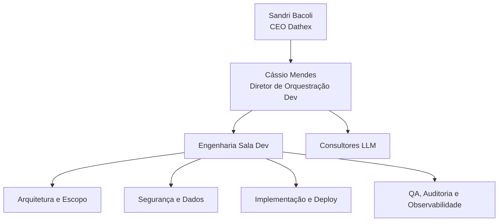

# organograma_dathex

Documento canônico da estrutura organizacional e operacional da Dathex.

## objetivo

Consolidar, em fonte única, a hierarquia de agentes da Dathex, com vínculo entre:

- id canônico
- pasta do agente
- papel operacional
- nível de atuação
- setor
- status

## metadados de governança

- venture: Dathex
- versão: 1.0.0
- data_atualizacao: 02/05/2026
- responsavel_governanca: Sandri Bacoli (CEO Dathex)
- responsavel_operacional: Cássio Mendes (Diretor de Orquestração Dev)
- documento_base_grupob: [`organograma_grupob.md`](../../../docs/governanca_grupob/organograma_grupob.md)

---

## 1) liderança da venture

| id_canonico | nome_visual | cargo | nivel | setor | sequencial_local | status |
|---|---|---|---|---|---:|---|
| `sandri_bacoli_grb_ceo_e_001` | Sandri Bacoli | CEO da Dathex | estratégico | `ceo` | 001 | ativo |

---

## 2) núcleo engenharia (sala dev)

| id_canonico | nome_visual | cargo | nivel | setor | sequencial_local | status |
|---|---|---|---|---|---:|---|
| `cassio_mendes_grb_eng_e_001` | Cássio Mendes | Diretor de Orquestração Dev | estratégico | `eng` | 001 | ativo |
| `denise_bogado_grb_eng_t_002` | Denise Bogado | Arquiteta da Sala Dev e Produto Operacional | tático | `eng` | 002 | ativo |
| `renati_voss_grb_eng_t_003` | Renati Voss | Lapidador Técnico de Escopo | tático | `eng` | 003 | ativo |
| `caito_marden_grb_eng_o_004` | Caito Marden | Agente de Requisitos | operacional | `eng` | 004 | ativo |
| `laris_vellin_grb_eng_t_005` | Laris Vellin | UX/UI e Fluxos de Produto | tático | `eng` | 005 | ativo |
| `andrese_valon_grb_eng_e_006` | Andrese Valon | Arquiteto Técnico de Sistemas | estratégico | `eng` | 006 | ativo |
| `pedrin_gazan_grb_eng_e_007` | Pedrin Gazan | Diretor de Segurança Digital | estratégico | `eng` | 007 | ativo |
| `dario_vault_grb_eng_t_008` | Dario Vault | Segurança de IA e Guardrails | tático | `eng` | 008 | ativo |
| `tobias_nicozi_grb_eng_t_009` | Tobias Nicozi | Supabase, Banco e Políticas de Dados | tático | `eng` | 009 | ativo |
| `heleni_pradox_grb_eng_o_010` | Heleni Pradox | RLS, Auth e Segurança de Dados | operacional | `eng` | 010 | ativo |
| `enzoc_ferrazi_grb_eng_t_011` | Enzoc Ferrazi | APIs, Webhooks e Integrações | tático | `eng` | 011 | ativo |
| `alan_flow_grb_eng_o_012` | Alan Flow | Automação, n8n e Fluxos Operacionais | operacional | `eng` | 012 | ativo |
| `felix_toran_grb_eng_o_013` | Felix Toran | Front-end Web | operacional | `eng` | 013 | ativo |
| `brunec_cardel_grb_eng_o_014` | Brunec Cardel | Back-end e APIs Internas | operacional | `eng` | 014 | ativo |
| `deniel_cazuetti_grb_eng_o_015` | Deniel Cazuetti | Desenvolvimento Mobile | operacional | `eng` | 015 | ativo |
| `gabriel_voli_grb_eng_t_016` | Gabriel Voli | GitHub, Branches e Versionamento | tático | `eng` | 016 | ativo |
| `kaique_zambram_grb_eng_o_017` | Kaique Zambram | Deploy, Netlify e Ambientes Web | operacional | `eng` | 017 | ativo |
| `lucca_varnel_grb_eng_o_018` | Lucca Varnel | QA e Testes Funcionais | operacional | `eng` | 018 | ativo |
| `simoni_faler_grb_eng_o_019` | Simoni Faler | QA Extremo e Testes de Quebra | operacional | `eng` | 019 | ativo |
| `matheu_rizzili_grb_eng_t_002` | Matheu Rizzili | Documentação Técnica e Handoff | tático | `eng` | 020 | ativo |
| `vero_lins_grb_eng_t_021` | Vero Lins | Auditoria Final de Entrega | tático | `eng` | 021 | ativo |
| `octo_zen_grb_eng_o_022` | Octo Zen | Telemetria e Observabilidade | operacional | `eng` | 022 | ativo |

---

## 3) núcleo consultores (apoio llm)

| id_canonico | nome_visual | cargo | nivel | setor | sequencial_local | status |
|---|---|---|---|---|---:|---|
| `alexer_chen_grb_con_d_001` | Alexer Chen | Consultor LLM (DeepSeek e arquitetura agentic) | diretivo | `con` | 001 | ativo |
| `bryan_luck_grb_con_c_001` | Bryan Luck | Consultor LLM (Claude) | consultivo | `con` | 002 | ativo |
| `piter_many_grb_con_g_001` | Piter Many | Consultor LLM (Google/Gemini) | consultivo | `con` | 003 | ativo |
| `michael_park_grb_con_o_001` | Michael Park | Consultor LLM (OpenAI) | consultivo | `con` | 004 | ativo |

---

## 4) regra de consistência com pastas de agentes

Toda entrada deste organograma deve possuir pasta correspondente em [`_ventures/dathex/agentes`](_ventures/dathex/agentes).

Checklist mínimo por agente:

1. pasta canônica existente
2. arquivo [`persona.md`](_ventures/dathex/agentes/sandri_bacoli_grb_ceo_e_001/persona.md) coerente com cargo
3. arquivo [`prompt_ativacao_cline.md`](_ventures/dathex/agentes/sandri_bacoli_grb_ceo_e_001/prompt_ativacao_cline.md) vigente
4. status no organograma compatível com situação operacional

---

## 5) hierarquia visual (macro)



---

## 6.1 Organograma Visual em Árvore (Canônico)

Organograma ASCII com todos os agentes da Dathex, organizados por setor e nível hierárquico:

```text
dathex/
├── sandri_bacoli_grb_ceo_e_001/          # CEO Dathex
│
├── eng/                                    # Núcleo Engenharia (Sala Dev)
│   ├── cassio_mendes_grb_eng_e_001/       # Diretor de Orquestração Dev
│   │
│   ├── [estratégico]
│   │   ├── andrese_valon_grb_eng_e_006/   # Arquiteto Técnico de Sistemas
│   │   └── pedrin_gazan_grb_eng_e_007/    # Diretor de Segurança Digital
│   │
│   ├── [tático]
│   │   ├── denise_bogado_grb_eng_t_002/   # Arquiteta da Sala Dev e Produto Operacional
│   │   ├── renati_voss_grb_eng_t_003/     # Lapidador Técnico de Escopo
│   │   ├── laris_vellin_grb_eng_t_005/    # UX/UI e Fluxos de Produto
│   │   ├── dario_vault_grb_eng_t_008/     # Segurança de IA e Guardrails
│   │   ├── tobias_nicozi_grb_eng_t_009/   # Supabase, Banco e Políticas de Dados
│   │   ├── enzoc_ferrazi_grb_eng_t_011/   # APIs, Webhooks e Integrações
│   │   ├── gabriel_voli_grb_eng_t_016/    # GitHub, Branches e Versionamento
│   │   ├── matheu_rizzili_grb_eng_t_002/  # Documentação Técnica e Handoff
│   │   └── vero_lins_grb_eng_t_021/       # Auditoria Final de Entrega
│   │
│   └── [operacional]
│       ├── caito_marden_grb_eng_o_004/    # Agente de Requisitos
│       ├── heleni_pradox_grb_eng_o_010/   # RLS, Auth e Segurança de Dados
│       ├── alan_flow_grb_eng_o_012/       # Automação, n8n e Fluxos Operacionais
│       ├── felix_toran_grb_eng_o_013/     # Front-end Web
│       ├── brunec_cardel_grb_eng_o_014/   # Back-end e APIs Internas
│       ├── deniel_cazuetti_grb_eng_o_015/ # Desenvolvimento Mobile
│       ├── kaique_zambram_grb_eng_o_017/  # Deploy, Netlify e Ambientes Web
│       ├── lucca_varnel_grb_eng_o_018/    # QA e Testes Funcionais
│       ├── simoni_faler_grb_eng_o_019/    # QA Extremo e Testes de Quebra
│       └── octo_zen_grb_eng_o_022/        # Telemetria e Observabilidade
│
└── con/                                    # Núcleo Consultores LLM
    ├── alexer_chen_grb_con_d_001/         # Consultor LLM (DeepSeek)
    ├── bryan_luck_grb_con_c_001/          # Consultor LLM (Claude)
    ├── piter_many_grb_con_g_001/          # Consultor LLM (Google/Gemini)
    └── michael_park_grb_con_o_001/        # Consultor LLM (OpenAI)
```
```

---

## 7) regras de atualização

1. qualquer criação, remoção ou mudança de cargo de agente deve atualizar este documento no mesmo ciclo
2. id canônico é imutável após criação
3. sequência local é exclusiva por setor (`ceo`, `eng`, `con`)
4. status permitido: `ativo`, `descontinuado`, `reserva`
5. mudanças devem manter coerência com [`organograma_grupob.md`](../../../docs/governanca_grupob/organograma_grupob.md)

