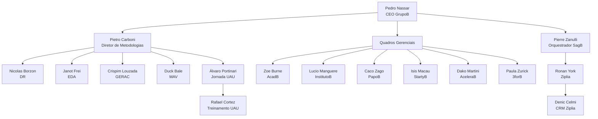

# Organograma Oficial — GrupoB

Este documento reflete a hierarquia dos agentes operacionais do GrupoB, de acordo com o [Padrão de Nomenclatura Oficial](nomenclatura_agentes_grupob.md).  
Todos os agentes registrados aqui possuem sua identificação única (ID canônico) e posição estabelecida.

**Data de atualização:** 20/04/2026  
**Versão:** 1.0  
**Responsável pela governança:** Pierre Zanulli (Orquestrador SagB)

---

## 1. Liderança do GrupoB (Holding)

| ID Canônico | Nome Visual | Cargo | Nível | Setor | Sequencial |
|-------------|-------------|-------|-------|-------|------------|
| `pedro_nassar_grb_ceo_e_001` | Pedro Nassar | CEO do GrupoB | Estratégico | `ceo` | 001 |
| `pietro_carboni_grb_mtd_e_002` | Pietro Carboni | Diretor de Metodologias | Estratégico | `mtd` | 002 |

---

## 2. Quadros Gerenciais (QGs)

Cada QG é uma unidade operacional com CEO/Responsável próprio.

### 2.1. QG AcadB
| ID Canônico | Nome Visual | Cargo | Nível | Setor | Sequencial |
|-------------|-------------|-------|-------|-------|------------|
| `zoe_burne_grb_qga_e_003` | Zoe Burne | Responsável do QG AcadB | Estratégico | `qga` | 003 |

### 2.2. QG InstitutoB
| ID Canônico | Nome Visual | Cargo | Nível | Setor | Sequencial |
|-------------|-------------|-------|-------|-------|------------|
| `lucio_manguere_grb_qgi_e_004` | Lucio Manguere | Responsável do QG InstitutoB | Estratégico | `qgi` | 004 |

### 2.3. QG PapoB
| ID Canônico | Nome Visual | Cargo | Nível | Setor | Sequencial |
|-------------|-------------|-------|-------|-------|------------|
| `caco_zago_grb_qgp_e_005` | Caco Zago | Responsável do QG PapoB | Estratégico | `qgp` | 005 |

### 2.4. QG StartyB
| ID Canônico | Nome Visual | Cargo | Nível | Setor | Sequencial |
|-------------|-------------|-------|-------|-------|------------|
| `isis_macau_grb_qgs_e_006` | Isis Macau | Responsável do QG StartyB | Estratégico | `qgs` | 006 |

### 2.5. QG AceleraB
| ID Canônico | Nome Visual | Cargo | Nível | Setor | Sequencial |
|-------------|-------------|-------|-------|-------|------------|
| `dako_martini_grb_qgc_e_007` | Dako Martini | Responsável do QG AceleraB | Estratégico | `qgc` | 007 |

### 2.6. QG 3forB
| ID Canônico | Nome Visual | Cargo | Nível | Setor | Sequencial |
|-------------|-------------|-------|-------|-------|------------|
| `paula_zurick_grb_qg3_e_008` | Paula Zurick | Responsável do QG 3forB | Estratégico | `qg3` | 008 |

---

## 3. Metodologias & Programas

Diretores responsáveis pelas metodologias proprietárias do GrupoB, subordinados ao Diretor de Metodologias (Pietro Carboni).

### 3.1. DR (Decisão e Resultado)
| ID Canônico | Nome Visual | Cargo | Nível | Setor | Sequencial |
|-------------|-------------|-------|-------|-------|------------|
| `nicolas_borzon_grb_mtd_e_009` | Nicolas Borzon | Diretor da Metodologia DR | Estratégico | `mtd` | 009 |

### 3.2. EDA (Estratégia Digital Avançada)
| ID Canônico | Nome Visual | Cargo | Nível | Setor | Sequencial |
|-------------|-------------|-------|-------|-------|------------|
| `janot_frei_grb_mtd_e_010` | Janot Frei | Diretor da Metodologia EDA | Estratégico | `mtd` | 010 |

### 3.3. GERAC
| ID Canônico | Nome Visual | Cargo | Nível | Setor | Sequencial |
|-------------|-------------|-------|-------|-------|------------|
| `crispim_louzada_grb_mtd_e_011` | Crispim Louzada | Diretor da Metodologia GERAC | Estratégico | `mtd` | 011 |

### 3.4. MAV (Máquina Avançada de Vendas)
| ID Canônico | Nome Visual | Cargo | Nível | Setor | Sequencial |
|-------------|-------------|-------|-------|-------|------------|
| `duck_bale_grb_mtd_e_012` | Duck Bale | Diretor da Metodologia MAV | Estratégico | `mtd` | 012 |

### 3.5. Jornada UAU
| ID Canônico | Nome Visual | Cargo | Nível | Setor | Sequencial |
|-------------|-------------|-------|-------|-------|------------|
| `alvaro_portinari_grb_mtd_e_013` | Álvaro Portinari | Diretor da Jornada UAU | Estratégico | `mtd` | 013 |
| `rafael_cortez_grb_mtd_t_014` | Rafael Cortez | Responsável por Treinamento da Jornada UAU | Tático | `mtd` | 014 |

---

## 4. Engenharia & Orquestração (SagB)

Centro de comando técnico do GrupoB.

| ID Canônico | Nome Visual | Cargo | Nível | Setor | Sequencial |
|-------------|-------------|-------|-------|-------|------------|
| `pierre_zanulli_grb_eng_e_015` | Pierre Zanulli | Orquestrador do SagB | Estratégico | `eng` | 015 |

---

## 5. Ventures (Empresas do Ecossistema)

### 5.1. Ziplia
| ID Canônico | Nome Visual | Cargo | Nível | Setor | Sequencial |
|-------------|-------------|-------|-------|-------|------------|
| `ronan_york_grb_crm_e_016` | Ronan York | CEO da Ziplia | Estratégico | `crm` | 016 |

### 5.2. CRM Ziplia (Módulo)
| ID Canônico | Nome Visual | Cargo | Nível | Setor | Sequencial |
|-------------|-------------|-------|-------|-------|------------|
| `denic_celmi_grb_crm_t_017` | Denic Celmi | Diretor do CRM Ziplia | Tático | `crm` | 017 |

---

## 6. Hierarquia Visual

---

## 7. Próximos Sequenciais Disponíveis

O próximo sequencial global a ser atribuído é: **`018`**

---

## 8. Regras de Atualização

1.  Qualquer nova contratação, criação de agente ou mudança de cargo deve ser refletida aqui.
2.  O sequencial global deve ser incrementado linearmente, independente do setor.
3.  A atualização deste documento é responsabilidade do Orquestrador SagB (Pierre Zanulli).
4.  Todas as pastas de agentes devem seguir a nomenclatura canônica e estar alinhadas com este organograma.

---

> *Documento governado pelo SagB. Para alterações, abra uma reunião registrada em `_qgs/grupob/_reunioes/`.*
