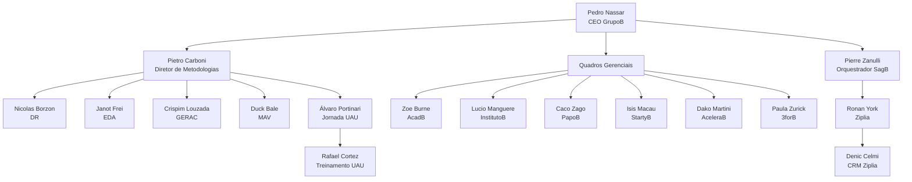

# Organograma Oficial — GrupoB

Este documento reflete a hierarquia dos agentes operacionais do GrupoB, de acordo com o [Padrão de Nomenclatura Oficial](nomenclatura_agentes_grupob.md).  
Todos os agentes registrados aqui possuem sua identificação única (ID canônico) e posição estabelecida.

O campo **Código Curto** segue o documento canônico [`codigo_curto_colaboradores_grupob.md`](codigo_curto_colaboradores_grupob.md).

**Data de atualização:** 20/04/2026  
**Versão:** 1.0  
**Responsável pela governança:** Pierre Zanulli (Orquestrador SagB)

---

## 1. Liderança do GrupoB (Holding)

| ID Canônico | Código Curto | Nome Visual | Cargo | Nível | Setor | Sequencial |
|-------------|--------------|-------------|-------|-------|-------|------------|
| `pedro_nassar_grb_ceo_e_001` | `GRB-CA-CEO-001` | Pedro Nassar | CEO do GrupoB | Estratégico | `ceo` | 001 |
| `pietro_carboni_grb_mtd_e_002` | `GRB-CA-MTD-002` | Pietro Carboni | Diretor de Metodologias | Estratégico | `mtd` | 002 |

---

## 2. Quadros Gerenciais (QGs)

Cada QG é uma unidade operacional com CEO/Responsável próprio.

### 2.1. QG AcadB
| ID Canônico | Código Curto | Nome Visual | Cargo | Nível | Setor | Sequencial |
|-------------|--------------|-------------|-------|-------|-------|------------|
| `zoe_burne_grb_qga_e_003` | `ACB-CA-QGA-003` | Zoe Burne | Responsável do QG AcadB | Estratégico | `qga` | 003 |

### 2.2. QG InstitutoB
| ID Canônico | Código Curto | Nome Visual | Cargo | Nível | Setor | Sequencial |
|-------------|--------------|-------------|-------|-------|-------|------------|
| `lucio_manguere_grb_qgi_e_004` | `INS-CA-QGI-004` | Lucio Manguere | Responsável do QG InstitutoB | Estratégico | `qgi` | 004 |

### 2.3. QG PapoB
| ID Canônico | Código Curto | Nome Visual | Cargo | Nível | Setor | Sequencial |
|-------------|--------------|-------------|-------|-------|-------|------------|
| `caco_zago_grb_qgp_e_005` | `PAP-CA-QGP-005` | Caco Zago | Responsável do QG PapoB | Estratégico | `qgp` | 005 |

### 2.4. QG StartyB
| ID Canônico | Código Curto | Nome Visual | Cargo | Nível | Setor | Sequencial |
|-------------|--------------|-------------|-------|-------|-------|------------|
| `isis_macau_grb_qgs_e_006` | `STB-CA-QGS-006` | Isis Macau | Responsável do QG StartyB | Estratégico | `qgs` | 006 |

### 2.5. QG AceleraB
| ID Canônico | Código Curto | Nome Visual | Cargo | Nível | Setor | Sequencial |
|-------------|--------------|-------------|-------|-------|-------|------------|
| `dako_martini_grb_qgc_e_007` | `ACL-CA-QGC-007` | Dako Martini | Responsável do QG AceleraB | Estratégico | `qgc` | 007 |

### 2.6. QG 3forB
| ID Canônico | Código Curto | Nome Visual | Cargo | Nível | Setor | Sequencial |
|-------------|--------------|-------------|-------|-------|-------|------------|
| `paula_zurick_grb_qg3_e_008` | `3FB-CA-QG3-008` | Paula Zurick | Responsável do QG 3forB | Estratégico | `qg3` | 008 |

---

## 3. Metodologias & Programas

Diretores responsáveis pelas metodologias proprietárias do GrupoB, subordinados ao Diretor de Metodologias (Pietro Carboni).

### 3.1. DR (Decisão e Resultado)
| ID Canônico | Código Curto | Nome Visual | Cargo | Nível | Setor | Sequencial |
|-------------|--------------|-------------|-------|-------|-------|------------|
| `nicolas_borzon_grb_mtd_e_009` | `GRB-CA-MTD-009` | Nicolas Borzon | Diretor da Metodologia DR | Estratégico | `mtd` | 009 |

### 3.2. EDA (Estratégia Digital Avançada)
| ID Canônico | Código Curto | Nome Visual | Cargo | Nível | Setor | Sequencial |
|-------------|--------------|-------------|-------|-------|-------|------------|
| `janot_frei_grb_mtd_e_010` | `GRB-CA-MTD-010` | Janot Frei | Diretor da Metodologia EDA | Estratégico | `mtd` | 010 |

### 3.3. GERAC
| ID Canônico | Código Curto | Nome Visual | Cargo | Nível | Setor | Sequencial |
|-------------|--------------|-------------|-------|-------|-------|------------|
| `crispim_louzada_grb_mtd_e_011` | `GRB-CA-MTD-011` | Crispim Louzada | Diretor da Metodologia GERAC | Estratégico | `mtd` | 011 |

### 3.4. MAV (Máquina Avançada de Vendas)
| ID Canônico | Código Curto | Nome Visual | Cargo | Nível | Setor | Sequencial |
|-------------|--------------|-------------|-------|-------|-------|------------|
| `duck_bale_grb_mtd_e_012` | `GRB-CA-MTD-012` | Duck Bale | Diretor da Metodologia MAV | Estratégico | `mtd` | 012 |

### 3.5. Jornada UAU
| ID Canônico | Código Curto | Nome Visual | Cargo | Nível | Setor | Sequencial |
|-------------|--------------|-------------|-------|-------|-------|------------|
| `alvaro_portinari_grb_mtd_e_013` | `GRB-CA-MTD-013` | Álvaro Portinari | Diretor da Jornada UAU | Estratégico | `mtd` | 013 |
| `rafael_cortez_grb_mtd_t_014` | `GRB-CA-MTD-014` | Rafael Cortez | Responsável por Treinamento da Jornada UAU | Tático | `mtd` | 014 |

---

## 4. Engenharia & Orquestração (SagB)

Centro de comando técnico do GrupoB.

| ID Canônico | Código Curto | Nome Visual | Cargo | Nível | Setor | Sequencial |
|-------------|--------------|-------------|-------|-------|-------|------------|
| `pierre_zanulli_grb_eng_e_015` | `DAT-CA-ENG-015` | Pierre Zanulli | Orquestrador do SagB | Estratégico | `eng` | 015 |

---

## 5. Ventures (Empresas do Ecossistema)

### 5.1. Ziplia
| ID Canônico | Código Curto | Nome Visual | Cargo | Nível | Setor | Sequencial |
|-------------|--------------|-------------|-------|-------|-------|------------|
| `ronan_york_grb_crm_e_016` | `ZIP-CA-CRM-016` | Ronan York | CEO da Ziplia | Estratégico | `crm` | 016 |

### 5.2. CRM Ziplia (Módulo)
| ID Canônico | Código Curto | Nome Visual | Cargo | Nível | Setor | Sequencial |
|-------------|--------------|-------------|-------|-------|-------|------------|
| `denic_celmi_grb_crm_t_017` | `ZIP-CA-CRM-017` | Denic Celmi | Diretor do CRM Ziplia | Tático | `crm` | 017 |

### 5.3. Dathex (Sala Dev)
| ID Canônico | Código Curto | Nome Visual | Cargo | Nível | Setor | Sequencial |
|-------------|--------------|-------------|-------|-------|-------|------------|
| `cassio_mendes_grb_eng_e_001` | `DAT-CA-ENG-001` | Cássio Mendes | Diretor de Orquestração Dev | Estratégico | `eng` | 001 |
| `denise_bogado_grb_eng_t_002` | `DAT-CA-ENG-002` | Denise Bogado | Arquiteta da Sala Dev e Produto Operacional | Tático | `eng` | 002 |
| `renati_voss_grb_eng_t_003` | `DAT-CA-ENG-003` | Renati Voss | Lapidador Técnico de Escopo | Tático | `eng` | 003 |
| `caito_marden_grb_eng_o_004` | `DAT-CA-ENG-004` | Caito Marden | Agente de Requisitos | Operacional | `eng` | 004 |
| `laris_vellin_grb_eng_t_005` | `DAT-CA-ENG-005` | Laris Vellin | UX/UI e Fluxos de Produto | Tático | `eng` | 005 |
| `andrese_valon_grb_eng_e_006` | `DAT-CA-ENG-006` | Andrese Valon | Arquiteto Técnico de Sistemas | Estratégico | `eng` | 006 |
| `pedrin_gazan_grb_eng_e_007` | `DAT-CA-ENG-007` | Pedrin Gazan | Diretor de Segurança Digital | Estratégico | `eng` | 007 |
| `dario_vault_grb_eng_t_008` | `DAT-CA-ENG-008` | Dario Vault | Segurança de IA e Guardrails | Tático | `eng` | 008 |
| `tobias_nicozi_grb_eng_t_009` | `DAT-CA-ENG-009` | Tobias Nicozi | Supabase, Banco e Políticas de Dados | Tático | `eng` | 009 |
| `heleni_pradox_grb_eng_o_010` | `DAT-CA-ENG-010` | Heleni Pradox | RLS, Auth e Segurança de Dados | Operacional | `eng` | 010 |
| `enzoc_ferrazi_grb_eng_t_011` | `DAT-CA-ENG-011` | Enzoc Ferrazi | APIs, Webhooks e Integrações | Tático | `eng` | 011 |
| `alan_flow_grb_eng_o_012` | `DAT-CA-ENG-012` | Alan Flow | Automação, n8n e Fluxos Operacionais | Operacional | `eng` | 012 |
| `felix_toran_grb_eng_o_013` | `DAT-CA-ENG-013` | Felix Toran | Front-end Web | Operacional | `eng` | 013 |
| `brunec_cardel_grb_eng_o_014` | `DAT-CA-ENG-014` | Brunec Cardel | Back-end e APIs Internas | Operacional | `eng` | 014 |
| `deniel_cazuetti_grb_eng_o_015` | `DAT-CA-ENG-015` | Deniel Cazuetti | Desenvolvimento Mobile | Operacional | `eng` | 015 |
| `gabriel_voli_grb_eng_t_016` | `DAT-CA-ENG-016` | Gabriel Voli | GitHub, Branches e Versionamento | Tático | `eng` | 016 |
| `kaique_zambram_grb_eng_o_017` | `DAT-CA-ENG-017` | Kaique Zambram | Deploy, Netlify e Ambientes Web | Operacional | `eng` | 017 |
| `lucca_varnel_grb_eng_o_018` | `DAT-CA-ENG-018` | Lucca Varnel | QA e Testes Funcionais | Operacional | `eng` | 018 |
| `simoni_faler_grb_eng_o_019` | `DAT-CA-ENG-019` | Simoni Faler | QA Extremo e Testes de Quebra | Operacional | `eng` | 019 |
| `vero_lins_grb_eng_t_021` | `DAT-CA-ENG-021` | Vero Lins | Auditoria Final de Entrega | Tático | `eng` | 021 |
| `octo_zen_grb_eng_o_022` | `DAT-CA-ENG-022` | Octo Zen | Telemetria e Observabilidade | Operacional | `eng` | 022 |

---

## 6. Hierarquia Visual



---

## 6.1 Organograma Visual em Árvore (Canônico)

Organograma ASCII com todos os agentes da Dathex, organizados por setor e nível hierárquico:

```text
dathex/
├── sandri_bacoli_grb_ceo_e_001/          # CEO Dathex
│
├── eng/                                    # Núcleo Engenharia (Sala Dev)
│   ├── cassio_mendes_grb_eng_e_001/       # Diretor de Orquestração Dev
│   │
│   ├── [estratégico]
│   │   ├── andrese_valon_grb_eng_e_006/   # Arquiteto Técnico de Sistemas
│   │   └── pedrin_gazan_grb_eng_e_007/    # Diretor de Segurança Digital
│   │
│   ├── [tático]
│   │   ├── denise_bogado_grb_eng_t_002/   # Arquiteta da Sala Dev e Produto Operacional
│   │   ├── renati_voss_grb_eng_t_003/     # Lapidador Técnico de Escopo
│   │   ├── laris_vellin_grb_eng_t_005/    # UX/UI e Fluxos de Produto
│   │   ├── dario_vault_grb_eng_t_008/     # Segurança de IA e Guardrails
│   │   ├── tobias_nicozi_grb_eng_t_009/   # Supabase, Banco e Políticas de Dados
│   │   ├── enzoc_ferrazi_grb_eng_t_011/   # APIs, Webhooks e Integrações
│   │   ├── gabriel_voli_grb_eng_t_016/    # GitHub, Branches e Versionamento
│   │   ├── matheu_rizzili_grb_eng_t_002/  # Documentação Técnica e Handoff
│   │   └── vero_lins_grb_eng_t_021/       # Auditoria Final de Entrega
│   │
│   └── [operacional]
│       ├── caito_marden_grb_eng_o_004/    # Agente de Requisitos
│       ├── heleni_pradox_grb_eng_o_010/   # RLS, Auth e Segurança de Dados
│       ├── alan_flow_grb_eng_o_012/       # Automação, n8n e Fluxos Operacionais
│       ├── felix_toran_grb_eng_o_013/     # Front-end Web
│       ├── brunec_cardel_grb_eng_o_014/   # Back-end e APIs Internas
│       ├── deniel_cazuetti_grb_eng_o_015/ # Desenvolvimento Mobile
│       ├── kaique_zambram_grb_eng_o_017/  # Deploy, Netlify e Ambientes Web
│       ├── lucca_varnel_grb_eng_o_018/    # QA e Testes Funcionais
│       ├── simoni_faler_grb_eng_o_019/    # QA Extremo e Testes de Quebra
│       └── octo_zen_grb_eng_o_022/        # Telemetria e Observabilidade
│
└── con/                                    # Núcleo Consultores LLM
    ├── alexer_chen_grb_con_d_001/         # Consultor LLM (DeepSeek)
    ├── bryan_luck_grb_con_c_001/          # Consultor LLM (Claude)
    ├── piter_many_grb_con_g_001/          # Consultor LLM (Google/Gemini)
    └── michael_park_grb_con_o_001/        # Consultor LLM (OpenAI)
```
```

---

## 8. Próximos Sequenciais Disponíveis

O próximo sequencial **global GrupoB** a ser atribuído é: **`018`**.

O próximo sequencial **local Dathex (Sala Dev)** a ser atribuído é: **`023`**.

---

## 9. Regras de Atualização

1.  Qualquer nova contratação, criação de agente ou mudança de cargo deve ser refletida aqui.
2.  O sequencial global deve ser incrementado linearmente, independente do setor.
3.  A atualização deste documento é responsabilidade do Orquestrador SagB (Pierre Zanulli).
4.  Todas as pastas de agentes devem seguir a nomenclatura canônica e estar alinhadas com este organograma.

---

> *Documento governado pelo SagB. Para alterações, abra uma reunião registrada em `_qgs/grupob/_reunioes/`.*
