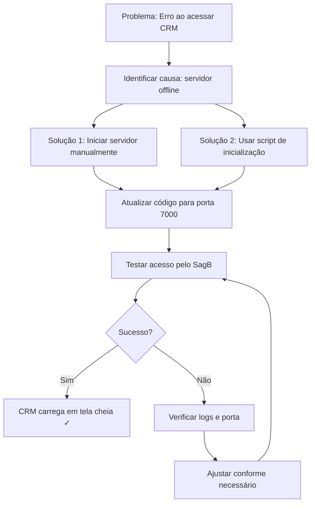

# Script de Inicialização do CRM Ziplia

## Problema Identificado
O servidor do CRM Ziplia não está rodando, causando erro "Não foi possível conectar ao CRM Ziplia" quando o usuário tenta acessar pelo SagB.

## Solução: Iniciar o Servidor do CRM

### Método 1: Manual (Recomendado)

1. **Abra um terminal** (CMD, PowerShell ou Git Bash)
2. **Navegue até o diretório do CRM Ziplia**:
   ```bash
   cd _ventures/ziplia/modules/crm/web
   ```
3. **Instale as dependências** (se ainda não tiver feito):
   ```bash
   npm install
   ```
4. **Inicie o servidor**:
   ```bash
   npm run dev
   ```
5. **Verifique se está rodando**: Acesse `http://localhost:7000` no navegador

### Método 2: Script Batch (Windows)

Crie um arquivo `start-crm-ziplia.bat` com o seguinte conteúdo:

```batch
@echo off
echo ========================================
echo INICIADOR DO CRM ZIPLIA
echo ========================================
echo.
echo Iniciando servidor do CRM Ziplia na porta 7000...
echo.

cd _ventures\ziplia\modules\crm\web
start cmd /k "npm run dev"

echo.
echo Servidor iniciado em uma nova janela!
echo Acesse http://localhost:7000 para verificar.
echo.
echo Pressione qualquer tecla para fechar...
pause >nul
```

### Método 3: Script PowerShell (Windows)

Crie um arquivo `start-crm-ziplia.ps1`:

```powershell
Write-Host "========================================" -ForegroundColor Cyan
Write-Host "INICIADOR DO CRM ZIPLIA" -ForegroundColor Cyan
Write-Host "========================================" -ForegroundColor Cyan
Write-Host ""

# Verificar Node.js
try {
    $null = Get-Command node -ErrorAction Stop
    Write-Host "✓ Node.js encontrado" -ForegroundColor Green
} catch {
    Write-Host "✗ ERRO: Node.js não está instalado!" -ForegroundColor Red
    Write-Host "Instale Node.js 18+ e tente novamente." -ForegroundColor Yellow
    pause
    exit 1
}

# Navegar para o diretório
$crmDir = "_ventures\ziplia\modules\crm\web"
if (-not (Test-Path $crmDir)) {
    Write-Host "✗ ERRO: Diretório do CRM não encontrado!" -ForegroundColor Red
    Write-Host "Caminho: $crmDir" -ForegroundColor Yellow
    pause
    exit 1
}

Set-Location $crmDir

# Perguntar sobre dependências
$installDeps = Read-Host "Deseja instalar/atualizar dependências? (S/N)"
if ($installDeps -eq "S" -or $installDeps -eq "s") {
    Write-Host "Instalando dependências..." -ForegroundColor Yellow
    npm install
    if ($LASTEXITCODE -ne 0) {
        Write-Host "✗ ERRO: Falha ao instalar dependências!" -ForegroundColor Red
        pause
        exit 1
    }
    Write-Host "✓ Dependências instaladas" -ForegroundColor Green
}

# Iniciar servidor
Write-Host ""
Write-Host "Iniciando servidor do CRM Ziplia..." -ForegroundColor Yellow
Write-Host ""

Start-Process cmd -ArgumentList "/k npm run dev" -WindowStyle Normal

Write-Host ""
Write-Host "========================================" -ForegroundColor Cyan
Write-Host "SERVIDOR INICIADO!" -ForegroundColor Green
Write-Host "========================================" -ForegroundColor Cyan
Write-Host ""
Write-Host "O servidor está sendo iniciado em uma nova janela."
Write-Host ""
Write-Host "Próximos passos:"
Write-Host "1. Aguarde alguns segundos"
Write-Host "2. Acesse http://localhost:7000 para verificar"
Write-Host "3. Volte ao SagB e clique no módulo CRM Ziplia"
Write-Host ""
Write-Host "Pressione qualquer tecla para fechar..."
$null = $Host.UI.RawUI.ReadKey("NoEcho,IncludeKeyDown")
```

## Correção Necessária no Código

**IMPORTANTE**: O arquivo `CrmZipliaFullscreenPage.tsx` precisa ser atualizado para usar a porta correta (7000):

```typescript
// Localize estas linhas (aproximadamente linhas 4-8):
const CRM_ZIPLIA_URLS = [
  'http://localhost:3000',
  'http://localhost:5173' // Porta alternativa do Vite
];

// Substitua por:
const CRM_ZIPLIA_URLS = [
  'http://localhost:7000', // Porta padrão configurada no .env do CRM Ziplia
  'http://localhost:3000', // Porta alternativa (fallback)
  'http://localhost:5173'  // Porta do Vite dev server
];
```

## Fluxo de Solução Completo



## Verificação de Sucesso

Após seguir os passos, verifique:

1. **Servidor rodando**: `http://localhost:7000` responde com interface do CRM
2. **Porta correta**: O iframe está tentando `localhost:7000` (verifique console do navegador)
3. **Conexão estabelecida**: O CRM carrega dentro do iframe no SagB
4. **Funcionalidade completa**: Navegação, interações e botão "Voltar ao SagB" funcionam

## Solução Alternativa (Se necessário)

Se mesmo após iniciar o servidor ainda houver problemas:

1. **Verifique conflito de portas**: Outro serviço pode estar usando a porta 7000
   ```bash
   netstat -ano | findstr :7000
   ```
2. **Altere a porta no `.env`** do CRM Ziplia para outra (ex: 7001)
3. **Atualize o array de URLs** no código para a nova porta
4. **Reinicie o servidor** com a nova porta

## Suporte

Se o problema persistir:
- Verifique os logs do servidor do CRM Ziplia
- Confirme que o Node.js está na versão 18+
- Verifique permissões de arquivo no diretório do CRM
- Teste em um navegador diferente

---

**Status**: Solução documentada e pronta para implementação. O usuário precisa:
1. Iniciar o servidor do CRM Ziplia (porta 7000)
2. Atualizar o código do iframe para usar a porta correta
3. Testar o acesso pelo SagB