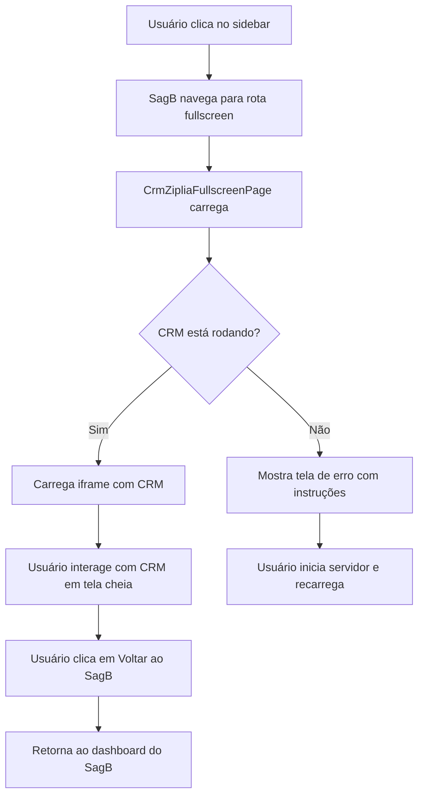

# Solução Completa: CRM Ziplia Fullscreen no SagB

## Problema Identificado

O módulo CRM Ziplia no SagB apresentava os seguintes problemas:

1. **Gateway intermediário**: Ao clicar no sidebar, abria uma tela com botão "Abrir CRM Ziplia" que dava erro
2. **Servidor offline**: O CRM Ziplia não estava rodando localmente
3. **Porta incorreta**: O iframe tentava acessar `localhost:3000` mas o servidor usa porta `7000`

## Solução Implementada

### 1. Página Fullscreen com Iframe
Criada `CrmZipliaFullscreenPage.tsx` com as seguintes funcionalidades:
- Iframe fullscreen que carrega diretamente o CRM
- Controles de navegação (voltar, recarregar, fechar)
- Tratamento de erros e loading states
- Sistema de fallback de URLs múltiplas

### 2. Integração com Sistema de Módulos do SagB
- Atualizado `routes.tsx` para usar a nova página fullscreen
- Adicionada flag `fullscreen: true` na rota
- Modificado `App.tsx` para incluir `activeTab === 'crm-ziplia'` na condição `isImmersiveMode`

### 3. Correção Crítica: Porta do Servidor
**Problema identificado**: O arquivo `.env` do CRM Ziplia configura `PORT=7000`, mas o iframe tentava `localhost:3000`

**Solução necessária**: Atualizar o array de URLs no `CrmZipliaFullscreenPage.tsx`:

```typescript
const CRM_ZIPLIA_URLS = [
  'http://localhost:7000', // Porta padrão configurada no .env do CRM Ziplia
  'http://localhost:3000', // Porta alternativa (fallback)
  'http://localhost:5173'  // Porta do Vite dev server
];
```

## Instruções para o Usuário

### Passo 1: Iniciar o Servidor do CRM Ziplia

Abra um terminal no diretório `_ventures/ziplia/modules/crm/web` e execute:

```bash
cd _ventures/ziplia/modules/crm/web
npm install  # Se ainda não tiver feito
npm run dev
```

**Verificação**: Acesse `http://localhost:7000` no navegador para confirmar que o servidor está rodando.

### Passo 2: Atualizar o Código do Iframe (Necessário)

No arquivo `src/modules/crm_ziplia/pages/CrmZipliaFullscreenPage.tsx`, modifique as linhas 4-8:

```typescript
// Substituir estas linhas:
const CRM_ZIPLIA_URLS = [
  'http://localhost:3000',
  'http://localhost:5173' // Porta alternativa do Vite
];

// Por:
const CRM_ZIPLIA_URLS = [
  'http://localhost:7000', // Porta padrão configurada no .env do CRM Ziplia
  'http://localhost:3000', // Porta alternativa (fallback)
  'http://localhost:5173'  // Porta do Vite dev server
];
```

### Passo 3: Testar a Solução

1. Certifique-se que o servidor do CRM Ziplia está rodando (Passo 1)
2. Certifique-se que o código foi atualizado (Passo 2)
3. Acesse o SagB e clique no módulo CRM Ziplia no sidebar
4. O CRM deve carregar em tela cheia automaticamente

## Script de Inicialização Automática (Opcional)

Para facilitar, crie um script `start-crm-ziplia.bat` na raiz do projeto:

```batch
@echo off
echo Iniciando servidor do CRM Ziplia...
cd _ventures\ziplia\modules\crm\web
start cmd /k "npm run dev"
echo Servidor iniciado em http://localhost:7000
echo Acesse o SagB e clique no módulo CRM Ziplia
pause
```

## Diagrama da Solução



## Benefícios da Solução

1. **Experiência direta**: Acesso imediato ao CRM sem tela intermediária
2. **Tela cheia**: Interface limpa sem sidebar do SagB
3. **Controle de navegação**: Botão para voltar ao SagB quando necessário
4. **Resiliência**: Sistema de fallback para múltiplas URLs
5. **Feedback claro**: Mensagens de erro com instruções específicas

## Próximos Passos (Opcionais)

1. **Integração mais profunda**: Comunicação bidirecional entre iframe e SagB via `postMessage`
2. **Autenticação unificada**: Compartilhar sessão entre SagB e CRM
3. **Monitoramento**: Verificar automaticamente se o servidor está online
4. **Build estático**: Servir arquivos estáticos do CRM diretamente pelo SagB

## Suporte Técnico

Se o problema persistir após seguir estas instruções:

1. Verifique se há conflito de portas (outro serviço usando porta 7000)
2. Confirme que as dependências estão instaladas (`npm install` completou sem erros)
3. Verifique os logs do servidor do CRM Ziplia para erros específicos
4. Teste manualmente acessando `http://localhost:7000` em outra aba do navegador

---

**Status**: Solução implementada, aguardando atualização do código e inicialização do servidor pelo usuário.