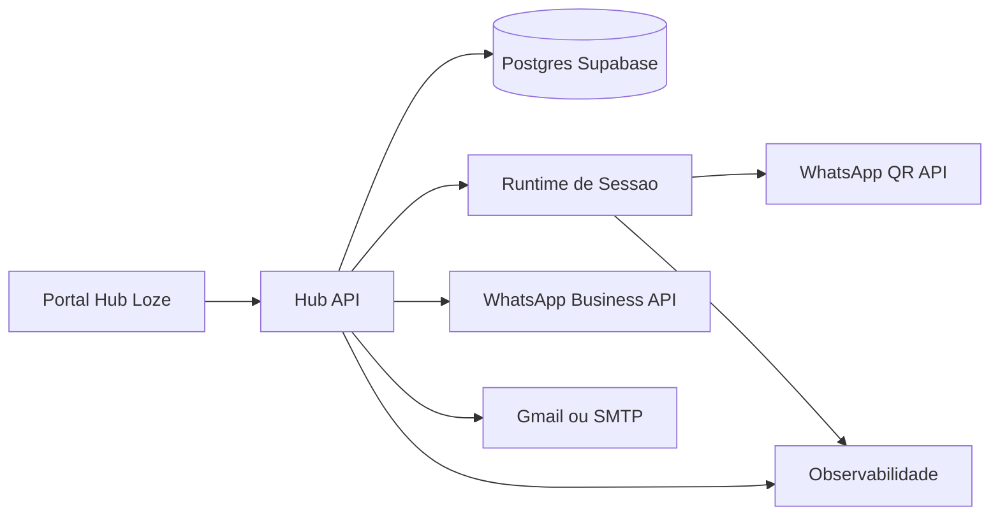

# Arquitetura — Hub de Integrações separado (Loze)

## Objetivo

Desenhar um sistema independente do SagB para Hub de Integrações em `z:/ventures/loze/hub_de_integracao_loze`, sem migração de código nesta etapa.

### Restrição mandatória

- **Não excluir, não mover e não alterar comportamento do módulo original** durante o teste.
- Toda avaliação deve ser feita por cópia controlada, mantendo [`src/modules/hub-integracao`](src/modules/hub-integracao) intacto.

---

## 1) Visão de domínio

### Núcleos

1. **Canal**
   - WhatsApp
   - E-mail

2. **Método de conexão**
   - WhatsApp: QR Code, Business API
   - E-mail: Gmail/Google, Corporativo IMAP/SMTP

3. **Runtime de sessão**
   - Estado operacional e saúde em tempo real

4. **Bindings de consumo**
   - Quais módulos/produtos usam cada canal
   - Regra de roteamento: `module override > channel default`

---

## 2) Arquitetura lógica (alto nível)

---

## 3) Componentes recomendados

### 3.1 Frontend
- **App Hub Loze** dedicado
- Telas:
  - Canais
  - Conexões
  - Estado operacional
  - Atividade

### 3.2 Backend
- **BFF/API do Hub**
  - Contrato público channel-oriented
  - Encapsula providers

### 3.3 Runtime WhatsApp
- Serviço de sessão QR separado do frontend
- Event-driven para conexão, perda, reconexão

### 3.4 Persistência
- Banco isolado do produto Loze
- Sem acoplamento direto com tabelas do SagB

### 3.5 Observabilidade
- Log estruturado
- Eventos de sessão/conexão
- Correlação por `correlationId`

---

## 4) Modelo de dados (conceitual)

1. `channel_configs`
   - channel
   - preferred_method
   - enabled
   - workspace_id

2. `channel_methods`
   - channel
   - method
   - provider_internal
   - enabled
   - is_default
   - workspace_id

3. `module_bindings`
   - module
   - channel
   - method
   - enabled
   - workspace_id

4. `channel_runtime_snapshots`
   - channel
   - session_id
   - status
   - connected_account
   - updated_at
   - workspace_id

5. `channel_events`
   - event_name
   - payload
   - correlation_id
   - timestamp
   - workspace_id

---

## 5) Contrato público da API (target)

### Consultas
- `GET /channels`
- `GET /channels/:channel/status`
- `GET /channels/:channel/events`

### Comandos
- `POST /channels/:channel/preferred-method`
- `POST /bindings`
- `POST /channels/whatsapp/qr/connect`
- `POST /channels/whatsapp/qr/disconnect`
- `POST /channels/email/test`

### Mensageria
- `POST /messages/send`
  - Resolve transporte via regra de precedência

---

## 6) Segurança e tenancy

- Escopo por `workspace_id`
- Segredos fora do frontend
- Chaves criptografadas em repouso
- RBAC por papel (admin, operador)

---

## 7) Operação e ambientes

- `dev`, `staging`, `prod` isolados
- Variáveis por ambiente
- Healthchecks por canal
- Runbook de incidentes:
  - sessão QR caída
  - credencial inválida
  - limite de provider

---

## 8) Decisões de UX para o sistema separado

1. Tela principal orientada a **canal**
2. Método aparece como subnível
3. Estado operacional sempre explícito
4. Detalhe técnico escondido por padrão
5. Ações apenas contextuais e funcionais

---

## 9) Fases de implementação futuras (sem executar agora)

- [ ] Fase A — Fundação do projeto novo
- [ ] Fase B — Domínio e API channel-oriented
- [ ] Fase C — Runtime WhatsApp QR
- [ ] Fase D — Conector E-mail
- [ ] Fase E — UI operacional
- [ ] Fase F — Observabilidade e hardening

---

## 10) Riscos principais

1. Acoplamento involuntário com infra do SagB
2. Complexidade de sessão QR em ambiente serverless
3. Semântica de “conectado” inconsistente entre providers
4. Falta de padronização de erro para suporte

Mitigação: contrato único de status + runtime dedicado + eventos estruturados.

---

## 11) Teste de viabilidade de migração de módulos (objetivo deste estudo)

Objetivo deste teste: validar se é **fácil** desacoplar o Hub do monorepo atual para um sistema separado.

### Critérios de facilidade

1. **Portabilidade de frontend**
   - O módulo funciona com poucas dependências externas do shell atual

2. **Portabilidade de backend/functions**
   - As funções rodam com contrato estável e sem dependências ocultas

3. **Portabilidade de dados**
   - O domínio usa tabelas que podem ser recriadas sem efeitos colaterais

4. **Portabilidade de configuração**
   - Variáveis e segredos ficam centralizados e previsíveis

### Spike técnico sugerido

- [ ] Isolar mapa de dependências do módulo atual
- [ ] Classificar dependências em: essenciais, compartilhadas, acopladas
- [ ] Simular app mínimo standalone só com rotas do Hub
- [ ] Simular funções críticas WhatsApp e E-mail em ambiente isolado
- [ ] Validar contrato de API sem chamadas ao core SagB
- [ ] Medir resultado em semáforo: verde, amarelo, vermelho

### Guardrails do teste

1. Operação **somente de leitura** no módulo original
2. Qualquer experimento deve ocorrer fora do caminho original
3. Proibido remover arquivos, rotas ou funções do Hub atual
4. Proibido alterar deploy do produto principal para este teste

### Resultado esperado do teste

Relatório curto com:

1. Nível de facilidade da migração
2. Lista de bloqueadores reais
3. Estratégia de extração mais segura
4. Ordem recomendada para migração futura
