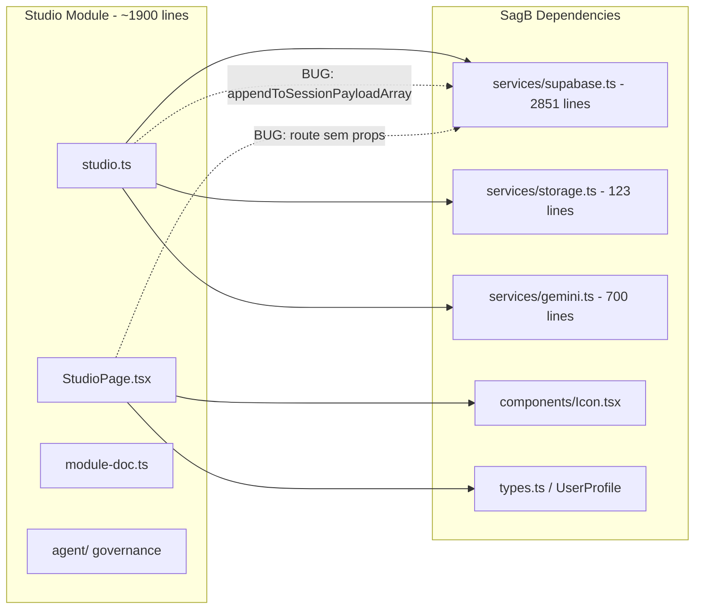

# Auditoria de Código — Módulo Studio (Fabi Nunes)

**Data:** 2026-05-03
**Auditor:** Roo (Architect)
**Fase Atual:** Beta Operacional v1.0.0 (~85% funcional)

---

## Sumário dos Problemas Encontrados

| # | Gravidade | Arquivo | Descrição |
|---|-----------|---------|-----------|
| 1 | 🔴 ALTA | [`studio.ts:388`](src/modules/studio/services/studio.ts:388) | `appendToSessionPayloadArray` sobrescreve payload inteiro em vez de fazer merge |
| 2 | 🔴 ALTA | [`StudioPage.tsx:265`](src/modules/studio/pages/StudioPage.tsx:265) | Timer de 1s causa re-render completa da UI mesmo sem mudanças |
| 3 | 🟡 MÉDIA | [`studio.ts:660`](src/modules/studio/services/studio.ts:660) | `downloadSessionMasterAudio` baixa só o primeiro chunk com áudio, ignora master track |
| 4 | 🟡 MÉDIA | [`StudioPage.tsx:549`](src/modules/studio/pages/StudioPage.tsx:549) | `cameraRecorder.stop()` pode lançar exceção se já estiver parado |
| 5 | 🟡 MÉDIA | [`StudioPage.tsx:611`](src/modules/studio/pages/StudioPage.tsx:611) | Upload não passa `source: 'upload'` — fica inconsistente como 'live' |
| 6 | 🟡 MÉDIA | [`StudioPage.tsx:335`](src/modules/studio/pages/StudioPage.tsx:335) | Race condition potencial no chunk timer vs processamento do chunk anterior |
| 7 | 🟡 MÉDIA | [`module-doc.ts:38`](src/modules/studio/module-doc.ts:38) | Nome do storage diz 'studio-media' mas o bucket real é 'studio' |
| 8 | 🟡 MÉDIA | [`module-doc.ts:46`](src/modules/studio/module-doc.ts:46) | NIC e QualitySensor listados como integrações ativas mas não implementadas |
| 9 | 🟡 MÉDIA | [`studio.ts:82`](src/modules/studio/services/studio.ts:82) | `studioFallbackStore` (Map) nunca é limpo — memory leak potencial |
| 10 | 🟡 MÉDIA | [`routes.tsx:6`](src/modules/studio/routes.tsx:6) | Rota renderiza `<StudioView />` sem props — workspace sempre cai pra default |
| 11 | 🔵 BAIXA | [`studio.ts:597`](src/modules/studio/services/studio.ts:597) | `exportSessionTranscript` e `exportSessionTranscriptPlain` com lógica duplicada |
| 12 | 🔵 BAIXA | [`studio.ts:447`](src/modules/studio/services/studio.ts:447) | `saveRawVideoPipeline` usa `cameraId: 'legacy-camera'` hardcoded |
| 13 | 🔵 BAIXA | [`changelog.md:19`](src/modules/studio/changelog.md:19) | Changelog referencia migration `20260419000101` mas arquivo real é `20260324000101` |
| 14 | 🔵 BAIXA | [`StudioPage.tsx:676`](src/modules/studio/pages/StudioPage.tsx:676) | Feedback (toast) nunca é limpo automaticamente — mensagem fica para sempre |
| 15 | 🔵 BAIXA | [`StudioPage.tsx:159`](src/modules/studio/pages/StudioPage.tsx:159) | Preview streams não são limpas se componente desmontar durante gravação |
| 16 | 🔵 BAIXA | [`storage.ts:3`](services/storage.ts:3) | Chave de sessão `sagb_supabase_session_v1` hardcoded |
| 17 | 🔵 BAIXA | [`studio.ts:438`](src/modules/studio/services/studio.ts:438) | `processFullFilePipeline` não valida `fileBlob.type` vazio antes de usar |

---

## Detalhamento por Gravidade

### 🔴 Alta (2)

#### 1. `appendToSessionPayloadArray` sobrescreve payload inteiro

**Arquivo:** [`src/modules/studio/services/studio.ts:388-398`](src/modules/studio/services/studio.ts:388)

**Problema:** A função faz:
```typescript
await updateStudioSession(sessionId, {
  payload: {
    [key]: [item]
  }
});
```

Isso substitui TODO o payload da sessão por `{ [key]: [item] }`. Se for chamada 3 vezes para a mesma sessão com chaves diferentes (ex: 'sessionCameras', 'cameraFiles', 'audioTracks'), apenas a última chamada será refletida — as anteriores são perdidas.

**Impacto:** Perda de dados de fallback. Se múltiplas tabelas canônicas falharem, apenas uma terá seus dados preservados.

**Correção:** Fazer merge com o payload existente:
```typescript
const existing = /* busca payload atual */;
await updateStudioSession(sessionId, {
  payload: {
    ...existing,
    [key]: [...(existing?.[key] || []), item]
  }
});
```

---

#### 2. Timer de 1s causa re-render completa da UI

**Arquivo:** [`src/modules/studio/pages/StudioPage.tsx:265-282`](src/modules/studio/pages/StudioPage.tsx:265)

**Problema:** O componente usa `setInterval` para atualizar `sessionElapsedMs` e `chunkElapsedMs` a cada 1 segundo. Como são estados React, toda a árvore de componentes re-renderiza a cada segundo, mesmo durante gravação quando nada mudou.

**Impacto:** Performance degradada em gravações longas. Consumo de CPU/energia desnecessário.

**Correção:** Usar `useRef` para os timers e apenas atualizar um elemento DOM específico (ex: via `span` com `innerText`), ou usar `React.memo` nos componentes filhos.

---

### 🟡 Média (8)

#### 3. `downloadSessionMasterAudio` baixa chunk errado

**Arquivo:** [`src/modules/studio/services/studio.ts:653-677`](src/modules/studio/services/studio.ts:653)

**Problema:** A função busca o PRIMEIRO chunk com `audioPath` e baixa ele. Mas o áudio master completo está em `studio_audio_tracks` (via `saveMasterAudioPipeline`), não nos chunks individuais. O chunk tem apenas a fatia do chunk, não a gravação inteira.

**Impacto:** Usuário baixa apenas uma fração do áudio, não a sessão completa.

**Correção:** Buscar em `studio_audio_tracks` primeiro (ou como fallback nos chunks).

---

#### 4. `cameraRecorder.stop()` pode lançar exceção

**Arquivo:** [`src/modules/studio/pages/StudioPage.tsx:549-552`](src/modules/studio/pages/StudioPage.tsx:549)

**Problema:** O `stopRecording` itera sobre `cameraRecordersRef` e chama `recorder.stop()` sem verificar se o recorder já foi parado (ex: por um erro interno).

**Impacto:** Exceção não tratada interrompe o restante do cleanup.

**Correção:**
```typescript
cameraRecordersRef.current.forEach(({ recorder }) => {
  if (recorder.state === 'recording') {
    try { recorder.stop(); } catch { /* já parou */ }
  }
});
```

---

#### 5. Upload não passa `source: 'upload'`

**Arquivo:** [`src/modules/studio/pages/StudioPage.tsx:611-616`](src/modules/studio/pages/StudioPage.tsx:611)

**Problema:** `handleFileUpload` chama `createStudioSession` sem `source: 'upload'`. O backend assume `'live'`.

**Impacto:** Sessões de upload são marcadas como 'live' na listagem.

**Correção:** Adicionar `source: 'upload'` ao chamar `createStudioSession`.

---

#### 6. Race condition no chunk timer

**Arquivo:** [`src/modules/studio/pages/StudioPage.tsx:335-383`](src/modules/studio/pages/StudioPage.tsx:335)

**Problema:** Quando o timeout do chunk atual dispara (`chunkTimerRef`), ele chama `audioRecorder.stop()`, que no `onstop` inicia o próximo chunk via `startAudioChunkRecorder`. Se o pipeline do chunk anterior (`processAudioChunkPipeline`) ainda estiver rodando (upload + transcrição), o novo chunk pode criar concorrência.

**Impacto:** Chunks podem ter índices duplicados ou processamento paralelo não intencional.

**Correção:** Usar um flag `isProcessingChunk` para serializar a criação de chunks.

---

#### 7. Nome do storage inconsistente

**Arquivo:** [`src/modules/studio/module-doc.ts:38`](src/modules/studio/module-doc.ts:38)

**Problema:** `module-doc.ts` lista o storage como `'studio-media'`, mas o bucket real é `'studio'` (presente em todas as chamadas no `studio.ts` e na migration SQL).

**Impacto:** Confusão para outros desenvolvedores/agentes que consultarem a documentação.

---

#### 8. NIC e QualitySensor como "integrados"

**Arquivo:** [`src/modules/studio/module-doc.ts:46-47`](src/modules/studio/module-doc.ts:46)

**Problema:** `module-doc.ts` lista NIC e QualitySensor como integrações ativas, mas não há nenhuma implementação real no código.

**Impacto:** Documentação enganosa.

---

#### 9. Memory leak no fallback store

**Arquivo:** [`src/modules/studio/services/studio.ts:82-87`](src/modules/studio/services/studio.ts:82)

**Problema:** `studioFallbackStore` usa Maps (`sessions`, `chunks`) que nunca são limpos. Em uso prolongado com muitas sessões, o consumo de memória cresce indefinidamente.

**Impacto:** Degradação de performance em uso contínuo.

---

#### 10. Rota renderiza sem props

**Arquivo:** [`src/modules/studio/routes.tsx:6`](src/modules/studio/routes.tsx:6)

**Problema:** `<StudioView />` é renderizado sem `workspaceId`, `ownerUserId`, ou `userProfile`. O componente usa fallback `DEFAULT_WORKSPACE_ID = '00000000-0000-0000-0000-000000000000'`.

**Impacto:** Todas as sessões ficam vinculadas ao workspace default, não ao workspace real do usuário.

---

### 🔵 Baixa (7)

#### 11. Duplicação de lógica de exportação
**Arquivo:** [`studio.ts:597-648`](src/modules/studio/services/studio.ts:597)
`exportSessionTranscript` e `exportSessionTranscriptPlain` compartilham 90% do código (fetch, filter, validação). Apenas o formato de saída difere.

#### 12. Camera ID hardcoded
**Arquivo:** [`studio.ts:447-448`](src/modules/studio/services/studio.ts:447)
`saveRawVideoPipeline` usa `cameraId: 'legacy-camera'` — não reflete a câmera real.

#### 13. Migration ID errado no changelog
**Arquivo:** [`changelog.md:19`](src/modules/studio/changelog.md:19)
Referencia `20260419000101_studio_multicamera.sql` mas o arquivo real é `20260324000101_studio_papob.sql`.

#### 14. Feedback nunca expira
**Arquivo:** [`StudioPage.tsx:676`](src/modules/studio/pages/StudioPage.tsx:676)
O componente de feedback fica visível até ser sobrescrito por outra mensagem.

#### 15. Preview streams sem cleanup no unmount
**Arquivo:** [`StudioPage.tsx:159-163`](src/modules/studio/pages/StudioPage.tsx:159)
Se o componente desmontar durante gravação, `stopAllPreviewStreams` não é chamado.

#### 16. Chave de sessão hardcoded
**Arquivo:** [`services/storage.ts:3`](services/storage.ts:3)
`SESSION_STORAGE_KEY = 'sagb_supabase_session_v1'` — trava o storage ao SagB.

#### 17. Validação ausente de fileBlob.type
**Arquivo:** [`studio.ts:716-731`](src/modules/studio/services/studio.ts:716)
`processFullFilePipeline` usa `params.fileBlob.type` sem verificar se está vazio.

---

## Mapa de Dependências e Acoplamento



---

## Checklist de Saúde do Módulo

| Categoria | Status | Observação |
|-----------|--------|------------|
| Tratamento de erros | ⚠️ 70% | CID errors são silenciados; falta validação de tipos vazios |
| Performance | ⚠️ 60% | Re-render a cada 1s; memory leak no fallback store |
| Tipagem TypeScript | ✅ 90% | Tipos bem definidos, mas `as any` em alguns lugares |
| Memory management | ❌ 40% | Streams, Maps e timers sem cleanup adequado |
| Documentação | ✅ 85% | module-doc OK, mas com 2 inconsistências |
| Segurança (RLS) | ✅ 95% | Policies bem estruturadas na migration |
| Testes | ❌ 0% | Nenhum teste unitário ou de integração |
| Acessibilidade | ❌ 30% | Botões sem aria-labels, focus management ausente |
| Responsividade | ✅ 80% | Grid adaptável, mas sem mobile-first |
| Tratamento de bordas | ⚠️ 50% | Upload sem tipo, device removido, sessão vazia |

---

## Recomendações por Ordem de Prioridade

1. **Corrigir `appendToSessionPayloadArray`** — 🔴 Perda de dados confirmada
2. **Corrigir `downloadSessionMasterAudio`** — 🟡 Baixa o chunk errado
3. **Corrigir rota sem props** — 🟡 Workspace sempre default
4. **Corrigir timer de re-render** — 🟡 Performance
5. **Proteger `recorder.stop()`** — 🟡 Exceção potencial
6. **Serializar chunk processing** — 🟡 Race condition
7. **Corrigir `source: 'upload'`** — 🟡 Inconsistência
8. **Limpar feedback automaticamente** — 🔵 UX
9. **Corrigir docs** (module-doc + changelog) — 🔵 Documentação
10. **Adicionar limpeza do fallback store** 🔵 Memory leak
