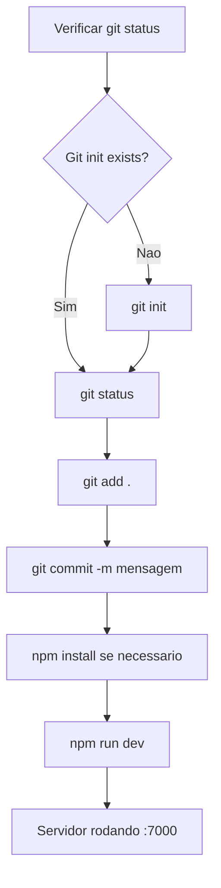

# Plano: Deploy SagB - Novo Deploy

## Contexto
- Projeto: [`00_sagb`](/00_sagb) - Vite + React 19 + TypeScript
- Pasta raiz renomeada para `00_sagb`
- Objetivo: Commitar alterações e executar `npm run dev`

## Pré-requisitos Verificados

| Item | Status |
|------|--------|
| [`package.json`](/00_sagb/package.json) | OK - Scripts `dev`, `build`, `start` configurados |
| [`vite.config.ts`](/00_sagb/vite.config.ts) | OK - Porta 7000, proxy API configurado |
| [`.gitignore`](/00_sagb/.gitignore) | OK - node_modules, .env, dist ignorados |
| [`.env`](/00_sagb/.env) | OK - Variáveis Supabase + AI configuradas |
| [`husky`](/00_sagb/.husky) | Presente (pre-commit hooks via `npm run prepare`) |

## Passos do Plano

### 1. Verificar Estado do Git
- Checar se pasta `.git` existe (git já inicializado?)
- Se não existir, rodar `git init`
- Rodar `git status` para listar arquivos modificados/não rastreados

### 2. Preparar o Commit
- Adicionar arquivos ao stage: `git add .`
- Verificar diff para garantir que nada sensível será commitado
- Criar commit com mensagem descritiva

### 3. Instalar Dependências (se necessário)
- Rodar `npm install` caso `node_modules` não exista ou esteja desatualizado
- Verificar se husky está configurado: `npm run prepare`

### 4. Executar Dev Server
- Rodar `npm run dev` para iniciar o Vite na porta 7000
- Verificar se o servidor sobe sem erros

## Fluxo do Processo

## Riscos e Observações

1. **Renomeação da pasta**: Como a pasta raiz mudou para `00_sagb`, verificar se o git remote origin está apontando para o local correto.
2. **Arquivos grandes**: Verificar se há arquivos temporários ou grandes demais para commit (a `.gitignore` já lista `tmpclaude-*`, `*.zip`).
3. **`.env` commitado**: O `.env` contém chaves reais do Supabase (anon key pública). Importante NÃO commitar se houver chaves privadas. A `VITE_SUPABASE_ANON_KEY` é uma publishable key, então é segura.
4. **Husky**: Pode disparar pre-commit hooks. Verificar comportamento.
5. **Porta 7000**: Verificar se a porta não está ocupada antes de rodar `npm run dev`.
