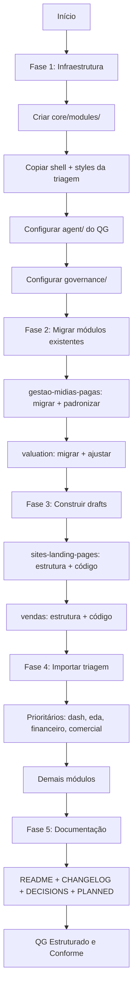

# Plano de Estruturação do QG da TriforB

## Contexto

Documentos de governança analisados:
- [`padrao_unificado_governanca.md`](docs/governanca_sagb/padrao_unificado_governanca.md) — norma transversal
- [`padrao_modulos_plugaveis.md`](docs/governanca_sagb/padrao_modulos_plugaveis.md) — norma operacional de módulos

Módulos existentes em [`Z:\empresas_b\3forB\modules\`](z:/empresas_b/3forB/modules/):
1. `gestao-midias-pagas` (status: hibrido) — ~60% conforme
2. `valuation` (status: migrating) — ~50% conforme
3. `sites-landing-pages` (status: draft) — ~10% conforme
4. `vendas` (status: draft) — ~5% conforme

QG original em [`_triagem/3forB_QG`](z:/empresas_b/3forB/_triagem/3forB_QG) — 18 módulos com estrutura técnica mas sem governança de agentes.

---

## Arquitetura Alvo

```
z:/empresas_b/qg_3forB/
├── agent/                              # Agente do próprio QG
│   ├── persona.md
│   ├── prompt_ativacao_cline.md
│   ├── session_log.md
│   └── falas_user.md
│
├── governance/                         # Espelho local dos docs canônicos
│   ├── padrao_unificado_governanca.md
│   ├── padrao_modulos_plugaveis.md
│   └── decisions.md
│
├── src/
│   ├── core/
│   │   └── modules/
│   │       ├── types.ts                # ModuleManifest, ModuleRoute, ModuleDoc interfaces
│   │       └── moduleRegistry.ts        # Registro central dos módulos
│   │
│   ├── modules/                         # Módulos plugáveis
│   │   ├── gestao-midias-pagas/         # Migrar da raiz + padronizar
│   │   ├── valuation/                   # Migrar da raiz + ajustar estrutura
│   │   ├── sites-landing-pages/         # Construir do zero (draft)
│   │   ├── vendas/                      # Construir do zero (draft)
│   │   ├── eda/                         # Trazer da triagem
│   │   ├── financeiro/                  # Trazer da triagem
│   │   ├── comercial/                   # Trazer da triagem
│   │   ├── contratos/                   # Trazer da triagem
│   │   ├── dashboard-executivo/         # Trazer da triagem
│   │   ├── agentes-ia/                  # Trazer da triagem
│   │   ├── clientes/                    # Trazer da triagem
│   │   ├── configuracoes/               # Trazer da triagem
│   │   ├── entregaveis/                 # Trazer da triagem
│   │   ├── evaluation/                  # Trazer da triagem
│   │   ├── marketing/                   # Trazer da triagem
│   │   ├── mav/                         # Trazer da triagem
│   │   ├── monitoramento/               # Trazer da triagem
│   │   ├── onboarding/                  # Trazer da triagem
│   │   ├── playbooks-base-conhecimento/ # Trazer da triagem
│   │   ├── propostas/                   # Trazer da triagem
│   │   └── tarefas-producao/            # Trazer da triagem
│   │
│   ├── shell/                           # Layout principal (da triagem)
│   └── styles/                          # Estilos globais (da triagem)
│
├── _triagem/                            # Raw materials (link simbólico ou copy)
│
├── package.json                         # Vite + React + TypeScript
├── vite.config.ts
├── tsconfig.json
├── README.md                            # Visão executiva do QG
├── CHANGELOG.md                         # Histórico de versões
├── DECISIONS.md                         # Decisões arquiteturais
└── PLANNED.md                           # Roadmap de evolução
```

---

## Checklist de Conformidade por Módulo

Baseado no item 7 do [`padrao_modulos_plugaveis.md`](docs/governanca_sagb/padrao_modulos_plugaveis.md):

| # | Requisito | Obrigatório |
|---|-----------|-------------|
| 1 | Pasta em `src/modules/<id>` com nomenclatura `lowercase_underscore` | Sim |
| 2 | `manifest.ts` + `routes.tsx` + `index.ts` + `module-doc.ts` | Sim |
| 3 | `module-doc.ts` implementa interface `ModuleDoc` | Sim |
| 4 | `README.md` + `CHANGELOG.md` + `DECISIONS.md` (UPPERCASE) | Sim |
| 5 | `PLANNED.md` se houver plano de evolução ativo | Opcional |
| 6 | `agent/` com 4 canônicos: `persona.md`, `session_log.md`, `falas_user.md`, `prompt_ativacao_cline.md` | Sim |
| 7 | Owner em `manifest.ts` no formato `{ type, id, displayName }` | Sim |
| 8 | Registrado em `moduleRegistry.ts` | Sim |
| 9 | Conformidade visual canônica (fonte Inter, tokens `--sagb-*`, tipografia) | Sim |

---

## Análise de Gap: Módulos Existentes vs Padrão

### gestao-midias-pagas (status: hibrido)

```
 ARQUIVO                   EXISTE?   PADRÃO    OBSERVAÇÃO
 ─────────────────────────────────────────────────────────
 manifest.ts               ✅        ✅        FALTA owner
 routes.tsx                ✅        ✅        Importa de core/modules/types
 index.ts                  ✅        ✅        Exporta manifest + routes + types + mock
 module-doc.ts             ✅        ✅        OK, mas sem tipagem ModuleDoc
 README.md                 ❌        ❌        Não existe na raiz
 CHANGELOG.md              ⚠️        ❌        Existe como changelog.md (minúsculo)
 DECISIONS.md              ❌        ❌        Não existe
 PLANNED.md                ❌        N/A       Opcional
 agent/persona.md          ✅        ✅        OK
 agent/owner.md            ⚠️        ❌        LEGADO - remover, owner vai no manifest.ts
 agent/session_log.md      ❌        ❌        Não existe
 agent/falas_user.md       ❌        ❌        Não existe
 agent/prompt_ativacao.md  ❌        ❌        Não existe
 components/               ✅        ✅        64 componentes
 pages/                    ✅        ✅        Index.tsx
 services/                 ✅        ✅        technical-health-view.ts
 store/                    ✅        ✅        Vazio (README apenas)
 types/                    ✅        ✅        19 arquivos de tipo
```

**Ações necessárias:**
1. Adicionar `owner` no `manifest.ts`
2. Criar `agent/session_log.md`
3. Criar `agent/falas_user.md`
4. Criar `agent/prompt_ativacao_cline.md`
5. Renomear `changelog.md` → `CHANGELOG.md`
6. Criar `DECISIONS.md` com tabela data/decisão/motivo
7. Criar `README.md` na raiz do módulo
8. Remover `agent/owner.md` (legado)
9. Tipar `module-doc.ts` com interface `ModuleDoc`

---

### valuation (status: migrating)

```
 ARQUIVO                   EXISTE?   PADRÃO    OBSERVAÇÃO
 ─────────────────────────────────────────────────────────
 manifest.ts               ✅        ✅        Em src/manifest.ts, FALTA owner
 routes.tsx                ✅        ✅        Em src/routes.tsx
 index.ts                  ❌        ❌        Não existe na raiz
 module-doc.ts             ✅        ✅        Na raiz, sem tipagem ModuleDoc
 README.md                 ✅        ✅        Na raiz (UPPERCASE ✓)
 CHANGELOG.md              ⚠️        ❌        changelog.md (minúsculo)
 DECISIONS.md              ❌        ❌        Não existe
 PLANNED.md                ❌        N/A       migration-plan.md existe (não canônico)
 agent/persona.md          ✅        ✅        OK
 agent/owner.md            ⚠️        ❌        LEGADO
 agent/session.md          ⚠️        ❌        Nome errado - deveria ser session_log.md
 agent/falas_user.md       ❌        ❌        Não existe
 agent/prompt_ativacao.md  ❌        ❌        Não existe
 components/               ✅        ✅        59 componentes (em src/components/)
 pages/                    ✅        ✅        Index.tsx (em src/pages/)
 services/                 ✅        ✅        7 serviços (em src/services/)
 types/                    ✅        ✅        9 arquivos de tipo (em src/types/)
```

**Ações necessárias:**
1. Criar `index.ts` na raiz exportando manifest + routes de `src/`
2. Adicionar `owner` no `manifest.ts`
3. Renomear `agent/session.md` → `agent/session_log.md`
4. Criar `agent/falas_user.md`
5. Criar `agent/prompt_ativacao_cline.md`
6. Renomear `changelog.md` → `CHANGELOG.md`
7. Criar `DECISIONS.md`
8. Remover `agent/owner.md` (legado)
9. Remover `migration-plan.md` ou converter para `PLANNED.md`
10. Tipar `module-doc.ts` com interface `ModuleDoc`

---

### sites-landing-pages (status: draft)

```
 ARQUIVO                   EXISTE?   PADRÃO    OBSERVAÇÃO
 ─────────────────────────────────────────────────────────
 manifest.ts               ✅        ⚠️        FALTA owner
 module-doc.ts             ✅        ⚠️        Sem tipagem ModuleDoc
 routes.tsx                ❌        ❌        Não existe
 index.ts                  ❌        ❌        Não existe
 README.md                 ❌        ❌        Não existe
 CHANGELOG.md              ⚠️        ❌        changelog.md (minúsculo)
 DECISIONS.md              ❌        ❌        Não existe
 agent/persona.md          ✅        ✅        OK
 agent/owner.md            ⚠️        ❌        LEGADO
 agent/session_log.md      ❌        ❌        Não existe
 agent/falas_user.md       ❌        ❌        Não existe
 agent/prompt_ativacao.md  ❌        ❌        Não existe
 components/               ❌        ❌        Não existe (mas tem na triagem)
 pages/                    ❌        ❌        Não existe (mas tem na triagem)
 services/                 ❌        ❌        Não existe (mas tem na triagem)
```

**Ações necessárias:**
1. Construir estrutura completa seguindo o padrão
2. Trazer `components/`, `pages/`, `services/`, `store/`, `types/` da triagem
3. Criar `routes.tsx`
4. Criar `index.ts`
5. Criar `README.md`, `CHANGELOG.md`, `DECISIONS.md`
6. Criar `agent/` com 4 canônicos
7. Adicionar `owner` no `manifest.ts`
8. Remover `agent/owner.md`

---

### vendas (status: draft)

```
 ARQUIVO                   EXISTE?   PADRÃO    OBSERVAÇÃO
 ─────────────────────────────────────────────────────────
 manifest.ts               ❌        ❌        Não existe
 module-doc.ts             ❌        ❌        Não existe
 routes.tsx                ❌        ❌        Não existe
 index.ts                  ❌        ❌        Não existe
 agent/owner.md            ⚠️        ❌        Único arquivo existente (legado)
```

**Ações necessárias:**
1. Construir do zero seguindo o padrão
2. Trazer `components/`, `pages/`, `services/`, `store/`, `types/` da triagem
3. Criar `manifest.ts` com id, displayName, status, owner
4. Criar `module-doc.ts` com contexto, objetivo, escopoInicial
5. Criar `routes.tsx`
6. Criar `index.ts`
7. Criar `README.md`, `CHANGELOG.md`, `DECISIONS.md`
8. Criar `agent/` com 4 canônicos
9. Remover `agent/owner.md`

---

## Módulos da Triagem a Importar

Os módulos abaixo existem em [`_triagem/3forB_QG/src/modules/`](z:/empresas_b/3forB/_triagem/3forB_QG/src/modules/) com estrutura técnica (`components/`, `hooks/`, `pages/`, `services/`, `store/`, `types/`) mas **sem governança de agente**:

| Módulo | Prioridade | Justificativa |
|--------|-----------|---------------|
| dashboard-executivo | Alta | Visão consolidada do negócio |
| eda | Alta | Expansão e dados estratégicos |
| financeiro | Alta | Gestão financeira |
| comercial | Alta | Operação comercial |
| contratos | Média | Gestão contratual |
| evaluation | Média | Avaliação de desempenho |
| marketing | Média | Operação de marketing |
| mav | Média | Mínimo Ativo Viável |
| monitoramento | Média | Acompanhamento operacional |
| agentes-ia | Baixa | Agentes de IA |
| clientes | Baixa | Gestão de clientes |
| configuracoes | Baixa | Configurações do sistema |
| entregaveis | Baixa | Gestão de entregáveis |
| onboarding | Baixa | Onboarding de usuários |
| playbooks-base-conhecimento | Baixa | Base de conhecimento |
| propostas | Baixa | Gestão de propostas |
| tarefas-producao | Baixa | Tarefas de produção |

Para cada módulo importado, aplicar o mesmo checklist de conformidade.

---

## Plano de Execução (Fases)

### Fase 1: Infraestrutura Base
1. Copiar `package.json`, `vite.config.ts`, `tsconfig.json` do backup processado
2. Criar `src/core/modules/types.ts` com interfaces `ModuleManifest`, `ModuleRoute`, `ModuleDoc`
3. Criar `src/core/modules/moduleRegistry.ts`
4. Copiar `src/shell/` e `src/styles/` da triagem
5. Configurar `agent/` do próprio QG (4 canônicos)
6. Configurar `governance/` com espelhos locais

### Fase 2: Migração dos Módulos Existentes
7. **gestao-midias-pagas** — migrar + aplicar checklist de conformidade
8. **valuation** — migrar + ajustar estrutura + aplicar checklist

### Fase 3: Construção dos Drafts
9. **sites-landing-pages** — construir estrutura completa (trazer código da triagem)
10. **vendas** — construir estrutura completa (trazer código da triagem)

### Fase 4: Importação dos Módulos da Triagem
11. Importar módulos prioritários (dashboard-executivo, eda, financeiro, comercial)
12. Aplicar checklist de conformidade em cada um
13. Importar demais módulos conforme necessidade

### Fase 5: Documentação e Governança
14. Criar `README.md` do QG
15. Criar `CHANGELOG.md` do QG
16. Criar `DECISIONS.md` do QG
17. Criar `PLANNED.md` com roadmap

---

## Diagrama de Fluxo



---

## Resumo das Correções nos Módulos Existentes

### gestao-midias-pagas
- [ ] Adicionar `owner` no `manifest.ts`
- [ ] Criar `agent/session_log.md`
- [ ] Criar `agent/falas_user.md`
- [ ] Criar `agent/prompt_ativacao_cline.md`
- [ ] Renomear `changelog.md` → `CHANGELOG.md`
- [ ] Criar `DECISIONS.md`
- [ ] Criar `README.md` na raiz
- [ ] Remover `agent/owner.md` (legado)
- [ ] Tipar `module-doc.ts` com interface `ModuleDoc`

### valuation
- [ ] Criar `index.ts` na raiz (export de src/)
- [ ] Adicionar `owner` no `manifest.ts`
- [ ] Renomear `agent/session.md` → `agent/session_log.md`
- [ ] Criar `agent/falas_user.md`
- [ ] Criar `agent/prompt_ativacao_cline.md`
- [ ] Renomear `changelog.md` → `CHANGELOG.md`
- [ ] Criar `DECISIONS.md`
- [ ] Remover `agent/owner.md` (legado)
- [ ] Converter `migration-plan.md` → `PLANNED.md`
- [ ] Tipar `module-doc.ts` com interface `ModuleDoc`

### sites-landing-pages
- [ ] Construir estrutura completa
- [ ] Trazer components/, pages/, services/, store/, types/ da triagem
- [ ] Criar `routes.tsx` e `index.ts`
- [ ] Criar `README.md`, `CHANGELOG.md`, `DECISIONS.md`
- [ ] Criar `agent/` com 4 canônicos
- [ ] Adicionar `owner` no `manifest.ts`
- [ ] Remover `agent/owner.md` (legado)

### vendas
- [ ] Construir do zero seguindo o padrão
- [ ] Trazer código da triagem
- [ ] Criar todos os arquivos obrigatórios
- [ ] Remover `agent/owner.md` (legado)
