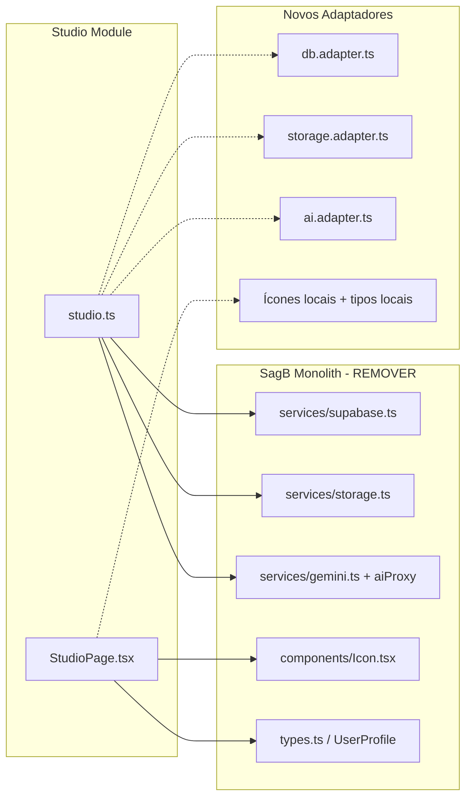

# Plano de Evolução — Studio | Fabi Nunes

## Fase Atual: Beta Operacional (v1.0.0)

---

## Prioridade 1 — Correções Rápidas e Documentação

### 1.1 Atualizar [`module-doc.ts`](src/modules/studio/module-doc.ts)

**Motivo:** O documento do módulo está desatualizado — só lista `studio_sessions` e `studio_chunks`, mas existem 5 tabelas no total.

**O que fazer:**
- Adicionar as tabelas faltantes ao array `tables`:
  - `studio_session_cameras` — Registro de câmeras por sessão
  - `studio_camera_files` — Arquivos de vídeo por câmera
  - `studio_audio_tracks` — Trilhas de áudio (master)
- Atualizar `storages` se necessário
- Adicionar as integrações existentes (Gemini, CID)

**Arquivos afetados:**
- [`src/modules/studio/module-doc.ts`](src/modules/studio/module-doc.ts)

---

### 1.2 Adicionar Exportação/Download de Mídia e Transcrições

**Motivo:** Não há como baixar as gravações ou transcrições das sessões, limitando a utilidade do módulo.

**O que fazer:**
- Adicionar botão de **download do áudio mestre** por sessão
- Adicionar botão de **download de arquivo de câmera** (por câmera)
- Adicionar botão de **exportar transcrição** (formato .txt ou .md)
- Adicionar botão de **exportar sessão completa** (relatório consolidado)

**Onde implementar:**
- No componente de sessão na sidebar direita (`StudioPage.tsx` ~linha 934)
- Adicionar dropdown de ações por sessão (Download Áudio, Download Vídeo, Exportar Transcrição)

**Funções no service necessárias:**
- `getSessionDownloadUrls(sessionId)` — retorna URLs assinadas do storage
- `exportSessionTranscript(sessionId)` — consolida texto de todos os chunks

**Arquivos afetados:**
- [`src/modules/studio/pages/StudioPage.tsx`](src/modules/studio/pages/StudioPage.tsx)
- [`src/modules/studio/services/studio.ts`](src/modules/studio/services/studio.ts)

---

### 1.3 Corrigir Gaps de Governança do Agente

**Motivo:** Pequenas inconsistências na documentação do agente.

**O que verificar/corrigir:**
- [`prompt_ativacao_cline.md`](src/modules/studio/agent/prompt_ativacao_cline.md): Verificar se o caminho para `falas_user.md` está correto (referencia `agent/falas_user.md` que existe)
- [`persona.md`](src/modules/studio/agent/persona.md): Na linha 23 referencia `agent/prompt-ativacao-cline.md` (hífen) mas o arquivo real é `agent/prompt_ativacao_cline.md` (underscore) — **corrigir o link**
- Atualizar [`changelog.md`](src/modules/studio/changelog.md) com as novas entregas deste plano
- Atualizar [`decisions.md`](src/modules/studio/decisions.md) com as decisões futuras

**Arquivos afetados:**
- [`src/modules/studio/agent/persona.md`](src/modules/studio/agent/persona.md)
- [`src/modules/studio/changelog.md`](src/modules/studio/changelog.md)
- [`src/modules/studio/decisions.md`](src/modules/studio/decisions.md)

---

## Prioridade 2 — Estabilidade e Segurança

### 2.1 Gerenciamento de Memória em Gravações Longas

**Motivo:** O `Blob[]` acumula em memória RAM durante gravação contínua sem limite. Sessões muito longas (+30min) podem causar pressão de memória no navegador.

**O que fazer:**
- Implementar **flush periódico** do buffer de partes dos gravadores:
  - A cada N chunks (ou a cada X minutos), fazer upload incremental dos blobs acumulados e liberar a referência
- Para o `masterAudioPartsRef`: limpar array após `saveMasterAudioPipeline`
- Para os `cameraRecordersRef`: limpar `parts` após `saveCameraFilePipeline`

**Arquivos afetados:**
- [`src/modules/studio/pages/StudioPage.tsx`](src/modules/studio/pages/StudioPage.tsx)

---

### 2.2 Rate Limiting e Proteção Contra Múltiplas Gravações

**Motivo:** Não há proteção contra iniciar múltiplas gravações simultâneas na mesma sessão ou exceder limites de storage.

**O que fazer:**
- Impedir `startRecording()` se já houver uma gravação ativa (já existe `isRecording`, mas verificar edge cases)
- Adicionar verificação de storage disponível antes de iniciar gravação
- Limitar duração máxima de sessão (ex: 2 horas) com aviso ao usuário

**Arquivos afetados:**
- [`src/modules/studio/pages/StudioPage.tsx`](src/modules/studio/pages/StudioPage.tsx)
- [`src/modules/studio/services/studio.ts`](src/modules/studio/services/studio.ts)

---

### 2.3 Validação de Permissão do Workspace no Frontend

**Motivo:** O backend tem RLS (Row Level Security), mas o frontend não valida se o usuário tem acesso ao workspace atual antes de carregar a UI.

**O que fazer:**
- Adicionar verificação de `workspaceId` e `userProfile` válidos no carregamento do `StudioPage`
- Exibir mensagem de "Sem permissão" se o usuário não for membro do workspace
- Usar o `ownerUserId` prop já existente no componente

**Arquivos afetados:**
- [`src/modules/studio/pages/StudioPage.tsx`](src/modules/studio/pages/StudioPage.tsx)

---

## Prioridade 3 — Integrações

### 3.1 Integração Robusta com CID

**Motivo:** A integração com CID existe mas é básica — envia transcrição como um asset simples sem metadados enriquecidos.

**O que fazer:**
- Enriquecer os metadados enviados ao CID:
  - Tipo de mídia (áudio-only ou audio+vídeo)
  - Quantidade de câmeras
  - Duração total
  - Nome da sessão
  - Data da gravação
- Adicionar o arquivo de áudio original como anexo no CID
- Garantir que o CID Output inclua metadados de busca (tags, sourceKind)

**Arquivos afetados:**
- [`src/modules/studio/services/studio.ts`](src/modules/studio/services/studio.ts)
- Possível nova função: `enrichCidAsset(sessionId)`

---

### 3.2 Integração com NIC (Núcleo de Inteligência Conectiva)

**Motivo:** As transcrições geradas pelo Studio podem alimentar o NIC como conhecimento consultável pela organização.

**O que fazer:**
- Criar ponte entre Studio e NIC:
  - Após `processAudioChunkPipeline` completar com sucesso, notificar o NIC
  - Enviar transcrição + metadados para o NIC como um "knowledge item"
- Usar o registry do SagB Bridge para a comunicação entre módulos

**Arquivos afetados:**
- [`src/modules/studio/services/studio.ts`](src/modules/studio/services/studio.ts)
- Nova função: `sendToNIC(workspaceId, transcriptionData)`

---

### 3.3 Integração com QualitySensor

**Motivo:** Não há monitoramento de qualidade das gravações — taxa de sucesso de transcrições, duração média, erros frequentes.

**O que fazer:**
- Disparar eventos de qualidade nos momentos chave:
  - Sessão iniciada
  - Chunk processado (sucesso/erro)
  - Sessão finalizada (completa/erro)
- Usar o formato de eventos do `QualitySensor` existente em `services/qualitySensor.ts`

**Arquivos afetados:**
- [`src/modules/studio/services/studio.ts`](src/modules/studio/services/studio.ts)
- [`services/qualitySensor.ts`](services/qualitySensor.ts) (verificar API disponível)

---

## Prioridade 4 — Qualidade e Dados Legados

### 4.1 Testes Unitários e de Integração

**Motivo:** Zero cobertura de testes — pipelines críticos de gravação, transcrição e upload sem validação.

**O que fazer:**
- Testes unitários para funções do `studio.ts`:
  - `createStudioSession` e fallback local
  - `processAudioChunkPipeline` (mockar upload e transcrição)
  - `saveCameraFilePipeline`
  - `saveMasterAudioPipeline`
  - `sendChunkToCID`
- Testes de integração para o fluxo completo (gravação → chunk → transcrição → CID)
- Testes para a UI: renderização do `StudioPage`, interações de gravação

**Arquivos criados:**
- `src/modules/studio/__tests__/studio.test.ts`
- `src/modules/studio/__tests__/StudioPage.test.tsx`

---

### 4.2 Script de Migração de Dados Legados

**Motivo:** Sessões salvas via campo `payload` (fallback antes da migração multicâmera) permanecem em formato não-canônico.

**O que fazer:**
- Criar script/migration SQL que:
  - Varre `studio_sessions` onde `payload` contém `sessionCameras`, `cameraFiles` ou `audioTracks`
  - Insere os registros nas tabelas canônicas correspondentes
  - Marca a migração como concluída no `payload` da sessão

**Arquivos criados:**
- `supabase/migrations/20260503000101_studio_migrate_legacy_payload.sql`

---

### 4.3 Integração com Karaokê

**Motivo:** O módulo Karaokê poderia consumir transcrições em tempo real do Studio para exibição de letra sincronizada.

**O que fazer:**
- Criar contrato de dados entre Studio e Karaokê
- Expor um hook ou callback que notifica o Karaokê quando um chunk é transcrito
-  O Karaokê poderia exibir a transcrição em tempo real como "legenda"

**Arquivos afetados:**
- `src/modules/studio/services/studio.ts`
- `src/modules/karaoke/` (consumidor)

---

## Roadmap Visual

```mermaid
flowchart LR
    subgraph P1[Prioridade 1 — Rápido]
        A[Atualizar module-doc]
        B[Exportação/Download]
        C[Corrigir governança]
    end
    
    subgraph P2[Prioridade 2 — Estabilidade]
        D[Memória gravações]
        E[Rate limiting]
        F[Permissão workspace]
    end
    
    subgraph P3[Prioridade 3 — Integrações]
        G[CID enriquecido]
        H[NIC integration]
        I[QualitySensor]
    end
    
    subgraph P4[Prioridade 4 — Qualidade]
        J[Testes]
        K[Migração legados]
        L[Karaokê]
    end
    
    P1 --> P2 --> P3 --> P4
```



---

## Extração como Sistema Standalone — Análise de Viabilidade

### Situação Atual: Monolítico (Acoplado ao SagB)

O módulo Studio está **totalmente acoplado** ao SagB por 5 dependências diretas:

| Arquivo do Studio | Importa do SagB | O que usa |
|---|---|---|
| `studio.ts` | `services/supabase.ts` (2851 linhas) | `addDoc`, `collection`, `getDocs`, `onSnapshot`, `query`, `updateDoc`, `where`, `db` |
| `studio.ts` | `services/storage.ts` | `uploadBlobToSupabaseStorage`, `downloadBlobFromSupabaseStorage`, `triggerBlobDownload` |
| `studio.ts` | `services/gemini.ts` (700 linhas) | `transcribeMediaBlob` (usa `aiProxy` + `data/prompts`) |
| `StudioPage.tsx` | `components/Icon.tsx` | `BackIcon`, `MicIcon`, `StopCircleIcon`, `CloudUploadIcon`, `FileTextIcon`, `DownloadIcon` |
| `StudioPage.tsx` | `types.ts` | `UserProfile` |

### O Que É Portável (Núcleo do Studio)

O **core de valor** que você levaria:
1. **`StudioPage.tsx`** (~1052 linhas) — UI completa de captura multicâmera
2. **`studio.ts`** (~767 linhas) — Lógica de negócio: sessões, chunks, pipelines, transcrição
3. **`agent/`** — Governança da Fabi Nunes (persona, prompt, logs)
4. **Migrações SQL** — Schema do banco (2 arquivos)

### O Que Precisa Ser Substituído/Adaptado



### Adaptadores Necessários

#### 1. Banco de Dados (`db.adapter.ts`)
```typescript
interface DbAdapter {
  createRecord(table: string, data: any): Promise<string>;
  updateRecord(table: string, id: string, data: any): Promise<void>;
  queryRecords(table: string, filters: Record<string, any>): Promise<any[]>;
  subscribeRecords(table: string, filters: Record<string, any>, cb: (data: any[]) => void): () => void;
}
```
- **Opções:** Supabase (`supabase-js`), qualquer REST/GraphQL API

#### 2. Storage (`storage.adapter.ts`)
```typescript
interface StorageAdapter {
  uploadFile(bucket: string, path: string, blob: Blob, mimeType?: string): Promise<void>;
  downloadFile(bucket: string, path: string): Promise<Blob>;
}
```
- **Opções:** Supabase Storage, AWS S3, Cloudflare R2, localStorage (dev)

#### 3. Transcrição/IA (`ai.adapter.ts`)
```typescript
interface AiAdapter {
  transcribeAudio(blob: Blob, mimeType: string, fileName?: string): Promise<string>;
}
```
- **Opções:** Gemini API direta, Whisper (local/API), qualquer STT provider

#### 4. Ícones e Tipos
- Copiar os 6 ícones SVG usados (~60 linhas) para dentro do projeto
- Declarar `UserProfile` localmente (~10 linhas)

### Conclusão

**Não está pronto para extração imediata.** O código de domínio é portável, mas as **5 amarras com o SagB** precisam ser quebradas via uma camada de adaptadores (~50-100 linhas cada).

**Esforço:** Médio. A refatoração é limpa e bem delimitada.
**Risco:** Baixo — os adaptadores são thin layers, o core do Studio (~90% do código) não muda.

**Recomendação:** Se a intenção é ter o Studio como sistema standalone, faça a extração **antes** de continuar P2-P4, pois os adaptadores serão a base para qualquer evolução futura.

---

## Aprovação

Este plano cobre **12 entregas** em 4 prioridades + **1 análise de extração standalone**. A implementação deve seguir a ordem lógica definida.
