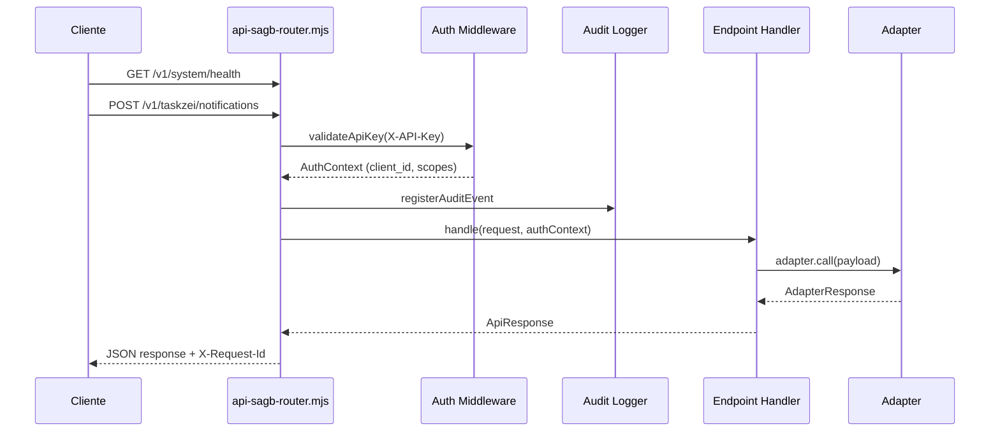
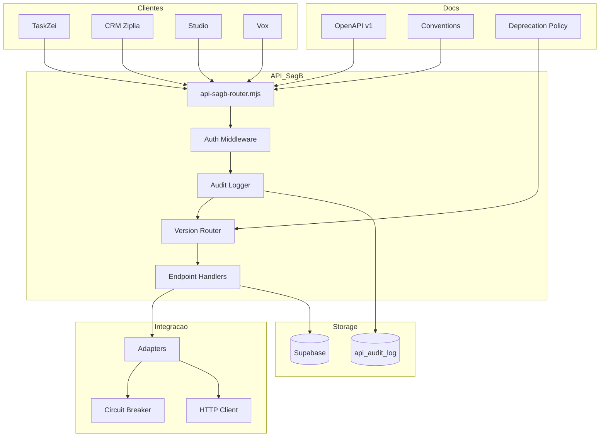

# Plano de Execução Completo — API SagB (Etapas 4 a 9)

## Contexto

- **Módulo:** `src/modules/api_sagb`
- **Responsável:** Dande Conec
- **Progresso atual:** 33% (etapas 1, 2 e 3 concluídas)
- **Próximo marco:** Auditoria e observabilidade

### O que já foi construído:

| Diretório/Arquivo | Propósito |
|---|---|
| `src/modules/api_sagb/` | Estrutura completa do módulo (manifest, rotas, index, module-doc) |
| `src/modules/api_sagb/plano_modulo.md` | Plano de governança do módulo |
| `src/modules/api_sagb/contracts/openapi_v1.yaml` | Contrato OpenAPI 3.0 com endpoint `/health` |
| `src/modules/api_sagb/contracts/conventions.md` | Convenções de erro, paginação, idempotência e versionamento |
| `src/modules/api_sagb/security/auth.types.ts` | Tipagens de `ApiClient`, `ApiKey`, `AuthContext`, `ApiScope` |
| `src/modules/api_sagb/security/authMiddleware.ts` | Validação de API Key e `requireScopes` |
| `src/modules/api_sagb/pages/ApiSagbPage.tsx` | Página de apresentação do módulo |
| `src/modules/api_sagb/agent/` | Agente Dande Conec (persona, logs, ativação) |

---

## Etapa 4 — Auditoria e Observabilidade

**Objetivo:** Rastrear chamadas ponta a ponta com correlation ID e trilha de auditoria.

### Critérios de aceitação
- [ ] `X-Request-Id` gerado para cada requisição e retornado no header da resposta
- [ ] `X-Request-Id` propagado para logs e sistemas downstream
- [ ] Trilha de auditoria registrando: ator (client_id), origem, escopo, recurso, resultado HTTP, timestamp
- [ ] Função Netlify ou serviço dedicado para registrar eventos de auditoria no Supabase
- [ ] Tabela de auditoria no Supabase (`api_audit_log`)

### Arquivos a criar
| Arquivo | Descrição |
|---|---|
| `src/modules/api_sagb/audit/audit.types.ts` | Tipagens para eventos de auditoria |
| `src/modules/api_sagb/audit/auditLogger.ts` | Serviço de log de auditoria (envio para Supabase) |
| `src/modules/api_sagb/audit/requestContext.ts` | Geração e propagação de `X-Request-Id` |
| `netlify/functions/api-sagb-audit.mjs` | Função serverless para registrar auditoria |
| `supabase/migrations/20260505000101_api_sagb_audit.sql` | Migration da tabela `api_audit_log` |

### Detalhamento técnico

#### `audit.types.ts`
```typescript
export interface AuditEntry {
  request_id: string;
  client_id: string;
  environment: string;
  method: string;
  path: string;
  scopes: string[];
  status_code: number;
  ip_address?: string;
  user_agent?: string;
  duration_ms: number;
  created_at: string;
}

export interface RequestContext {
  requestId: string;
  clientId: string;
  scopes: string[];
  startedAt: number;
}
```

#### Migration SQL (`api_sagb_audit.sql`)
```sql
CREATE TABLE IF NOT EXISTS api_audit_log (
  id BIGSERIAL PRIMARY KEY,
  request_id UUID NOT NULL,
  client_id TEXT NOT NULL,
  environment TEXT NOT NULL,
  method TEXT NOT NULL,
  path TEXT NOT NULL,
  scopes TEXT[] DEFAULT '{}',
  status_code INT NOT NULL,
  ip_address TEXT,
  user_agent TEXT,
  duration_ms INT NOT NULL,
  created_at TIMESTAMPTZ NOT NULL DEFAULT NOW()
);

CREATE INDEX idx_api_audit_request_id ON api_audit_log(request_id);
CREATE INDEX idx_api_audit_client_id ON api_audit_log(client_id);
CREATE INDEX idx_api_audit_created_at ON api_audit_log(created_at DESC);
```

---

## Etapa 5 — Camada de Integração Interna

**Objetivo:** Conectar a API ao Hub de Integração sem acoplamento de borda.

### Critérios de aceitação
- [ ] Adaptadores internos definidos para cada conector (TaskZei, CRM, Studio, Vox)
- [ ] Políticas de timeout, retry e circuit-breaker por conector
- [ ] Camada de abstração entre os endpoints `/v1` e os services internos
- [ ] Cliente HTTP genérico com tratamento de erros padronizado

### Arquivos a criar
| Arquivo | Descrição |
|---|---|
| `src/modules/api_sagb/integration/httpClient.ts` | Cliente HTTP genérico com retry e timeout |
| `src/modules/api_sagb/integration/adapters/types.ts` | Tipagens dos adapters |
| `src/modules/api_sagb/integration/adapters/taskzeiAdapter.ts` | Adapter para TaskZei |
| `src/modules/api_sagb/integration/adapters/crmAdapter.ts` | Adapter para CRM Ziplia |
| `src/modules/api_sagb/integration/adapters/studioAdapter.ts` | Adapter para Studio |
| `src/modules/api_sagb/integration/adapters/voxAdapter.ts` | Adapter para Vox |
| `src/modules/api_sagb/integration/circuitBreaker.ts` | Implementação de circuit-breaker |

### Detalhamento técnico

#### `httpClient.ts`
- Métodos: `get`, `post`, `put`, `patch`, `delete`
- Suporte a headers customizados e propagação de `X-Request-Id`
- Timeout configurável por adapter
- Retry policy: exponential backoff (3 tentativas, base de 100ms)
- Tratamento de erros padronizado convertendo para `ErrorResponse`

#### `circuitBreaker.ts`
- Estados: `CLOSED`, `OPEN`, `HALF_OPEN`
- Config: failureThreshold (5), successThreshold (2), timeout (30s)
- Eventos: `onOpen`, `onHalfOpen`, `onClose` para monitoramento

---

## Etapa 6 — Endpoints Prioritários

**Objetivo:** Subir primeiros endpoints para consumidores críticos.

### Critérios de aceitação
- [ ] Endpoints para TaskZei (listar notificações, enviar notificação)
- [ ] Endpoints para CRM (listar leads, criar lead, atualizar lead)
- [ ] Endpoints para Studio (listar projetos, obter projeto)
- [ ] Endpoints para Vox (transcrever áudio, consultar transcrição)
- [ ] Contrato OpenAPI completo com todos os endpoints
- [ ] Implementação real das Netlify Functions

### Arquivos a criar
| Arquivo | Descrição |
|---|---|
| `src/modules/api_sagb/endpoints/taskzei/taskzei.routes.ts` | Definição de rotas TaskZei |
| `src/modules/api_sagb/endpoints/taskzei/taskzei.schema.ts` | Schemas de validação |
| `src/modules/api_sagb/endpoints/taskzei/taskzei.handler.ts` | Handlers dos endpoints |
| `src/modules/api_sagb/endpoints/crm/crm.routes.ts` | Definição de rotas CRM |
| `src/modules/api_sagb/endpoints/crm/crm.schema.ts` | Schemas de validação |
| `src/modules/api_sagb/endpoints/crm/crm.handler.ts` | Handlers dos endpoints |
| `src/modules/api_sagb/endpoints/studio/studio.routes.ts` | Definição de rotas Studio |
| `src/modules/api_sagb/endpoints/studio/studio.handler.ts` | Handlers dos endpoints |
| `src/modules/api_sagb/endpoints/vox/vox.routes.ts` | Definição de rotas Vox |
| `src/modules/api_sagb/endpoints/vox/vox.handler.ts` | Handlers dos endpoints |
| `netlify/functions/api-sagb-router.mjs` | Roteador principal da API |
| `src/modules/api_sagb/endpoints/endpoints.types.ts` | Tipagens compartilhadas |

### Fluxo de requisição



---

## Etapa 7 — Governança de Versão

**Objetivo:** Controlar evolução da API sem quebra de contratos.

### Critérios de aceitação
- [ ] Política de depreciação documentada (mínimo 90 dias de aviso)
- [ ] CHANGELOG da API mantido por versão
- [ ] Cabeçalho `Deprecation` e `Sunset` em responses de endpoints obsoletos
- [ ] Roteamento por versão (`/v1/...`, futuro `/v2/...`)

### Arquivos a criar
| Arquivo | Descrição |
|---|---|
| `src/modules/api_sagb/versioning/versioning.types.ts` | Tipagens para versionamento |
| `src/modules/api_sagb/versioning/versionRouter.ts` | Roteador multi-versão |
| `src/modules/api_sagb/versioning/deprecationPolicy.md` | Política formal de depreciação |
| `src/modules/api_sagb/CHANGELOG_API.md` | Changelog da API por versão |

### Política de Depreciação (`deprecationPolicy.md`)

1. **Aviso mínimo:** 90 dias antes da remoção
2. **Header de aviso:** `Deprecation: true` e `Sunset: <data ISO>` em responses
3. **Comunicação:** Registro no CHANGELOG_API + notificação aos clientes registrados
4. **Quebra de contrato:** Qualquer mudança que exija alteração no cliente (renomear campo, remover campo, alterar tipo)
5. **Adições seguras:** Novos campos e novos endpoints não quebram contrato

---

## Etapa 8 — Hardening e Testes

**Objetivo:** Elevar confiabilidade operacional da API.

### Critérios de aceitação
- [ ] Testes de contrato (validação OpenAPI vs implementação)
- [ ] Testes de segurança (tentativas de bypass de auth)
- [ ] Testes de carga (via k6 ou artillery)
- [ ] Testes de falha (timeout, circuit-breaker, banco offline)

### Arquivos a criar
| Arquivo | Descrição |
|---|---|
| `src/modules/api_sagb/__tests__/contract/openapi.test.ts` | Testes de validação do contrato OpenAPI |
| `src/modules/api_sagb/__tests__/auth/auth.test.ts` | Testes de autenticação e autorização |
| `src/modules/api_sagb/__tests__/integration/adapters.test.ts` | Testes dos adapters |
| `src/modules/api_sagb/__tests__/audit/audit.test.ts` | Testes do logger de auditoria |
| `src/modules/api_sagb/__tests__/versioning/versionRouter.test.ts` | Testes do roteador multi-versão |
| `tests/load/api-sagb-load-test.yml` | Configuração de teste de carga (k6) |

---

## Etapa 9 — Rollout Controlado

**Objetivo:** Migrar consumidores com risco mínimo.

### Critérios de aceitação
- [ ] Plano de rollout por ondas definido
- [ ] Mecanismo de feature flags para ativar/desativar endpoints
- [ ] Procedimento de rollback documentado
- [ ] Checklist de go-live

### Arquivos a criar
| Arquivo | Descrição |
|---|---|
| `src/modules/api_sagb/rollout/rolloutPlan.md` | Plano de rollout por ondas |
| `src/modules/api_sagb/rollout/rollbackProcedure.md` | Procedimento de rollback |
| `src/modules/api_sagb/rollout/featureFlags.ts` | Sistema de feature flags |
| `src/modules/api_sagb/rollout/goLiveChecklist.md` | Checklist de go-live |

### Ondas de Rollout

| Onda | Consumidores | Período | Critério de Avanço |
|---|---|---|---|
| 1 — Sandbox | Consumidores internos (devs SagB) | Semana 1 | Todos os endpoints verdes em sandbox |
| 2 — TaskZei | Consumidor TaskZei | Semana 2 | Sem regressão após 48h |
| 3 — CRM | Ziplia CRM | Semana 3 | Sem regressão após 72h |
| 4 — Studio/Vox | Studio e Vox | Semana 4 | Estabilidade por 7 dias |
| 5 — GA | Todos os consumidores | Semana 5 | Rollback não executado nas ondas anteriores |

---

## Diagrama de Arquitetura Geral



---

## Resumo de Arquivos por Etapa

| Etapa | Novos Arquivos | Total Estimado |
|---|---|---|
| Etapa 4 — Auditoria | 5 novos arquivos | ~300 linhas |
| Etapa 5 — Integração | 7 novos arquivos | ~500 linhas |
| Etapa 6 — Endpoints | 11 novos arquivos + 1 função | ~800 linhas |
| Etapa 7 — Versionamento | 4 novos arquivos | ~200 linhas |
| Etapa 8 — Testes | 6 novos arquivos | ~600 linhas |
| Etapa 9 — Rollout | 4 novos arquivos | ~200 linhas |
| **Total** | **37 novos arquivos** | **~2.600 linhas** |

---

## Atualizações Necessárias em Arquivos Existentes

1. [`src/modules/api_sagb/plano_modulo.md`](src/modules/api_sagb/plano_modulo.md) — atualizar status executivo, changelog e próxima etapa ao final de cada etapa
2. [`src/modules/api_sagb/pages/ApiSagbPage.tsx`](src/modules/api_sagb/pages/ApiSagbPage.tsx) — atualizar indicadores de progresso das etapas na UI
3. [`src/modules/api_sagb/contracts/openapi_v1.yaml`](src/modules/api_sagb/contracts/openapi_v1.yaml) — adicionar novos endpoints à medida que forem implementados
4. [`src/modules/api_sagb/index.ts`](src/modules/api_sagb/index.ts) — exportar novos módulos (audit, integration, versioning)
5. [`src/modules/api_sagb/routes.tsx`](src/modules/api_sagb/routes.tsx) — adicionar sub-rotas para docs da API
