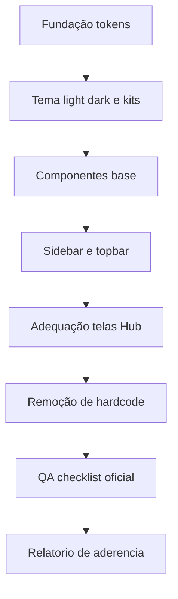

# Plano de Implantação — GrupoB UI Standard v1.0 no Hub de Integração Loze

Fonte canônica analisada: [`Documento_ui_standard_v_1_pacote_canonico.md`](../empresas_b/grupob/governance/Documentos%20Oficiais/Documento_ui_standard_v_1_pacote_canonico.md:1)

## Premissas e guardrails

- Preservar lógica de negócio e comportamento funcional
- Padronizar apenas UI/UX visual e tokens
- Não excluir módulo original do SagB
- Aplicar padrão como contrato, sem reinterpretar estrutura base

## Decisões iniciais para este sistema

1. Kit de cor inicial recomendado: **Purple** (aderente a Loze), com suporte a troca para demais kits oficiais
2. Implementar **light** e **dark** desde a base
3. Centralizar tokens em arquivo único no projeto separado
4. Iconografia padrão: **Lucide outline**

## Escopo técnico de adequação

### 1) Fundação de Design Tokens

- [ ] Criar arquivo de tokens globais com tipografia e densidade oficial
- [ ] Incluir escala tipográfica canônica do padrão
- [ ] Definir densidade de lista em `32px`
- [ ] Implementar tokens de superfície neutra e estados
- [ ] Implementar 5 kits oficiais com light/dark

Referência de contrato: [`Documento_ui_standard_v_1_pacote_canonico.md`](../empresas_b/grupob/governance/Documentos%20Oficiais/Documento_ui_standard_v_1_pacote_canonico.md:154)

### 2) Infra de Tema e Modo

- [ ] Adicionar atributos `data-mode` e `data-theme` no root da aplicação
- [ ] Criar mecanismo de alternância light/dark
- [ ] Criar mecanismo de troca entre kits aprovados
- [ ] Persistir preferência de tema no cliente

### 3) Base visual estrutural

- [ ] Garantir fonte oficial Rubik em toda aplicação
- [ ] Ajustar fundo global para neutro
- [ ] Ajustar shell, cards e superfícies para estilo ultra clean
- [ ] Eliminar bordas pesadas e sombras excessivas

### 4) Componentes base do sistema

- [ ] Botão primário/secundário no padrão oficial
- [ ] Inputs/select/textarea com fundo suave e foco por token
- [ ] Chips/pills/badges com legibilidade forte em dark
- [ ] Tabelas/listas compactas com header 800 e linhas 400

### 5) Navegação e hierarquia visual

- [ ] Sidebar ultra clean com ativo em cor cheia do tema
- [ ] Hover da sidebar em tonalidade suave
- [ ] Topbar limpa com CTA primário destacado
- [ ] Ajustar espaçamentos para densidade consistente

### 6) Iconografia e consistência

- [ ] Padronizar biblioteca de ícones para Lucide
- [ ] Remover ícones fora do padrão outline
- [ ] Remover emojis como ícone de sistema

### 7) Adequação por telas do Hub

- [ ] `HubIntegracaoPage` no novo padrão visual
- [ ] `IntegrationCatalog` com cards neutros e destaque por tokens
- [ ] `ConnectionManager` com estados visuais oficiais
- [ ] `ConnectionTest` com feedback por chips e status tokens
- [ ] `CredentialConfigModal` com formulário e CTA no padrão
- [ ] `ActivityLog` com legibilidade e densidade oficial

Arquivos-alvo iniciais: [`HubIntegracaoPage.tsx`](src/modules/hub-integracao/pages/HubIntegracaoPage.tsx), [`CredentialConfigModal.tsx`](src/modules/hub-integracao/components/CredentialConfigModal.tsx), [`ConnectionManager.tsx`](src/modules/hub-integracao/components/ConnectionManager.tsx)

### 8) Remoção de estilos locais não canônicos

- [ ] Mapear cores hardcoded e substituir por tokens
- [ ] Mapear fontes/weights fora da escala oficial
- [ ] Mapear alturas de linha/tabela fora de 32px
- [ ] Consolidar estilos em camadas globais + componentes base

### 9) QA de conformidade

- [ ] Rodar checklist oficial item a item
- [ ] Validar light/dark em telas críticas
- [ ] Validar contraste e legibilidade de chips no dark
- [ ] Validar que nenhuma funcionalidade foi alterada

### 10) Entregáveis finais

- [ ] Documento de aderência com desvios justificados
- [ ] Mapa de arquivos alterados
- [ ] Guia de uso dos tokens e kits
- [ ] Evidência visual antes/depois das telas do Hub

## Sequência de execução recomendada

## Critério de pronto

- 100% dos estilos visuais críticos do Hub referenciando tokens oficiais
- Light e dark ativos
- Um kit aprovado aplicado por padrão
- Sem hardcode de cor em componentes principais
- Checklist oficial atendido sem quebra funcional

