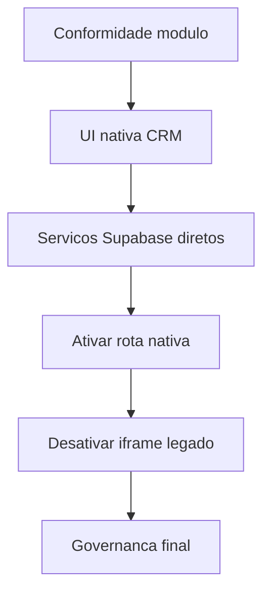

# Plano Executivo de Migração Total do CRM Ziplia para Módulo Nativo no SagB

## 1. Objetivo

Migrar o CRM Ziplia de integração por gateway iframe para módulo nativo em [`src/modules/crm_ziplia`](src/modules/crm_ziplia), com frontend e serviços internos no SagB, usando acesso direto ao Supabase e eliminando dependência operacional de [`_ventures/ziplia/modules/crm/web/server.ts`](_ventures/ziplia/modules/crm/web/server.ts).

## 2. Premissas de Governança

Base normativa adotada em [`docs/governanca/padrao_modulos_plugaveis.md`](docs/governanca/padrao_modulos_plugaveis.md).

Conformidade exigida no módulo:

- `index.ts`
- `manifest.ts`
- `routes.tsx`
- `module-doc.ts`
- `changelog.md`
- `history-chat.md`
- `decisions.md`
- `agent/prompt-ativacao-cline.md`
- `agent/persona.md`
- `agent/owner.md`
- `agent/session-log.md`
- `agent/_triagem/`

## 3. Arquitetura Alvo

### 3.1 Frontend nativo

- Tela principal do CRM nativa em [`src/modules/crm_ziplia/pages`](src/modules/crm_ziplia/pages).
- Componentes desacoplados em [`src/modules/crm_ziplia/components`](src/modules/crm_ziplia/components).
- Estado local por domínio em [`src/modules/crm_ziplia/store`](src/modules/crm_ziplia/store).

### 3.2 Camada de dados

- Serviços de dados em [`src/modules/crm_ziplia/services`](src/modules/crm_ziplia/services).
- Cliente Supabase compartilhado do SagB.
- Contratos de dados derivados de [`_ventures/ziplia/modules/crm/web/src/types.ts`](_ventures/ziplia/modules/crm/web/src/types.ts).

### 3.3 Navegação

- Rota principal de módulo plugável em [`src/modules/crm_ziplia/routes.tsx`](src/modules/crm_ziplia/routes.tsx).
- Registro no hub de módulos em [`src/core/modules/moduleRegistry.ts`](src/core/modules/moduleRegistry.ts).
- Renderização no shell principal em [`App.tsx`](App.tsx).

## 4. Estratégia de Migração

### Fase 1 - Estrutura e conformidade

1. Completar estrutura obrigatória de governança em [`src/modules/crm_ziplia`](src/modules/crm_ziplia).
2. Criar documentação técnica em `module-doc.ts` com escopo, dependências e contratos.
3. Registrar decisão formal de migração total em `decisions.md`.

### Fase 2 - Internalização do frontend

1. Quebrar o monólito de [`_ventures/ziplia/modules/crm/web/src/App.tsx`](_ventures/ziplia/modules/crm/web/src/App.tsx) em blocos:
   - Pipeline
   - Leads
   - Dashboard colaborador
   - Dashboard gestor
   - Inbox
   - Integrações
2. Migrar cada bloco para componentes nativos no módulo SagB.
3. Substituir rota atual de iframe por tela nativa interna.

### Fase 3 - Serviços e dados

1. Portar chamadas de [`_ventures/ziplia/modules/crm/web/src/lib/crmApi.ts`](_ventures/ziplia/modules/crm/web/src/lib/crmApi.ts) para [`src/modules/crm_ziplia/services`](src/modules/crm_ziplia/services).
2. Mapear e padronizar operações críticas:
   - leitura de leads
   - atualização de lead
   - leitura de estágios
   - leitura de métricas
   - trilha de auditoria
3. Garantir tratamento de erro padronizado no estilo SagB.

### Fase 4 - Entrada em produção interna

1. Tornar rota nativa padrão no módulo [`crm-ziplia`](src/modules/crm_ziplia/manifest.ts).
2. Manter fallback técnico temporário para gateway apenas como contingência.
3. Validar fluxo completo de navegação sidebar módulo retorno.

### Fase 5 - Desativação do legado

1. Remover dependência de execução manual do servidor externo.
2. Descontinuar caminho iframe em [`CrmZipliaFullscreenPage.tsx`](src/modules/crm_ziplia/pages/CrmZipliaFullscreenPage.tsx).
3. Atualizar documentação final de operação e governança do módulo.

## 5. Critérios de Aceite

- Módulo CRM abre direto no SagB sem iframe.
- Funcionalidades principais operam com Supabase direto.
- Estrutura documental obrigatória completa conforme padrão.
- Registro e navegação do módulo estáveis no shell do SagB.
- Fluxo sem dependência de terminal externo para uso do CRM.

## 6. Riscos e Mitigações

- Risco de regressão funcional por migração de monólito
  - Mitigação: migração por blocos com validação incremental por domínio.
- Risco de divergência de contrato de dados
  - Mitigação: contratos tipados e centralização em serviços do módulo.
- Risco de inconsistência visual
  - Mitigação: aderência ao design global do SagB e revisão de componentes.

## 7. Fluxo de Entrega

## 8. Checklist de Execução

- [ ] Criar arquivos obrigatórios de governança no módulo
- [ ] Migrar estrutura de páginas do CRM legado para componentes nativos
- [ ] Portar camada de serviços para `services` no módulo
- [ ] Integrar estado local por domínio
- [ ] Validar navegação e registro no ecossistema de módulos
- [ ] Desativar fluxo iframe e limpar código legado de acesso externo
- [ ] Atualizar documentação operacional final

