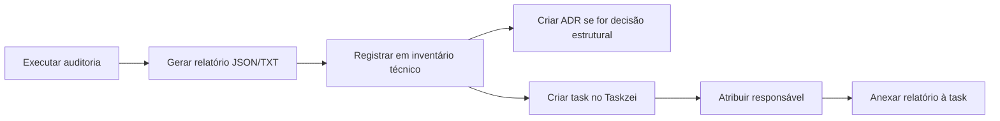

# Protocolo: Como Registrar Auditoria e Passar para Responsável

## 1. Contexto no Projeto SagB

O projeto já possui estrutura de documentação técnica em [`src/modules/central_padroes/docs`](00_sagb/src/modules/central_padroes/docs) com os seguintes diretórios:

| Diretório | Função |
|-----------|--------|
| [`00_indice`](00_sagb/src/modules/central_padroes/docs/00_indice) | Índices e mapas gerais |
| [`01_padroes_loze`](00_sagb/src/modules/central_padroes/docs/01_padroes_loze) | Padrões LOZE |
| [`02_sagb_canonico`](00_sagb/src/modules/central_padroes/docs/02_sagb_canonico) | Modelo canônico do SagB |
| [`03_inventarios_tecnicos`](00_sagb/src/modules/central_padroes/docs/03_inventarios_tecnicos) | Inventários técnicos |
| [`04_quarentena_e_riscos`](00_sagb/src/modules/central_padroes/docs/04_quarentena_e_riscos) | Riscos e quarentena técnica |
| [`05_decisoes_adr`](00_sagb/src/modules/central_padroes/docs/05_decisoes_adr) | ADRs (registros de decisão) |
| [`06_templates`](00_sagb/src/modules/central_padroes/docs/06_templates) | Templates de documentos |
| [`07_validacoes`](00_sagb/src/modules/central_padroes/docs/07_validacoes) | Validações técnicas |

## 2. Fluxo Recomendado



## 3. Passo a Passo

### Passo 1: Registrar como Inventário Técnico
Criar um arquivo em [`src/modules/central_padroes/docs/03_inventarios_tecnicos`](00_sagb/src/modules/central_padroes/docs/03_inventarios_tecnicos).

Exemplo de nome: `inventario-supabase-tabelas-2026-05-31.md`

Conteúdo sugerido:
```markdown
# Inventário de Tabelas Supabase - 31/05/2026

## Projeto
SagB - ref: hfcpisvogbdlbsxnkjdv

## Resumo
- Total de tabelas: 109
- Schema: public
- Maiores tabelas: cid_chunks (7.2MB), cid_outputs (2.8MB), chat_messages (2.7MB)
- Fonte: auditoria via `npx supabase inspect db table-stats --linked`

## Relatórios
- Texto: [`plans/auditoria_supabase_tabelas_2026-05-31.txt`](plans/auditoria_supabase_tabelas_2026-05-31.txt)
- JSON: [`plans/auditoria_supabase_tabelas_2026-05-31.json`](plans/auditoria_supabase_tabelas_2026-05-31.json)

## Observações
- [colocar o que foi encontrado de relevante]
```

### Passo 2 (opcional): Criar ADR se houver decisão
Se a auditoria revelar algo que exija decisão (ex: limpeza de tabelas, migração), criar em [`05_decisoes_adr`](00_sagb/src/modules/central_padroes/docs/05_decisoes_adr).

### Passo 3: Criar Tarefa no Taskzei
Usar o sistema de tasks do próprio projeto (Taskzei module em [`src/modules/taskzei`](00_sagb/src/modules/taskzei)):

- Título: "Revisão técnica - auditoria tabelas Supabase"
- Descrição: link para o inventário criado no passo 1
- Responsável: [nome da pessoa ou equipe]
- Prioridade: conforme necessidade

### Passo 4 (alternativo): GitHub Issue
Se preferir fora do app, abrir issue no repositório:
```
https://github.com/Dathex-Company/gpb-grupob-sagb/issues
```

Com template:
```markdown
## Assunto
Auditoria de tabelas Supabase - 31/05/2026

## Descrição
Inventário completo das 109 tabelas do schema public.

## Responsável
@nome-da-pessoa

## Anexos
[link para o arquivo de relatório]
```

## 4. Ferramentas Disponíveis no Projeto

- **Taskzei**: módulo interno de tasks (`/taskzei`)
- **Documentação LOZE**: estrutura de docs em `central_padroes/docs/`
- **GitHub Issues**: repositório remoto do projeto
- **Plans**: diretório `plans/` para rascunhos temporários
