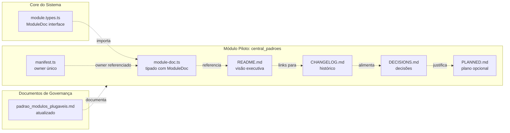

# Plano de Reforma — Módulo `central_padroes` como Piloto do Novo Padrão Universal

**Baseado na proposta:** [`proposta-novo-padrao-modulos.md`](../empresas_b/startyb/plans/proposta-novo-padrao-modulos.md)
**Módulo alvo:** [`src/modules/central_padroes/`](src/modules/central_padroes)

---

## Visão Geral

Reformar o módulo [`central_padroes`](src/modules/central_padroes) para ser o **módulo piloto** do novo padrão universal de módulos. Depois de reformado, ele servirá como template vivo para todos os demais módulos do SagB e QGs satélites (StartyB, 3forb, papob).

---

## Etapas

### Etapa 1: Adicionar Interface `ModuleDoc` no Core

**Arquivo:** [`src/core/modules/module.types.ts`](src/core/modules/module.types.ts)

Adicionar a interface `ModuleDoc` após as interfaces existentes:

```typescript
export interface ModuleDoc {
  /** Nome oficial de exibição do módulo */
  displayName: string;

  /** Propósito único do módulo (1-2 frases) */
  purpose: string;

  /** Versão semântica atual (deve bater com CHANGELOG.md) */
  version: string;

  /** Fronteiras: o que o módulo NÃO faz */
  boundaries?: string[];

  /** Integrações com outros módulos/sistemas */
  integrations?: {
    internal?: string[];
    external?: string[];
  };

  /** Dependências de dados */
  dataDependencies?: {
    supabaseTables?: string[];
    storageBuckets?: string[];
    localStorageKeys?: string[];
  };
}
```

**Critério de aceitação:** `ModuleDoc` exportável e importável por qualquer módulo.

---

### Etapa 2: Tipar `module-doc.ts` do `central_padroes`

**Arquivo:** [`src/modules/central_padroes/module-doc.ts`](src/modules/central_padroes/module-doc.ts)

Substituir o objeto solto por um tipado com `ModuleDoc`:

```typescript
import { ModuleDoc } from '../../core/modules/module.types';

export const moduleDoc: ModuleDoc = {
  displayName: 'Central de Padrões',
  purpose: 'Consolidar, validar e publicar padrões oficiais de código, design, nomenclatura e arquitetura do SagB.',
  version: '1.0.0',
  boundaries: [
    'não implementa padrões — apenas os documenta e audita',
    'não substitui o design system — apenas o referencia',
    'não gerencia código de outros módulos — apenas define as regras'
  ],
  integrations: {
    internal: [
      'src/core/modules/moduleRegistry.ts'
    ],
    external: [
      'AI Proxy (consulta de padrões)',
      'Governança SagB'
    ]
  },
  dataDependencies: {
    supabaseTables: [],
    storageBuckets: [],
    localStorageKeys: []
  }
};
```

**Mudanças em relação ao atual:**
- Remove `nome_oficial` → vira `displayName`
- Remove `versao` → vira `version`
- Remove `resumo` → vira `purpose`
- Remove `fontes_de_dados` → vira `dataDependencies`
- Remove `servicos_e_integracoes` → vira `integrations`
- Remove `ativos_reutilizaveis` → vai para `README.md`
- Remove `riscos_de_duplicacao` → vai para `README.md`
- Remove `ownership` → owner fica SOMENTE em `manifest.ts`

**Critério de aceitação:** `moduleDoc` tipado como `ModuleDoc`, compilação TypeScript sem erros.

---

### Etapa 3: Criar `README.md` (Visão Executiva)

**Arquivo novo:** [`src/modules/central_padroes/README.md`](src/modules/central_padroes/README.md)

Conteúdo:

```markdown
# Central de Padrões

Módulo oficial do SagB para consolidar, validar e publicar padrões de código, design,
nomenclatura e arquitetura. Serve como a fonte única da verdade para todas as regras
que os módulos e QGs do ecossistema devem seguir.

## Como usar

1. Leia os padrões em [`docs/`](docs/) antes de iniciar qualquer novo módulo ou projeto.
2. Consulte o [`design-system.md`](docs/design-system.md) para tokens visuais e diretrizes de interface.
3. Consulte o [`stack-e-infra.md`](docs/stack-e-infra.md) para padrão técnico.
4. Registre desvios explicitamente com justificativa técnica em `DECISIONS.md`.

## Ativos Reutilizáveis

| Ativo | Tipo | Onde encontrar |
|---|---|---|
| Catálogo único de padrões | Documentação | `docs/` |
| Design System | Tokens visuais | `docs/design-system.md` |
| Stack e Infra | Padrão técnico | `docs/stack-e-infra.md` |

## Riscos de Duplicação

- Padrões paralelos em docs soltos podem gerar conflitos de implementação.
- **Prevenção:** toda decisão de padrão deve ser registrada em `DECISIONS.md` e referenciada aqui.

## Links

- [Padrão de Módulos Plugáveis](../../docs/governanca_sagb/padrao_modulos_plugaveis.md)
- [Padrão Unificado de Governança](../../docs/governanca_sagb/padrao_unificado_governanca.md)
```

**Critério de aceitação:** `README.md` existe com visão executiva, como usar, ativos e riscos. Menos de 50 linhas.

---

### Etapa 4: Renomear `changelog.md` → `CHANGELOG.md`

**Arquivo:** [`src/modules/central_padroes/changelog.md`](src/modules/central_padroes/changelog.md) → `CHANGELOG.md`

Mudanças:
1. Renomear arquivo para `CHANGELOG.md` (UPPERCASE universal)
2. Ajustar título para `# CHANGELOG — Central de Padrões`
3. Manter conteúdo existente (versão `[Unreleased]` com as mudanças já listadas)
4. Seguir formato keepachangelog: versões em ordem cronológica reversa

Conteúdo atualizado:

```markdown
# CHANGELOG — Central de Padrões

Todas as mudanças relevantes no módulo Central de Padrões serão registradas aqui.

## 1.0.0 — 2026-04-13

- Criação inicial da estrutura modular plugável.
- Criação do agente guardião Zico Padron.
- Migração dos padrões da pasta legada para o novo formato de módulo.
- Alinhamento ao padrão consolidado de módulos.
```

**Critério de aceitação:** Arquivo renomeado, conteúdo preservado e formatado.

---

### Etapa 5: Renomear `decisions.md` → `DECISIONS.md`

**Arquivo:** [`src/modules/central_padroes/decisions.md`](src/modules/central_padroes/decisions.md) → `DECISIONS.md`

Mudanças:
1. Renomear arquivo para `DECISIONS.md` (UPPERCASE universal)
2. Ajustar título para `# DECISIONS — Central de Padrões`
3. Manter conteúdo existente (já está em formato de tabela data/decisão)

Conteúdo:

```markdown
# DECISIONS — Central de Padrões

Registro das decisões estruturais e operacionais do módulo.

| Data | Decisão | Motivo |
|---|---|---|
| 2026-04-12 | Mover documentação de `docs/standards` para `src/modules/central_padroes` | Alinhar à arquitetura oficial de módulo plugável |
| 2026-04-12 | Nomear agente como Zico Padron | Definição do diretor estratégico |
| 2026-04-13 | Owner no manifest.ts, module-doc em estrutura padrão | Alinhamento ao padrão do piloto |
```

**Critério de aceitação:** Arquivo renomeado, conteúdo migrado para tabela.

---

### Etapa 6: Renomear `plano_modulo.md` → `PLANNED.md`

**Arquivo:** [`src/modules/central_padroes/plano_modulo.md`](src/modules/central_padroes/plano_modulo.md) → `PLANNED.md`

Mudanças:
1. Renomear arquivo para `PLANNED.md` (UPPERCASE universal, nome em inglês)
2. Manter conteúdo existente (já é pequeno e limpo, 19 linhas)

**Critério de aceitação:** Arquivo renomeado, conteúdo preservado.

---

### Etapa 7: Remover Duplicação de Owner

**Arquivos envolvidos:** [`manifest.ts`](src/modules/central_padroes/manifest.ts), [`module-doc.ts`](src/modules/central_padroes/module-doc.ts)

**O que fazer:**
- `manifest.ts` **já tem** `owner: { type: 'agent', id: 'zico-padron', displayName: 'Zico Padron' }` ✅ OK
- `module-doc.ts` tinha `ownership: { owner_principal: 'Zico Padron', owner_backup: 'A DEFINIR' }` → **removido** na Etapa 2 (ModuleDoc não tem campo owner)

**Regra:** Owner é declarado em **um único lugar**: `manifest.ts`. Ponto final.

---

### Etapa 8: Atualizar `index.ts` (se necessário)

**Arquivo:** [`src/modules/central_padroes/index.ts`](src/modules/central_padroes/index.ts)

O `index.ts` já exporta `moduleDoc` — como o `module-doc.ts` foi tipado mas a exportação permanece a mesma, **nenhuma mudança necessária**.

```typescript
export { manifest as centralPadroesManifest } from './manifest';
export { routes as centralPadroesRoutes } from './routes';
export { moduleDoc as centralPadroesModuleDoc } from './module-doc';
```

**Critério de aceitação:** Nenhuma mudança — compilação continua funcionando.

---

### Etapa 9: Atualizar `padrao_modulos_plugaveis.md`

**Arquivo:** [`docs/governanca_sagb/padrao_modulos_plugaveis.md`](docs/governanca_sagb/padrao_modulos_plugaveis.md)

Mudanças necessárias:

**9.1 — Estrutura de Diretórios (seção 1)**
Substituir a estrutura atual pela nova:

```text
src/modules/<id_canonico_do_modulo>/
├── index.ts                     # Ponto de exportação (manifest, routes, moduleDoc)
├── manifest.ts                  # Metadados + owner (ModuleManifest)
├── module-doc.ts                # Contrato técnico TIPADO (ModuleDoc)
├── routes.tsx                   # Rotas React (ModuleRoute)
│
├── README.md                    # Visão executiva do módulo (obrigatório)
├── CHANGELOG.md                 # Histórico de versões (obrigatório, UPPERCASE)
├── DECISIONS.md                 # Decisões arquiteturais (obrigatório, UPPERCASE)
├── PLANNED.md                   # Plano de evolução (OPCIONAL, UPPERCASE)
│
├── agent/                       # 4 arquivos canônicos
├── pages/
├── components/
├── services/
├── store/
└── docs/
```

**9.2 — Seção 1.2 (Papel de cada trilha documental)**
Atualizar para refletir os novos papéis:

| Arquivo | Papel | O que contém |
|---|---|---|
| `README.md` | Visão executiva | Propósito, como usar, ativos, riscos |
| `CHANGELOG.md` | Histórico de versões | Versões com data + mudanças |
| `DECISIONS.md` | Decisões arquiteturais | Tabela data/decisão/motivo |
| `PLANNED.md` | Plano de evolução (opcional) | Checklist de etapas futuras |
| `module-doc.ts` | Contrato técnico tipado | displayName, purpose, version, boundaries, integrations |
| `manifest.ts` | Metadados + owner | id, route, icon, owner |

**9.3 — Checklist de Conformidade (seção 7)**
Atualizar:
- Item 3: `plano_modulo.md` + `decisions.md` + `changelog.md` → `README.md` + `CHANGELOG.md` + `DECISIONS.md` (+ `PLANNED.md` opcional)
- Adicionar: `module-doc.ts` deve implementar `ModuleDoc`

**9.4 — Anti-Drift (seção 8)**
Atualizar item 3 (validação estrutural cruzada):
- `plano_modulo.md` + `decisions.md` + `changelog.md` → `README.md` + `CHANGELOG.md` + `DECISIONS.md`

---

## Resumo do que será criado/alterado/excluído

| Arquivo | Ação |
|---|---|
| `src/core/modules/module.types.ts` | ✏️ Adicionar interface `ModuleDoc` |
| `src/modules/central_padroes/module-doc.ts` | ✏️ Reescrever com `ModuleDoc` tipado |
| `src/modules/central_padroes/README.md` | ➕ Criar (visão executiva) |
| `src/modules/central_padroes/changelog.md` | ➡️ Renomear para `CHANGELOG.md` |
| `src/modules/central_padroes/decisions.md` | ➡️ Renomear para `DECISIONS.md` |
| `src/modules/central_padroes/plano_modulo.md` | ➡️ Renomear para `PLANNED.md` |
| `docs/governanca_sagb/padrao_modulos_plugaveis.md` | ✏️ Atualizar estrutura + papéis + checklist |

**Nada é excluído** — apenas renomeado ou reescrito. O conteúdo existente é preservado e reorganizado.

---

## Mapa de Dependências



---

## Ordem de Execução

1. **Etapa 1** — `module.types.ts`: adicionar `ModuleDoc` (sem quebra)
2. **Etapa 2** — `module-doc.ts`: tipar com `ModuleDoc`
3. **Etapa 3** — `README.md`: criar
4. **Etapa 4** — `changelog.md` → `CHANGELOG.md`: renomear
5. **Etapa 5** — `decisions.md` → `DECISIONS.md`: renomear
6. **Etapa 6** — `plano_modulo.md` → `PLANNED.md`: renomear
7. **Etapa 7** — Verificar duplicação de owner (já resolvida na Etapa 2)
8. **Etapa 8** — Verificar `index.ts` (nenhuma mudança necessária)
9. **Etapa 9** — `padrao_modulos_plugaveis.md`: atualizar

**Etapas 1-8** são no módulo piloto. **Etapa 9** é no documento de governança.
