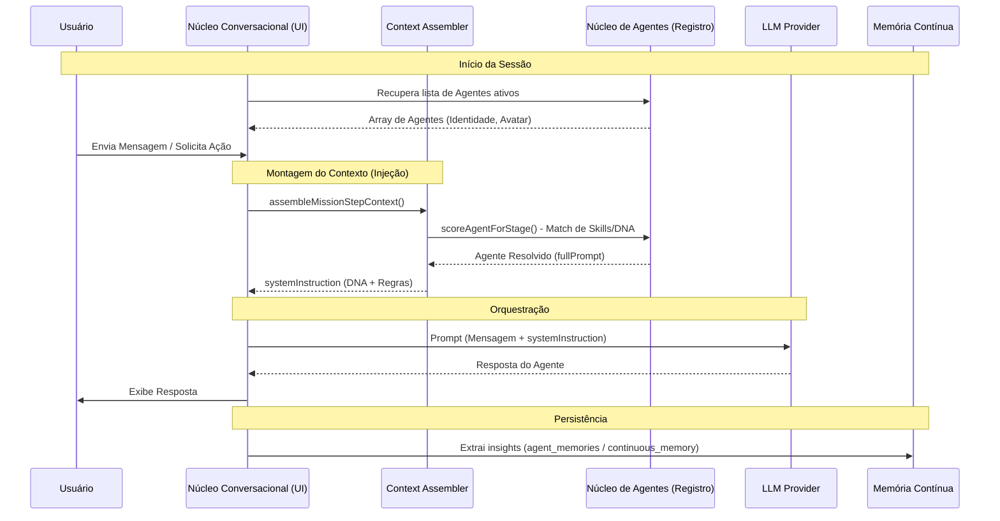

# Relatório de Arquitetura: Integração entre `nucleo-conversacional` e `nucleo_de_agentes`

## Visão Geral

O ecossistema SagB é orquestrado por uma forte separação de responsabilidades. O **`nucleo_de_agentes`** atua como a espinha dorsal de identidade, governança e memória profunda, enquanto o **`nucleo-conversacional`** é a camada de interface, fluxo conversacional e persistência de sessões interativas.

### 1. `nucleo_de_agentes` (A Identidade e Memória)
- **Responsabilidade**: Manter o cadastro oficial de agentes, seu DNA (prompts, roles), regras de compliance, cultura global (`governance_global_culture`), e memória profunda (através de `continuousMemory.ts`).
- **Tabelas Principais**: `agents`, `governance_*`, `continuous_memory_*`.
- **Serviços Críticos**: 
  - `services/contextAssembler.ts`: Recupera agentes do registro oficial (`agents`), faz o *match* de skills e foca na resolução de quem deve atuar em um determinado papel, injetando o `fullPrompt` / `dnaIndividualPrompt`.
  - `services/continuousMemory.ts`: Lida com transcrição de áudio, abstração e sumarização do histórico profundo.

### 2. `nucleo-conversacional` (A Interface e Orquestração de LLMs)
- **Responsabilidade**: Gerenciar as conversas diretas com o usuário, multi-provider, interface gráfica (`SystemicVision.tsx`, `ConversationsView.tsx`), instrumentação (qualidade), e sessões de chat.
- **Tabelas Principais**: `chat_sessions`, `chat_messages`, `agent_memories`.
- **Componentes**: Orquestra chamadas a providers (Gemini, Deepseek, etc) utilizando os contextos recebidos do núcleo de agentes.

---

## Fluxo de Informação e Injeção de Agentes

A integração ocorre de forma fluida onde o `nucleo-conversacional` depende ativamente dos dados gerados pelo `nucleo_de_agentes`.

1. **Recuperação de Identidade**: O `nucleo-conversacional` consome a lista oficial de agentes (injetada via props em componentes como `ConversationsView.tsx`). Não há duplicidade; o núcleo conversacional apenas lê o estado gerenciado pelo núcleo de agentes.
2. **Construção de Contexto (Injeção)**: Antes de uma interação ou passo de missão, o `services/contextAssembler.ts` é acionado.
   - Ele analisa o banco oficial de agentes.
   - Faz um "score" heurístico (Match de skills, foco, papel preferencial).
   - Resolve o agente vencedor e retorna o seu `fullPrompt` em conjunto com a diretriz da missão (`systemInstruction`).
3. **Execução Conversacional**: Com o agente injetado (seu DNA + Contexto montado), o `nucleo-conversacional` utiliza seus conectores de provider (`services/gemini.ts`, etc) para gerar a resposta.
4. **Persistência**: A resposta gerada é salva em `chat_messages`, e fragmentos vitais são extraídos para `agent_memories` ou sinalizados para o `continuousMemory.ts` (retornando ao `nucleo_de_agentes` como conhecimento).

---

## Diagrama de Arquitetura

## Conclusão
A dependência entre os dois módulos é muito bem definida: o `nucleo_de_agentes` fornece o **"Quem"** (Identidade, Regras, Memória) e o `nucleo-conversacional` fornece o **"Como"** (Sessões, UI de Chat, Roteamento Multi-Provider). Os agentes são injetados sob demanda por meio de serviços como `contextAssembler.ts`, garantindo que o DNA centralizado e atualizado seja sempre o executado na ponta.