# 🧾 Auditoria Comparativa — Central de Padrões SagB x Documentação TaskZei

**Data:** 12-06-2026  
**Status:** 🟢 Concluída  
**Decisão:** 🟣 Central de Padrões deve ser módulo oficial; TaskZei deve ser piloto documental.

---

## 📌 Resumo executivo

| Item | Resultado |
|---|---|
| Central de Padrões | 🟢 Mais madura como módulo oficial |
| TaskZei | 🟢 Mais forte como piloto LOZE-TRACE/documentação guiada |
| Decisão recomendada | 🟣 Fundir padrões do TaskZei na Central |
| Ação destrutiva | 🟢 Nenhuma |
| Risco de renomear agora | 🔴 Alto |

---

## 🧭 Caminhos analisados

| Projeto | Caminho absoluto |
|---|---|
| Central de Padrões | `Z:\00_sagb\src\modules\central_padroes` |
| TaskZei | `Z:\02_ventures\LOZE\05_operacoes\01-produtos\02-laboratorio\taskzei-loze` |

---

## 📊 Notas de maturidade

| Critério | Central de Padrões | TaskZei |
|---|---|---|
| Módulo oficial | 🟢 9/10 | 🟡 6/10 |
| Documentação guiada | 🟡 6/10 | 🟢 9/10 |
| Rastreabilidade | 🟡 6/10 | 🟢 9/10 |
| Governança multiárea | 🟢 9/10 | 🟡 6/10 |
| Maturidade geral | 🟢 8,2/10 | 🟢 7,6/10 |

---

## 🧭 Decisão visual

```mermaid
flowchart TD
  A[Comparar Central x TaskZei] --> B{Quem vira oficial?}
  B --> C[Central de Padrões]
  A --> D[O que aproveitar do TaskZei?]
  D --> E[LOZE-TRACE]
  D --> F[Documentação Guiada]
  D --> G[Matriz R0-R6]
  C --> H[Preservar acervo e serviços]
  E --> I[Canonizar padrões]
  F --> I
  G --> I
```

---

## 🟢 Pontos fortes da Central

- 🧩 Módulo próprio.
- 🧱 Layout, páginas e serviços.
- 🧾 ADRs, inventários, rollbacks e runbooks.
- 🛡️ Governança e aprovações.

## 🟡 Pontos fracos da Central

- 🟡 Naming antigo com underline.
- 🟡 Encoding visual em alguns documentos.
- 🟠 Sidebar com inconsistências: `audit/audits`, `module-links/modules`, `agent-runs/agent-mode`.
- 🔴 Não renomear tudo sem plano.

## 🟢 Pontos fortes do TaskZei

- 🧾 LOZE-TRACE real.
- 🧪 Smoke tests com evidência.
- 🧠 Linguagem guiada.
- ⚙️ Matriz de comandos R0-R6.

## 🟡 Pontos fracos do TaskZei

- 🟡 Typecheck pendente.
- 🟡 README web desatualizado sobre Supabase real.
- 🟠 Não é módulo horizontal de governança.

---

## ➡️ Plano em fases

| Fase | Ação | Risco |
|---|---|---|
| 1 | Canonizar padrões visuais e LOZE-TRACE | 🟡 R2 |
| 2 | Curar documentos antigos | 🟡 R2 |
| 3 | Planejar saneamento de sidebar/rotas | 🟠 R3 |
| 4 | Integrar Monitoramento | 🟠 R3/R5 se tiver banco |
| 5 | Formalizar aprovações | 🟡 R2 |

---

## 🚫 Não fazer agora

- Não apagar Central.
- Não renomear `central_padroes`.
- Não alterar rota.
- Não migrar acervo.
- Não fazer deploy.
- Não rodar migration.
