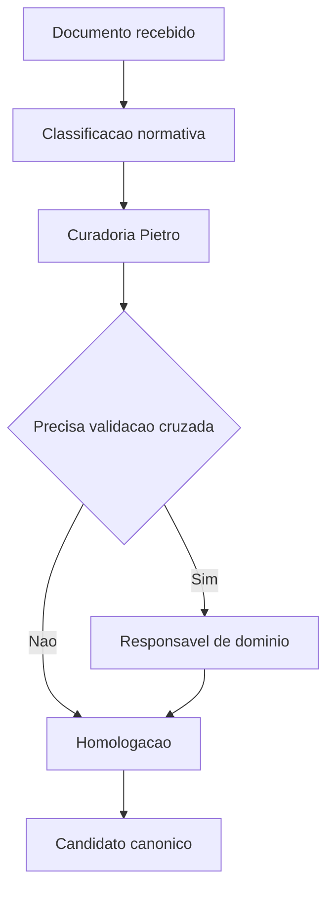

# Documento Mestre — Governança da Central de Padrões — v3.0 — 07-06-2026

## Cabeçalho interno

| Campo | Informação |
|---|---|
| Código do documento | DM-00-GOV |
| Documento | Documento Mestre |
| Domínio normativo | Governança da Central de Padrões |
| Responsável atual | Pietro Carboni |
| Versão | v3.0 |
| Data da versão | 07-06-2026 |
| Status | em_curadoria |
| Formato | Markdown .md |
| Pasta de destino | estrutura-de-documentos-oficiais/00-governanca-central-padroes/ |
| Validação final | Pietro Carboni |
| Palavras-chave | governança, canonicidade, padrões, aprovação, curadoria |
| Exemplos de uso | aprovar padrão, classificar documento, resolver conflito normativo |
| Domínios relacionados | todos os domínios normativos |
| Responsáveis relacionados | Pietro Carboni, Rodrigues/Kane, responsáveis de domínio |

## 1. Objetivo do documento

Definir a governança da Central de Padrões, incluindo papéis, ciclo de vida, critérios de canonicidade, dependências, registros, validações e ordem de oficialização.

## 2. Escopo do domínio normativo

Este domínio cobre a camada normativa transversal que organiza os documentos, padrões, decisões, lacunas e validações da Central de Padrões.

## 3. O que este domínio define

- Critérios de entrada na Central.
- Tipos normativos oficiais.
- Fluxo bruto → curadoria → homologação → canônico.
- Responsabilidades e aprovações.
- Regras de publicação e evidência.

## 4. O que este domínio não define

Não executa programação, segurança operacional, design visual, naming, plano de negócio, cursos ou operação de processos. Cada área especializada executa o próprio domínio.

## 5. Fontes analisadas

| Fonte | Status | Uso |
|---|---|---|
| 00_pietro_carboni v1.0 | analisada | base principal |
| documento-base 99 | analisada | régua estrutural |
| fontes v2.0 | pendente | registrar ausência se não localizada |

### Curadoria 97.2 — leitura comparativa incorporada

| Critério de busca | Resultado da curadoria | Incorporação no corpo |
|---|---|---|
| Pietro, governança, padrões, arquitetura mestra, v1.0 | fonte conceitual considerada | papéis, canonicidade, dependências e fluxo de aprovação reforçados |
| Pietro, governança, v2.0 | fonte não confirmada automaticamente nesta rodada | pendência explícita mantida para validação posterior |
| documento-base 99 | confirmado | preservação de status `em_curadoria`, versão `v3.0` e 30 seções |

## 6. Síntese executiva

A governança da Central existe para impedir duplicidade, improviso e falsa oficialização. Nenhum documento bruto deve ser tratado como canônico sem validação final.

## 7. Mapa visual do domínio

```text
Entrada → classificação → curadoria → validação → homologação → canonicidade → monitoramento
```

## 8. Princípios

| Código | Princípio | Status |
|---|---|---|
| GOV-PRI-001 | Padrão antes da escala | em_curadoria |
| GOV-PRI-002 | Documento bruto não é fonte canônica | em_curadoria |
| GOV-PRI-003 | Responsável claro por área | em_curadoria |

## 9. Políticas

| Código | Política | Status |
|---|---|---|
| GOV-POL-001 | Política de canonicidade | previsto |
| GOV-POL-002 | Política de dependência entre domínios | previsto |

## 10. Regras centrais

- Não chamar tudo de padrão.
- Não chamar tudo de protocolo.
- Toda aprovação deve gerar registro.
- Todo conflito entre domínios deve ser registrado.
- Documento bruto não pode ser usado como fonte canônica.
- Responsável especializado alimenta o domínio; Pietro classifica, consolida e aprova a entrada normativa.
- Padrão só avança quando tiver tipo normativo, dono, status, fonte e evidência mínima.

## 11. Padrões oficiais e candidatos a padrão

| Código | Item | Tipo normativo | Status | Prioridade | Responsável | Validação necessária |
|---|---|---|---|---|---|---|
| GOV-PAD-001 | Padrão de Documento Mestre | PAD | em_curadoria | Alta | Pietro Carboni | Pietro |
| GOV-PAD-002 | Padrão de criação de Documentos Mestres | PAD | em_curadoria | Alta | Pietro Carboni | Pietro |

## 12. Protocolos reais

| Código | Protocolo | Situação | Saída esperada |
|---|---|---|---|
| GOV-PRT-001 | Protocolo de aprovação de padrão | item candidato a canônico | decisão registrada |

## 13. Processos

1. Receber documento.
2. Classificar tipo normativo.
3. Identificar responsável.
4. Registrar dependências.
5. Validar com domínio responsável.
6. Homologar ou devolver.

## 14. Procedimentos operacionais

- Conferir nome, versão e data.
- Verificar status permitido.
- Registrar fonte analisada.
- Marcar lacunas.
- Listar subdocumentos futuros.

## 15. Checklists obrigatórios

- [ ] Documento tem cabeçalho.
- [ ] Status não é canonico_oficial.
- [ ] Responsável está claro.
- [ ] Fontes foram registradas.
- [ ] Dependências foram listadas.

## 16. Matrizes obrigatórias

| Tipo | Pergunta de decisão | Exemplo |
|---|---|---|
| Princípio | orienta comportamento amplo? | Padrão antes da escala |
| Política | define posição institucional? | Política de canonicidade |
| Protocolo | tem sequência obrigatória? | Aprovação de padrão |
| Registro/Evidência | prova que algo aconteceu? | Registro de aprovação |
| Matriz | ajuda a decidir? | Matriz de classificação normativa |

## 17. Registros e evidências obrigatórias

- Registro de aprovação.
- Registro de rejeição.
- Registro de dependência.
- Registro de fonte.
- Registro de divergência.
- Registro de validação cruzada.
- Registro de bloqueio por conflito.
- Registro de mudança de status.

## 18. Fluxos Mermaid



## 19. Dependências com outros domínios

| Tema | Depende de quem | Motivo | Tipo de dependência | Registro sugerido |
|---|---|---|---|---|
| Segurança | Pedro Gazan | fronteira governança/segurança | validação cruzada | GOV-DEP-SEG |
| Sistemas | Sávio Codare | execução no SagB | técnica | GOV-DEP-TEC |

## 20. Conflitos de escopo

Conflitos devem ser registrados quando um padrão parecer pertencer a mais de um domínio.

## 21. Riscos se os padrões não forem seguidos

| Risco | Causa provável | Impacto | Como prevenir | Quem acompanha |
|---|---|---|---|---|
| Falsa canonicidade | documento bruto usado como oficial | alto | validação Pietro | Pietro |
| Duplicidade | dois domínios definem regra semelhante | médio | matriz de dependências | Pietro |

## 22. O que deve ser monitorado pela Central de Monitoramento

| Item a monitorar | Por que monitorar | Origem do dado | Responsável | Ação se der alerta |
|---|---|---|---|---|
| padrão sem dono | risco operacional | Central de Padrões | Pietro | bloquear publicação |
| padrão vencido | perda de validade | Supabase futuro | Pietro | abrir revisão |

## 23. Relação com Biblioteca de Módulos Base, se aplicável

Define regras que módulos base devem consultar antes de serem criados, aprovados ou reutilizados.

## 24. Relação com módulos executores, se aplicável

O módulo SagB Central de Padrões deve executar consulta, auditoria, aprovação e publicação conforme esta governança.

## 25. Lacunas e validações pendentes

| Lacuna | Impacto | Quem valida | Prioridade | Recomendação |
|---|---|---|---|---|
| inventário completo v1/v2 | consolidação parcial | Pietro | Alta | validar fontes |
| fronteira Pietro/Pedro | conflito de escopo | Pietro e Pedro | Alta | registrar decisão |

## 26. Decisões já tomadas

- Documento Mestre v3.0 nasce em_curadoria.
- Subdocumentos derivados não serão criados nesta fase.
- Supabase será fonte operacional futura.

## 27. Subdocumentos oficiais previstos para extração

| Código sugerido | Tipo | Nome do subdocumento | Prioridade | Status | Arquivo futuro sugerido |
|---|---|---|---|---|---|
| GOV-POL-001 | política | Política de Canonicidade | Alta | previsto | gov-pol-001-politica-canonicidade-v1.0-07-06-2026.md |
| GOV-PRT-001 | protocolo | Protocolo de Aprovação de Padrão | Alta | previsto | gov-prt-001-protocolo-aprovacao-padrao-v1.0-07-06-2026.md |
| GOV-MTZ-001 | matriz | Matriz de Classificação Normativa | Alta | previsto | gov-mtz-001-matriz-classificacao-normativa-v1.0-07-06-2026.md |

## 28. Padrões atômicos sugeridos para o módulo SagB

- Gate de canonicidade.
- Registro de aprovação.
- Registro de dependência.
- Busca por status e responsável.
- Política de status normativo.
- Protocolo de rejeição e devolução.
- Protocolo de publicação controlada.
- Registro de fonte documental versus fonte operacional.

### Curadoria 97.3 — reforço máximo incorporado ao corpo

| Pergunta prática | Resposta esperada pela Central | Seção relacionada |
|---|---|---|
| Quando um documento vira canônico? | depois de validação, evidência e aprovação Pietro | 10, 12, 17 |
| O que bloqueia a publicação? | ausência de dono, fonte, evidência, aprovação ou conflito aberto | 21, 25 |
| Qual diferença entre acervo e fonte operacional? | pasta MD audita; Supabase opera; módulo SagB executa | 22, 24 |

| Código sugerido adicional | Tipo | Nome do subdocumento | Prioridade | Status | Arquivo futuro sugerido |
|---|---|---|---|---|---|
| GOV-PRT-002 | protocolo | Protocolo de Rejeição de Padrão | Alta | previsto | gov-prt-002-protocolo-rejeicao-padrao-v1.0-07-06-2026.md |
| GOV-PRT-003 | protocolo | Protocolo de Publicação Controlada | Alta | previsto | gov-prt-003-protocolo-publicacao-controlada-v1.0-07-06-2026.md |
| GOV-RGT-001 | registro | Registro de Fonte e Evidência Normativa | Alta | previsto | gov-rgt-001-registro-fonte-evidencia-normativa-v1.0-07-06-2026.md |
| GOV-PAD-003 | padrão | Padrão de Status Normativo | Alta | previsto | gov-pad-003-padrao-status-normativo-v1.0-07-06-2026.md |

## 29. Ordem recomendada de canonização

1. Política de canonicidade.
2. Matriz de tipos normativos.
3. Protocolo de aprovação.
4. Registro de evidências.

## 30. Síntese final

Este domínio é o eixo da Central de Padrões. Sem governança, os demais documentos viram acervo; com governança, viram sistema normativo.

## Anexo 97.1 — Auditoria e enriquecimento de curadoria

### Fontes v1.0/v2.0 consideradas

| Fonte | Situação | Conteúdo aproveitado | Pendência |
|---|---|---|---|
| Fonte v1.0 de governança/Pietro | considerada como fonte principal esperada | papel de Pietro, ciclo de vida, tipos normativos, arquitetura mestra | validar inventário completo das fontes originais |
| Fonte v2.0 de governança/Pietro | não confirmada nesta rodada | sem incorporação direta | registrar ausência se realmente não existir |
| Documento-base 99 | usado como régua | cabeçalho, neutralidade, 30 seções, status, recursos visuais | nenhuma |

### Exemplos práticos reforçados

| Situação | Como a governança deve agir | Resultado esperado |
|---|---|---|
| Documento bruto apresentado como oficial | bloquear canonicidade e exigir curadoria | status `em_curadoria` ou `precisa_validacao` |
| Padrão técnico sem dono | devolver para Sávio ou responsável técnico | dono e validação registrados |
| Conteúdo de segurança em documento de governança | registrar dependência com Pedro Gazan | validação cruzada antes de aprovar |

### Reforço para busca conversacional futura

Perguntas que este documento deve responder:

- Quem aprova um padrão?
- Quando um documento vira canônico?
- O que fazer quando dois domínios entram em conflito?
- Qual status usar para documento ainda em curadoria?

### Checklist final de enriquecimento

- [x] Mantém status `em_curadoria`.
- [x] Reforça dependência com todos os domínios.
- [x] Inclui exemplos práticos.
- [x] Registra fonte v2.0 como pendência quando não confirmada.
