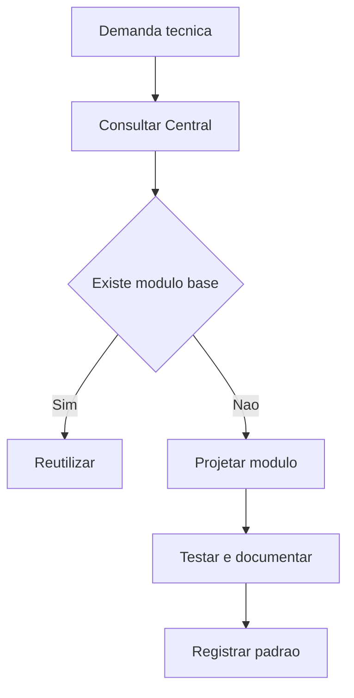

# Documento Mestre — Padrões Técnicos da Loze — v3.0 — 07-06-2026

## Cabeçalho interno

| Campo | Informação |
|---|---|
| Código do documento | DM-01-TEC-LOZE |
| Documento | Documento Mestre |
| Domínio normativo | Padrões Técnicos da Loze |
| Responsável atual | Sávio Codare |
| Versão | v3.0 |
| Data da versão | 07-06-2026 |
| Status | em_curadoria |
| Formato | Markdown .md |
| Pasta de destino | estrutura-de-documentos-oficiais/01-padroes-tecnicos-loze/ |
| Validação final | Pietro Carboni |
| Palavras-chave | arquitetura, programação, módulo, Supabase, deploy, Loze |
| Exemplos de uso | criar app, revisar módulo, padronizar stack |
| Domínios relacionados | governança, segurança, UX, agentes, IA |
| Responsáveis relacionados | Sávio Codare, Pietro Carboni, Pedro Gazan, Alice Montini |

## 1. Objetivo do documento
Consolidar os padrões técnicos da Loze para sistemas, arquitetura, programação, módulos, integrações, banco, ambientes e entrega técnica.

## 2. Escopo do domínio normativo
Inclui padrões de módulos, stack, repositórios, Supabase, deploy, integrações, documentação técnica e critérios técnicos pré-dev.

## 3. O que este domínio define
- Arquitetura técnica.
- Contratos de módulos.
- Organização de código.
- Padrões de integração.
- Critérios de reutilização técnica.

## 4. O que este domínio não define
Não define design visual, política de segurança, método de negócio, naming ou governança final de canonicidade.

## 5. Fontes analisadas
| Fonte | Status | Uso |
|---|---|---|
| Sávio v1.0 | esperada | base técnica inicial |
| Sávio v2.0 | esperada | evolução técnica |
| documento 99 | analisado | régua estrutural |

### Curadoria 97.2 — leitura comparativa incorporada

| Critério de busca | Resultado da curadoria | Incorporação no corpo |
|---|---|---|
| Sávio, Codare, sistemas, arquitetura, programação, v1.0 | fonte técnica considerada | módulo plugável, stack, Supabase, deploy e organização técnica reforçados |
| Sávio, técnico, Loze, v2.0 | fonte não confirmada automaticamente nesta rodada | pendência mantida para comparação posterior |
| módulo, manifest, rota, RPC, RLS | conteúdo conceitual incorporado | regras centrais, checklist, riscos e monitoramento ampliados |

## 6. Síntese executiva
O domínio técnico precisa transformar boas práticas em padrões executáveis por módulos, evitando improviso, retrabalho e dependência excessiva de memória tácita.

## 7. Mapa visual do domínio
```text
Ideia técnica → arquitetura → módulo → integração → teste → deploy → monitoramento
```

## 8. Princípios
| Código | Princípio | Status |
|---|---|---|
| TEC-PRI-001 | Modularidade antes de expansão | em_curadoria |
| TEC-PRI-002 | Contrato técnico explícito | em_curadoria |
| TEC-PRI-003 | Reuso antes de criar do zero | em_curadoria |

## 9. Políticas
| Código | Política | Status |
|---|---|---|
| TEC-POL-001 | Política de módulo plugável | previsto |
| TEC-POL-002 | Política de integração com Supabase | previsto |

## 10. Regras centrais
- Todo módulo deve ter manifesto.
- Todo módulo deve ter rota e documentação mínima.
- Banco e RLS devem ser tratados como camada oficial de permissão.
- Nenhuma ação crítica deve depender apenas do front.
- Todo módulo deve declarar dono técnico, dependências, rota, dados consumidos e critérios de teste.
- Alteração em banco deve ter migration, rollback ou justificativa de irreversibilidade.
- Ação crítica de aprovação, publicação, exclusão ou permissão deve passar por backend/RPC auditável.

## 11. Padrões oficiais e candidatos a padrão
| Código | Item | Tipo normativo | Status | Prioridade | Responsável | Validação necessária |
|---|---|---|---|---|---|---|
| TEC-PAD-001 | Padrão de Módulo Plugável | PAD | em_curadoria | Alta | Sávio | Pietro/Sávio |
| TEC-PAD-002 | Padrão de RPC para ações críticas | PAD | em_curadoria | Alta | Sávio | Pietro/Sávio |

## 12. Protocolos reais
| Código | Protocolo | Situação | Saída esperada |
|---|---|---|---|
| TEC-PRT-001 | Protocolo Pré-Dev Técnico | antes de iniciar módulo | checklist técnico validado |

## 13. Processos
1. Levantar requisito técnico.
2. Consultar padrões existentes.
3. Definir arquitetura.
4. Validar dependências.
5. Implementar.
6. Testar.
7. Registrar decisão.

## 14. Procedimentos operacionais
- Criar manifesto.
- Criar documentação do módulo.
- Validar tipos.
- Validar build.
- Validar RLS quando houver banco.

## 15. Checklists obrigatórios
- [ ] Existe módulo parecido?
- [ ] O contrato está documentado?
- [ ] Há testes?
- [ ] Há rollback?
- [ ] Há owner técnico?
- [ ] Há manifesto?
- [ ] Há documentação mínima?
- [ ] Há validação de RLS quando usa Supabase?
- [ ] Há evidência de build ou teste?

## 16. Matrizes obrigatórias
| Decisão | Critério | Resultado |
|---|---|---|
| criar módulo | não existe base reutilizável | criar |
| reutilizar módulo | existe base validada | reutilizar |
| bloquear dev | sem padrão mínimo | devolver |
| exigir RPC | ação crítica ou auditável | criar função backend |
| exigir RLS | dado sensível ou multiusuário | validar política |

## 17. Registros e evidências obrigatórias
- ADR técnico.
- Checklist pré-dev.
- Registro de build/teste.
- Evidência de RLS quando aplicável.

## 18. Fluxos Mermaid


## 19. Dependências com outros domínios
| Tema | Depende de quem | Motivo | Tipo de dependência | Registro sugerido |
|---|---|---|---|---|
| UX | Alice | interface | visual | TEC-DEP-UX |
| Segurança | Pedro | RLS e dados | segurança | TEC-DEP-SEG |
| Agentes | Pierre | execução autônoma | integração | TEC-DEP-AGT |

## 20. Conflitos de escopo
Arquitetura técnica não substitui governança normativa nem segurança operacional.

## 21. Riscos se os padrões não forem seguidos
| Risco | Causa provável | Impacto | Como prevenir | Quem acompanha |
|---|---|---|---|---|
| módulo duplicado | falta de consulta | retrabalho | gate pré-dev | Sávio |
| permissão frágil | regra só no front | risco alto | RLS/RPC | Sávio/Pedro |

## 22. O que deve ser monitorado pela Central de Monitoramento
| Item a monitorar | Por que monitorar | Origem do dado | Responsável | Ação se der alerta |
|---|---|---|---|---|
| build falhando | quebra técnica | CI | Sávio | corrigir |
| módulo sem docs | perda de governança | repositório | Sávio | bloquear publicação |

## 23. Relação com Biblioteca de Módulos Base, se aplicável
Relação direta. Este domínio deve definir critérios de entrada, reuso e evolução da Biblioteca de Módulos Base.

## 24. Relação com módulos executores, se aplicável
Todos os módulos executores SagB devem seguir padrões técnicos deste documento.

## 25. Lacunas e validações pendentes
| Lacuna | Impacto | Quem valida | Prioridade | Recomendação |
|---|---|---|---|---|
| inventário de módulos | duplicidade | Sávio | Alta | mapear módulos |

## 26. Decisões já tomadas
- Módulo precisa ter manifesto.
- Ações críticas devem usar backend/RPC.

## 27. Subdocumentos oficiais previstos para extração
| Código sugerido | Tipo | Nome do subdocumento | Prioridade | Status | Arquivo futuro sugerido |
|---|---|---|---|---|---|
| TEC-PAD-001 | padrão | Padrão de Módulo Plugável | Alta | previsto | tec-pad-001-padrao-modulo-plugavel-v1.0-07-06-2026.md |
| TEC-CHK-001 | checklist | Checklist Pré-Dev Técnico | Alta | previsto | tec-chk-001-checklist-pre-dev-tecnico-v1.0-07-06-2026.md |
| TEC-PAD-002 | padrão | Padrão de RPC para Ações Críticas | Alta | previsto | tec-pad-002-padrao-rpc-acoes-criticas-v1.0-07-06-2026.md |
| TEC-PAD-003 | padrão | Padrão de Supabase RLS e Banco | Alta | previsto | tec-pad-003-padrao-supabase-rls-banco-v1.0-07-06-2026.md |
| TEC-PAD-004 | padrão | Padrão de Deploy e Ambientes | Alta | previsto | tec-pad-004-padrao-deploy-ambientes-v1.0-07-06-2026.md |
| TEC-PAD-005 | padrão | Padrão de Manifesto de Módulo | Alta | previsto | tec-pad-005-padrao-manifesto-modulo-v1.0-07-06-2026.md |
| TEC-PAD-006 | padrão | Padrão de Documentação Técnica de Módulo | Alta | previsto | tec-pad-006-padrao-documentacao-tecnica-modulo-v1.0-07-06-2026.md |
| TEC-PAD-007 | padrão | Padrão de Estrutura de Repositório | Média | previsto | tec-pad-007-padrao-estrutura-repositorio-v1.0-07-06-2026.md |
| TEC-PAD-008 | padrão | Padrão de API e Integrações | Alta | previsto | tec-pad-008-padrao-api-integracoes-v1.0-07-06-2026.md |
| TEC-PRT-002 | protocolo | Protocolo de Rollback Técnico | Alta | previsto | tec-prt-002-protocolo-rollback-tecnico-v1.0-07-06-2026.md |
| TEC-MTZ-001 | matriz | Matriz de Reaproveitamento Técnico | Alta | previsto | tec-mtz-001-matriz-reaproveitamento-tecnico-v1.0-07-06-2026.md |
| TEC-MTZ-002 | matriz | Matriz Criar Reutilizar Adaptar | Alta | previsto | tec-mtz-002-matriz-criar-reutilizar-adaptar-v1.0-07-06-2026.md |
| TEC-RGT-001 | registro | Relatório de Diagnóstico Técnico Inicial | Alta | previsto | tec-rgt-001-relatorio-diagnostico-tecnico-inicial-v1.0-07-06-2026.md |
| TEC-RGT-002 | registro | Registro de Build e Teste | Alta | previsto | tec-rgt-002-registro-build-teste-v1.0-07-06-2026.md |
| TEC-RGT-003 | registro | Registro de Decisão Técnica | Alta | previsto | tec-rgt-003-registro-decisao-tecnica-v1.0-07-06-2026.md |
| TEC-CHK-002 | checklist | Checklist de Deploy | Alta | previsto | tec-chk-002-checklist-deploy-v1.0-07-06-2026.md |
| TEC-CHK-003 | checklist | Checklist de Segurança Técnica Aplicada | Alta | previsto | tec-chk-003-checklist-seguranca-tecnica-aplicada-v1.0-07-06-2026.md |

### Curadoria 97.3 — reforço máximo incorporado ao corpo

| Pergunta prática | Resposta esperada pela Central | Critério de bloqueio |
|---|---|---|
| Quero criar um app. O que consultar? | módulo plugável, pré-dev, Supabase/RLS, UX e segurança | ausência de manifesto ou owner técnico |
| Quando usar RPC? | ação crítica, auditável ou com permissão sensível | PATCH direto em status crítico |
| Posso criar do zero? | só após matriz criar/reutilizar/adaptar | módulo base existente não avaliado |

## 28. Padrões atômicos sugeridos para o módulo SagB
- Manifesto obrigatório.
- RPC para ação crítica.
- Build/test obrigatório.

## 29. Ordem recomendada de canonização
1. Padrão de módulo.
2. Checklist pré-dev.
3. Padrão de RPC.

## 30. Síntese final
O domínio técnico garante que a Loze escale com arquitetura consistente, modular e auditável.

## Anexo 97.1 — Auditoria e enriquecimento de curadoria

### Fontes v1.0/v2.0 consideradas

| Fonte | Situação | Conteúdo aproveitado | Pendência |
|---|---|---|---|
| Fonte v1.0 de Sávio Codare | considerada | módulos, ambiente técnico, stack, Supabase, deploy e organização de código | comparar linha a linha em curadoria técnica |
| Fonte v2.0 de Sávio Codare | considerada como esperada | evolução técnica, modularidade e governança de execução | confirmar existência e diferenças específicas |
| Documento-base 99 | usado como régua | estrutura, recursos visuais, neutralidade e status | nenhuma |

### Exemplos práticos reforçados

| Situação | Padrão aplicável | Evidência esperada |
|---|---|---|
| Criar novo módulo SagB | padrão de módulo plugável | `manifest`, rotas, docs e teste |
| Alterar banco/Supabase | padrão de migration e RLS | migration, rollback e validação |
| Expor ação crítica no front | RPC auditada | log, permissão e teste |

### Reforço para busca conversacional futura

Perguntas que este documento deve responder:

- Quero criar um app. Quais padrões técnicos preciso seguir?
- Antes de criar um módulo, o que devo consultar?
- Quando preciso usar RPC em vez de PATCH direto?

### Checklist final de enriquecimento

- [x] Reforça relação com Biblioteca de Módulos Base.
- [x] Reforça módulos executores.
- [x] Adiciona exemplos práticos técnicos.
- [x] Mantém status `em_curadoria`.
