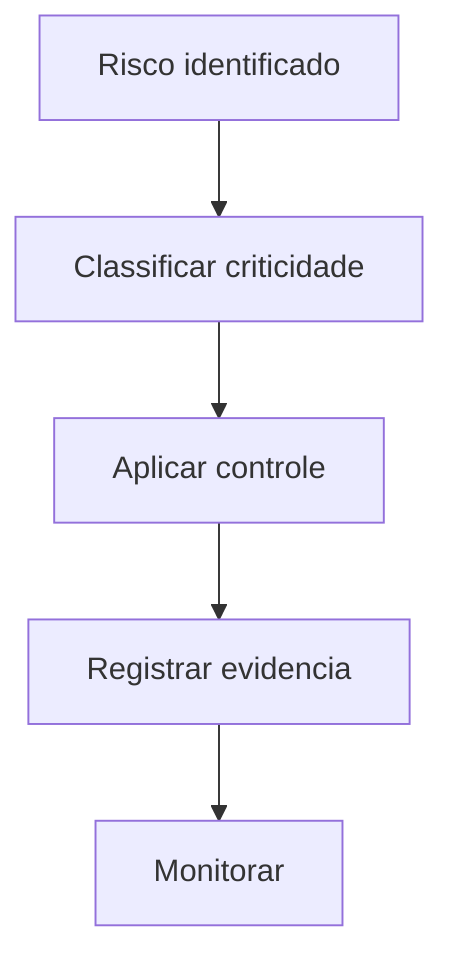

# Documento Mestre — Segurança Digital, Risco e Proteção — v3.0 — 07-06-2026

## Cabeçalho interno

| Campo | Informação |
|---|---|
| Código do documento | DM-03-SEG |
| Documento | Documento Mestre |
| Domínio normativo | Segurança Digital, Risco e Proteção |
| Responsável atual | Pedro Gazan |
| Versão | v3.0 |
| Data da versão | 07-06-2026 |
| Status | em_curadoria |
| Formato | Markdown .md |
| Pasta de destino | estrutura-de-documentos-oficiais/03-seguranca-digital-risco-protecao/ |
| Validação final | Pietro Carboni |
| Palavras-chave | segurança, risco, proteção, acesso, dados sensíveis, MFA |
| Exemplos de uso | revisar acesso, tratar incidente, proteger dados |
| Domínios relacionados | governança, técnico, agentes, IA |
| Responsáveis relacionados | Pedro Gazan, Pietro Carboni, Sávio Codare |

## 1. Objetivo do documento
Definir os padrões de segurança digital, gestão de risco e proteção de dados, acessos, sistemas e operações.

## 2. Escopo do domínio normativo
Acessos, autenticação, dados sensíveis, incidentes, riscos digitais, permissões, evidências de proteção e práticas mínimas.

## 3. O que este domínio define
- Política de acesso mínimo.
- Classificação de dados sensíveis.
- Protocolo de incidente.
- Critérios de proteção.
- Regras de senha, MFA e cofre.

## 4. O que este domínio não define
Não define governança geral de padrões, arquitetura de produto ou design visual, embora dependa deles.

## 5. Fontes analisadas
| Fonte | Status | Uso |
|---|---|---|
| Pedro v1.0 | esperada | base de segurança |
| Pedro v2.0 | esperada | evolução de risco |
| documento 99 | analisado | régua estrutural |

### Curadoria 97.2 — leitura comparativa incorporada

| Critério de busca | Resultado da curadoria | Incorporação no corpo |
|---|---|---|
| Pedro, segurança, risco, proteção, v1.0 | fonte de segurança considerada | MFA, acessos, dados sensíveis e incidentes reforçados |
| Pedro, segurança, v2.0 | fonte não confirmada automaticamente nesta rodada | pendência mantida |
| acesso, credencial, dado sensível, incidente | conteúdo incorporado | regras, checklist, matriz e riscos ampliados |

## 6. Síntese executiva
Segurança deve ser preventiva, auditável e proporcional ao risco. Acesso sem dono e dado sensível sem classificação são bloqueadores.

## 7. Mapa visual do domínio
```text
Ativo → classificação → risco → controle → evidência → revisão
```

## 8. Princípios
| Código | Princípio | Status |
|---|---|---|
| SEG-PRI-001 | Menor privilégio sempre | em_curadoria |
| SEG-PRI-002 | Dado sensível exige classificação | em_curadoria |

## 9. Políticas
| Código | Política | Status |
|---|---|---|
| SEG-POL-001 | Política de Acesso Mínimo | previsto |
| SEG-POL-002 | Política de Dados Sensíveis | previsto |

## 10. Regras centrais
- Todo acesso deve ter responsável.
- MFA é obrigatório para contas críticas.
- Dados sensíveis devem ser classificados antes de uso operacional.
- Credencial não deve ser compartilhada fora de cofre autorizado.
- Acesso sem dono deve ser revisado ou revogado.
- Incidente suspeito deve ser registrado mesmo antes da confirmação final.

## 11. Padrões oficiais e candidatos a padrão
| Código | Item | Tipo normativo | Status | Prioridade | Responsável | Validação necessária |
|---|---|---|---|---|---|---|
| SEG-PAD-001 | Padrão de Classificação de Dados Sensíveis | PAD | em_curadoria | Alta | Pedro | Pedro/Pietro |

## 12. Protocolos reais
| Código | Protocolo | Situação | Saída esperada |
|---|---|---|---|
| SEG-PRT-001 | Protocolo de Incidente de Segurança | incidente ou suspeita | contenção e registro |

## 13. Processos
1. Identificar ativo.
2. Classificar risco.
3. Aplicar controle.
4. Registrar evidência.
5. Revisar periodicamente.

## 14. Procedimentos operacionais
- Ativar MFA.
- Revisar acessos.
- Registrar cofre/credencial.
- Classificar dado.
- Abrir incidente se houver exposição.

## 15. Checklists obrigatórios
- [ ] Há dono do acesso?
- [ ] MFA ativo?
- [ ] Dado classificado?
- [ ] Evidência registrada?
- [ ] Risco aceito ou mitigado?
- [ ] A credencial está em cofre?
- [ ] O acesso é compatível com a função?
- [ ] Há data de revisão?

## 16. Matrizes obrigatórias
| Criticidade | Exemplo | Controle mínimo |
|---|---|---|
| baixa | documento público | revisão simples |
| média | dado interno | acesso limitado |
| alta | credencial | MFA e cofre |
| crítica | dado sensível | aprovação e auditoria |

## 17. Registros e evidências obrigatórias
- Registro de acesso.
- Registro de incidente.
- Evidência de MFA.
- Classificação de dado sensível.

## 18. Fluxos Mermaid


## 19. Dependências com outros domínios
| Tema | Depende de quem | Motivo | Tipo de dependência | Registro sugerido |
|---|---|---|---|---|
| RLS e banco | Sávio | implementação técnica | técnica | SEG-DEP-TEC |
| agentes | Pierre | uso de ferramentas | operacional | SEG-DEP-AGT |

## 20. Conflitos de escopo
Governança de padrão de segurança é Pietro com validação de Pedro; operação de segurança é Pedro.

## 21. Riscos se os padrões não forem seguidos
| Risco | Causa provável | Impacto | Como prevenir | Quem acompanha |
|---|---|---|---|---|
| vazamento | acesso excessivo | crítico | menor privilégio | Pedro |

## 22. O que deve ser monitorado pela Central de Monitoramento
| Item a monitorar | Por que monitorar | Origem do dado | Responsável | Ação se der alerta |
|---|---|---|---|---|
| acesso sem dono | risco alto | inventário | Pedro | revogar/revisar |

## 23. Relação com Biblioteca de Módulos Base, se aplicável
Módulos de auth, audit log, permissionamento e secrets devem seguir este domínio.

## 24. Relação com módulos executores, se aplicável
Todo módulo executor com dado sensível deve aplicar controle mínimo definido aqui.

## 25. Lacunas e validações pendentes
| Lacuna | Impacto | Quem valida | Prioridade | Recomendação |
|---|---|---|---|---|
| inventário de acessos | risco alto | Pedro | Alta | criar matriz |

## 26. Decisões já tomadas
- Segurança operacional pertence a Pedro Gazan.
- Padrão transversal exige validação Pietro/Pedro.

## 27. Subdocumentos oficiais previstos para extração
| Código sugerido | Tipo | Nome do subdocumento | Prioridade | Status | Arquivo futuro sugerido |
|---|---|---|---|---|---|
| SEG-POL-001 | política | Política de Acesso Mínimo | Alta | previsto | seg-pol-001-politica-acesso-minimo-v1.0-07-06-2026.md |
| SEG-PRT-001 | protocolo | Protocolo de Incidente de Segurança | Alta | previsto | seg-prt-001-protocolo-incidente-seguranca-v1.0-07-06-2026.md |
| SEG-CHK-001 | checklist | Checklist de Dados Sensíveis | Alta | previsto | seg-chk-001-checklist-dados-sensiveis-v1.0-07-06-2026.md |

## 28. Padrões atômicos sugeridos para o módulo SagB
- Permissão por papel.
- Evidência de MFA.
- Classificação de dados.
- Cofre obrigatório para credenciais.
- Registro de incidente suspeito.
- Bloqueio por risco crítico.

### Curadoria 97.3 — reforço máximo incorporado ao corpo

| Pergunta prática | Resposta esperada pela Central | Critério de bloqueio |
|---|---|---|
| Tenho dado sensível. O que faço? | classificar, restringir acesso e registrar evidência | dado sem classificação |
| Conta crítica sem MFA pode operar? | não, deve ser corrigida ou bloqueada | MFA ausente |
| Agente pode acessar ferramenta sensível? | só com permissão e log | ausência de log ou autorização |

| Código sugerido adicional | Tipo | Nome do subdocumento | Prioridade | Status | Arquivo futuro sugerido |
|---|---|---|---|---|---|
| SEG-PAD-002 | padrão | Padrão de Cofre e Credenciais | Alta | previsto | seg-pad-002-padrao-cofre-credenciais-v1.0-07-06-2026.md |
| SEG-MTZ-001 | matriz | Matriz de Criticidade de Acesso | Alta | previsto | seg-mtz-001-matriz-criticidade-acesso-v1.0-07-06-2026.md |
| SEG-RGT-001 | registro | Registro de Incidente Suspeito | Alta | previsto | seg-rgt-001-registro-incidente-suspeito-v1.0-07-06-2026.md |

## 29. Ordem recomendada de canonização
1. Acesso mínimo.
2. Dados sensíveis.
3. Incidente.

## 30. Síntese final
Segurança protege a continuidade e a confiança do ecossistema.

## Anexo 97.1 — Auditoria e enriquecimento de curadoria

### Fontes v1.0/v2.0 consideradas

| Fonte | Situação | Conteúdo aproveitado | Pendência |
|---|---|---|---|
| Fonte v1.0 de Pedro Gazan | considerada | acessos, MFA, dados sensíveis, risco e proteção | validar inventário de controles |
| Fonte v2.0 de Pedro Gazan | considerada como esperada | evolução de políticas, incidentes e evidências | confirmar diferenças específicas |
| Documento-base 99 | usado como régua | cabeçalho, status e subdocumentos previstos | nenhuma |

### Exemplos práticos reforçados

| Situação | Ação mínima | Evidência |
|---|---|---|
| Conta crítica sem MFA | bloquear ou corrigir acesso | print/configuração MFA |
| Dado sensível em documento | classificar e restringir | registro de classificação |
| Suspeita de incidente | acionar protocolo | log de incidente |

### Reforço para busca conversacional futura

- Tenho um risco de dados sensíveis. Qual padrão vale?
- O que fazer quando uma conta crítica está sem MFA?
- Quem valida segurança operacional?

### Checklist final de enriquecimento

- [x] Reforça fronteira Pietro/Pedro.
- [x] Reforça evidências de segurança.
- [x] Reforça monitoramento de acesso.
- [x] Mantém status `em_curadoria`.
