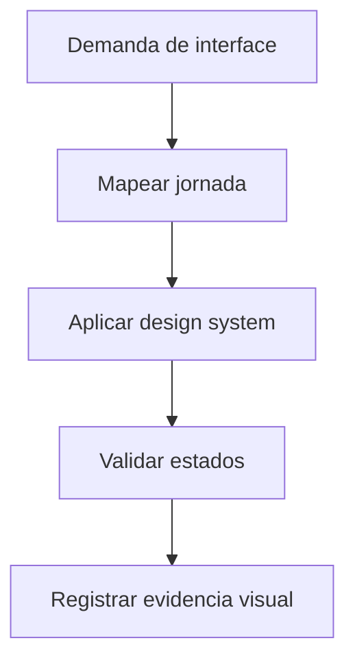

# Documento Mestre — UX/UI, Experiência e Interface — v3.0 — 07-06-2026

## Cabeçalho interno

| Campo | Informação |
|---|---|
| Código do documento | DM-04-UX |
| Documento | Documento Mestre |
| Domínio normativo | UX/UI, Experiência e Interface |
| Responsável atual | Alice Montini |
| Versão | v3.0 |
| Data da versão | 07-06-2026 |
| Status | em_curadoria |
| Formato | Markdown .md |
| Pasta de destino | estrutura-de-documentos-oficiais/04-ux-ui-experiencia-interface/ |
| Validação final | Pietro Carboni |
| Palavras-chave | UX, UI, experiência, interface, design system, acessibilidade |
| Exemplos de uso | criar tela, revisar componente, validar jornada |
| Domínios relacionados | técnico, segurança, agentes, governança |
| Responsáveis relacionados | Alice Montini, Sávio Codare, Pietro Carboni |

## 1. Objetivo do documento
Definir padrões de experiência, interface, consistência visual, acessibilidade, microcopy e qualidade de uso para produtos e módulos do ecossistema.

## 2. Escopo do domínio normativo
Inclui jornadas, telas, componentes, tokens, estados, feedbacks, responsividade, acessibilidade e consistência visual.

## 3. O que este domínio define
- Padrões de interface.
- Critérios de experiência.
- Regras de design system.
- Estados de componente.
- Padrões de microcopy.

## 4. O que este domínio não define
Não define arquitetura técnica, regras de segurança, naming ou conteúdo pedagógico, embora dependa desses domínios.

## 5. Fontes analisadas
| Fonte | Status | Uso |
|---|---|---|
| Alice v1.0 | esperada | base UX/UI |
| Alice v2.0 | esperada | evolução visual |
| documento 99 | analisado | régua estrutural |

### Curadoria 97.2 — leitura comparativa incorporada

| Critério de busca | Resultado da curadoria | Incorporação no corpo |
|---|---|---|
| Alice, UX, UI, experiência, v1.0 | fonte visual considerada | estados de interface, tokens, acessibilidade e evidência visual reforçados |
| Alice, design system, v2.0 | fonte não confirmada automaticamente nesta rodada | pendência mantida |
| tela, componente, estado, microcopy | conteúdo incorporado | regras, checklist, matriz e monitoramento ampliados |

## 6. Síntese executiva
Interface é parte da governança. Uma regra mal apresentada vira erro operacional. UX/UI deve tornar o padrão utilizável.

## 7. Mapa visual do domínio
```text
Necessidade → jornada → tela → componente → estado → feedback → evidência visual
```

## 8. Princípios
| Código | Princípio | Status |
|---|---|---|
| UX-PRI-001 | Clareza antes de estética | em_curadoria |
| UX-PRI-002 | Consistência reduz erro | em_curadoria |

## 9. Políticas
| Código | Política | Status |
|---|---|---|
| UX-POL-001 | Política de Design System | previsto |

## 10. Regras centrais
- Toda tela deve ter objetivo claro.
- Todo estado crítico deve ter feedback.
- Toda ação destrutiva deve ter confirmação.
- Componentes devem respeitar tokens oficiais.
- Tela sem estado vazio, erro, loading e sucesso é considerada incompleta.
- Evidência visual deve acompanhar alteração relevante de interface.
- Microcopy deve orientar a ação do usuário, não apenas decorar a tela.

## 11. Padrões oficiais e candidatos a padrão
| Código | Item | Tipo normativo | Status | Prioridade | Responsável | Validação necessária |
|---|---|---|---|---|---|---|
| UX-PAD-001 | Padrão de Design System | PAD | em_curadoria | Alta | Alice | Alice/Pietro |
| UX-PAD-002 | Padrão de Estados de Interface | PAD | em_curadoria | Alta | Alice | Alice/Sávio |

## 12. Protocolos reais
| Código | Protocolo | Situação | Saída esperada |
|---|---|---|---|
| UX-PRT-001 | Protocolo de Revisão Visual | antes de publicar interface | aceite UX |

## 13. Processos
1. Entender fluxo.
2. Mapear usuário.
3. Definir componentes.
4. Validar estados.
5. Testar usabilidade.
6. Registrar evidência visual.

## 14. Procedimentos operacionais
- Conferir tokens.
- Conferir contraste.
- Conferir responsividade.
- Conferir microcopy.
- Anexar print/evidência.

## 15. Checklists obrigatórios
- [ ] A tela tem objetivo claro?
- [ ] Há estado vazio?
- [ ] Há estado de erro?
- [ ] Há loading?
- [ ] Há acessibilidade mínima?
- [ ] Há estado de sucesso?
- [ ] Há confirmação para ação destrutiva?
- [ ] Há evidência visual anexada?

## 16. Matrizes obrigatórias
| Elemento | Critério | Evidência |
|---|---|---|
| componente | segue token | print |
| fluxo | tem começo e fim | mapa |
| erro | tem orientação | captura |

## 17. Registros e evidências obrigatórias
- Prints de tela.
- Registro de revisão visual.
- Checklist de acessibilidade.

## 18. Fluxos Mermaid


## 19. Dependências com outros domínios
| Tema | Depende de quem | Motivo | Tipo de dependência | Registro sugerido |
|---|---|---|---|---|
| implementação | Sávio | componente técnico | técnica | UX-DEP-TEC |
| dados sensíveis | Pedro | exposição visual | segurança | UX-DEP-SEG |

## 20. Conflitos de escopo
UX define experiência; técnico define implementação; segurança define restrições de exposição.

## 21. Riscos se os padrões não forem seguidos
| Risco | Causa provável | Impacto | Como prevenir | Quem acompanha |
|---|---|---|---|---|
| erro do usuário | interface ambígua | alto | revisão UX | Alice |

## 22. O que deve ser monitorado pela Central de Monitoramento
| Item a monitorar | Por que monitorar | Origem do dado | Responsável | Ação se der alerta |
|---|---|---|---|---|
| tela sem evidência visual | revisão incompleta | módulo | Alice | solicitar print |

## 23. Relação com Biblioteca de Módulos Base, se aplicável
Componentes reutilizáveis devem nascer alinhados ao design system.

## 24. Relação com módulos executores, se aplicável
Todo módulo visual do SagB deve seguir estes padrões de UX/UI.

## 25. Lacunas e validações pendentes
| Lacuna | Impacto | Quem valida | Prioridade | Recomendação |
|---|---|---|---|---|
| tokens oficiais consolidados | inconsistência | Alice | Alta | extrair subdocumento |

## 26. Decisões já tomadas
- UX/UI é domínio próprio e não apenas acabamento visual.

## 27. Subdocumentos oficiais previstos para extração
| Código sugerido | Tipo | Nome do subdocumento | Prioridade | Status | Arquivo futuro sugerido |
|---|---|---|---|---|---|
| UX-PAD-001 | padrão | Padrão de Design System | Alta | previsto | ux-pad-001-padrao-design-system-v1.0-07-06-2026.md |
| UX-CHK-001 | checklist | Checklist de Revisão Visual | Alta | previsto | ux-chk-001-checklist-revisao-visual-v1.0-07-06-2026.md |

## 28. Padrões atômicos sugeridos para o módulo SagB
- Estado vazio obrigatório.
- Evidência visual obrigatória.
- Tokens centralizados.
- Estado de erro obrigatório.
- Estado de sucesso obrigatório.
- Confirmação para ação destrutiva.

### Curadoria 97.3 — reforço máximo incorporado ao corpo

| Pergunta prática | Resposta esperada pela Central | Critério de bloqueio |
|---|---|---|
| Posso publicar uma tela sem estado vazio? | não recomendado | ausência de estado vazio/erro/loading |
| Ação destrutiva precisa confirmação? | sim | risco de perda sem confirmação |
| Como comprovar revisão visual? | evidência visual e checklist UX | ausência de print ou registro |

| Código sugerido adicional | Tipo | Nome do subdocumento | Prioridade | Status | Arquivo futuro sugerido |
|---|---|---|---|---|---|
| UX-PAD-002 | padrão | Padrão de Estados de Interface | Alta | previsto | ux-pad-002-padrao-estados-interface-v1.0-07-06-2026.md |
| UX-PAD-003 | padrão | Padrão de Microcopy Operacional | Média | previsto | ux-pad-003-padrao-microcopy-operacional-v1.0-07-06-2026.md |
| UX-RGT-001 | registro | Registro de Evidência Visual | Alta | previsto | ux-rgt-001-registro-evidencia-visual-v1.0-07-06-2026.md |

## 29. Ordem recomendada de canonização
1. Design system.
2. Estados de interface.
3. Checklist visual.

## 30. Síntese final
UX/UI transforma padrões em uso real, reduzindo erro e aumentando clareza operacional.

## Anexo 97.1 — Auditoria e enriquecimento de curadoria

### Fontes v1.0/v2.0 consideradas

| Fonte | Situação | Conteúdo aproveitado | Pendência |
|---|---|---|---|
| Fonte v1.0 de Alice Montini | considerada | design system, componentes, acessibilidade e experiência | validar tokens finais |
| Fonte v2.0 de Alice Montini | considerada como esperada | evolução visual e padrões de tela | confirmar conteúdo completo |
| Documento-base 99 | usado como régua | recursos visuais e estrutura mestre | nenhuma |

### Exemplos práticos reforçados

| Situação | Padrão UX/UI | Evidência |
|---|---|---|
| Tela sem estado vazio | criar estado vazio | print |
| Ação destrutiva | confirmação explícita | fluxo de interação |
| Formulário com erro | feedback claro | captura do estado de erro |

### Reforço para busca conversacional futura

- Quero criar uma tela. Quais padrões visuais preciso seguir?
- Como validar se uma interface está pronta?
- Que evidência visual devo registrar?

### Checklist final de enriquecimento

- [x] Reforça exemplos visuais.
- [x] Reforça acessibilidade.
- [x] Reforça evidência visual.
- [x] Mantém status `em_curadoria`.
