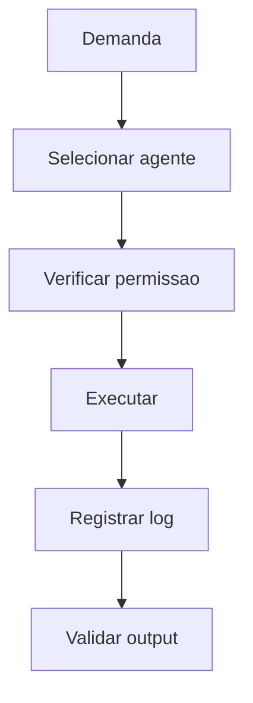

# Documento Mestre — Agentes Autônomos, IA e Orquestração — v3.0 — 07-06-2026

## Cabeçalho interno

| Campo | Informação |
|---|---|
| Código do documento | DM-05-AGT |
| Documento | Documento Mestre |
| Domínio normativo | Agentes Autônomos, IA e Orquestração |
| Responsável atual | Pierre Zanulli |
| Versão | v3.0 |
| Data da versão | 07-06-2026 |
| Status | em_curadoria |
| Formato | Markdown .md |
| Pasta de destino | estrutura-de-documentos-oficiais/05-agentes-autonomos-ia-orquestracao/ |
| Validação final | Pietro Carboni |
| Palavras-chave | agentes, IA, orquestração, tool use, autonomia, handoff |
| Exemplos de uso | criar agente, definir permissão, executar handoff |
| Domínios relacionados | governança, segurança, modelos IA, processos |
| Responsáveis relacionados | Pierre Zanulli, Klaus Wagen, Pedro Gazan, Pietro Carboni |

## 1. Objetivo do documento
Definir padrões para agentes autônomos e orquestração, garantindo autonomia controlada, rastreabilidade e limites operacionais.

## 2. Escopo do domínio normativo
Agentes, papéis, permissões, ferramentas, handoffs, limites, logs, avaliação e governança de execução autônoma.

## 3. O que este domínio define
- Contratos de agente.
- Handoffs.
- Tool use.
- Limites de autonomia.
- Logs obrigatórios.

## 4. O que este domínio não define
Não define escolha de modelo base, segurança operacional ou governança final de canonicidade.

## 5. Fontes analisadas
| Fonte | Status | Uso |
|---|---|---|
| Pierre v1.0 | esperada | base de agentes |
| Pierre v2.0 | esperada | evolução de orquestração |
| documento 99 | analisado | régua estrutural |

### Curadoria 97.2 — leitura comparativa incorporada

| Critério de busca | Resultado da curadoria | Incorporação no corpo |
|---|---|---|
| Pierre, agentes, orquestração, v1.0 | fonte de agentes considerada | autonomia, handoff, tool use e logs reforçados |
| Pierre, multiagentes, v2.0 | fonte não confirmada automaticamente nesta rodada | pendência mantida |
| agente, ferramenta, output, handoff | conteúdo incorporado | regras, matriz de autonomia e riscos ampliados |

## 6. Síntese executiva
Agente autônomo precisa ter escopo, ferramenta, limite e log. Autonomia sem registro vira risco operacional.

## 7. Mapa visual do domínio
```text
Objetivo → persona → permissões → ferramentas → execução → log → avaliação
```

## 8. Princípios
| Código | Princípio | Status |
|---|---|---|
| AGT-PRI-001 | Autonomia com limite explícito | em_curadoria |
| AGT-PRI-002 | Agente não aprova o próprio output | em_curadoria |

## 9. Políticas
| Código | Política | Status |
|---|---|---|
| AGT-POL-001 | Política de Execução de Agentes | previsto |

## 10. Regras centrais
- Agente precisa de escopo.
- Agente precisa de log.
- Agente não publica nem aprova output próprio.
- Tool use sensível exige permissão.
- Agente deve declarar entrada, saída, ferramentas e limites.
- Toda execução relevante deve gerar log consultável.
- Handoff entre agentes deve preservar contexto, objetivo e decisão pendente.

## 11. Padrões oficiais e candidatos a padrão
| Código | Item | Tipo normativo | Status | Prioridade | Responsável | Validação necessária |
|---|---|---|---|---|---|---|
| AGT-PAD-001 | Padrão de Contrato de Agente | PAD | em_curadoria | Alta | Pierre | Pierre/Pietro |

## 12. Protocolos reais
| Código | Protocolo | Situação | Saída esperada |
|---|---|---|---|
| AGT-PRT-001 | Protocolo de Handoff entre Agentes | troca de agente | contexto preservado |

## 13. Processos
1. Definir objetivo.
2. Definir agente.
3. Definir ferramentas.
4. Definir limites.
5. Executar.
6. Registrar.
7. Validar.

## 14. Procedimentos operacionais
- Registrar prompt base.
- Registrar ferramentas permitidas.
- Registrar ações executadas.
- Validar output humano quando crítico.

## 15. Checklists obrigatórios
- [ ] Agente tem escopo?
- [ ] Tem permissão?
- [ ] Tem log?
- [ ] Tem limite?
- [ ] Precisa validação humana?

## 16. Matrizes obrigatórias
| Autonomia | Ação permitida | Validação |
|---|---|---|
| baixa | responder | opcional |
| média | criar rascunho | revisão |
| alta | acionar ferramenta | aprovação |
| bloqueada | aprovar próprio output | não permitido |

## 17. Registros e evidências obrigatórias
- Log de execução.
- Registro de prompt.
- Registro de ferramenta.
- Registro de validação.

## 18. Fluxos Mermaid


## 19. Dependências com outros domínios
| Tema | Depende de quem | Motivo | Tipo de dependência | Registro sugerido |
|---|---|---|---|---|
| modelo IA | Klaus | escolha de modelo | técnica | AGT-DEP-IA |
| segurança | Pedro | tool use sensível | segurança | AGT-DEP-SEG |

## 20. Conflitos de escopo
Pierre define orquestração de agentes; Klaus define modelos; Pedro define segurança; Pietro define canonicidade.

## 21. Riscos se os padrões não forem seguidos
| Risco | Causa provável | Impacto | Como prevenir | Quem acompanha |
|---|---|---|---|---|
| ação indevida | agente sem limite | alto | permissões | Pierre/Pedro |

## 22. O que deve ser monitorado pela Central de Monitoramento
| Item a monitorar | Por que monitorar | Origem do dado | Responsável | Ação se der alerta |
|---|---|---|---|---|
| execução sem log | risco de auditoria | logs | Pierre | bloquear agente |

## 23. Relação com Biblioteca de Módulos Base, se aplicável
Pode gerar módulos base de agente, logging, handoff e ferramentas.

## 24. Relação com módulos executores, se aplicável
Agentes do SagB devem seguir contratos e permissões definidos aqui.

## 25. Lacunas e validações pendentes
| Lacuna | Impacto | Quem valida | Prioridade | Recomendação |
|---|---|---|---|---|
| matriz de autonomia | risco operacional | Pierre | Alta | formalizar |

## 26. Decisões já tomadas
- Agente autorizado não aprova output próprio.

## 27. Subdocumentos oficiais previstos para extração
| Código sugerido | Tipo | Nome do subdocumento | Prioridade | Status | Arquivo futuro sugerido |
|---|---|---|---|---|---|
| AGT-PAD-001 | padrão | Padrão de Contrato de Agente | Alta | previsto | agt-pad-001-padrao-contrato-agente-v1.0-07-06-2026.md |
| AGT-PRT-001 | protocolo | Protocolo de Handoff entre Agentes | Alta | previsto | agt-prt-001-protocolo-handoff-agentes-v1.0-07-06-2026.md |

## 28. Padrões atômicos sugeridos para o módulo SagB
- Log obrigatório de agente.
- Permissão por ferramenta.
- Handoff estruturado.
- Matriz de autonomia por agente.
- Registro de tool use sensível.
- Bloqueio de autoaprovação.

### Curadoria 97.3 — reforço máximo incorporado ao corpo

| Pergunta prática | Resposta esperada pela Central | Critério de bloqueio |
|---|---|---|
| Quero criar um agente. O que definir? | objetivo, escopo, ferramentas, limites, logs e handoff | ausência de contrato de agente |
| Agente pode executar ferramenta? | depende da matriz de autonomia e permissão | ferramenta sensível sem autorização |
| Agente pode aprovar sua entrega? | não | autoaprovação |

| Código sugerido adicional | Tipo | Nome do subdocumento | Prioridade | Status | Arquivo futuro sugerido |
|---|---|---|---|---|---|
| AGT-MTZ-001 | matriz | Matriz de Autonomia de Agentes | Alta | previsto | agt-mtz-001-matriz-autonomia-agentes-v1.0-07-06-2026.md |
| AGT-RGT-001 | registro | Registro de Execução de Agente | Alta | previsto | agt-rgt-001-registro-execucao-agente-v1.0-07-06-2026.md |
| AGT-POL-001 | política | Política de Tool Use por Agentes | Alta | previsto | agt-pol-001-politica-tool-use-agentes-v1.0-07-06-2026.md |

## 29. Ordem recomendada de canonização
1. Contrato de agente.
2. Matriz de autonomia.
3. Handoff.

## 30. Síntese final
Agentes ampliam capacidade operacional quando têm limites, logs e validação clara.

## Anexo 97.1 — Auditoria e enriquecimento de curadoria

### Fontes v1.0/v2.0 consideradas

| Fonte | Situação | Conteúdo aproveitado | Pendência |
|---|---|---|---|
| Fonte v1.0 de Pierre Zanulli | considerada | agentes, orquestração, tool use e handoff | validar matriz de autonomia |
| Fonte v2.0 de Pierre Zanulli | considerada como esperada | evolução multiagente e limites operacionais | confirmar diferenças específicas |
| Documento-base 99 | usado como régua | subdocumentos e monitoramento | nenhuma |

### Exemplos práticos reforçados

| Situação | Regra | Evidência |
|---|---|---|
| Agente usa ferramenta sensível | precisa permissão | log da chamada |
| Agente cria rascunho | precisa revisão humana | registro de validação |
| Agente tenta aprovar output próprio | bloquear | PERMISSION_DENIED |

### Reforço para busca conversacional futura

- Quero criar um agente. Quais regras existem?
- Um agente pode aprovar o próprio output?
- Quais logs um agente deve gerar?

### Checklist final de enriquecimento

- [x] Reforça limite de autonomia.
- [x] Reforça logs.
- [x] Reforça proibição de autoaprovação.
- [x] Mantém status `em_curadoria`.
