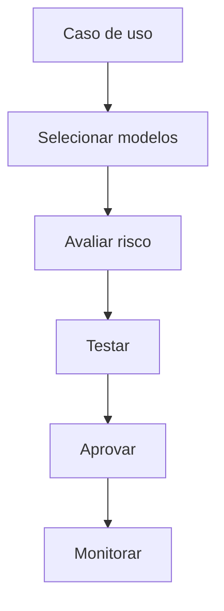

# Documento Mestre — Modelos de IA, Radar Tecnológico e Governança de IA — v3.0 — 07-06-2026

## Cabeçalho interno

| Campo | Informação |
|---|---|
| Código do documento | DM-06-IA |
| Documento | Documento Mestre |
| Domínio normativo | Modelos de IA, Radar Tecnológico e Governança de IA |
| Responsável atual | Klaus Wagen |
| Versão | v3.0 |
| Data da versão | 07-06-2026 |
| Status | em_curadoria |
| Formato | Markdown .md |
| Pasta de destino | estrutura-de-documentos-oficiais/06-modelos-ia-radar-tecnologico-governanca-ia/ |
| Validação final | Pietro Carboni |
| Palavras-chave | modelos IA, LLM, RAI, radar tecnológico, avaliação |
| Exemplos de uso | escolher modelo, avaliar risco, monitorar fornecedor |
| Domínios relacionados | agentes, segurança, técnico, governança |
| Responsáveis relacionados | Klaus Wagen, Pierre Zanulli, Pedro Gazan |

## 1. Objetivo do documento
Definir padrões para avaliação, seleção, uso e monitoramento de modelos de IA e tecnologias emergentes.

## 2. Escopo do domínio normativo
Modelos, fornecedores, critérios de avaliação, riscos de IA, RAI, radar tecnológico, benchmarks e governança de uso.

## 3. O que este domínio define
- Critérios de escolha de modelo.
- Avaliação de risco de IA.
- Radar tecnológico.
- Regras de uso responsável.

## 4. O que este domínio não define
Não define comportamento de agentes, segurança operacional específica ou implementação técnica final.

## 5. Fontes analisadas
| Fonte | Status | Uso |
|---|---|---|
| Klaus v1.0 | esperada | base de modelos |
| Klaus v2.0 | esperada | evolução RAI |
| documento 99 | analisado | régua estrutural |

### Curadoria 97.2 — leitura comparativa incorporada

| Critério de busca | Resultado da curadoria | Incorporação no corpo |
|---|---|---|
| Klaus, modelos IA, RAI, v1.0 | fonte de IA considerada | critérios de modelo, fornecedor, risco e radar reforçados |
| Klaus, governança IA, v2.0 | fonte não confirmada automaticamente nesta rodada | pendência mantida |
| modelo, benchmark, fornecedor | conteúdo incorporado | matriz de avaliação e monitoramento ampliados |

## 6. Síntese executiva
Modelo de IA deve ser escolhido por adequação, risco e governança, não por moda ou hype.

## 7. Mapa visual do domínio
```text
Necessidade → critérios → modelo candidato → risco → teste → aprovação → monitoramento
```

## 8. Princípios
| Código | Princípio | Status |
|---|---|---|
| IA-PRI-001 | Modelo certo para tarefa certa | em_curadoria |
| IA-PRI-002 | IA crítica exige governança | em_curadoria |

## 9. Políticas
| Código | Política | Status |
|---|---|---|
| IA-POL-001 | Política de Uso Responsável de IA | previsto |

## 10. Regras centrais
- Modelo deve ter caso de uso.
- Uso crítico exige avaliação.
- Fornecedor deve ser registrado.
- Mudança de modelo relevante exige nova validação.
- Modelo usado por agente deve ser registrado junto ao agente.
- Caso envolva dados sensíveis, Pedro Gazan deve validar risco antes do uso.
- Benchmark deve considerar qualidade, custo, privacidade, latência e estabilidade.

## 11. Padrões oficiais e candidatos a padrão
| Código | Item | Tipo normativo | Status | Prioridade | Responsável | Validação necessária |
|---|---|---|---|---|---|---|
| IA-PAD-001 | Padrão de Avaliação de Modelo | PAD | em_curadoria | Alta | Klaus | Klaus/Pietro |

## 12. Protocolos reais
| Código | Protocolo | Situação | Saída esperada |
|---|---|---|---|
| IA-PRT-001 | Protocolo de Troca de Modelo | troca operacional | validação registrada |

## 13. Processos
1. Definir tarefa.
2. Selecionar candidatos.
3. Avaliar risco.
4. Testar.
5. Aprovar uso.
6. Monitorar.

## 14. Procedimentos operacionais
- Registrar fornecedor.
- Registrar modelo.
- Registrar benchmark.
- Registrar risco.
- Registrar decisão.

## 15. Checklists obrigatórios
- [ ] Caso de uso definido?
- [ ] Dados sensíveis envolvidos?
- [ ] Custo avaliado?
- [ ] Risco avaliado?
- [ ] Alternativa registrada?

## 16. Matrizes obrigatórias
| Critério | Peso | Evidência |
|---|---|---|
| qualidade | alto | teste |
| custo | médio | estimativa |
| privacidade | alto | política |
| latência | variável | benchmark |
| estabilidade | alto | histórico de falhas |
| aderência ao caso de uso | alto | avaliação prática |

## 17. Registros e evidências obrigatórias
- Registro de modelo.
- Benchmark.
- Avaliação de risco.
- Decisão de uso.

## 18. Fluxos Mermaid


## 19. Dependências com outros domínios
| Tema | Depende de quem | Motivo | Tipo de dependência | Registro sugerido |
|---|---|---|---|---|
| agentes | Pierre | aplicação do modelo | operacional | IA-DEP-AGT |
| segurança | Pedro | dados sensíveis | segurança | IA-DEP-SEG |

## 20. Conflitos de escopo
Klaus define modelo; Pierre define agente; Pedro define segurança; Sávio implementa.

## 21. Riscos se os padrões não forem seguidos
| Risco | Causa provável | Impacto | Como prevenir | Quem acompanha |
|---|---|---|---|---|
| uso inadequado | hype | alto | matriz de avaliação | Klaus |

## 22. O que deve ser monitorado pela Central de Monitoramento
| Item a monitorar | Por que monitorar | Origem do dado | Responsável | Ação se der alerta |
|---|---|---|---|---|
| modelo obsoleto | perda de qualidade | radar | Klaus | reavaliar |

## 23. Relação com Biblioteca de Módulos Base, se aplicável
Pode gerar conectores e adaptadores de modelos.

## 24. Relação com módulos executores, se aplicável
Módulos com IA devem registrar modelo e política de uso.

## 25. Lacunas e validações pendentes
| Lacuna | Impacto | Quem valida | Prioridade | Recomendação |
|---|---|---|---|---|
| matriz de avaliação | escolha subjetiva | Klaus | Alta | extrair subdocumento |

## 26. Decisões já tomadas
- Escolha de modelo é domínio próprio.

## 27. Subdocumentos oficiais previstos para extração
| Código sugerido | Tipo | Nome do subdocumento | Prioridade | Status | Arquivo futuro sugerido |
|---|---|---|---|---|---|
| IA-MTZ-001 | matriz | Matriz de Avaliação de Modelos | Alta | previsto | ia-mtz-001-matriz-avaliacao-modelos-v1.0-07-06-2026.md |
| IA-POL-001 | política | Política de Uso Responsável de IA | Alta | previsto | ia-pol-001-politica-uso-responsavel-ia-v1.0-07-06-2026.md |

## 28. Padrões atômicos sugeridos para o módulo SagB
- Registro de modelo por agente.
- Matriz de risco IA.
- Radar de fornecedores.
- Registro de benchmark.
- Registro de troca de modelo.
- Classificação de uso crítico de IA.

### Curadoria 97.3 — reforço máximo incorporado ao corpo

| Pergunta prática | Resposta esperada pela Central | Critério de bloqueio |
|---|---|---|
| Qual modelo devo usar? | aplicar matriz de avaliação por caso de uso | ausência de benchmark |
| Posso trocar modelo em produção? | só com protocolo de troca e registro de risco | mudança sem validação |
| IA usa dado sensível? | validar com segurança antes | ausência de parecer de risco |

| Código sugerido adicional | Tipo | Nome do subdocumento | Prioridade | Status | Arquivo futuro sugerido |
|---|---|---|---|---|---|
| IA-RGT-001 | registro | Registro de Benchmark de Modelo | Alta | previsto | ia-rgt-001-registro-benchmark-modelo-v1.0-07-06-2026.md |
| IA-PRT-001 | protocolo | Protocolo de Troca de Modelo | Alta | previsto | ia-prt-001-protocolo-troca-modelo-v1.0-07-06-2026.md |
| IA-MTZ-002 | matriz | Matriz de Risco de Uso de IA | Alta | previsto | ia-mtz-002-matriz-risco-uso-ia-v1.0-07-06-2026.md |

## 29. Ordem recomendada de canonização
1. Matriz de avaliação.
2. Política RAI.
3. Protocolo de troca.

## 30. Síntese final
Este domínio garante que IA seja usada com critério, risco controlado e rastreabilidade.

## Anexo 97.1 — Auditoria e enriquecimento de curadoria

### Fontes v1.0/v2.0 consideradas

| Fonte | Situação | Conteúdo aproveitado | Pendência |
|---|---|---|---|
| Fonte v1.0 de Klaus Wagen | considerada | modelos, fornecedores, RAI e radar tecnológico | validar critérios finais |
| Fonte v2.0 de Klaus Wagen | considerada como esperada | evolução de governança IA e benchmarks | confirmar conteúdo completo |
| Documento-base 99 | usado como régua | matriz, riscos e monitoramento | nenhuma |

### Exemplos práticos reforçados

| Situação | Critério | Evidência |
|---|---|---|
| Escolha de modelo para agente | custo, qualidade, privacidade | matriz de avaliação |
| Troca de fornecedor | risco e compatibilidade | decisão registrada |
| Uso com dado sensível | validação de segurança | parecer Pedro |

### Reforço para busca conversacional futura

- Qual modelo devo usar para esta tarefa?
- Quando preciso reavaliar um modelo?
- Como registrar risco de IA?

### Checklist final de enriquecimento

- [x] Reforça matriz de avaliação.
- [x] Reforça dependência com segurança e agentes.
- [x] Reforça monitoramento de fornecedor/modelo.
- [x] Mantém status `em_curadoria`.
