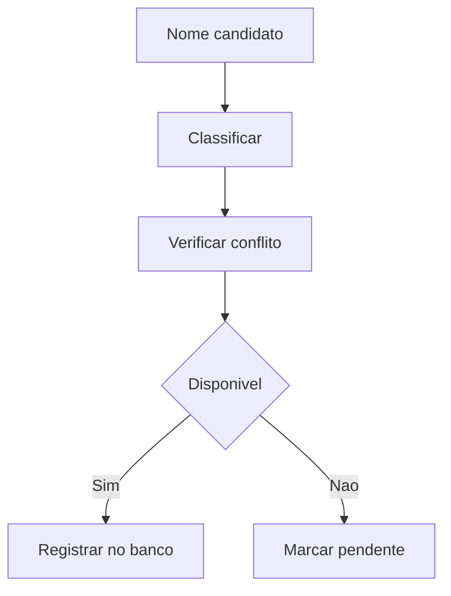

# Documento Mestre — Naming, Disponibilidade e Banco de Marcas — v3.0 — 07-06-2026

## Cabeçalho interno

| Campo | Informação |
|---|---|
| Código do documento | DM-07-NAM |
| Documento | Documento Mestre |
| Domínio normativo | Naming, Disponibilidade e Banco de Marcas |
| Responsável atual | Noah Verdili |
| Versão | v3.0 |
| Data da versão | 07-06-2026 |
| Status | em_curadoria |
| Formato | Markdown .md |
| Pasta de destino | estrutura-de-documentos-oficiais/07-naming-disponibilidade-banco-marcas/ |
| Validação final | Pietro Carboni |
| Palavras-chave | naming, marca, disponibilidade, nomenclatura, banco de marcas |
| Exemplos de uso | nomear produto, validar marca, organizar banco de nomes |
| Domínios relacionados | negócios, ideias, governança |
| Responsáveis relacionados | Noah Verdili, César Tulli, Dante Montoya, Pietro Carboni |

## 1. Objetivo do documento
Definir padrões para criação, avaliação, registro e organização de nomes de marcas, produtos, programas, métodos e iniciativas.

## 2. Escopo do domínio normativo
Naming, disponibilidade, banco de marcas, critérios de nomeação, conflitos, maturidade e relação com ventures/produtos.

## 3. O que este domínio define
- Critérios de nome.
- Banco de marcas.
- Disponibilidade.
- Maturidade de naming.
- Regras de evitar duplicidade.

## 4. O que este domínio não define
Não define plano de negócio, identidade visual completa, registro jurídico ou estratégia comercial final.

## 5. Fontes analisadas
| Fonte | Status | Uso |
|---|---|---|
| Noah v1.0 | esperada | base naming |
| Noah v2.0 | esperada | evolução curadoria |
| documento 99 | analisado | régua estrutural |

### Curadoria 97.2 — leitura comparativa incorporada

| Critério de busca | Resultado da curadoria | Incorporação no corpo |
|---|---|---|
| Noah, naming, banco de marcas, v1.0 | fonte de naming considerada | banco de marcas, disponibilidade e conflitos reforçados |
| Noah, naming, v2.0 | fonte não confirmada automaticamente nesta rodada | pendência mantida |
| nome, marca, disponibilidade, conflito | conteúdo incorporado | regras, matriz e monitoramento ampliados |

## 6. Síntese executiva
Naming organiza identidade e reduz conflito. Nome sem validação pode criar duplicidade, ruído e risco estratégico.

## 7. Mapa visual do domínio
```text
Ideia → nome candidato → classificação → disponibilidade → decisão → banco de marcas
```

## 8. Princípios
| Código | Princípio | Status |
|---|---|---|
| NAM-PRI-001 | Nome deve ser distinguível | em_curadoria |
| NAM-PRI-002 | Nome precisa ter contexto de uso | em_curadoria |

## 9. Políticas
| Código | Política | Status |
|---|---|---|
| NAM-POL-001 | Política de Banco de Marcas | previsto |

## 10. Regras centrais
- Todo nome candidato deve ter categoria.
- Nome aprovado deve ter registro no banco.
- Nome conflitante deve ser marcado como pendente ou bloqueado.
- Nome sem uso pretendido deve permanecer bruto.
- Nome parecido com ativo existente deve gerar registro de conflito.
- Nome aprovado para aplicação específica deve registrar onde será usado.

## 11. Padrões oficiais e candidatos a padrão
| Código | Item | Tipo normativo | Status | Prioridade | Responsável | Validação necessária |
|---|---|---|---|---|---|---|
| NAM-PAD-001 | Padrão de Classificação de Naming | PAD | em_curadoria | Alta | Noah | Noah/Pietro |

## 12. Protocolos reais
| Código | Protocolo | Situação | Saída esperada |
|---|---|---|---|
| NAM-PRT-001 | Protocolo de Validação de Nome | novo nome candidato | decisão de naming |

## 13. Processos
1. Receber nome candidato.
2. Classificar tipo.
3. Verificar conflito.
4. Validar disponibilidade.
5. Registrar decisão.

## 14. Procedimentos operacionais
- Registrar nome.
- Registrar origem.
- Registrar uso pretendido.
- Registrar status.
- Registrar decisão.

## 15. Checklists obrigatórios
- [ ] Nome tem categoria?
- [ ] Há duplicidade?
- [ ] Há uso pretendido?
- [ ] Há responsável?
- [ ] Há decisão registrada?

## 16. Matrizes obrigatórias
| Critério | Baixo risco | Alto risco |
|---|---|---|
| similaridade | nome distinto | nome parecido |
| disponibilidade | livre | ocupado |
| clareza | fácil | ambíguo |
| aplicação | uso definido | uso indefinido |
| risco reputacional | baixo | alto |

## 17. Registros e evidências obrigatórias
- Registro de nome candidato.
- Registro de disponibilidade.
- Decisão de naming.

## 18. Fluxos Mermaid


## 19. Dependências com outros domínios
| Tema | Depende de quem | Motivo | Tipo de dependência | Registro sugerido |
|---|---|---|---|---|
| venture | César | aplicação de marca | negócio | NAM-DEP-NEG |
| ideia | Dante | origem do conceito | conceitual | NAM-DEP-IDE |

## 20. Conflitos de escopo
Naming define nome; negócio define viabilidade; jurídico futuro valida registro formal.

## 21. Riscos se os padrões não forem seguidos
| Risco | Causa provável | Impacto | Como prevenir | Quem acompanha |
|---|---|---|---|---|
| duplicidade de marca | ausência de banco | alto | registro obrigatório | Noah |

## 22. O que deve ser monitorado pela Central de Monitoramento
| Item a monitorar | Por que monitorar | Origem do dado | Responsável | Ação se der alerta |
|---|---|---|---|---|
| nome sem status | risco de uso indevido | banco de marcas | Noah | classificar |

## 23. Relação com Biblioteca de Módulos Base, se aplicável
Não possui relação direta nesta versão, salvo módulos futuros de banco de marcas.

## 24. Relação com módulos executores, se aplicável
Pode alimentar módulos de cadastro de marca, produto e venture.

## 25. Lacunas e validações pendentes
| Lacuna | Impacto | Quem valida | Prioridade | Recomendação |
|---|---|---|---|---|
| banco único de marcas | duplicidade | Noah | Alta | estruturar tabela |

## 26. Decisões já tomadas
- Naming é domínio próprio.
- Nome não deve substituir validação de negócio.

## 27. Subdocumentos oficiais previstos para extração
| Código sugerido | Tipo | Nome do subdocumento | Prioridade | Status | Arquivo futuro sugerido |
|---|---|---|---|---|---|
| NAM-PAD-001 | padrão | Padrão de Classificação de Naming | Alta | previsto | nam-pad-001-padrao-classificacao-naming-v1.0-07-06-2026.md |
| NAM-MTZ-001 | matriz | Matriz de Disponibilidade de Nome | Alta | previsto | nam-mtz-001-matriz-disponibilidade-nome-v1.0-07-06-2026.md |

## 28. Padrões atômicos sugeridos para o módulo SagB
- Banco de marcas.
- Status de nome.
- Alerta de duplicidade.
- Registro de uso pretendido.
- Matriz de conflito de nome.
- Registro de decisão de naming.

### Curadoria 97.3 — reforço máximo incorporado ao corpo

| Pergunta prática | Resposta esperada pela Central | Critério de bloqueio |
|---|---|---|
| Posso usar um nome sem destino? | não, deve ficar bruto | ausência de uso pretendido |
| Nome parecido com outro pode avançar? | só após registro de conflito | conflito não analisado |
| Nome aprovado vale para tudo? | não, vale para aplicação registrada | ausência de escopo de uso |

| Código sugerido adicional | Tipo | Nome do subdocumento | Prioridade | Status | Arquivo futuro sugerido |
|---|---|---|---|---|---|
| NAM-RGT-001 | registro | Registro de Decisão de Naming | Alta | previsto | nam-rgt-001-registro-decisao-naming-v1.0-07-06-2026.md |
| NAM-MTZ-002 | matriz | Matriz de Conflito de Nome | Alta | previsto | nam-mtz-002-matriz-conflito-nome-v1.0-07-06-2026.md |
| NAM-CHK-001 | checklist | Checklist de Validação de Nome | Alta | previsto | nam-chk-001-checklist-validacao-nome-v1.0-07-06-2026.md |

## 29. Ordem recomendada de canonização
1. Banco de marcas.
2. Matriz de disponibilidade.
3. Protocolo de validação.

## 30. Síntese final
Naming protege clareza, identidade e diferenciação estratégica.

## Anexo 97.1 — Auditoria e enriquecimento de curadoria

### Fontes v1.0/v2.0 consideradas

| Fonte | Situação | Conteúdo aproveitado | Pendência |
|---|---|---|---|
| Fonte v1.0 de Noah Verdili | considerada | banco de marcas, curadoria de nomes e disponibilidade | validar lista final de nomes |
| Fonte v2.0 de Noah Verdili | considerada como esperada | evolução de maturidade e classificação | confirmar diferenças específicas |
| Documento-base 99 | usado como régua | neutralidade e subdocumentos | nenhuma |

### Exemplos práticos reforçados

| Situação | Ação | Resultado esperado |
|---|---|---|
| Nome parecido com marca existente | marcar conflito | decisão ou bloqueio |
| Nome sem uso definido | classificar como bruto | não aprovar |
| Nome aprovado para venture | registrar aplicação | banco atualizado |

### Reforço para busca conversacional futura

- Quero validar um nome. Qual domínio trata disso?
- Como saber se um nome está disponível?
- Onde registro uma decisão de naming?

### Checklist final de enriquecimento

- [x] Reforça banco de marcas.
- [x] Reforça matriz de disponibilidade.
- [x] Reforça relação com ideias e negócios.
- [x] Mantém status `em_curadoria`.
