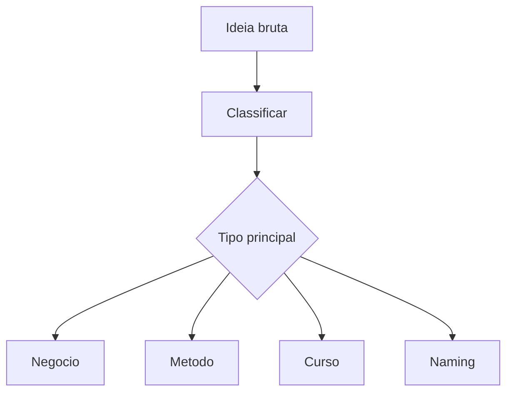

# Documento Mestre — Exploração e Classificação Inicial de Ideias — v3.0 — 07-06-2026

## Cabeçalho interno

| Campo | Informação |
|---|---|
| Código do documento | DM-08-IDE |
| Documento | Documento Mestre |
| Domínio normativo | Exploração e Classificação Inicial de Ideias |
| Responsável atual | Dante Montoya |
| Versão | v3.0 |
| Data da versão | 07-06-2026 |
| Status | em_curadoria |
| Formato | Markdown .md |
| Pasta de destino | estrutura-de-documentos-oficiais/08-exploracao-classificacao-inicial-ideias/ |
| Validação final | Pietro Carboni |
| Palavras-chave | ideias, exploração, classificação, triagem, conceito |
| Exemplos de uso | avaliar ideia, separar produto de conteúdo, priorizar exploração |
| Domínios relacionados | negócios, naming, metodologias, governança |
| Responsáveis relacionados | Dante Montoya, César Tulli, Noah Verdili, Pietro Carboni |

## 1. Objetivo do documento
Definir critérios para explorar, classificar e encaminhar ideias antes que virem produto, negócio, metodologia, curso ou projeto técnico.

## 2. Escopo do domínio normativo
Triagem conceitual, maturidade, tipo de ideia, potencial de aplicação, riscos, próximos passos e handoff para domínios adequados.

## 3. O que este domínio define
- Classificação inicial de ideia.
- Critérios de maturidade.
- Handoff conceitual.
- Registro de potencial.
- Lacunas iniciais.

## 4. O que este domínio não define
Não define plano de negócio, naming final, arquitetura técnica ou metodologia completa.

## 5. Fontes analisadas
| Fonte | Status | Uso |
|---|---|---|
| Dante v1.0 | esperada | base de ideias |
| Dante v2.0 | esperada | evolução de classificação |
| documento 99 | analisado | régua estrutural |

### Curadoria 97.2 — leitura comparativa incorporada

| Critério de busca | Resultado da curadoria | Incorporação no corpo |
|---|---|---|
| Dante, ideias, exploração, v1.0 | fonte de ideias considerada | triagem, maturidade e destino por domínio reforçados |
| Dante, classificação, v2.0 | fonte não confirmada automaticamente nesta rodada | pendência mantida |
| ideia, produto, conteúdo, plataforma | conteúdo incorporado | matriz de classificação e handoff ampliados |

## 6. Síntese executiva
Ideia precisa ser entendida antes de ser executada. Classificação inicial evita transformar intuição em projeto sem forma.

## 7. Mapa visual do domínio
```text
Ideia bruta → classificação → maturidade → destino → validação → próximo domínio
```

## 8. Princípios
| Código | Princípio | Status |
|---|---|---|
| IDE-PRI-001 | Ideia não é projeto | em_curadoria |
| IDE-PRI-002 | Classificar antes de executar | em_curadoria |

## 9. Políticas
| Código | Política | Status |
|---|---|---|
| IDE-POL-001 | Política de Triagem Inicial de Ideias | previsto |

## 10. Regras centrais
- Toda ideia deve ter descrição mínima.
- Toda ideia deve ter tipo provável.
- Toda ideia deve ter próximo domínio sugerido.
- Ideia não deve virar execução sem ficha inicial.
- Ideia com múltiplos destinos deve registrar dependência entre domínios.
- Ideia sem dono inicial deve permanecer em triagem.

## 11. Padrões oficiais e candidatos a padrão
| Código | Item | Tipo normativo | Status | Prioridade | Responsável | Validação necessária |
|---|---|---|---|---|---|---|
| IDE-PAD-001 | Padrão de Ficha Inicial de Ideia | PAD | em_curadoria | Alta | Dante | Dante/Pietro |

## 12. Protocolos reais
| Código | Protocolo | Situação | Saída esperada |
|---|---|---|---|
| IDE-PRT-001 | Protocolo de Triagem de Ideia | nova ideia | classificação inicial |

## 13. Processos
1. Registrar ideia.
2. Identificar origem.
3. Classificar tipo.
4. Avaliar maturidade.
5. Encaminhar domínio.

## 14. Procedimentos operacionais
- Preencher ficha.
- Definir categoria.
- Registrar dúvidas.
- Registrar destino.

## 15. Checklists obrigatórios
- [ ] Ideia tem descrição?
- [ ] Tem tipo provável?
- [ ] Tem dono inicial?
- [ ] Tem próximo passo?
- [ ] Tem dependência?

## 16. Matrizes obrigatórias
| Tipo de ideia | Destino provável | Validação |
|---|---|---|
| produto | negócios/técnico | César/Sávio |
| método | metodologias | Nilo |
| curso | educação | Júlio |
| marca | naming | Noah |
| agente | agentes/IA | Pierre/Klaus |
| processo | processos | Yuri |

## 17. Registros e evidências obrigatórias
- Ficha inicial.
- Registro de origem.
- Registro de encaminhamento.

## 18. Fluxos Mermaid


## 19. Dependências com outros domínios
| Tema | Depende de quem | Motivo | Tipo de dependência | Registro sugerido |
|---|---|---|---|---|
| negócio | César | viabilidade | estratégica | IDE-DEP-NEG |
| naming | Noah | nome | identidade | IDE-DEP-NAM |

## 20. Conflitos de escopo
Exploração inicial não substitui validação de negócio, metodologia ou tecnologia.

## 21. Riscos se os padrões não forem seguidos
| Risco | Causa provável | Impacto | Como prevenir | Quem acompanha |
|---|---|---|---|---|
| executar ideia imatura | falta de triagem | alto | ficha inicial | Dante |

## 22. O que deve ser monitorado pela Central de Monitoramento
| Item a monitorar | Por que monitorar | Origem do dado | Responsável | Ação se der alerta |
|---|---|---|---|---|
| ideia sem destino | risco de abandono | banco de ideias | Dante | classificar |

## 23. Relação com Biblioteca de Módulos Base, se aplicável
Pode acionar módulos futuros de banco de ideias e triagem.

## 24. Relação com módulos executores, se aplicável
Módulos de ideias, negócios e produtos devem consumir esta classificação inicial.

## 25. Lacunas e validações pendentes
| Lacuna | Impacto | Quem valida | Prioridade | Recomendação |
|---|---|---|---|---|
| ficha padrão de ideia | triagem desigual | Dante | Alta | criar subdocumento |

## 26. Decisões já tomadas
- Ideia bruta não é projeto aprovado.

## 27. Subdocumentos oficiais previstos para extração
| Código sugerido | Tipo | Nome do subdocumento | Prioridade | Status | Arquivo futuro sugerido |
|---|---|---|---|---|---|
| IDE-PAD-001 | padrão | Ficha Inicial de Ideia | Alta | previsto | ide-pad-001-ficha-inicial-ideia-v1.0-07-06-2026.md |
| IDE-MTZ-001 | matriz | Matriz de Classificação de Ideias | Alta | previsto | ide-mtz-001-matriz-classificacao-ideias-v1.0-07-06-2026.md |

## 28. Padrões atômicos sugeridos para o módulo SagB
- Cadastro de ideia.
- Classificação por destino.
- Handoff para domínio.
- Registro de maturidade da ideia.
- Matriz de destino de ideia.
- Registro de dependências iniciais.

### Curadoria 97.3 — reforço máximo incorporado ao corpo

| Pergunta prática | Resposta esperada pela Central | Critério de bloqueio |
|---|---|---|
| Quando uma ideia vira projeto? | após classificação, dono e próximo domínio | ausência de ficha inicial |
| Ideia pode ter mais de um destino? | sim, com dependências registradas | dependência não mapeada |
| Nome bonito aprova ideia? | não, naming não substitui viabilidade | sem validação de negócio |

| Código sugerido adicional | Tipo | Nome do subdocumento | Prioridade | Status | Arquivo futuro sugerido |
|---|---|---|---|---|---|
| IDE-RGT-001 | registro | Registro de Maturidade de Ideia | Alta | previsto | ide-rgt-001-registro-maturidade-ideia-v1.0-07-06-2026.md |
| IDE-PRT-001 | protocolo | Protocolo de Handoff de Ideia | Alta | previsto | ide-prt-001-protocolo-handoff-ideia-v1.0-07-06-2026.md |
| IDE-CHK-001 | checklist | Checklist de Ideia Pronta para Avaliação | Alta | previsto | ide-chk-001-checklist-ideia-pronta-avaliacao-v1.0-07-06-2026.md |

## 29. Ordem recomendada de canonização
1. Ficha inicial.
2. Matriz de classificação.
3. Protocolo de handoff.

## 30. Síntese final
Este domínio evita que ideias sejam perdidas ou executadas antes de ganharem forma adequada.

## Anexo 97.1 — Auditoria e enriquecimento de curadoria

### Fontes v1.0/v2.0 consideradas

| Fonte | Situação | Conteúdo aproveitado | Pendência |
|---|---|---|---|
| Fonte v1.0 de Dante Montoya | considerada | triagem, separação de ideia/produto/conteúdo | validar matriz final |
| Fonte v2.0 de Dante Montoya | considerada como esperada | evolução de classificação e handoff | confirmar conteúdo completo |
| Documento-base 99 | usado como régua | estrutura e busca conversacional | nenhuma |

### Exemplos práticos reforçados

| Ideia | Classificação provável | Próximo domínio |
|---|---|---|
| novo app | produto digital | técnico/negócios |
| novo método | metodologia | Nilo |
| nova formação | educação | Júlio |
| novo nome | naming | Noah |

### Reforço para busca conversacional futura

- Tenho uma ideia. Como classifico?
- Isso é produto, método, curso ou venture?
- Para quem devo encaminhar uma ideia?

### Checklist final de enriquecimento

- [x] Reforça triagem inicial.
- [x] Reforça handoff por domínio.
- [x] Reforça exemplos práticos.
- [x] Mantém status `em_curadoria`.
