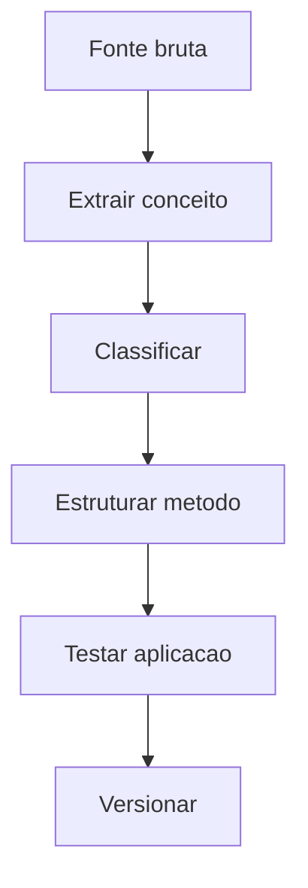

# Documento Mestre — Metodologias, Frameworks e Estruturas Intelectuais — v3.0 — 07-06-2026

## Cabeçalho interno

| Campo | Informação |
|---|---|
| Código do documento | DM-09-MET |
| Documento | Documento Mestre |
| Domínio normativo | Metodologias, Frameworks e Estruturas Intelectuais |
| Responsável atual | Nilo Barret |
| Versão | v3.0 |
| Data da versão | 07-06-2026 |
| Status | em_curadoria |
| Formato | Markdown .md |
| Pasta de destino | estrutura-de-documentos-oficiais/09-metodologias-frameworks-estruturas-intelectuais/ |
| Validação final | Pietro Carboni |
| Palavras-chave | metodologia, framework, matriz, estrutura intelectual, autoria |
| Exemplos de uso | organizar método, oficializar framework, extrair matriz |
| Domínios relacionados | educação, negócios, governança, ideias |
| Responsáveis relacionados | Nilo Barret, Júlio Mosqueira, César Tulli, Pietro Carboni |

## 1. Objetivo do documento
Definir padrões para estruturar, classificar, preservar e evoluir metodologias, frameworks, matrizes e estruturas intelectuais proprietárias.

## 2. Escopo do domínio normativo
Métodos, frameworks, matrizes, estruturas conceituais, autoria, aplicação, versões, evidências e derivados.

## 3. O que este domínio define
- Critérios de metodologia.
- Estrutura mínima de framework.
- Registro de autoria.
- Matriz de aplicação.
- Evolução de versão.

## 4. O que este domínio não define
Não define curso, negócio, naming ou implementação técnica, embora possa alimentar esses domínios.

## 5. Fontes analisadas
| Fonte | Status | Uso |
|---|---|---|
| Nilo v1.0 | esperada | base metodológica |
| Nilo v2.0 | esperada | evolução de frameworks |
| documento 99 | analisado | régua estrutural |

### Curadoria 97.2 — leitura comparativa incorporada

| Critério de busca | Resultado da curadoria | Incorporação no corpo |
|---|---|---|
| Nilo, metodologias, frameworks, v1.0 | fonte metodológica considerada | autoria, matriz, estrutura e aplicação reforçadas |
| Nilo, estruturas intelectuais, v2.0 | fonte não confirmada automaticamente nesta rodada | pendência mantida |
| método, framework, matriz, autoria | conteúdo incorporado | regras, checklist e registros ampliados |

## 6. Síntese executiva
Metodologia é ativo intelectual. Precisa de estrutura, autoria, aplicação e evidência para não virar apenas nome bonito.

## 7. Mapa visual do domínio
```text
Fala autoral → conceito → método → matriz → aplicação → evidência → versão
```

## 8. Princípios
| Código | Princípio | Status |
|---|---|---|
| MET-PRI-001 | Método precisa de estrutura replicável | em_curadoria |
| MET-PRI-002 | Autoria deve ser preservada | em_curadoria |

## 9. Políticas
| Código | Política | Status |
|---|---|---|
| MET-POL-001 | Política de Propriedade Intelectual Metodológica | previsto |

## 10. Regras centrais
- Método precisa ter objetivo.
- Framework precisa ter componentes.
- Matriz precisa ter critério de decisão.
- Autoria e origem devem ser registradas.
- Fala autoral deve ser separada de interpretação da IA.
- Metodologia sem aplicação mínima deve permanecer candidata, não oficial.
- Framework deve indicar componentes, relação entre componentes e contexto de uso.

## 11. Padrões oficiais e candidatos a padrão
| Código | Item | Tipo normativo | Status | Prioridade | Responsável | Validação necessária |
|---|---|---|---|---|---|---|
| MET-PAD-001 | Padrão de Oficialização de Metodologia | PAD | em_curadoria | Alta | Nilo | Nilo/Pietro |

## 12. Protocolos reais
| Código | Protocolo | Situação | Saída esperada |
|---|---|---|---|
| MET-PRT-001 | Protocolo de Extração de Fala Autoral | conversa ou material bruto | estrutura metodológica |

## 13. Processos
1. Identificar fala/conceito.
2. Extrair estrutura.
3. Classificar tipo.
4. Criar matriz ou framework.
5. Validar aplicação.
6. Registrar versão.

## 14. Procedimentos operacionais
- Separar fala de interpretação.
- Registrar origem.
- Nomear componentes.
- Criar checklist de aplicação.

## 15. Checklists obrigatórios
- [ ] Existe autoria?
- [ ] Existe objetivo?
- [ ] Existe estrutura?
- [ ] Existe aplicação?
- [ ] Existe evidência?

## 16. Matrizes obrigatórias
| Tipo | Critério | Exemplo |
|---|---|---|
| método | sequência replicável | metodologia comercial |
| framework | componentes organizados | matriz estratégica |
| matriz | decisão por critérios | go/no-go |

## 17. Registros e evidências obrigatórias
- Registro de origem.
- Registro de autoria.
- Exemplo de aplicação.
- Versão da estrutura.
- Registro de fala autoral.
- Registro de interpretação/curadoria.
- Registro de validação de aplicabilidade.

## 18. Fluxos Mermaid


## 19. Dependências com outros domínios
| Tema | Depende de quem | Motivo | Tipo de dependência | Registro sugerido |
|---|---|---|---|---|
| curso | Júlio | aplicação educacional | educacional | MET-DEP-EDU |
| negócio | César | aplicação estratégica | negócio | MET-DEP-NEG |

## 20. Conflitos de escopo
Metodologia estrutura pensamento; educação transforma em formação; negócio aplica no mercado.

## 21. Riscos se os padrões não forem seguidos
| Risco | Causa provável | Impacto | Como prevenir | Quem acompanha |
|---|---|---|---|---|
| perda de autoria | fonte não registrada | alto | registro obrigatório | Nilo |

## 22. O que deve ser monitorado pela Central de Monitoramento
| Item a monitorar | Por que monitorar | Origem do dado | Responsável | Ação se der alerta |
|---|---|---|---|---|
| método sem aplicação | risco de abstração | Central | Nilo | validar uso |

## 23. Relação com Biblioteca de Módulos Base, se aplicável
Pode gerar templates, matrizes e módulos de aplicação metodológica.

## 24. Relação com módulos executores, se aplicável
Módulos de educação, consultoria e negócios podem consumir metodologias oficiais.

## 25. Lacunas e validações pendentes
| Lacuna | Impacto | Quem valida | Prioridade | Recomendação |
|---|---|---|---|---|
| matriz de classificação metodológica | confusão de tipos | Nilo | Alta | extrair subdocumento |

## 26. Decisões já tomadas
- Fala autoral deve ser preservada como fonte.

## 27. Subdocumentos oficiais previstos para extração
| Código sugerido | Tipo | Nome do subdocumento | Prioridade | Status | Arquivo futuro sugerido |
|---|---|---|---|---|---|
| MET-PAD-001 | padrão | Padrão de Oficialização de Metodologia | Alta | previsto | met-pad-001-padrao-oficializacao-metodologia-v1.0-07-06-2026.md |
| MET-MTZ-001 | matriz | Matriz de Classificação Metodológica | Alta | previsto | met-mtz-001-matriz-classificacao-metodologica-v1.0-07-06-2026.md |

## 28. Padrões atômicos sugeridos para o módulo SagB
- Registro de autoria.
- Classificação de método.
- Matriz de aplicação.
- Registro de fala autoral.
- Registro de interpretação de IA.
- Checklist de aplicabilidade.

### Curadoria 97.3 — reforço máximo incorporado ao corpo

| Pergunta prática | Resposta esperada pela Central | Critério de bloqueio |
|---|---|---|
| Uma fala já é metodologia? | não, precisa estrutura replicável | ausência de componentes |
| IA pode reescrever método? | pode apoiar, mas autoria precisa ser preservada | origem não registrada |
| Método pode virar curso direto? | não sem passagem por educação | ausência de trilha educacional |

| Código sugerido adicional | Tipo | Nome do subdocumento | Prioridade | Status | Arquivo futuro sugerido |
|---|---|---|---|---|---|
| MET-RGT-001 | registro | Registro de Fala Autoral | Alta | previsto | met-rgt-001-registro-fala-autoral-v1.0-07-06-2026.md |
| MET-RGT-002 | registro | Registro de Interpretação de IA | Alta | previsto | met-rgt-002-registro-interpretacao-ia-v1.0-07-06-2026.md |
| MET-CHK-001 | checklist | Checklist de Aplicabilidade Metodológica | Alta | previsto | met-chk-001-checklist-aplicabilidade-metodologica-v1.0-07-06-2026.md |

## 29. Ordem recomendada de canonização
1. Classificação metodológica.
2. Registro de autoria.
3. Checklist de oficialização.

## 30. Síntese final
Este domínio protege e organiza os ativos intelectuais do GrupoB.

## Anexo 97.1 — Auditoria e enriquecimento de curadoria

### Fontes v1.0/v2.0 consideradas

| Fonte | Situação | Conteúdo aproveitado | Pendência |
|---|---|---|---|
| Fonte v1.0 de Nilo Barret | considerada | arquitetura de metodologias, frameworks e matrizes | validar propriedade intelectual |
| Fonte v2.0 de Nilo Barret | considerada como esperada | evolução de registros, autoria e aplicações | confirmar diferenças específicas |
| Documento-base 99 | usado como régua | tipos normativos e subdocumentos | nenhuma |

### Exemplos práticos reforçados

| Situação | Classificação | Evidência |
|---|---|---|
| fala autoral recorrente | conceito metodológico | registro de origem |
| sequência replicável | método | checklist de aplicação |
| critérios de decisão | matriz | tabela decisória |

### Reforço para busca conversacional futura

- Como oficializar uma metodologia?
- Qual a diferença entre método, framework e matriz?
- Como preservar autoria de uma fala original?

### Checklist final de enriquecimento

- [x] Reforça autoria.
- [x] Reforça matriz de classificação.
- [x] Reforça relação com educação e negócios.
- [x] Mantém status `em_curadoria`.
