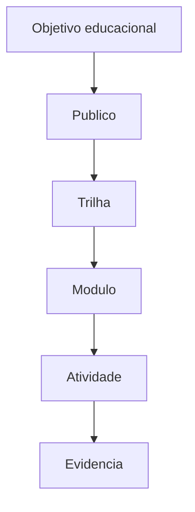

# Documento Mestre — Educação, Mentorias, Cursos, Trilhas e Programas de Formação — v3.0 — 07-06-2026

## Cabeçalho interno

| Campo | Informação |
|---|---|
| Código do documento | DM-10-EDU |
| Documento | Documento Mestre |
| Domínio normativo | Educação, Mentorias, Cursos, Trilhas e Programas de Formação |
| Responsável atual | Júlio Mosqueira |
| Versão | v3.0 |
| Data da versão | 07-06-2026 |
| Status | em_curadoria |
| Formato | Markdown .md |
| Pasta de destino | estrutura-de-documentos-oficiais/10-educacao-mentorias-cursos-trilhas-programas-formacao/ |
| Validação final | Pietro Carboni |
| Palavras-chave | educação, curso, mentoria, trilha, formação, AcadB |
| Exemplos de uso | criar curso, organizar trilha, estruturar mentoria |
| Domínios relacionados | metodologias, negócios, UX, processos |
| Responsáveis relacionados | Júlio Mosqueira, Nilo Barret, Alice Montini |

## 1. Objetivo do documento
Definir padrões para estruturar educação, mentorias, cursos, trilhas e programas de formação de forma organizada, rastreável e aplicável.

## 2. Escopo do domínio normativo
Estrutura educacional, objetivos de aprendizagem, trilhas, módulos, aulas, mentorias, evidências de aprendizado e critérios de conclusão.

## 3. O que este domínio define
- Arquitetura de curso.
- Trilha de aprendizagem.
- Critérios de conclusão.
- Registros educacionais.
- Evidências de aprendizado.

## 4. O que este domínio não define
Não define metodologia original, negócio, tecnologia da plataforma ou naming principal.

## 5. Fontes analisadas
| Fonte | Status | Uso |
|---|---|---|
| Júlio v1.0 | esperada | base educacional |
| Júlio v2.0 | esperada | evolução de trilhas |
| documento 99 | analisado | régua estrutural |

### Curadoria 97.2 — leitura comparativa incorporada

| Critério de busca | Resultado da curadoria | Incorporação no corpo |
|---|---|---|
| Júlio, educação, cursos, mentorias, v1.0 | fonte educacional considerada | trilhas, cursos, mentorias e evidência de aprendizagem reforçados |
| Júlio, programas de formação, v2.0 | fonte não confirmada automaticamente nesta rodada | pendência mantida |
| curso, trilha, módulo, mentoria | conteúdo incorporado | regras, matriz e checklist ampliados |

## 6. Síntese executiva
Educação precisa transformar conhecimento em jornada. Curso sem objetivo e evidência vira conteúdo solto.

## 7. Mapa visual do domínio
```text
Objetivo → público → trilha → módulo → aula → atividade → evidência
```

## 8. Princípios
| Código | Princípio | Status |
|---|---|---|
| EDU-PRI-001 | Aprendizado precisa de evidência | em_curadoria |
| EDU-PRI-002 | Trilha organiza evolução | em_curadoria |

## 9. Políticas
| Código | Política | Status |
|---|---|---|
| EDU-POL-001 | Política de Estrutura Educacional | previsto |

## 10. Regras centrais
- Curso deve ter objetivo.
- Trilha deve ter ordem.
- Módulo deve ter resultado esperado.
- Formação deve ter critério de conclusão.
- Mentoria deve ter promessa, escopo, sessões e entregável.
- Trilha deve indicar pré-requisitos quando existirem.
- Programa de formação deve ter marco de progresso e evidência final.

## 11. Padrões oficiais e candidatos a padrão
| Código | Item | Tipo normativo | Status | Prioridade | Responsável | Validação necessária |
|---|---|---|---|---|---|---|
| EDU-PAD-001 | Padrão de Estrutura de Curso | PAD | em_curadoria | Alta | Júlio | Júlio/Pietro |

## 12. Protocolos reais
| Código | Protocolo | Situação | Saída esperada |
|---|---|---|---|
| EDU-PRT-001 | Protocolo de Criação de Trilha | nova formação | trilha estruturada |

## 13. Processos
1. Definir público.
2. Definir objetivo.
3. Estruturar trilha.
4. Criar módulos.
5. Criar atividades.
6. Definir evidências.

## 14. Procedimentos operacionais
- Criar ementa.
- Definir módulos.
- Definir entregáveis.
- Registrar critérios.

## 15. Checklists obrigatórios
- [ ] Tem público?
- [ ] Tem objetivo?
- [ ] Tem trilha?
- [ ] Tem atividade?
- [ ] Tem evidência?

## 16. Matrizes obrigatórias
| Nível | Elemento | Evidência |
|---|---|---|
| curso | objetivo geral | ementa |
| módulo | competência | atividade |
| aula | conteúdo | entrega |
| mentoria | transformação esperada | roteiro e registro |
| programa | evolução por etapas | matriz de progresso |

## 17. Registros e evidências obrigatórias
- Ementa.
- Trilha.
- Atividade.
- Evidência de conclusão.

## 18. Fluxos Mermaid


## 19. Dependências com outros domínios
| Tema | Depende de quem | Motivo | Tipo de dependência | Registro sugerido |
|---|---|---|---|---|
| metodologia | Nilo | conteúdo base | metodológica | EDU-DEP-MET |
| UX | Alice | experiência de aprendizagem | visual | EDU-DEP-UX |

## 20. Conflitos de escopo
Educação organiza aprendizado; metodologia define conteúdo intelectual; negócio define oferta.

## 21. Riscos se os padrões não forem seguidos
| Risco | Causa provável | Impacto | Como prevenir | Quem acompanha |
|---|---|---|---|---|
| curso sem resultado | falta de objetivo | alto | ementa obrigatória | Júlio |

## 22. O que deve ser monitorado pela Central de Monitoramento
| Item a monitorar | Por que monitorar | Origem do dado | Responsável | Ação se der alerta |
|---|---|---|---|---|
| trilha sem evidência | baixa qualidade | plataforma | Júlio | revisar |

## 23. Relação com Biblioteca de Módulos Base, se aplicável
Pode gerar módulos base de trilhas, aulas, progresso e certificação.

## 24. Relação com módulos executores, se aplicável
AcadB e módulos educacionais devem seguir esta estrutura.

## 25. Lacunas e validações pendentes
| Lacuna | Impacto | Quem valida | Prioridade | Recomendação |
|---|---|---|---|---|
| padrão de ementa | cursos heterogêneos | Júlio | Alta | criar subdocumento |

## 26. Decisões já tomadas
- Educação é domínio próprio, separado de metodologia.

## 27. Subdocumentos oficiais previstos para extração
| Código sugerido | Tipo | Nome do subdocumento | Prioridade | Status | Arquivo futuro sugerido |
|---|---|---|---|---|---|
| EDU-PAD-001 | padrão | Padrão de Estrutura de Curso | Alta | previsto | edu-pad-001-padrao-estrutura-curso-v1.0-07-06-2026.md |
| EDU-CHK-001 | checklist | Checklist de Criação de Trilha | Alta | previsto | edu-chk-001-checklist-criacao-trilha-v1.0-07-06-2026.md |

## 28. Padrões atômicos sugeridos para o módulo SagB
- Cadastro de curso.
- Trilha com módulos.
- Evidência de conclusão.
- Roteiro de mentoria.
- Matriz de progresso do aluno.
- Registro de evidência de aprendizagem.

### Curadoria 97.3 — reforço máximo incorporado ao corpo

| Pergunta prática | Resposta esperada pela Central | Critério de bloqueio |
|---|---|---|
| Curso pode nascer sem objetivo? | não | ausência de ementa |
| Mentoria precisa de entregável? | sim | promessa sem roteiro ou registro |
| Trilha está completa quando? | quando tem módulos, marcos e evidência final | ausência de critério de conclusão |

| Código sugerido adicional | Tipo | Nome do subdocumento | Prioridade | Status | Arquivo futuro sugerido |
|---|---|---|---|---|---|
| EDU-PAD-002 | padrão | Padrão de Roteiro de Mentoria | Alta | previsto | edu-pad-002-padrao-roteiro-mentoria-v1.0-07-06-2026.md |
| EDU-MTZ-001 | matriz | Matriz de Progresso de Formação | Alta | previsto | edu-mtz-001-matriz-progresso-formacao-v1.0-07-06-2026.md |
| EDU-RGT-001 | registro | Registro de Evidência de Aprendizagem | Alta | previsto | edu-rgt-001-registro-evidencia-aprendizagem-v1.0-07-06-2026.md |

## 29. Ordem recomendada de canonização
1. Estrutura de curso.
2. Checklist de trilha.
3. Evidência de aprendizado.

## 30. Síntese final
Este domínio transforma conhecimento em jornada estruturada e avaliável.

## Anexo 97.1 — Auditoria e enriquecimento de curadoria

### Fontes v1.0/v2.0 consideradas

| Fonte | Situação | Conteúdo aproveitado | Pendência |
|---|---|---|---|
| Fonte v1.0 de Júlio Mosqueira | considerada | cursos, mentorias, trilhas e estrutura educacional | validar padrão de ementa |
| Fonte v2.0 de Júlio Mosqueira | considerada como esperada | evolução de programas e evidências de aprendizagem | confirmar conteúdo completo |
| Documento-base 99 | usado como régua | monitoramento e exemplos | nenhuma |

### Exemplos práticos reforçados

| Situação | Estrutura mínima | Evidência |
|---|---|---|
| criar curso | objetivo, público, trilha | ementa |
| criar mentoria | promessa, sessões, entrega | roteiro |
| criar programa | módulos, marcos, avaliação | matriz de progresso |

### Reforço para busca conversacional futura

- Quero criar um curso. O que devo olhar?
- Como montar uma trilha de formação?
- Que evidência prova aprendizagem?

### Checklist final de enriquecimento

- [x] Reforça estrutura educacional.
- [x] Reforça evidência de aprendizagem.
- [x] Reforça relação com metodologias.
- [x] Mantém status `em_curadoria`.
