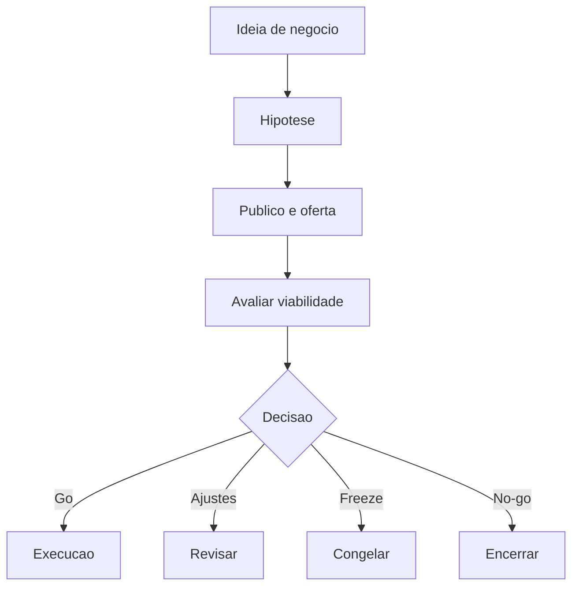

# Documento Mestre — Marcas, Empresas, Ventures e Planos de Negócio — v3.0 — 07-06-2026

## Cabeçalho interno

| Campo | Informação |
|---|---|
| Código do documento | DM-11-NEG |
| Documento | Documento Mestre |
| Domínio normativo | Marcas, Empresas, Ventures e Planos de Negócio |
| Responsável atual | César Tulli |
| Versão | v3.0 |
| Data da versão | 07-06-2026 |
| Status | em_curadoria |
| Formato | Markdown .md |
| Pasta de destino | estrutura-de-documentos-oficiais/11-marcas-empresas-ventures-planos-negocio/ |
| Validação final | Pietro Carboni |
| Palavras-chave | negócio, venture, empresa, marca, plano, viabilidade |
| Exemplos de uso | criar venture, avaliar negócio, estruturar plano |
| Domínios relacionados | ideias, naming, técnico, metodologias, educação |
| Responsáveis relacionados | César Tulli, Dante Montoya, Noah Verdili, Sávio Codare |

## 1. Objetivo do documento
Definir padrões para estruturar marcas, empresas, ventures e planos de negócio com clareza, viabilidade, governança e handoff para execução.

## 2. Escopo do domínio normativo
Negócios, ventures, empresas, modelos iniciais, plano de negócio, viabilidade, decisão go/no-go e integração com naming, ideias e execução.

## 3. O que este domínio define
- Estrutura inicial de negócio.
- Critérios de viabilidade.
- Plano mínimo.
- Handoff para execução.
- Matriz go/ajustes/freeze/no-go.

## 4. O que este domínio não define
Não define naming final, arquitetura técnica, metodologia base ou curso, embora dependa deles.

## 5. Fontes analisadas
| Fonte | Status | Uso |
|---|---|---|
| César v1.0 | esperada | base de negócios |
| César v2.0 | esperada | evolução de ventures |
| documento 99 | analisado | régua estrutural |

### Curadoria 97.2 — leitura comparativa incorporada

| Critério de busca | Resultado da curadoria | Incorporação no corpo |
|---|---|---|
| César, negócios, ventures, v1.0 | fonte de negócio considerada | venture, proposta, público, oferta e decisão reforçados |
| César, empresas, planos de negócio, v2.0 | fonte não confirmada automaticamente nesta rodada | pendência mantida |
| negócio, marca, venture, plano | conteúdo incorporado | matriz go/no-go, handoff e riscos ampliados |

## 6. Síntese executiva
Negócio precisa sair do desejo e entrar em estrutura: proposta, público, entrega, canal, margem, risco e decisão.

## 7. Mapa visual do domínio
```text
Ideia → proposta → público → oferta → operação → viabilidade → decisão
```

## 8. Princípios
| Código | Princípio | Status |
|---|---|---|
| NEG-PRI-001 | Negócio precisa de hipótese clara | em_curadoria |
| NEG-PRI-002 | Venture precisa de decisão explícita | em_curadoria |

## 9. Políticas
| Código | Política | Status |
|---|---|---|
| NEG-POL-001 | Política de Estruturação Inicial de Ventures | previsto |

## 10. Regras centrais
- Toda venture deve ter proposta.
- Toda proposta deve ter público.
- Toda decisão deve registrar go/ajustes/freeze/no-go.
- Nome não substitui plano.
- Negócio sem hipótese clara deve voltar para exploração de ideias.
- Venture sem decisão registrada não deve ir para execução.
- Handoff para execução deve indicar responsável, prioridade, risco e evidência mínima.

## 11. Padrões oficiais e candidatos a padrão
| Código | Item | Tipo normativo | Status | Prioridade | Responsável | Validação necessária |
|---|---|---|---|---|---|---|
| NEG-PAD-001 | Padrão de Descrição Inicial de Negócio | PAD | em_curadoria | Alta | César | César/Pietro |

## 12. Protocolos reais
| Código | Protocolo | Situação | Saída esperada |
|---|---|---|---|
| NEG-PRT-001 | Protocolo de Handoff para Execução | negócio validado | pacote de execução |

## 13. Processos
1. Receber ideia.
2. Formular hipótese.
3. Definir público.
4. Definir oferta.
5. Avaliar viabilidade.
6. Decidir.
7. Encaminhar execução.

## 14. Procedimentos operacionais
- Preencher ficha de negócio.
- Registrar hipóteses.
- Mapear riscos.
- Registrar decisão.

## 15. Checklists obrigatórios
- [ ] Proposta clara?
- [ ] Público definido?
- [ ] Oferta definida?
- [ ] Risco mapeado?
- [ ] Decisão registrada?

## 16. Matrizes obrigatórias
| Resultado | Critério | Próxima ação |
|---|---|---|
| go | viável | executar |
| ajustes | promissor incompleto | revisar |
| freeze | não prioritário | congelar |
| no-go | inviável | encerrar |
| pesquisar | hipótese insuficiente | voltar para exploração |
| prototipar | incerteza testável | experimento controlado |

## 17. Registros e evidências obrigatórias
- Ficha de negócio.
- Registro de hipótese.
- Matriz de decisão.
- Handoff para execução.

## 18. Fluxos Mermaid


## 19. Dependências com outros domínios
| Tema | Depende de quem | Motivo | Tipo de dependência | Registro sugerido |
|---|---|---|---|---|
| ideia | Dante | origem conceitual | estratégica | NEG-DEP-IDE |
| naming | Noah | nome | identidade | NEG-DEP-NAM |
| técnico | Sávio | execução digital | técnica | NEG-DEP-TEC |

## 20. Conflitos de escopo
Negócio define viabilidade; naming define nome; técnico define construção; processos definem execução.

## 21. Riscos se os padrões não forem seguidos
| Risco | Causa provável | Impacto | Como prevenir | Quem acompanha |
|---|---|---|---|---|
| executar negócio frágil | falta de matriz | alto | go/no-go | César |

## 22. O que deve ser monitorado pela Central de Monitoramento
| Item a monitorar | Por que monitorar | Origem do dado | Responsável | Ação se der alerta |
|---|---|---|---|---|
| venture sem decisão | execução indevida | registro | César | bloquear execução |

## 23. Relação com Biblioteca de Módulos Base, se aplicável
Negócios digitais podem acionar módulos base técnicos após decisão go.

## 24. Relação com módulos executores, se aplicável
Módulos de CRM, funil, produto e operação podem depender deste domínio.

## 25. Lacunas e validações pendentes
| Lacuna | Impacto | Quem valida | Prioridade | Recomendação |
|---|---|---|---|---|
| ficha padrão de venture | decisões inconsistentes | César | Alta | criar subdocumento |

## 26. Decisões já tomadas
- Venture precisa de decisão explícita antes de execução.

## 27. Subdocumentos oficiais previstos para extração
| Código sugerido | Tipo | Nome do subdocumento | Prioridade | Status | Arquivo futuro sugerido |
|---|---|---|---|---|---|
| NEG-PAD-001 | padrão | Descrição Inicial de Negócio | Alta | previsto | neg-pad-001-descricao-inicial-negocio-v1.0-07-06-2026.md |
| NEG-MTZ-001 | matriz | Matriz Go Ajustes Freeze No-go | Alta | previsto | neg-mtz-001-matriz-go-ajustes-freeze-no-go-v1.0-07-06-2026.md |
| NEG-PRT-001 | protocolo | Handoff de Negócio para Execução | Alta | previsto | neg-prt-001-handoff-negocio-execucao-v1.0-07-06-2026.md |

## 28. Padrões atômicos sugeridos para o módulo SagB
- Ficha de venture.
- Matriz de decisão.
- Handoff para execução.
- Registro de hipótese de negócio.
- Registro de validação de proposta.
- Matriz de risco de venture.

### Curadoria 97.3 — reforço máximo incorporado ao corpo

| Pergunta prática | Resposta esperada pela Central | Critério de bloqueio |
|---|---|---|
| Ideia já é negócio? | não, precisa hipótese, público e oferta | ausência de proposta |
| Nome bonito aprova venture? | não, naming não substitui viabilidade | ausência de matriz go/no-go |
| Quando executar? | após decisão go ou prototipar | decisão não registrada |

| Código sugerido adicional | Tipo | Nome do subdocumento | Prioridade | Status | Arquivo futuro sugerido |
|---|---|---|---|---|---|
| NEG-RGT-001 | registro | Registro de Hipótese de Negócio | Alta | previsto | neg-rgt-001-registro-hipotese-negocio-v1.0-07-06-2026.md |
| NEG-MTZ-002 | matriz | Matriz de Risco de Venture | Alta | previsto | neg-mtz-002-matriz-risco-venture-v1.0-07-06-2026.md |
| NEG-CHK-001 | checklist | Checklist de Venture Pronta para Execução | Alta | previsto | neg-chk-001-checklist-venture-pronta-execucao-v1.0-07-06-2026.md |

## 29. Ordem recomendada de canonização
1. Ficha inicial de negócio.
2. Matriz go/no-go.
3. Handoff para execução.

## 30. Síntese final
Este domínio transforma ideia de negócio em decisão estruturada e executável.

## Anexo 97.1 — Auditoria e enriquecimento de curadoria

### Fontes v1.0/v2.0 consideradas

| Fonte | Situação | Conteúdo aproveitado | Pendência |
|---|---|---|---|
| Fonte v1.0 de César Tulli | considerada | ventures, estruturação de negócio e decisão | validar matriz go/no-go |
| Fonte v2.0 de César Tulli | considerada como esperada | evolução de planos, empresas e handoffs | confirmar diferenças específicas |
| Documento-base 99 | usado como régua | neutralidade e aplicações | nenhuma |

### Exemplos práticos reforçados

| Situação | Documento/registro | Próximo passo |
|---|---|---|
| ideia de venture | ficha inicial de negócio | matriz go/no-go |
| marca com potencial | registro de naming | validação Noah |
| negócio aprovado | handoff para execução | processos/técnico |

### Reforço para busca conversacional futura

- Quero criar uma venture. Quais padrões devo consultar?
- Como decidir go ou no-go?
- Quando uma ideia vira negócio?

### Checklist final de enriquecimento

- [x] Reforça matriz go/no-go.
- [x] Reforça relação com ideias e naming.
- [x] Reforça handoff para execução.
- [x] Mantém status `em_curadoria`.
