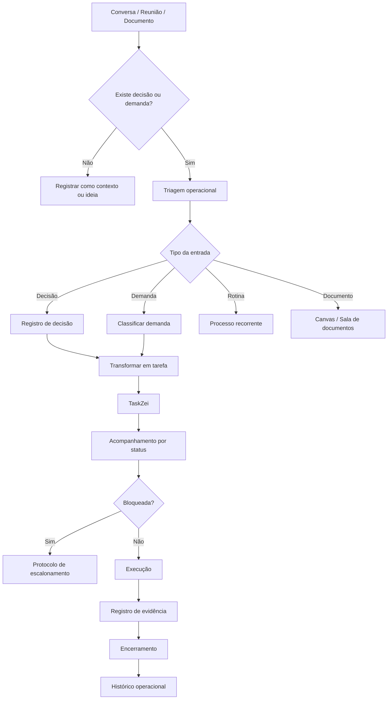
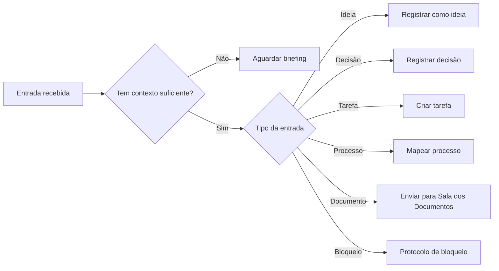
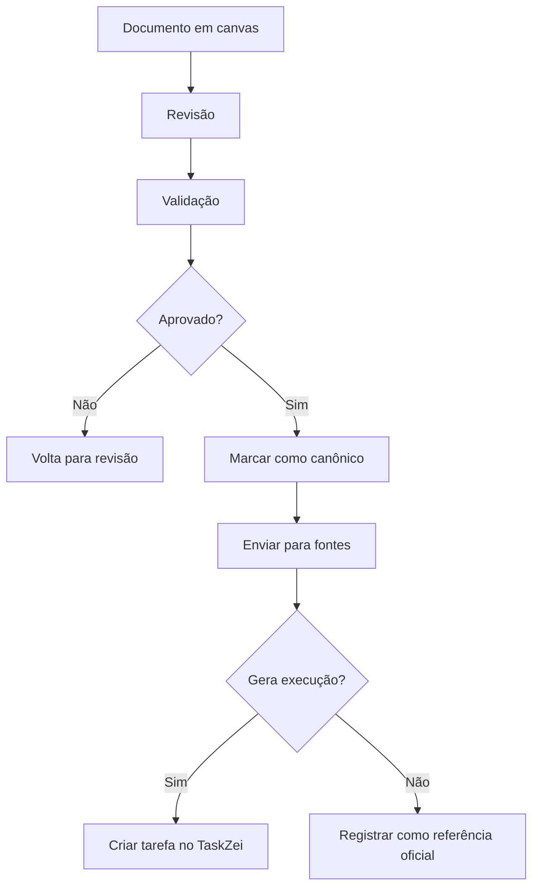
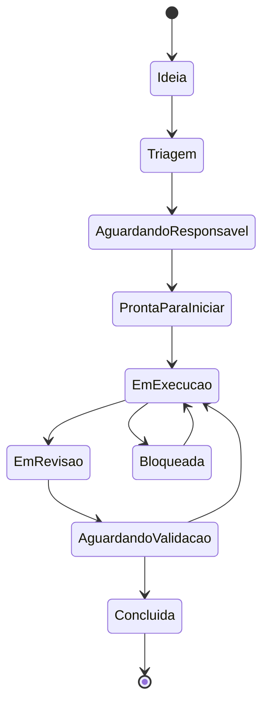
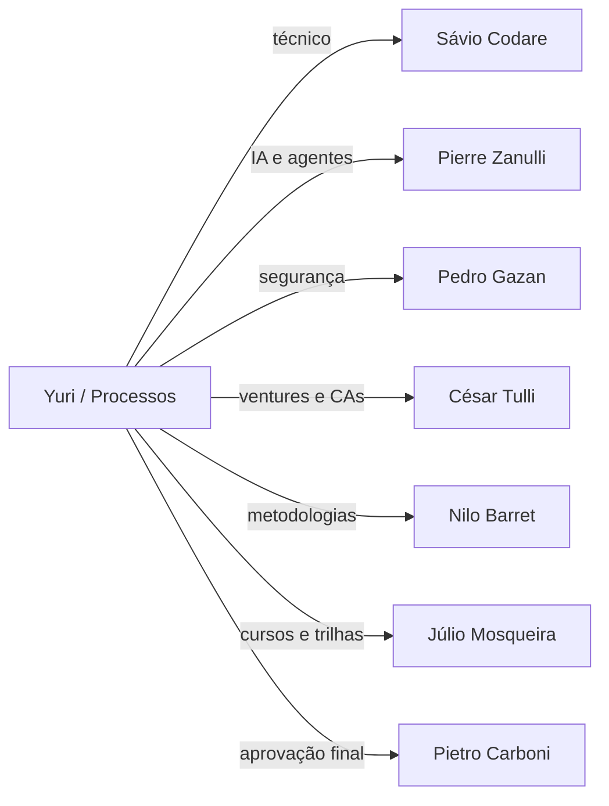
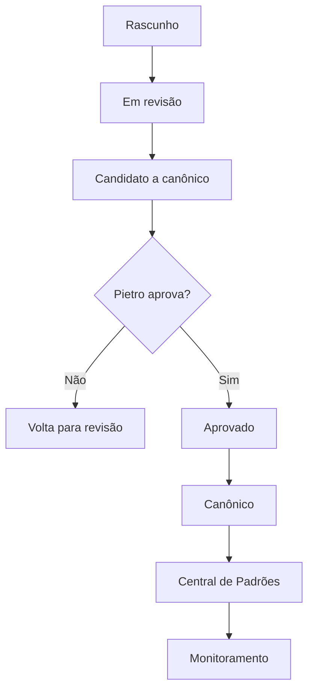
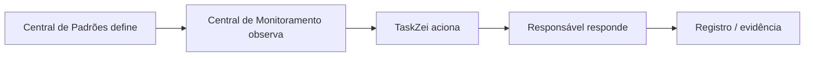

Yuri Sague online. Rodrigues, o arquivo recebido é a **próxima missão: Documento Mestre de Padrões da Divisão**. Ele pede um documento profundo, em Markdown, reunindo os padrões reais da divisão, sem confundir com um modelo de escrita documental. Também exige classificação normativa, fluxos Mermaid, status, riscos, lacunas, dependências e padrões extraíveis para o SagB.  

Abaixo está a versão pronta para colar como documento.

---

# Documento Mestre de Padrões — Processos, Organização Operacional, Execução, Registros e TaskZei — v1

**Nome sugerido do arquivo:**

```text
documento-mestre-padroes-processos-execucao-registro-operacional-taskzei-v1-06-06-2026.md
```

| Campo        | Informação                                                                                |
| ------------ | ----------------------------------------------------------------------------------------- |
| Documento    | Documento Mestre de Padrões                                                               |
| Divisão      | Processos, Organização Operacional, Execução, Registros e TaskZei                         |
| Responsável  | Yuri Sague                                                                                |
| Solicitante  | Pietro Carboni                                                                            |
| Ecossistema  | GrupoB / Loze / SagB                                                                      |
| Status       | em revisão                                                                                |
| Versão       | v1                                                                                        |
| Data         | 06/06/2026                                                                                |
| Base         | Missão 1, Missão 2, histórico do chat, decisões operacionais e missão do Documento Mestre |
| Canonicidade | precisa validação de Pietro Carboni                                                       |

---

## Color code

```text
🟢 bom / aprovado / suficiente
🟡 atenção / parcial / precisa ajuste
🔴 crítico / ausente / risco alto
🔵 oportunidade estratégica
🟣 governança / padrão / decisão estrutural
⚫ contexto neutro
```

---

## Classificação normativa

```text
🔵 princípio
🟣 política
🔴 regra
🟠 padrão
🟢 protocolo
⚙️ processo
🧩 procedimento
✅ checklist
📊 matriz
🧾 registro/evidência
⚠️ risco
💡 recomendação
📌 decisão
❓ dúvida/lacuna
🚨 crítico
```

Regra central:

```text
Princípio orienta.
Política posiciona.
Regra limita.
Padrão organiza.
Protocolo conduz uma situação específica.
Processo conecta etapas.
Procedimento executa passo específico.
Checklist confere.
Matriz decide.
Registro prova.
```

---

# 1. Objetivo do documento

Este documento reúne, organiza e detalha os padrões da divisão **Processos, Organização Operacional, Execução, Registros e TaskZei** dentro da Central de Padrões do GrupoB / Loze no SagB.

A função da divisão é garantir que decisões, ideias, conversas, reuniões e documentos não fiquem soltos, mas avancem para execução rastreável.

A área responde principalmente por:

```text
decisão → tarefa → acompanhamento → evidência → encerramento
```

Também organiza a relação entre:

```text
chat → canvas → documento → fonte → tarefa → TaskZei → registro
```

---

# 2. Escopo da divisão

## Dentro do escopo

Esta divisão define padrões para:

* decisões que viram tarefas;
* entrada e triagem de demandas;
* campos mínimos de tarefas;
* status operacionais;
* prioridades;
* responsáveis;
* prazos;
* evidências;
* bloqueios;
* escalonamentos;
* encerramentos;
* handoffs;
* reuniões com saída executável;
* rotinas recorrentes;
* tabelas vivas;
* acompanhamento no TaskZei;
* registros operacionais;
* cadência de revisão;
* vínculo entre padrões, documentos e tarefas.

## Fora do escopo

Esta divisão não define:

* arquitetura técnica do TaskZei;
* banco de dados;
* APIs;
* UX/UI das telas;
* segurança digital;
* agentes autônomos;
* metodologias proprietárias;
* naming de marcas;
* estrutura societária;
* plano de negócio das ventures;
* aprovação canônica final.

Quando esses temas aparecerem, devem ser tratados como dependência.

---

# 3. O que esta divisão define

| Tema                           |                       A divisão define? | Observação                           |
| ------------------------------ | --------------------------------------: | ------------------------------------ |
| Como decisão vira tarefa       |                                     Sim | Núcleo da área                       |
| Campos mínimos de tarefa       |                                     Sim | Deve virar padrão oficial            |
| Status operacionais            |                      Sim, com validação | Precisa alinhar com TaskZei          |
| Evidência mínima               |                                     Sim | Precisa matriz por tipo de entrega   |
| Bloqueio e escalonamento       |                                     Sim | Deve virar protocolo real            |
| Reunião com saída executável   |                                     Sim | Deve ter ata, decisão e próxima ação |
| Handoff operacional            |                                     Sim | Evita perda de contexto              |
| Arquitetura técnica do sistema |                                     Não | Dependência com Sávio Codare         |
| Automação por IA               |              Não define, apenas integra | Dependência com Pierre Zanulli       |
| Segurança de evidências        |                      Não define sozinha | Dependência com Pedro Gazan          |
| Organograma e CAs              | Não define, apenas usa como responsável | Dependência com César Tulli          |
| Metodologias                   |                              Não define | Dependência com Nilo Barret e Pietro |

---

# 4. O que esta divisão não define

Esta divisão não deve assumir:

1. **Tecnologia do SagB ou TaskZei**
   Responsável: Sávio Codare.

2. **UX/UI do TaskZei**
   Responsável: Alice Montini.

3. **Segurança, acessos e credenciais**
   Responsável: Pedro Gazan.

4. **Agentes, memória e IA autônoma**
   Responsável: Pierre Zanulli.

5. **Metodologias, frameworks e doutrina mental**
   Responsáveis: Nilo Barret e Pietro Carboni.

6. **Empresas, ventures, planos de negócio e organogramas institucionais**
   Responsável: César Tulli.

7. **Cursos, trilhas e programas educacionais**
   Responsável: Júlio Mosqueira.

---

# 5. Fontes analisadas

| Fonte                                        | Uso no documento                                                                        |
| -------------------------------------------- | --------------------------------------------------------------------------------------- |
| Missão 1                                     | Estrutura inicial do bloco                                                              |
| Missão 2                                     | Auditoria e revisão do bloco                                                            |
| Histórico deste chat                         | Decisões operacionais e padrões discutidos                                              |
| Conversas sobre Sala dos Documentos Oficiais | Regra chat/canvas/fonte                                                                 |
| Conversas sobre 3forB                        | Chats base, salas operacionais e ativos                                                 |
| Conversas sobre Site, PACs e Ativos Digitais | Tabela viva, status e governança de ativos                                              |
| Conversas sobre CAs                          | Responsável, organograma e vínculo operacional                                          |
| Conversas sobre Loze local                   | Separação raiz, QG, produto e repositório                                               |
| Missão Documento Mestre                      | Estrutura obrigatória, classificação normativa, Mermaid, status e profundidade esperada |

---

# 6. Síntese executiva

A divisão já possui base forte para avançar como documento-mãe da área.

O que está mais definido:

* decisão precisa virar execução rastreável;
* tarefa precisa ter responsável, prazo, prioridade, status e evidência;
* bloqueio precisa ser visível;
* encerramento exige evidência;
* reunião precisa gerar saída executável;
* TaskZei não deve virar depósito de ideias;
* documentos oficiais não devem nascer direto nas fontes;
* canvas constrói, fonte oficializa;
* tabela viva é ferramenta de controle;
* chat não é fonte canônica;
* tarefa precisa ter vínculo com projeto, padrão, documento, responsável ou decisão.

O que ainda precisa validação:

* status finais do TaskZei;
* quem pode criar tarefa oficial;
* quem pode encerrar tarefa;
* evidência mínima por tipo de tarefa;
* periodicidade obrigatória de revisão;
* regra de tarefas emergenciais;
* integração técnica entre TaskZei, documentos, agentes e SagB.

---

# 7. Mapa visual da divisão



---

# 8. Princípios da área

## 🔵 PR-01 — Conversa não é execução

Uma conversa pode gerar decisão, mas não deve ser tratada como execução.

Para virar execução precisa de:

* ação clara;
* responsável;
* prazo;
* prioridade;
* status;
* evidência esperada;
* próximo passo.

---

## 🔵 PR-02 — Decisão sem registro vira ruído

Toda decisão relevante precisa deixar rastro.

Se não houver registro, a decisão pode ser esquecida, reinterpretada ou repetida em outro chat.

---

## 🔵 PR-03 — Toda execução precisa de dono

Tarefa sem responsável não está em execução.

Status correto:

```text
aguardando responsável
```

---

## 🔵 PR-04 — Evidência fecha o ciclo

Uma tarefa só deve ser encerrada quando houver evidência compatível com o tipo de entrega.

---

## 🔵 PR-05 — TaskZei não é depósito

TaskZei deve receber tarefas tratadas, classificadas e acompanháveis.

Não deve receber ideia bruta sem triagem.

---

## 🔵 PR-06 — Processo existe para reduzir memória manual

A função do processo é impedir que a operação dependa apenas da lembrança das pessoas.

---

# 9. Políticas da área

## 🟣 POL-01 — Política de decisão registrável

Toda decisão que altere prioridade, escopo, responsável, prazo, padrão, documento, cliente, entrega, ativo, módulo ou governança deve ser registrada.

---

## 🟣 POL-02 — Política de fontes limpas

Fontes do projeto não devem receber:

* rascunhos;
* documentos parciais;
* versões duplicadas;
* material sem validação;
* texto ainda em discussão.

Fluxo correto:

```text
canvas → revisão → validação → canônico → fonte
```

---

## 🟣 POL-03 — Política de tarefa com dono

Nenhuma tarefa deve entrar como ativa sem responsável definido.

---

## 🟣 POL-04 — Política de bloqueio visível

Toda tarefa bloqueada precisa registrar:

* causa;
* responsável pelo desbloqueio;
* prazo de resposta;
* próxima ação.

---

## 🟣 POL-05 — Política de encerramento com evidência

Tarefa concluída sem evidência não deve ser considerada encerrada.

---

# 10. Regras centrais da área

## 🔴 REG-01 — Toda tarefa deve ter responsável

Obrigatório.

---

## 🔴 REG-02 — Toda tarefa deve ter status

Obrigatório.

---

## 🔴 REG-03 — Toda tarefa deve ter próxima ação

Obrigatório.

---

## 🔴 REG-04 — Toda tarefa bloqueada deve ter causa registrada

Obrigatório.

---

## 🔴 REG-05 — Decisão estratégica não deve virar tarefa genérica

A decisão precisa ser quebrada em ação executável.

---

## 🔴 REG-06 — Tarefa encerrada exige evidência

Obrigatório.

---

## 🔴 REG-07 — Tarefa atrasada exige revisão

A tarefa deve ser:

* replanejada;
* escalada;
* cancelada;
* reduzida;
* trocada de responsável;
* ou marcada como bloqueada.

---

# 11. Padrões oficiais e candidatos a padrão

| Código | Padrão                                    | Status               | Prioridade |
| ------ | ----------------------------------------- | -------------------- | ---------- |
| PAD-01 | Padrão de tarefa operacional              | candidato a canônico | crítico    |
| PAD-02 | Padrão de status TaskZei                  | precisa validação    | crítico    |
| PAD-03 | Padrão de prioridade operacional          | em revisão           | V1         |
| PAD-04 | Padrão de tabela viva operacional         | candidato a canônico | V1         |
| PAD-05 | Padrão de evidência mínima                | precisa validação    | crítico    |
| PAD-06 | Padrão de reunião com saída executável    | em revisão           | V1         |
| PAD-07 | Padrão chat/canvas/fonte/TaskZei          | candidato a canônico | V1         |
| PAD-08 | Padrão de vínculo tarefa/documento/padrão | em revisão           | V1         |

---

# 12. Protocolos reais da área

## 🟢 PROT-01 — Protocolo de decisão que vira tarefa

### Quando usar

Quando uma conversa, reunião ou documento gerar decisão que exige execução.

### Sequência obrigatória

1. Registrar a decisão.
2. Identificar se exige execução.
3. Transformar em tarefa objetiva.
4. Definir responsável.
5. Definir prazo.
6. Definir prioridade.
7. Definir status inicial.
8. Definir evidência esperada.
9. Vincular a projeto, documento, padrão ou área.
10. Enviar para TaskZei.

### Saída esperada

Tarefa criada e acompanhável.

---

## 🟢 PROT-02 — Protocolo de escalonamento de bloqueio

### Quando usar

Quando uma tarefa estiver parada por falta de informação, autorização, recurso, acesso, responsável ou validação.

### Sequência obrigatória

1. Registrar bloqueio.
2. Identificar causa.
3. Identificar quem desbloqueia.
4. Definir prazo de resposta.
5. Atualizar status.
6. Escalar se o prazo vencer.
7. Registrar decisão recebida.
8. Atualizar próxima ação.

### Saída esperada

Bloqueio visível e plano de desbloqueio definido.

---

## 🟢 PROT-03 — Protocolo de encerramento de tarefa

### Quando usar

Quando uma tarefa for considerada concluída.

### Sequência obrigatória

1. Conferir escopo.
2. Verificar evidência.
3. Validar entrega, se necessário.
4. Registrar pendências residuais.
5. Criar nova tarefa, se houver pendência.
6. Atualizar status.
7. Registrar data de conclusão.

### Saída esperada

Tarefa encerrada com evidência e histórico.

---

## 🟢 PROT-04 — Protocolo de reunião com saída executável

### Quando usar

Toda vez que uma reunião gerar decisão, tarefa ou pendência.

### Sequência obrigatória

1. Definir objetivo da reunião.
2. Definir tempo.
3. Registrar participantes.
4. Registrar decisões.
5. Criar tarefas derivadas.
6. Definir responsáveis.
7. Definir prazos.
8. Encerrar com próximos passos.

### Saída esperada

Reunião encerrada com decisões e execução encaminhada.

---

# 13. Processos da área

## ⚙️ PROC-01 — Processo de entrada e triagem de demanda



---

## ⚙️ PROC-02 — Processo de acompanhamento de tarefa

1. Revisar status.
2. Verificar responsável.
3. Verificar prazo.
4. Verificar prioridade.
5. Verificar bloqueio.
6. Atualizar próxima ação.
7. Registrar evidência.
8. Encerrar ou replanejar.

---

## ⚙️ PROC-03 — Processo de criação de rotina recorrente

1. Identificar repetição.
2. Definir frequência.
3. Definir responsável.
4. Definir checklist.
5. Definir evidência recorrente.
6. Criar registro.
7. Revisar periodicamente.

---

## ⚙️ PROC-04 — Processo documento aprovado para tarefa



---

# 14. Procedimentos operacionais

## 🧩 PROC-OP-01 — Criar tarefa

1. Nomear tarefa.
2. Definir área.
3. Definir responsável.
4. Definir prazo.
5. Definir prioridade.
6. Definir status.
7. Definir evidência esperada.
8. Vincular origem.
9. Enviar para TaskZei.

---

## 🧩 PROC-OP-02 — Registrar evidência

1. Abrir tarefa.
2. Identificar tipo de entrega.
3. Anexar link, arquivo, print ou comentário.
4. Registrar data.
5. Registrar responsável.
6. Atualizar status.

---

## 🧩 PROC-OP-03 — Fazer handoff

1. Registrar responsável atual.
2. Registrar novo responsável.
3. Explicar contexto.
4. Listar pendências.
5. Informar prazo.
6. Informar evidências existentes.
7. Confirmar aceite.

---

# 15. Checklists obrigatórios

## ✅ Checklist decisão que vira tarefa

* [ ] Decisão registrada
* [ ] Exige execução
* [ ] Tarefa descrita com ação objetiva
* [ ] Responsável definido
* [ ] Prazo definido
* [ ] Prioridade definida
* [ ] Status inicial definido
* [ ] Área definida
* [ ] Vínculo definido
* [ ] Evidência esperada definida
* [ ] Próxima ação clara

---

## ✅ Checklist antes de iniciar execução

* [ ] Escopo claro
* [ ] Responsável definido
* [ ] Prazo definido
* [ ] Contexto suficiente
* [ ] Critério de conclusão definido
* [ ] Evidência esperada definida
* [ ] Dependências conhecidas
* [ ] Bloqueios iniciais avaliados

---

## ✅ Checklist antes de encerrar tarefa

* [ ] Entrega realizada
* [ ] Evidência registrada
* [ ] Validação feita, se necessária
* [ ] Pendências residuais registradas
* [ ] Nova tarefa criada, se necessário
* [ ] Histórico atualizado
* [ ] Status final atualizado

---

# 16. Matrizes obrigatórias

## 📊 Matriz decisão, tarefa, rotina, processo, projeto e protocolo

| Tipo      | Definição             | Exemplo                    | Saída                |
| --------- | --------------------- | -------------------------- | -------------------- |
| Decisão   | Escolha tomada        | Aprovar estrutura de chats | Registro             |
| Tarefa    | Ação objetiva         | Criar chat Marketing 3forB | Entrega              |
| Rotina    | Ação recorrente       | Revisão semanal            | Histórico            |
| Processo  | Fluxo com etapas      | Entrada até encerramento   | Execução padronizada |
| Projeto   | Conjunto de entregas  | Novo site da 3forB         | Resultado macro      |
| Protocolo | Sequência obrigatória | Escalonamento de bloqueio  | Resposta padronizada |

---

## 📊 Matriz de prioridade operacional

| Critério     | Pergunta                       | Peso       |
| ------------ | ------------------------------ | ---------- |
| Urgência     | Precisa resolver agora?        | Alto       |
| Impacto      | Afeta resultado ou cliente?    | Alto       |
| Risco        | Pode gerar dano ou retrabalho? | Alto       |
| Dependência  | Bloqueia outras tarefas?       | Médio/Alto |
| Esforço      | É simples ou complexo?         | Médio      |
| Prazo        | Tem data crítica?              | Alto       |
| Responsável  | Existe dono claro?             | Médio      |
| Consequência | O que acontece se atrasar?     | Alto       |

---

# 17. Registros e evidências obrigatórias

## 🧾 Registro operacional mínimo

```text
Data:
Origem:
Decisão ou demanda:
Responsável:
Prazo:
Status:
Prioridade:
Área:
Vínculo com projeto/documento/padrão:
Evidência esperada:
Evidência registrada:
Próxima ação:
Histórico:
```

---

## 🧾 Registro de bloqueio

```text
Data do bloqueio:
Tarefa afetada:
Causa do bloqueio:
Responsável pelo desbloqueio:
Prazo de resposta:
Impacto:
Status atual:
Próxima ação:
Histórico:
```

---

## 🧾 Registro de handoff

```text
Data:
Responsável anterior:
Novo responsável:
Contexto:
Pendências:
Prazo:
Evidências existentes:
Aceite do novo responsável:
```

---

# 18. Fluxos Mermaid da divisão

## 18.1. Ciclo de vida da tarefa



## 18.2. Handoff com outras áreas



## 18.3. Fluxo de aprovação de padrão



## 18.4. Monitoramento



---

# 19. Dependências com outras áreas

| Área            | Dependência                                     |
| --------------- | ----------------------------------------------- |
| Pietro Carboni  | validação final e canonicidade                  |
| Sávio Codare    | implementação técnica no SagB e TaskZei         |
| Alice Montini   | UX/UI do TaskZei e painéis                      |
| Pedro Gazan     | segurança de registros e evidências             |
| Pierre Zanulli  | agentes, IA, automações e handoffs inteligentes |
| César Tulli     | CAs, organogramas, ventures e responsáveis      |
| Nilo Barret     | metodologias que viram execução                 |
| Júlio Mosqueira | processos que viram trilhas e cursos            |
| Audacus         | jurídico, termos, aceite e validade documental  |

---

# 20. Conflitos de escopo

| Conflito                          | Risco                         | Correção                        |
| --------------------------------- | ----------------------------- | ------------------------------- |
| Processo x protocolo              | Chamar tudo de protocolo      | Aplicar classificação normativa |
| TaskZei operacional x técnico     | Yuri invadir Sávio            | Yuri define uso, Sávio sistema  |
| Evidência operacional x segurança | Expor dado sensível           | Validar com Pedro Gazan         |
| Documento oficial x tarefa        | Misturar fonte com execução   | Separar canvas, fonte e TaskZei |
| Agente x responsável humano       | Automatizar sem dono          | Exigir owner/CA                 |
| Metodologia x processo            | Operacionalizar sem validação | Depender de Nilo/Pietro         |

---

# 21. Riscos se os padrões não forem seguidos

| Risco                          | Impacto                       | Gravidade  |
| ------------------------------ | ----------------------------- | ---------- |
| Decisão perdida em chat        | retrabalho e desalinhamento   | 🔴 crítico |
| Tarefa sem responsável         | falsa execução                | 🔴 crítico |
| TaskZei virar depósito         | perda de confiança no sistema | 🔴 crítico |
| Documento rascunho virar fonte | conflito de versão            | 🔴 crítico |
| Bloqueio invisível             | atraso e frustração           | 🟡 atenção |
| Falta de evidência             | encerramento frágil           | 🔴 crítico |
| Reunião sem saída              | conversa sem execução         | 🟡 atenção |
| Excesso de burocracia          | abandono do padrão            | 🟡 atenção |

---

# 22. O que deve ser monitorado pela Central de Monitoramento

A Central de Monitoramento deve observar:

* tarefas sem responsável;
* tarefas sem prazo;
* tarefas sem evidência;
* tarefas vencidas;
* tarefas bloqueadas;
* decisões sem tarefa derivada;
* documentos aprovados sem tarefa de execução;
* padrões ignorados;
* processos sem responsável;
* tabelas vivas desatualizadas;
* reuniões sem saída executável;
* handoffs sem aceite;
* tarefas encerradas sem validação;
* status parado por tempo excessivo.

---

# 23. Relação com Biblioteca de Módulos Base, Gate Modular Pré-Dev, Pacote Modular Pré-Dev e Sala Dev

A divisão não define arquitetura técnica de módulos.

Mas ela tem impacto quando uma demanda operacional vira sistema, automação ou módulo.

Relação prática:

| Item                       | Relação com esta divisão                                                      |
| -------------------------- | ----------------------------------------------------------------------------- |
| Biblioteca de Módulos Base | processos recorrentes podem virar módulos reutilizáveis                       |
| Gate Modular Pré-Dev       | toda demanda técnica deve chegar com escopo, responsável e evidência esperada |
| Pacote Modular Pré-Dev     | deve conter decisão, objetivo, status, owner e critérios de aceite            |
| Sala Dev                   | recebe demanda operacional já triada, não ideia solta                         |

Regra recomendada:

```text
Nenhuma demanda deve ir para Sala Dev sem triagem operacional mínima.
```

---

# 24. Relação com TaskZei e Sala Dev

## TaskZei

TaskZei deve ser o ambiente de acompanhamento de:

* tarefas;
* pendências;
* bloqueios;
* entregas;
* validações;
* evidências;
* responsáveis;
* prazos.

TaskZei não deve ser:

* depósito de ideias soltas;
* substituto de documento oficial;
* sala de conversa;
* repositório de rascunhos.

## Sala Dev

Sala Dev deve receber demandas técnicas somente depois de:

* escopo definido;
* responsável definido;
* objetivo claro;
* evidência esperada;
* dependência registrada;
* status inicial definido.

---

# 25. Lacunas e validações pendentes

| Lacuna                                | Status               | Quem valida           |
| ------------------------------------- | -------------------- | --------------------- |
| Status oficiais do TaskZei            | precisa validação    | Pietro + Sávio + Yuri |
| Regra de quem cria tarefa oficial     | precisa validação    | Pietro + César        |
| Regra de quem encerra tarefa          | precisa validação    | Pietro + Yuri         |
| Evidência mínima por tipo de entrega  | precisa validação    | Yuri + Pedro Gazan    |
| Periodicidade de revisão operacional  | em revisão           | Yuri + Pietro         |
| Integração documento → TaskZei        | precisa validação    | Yuri + Sávio          |
| Demandas emergenciais                 | rascunho             | Yuri + Pietro         |
| Relação visual ChatGPT x SagB técnico | suspenso para futuro | Yuri + Sávio + Pierre |

---

# 26. Documentos próprios que devem nascer desta divisão

Prioridade crítica:

1. `protocolo_decisao_que_vira_tarefa.md`
2. `guia_de_criacao_de_tarefas.md`
3. `manual_operacional_taskzei.md`
4. `matriz_de_prioridade_operacional.md`
5. `modelo_registro_operacional_minimo.md`

Prioridade V1:

6. `protocolo_escalonamento_de_bloqueios.md`
7. `guia_de_registros_e_evidencias.md`
8. `padrao_de_tabela_viva_operacional.md`
9. `politica_de_fontes_limpas_e_canvas_de_trabalho.md`
10. `guia_de_handoff_operacional.md`

Prioridade futura:

11. `manual_de_auditoria_operacional.md`
12. `rotina_semanal_de_revisao_operacional.md`
13. `protocolo_de_entrada_emergencial.md`

---

# 27. Próximas 10 ações recomendadas

1. Validar com Pietro a lista de status oficiais do TaskZei.
2. Criar o documento `protocolo_decisao_que_vira_tarefa.md`.
3. Criar o documento `guia_de_criacao_de_tarefas.md`.
4. Criar a `matriz_de_prioridade_operacional.md`.
5. Criar o `modelo_registro_operacional_minimo.md`.
6. Criar a política `fontes_limpas_e_canvas_de_trabalho.md`.
7. Definir evidências mínimas por tipo de tarefa.
8. Validar com Sávio a viabilidade técnica dos campos mínimos no TaskZei.
9. Validar com Pedro Gazan o tratamento de evidências sensíveis.
10. Definir rotina semanal mínima de revisão operacional.

---

# Padrões que devem ser extraídos primeiro para o módulo SagB

1. Padrão de decisão que vira tarefa.
2. Campos mínimos de tarefa.
3. Status oficiais do TaskZei.
4. Matriz de prioridade operacional.
5. Registro operacional mínimo.
6. Protocolo de escalonamento de bloqueio.
7. Protocolo de encerramento de tarefa.
8. Padrão de evidência mínima.
9. Padrão de tabela viva operacional.
10. Fluxo documento aprovado → tarefa no TaskZei.

---

# Síntese final

Minha leitura final é que esta divisão possui padrões suficientes para avançar como documento-mãe da área dentro da Central de Padrões, mas a canonicidade final depende de validação do Pietro Carboni.
