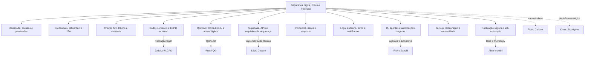
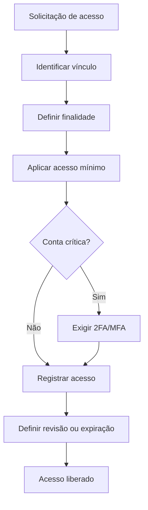
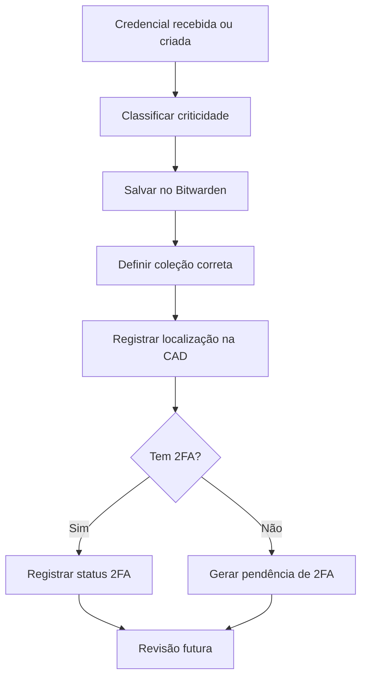
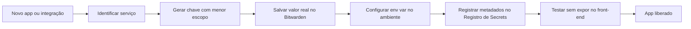
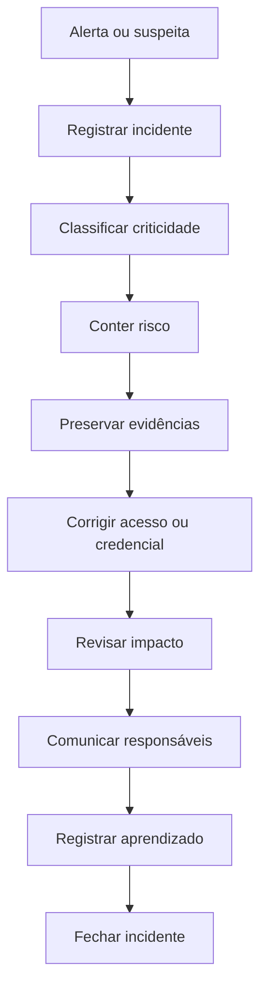
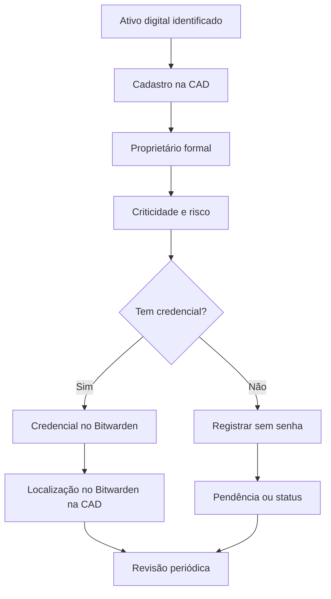
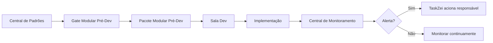

# Documento Mestre de Padrões — Segurança Digital, Risco e Proteção — v1 — 06-06-2026

## Cabeçalho interno

| Campo | Informação |
|---|---|
| Documento | Documento Mestre de Padrões da Divisão |
| Divisão | Segurança Digital, Risco e Proteção |
| Responsável | Pedro Gazan |
| Versão | v1 |
| Data da versão | 06-06-2026 |
| Status | candidato a documento-mãe da divisão |
| Formato | Markdown .md |
| Destino | Central de Padrões do SagB |
| Responsável pela validação final | Pietro Carboni |

> **Color code da divisão:** 🛡️ Segurança Digital — azul-escuro `#1E3A8A`  
> **Regra normativa:** nada neste documento deve ser tratado como **canônico** sem validação final de Pietro Carboni.  
> **Status permitidos usados:** rascunho, em revisão, candidato a canônico, aprovado, canônico, legado, substituído, suspenso, precisa validação.

---

## 1. Objetivo do documento

Este documento reúne, organiza e aprofunda os padrões da divisão **Segurança Digital, Risco e Proteção** para alimentar a **Central de Padrões do SagB**.

A finalidade é transformar tudo que já foi discutido neste chat em uma base estruturada para o GrupoB / Loze, cobrindo acessos, permissões, credenciais, cofre, dados sensíveis, tokens, chaves API, incidentes, logs de segurança, LGPD mínima operacional, uso seguro de IA, backup, disaster recovery e riscos digitais.

Este documento responde, com profundidade:

- quais são os princípios da divisão;
- quais políticas já existem ou precisam nascer;
- quais regras devem ser tratadas como obrigações;
- quais padrões operacionais devem ser repetíveis;
- quais protocolos são realmente protocolos;
- quais processos e procedimentos sustentam a operação;
- quais checklists, matrizes e registros precisam existir;
- quais riscos aparecem se os padrões forem ignorados;
- quais lacunas ainda dependem de validação;
- quais dependências existem com outras áreas;
- quais padrões atômicos devem ser extraídos para o módulo SagB.

> **Síntese:** a divisão de Segurança Digital existe para garantir que a operação do GrupoB cresça com rastreabilidade, proteção de credenciais, acesso mínimo, segregação de dados, resposta a incidentes e governança dos ativos digitais.

---

## 2. Escopo da divisão

### 2.1. Entra no escopo

A divisão cobre:

- 🔐 acessos, usuários, permissões e identidade;
- 🧷 senhas, credenciais, cofres e compartilhamento seguro;
- 🛡️ Bitwarden como cofre oficial;
- 🔑 tokens, chaves API, secrets e variáveis de ambiente;
- ☁️ Netlify Environment Variables e critérios para variáveis globais;
- 🧰 Bitwarden Secrets Manager como possibilidade a validar;
- 🗄️ Supabase do ponto de vista de risco, RLS/policies e service role;
- 🔗 APIs, webhooks e integrações do ponto de vista de segurança;
- 🧾 dados sensíveis, pessoais, estratégicos e confidenciais;
- ⚖️ LGPD mínima operacional, com dependência jurídica;
- 🧠 uso seguro de IA com dados sensíveis;
- 🤖 segurança de agentes autônomos do ponto de vista de risco;
- 🧭 isolamento por cliente, unidade, projeto e agente;
- 🗂️ QG/CAD do ponto de vista de acesso, credencial, risco e titularidade;
- 🧩 Conta E.D.A. do ponto de vista de segurança e governança;
- 🏷️ titularidade de ativos digitais;
- 🔐 MFA/2FA e autenticadores;
- 📜 logs de segurança, auditoria e evidências;
- 🚨 incidentes digitais, vazamentos e resposta;
- ❌ offboarding e revogação de acessos;
- 🐞 registro de erros, bugs e falhas com impacto de segurança;
- 💾 backup, restauração e continuidade operacional do ponto de vista de risco;
- 🌐 publicação segura, anti-indexação e anti-exposição.

### 2.2. Fora do escopo

| Tema fora do escopo | Responsável principal | Como Segurança Digital participa |
|---|---|---|
| UX/UI, telas, componentes, design system, microcopy | Alice Montini | Define exigências de segurança, alertas obrigatórios e bloqueios; Alice define experiência visual. |
| Arquitetura técnica, código, repositórios, deploy e testes | Sávio Codare | Define requisitos de segurança; Sávio implementa tecnicamente. |
| Arquitetura completa de agentes, tool use, memória e orquestração | Pierre Zanulli | Define limites, dados proibidos, riscos e aprovação humana; Pierre define desenho do agente. |
| Aprovação normativa final | Pietro Carboni | Entrega documento candidato; Pietro valida e canoniza. |
| Estratégia da Loze/SagB | Kane/Rodrigues | Aponta riscos e requisitos; estratégia é decisão de Kane/Rodrigues. |
| Parecer jurídico completo de LGPD | Jurídico/compliance | Define cautelas operacionais; jurídico valida obrigações legais. |

---

## 3. O que esta divisão define

A divisão define:

1. 🔵 Princípios de segurança digital do GrupoB / Loze.
2. 🟣 Políticas de acesso, cofre, dados, chaves, incidentes e IA segura.
3. 🔴 Regras centrais de proibição e obrigação.
4. 🟠 Padrões para Bitwarden, QG/CAD, Conta E.D.A., chaves API, Netlify e registros.
5. 🟢 Protocolos reais de incidente, vazamento, importação de credenciais, erro operacional e offboarding.
6. ⚙️ Processos de onboarding seguro, revisão de acessos, governança de ativos e criação de apps seguros.
7. 🧩 Procedimentos para criar item no Bitwarden, ativar 2FA, cadastrar chave, rotacionar token e remover CSV sensível.
8. ✅ Checklists obrigatórios para operar a segurança na prática.
9. 📊 Matrizes de sensibilidade, permissões, criticidade, incidentes, chaves e IA.
10. 🧾 Registros e evidências obrigatórios para auditoria e rastreabilidade.
11. ⚠️ Riscos digitais e controles mínimos.
12. ❓ Lacunas e validações pendentes para Pietro e responsáveis cruzados.

---

## 4. O que esta divisão não define

Esta divisão não define:

- design visual final de telas;
- arquitetura final do QG, CAD ou SagB;
- código de integração com Bitwarden;
- arquitetura completa de Supabase;
- modelagem funcional dos agentes;
- prompts mestres de agentes;
- políticas jurídicas finais;
- contratos com cliente;
- naming de produtos, métodos ou ventures;
- plano de negócio da Loze ou 3forB;
- gestão financeira;
- copy comercial;
- identidade visual da marca.

Quando esses temas aparecem, a Segurança Digital deve registrar **dependência**, **risco**, **requisito mínimo** ou **validação necessária**, sem assumir canonicidade de outra área.

---

## 5. Fontes analisadas

| Fonte | Tipo | Como alimenta este documento |
|---|---|---|
| Conversas sobre SafeEncode, SafeInCloud, planilhas e Bitwarden | Histórico do chat | Base para migração gradual para Bitwarden e abandono de senha solta. |
| Análise de planilhas e CSVs de importação Bitwarden da 3forB | Histórico do chat | Base para protocolo de importação segura e descarte de CSV sensível. |
| Discussão sobre criar cofre próprio no Supabase | Histórico do chat | Base para regra de que QG/CAD não deve guardar senha. |
| Resposta de Rian sobre QG/CAD | Validação operacional | Base para separar QG/CAD como governança e Bitwarden como cofre. |
| Discussões com Nolan sobre Conta E.D.A. | Validação operacional | Base para Conta E.D.A. como identidade operacional do cliente. |
| Validação de ficha CAD obrigatória para Conta E.D.A. | Decisão do chat | Base para padrão e registro obrigatório. |
| Discussões sobre Cássio, robots, noindex e anti-exposição | Histórico do chat | Base para política de blindagem de páginas. |
| Discussões sobre Netlify Environment Variables | Histórico técnico | Base para matriz de chaves globais versus projeto. |
| Discussões sobre Bitwarden Secrets Manager e Machine Accounts | Análise técnica | Base para sugestão V2/futuro de secrets de máquina. |
| Discussões sobre Google Authenticator e Bitwarden Authenticator | Histórico do chat | Base para política de MFA/2FA e autenticadores. |
| Documento “Padrões de Segurança Digital — GrupoB” | Documento anterior | Base normativa inicial. |
| Documento “Auditoria e Revisão do Bloco Segurança Digital” | Auditoria anterior | Base para lacunas, dependências e estrutura revisada. |
| Modelo normativo GrupoB | Padrão geral | Base para classificar princípio, política, regra, padrão, protocolo, processo, procedimento, checklist, matriz e registro. |

---

## 6. Síntese executiva

A divisão já possui uma base forte e aplicável. O que está mais sólido:

- 📌 **Bitwarden como cofre oficial**;
- 📌 **QG/CAD como governança, não cofre**;
- 📌 **Conta E.D.A. como identidade operacional do cliente**;
- 📌 **toda Conta E.D.A. nasce com ficha CAD obrigatória**;
- 📌 **cliente é dono formal dos ativos digitais**;
- 📌 **GMP acessa individualmente quando a plataforma permitir**;
- 📌 **senhas, tokens, chaves API e códigos 2FA não devem circular em chat/prompt**;
- 📌 **2FA/MFA é obrigatório em contas críticas**;
- 📌 **anti-indexação reduz exposição, mas não é segurança real**;
- 📌 **erro relevante precisa ser registrado**;
- 📌 **chaves API e variáveis de ambiente precisam de inventário seguro**.

As lacunas mais importantes:

- ❓ quem administra o Bitwarden;
- ❓ quem pode exportar o cofre;
- ❓ quando usar Bitwarden Authenticator, Google Authenticator ou TOTP integrado;
- ❓ se Bitwarden Secrets Manager entra na V1, V2 ou futuro;
- ❓ quais chaves podem ser globais na Netlify;
- ❓ onde ficam logs centralizados;
- ❓ quais sistemas têm backup obrigatório;
- ❓ política formal de uso de IA e agentes com dados sensíveis;
- ❓ LGPD mínima com validação jurídica;
- ❓ responsáveis finais por revisão, acesso, incidente e offboarding.

> **Quadro de decisão:**  
> **Central de Padrões define. Central de Monitoramento observa. TaskZei aciona. Responsável responde.**

---

## 7. Mapa visual da divisão



### Mapa hierárquico da divisão

```text
Segurança Digital, Risco e Proteção
├── Acessos e permissões
├── Cofre, senhas e 2FA
├── Chaves API, tokens e secrets
├── Dados sensíveis e LGPD mínima
├── QG/CAD e Conta E.D.A.
├── Sistemas, APIs e Supabase seguro
├── Incidentes e resposta
├── Logs, auditoria e erros
├── IA e agentes do ponto de vista de risco
├── Backup e continuidade
└── Publicação segura e anti-exposição
```

---

## 8. Princípios da área

| Código | Princípio | Tipo normativo | Status | Aplicação |
|---|---|---|---|---|
| SEG-PRI-001 | Segurança antes da velocidade | 🔵 princípio | candidato a canônico | Nenhuma entrega rápida justifica expor dados, acesso ou segredo. |
| SEG-PRI-002 | Acesso mínimo necessário | 🔵 princípio | candidato a canônico | Pessoas, agentes e sistemas acessam apenas o necessário. |
| SEG-PRI-003 | Cofre antes de planilha ou chat | 🔵 princípio | candidato a canônico | Credencial fica em cofre, não em WhatsApp, prompt ou planilha. |
| SEG-PRI-004 | Rastreabilidade interna | 🔵 princípio | candidato a canônico | Toda ação sensível deve ter dono, registro e evidência. |
| SEG-PRI-005 | Cliente é dono do ativo | 🔵 princípio | precisa validação | Ativos definitivos devem pertencer ao cliente. |
| SEG-PRI-006 | QG/CAD governa, Bitwarden protege | 🔵 princípio | candidato a canônico | CAD registra governança; Bitwarden guarda credencial. |
| SEG-PRI-007 | Conta E.D.A. é identidade operacional do cliente | 🔵 princípio | candidato a canônico | Conta E.D.A. organiza, mas não é conta da 3forB nem login diário do GMP. |
| SEG-PRI-008 | Anti-indexação não é segurança real | 🔵 princípio | candidato a canônico | Robots/noindex reduzem exposição, mas não substituem autenticação. |
| SEG-PRI-009 | Segredo nunca mora no front-end | 🔵 princípio | candidato a canônico | Service role, tokens e secrets não vão para navegador. |
| SEG-PRI-010 | Erro não registrado se repete | 🔵 princípio | candidato a canônico | Erro relevante precisa de registro, responsável e prevenção. |
| SEG-PRI-011 | IA não executa ação sensível sem aprovação humana | 🔵 princípio | precisa validação | Agentes não alteram acesso, dados ou envio externo sem validação quando houver risco. |
| SEG-PRI-012 | Continuidade operacional antes da crise | 🔵 princípio | precisa validação | Sistema crítico precisa de backup, restauração e responsável. |

---

## 9. Políticas da área

### 🟣 Política — Bitwarden como cofre oficial

**Status:** candidato a canônico  
**Resumo:** o Bitwarden deve ser o cofre oficial para senhas, logins, códigos de recuperação e credenciais operacionais.

Diretrizes:

- senhas não devem ficar em planilhas permanentes;
- CSVs são transição controlada;
- WhatsApp, prompt e campo livre não são cofre;
- coleções devem ser organizadas por empresa, área, cliente e tipo de ativo;
- exportação do cofre precisa de regra e registro.

### 🟣 Política — QG/CAD como governança, não cofre

**Status:** candidato a canônico  
**Resumo:** QG/CAD registra ativo, status, risco, dono, 2FA, localização no Bitwarden e pendências, mas nunca guarda senha ou segredo.

### 🟣 Política — Conta E.D.A. governada

**Status:** candidato a canônico  
**Resumo:** toda Conta E.D.A. deve nascer com ficha CAD obrigatória, 2FA, recuperação controlada, proprietário formal e localização no Bitwarden.

### 🟣 Política — Propriedade correta dos ativos digitais

**Status:** precisa validação  
**Resumo:** cliente deve ser dono formal dos ativos definitivos. 3forB administra como parceira. GMP opera com acesso individual sempre que possível.

### 🟣 Política — MFA/2FA e autenticadores

**Status:** precisa validação  
**Resumo:** contas críticas devem ter 2FA/MFA. Para contas críticas, deve-se avaliar separar senha e 2FA, evitando concentrar tudo no mesmo lugar.

### 🟣 Política — Chaves API, tokens e secrets

**Status:** candidato a canônico  
**Resumo:** valor real de chave API fica em cofre ou ambiente seguro; QG/CAD registra metadados, nome da variável, projeto, ambiente e localização segura.

### 🟣 Política — Dados sensíveis e LGPD mínima operacional

**Status:** precisa validação  
**Resumo:** dados pessoais, estratégicos, financeiros, jurídicos e de cliente devem ser minimizados, separados, controlados e não enviados para IA sem finalidade clara.

### 🟣 Política — Uso seguro de IA e agentes

**Status:** precisa validação  
**Resumo:** agentes devem ter dono humano, escopo, dados permitidos/proibidos, logs e aprovação humana para ações sensíveis.

### 🟣 Política — Logs e auditoria

**Status:** precisa validação  
**Resumo:** ações sensíveis devem gerar registro sem expor senha, token completo ou dado sensível desnecessário.

### 🟣 Política — Backup, restauração e continuidade

**Status:** precisa validação  
**Resumo:** sistemas críticos devem ter backup, restauração documentada e responsável definido.

### 🟣 Política — Blindagem de páginas e anti-exposição

**Status:** candidato a canônico  
**Resumo:** páginas não públicas devem usar anti-indexação, URL não óbvia e ausência de links públicos; conteúdo sensível exige autenticação.

---

## 10. Regras centrais da área

| Código | Regra | Tipo normativo | Status | Observação |
|---|---|---|---|---|
| SEG-REG-001 | Nenhuma senha deve ser enviada por WhatsApp, prompt, comentário de tarefa ou e-mail aberto. | 🔴 regra | candidato a canônico | Cofre é Bitwarden. |
| SEG-REG-002 | QG/CAD não pode armazenar senha, token, chave API, código 2FA ou backup code. | 🔴 regra | candidato a canônico | Deve virar trava técnica e microcopy. |
| SEG-REG-003 | CSV com credenciais é arquivo sensível. | 🔴 regra | candidato a canônico | Deve ser apagado após validação. |
| SEG-REG-004 | Conta crítica deve ter 2FA/MFA. | 🔴 regra | precisa validação | Precisa matriz de criticidade. |
| SEG-REG-005 | Conta E.D.A. não é login compartilhado diário. | 🔴 regra | candidato a canônico | GMP deve acessar individualmente quando possível. |
| SEG-REG-006 | Chave sensível nunca deve morar no front-end. | 🔴 regra | candidato a canônico | Inclui Supabase Service Role. |
| SEG-REG-007 | Arquivo `.env` não deve ser commitado. | 🔴 regra | candidato a canônico | Depende de Sávio no padrão técnico. |
| SEG-REG-008 | Dados sensíveis não devem ir em query string. | 🔴 regra | candidato a canônico | APIs e formulários. |
| SEG-REG-009 | Logs não devem armazenar senha ou token completo. | 🔴 regra | precisa validação | Depende de padrão técnico de logs. |
| SEG-REG-010 | Agente não deve receber credenciais em prompt comum. | 🔴 regra | precisa validação | Depende de Pierre. |
| SEG-REG-011 | Agente não deve misturar dados de clientes. | 🔴 regra | precisa validação | Depende de isolamento por cliente. |
| SEG-REG-012 | Chave exposta deve ser rotacionada imediatamente. | 🔴 regra | candidato a canônico | Protocolo de vazamento. |
| SEG-REG-013 | Ex-colaborador, parceiro ou cliente encerrado não deve manter acesso indevido. | 🔴 regra | candidato a canônico | Offboarding. |
| SEG-REG-014 | Erro relevante deve ser registrado. | 🔴 regra | candidato a canônico | Base do Registro de Erro Operacional. |
| SEG-REG-015 | Anti-indexação não substitui autenticação. | 🔴 regra | candidato a canônico | Páginas sensíveis exigem controle de acesso. |

---

## 11. Padrões oficiais e candidatos a padrão

### 🟠 Padrão — Organização de coleções no Bitwarden

**Status:** precisa validação  
**Formato recomendado:**

```text
GrupoB / Administração
GrupoB / Financeiro
GrupoB / Tecnologia
GrupoB / APIs e Chaves
Loze / SagB
3forB / Administração
3forB / Operação
3forB / Google
3forB / Meta
3forB / CRM
3forB / Sites e Domínios
3forB / Automações
3forB / Clientes / [Cliente] / Conta E.D.A.
3forB / Clientes / [Cliente] / Google
3forB / Clientes / [Cliente] / Meta
3forB / Clientes / [Cliente] / Site-Domínio
3forB / Clientes / [Cliente] / CRM
```

### 🟠 Padrão — Nome de item no Bitwarden

**Status:** precisa validação  
**Formato:** `[Empresa/Cliente] — [Plataforma] — [Finalidade]`

Exemplos:

- `3forB — Google Workspace — Admin`
- `3forB — Google Ads — MCC`
- `Clínica Bellavita — Conta E.D.A. — Gmail`
- `Loze — Supabase — SagB Produção`

### 🟠 Padrão — Ficha CAD de ativo digital

**Status:** candidato a canônico  
**Campos mínimos:** cliente, ativo, tipo, URL, usuário/e-mail, proprietário formal, responsável interno, responsável do cliente, status, criticidade, 2FA, Bitwarden, localização no Bitwarden, permissão da 3forB, GMPs com acesso individual, risco, pendências, última revisão, observações sem senha.

### 🟠 Padrão — Ficha CAD da Conta E.D.A.

**Status:** candidato a canônico  
**Campos mínimos:** cliente, e-mail E.D.A., proprietário formal, plataformas vinculadas, permissões da 3forB, GMPs com acesso individual, localização no Bitwarden, 2FA ativo, telefone/e-mail de recuperação, risco de titularidade, pendências, última revisão.

### 🟠 Padrão — Nomenclatura de Conta E.D.A.

**Status:** precisa validação  
**Quando não houver domínio maduro:** `eda.nomedaempresa@gmail.com`  
**Quando houver domínio:** `eda@cliente.com.br`, `marketing@cliente.com.br`, `performance@cliente.com.br`.

### 🟠 Padrão — Chaves API e variáveis de ambiente

**Status:** candidato a canônico  
**Campos de registro:** projeto/app, ambiente, serviço, nome da variável, finalidade, responsável técnico, plataforma onde está cadastrada, localização no Bitwarden, data de criação, última rotação, status.

### 🟠 Padrão — Netlify Shared Environment Variables

**Status:** precisa validação  
Variáveis globais podem existir apenas para chaves de baixo/médio risco e uso comum. Chaves críticas devem ficar isoladas por projeto ou em Secrets Manager.

### 🟠 Padrão — Página não pública

**Status:** candidato a canônico  
Página não pública deve ficar fora de menu, rodapé, home e sitemap; usar URL não óbvia; aplicar `noindex`, `nofollow`, `noarchive`, `nosnippet` quando aplicável; usar autenticação se houver dado sensível.

### 🟠 Padrão — Logs de segurança

**Status:** precisa validação  
Log deve registrar quem, quando, onde, ação, entidade afetada, status e erro, sem registrar segredo.

### 🟠 Padrão — Autenticadores por criticidade

**Status:** precisa validação  
Contas comuns podem usar TOTP integrado ao cofre quando aprovado; contas críticas devem preferir senha e 2FA separados ou acesso extremamente restrito.

### 🟠 Padrão — Proteção de documentos estratégicos

**Status:** rascunho  
Documentos, diagnósticos, PDFs, metodologias e materiais internos devem ter permissão, controle de link e evitar exposição pública.

---

## 12. Protocolos reais da área

### 🟢 Protocolo — Incidente digital

**Situação específica:** suspeita ou confirmação de acesso indevido, conta comprometida, credencial exposta, sistema vulnerável ou vazamento.  
**Responsável:** Pedro Gazan ou responsável de segurança indicado.  
**Sequência obrigatória:** identificar ativo → classificar criticidade → conter risco → preservar evidências → corrigir acesso/credencial → revisar 2FA → comunicar responsáveis → registrar incidente → validar normalização → registrar aprendizado.  
**Saída esperada:** risco contido, impacto registrado e prevenção definida.  
**Status:** candidato a canônico.

### 🟢 Protocolo — Importação segura no Bitwarden

**Situação específica:** migração de planilha/CSV de senhas para Bitwarden.  
**Responsável:** Pedro Gazan ou responsável operacional do cofre.  
**Sequência obrigatória:** tratar arquivo como sensível → revisar duplicidades → revisar coleções → importar → validar itens → apagar CSV e cópias → registrar conclusão.  
**Saída esperada:** credenciais no Bitwarden sem duplicidade e arquivo sensível descartado.  
**Status:** candidato a canônico.

### 🟢 Protocolo — Vazamento de token ou chave API

**Situação específica:** token, webhook, service key, API key ou secret exposto.  
**Responsável:** Pedro Gazan + Sávio/Cássio.  
**Sequência obrigatória:** identificar segredo → revogar/rotacionar → verificar logs → pausar automações afetadas → atualizar env vars → verificar repositórios e front-end → reativar serviço → registrar incidente.  
**Saída esperada:** chave rotacionada e risco contido.  
**Status:** candidato a canônico.

### 🟢 Protocolo — Criação de Conta E.D.A.

**Situação específica:** cliente precisa de identidade operacional E.D.A.  
**Responsável:** responsável E.D.A. + Pedro Gazan.  
**Sequência obrigatória:** verificar estrutura do cliente → definir Gmail ou e-mail corporativo → criar conta → confirmar proprietário formal → ativar 2FA → registrar recuperação → salvar no Bitwarden → criar ficha CAD → mapear plataformas → registrar revisão.  
**Saída esperada:** Conta E.D.A. criada, governada e protegida.  
**Status:** candidato a canônico.

### 🟢 Protocolo — Publicação segura de página não pública

**Situação específica:** publicação de campanha, diagnóstico, landing page, metodologia ou página de teste não pública.  
**Responsável:** Sávio/Cássio + Pedro Gazan.  
**Sequência obrigatória:** classificar sensibilidade → remover links públicos → remover do sitemap → aplicar anti-indexação → verificar dados na URL → verificar segredos no front-end → testar acesso → registrar publicação.  
**Saída esperada:** página publicada com exposição controlada.  
**Status:** candidato a canônico.

### 🟢 Protocolo — Registro e tratamento de erro operacional

**Situação específica:** erro, bug, falha de execução, falha de integração, conexão perdida, resposta incorreta ou comportamento inesperado.  
**Responsável:** dono do sistema/agente/automação.  
**Sequência obrigatória:** registrar erro → classificar tipo/prioridade → anexar evidência → avaliar impacto → definir responsável → corrigir/contornar → validar → registrar prevenção.  
**Saída esperada:** erro tratado e aprendizado registrado.  
**Status:** candidato a canônico.

### 🟢 Protocolo — Comportamento inesperado de agente

**Situação específica:** agente responde fora do escopo, mistura clientes, inventa, sugere ação insegura ou tenta contornar regra.  
**Responsável:** dono humano do agente + Pierre + Pedro Gazan.  
**Sequência obrigatória:** pausar se houver risco → registrar prompt/resposta/contexto → classificar impacto → verificar dados expostos → corrigir prompt/ferramenta/permissão → testar → reativar se validado.  
**Saída esperada:** agente corrigido ou suspenso.  
**Status:** precisa validação.

### 🟢 Protocolo — Offboarding de acessos

**Situação específica:** saída de colaborador, fornecedor, parceiro, cliente, GMP ou agente.  
**Responsável:** gestor da área + Pedro Gazan.  
**Sequência obrigatória:** listar acessos → remover Bitwarden → remover Google/Drive → remover QG/CAD → remover CRM/Meta/Google Ads → remover Supabase/Netlify/n8n se aplicável → rotacionar senhas críticas → registrar offboarding.  
**Saída esperada:** pessoa ou vínculo sem acesso indevido.  
**Status:** candidato a canônico.

### 🟢 Protocolo — Restauração de backup crítico

**Situação específica:** perda de dado, corrupção de base, exclusão indevida ou necessidade de rollback.  
**Responsável:** Sávio/responsável técnico + Pedro Gazan em avaliação de risco.  
**Sequência obrigatória:** identificar sistema → pausar alterações → confirmar backup → avaliar perda → restaurar em ambiente seguro → validar integridade → aplicar rollback/restauração → registrar impacto.  
**Saída esperada:** sistema restaurado ou contingência ativada.  
**Status:** precisa validação.

---

## 13. Processos da área

| Código | Processo | Tipo normativo | Status | Início | Saída |
|---|---|---|---|---|---|
| SEG-PROC-001 | Onboarding seguro de cliente | ⚙️ processo | candidato a canônico | Entrada de cliente | Cliente com ativos mapeados e acessos protegidos. |
| SEG-PROC-002 | Governança contínua de ativos digitais | ⚙️ processo | candidato a canônico | Ativo cadastrado ou revisão | Ativo atualizado na CAD. |
| SEG-PROC-003 | Entrada de novo usuário | ⚙️ processo | precisa validação | Solicitação de acesso | Usuário com acesso mínimo e registro. |
| SEG-PROC-004 | Revisão periódica de acessos | ⚙️ processo | precisa validação | Rotina mensal/trimestral | Acessos validados ou revogados. |
| SEG-PROC-005 | Criação de app seguro | ⚙️ processo | precisa validação | Novo app/módulo | App sem segredo exposto e com checklist. |
| SEG-PROC-006 | Gestão segura de agentes | ⚙️ processo | precisa validação | Novo agente ou nova ferramenta | Agente com escopo, limites e logs. |
| SEG-PROC-007 | Tratamento de bugs/falhas | ⚙️ processo | candidato a canônico | Erro identificado | Falha tratada e registrada. |
| SEG-PROC-008 | Gestão de chaves por projeto | ⚙️ processo | precisa validação | App precisa de API | Chave registrada e configurada sem exposição. |
| SEG-PROC-009 | Backup e continuidade | ⚙️ processo | precisa validação | Sistema classificado como crítico | Backup e restauração documentados. |

---

## 14. Procedimentos operacionais

### 🧩 Procedimento — Criar item no Bitwarden

1. Escolher coleção correta.
2. Nomear no padrão `[Empresa/Cliente] — [Plataforma] — [Finalidade]`.
3. Inserir URL, usuário e senha.
4. Adicionar notas mínimas sem dado excessivo.
5. Salvar.
6. Atualizar CAD com localização no Bitwarden.
7. Validar login.

### 🧩 Procedimento — Cadastrar ativo na CAD

1. Abrir ficha do cliente.
2. Criar ativo na aba Ativos Digitais.
3. Preencher tipo, URL, usuário sem senha, proprietário formal e responsáveis.
4. Informar 2FA, Bitwarden, criticidade e risco.
5. Registrar pendências.
6. Salvar e revisar.

### 🧩 Procedimento — Ativar 2FA

1. Entrar na conta crítica.
2. Abrir segurança.
3. Ativar 2FA/MFA.
4. Preferir app autenticador quando possível.
5. Salvar códigos de recuperação no Bitwarden.
6. Atualizar CAD.
7. Registrar revisão.

### 🧩 Procedimento — Remover CSV sensível

1. Confirmar que importação foi validada.
2. Localizar arquivo original e cópias.
3. Excluir arquivos.
4. Esvaziar lixeira quando aplicável.
5. Registrar descarte.

### 🧩 Procedimento — Cadastrar chave API para novo app

1. Identificar serviço e ambiente.
2. Criar chave com menor escopo possível.
3. Salvar valor real no Bitwarden.
4. Cadastrar variável no ambiente correto.
5. Registrar metadados no QG/CAD ou Registro de Secrets.
6. Verificar que não aparece no front-end, repositório, log ou print.
7. Testar integração.

### 🧩 Procedimento — Rotacionar chave API

1. Criar nova chave.
2. Atualizar env vars.
3. Testar sistema.
4. Revogar chave antiga.
5. Atualizar Bitwarden.
6. Registrar rotação.

### 🧩 Procedimento — Revogar acesso

1. Identificar pessoa/agente/integração.
2. Identificar sistemas acessados.
3. Revogar acesso.
4. Rotacionar credenciais compartilhadas se necessário.
5. Registrar revogação.

---

## 15. Checklists obrigatórios

### ✅ Checklist — Importação Bitwarden

- [ ] Arquivo final escolhido.
- [ ] Duplicidades revisadas.
- [ ] Coleções revisadas.
- [ ] URLs revisadas.
- [ ] Itens sem senha marcados.
- [ ] Importação validada.
- [ ] CSV apagado.
- [ ] Registro criado.

### ✅ Checklist — Conta E.D.A.

- [ ] Cliente definido.
- [ ] E-mail E.D.A. definido.
- [ ] Proprietário formal confirmado.
- [ ] 2FA ativo.
- [ ] Recuperação registrada.
- [ ] Item criado no Bitwarden.
- [ ] Ficha CAD criada.
- [ ] Plataformas vinculadas mapeadas.
- [ ] Permissões da 3forB descritas.
- [ ] GMPs com acesso individual registrados.

### ✅ Checklist — Liberação de acesso

- [ ] Finalidade clara.
- [ ] Aprovador definido.
- [ ] Menor permissão aplicada.
- [ ] 2FA ativo quando aplicável.
- [ ] Registro criado.
- [ ] Data de revisão definida.

### ✅ Checklist — Offboarding

- [ ] Bitwarden removido.
- [ ] Google/Drive removido.
- [ ] ClickUp removido.
- [ ] QG/CAD removido.
- [ ] CRM removido.
- [ ] Meta/Google removidos.
- [ ] Supabase/Netlify/n8n removidos quando aplicável.
- [ ] Senhas críticas rotacionadas.
- [ ] Registro final criado.

### ✅ Checklist — Novo app com chaves API

- [ ] Responsável técnico definido.
- [ ] Ambiente definido.
- [ ] Variáveis nomeadas.
- [ ] Chaves salvas no Bitwarden.
- [ ] `.env` no `.gitignore`.
- [ ] Nenhuma chave no repositório.
- [ ] Nenhuma chave no front-end.
- [ ] Nenhuma chave em log/print/erro público.
- [ ] Chave com escopo mínimo.
- [ ] Plano de rotação definido.

### ✅ Checklist — Uso de IA com dados sensíveis

- [ ] Finalidade clara.
- [ ] Dado necessário.
- [ ] Dado minimizado ou anonimizado quando possível.
- [ ] Sem senha/token/chave no conteúdo.
- [ ] Sem dados de clientes misturados.
- [ ] Agente tem escopo para a tarefa.
- [ ] Resultado será revisado antes de uso externo.

### ✅ Checklist — Backup e restauração

- [ ] Sistema crítico identificado.
- [ ] Responsável definido.
- [ ] Frequência de backup definida.
- [ ] Local do backup conhecido.
- [ ] Acesso restrito.
- [ ] Procedimento de restauração documentado.
- [ ] Teste registrado ou pendência marcada.

---

## 16. Matrizes obrigatórias

### 📊 Matriz — Sensibilidade da informação

| Nível | Tipo | Exemplos | Controle mínimo |
|---|---|---|---|
| 1 | Público | site, posts, materiais públicos | revisão normal |
| 2 | Interno | processos, playbooks, padrões | acesso por área |
| 3 | Restrito | dados de cliente, relatórios, diagnósticos | acesso autorizado + registro |
| 4 | Crítico | senha, token, chave API, financeiro, dados pessoais sensíveis | cofre + acesso restrito + revisão |

### 📊 Matriz — Criticidade de ativo digital

| Criticidade | Exemplos | Controle mínimo |
|---|---|---|
| Baixa | ferramenta auxiliar | registro simples |
| Média | Canva, ferramenta de apoio | Bitwarden + responsável |
| Alta | Instagram, Google Ads, CRM, e-mail | 2FA + Bitwarden + CAD |
| Crítica | domínio, Meta Business, Supabase, financeiro, Service Role | 2FA + cofre + revisão + responsável formal |

### 📊 Matriz — Nível de acesso

| Nível | Perfil | Pode fazer | Exemplo |
|---|---|---|---|
| Leitura | observador | visualizar | consultor, cliente acompanhando |
| Operador | executor | operar rotina | GMP, equipe operacional |
| Gestor | responsável | configurar e aprovar | account, líder |
| Admin | controle total | alterar configuração crítica | responsável autorizado |
| Proprietário | dono formal | controle de titularidade | cliente ou entidade formal |

### 📊 Matriz — Acesso por vínculo

| Vínculo | Exemplo | Acesso permitido | Controle |
|---|---|---|---|
| Interno | colaborador GrupoB/3forB | ferramentas da função | 2FA + revisão |
| Cliente | responsável do cliente | dados e ativos próprios | separação por cliente |
| Parceiro | fornecedor estratégico | área vinculada | prazo + responsável |
| Fornecedor | dev/design/mídia | tarefa/sistema necessário | acesso temporário |
| Agente | IA/agente autônomo | dados e ferramentas do escopo | dono humano + logs + limites |

### 📊 Matriz — Chaves globais vs projeto

| Tipo de chave | Pode ser global? | Onde deve ficar | Observação |
|---|---|---|---|
| Chave comum de protótipo interno | talvez | Netlify global ou projeto | precisa validação de risco |
| `GEMINI_API_KEY` comum | talvez | projeto ou global controlado | depende do uso e custo |
| `OPENAI_API_KEY` comum | talvez | projeto ou global controlado | evitar uso irrestrito |
| `SUPABASE_ANON_KEY` | depende | projeto | pública em alguns contextos, mas exige RLS correto |
| `SUPABASE_SERVICE_ROLE_KEY` | não | projeto/backend/secret manager | nunca front-end/global amplo |
| `STRIPE_SECRET_KEY` | não | projeto/backend/secret manager | alto risco financeiro |
| `META_ACCESS_TOKEN` | não | projeto/secret manager | risco operacional e reputacional |
| `GOOGLE_CLIENT_SECRET` | não | projeto/backend | segredo crítico |

### 📊 Matriz — Dados sensíveis e IA

| Tipo de dado | Exemplo | Pode usar em IA? | Controle |
|---|---|---|---|
| Público | site, post | sim | revisão normal |
| Interno | processo, padrão | sim com controle | sem credenciais |
| Cliente | relatório, CRM | se necessário | separar cliente e finalidade |
| Pessoal | nome, telefone, e-mail | com cuidado | minimização |
| Sensível | saúde, financeiro, jurídico | só com validação | controle específico |
| Crítico | senha, token, chave API, 2FA | não | Bitwarden/Secrets Manager |

### 📊 Matriz — Autonomia de agentes

| Nível | Ação | Aprovação humana |
|---|---|---|
| 1 | organizar informação | não obrigatória |
| 2 | sugerir decisão | revisão recomendada |
| 3 | preparar ação | aprovar antes de executar |
| 4 | executar ação operacional | conforme risco |
| 5 | ação sensível | obrigatória |

---

## 17. Registros e evidências obrigatórias

| Registro/evidência | Tipo normativo | Status | Função |
|---|---|---|---|
| Ficha CAD de ativo digital | 🧾 registro/evidência | candidato a canônico | Provar dono, status, 2FA, Bitwarden e pendências do ativo. |
| Ficha CAD de Conta E.D.A. | 🧾 registro/evidência | candidato a canônico | Provar que a Conta E.D.A. nasceu governada. |
| Registro de concessão de acesso | 🧾 registro/evidência | precisa validação | Provar quem recebeu acesso, por quê e até quando. |
| Registro de revisão de acesso | 🧾 registro/evidência | precisa validação | Provar que acessos foram revisados. |
| Registro de offboarding | 🧾 registro/evidência | candidato a canônico | Provar que acessos foram removidos. |
| Registro de incidente digital | 🧾 registro/evidência | candidato a canônico | Provar incidente, impacto, correção e aprendizado. |
| Registro de erro operacional | 🧾 registro/evidência | candidato a canônico | Provar erro, evidência, responsável, correção e prevenção. |
| Registro de secrets por projeto | 🧾 registro/evidência | precisa validação | Provar variáveis, ambientes, responsáveis e localização segura. |
| Log de agente | 🧾 registro/evidência | precisa validação | Provar comportamento relevante ou inesperado de agente. |
| Registro de backup e restauração | 🧾 registro/evidência | precisa validação | Provar backup, teste e restauração. |
| Registro de exceção de segurança | 🧾 registro/evidência | precisa validação | Provar exceção, prazo, responsável e risco aceito. |
| Registro de titularidade de ativo | 🧾 registro/evidência | precisa validação | Provar proprietário formal do ativo digital. |

---

## 18. Fluxos Mermaid da divisão

### 18.1. Fluxo de concessão de acesso



### 18.2. Fluxo de credencial no Bitwarden



### 18.3. Fluxo de chave API em app



### 18.4. Fluxo de incidente digital



### 18.5. Fluxo CAD / Bitwarden



---

## 19. Dependências com outras áreas

| Tema | Depende de quem | Motivo | Tipo de dependência | Arquivo/registro sugerido |
|---|---|---|---|---|
| Classificação normativa final | Pietro Carboni | Canonicidade e enquadramento normativo | validação normativa | `validacoes_com_pietro_carboni.md` |
| Supabase, RLS, deploy e APIs | Sávio Codare | Implementação técnica | dependência técnica | `dependencias_com_savio_codare.md` |
| UX de alertas, bloqueios e microcopy | Alice Montini | Experiência do usuário | dependência UX/UI | `dependencias_com_alice_montini.md` |
| Agentes, memória e autonomia | Pierre Zanulli | Arquitetura de agentes | dependência de agentes/IA | `dependencias_com_pierre_zanulli.md` |
| CAD, ficha de ativos e QG | Rian / QG | Sistema onde a governança será registrada | dependência de produto/sistema | `dependencias_com_rian_qg.md` |
| Conta E.D.A. | Responsável E.D.A. | Metodologia E.D.A. define papel operacional | dependência operacional | `dependencias_com_responsavel_eda.md` |
| Decisão estratégica Loze/SagB | Kane/Rodrigues | Priorização e escopo | dependência estratégica | `dependencias_com_kane_rodrigues.md` |
| Dados pessoais e incidentes legais | Jurídico/LGPD | Validação legal | dependência jurídica | `dependencias_com_juridico_lgpd.md` |
| Central de Monitoramento | Responsável pelo monitoramento | Observar descumprimentos e alertas | dependência operacional | `mapa_de_monitoramento_seguranca.md` |
| TaskZei | Yuri/Processos | Acionar tarefas quando houver alerta | dependência de execução | `gatilhos_taskzei_seguranca.md` |

---

## 20. Conflitos de escopo

| Conflito | Risco | Resolução recomendada |
|---|---|---|
| Segurança Digital x Sistemas | Segurança parecer dona da arquitetura técnica | Segurança define requisitos; Sávio implementa. |
| Segurança Digital x UX/UI | Alertas e bloqueios ficarem técnicos demais | Segurança define conteúdo; Alice define experiência. |
| Segurança Digital x Agentes | Segurança parecer dona da arquitetura de agentes | Segurança define limites e risco; Pierre define agente. |
| CAD x Cofre | QG/CAD virar cofre de senhas | CAD registra localização; Bitwarden guarda segredo. |
| Conta E.D.A. x Propriedade do cliente | Conta E.D.A. virar dona oculta | Cliente é dono formal; Conta E.D.A. organiza. |
| Anti-indexação x Autenticação | Noindex ser vendido como segurança real | Noindex reduz exposição; dado sensível exige autenticação. |
| Logs x Privacidade | Logs vazarem dados sensíveis | Log deve registrar evento sem segredo. |
| Netlify global x Projeto | Chave crítica ficar disponível para todos os projetos | Matriz define o que pode ser global. |

---

## 21. Riscos se os padrões não forem seguidos

| Risco | Causa provável | Impacto | Como prevenir | Quem acompanha |
|---|---|---|---|---|
| QG/CAD virar cofre | Criar campo de senha no QG | Vazamento de credenciais | Proibir campo de senha e usar Bitwarden | Pedro/Rian/Sávio |
| Chave API no front-end | Pressa no desenvolvimento | Roubo de chave, custo financeiro e vazamento | Env vars backend/serverless | Pedro/Sávio |
| Bitwarden bagunçado | Sem padrão de coleções | Perda de acesso e duplicidade | Política Bitwarden | Pedro |
| Conta E.D.A. virar login compartilhado | Equipe usar conta no dia a dia | Falta de rastreabilidade | GMP com acesso individual | Pedro/E.D.A. |
| Ex-colaborador com acesso | Offboarding falho | Acesso indevido | Checklist de offboarding | Pedro/Operação |
| CSV de senha esquecido | Importação sem descarte | Credenciais expostas | Protocolo de importação | Pedro |
| 2FA mal governado | Autenticador sem política | Conta crítica vulnerável | Política MFA/2FA | Pedro |
| Dados sensíveis em IA | Prompt com dados indevidos | Vazamento ou mistura de clientes | Checklist IA segura | Pedro/Pierre |
| Logs com segredo | Log técnico mal desenhado | Vazamento em auditoria | Padrão de logs | Pedro/Sávio |
| Backup inexistente | Sistema cresce sem DR | Perda de dados e paralisação | Política backup/restauração | Pedro/Sávio |
| Noindex tratado como segurança | Página sensível sem autenticação | Conteúdo exposto por link | Padrão publicação segura | Pedro/Sávio/Alice |
| Incidente sem registro | Resolver informalmente | Falha se repete | Protocolo de incidente | Pedro |

---

## 22. O que deve ser monitorado pela Central de Monitoramento

A lógica operacional deve ser:

```text
Central de Padrões define.
Central de Monitoramento observa.
TaskZei aciona.
Responsável responde.
```

| Item a monitorar | Por que monitorar | Origem do dado | Responsável | Ação se der alerta |
|---|---|---|---|---|
| Ativo crítico sem 2FA | Risco de invasão | CAD | Pedro/Responsável do ativo | Criar tarefa de ativação 2FA |
| Ativo sem Bitwarden | Credencial pode estar solta | CAD | Pedro | Criar tarefa de regularização |
| Conta E.D.A. sem ficha CAD | Conta operacional sem governança | QG/CAD | E.D.A./Pedro | Bloquear status “governada” |
| CSV sensível não descartado | Credenciais expostas | Registro de importação | Pedro | Acionar descarte seguro |
| Chave API sem registro | Segredo sem dono | Registro de Secrets | Pedro/Sávio | Criar registro ou revogar |
| Chave crítica marcada global | Risco de exposição entre projetos | Netlify/Registro Secrets | Pedro/Sávio | Revisar e isolar por projeto |
| Erro crítico sem registro | Falha pode se repetir | Registro de erros | Dono do sistema | Abrir tarefa TaskZei |
| Incidente sem fechamento | Risco não tratado | Registro de incidentes | Pedro | Escalar responsável |
| Usuário vencido com acesso | Acesso indevido | Registro IAM | Operação/Pedro | Revogar ou justificar |
| Agente sem ficha/limites | Ação fora do escopo | Registro de agente | Pierre/Pedro | Pausar agente ou completar ficha |
| Sistema crítico sem backup | Perda de dados | Inventário de sistemas | Sávio/Pedro | Abrir tarefa de backup |
| Página não pública no sitemap | Exposição indevida | Checklist publicação | Sávio/Pedro | Remover e registrar correção |

---

## 23. Relação com Biblioteca de Módulos Base, se aplicável

Esta divisão possui relação direta com a **Biblioteca de Módulos Base Reutilizáveis do SagB**, porque vários padrões de Segurança Digital devem virar módulos reutilizáveis ou gates obrigatórios antes do desenvolvimento.

### Relações principais

| Elemento | Relação com Segurança Digital |
|---|---|
| Biblioteca de Módulos Base | Deve conter componentes reutilizáveis de auditoria, logs, permissões, CAD, checklist e registros. |
| Gate Modular Pré-Dev | Deve exigir verificação de secrets, dados sensíveis, 2FA, logs e permissões antes do desenvolvimento. |
| Pacote Modular Pré-Dev | Deve incluir matriz de dados, checklist de acesso, checklist de chaves e riscos de segurança. |
| Sala Dev | Deve receber requisitos de segurança claros: RLS, env vars, logs sem segredo, backup, erro registrado. |

### Módulos base candidatos

- Módulo CAD de Ativos Digitais.
- Módulo Registro de Incidente Digital.
- Módulo Registro de Erro Operacional.
- Módulo Registro de Secrets por Projeto.
- Módulo Checklist de Pré-Deploy Seguro.
- Módulo Matriz de Permissões.
- Módulo Offboarding de Acessos.
- Módulo Monitoramento de Ativo Crítico sem 2FA.
- Módulo Alerta de Chave API sem registro.
- Módulo Log de Agente com ação sensível.

---

## 24. Relação com TaskZei e Sala Dev, se aplicável

### TaskZei

TaskZei deve ser acionado quando a Central de Monitoramento detectar:

- ativo crítico sem 2FA;
- Conta E.D.A. sem ficha CAD;
- credencial fora do Bitwarden;
- erro crítico sem responsável;
- incidente aberto sem fechamento;
- usuário com acesso vencido;
- chave API sem registro;
- sistema crítico sem backup;
- agente sem ficha ou sem escopo;
- publicação não pública sem checklist.

### Sala Dev

Sala Dev deve receber requisitos de segurança antes de iniciar desenvolvimento:

- classificação de dados;
- definição de secrets;
- ambiente de variáveis;
- RLS/policies se houver Supabase;
- logs mínimos;
- registro de erro;
- checklist pré-deploy;
- backup se sistema crítico;
- validação de que segredo não está no front-end;
- validação de que dados sensíveis não estão em query string.



---

## 25. Lacunas e validações pendentes

| Lacuna | Impacto | Quem valida | Prioridade | Recomendação |
|---|---|---|---|---|
| Administrador oficial do Bitwarden não definido | Cofre sem governança clara | Rodrigues/Pedro | crítico | Definir admin e substituto. |
| Exportação do Bitwarden sem regra | Vazamento crítico | Pedro/Rodrigues | crítico | Criar regra e protocolo de exportação. |
| Política de MFA/2FA incompleta | 2FA pode ficar concentrado ou fraco | Pedro/Pietro | V1 | Criar política de autenticadores. |
| Secrets Manager não decidido | Chaves podem ficar manuais/difusas | Sávio/Pedro/Rodrigues | V2 | Validar custo, plano e arquitetura. |
| Netlify global sem matriz | Chave crítica pode ficar ampla demais | Sávio/Pedro | V1/V2 | Criar matriz global vs projeto. |
| Logs centralizados indefinidos | Auditoria fraca | Sávio/Pedro | V1/V2 | Definir origem e campos mínimos. |
| Backup sem inventário crítico | Perda de dados | Sávio/Kane/Pedro | V2 | Criar inventário de sistemas críticos. |
| LGPD mínima sem jurídico | Risco legal | Jurídico/Pedro | V1/V2 | Validar dados pessoais, retenção e incidentes. |
| IA/agentes sem política formal | Vazamento ou ação fora do escopo | Pierre/Pedro/Pietro | V1 | Criar política de uso seguro de IA. |
| Proteção de documentos estratégicos fraca | Exposição de metodologia | Pietro/Pedro | V1/V2 | Criar política de documentos estratégicos. |
| Periodicidade oficial da revisão de acessos indefinida | Acessos antigos podem persistir | Pedro/Operação | V1 | Definir mensal/trimestral por criticidade. |
| Sistema oficial de registro de erros indefinido | Erros ficam soltos | Sávio/Yuri/Pedro | V1 | Definir QG, TaskZei ou módulo próprio. |

---

## 26. Decisões já tomadas

| Decisão | Tipo | Status | Observação |
|---|---|---|---|
| Bitwarden será o padrão de cofre | 📌 decisão | candidato a canônico | Decisão clara no chat. |
| QG/CAD não deve guardar senha | 📌 decisão | candidato a canônico | Regra forte e recorrente. |
| CAD será governança de ativos digitais | 📌 decisão | candidato a canônico | Validado conceitualmente com Rian. |
| Conta E.D.A. é identidade operacional do cliente | 📌 decisão | candidato a canônico | Validado por Nolan. |
| Toda Conta E.D.A. precisa nascer com ficha CAD | 📌 decisão | candidato a canônico | Decisão forte. |
| Cliente deve ser dono formal dos ativos | 📌 decisão | precisa validação | Precisa validação jurídica/estratégica. |
| 3forB administra como parceira quando possível | 📌 decisão | candidato a canônico | Relacionado à titularidade. |
| GMP acessa individualmente quando possível | 📌 decisão | candidato a canônico | Reforça rastreabilidade. |
| CSV com credenciais é sensível | 📌 decisão | candidato a canônico | Importação exige descarte. |
| Anti-indexação não é segurança real | 📌 decisão | candidato a canônico | Precisa constar no padrão de publicação. |
| Chaves API não entram em QG/CAD como valor real | 📌 decisão | candidato a canônico | QG registra metadados. |
| Netlify pode ter variáveis compartilhadas, mas com critério | 📌 decisão | precisa validação | Falta matriz final. |
| Erro relevante deve ser registrado | 📌 decisão | candidato a canônico | Base do protocolo de erros. |

---

## 27. Documentos derivados que precisam nascer

| Documento | Tipo | Por que precisa existir | Prioridade | Responsável |
|---|---|---|---|---|
| Política Oficial do Bitwarden | 🟣 política | Definir cofre oficial e governança | crítico | Pedro |
| Governança do Bitwarden | 🟠 padrão | Definir admin, exportação e permissões | crítico | Pedro/Rodrigues |
| Política de Identidade e Acesso | 🟣 política | Regular acesso mínimo e vínculos | crítico | Pedro |
| Matriz de Permissões | 📊 matriz | Classificar níveis de acesso | V1 | Pedro/Operação |
| Padrão CAD de Ativos Digitais | 🟠 padrão | Definir governança de ativos | crítico | Pedro/Rian |
| Política de Conta E.D.A. | 🟣 política | Governar identidade operacional do cliente | crítico | Pedro/E.D.A. |
| Política de MFA/2FA e Autenticadores | 🟣 política | Definir Google/Bitwarden/TOTP por criticidade | V1 | Pedro |
| Padrão de Chaves API, Tokens e Secrets | 🟠 padrão | Proteger chaves de apps | crítico | Pedro/Sávio |
| Matriz de Chaves Globais vs Projeto | 📊 matriz | Decidir Netlify global/projeto | V1/V2 | Pedro/Sávio |
| Protocolo de Incidente Digital | 🟢 protocolo | Responder incidentes | crítico | Pedro |
| Protocolo de Registro e Tratamento de Erros | 🟢 protocolo | Evitar repetição de falhas | V1 | Pedro/Sávio/Pierre |
| Padrão de Logs e Auditoria | 🟠 padrão | Garantir rastreabilidade | V1/V2 | Pedro/Sávio |
| Política de Uso Seguro de IA | 🟣 política | Controlar IA com dados sensíveis | V1 | Pedro/Pierre |
| Padrão de Backup e Restauração | 🟠 padrão | Continuidade operacional | V2 | Pedro/Sávio |
| Política de Proteção de Documentos Estratégicos | 🟣 política | Proteger documentos e metodologias | V1/V2 | Pedro/Pietro |
| Checklist de Offboarding de Acessos | ✅ checklist | Evitar acesso indevido após saída | crítico | Pedro/Operação |
| Registro de Secrets por Projeto | 🧾 registro/evidência | Inventariar chaves e ambientes | V1 | Pedro/Sávio |
| Registro de Erro Operacional | 🧾 registro/evidência | Registrar falhas e prevenção | V1 | Pedro/Sávio/Pierre |

---

## 28. Padrões atômicos sugeridos para o módulo SagB

| Código sugerido | Nome do padrão | Tipo | Resumo | Documento de origem | Status sugerido |
|---|---|---|---|---|---|
| SEG-ATOM-001 | Bitwarden como cofre oficial | 🟣 política | Senhas e credenciais ficam no Bitwarden | Política Bitwarden | candidato a canônico |
| SEG-ATOM-002 | QG/CAD não guarda senha | 🔴 regra | CAD registra governança, não segredo | Padrão CAD | candidato a canônico |
| SEG-ATOM-003 | Conta E.D.A. com ficha CAD | 🔴 regra | Toda Conta E.D.A. nasce governada | Política Conta E.D.A. | candidato a canônico |
| SEG-ATOM-004 | Cliente como dono do ativo | 🔵 princípio | Titularidade formal do cliente | Padrão Titularidade | precisa validação |
| SEG-ATOM-005 | Chave sensível fora do front-end | 🔴 regra | Tokens e service keys não vão para navegador | Padrão Secrets | candidato a canônico |
| SEG-ATOM-006 | CSV de credenciais é sensível | 🔴 regra | CSV deve ser tratado e descartado | Protocolo Importação | candidato a canônico |
| SEG-ATOM-007 | Conta crítica com 2FA | 🔴 regra | MFA/2FA obrigatório em contas críticas | Política MFA/2FA | precisa validação |
| SEG-ATOM-008 | Erro relevante deve ser registrado | 🔴 regra | Erro não registrado se repete | Protocolo de Erros | candidato a canônico |
| SEG-ATOM-009 | Anti-indexação não é autenticação | 🔵 princípio | Noindex reduz exposição, não protege conteúdo sensível | Padrão Publicação | candidato a canônico |
| SEG-ATOM-010 | IA não recebe credencial | 🔴 regra | Senha/token/chave não entram em prompt | Política IA Segura | precisa validação |
| SEG-ATOM-011 | Logs sem segredo | 🔴 regra | Log não registra senha/token completo | Padrão Logs | precisa validação |
| SEG-ATOM-012 | Offboarding obrigatório | 🟢 protocolo | Saída exige revogação de acessos | Checklist Offboarding | candidato a canônico |
| SEG-ATOM-013 | Chave por projeto registrada | 🧾 registro/evidência | Secret tem projeto, ambiente, dono e localização | Registro de Secrets | precisa validação |
| SEG-ATOM-014 | Ativo crítico monitorado | 📊 matriz | Criticidade define controle mínimo | Matriz Criticidade | precisa validação |
| SEG-ATOM-015 | Publicação não pública com checklist | ✅ checklist | Antes de publicar, conferir exposição | Checklist Publicação | candidato a canônico |

---

## 29. Ordem recomendada de canonização

### Primeiro

1. Política Oficial do Bitwarden.
2. Governança do Bitwarden.
3. Política de Identidade e Acesso.
4. Matriz de Permissões.
5. Padrão CAD de Ativos Digitais.
6. Política de Conta E.D.A.
7. Ficha CAD de Conta E.D.A.
8. Matriz de Criticidade de Ativos Digitais.
9. Protocolo de Incidente Digital.
10. Checklist de Offboarding de Acessos.

### Depois

1. Política de MFA/2FA e Autenticadores.
2. Matriz de Autenticadores por Criticidade.
3. Padrão de Chaves API, Tokens e Secrets.
4. Padrão de Variáveis de Ambiente.
5. Matriz de Chaves Globais vs Projeto.
6. Requisitos de Segurança para Supabase.
7. Padrão de APIs Seguras.
8. Protocolo de Vazamento de Token ou Chave.
9. Protocolo de Registro e Tratamento de Erros.
10. Padrão de Logs e Auditoria.

### Por último

1. Bitwarden Secrets Manager.
2. Netlify Shared Environment Variables.
3. Política de Uso Seguro de IA.
4. Limites de Segurança para Agentes.
5. Memória e Retenção para Agentes.
6. Backup e Restauração.
7. Protocolo de Restauração Crítica.
8. LGPD mínima operacional.
9. Proteção de Documentos Estratégicos.
10. Detecção automática de segredos expostos.

---

## 30. Síntese final

A divisão de **Segurança Digital, Risco e Proteção** possui uma base madura o suficiente para avançar como documento-mãe da área dentro da Central de Padrões. Os pontos mais fortes já organizados são: Bitwarden como cofre oficial, QG/CAD como governança e não cofre, Conta E.D.A. como identidade operacional do cliente, ficha CAD obrigatória, cliente como dono formal dos ativos, acesso mínimo necessário, 2FA em contas críticas, proteção de chaves API, anti-exposição de páginas, incidentes documentados, offboarding e registro obrigatório de erros relevantes.

Os pontos que ainda precisam validação antes da canonicidade final são: governança do Bitwarden, política de autenticadores, uso do Bitwarden Secrets Manager, critérios para Netlify global, logs centralizados, backup/restauração, política de IA/agentes, LGPD mínima, proteção de documentos estratégicos e responsáveis oficiais por revisão, acesso, incidente e offboarding.

**Minha leitura final é que esta divisão possui padrões suficientes para avançar como documento-mãe da área dentro da Central de Padrões, mas a canonicidade final depende de validação do Pietro Carboni.**

---

## Próximas 10 ações recomendadas

1. Definir com Rodrigues quem será o administrador oficial do Bitwarden.
2. Criar a Política Oficial do Bitwarden.
3. Criar a Governança do Bitwarden, incluindo exportação e permissões.
4. Criar a Política de Identidade e Acesso.
5. Criar o Padrão CAD de Ativos Digitais.
6. Criar a Política de Conta E.D.A.
7. Criar a Matriz de Criticidade de Ativos Digitais.
8. Criar a Política de MFA/2FA e Autenticadores.
9. Criar o Padrão de Chaves API, Tokens e Secrets.
10. Criar o Protocolo de Registro e Tratamento de Erros.

---

## Padrões que devem ser extraídos primeiro para o módulo SagB

1. Bitwarden como cofre oficial.
2. QG/CAD não guarda senha.
3. Conta E.D.A. com ficha CAD obrigatória.
4. Cliente como dono formal do ativo.
5. Acesso mínimo necessário.
6. 2FA/MFA em contas críticas.
7. CSV de credenciais como arquivo sensível.
8. Chaves API fora do front-end.
9. Erro relevante com registro obrigatório.
10. Anti-indexação não substitui autenticação.

---

# Tabelas obrigatórias consolidadas

## Inventário normativo da divisão

| Código | Item | Tipo normativo | Status | Prioridade | Responsável | Validação necessária |
|---|---|---|---|---|---|---|
| SEG-NORM-001 | Segurança antes da velocidade | 🔵 princípio | candidato a canônico | crítico | Pedro Gazan | Pietro |
| SEG-NORM-002 | Acesso mínimo necessário | 🔵 princípio | candidato a canônico | crítico | Pedro Gazan | Pietro |
| SEG-NORM-003 | Bitwarden como cofre oficial | 🟣 política | candidato a canônico | crítico | Pedro Gazan | Rodrigues/Pietro |
| SEG-NORM-004 | QG/CAD não guarda senha | 🔴 regra | candidato a canônico | crítico | Pedro/Rian | Pietro |
| SEG-NORM-005 | Conta E.D.A. como identidade operacional | 🔵 princípio | candidato a canônico | crítico | Pedro/E.D.A. | E.D.A./Pietro |
| SEG-NORM-006 | Ficha CAD obrigatória para Conta E.D.A. | 🔴 regra | candidato a canônico | crítico | Pedro/E.D.A./Rian | Pietro |
| SEG-NORM-007 | Cliente é dono do ativo | 🔵 princípio | precisa validação | V1 | Pedro | Jurídico/Rodrigues |
| SEG-NORM-008 | 2FA/MFA em contas críticas | 🟣 política | precisa validação | V1 | Pedro | Rodrigues/Pietro |
| SEG-NORM-009 | Chave sensível fora do front-end | 🔴 regra | candidato a canônico | crítico | Pedro/Sávio | Sávio/Pietro |
| SEG-NORM-010 | CSV sensível pós-importação | 🟢 protocolo | candidato a canônico | V1 | Pedro | Pietro |
| SEG-NORM-011 | Registro de erro operacional | 🧾 registro/evidência | candidato a canônico | V1 | Pedro/Sávio | Sávio/Pietro |
| SEG-NORM-012 | Política de IA segura | 🟣 política | precisa validação | V1 | Pedro/Pierre | Pierre/Pietro |
| SEG-NORM-013 | Backup e restauração | 🟠 padrão | precisa validação | V2 | Pedro/Sávio | Sávio/Kane |
| SEG-NORM-014 | Netlify global vs projeto | 📊 matriz | precisa validação | V1/V2 | Pedro/Sávio | Sávio |
| SEG-NORM-015 | Logs sem segredo | 🔴 regra | precisa validação | V1 | Pedro/Sávio | Sávio/Pietro |
| SEG-NORM-016 | Offboarding de acessos | 🟢 protocolo | candidato a canônico | crítico | Pedro/Operação | Pietro |
| SEG-NORM-017 | Anti-indexação não substitui autenticação | 🔵 princípio | candidato a canônico | V1 | Pedro/Sávio | Pietro |
| SEG-NORM-018 | Registro de secrets por projeto | 🧾 registro/evidência | precisa validação | V1 | Pedro/Sávio | Sávio/Pietro |

## Padrões atômicos sugeridos para o SagB

| Código sugerido | Nome do padrão | Tipo | Resumo | Documento de origem | Status sugerido |
|---|---|---|---|---|---|
| SEG-ATOM-001 | Bitwarden como cofre oficial | 🟣 política | Credenciais ficam em cofre oficial. | Política Oficial do Bitwarden | candidato a canônico |
| SEG-ATOM-002 | QG/CAD não guarda senha | 🔴 regra | CAD registra governança, não segredo. | Padrão CAD | candidato a canônico |
| SEG-ATOM-003 | Ficha CAD obrigatória para Conta E.D.A. | 🔴 regra | Conta E.D.A. não nasce solta. | Política Conta E.D.A. | candidato a canônico |
| SEG-ATOM-004 | Acesso mínimo necessário | 🔵 princípio | Permissão mínima por função. | Política IAM | candidato a canônico |
| SEG-ATOM-005 | Chave sensível fora do front-end | 🔴 regra | Secrets não vão para navegador. | Padrão Secrets | candidato a canônico |
| SEG-ATOM-006 | Registro de erro operacional | 🧾 registro/evidência | Falha relevante gera registro. | Protocolo de Erros | candidato a canônico |
| SEG-ATOM-007 | Ativo crítico exige 2FA | 🔴 regra | Ativo crítico sem 2FA gera alerta. | Política MFA/2FA | precisa validação |
| SEG-ATOM-008 | CSV de credenciais é sensível | 🔴 regra | CSV deve ser descartado após importação. | Protocolo Importação | candidato a canônico |
| SEG-ATOM-009 | IA não recebe credenciais | 🔴 regra | Prompts não recebem segredo. | Política IA Segura | precisa validação |
| SEG-ATOM-010 | Logs sem segredo | 🔴 regra | Logs não guardam senha/token. | Padrão Logs | precisa validação |

## Dependências com outras áreas

| Tema | Depende de quem | Motivo | Tipo de dependência | Arquivo/registro sugerido |
|---|---|---|---|---|
| Classificação normativa | Pietro Carboni | Validar tipo normativo e canonicidade. | validação normativa | `validacoes_com_pietro_carboni.md` |
| Supabase, RLS, APIs e deploy | Sávio Codare | Implementação técnica dos requisitos. | técnica | `dependencias_com_savio_codare.md` |
| UX de bloqueios e alertas | Alice Montini | Transformar regra de segurança em interface clara. | UX/UI | `dependencias_com_alice_montini.md` |
| Agentes, autonomia e memória | Pierre Zanulli | Separar segurança de arquitetura de agentes. | IA/agentes | `dependencias_com_pierre_zanulli.md` |
| CAD e cadastro de cliente | Rian / QG | Implementação do cadastro e fichas. | produto/sistema | `dependencias_com_rian_qg.md` |
| Conta E.D.A. | Responsável E.D.A. | Validar papel operacional da conta. | operacional/metodológica | `dependencias_com_responsavel_eda.md` |
| Decisão estratégica | Kane/Rodrigues | Priorizar V1, V2 e futuro. | estratégica | `dependencias_com_kane_rodrigues.md` |
| LGPD e dados pessoais | Jurídico/compliance | Validar retenção, incidentes e tratamento. | jurídica | `dependencias_com_juridico_lgpd.md` |
| Acionamentos de correção | TaskZei/Yuri | Criar tarefas a partir de alertas. | execução | `gatilhos_taskzei_seguranca.md` |

## Lacunas e validações

| Lacuna | Impacto | Quem valida | Prioridade | Recomendação |
|---|---|---|---|---|
| Administrador oficial do Bitwarden não definido | Cofre sem governança clara. | Rodrigues/Pedro | crítico | Definir admin, substituto e política de exportação. |
| Exportação do Bitwarden sem regra | Vazamento crítico. | Pedro/Rodrigues | crítico | Criar protocolo de exportação/suspeita. |
| Política de MFA/2FA incompleta | Contas críticas podem ficar frágeis. | Pedro/Pietro | V1 | Criar matriz de autenticadores por criticidade. |
| Secrets Manager não decidido | Chaves podem ficar manuais/difusas. | Sávio/Pedro/Rodrigues | V2 | Validar custo, plano e arquitetura. |
| Netlify global sem matriz | Chave crítica pode ficar ampla demais. | Sávio/Pedro | V1/V2 | Criar matriz global vs projeto. |
| Logs centralizados indefinidos | Auditoria fraca. | Sávio/Pedro | V1/V2 | Definir origem, campos e retenção. |
| Backup sem inventário crítico | Perda de dados. | Sávio/Kane/Pedro | V2 | Criar inventário de sistemas críticos. |
| LGPD mínima sem jurídico | Risco legal. | Jurídico/Pedro | V1/V2 | Validar política de dados sensíveis. |
| IA/agentes sem política formal | Vazamento ou ação fora de escopo. | Pierre/Pedro/Pietro | V1 | Criar política de IA segura. |
| Sistema oficial de registro de erros indefinido | Erros ficam soltos. | Sávio/Yuri/Pedro | V1 | Definir QG, TaskZei ou módulo próprio. |

## Riscos

| Risco | Causa provável | Impacto | Como prevenir | Quem acompanha |
|---|---|---|---|---|
| QG/CAD virar cofre | Campo de senha no sistema. | Vazamento de credenciais. | Proibir segredo no QG/CAD. | Pedro/Rian/Sávio |
| Chave API no front-end | Implementação apressada. | Roubo de chave e custo financeiro. | Env vars backend/serverless. | Pedro/Sávio |
| Bitwarden bagunçado | Falta de padrão de coleções. | Duplicidade e perda de acesso. | Política Bitwarden. | Pedro |
| Ex-colaborador com acesso | Offboarding incompleto. | Acesso indevido. | Checklist de offboarding. | Pedro/Operação |
| Conta E.D.A. compartilhada | Uso diário por GMPs. | Falta de rastreabilidade. | Acesso individual por plataforma. | Pedro/E.D.A. |
| Dados sensíveis em IA | Prompt sem filtro. | Vazamento ou mistura de clientes. | Checklist IA segura. | Pedro/Pierre |
| Logs com segredo | Log técnico mal desenhado. | Vazamento em auditoria. | Padrão logs sem segredo. | Pedro/Sávio |
| Backup inexistente | Sistema sem DR. | Perda de dados. | Inventário e teste de backup. | Pedro/Sávio |
| Página sensível só com noindex | Falsa segurança. | Exposição por link. | Autenticação quando necessário. | Pedro/Sávio/Alice |
| Incidente sem registro | Resolução informal. | Falha se repete. | Protocolo de incidente. | Pedro |

## Monitoramento

| Item a monitorar | Por que monitorar | Origem do dado | Responsável | Ação se der alerta |
|---|---|---|---|---|
| Ativo crítico sem 2FA | Risco de invasão. | CAD | Pedro/Responsável do ativo | Criar tarefa de ativação 2FA. |
| Ativo sem localização no Bitwarden | Credencial pode estar solta. | CAD | Pedro | Criar tarefa de regularização. |
| Conta E.D.A. sem ficha CAD | Conta operacional sem governança. | QG/CAD | E.D.A./Pedro | Bloquear status “governada”. |
| CSV sensível não descartado | Credenciais expostas. | Registro de importação | Pedro | Acionar descarte seguro. |
| Chave API sem registro | Segredo sem dono. | Registro de Secrets | Pedro/Sávio | Criar registro ou revogar. |
| Chave crítica global | Exposição entre projetos. | Netlify/Registro Secrets | Pedro/Sávio | Revisar e isolar por projeto. |
| Erro crítico sem responsável | Falha pode se repetir. | Registro de erros | Dono do sistema | Abrir tarefa TaskZei. |
| Incidente aberto sem fechamento | Risco não tratado. | Registro de incidentes | Pedro | Escalar responsável. |
| Usuário com acesso vencido | Acesso indevido. | Registro IAM | Operação/Pedro | Revogar ou justificar. |
| Agente sem limites de segurança | Ação fora do escopo. | Registro de agente | Pierre/Pedro | Pausar ou completar ficha. |
| Sistema crítico sem backup | Perda de dados. | Inventário de sistemas | Sávio/Pedro | Abrir tarefa de backup. |
| Página não pública no sitemap | Exposição indevida. | Checklist publicação | Sávio/Pedro | Remover e registrar correção. |
