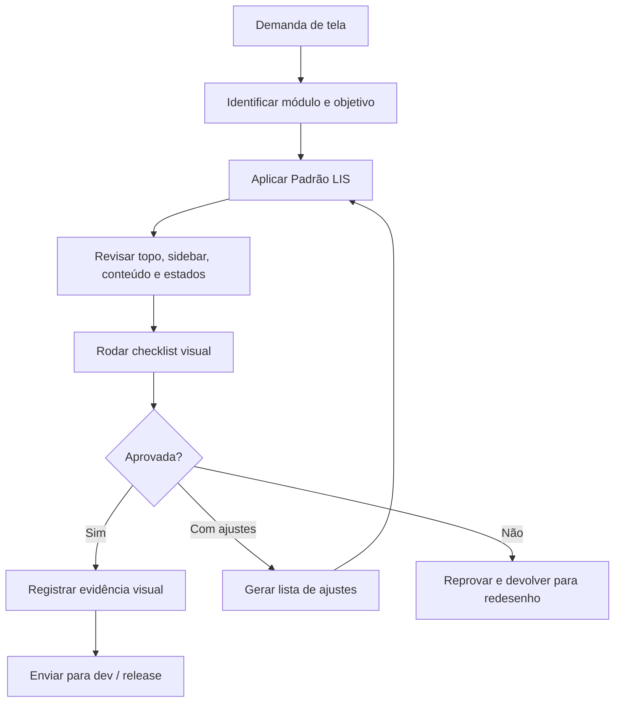
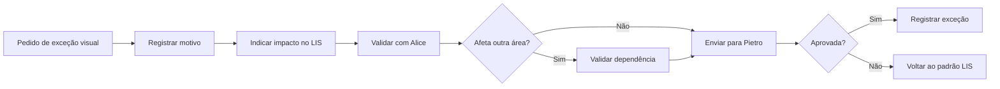
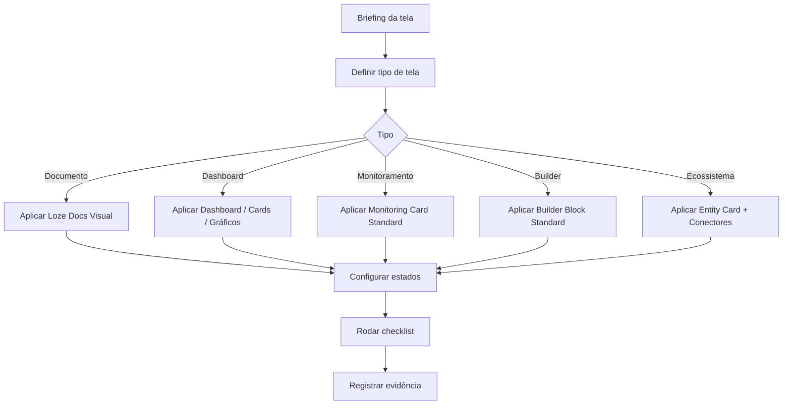
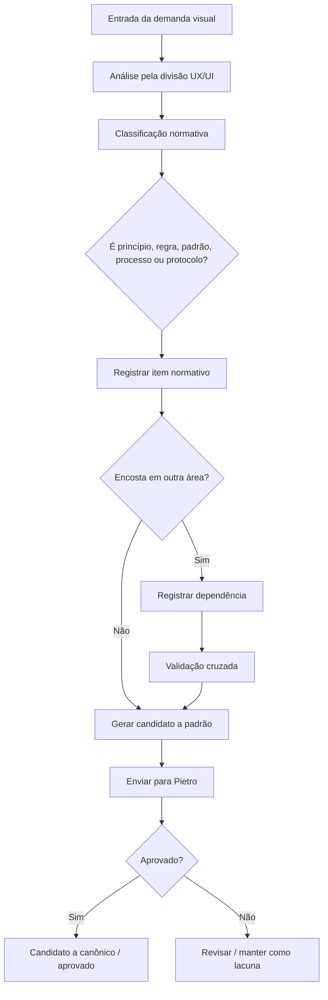
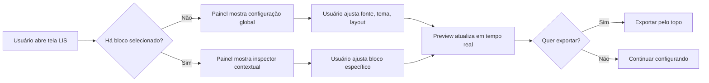
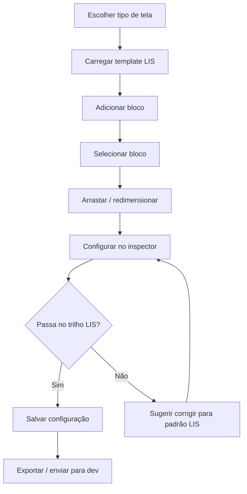
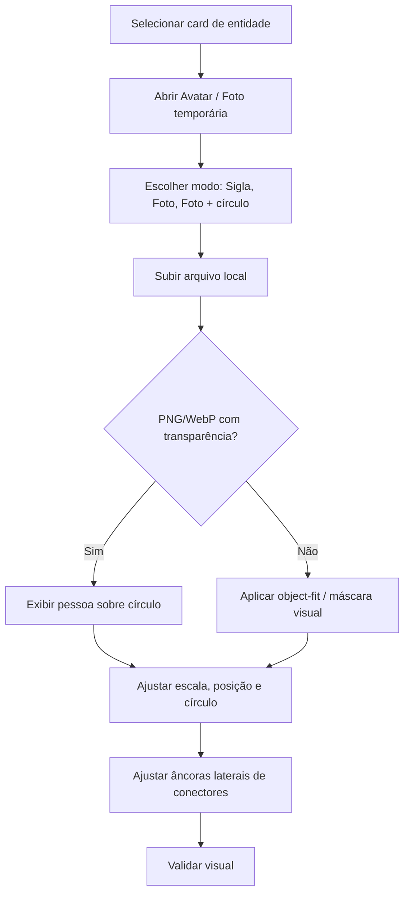
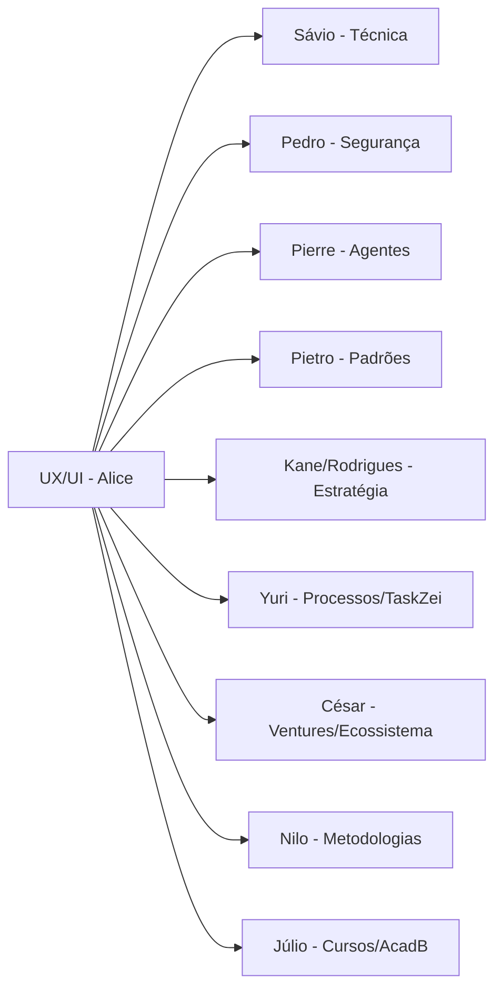
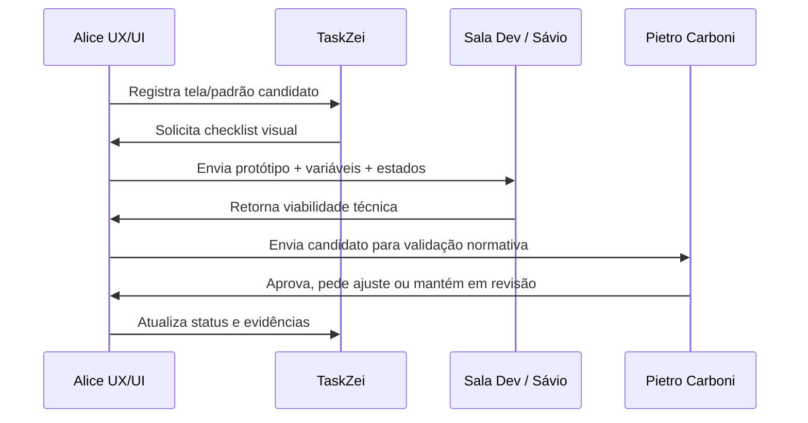

# Documento Mestre de Padrões — UX/UI, Experiência e Interface — v1 — 06-06-2026

## Cabeçalho interno

| Campo | Informação |
|---|---|
| Documento | Documento Mestre de Padrões da Divisão |
| Divisão | UX/UI, Experiência e Interface |
| Responsável | Alice Montini |
| Versão | v1 |
| Data da versão | 06-06-2026 |
| Status | candidato a documento-mãe da divisão |
| Formato | Markdown .md |
| Destino | Central de Padrões do SagB |
| Responsável pela validação final | Pietro Carboni |

---

## 1. Objetivo do documento

Este documento organiza os padrões da divisão **UX/UI, Experiência e Interface** do GrupoB / Loze / SagB, sob responsabilidade de **Alice Montini**.

O objetivo é consolidar, em um único documento-mãe, os princípios, políticas, regras, padrões, protocolos, processos, procedimentos, checklists, matrizes, registros, riscos, lacunas, decisões e dependências da área de UX/UI.

Este documento serve para:

1. orientar a criação de interfaces do SagB, Loze e produtos digitais do GrupoB;
2. consolidar o **Padrão LIS — Loze Interface Standard** como base institucional de interface;
3. substituir o antigo nome informal “Padrão Alice” por um nome institucional e reaplicável;
4. definir como telas, componentes, dashboards, documentos, chats, builders, módulos, cards, listas, tabelas e fluxos devem se comportar visualmente;
5. separar o que é responsabilidade da UX/UI do que pertence à técnica, segurança, agentes, IA, processos ou decisão estratégica;
6. alimentar a **Central de Padrões do SagB** com padrões reutilizáveis, atômicos e auditáveis;
7. gerar base para o módulo SagB, Biblioteca de Módulos Base, Gate Modular Pré-Dev, Pacote Modular Pré-Dev e Sala Dev quando aplicável.

> **Status geral:** candidato a documento-mãe da divisão. Nenhum item deste documento deve ser tratado como canônico final antes da validação de Pietro Carboni.

---

## 2. Escopo da divisão

A divisão **UX/UI, Experiência e Interface** cobre tudo que define como o usuário percebe, navega, entende, configura, interage e valida uma interface do ecossistema GrupoB / Loze / SagB.

### 2.1. Escopo direto da divisão

A divisão cobre:

1. telas;
2. fluxos de experiência;
3. navegação;
4. dashboards;
5. componentes visuais;
6. cards;
7. botões;
8. tabelas;
9. listas;
10. formulários;
11. filtros;
12. barras superiores;
13. sidebars;
14. breadcrumbs;
15. painéis laterais;
16. modos de visualização;
17. microcopy visível ao usuário;
18. mensagens de erro, alerta, sucesso e bloqueio;
19. estados de tela;
20. acessibilidade visual e usabilidade mínima;
21. UX de aprovação humana;
22. UX de logs e histórico visíveis;
23. experiência conversacional;
24. visual de agentes;
25. Loze Docs;
26. Central de Padrões;
27. Central de Monitoramento, no aspecto visual e experiencial;
28. Biblioteca Modular, no aspecto visual e experiencial;
29. Ecossistema Master, no aspecto visual e experiencial;
30. Loze Studio / LIS Builder, no aspecto visual e de interação;
31. configuração visual manual por sliders, selects, toggles e inspector contextual;
32. responsividade de interface;
33. modo claro e modo escuro;
34. modo TV / modo apresentação / modo foco;
35. organização visual de módulos;
36. card padrão de entidade;
37. upload temporário visual para avatar/foto em cards, quando usado apenas como teste de interface;
38. padrão de exportação visual centralizada no topo;
39. padrão de configuração visual sem poluir a área principal;
40. qualidade visual pré-dev e pré-release.

### 2.2. Escopo indireto da divisão

A divisão participa, como dependência ou validação visual, dos seguintes temas:

1. interfaces técnicas definidas por Sávio Codare;
2. fluxos de segurança visual definidos com Pedro Gazan;
3. UX de agentes definida em conjunto com Pierre Zanulli;
4. padrões oficiais e canonicidade definidos por Pietro Carboni;
5. decisões estratégicas de produto definidas por Kane/Rodrigues;
6. módulos base reutilizáveis definidos na Biblioteca de Módulos Base;
7. Gate Modular Pré-Dev e Sala Dev;
8. Central de Monitoramento, quando indicadores precisam ser compreensíveis;
9. TaskZei, quando tarefas precisam carregar evidência visual, checklist ou registro de revisão.

---

## 3. O que esta divisão define

Esta divisão define os padrões visuais e experienciais que orientam a construção das interfaces do ecossistema.

| Item | Tipo normativo | Esta divisão define |
|---|---:|---|
| Padrão LIS — Loze Interface Standard | 🟠 padrão | Nome, princípios visuais, lógica de interface e aplicação geral |
| Robust Clean | 🟠 padrão | Linguagem visual base: limpa, robusta, profissional e legível |
| Operação Leveza | 🟠 padrão | Aplicação do visual em sistemas internos operacionais |
| Mobile Compact Clean | 🟠 padrão | Direção de interface compacta para mobile |
| Module Full Screen | 🟠 padrão | Modo para telas que exigem máxima área útil |
| Gradient System | 🟠 padrão | Uso controlado de gradientes para destaque, profundidade e leitura |
| Loze Docs Visual | 🟠 padrão | Padrão visual de documentos, listas, hierarquias e edição |
| Agent UX | 🟠 padrão | Representação visual e experiência de interação com agentes |
| Human Approval UX | 🟢 protocolo / 🟠 padrão | Interface de aprovação humana antes de ações sensíveis |
| Configurador Visual LIS | 🟠 padrão | Painel direito de configuração visual por controles manuais |
| Loze Studio / LIS Builder | 🟠 padrão candidato | Builder visual com blocos arrastáveis, redimensionáveis e configuráveis |
| Ecossistema Master UI | 🟠 padrão candidato | Mapa vivo do ecossistema com cards, conectores, filtros e modos de leitura |
| Central de Monitoramento UI | 🟠 padrão candidato | Cards de monitoramento, modo TV, alertas, métricas e grid responsivo |
| Sidebar padrão | 🟠 padrão | Sidebar retrátil, redimensionável, com árvore, documentos e estados |
| Topo compacto | 🟠 padrão | Topbar baixa, produtiva e sem barra permanente pesada do SagB |
| Exportação centralizada | 🔴 regra | Exportar apenas pelo botão superior “Exportar” |
| Microcopy visual | 🟠 padrão | Linguagem clara, curta, contextual e segura na interface |
| Estados de tela | 🟠 padrão | Vazio, carregando, erro, sucesso, bloqueio, sem permissão, alerta |
| Checklists visuais | ✅ checklist | Checklists para tela, componente, release, acessibilidade e UX de agente |
| Evidências visuais | 🧾 registro/evidência | Prints, versões, antes/depois, aprovação e exceções visuais |

---

## 4. O que esta divisão não define

A divisão não define decisões técnicas, regras de segurança, autonomia real de agentes, arquitetura de dados ou estratégia final de produto.

| Tema | Não pertence à Alice | Responsável principal | Como a Alice participa |
|---|---|---|---|
| Arquitetura técnica | Back-end, front-end técnico, deploy, repositório, Supabase | Sávio Codare | Define experiência e comportamento visual esperado |
| Segurança digital | Permissões, tokens, chaves, RLS, cofre, incidentes | Pedro Gazan | Define UX de alerta, bloqueio, erro e permissão visível |
| Agentes autônomos | Autonomia, memória, ferramentas, MCPs, handoff real | Pierre Zanulli | Define aparência, estados e experiência conversacional |
| Modelos de IA | Escolha, benchmark, radar, RAI e curadoria de modelos | Klaus Wagen | Define como resultados e alertas aparecem para o usuário |
| Processos operacionais | Execução, TaskZei, registros de operação | Yuri Sague | Define interface, leitura e evidência visual dos processos |
| Naming e marcas | Nome, disponibilidade, banco de marcas | Noah Verdili | Define apresentação visual quando o nome aparece em interface |
| Metodologias | Estruturas conceituais, frameworks intelectuais | Nilo Barret | Define diagramação visual, leitura e documentação visual |
| Cursos e trilhas | Arquitetura pedagógica AcadB | Júlio Mosqueira | Define experiência de consumo, telas e componentes educacionais |
| StartyB ventures | Empresas, marcas, plano de negócio | César Tulli | Define visual de plano, ficha, cards e biblioteca de ventures |
| Padrão oficial final | Canonicidade normativa | Pietro Carboni | Entrega candidato visual para validação |
| Decisão estratégica | Prioridade, produto e direção Loze/SagB | Kane/Rodrigues | Propõe caminhos visuais e riscos de UX |

---

## 5. Fontes analisadas

As fontes consideradas para este documento foram:

1. histórico deste chat com Alice Montini;
2. discussões sobre substituição do nome “Padrão Alice” por **Padrão LIS — Loze Interface Standard**;
3. estudos e HTMLs da **Documentação Interna LIS**;
4. estudos e HTMLs da **Central de Monitoramento LIS**;
5. estudos e HTMLs da **Biblioteca Modular LIS**;
6. estudos e HTMLs do **Loze Studio / LIS Builder**;
7. estudos e HTMLs do **Ecossistema Master LIS**;
8. protótipo de upload temporário de foto/avatar em cards;
9. tela de referência do Outlook e adaptação customizável total;
10. decisões do Rodrigues sobre barras superiores, sidebars, painéis, exportação e configurabilidade;
11. estrutura da Central de Padrões do GrupoB / Loze / SagB;
12. modelo normativo geral definido por Pietro Carboni;
13. regra de que protocolo só existe quando há situação específica, sequência obrigatória, responsável e saída esperada;
14. definição de que a divisão da Alice cobre UX/UI, Experiência e Interface;
15. dependências já mencionadas com Sávio, Pedro, Pierre, Pietro e Kane/Rodrigues.

### 5.1. Limite de análise

Este documento consolida o que foi discutido até a presente versão. Alguns itens estão como **candidato a canônico**, **em revisão** ou **precisa validação**, pois ainda dependem de validação final de Pietro Carboni e, em alguns casos, de validação cruzada com outros responsáveis.

---

## 6. Síntese executiva

A divisão de UX/UI já possui uma base muito forte para virar documento-mãe dentro da Central de Padrões do SagB.

A evolução principal foi sair de um padrão informal associado à agente Alice e chegar a um padrão institucional:

> **Padrão LIS — Loze Interface Standard**

O Padrão LIS deve orientar como as interfaces da Loze devem parecer, funcionar e se comportar visualmente dentro do ecossistema GrupoB.

A divisão já tem decisões fortes:

1. a interface deve ser limpa, leve, robusta e produtiva;
2. o visual não pode ser infantil, pesado ou decorativo demais;
3. botões, filtros e controles devem ser finos, elegantes e configuráveis;
4. barras superiores devem ser compactas;
5. sidebars devem ser retráteis, redimensionáveis e configuráveis;
6. exportação deve ficar centralizada no topo;
7. o painel direito deve ser configurador, não área de conteúdo ou download;
8. sliders devem ser finos e mostrar o valor atual;
9. configurações devem ficar em dropdowns/accordions;
10. tudo que for possível deve ser configurável manualmente;
11. modos como Documento, Todos, Chat, Dois Documentos, Apresentação, TV e Foco Total devem existir quando fizer sentido;
12. Builder visual deve permitir clicar, arrastar, redimensionar e configurar blocos diretamente na tela;
13. blocos devem seguir trilhos inteligentes para não destruir o padrão LIS;
14. gráficos não podem ser pobres ou meramente decorativos;
15. cada card precisa ter lógica, métrica, estado, alerta, ação e detalhe;
16. visual de agente, documento, monitoramento, ecossistema e builder devem estar na mesma família visual;
17. variação visual real não é apenas trocar cor: deve variar fonte, estrutura, ritmo, forma, espaçamento, botão, imagem, densidade e hierarquia.

---

## 7. Mapa visual da divisão

```mermaid
flowchart TB
    A[UX/UI, Experiência e Interface] --> B[Padrão LIS]
    A --> C[Design System e Tokens]
    A --> D[Componentes Visuais]
    A --> E[Telas e Fluxos]
    A --> F[Loze Docs]
    A --> G[Central de Monitoramento]
    A --> H[Ecossistema Master]
    A --> I[Loze Studio / LIS Builder]
    A --> J[UX de Agentes]
    A --> K[Microcopy e Estados]
    A --> L[Acessibilidade e Usabilidade]
    A --> M[Checklists, Matrizes e Evidências]

    B --> B1[Robust Clean]
    B --> B2[Operação Leveza]
    B --> B3[Mobile Compact Clean]
    B --> B4[Module Full Screen]
    B --> B5[Gradient System]

    C --> C1[Tipografia]
    C --> C2[Cores]
    C --> C3[Espaçamentos]
    C --> C4[Radius]
    C --> C5[Sombras]

    D --> D1[Cards]
    D --> D2[Botões]
    D --> D3[Tabelas]
    D --> D4[Formulários]
    D --> D5[Sidebars]

    I --> I1[Canvas]
    I --> I2[Blocos]
    I --> I3[Inspector contextual]
    I --> I4[Arrastar e redimensionar]
    I --> I5[Exportar no topo]
```

### 7.1. Color code da divisão

| Cor / emoji | Significado | Uso |
|---|---|---|
| 🔵 | Princípio | Ideia orientadora da área |
| 🟣 | Política | Diretriz de uso e governança |
| 🔴 | Regra | Obrigação ou proibição objetiva |
| 🟠 | Padrão | Forma recomendada ou obrigatória de construir |
| 🟢 | Protocolo | Sequência obrigatória em situação específica |
| ⚙️ | Processo | Fluxo de trabalho amplo |
| 🧩 | Procedimento | Passo operacional menor |
| ✅ | Checklist | Lista de verificação |
| 📊 | Matriz | Cruzamento de critérios |
| 🧾 | Registro/evidência | Prova, log, print, decisão ou versão |
| ⚠️ | Risco | Algo que pode prejudicar a área |
| 💡 | Recomendação | Melhoria sugerida |
| 📌 | Decisão | Decisão já tomada |
| ❓ | Dúvida/lacuna | Item pendente de definição |
| 🚨 | Crítico | Item de impacto alto ou urgente |

---

## 8. Princípios da área

| Código | Princípio | Tipo | Status | Prioridade | Observação |
|---|---|---:|---|---|---|
| UX-PRI-001 | Clareza antes de beleza | 🔵 princípio | candidato a canônico | crítico | Toda interface deve ser compreensível antes de ser decorativa |
| UX-PRI-002 | Leveza operacional | 🔵 princípio | candidato a canônico | crítico | A tela deve facilitar a execução, não disputar atenção |
| UX-PRI-003 | Configurabilidade controlada | 🔵 princípio | candidato a canônico | crítico | Tudo que for útil deve ser configurável, mas dentro de trilhos LIS |
| UX-PRI-004 | Máxima área útil quando necessário | 🔵 princípio | candidato a canônico | importante | Módulos complexos precisam ocultar barras e painéis |
| UX-PRI-005 | Variação visual real | 🔵 princípio | candidato a canônico | importante | Diferenciar versões não é apenas mudar cor |
| UX-PRI-006 | Menos peso, mais precisão | 🔵 princípio | candidato a canônico | crítico | Botões, filtros e fontes não podem ser pesados demais |
| UX-PRI-007 | Interface como sistema vivo | 🔵 princípio | em revisão | importante | Telas devem aceitar modos, estados, dados e evolução |
| UX-PRI-008 | O usuário mexe no bloco, não só no painel | 🔵 princípio | em revisão | crítico | Base do Loze Studio / LIS Builder |
| UX-PRI-009 | Visual não deve prometer função que o sistema não entrega | 🔵 princípio | candidato a canônico | crítico | Especialmente em agentes, IA, segurança e aprovação |
| UX-PRI-010 | Todo estado visível deve orientar uma próxima ação | 🔵 princípio | candidato a canônico | crítico | Erro, vazio, alerta e sucesso devem dizer o que fazer |

### 8.1. Quadro de síntese dos princípios

> O Padrão LIS deve gerar interfaces que pareçam **limpas, leves, profissionais, configuráveis, produtivas e confiáveis**, sem perder controle normativo, rastreabilidade e coerência visual.

---

## 9. Políticas da área

| Código | Política | Tipo | Status | Prioridade | Validação necessária |
|---|---|---:|---|---|---|
| UX-POL-001 | Política de uso do Padrão LIS | 🟣 política | candidato a canônico | crítico | Pietro / Kane-Rodrigues |
| UX-POL-002 | Política de exportação centralizada | 🟣 política | candidato a canônico | crítico | Pietro / Sávio |
| UX-POL-003 | Política de configuração visual manual | 🟣 política | em revisão | crítico | Pietro / Sávio |
| UX-POL-004 | Política de não poluição do painel direito | 🟣 política | candidato a canônico | importante | Pietro |
| UX-POL-005 | Política de modo claro/escuro | 🟣 política | candidato a canônico | importante | Alice / Sávio |
| UX-POL-006 | Política de customização por módulo | 🟣 política | em revisão | importante | Kane-Rodrigues / Pietro |
| UX-POL-007 | Política de evidência visual pré-release | 🟣 política | candidato a canônico | crítico | Alice / Sávio / Pietro |
| UX-POL-008 | Política de acessibilidade mínima | 🟣 política | em revisão | crítico | Alice / Sávio |
| UX-POL-009 | Política de UX de agentes | 🟣 política | precisa validação | crítico | Pierre / Pedro / Pietro |
| UX-POL-010 | Política de interface configurável sem quebrar padrão | 🟣 política | em revisão | crítico | Pietro / Sávio |

### 9.1. Política de exportação centralizada

A exportação de configurações, HTML, CSS, JSON, PNG, SVG ou presets deve ficar centralizada no botão superior **Exportar**.

Não deve haver botões de download espalhados no painel direito de configuração.

### 9.2. Política de configuração visual

O painel direito deve ser dedicado a configuração visual e comportamental da interface. Ele pode conter sliders, selects, toggles, color pickers, inputs e dropdowns, mas não deve virar área de conteúdo principal.

---

## 10. Regras centrais da área

| Código | Regra | Tipo | Status | Prioridade | Observação |
|---|---|---:|---|---|---|
| UX-REG-001 | Não usar mais “Padrão Alice” como nome institucional | 🔴 regra | candidato a canônico | crítico | Nome correto: Padrão LIS |
| UX-REG-002 | Exportar somente pelo topo | 🔴 regra | candidato a canônico | crítico | Painel direito não deve ter download interno |
| UX-REG-003 | Botões e filtros devem ser finos e proporcionais | 🔴 regra | candidato a canônico | crítico | Evitar visual pesado e infantil |
| UX-REG-004 | Sidebar deve ser retrátil e redimensionável quando houver lista longa | 🔴 regra | candidato a canônico | crítico | Especialmente docs, módulos e ecossistema |
| UX-REG-005 | Topo deve ser compacto | 🔴 regra | candidato a canônico | crítico | Evitar barra grande permanente do SagB |
| UX-REG-006 | Todo controle manual deve mostrar o valor atual | 🔴 regra | candidato a canônico | importante | Ex.: 14px, 400, 1.45, 280px |
| UX-REG-007 | Sliders devem ser visualmente finos | 🔴 regra | candidato a canônico | importante | Evitar controles pesados |
| UX-REG-008 | Configurações devem ficar em dropdowns/accordions | 🔴 regra | candidato a canônico | importante | Organização do painel direito |
| UX-REG-009 | Modo TV não deve sair ao mover mouse | 🔴 regra | candidato a canônico | crítico | Sair apenas por botão ou ESC |
| UX-REG-010 | Painéis de monitoramento devem usar múltiplos visuais coerentes | 🔴 regra | candidato a canônico | importante | 4, 8, 12, 16; evitar 10 se quebrar grid |
| UX-REG-011 | Gráficos devem carregar significado | 🔴 regra | candidato a canônico | importante | Não podem ser decorativos pobres |
| UX-REG-012 | Card de entidade deve ser compacto e informativo | 🔴 regra | em revisão | importante | Sigla/foto, nome, tipo, status, tags e conexão |
| UX-REG-013 | Conectores não devem atravessar rosto/avatar | 🔴 regra | em revisão | importante | Usar âncoras laterais em cards com foto |
| UX-REG-014 | Foto temporária em HTML de teste não deve ser enviada ao servidor | 🔴 regra | candidato a canônico | crítico | Teste local apenas |
| UX-REG-015 | Variações visuais devem variar estrutura, não apenas paleta | 🔴 regra | candidato a canônico | importante | Regra derivada da crítica do link bio |

---

## 11. Padrões oficiais e candidatos a padrão

### 11.1. Padrão LIS — Loze Interface Standard

| Campo | Definição |
|---|---|
| Nome oficial | Padrão LIS |
| Nome completo | Loze Interface Standard |
| Status | candidato a canônico |
| Base visual | Robust Clean |
| Aplicação | SagB, Loze, módulos, dashboards, documentos, agentes, monitoramento e sistemas internos |
| Validação final | Pietro Carboni / Kane-Rodrigues |

**Definição:**

> O **Padrão LIS** define como as interfaces da Loze devem parecer, funcionar e se comportar visualmente dentro do ecossistema GrupoB.

### 11.2. Linguagens visuais subordinadas ao LIS

| Código | Nome | Tipo | Status | Uso |
|---|---|---:|---|---|
| UX-PAD-001 | Robust Clean | 🟠 padrão | candidato a canônico | Base estética limpa, robusta e profissional |
| UX-PAD-002 | Operação Leveza | 🟠 padrão | candidato a canônico | Sistemas internos e telas operacionais |
| UX-PAD-003 | Mobile Compact Clean | 🟠 padrão | em revisão | Mobile e telas compactas |
| UX-PAD-004 | Module Full Screen | 🟠 padrão | candidato a canônico | Módulos que precisam de muita área útil |
| UX-PAD-005 | Gradient System | 🟠 padrão | em revisão | Destaques, profundidade e gráficos |
| UX-PAD-006 | Loze Docs Visual | 🟠 padrão | candidato a canônico | Documentos internos e hierarquias |
| UX-PAD-007 | Agent UX | 🟠 padrão | precisa validação | Experiência visual de agentes |
| UX-PAD-008 | Human Approval UX | 🟠 padrão / 🟢 protocolo | precisa validação | Ações sensíveis com revisão humana |
| UX-PAD-009 | Monitoring Card Standard | 🟠 padrão | em revisão | Cards da Central de Monitoramento |
| UX-PAD-010 | Entity Card Standard | 🟠 padrão | em revisão | Cards do Ecossistema Master |
| UX-PAD-011 | Configurator Panel Standard | 🟠 padrão | candidato a canônico | Painel direito de configuração |
| UX-PAD-012 | Builder Block Standard | 🟠 padrão | em revisão | Blocos arrastáveis do Loze Studio |

### 11.3. Padrão de configurador visual

O configurador visual deve seguir estes pontos:

1. painel direito dedicado a configuração;
2. configurações em accordions/dropdowns;
3. sliders finos;
4. valor atual sempre visível;
5. exportação apenas no topo;
6. controles de fonte, peso, linha, espaçamento, cor, borda, sombra, radius, densidade, layout e estados;
7. modo global quando nada está selecionado;
8. modo contextual quando um bloco está selecionado;
9. possibilidade de recolher o painel direito;
10. possibilidade de esconder ou expandir sidebars.

### 11.4. Padrão de sidebar

A sidebar padrão deve ser:

1. retrátil;
2. redimensionável;
3. configurável;
4. com suporte a árvore/dropdown;
5. com documentos-mãe;
6. com tipos de item visíveis;
7. com busca opcional;
8. com badges e contadores opcionais;
9. com item ativo configurável;
10. com opção de recolhimento total para máxima área útil.

### 11.5. Padrão de modo TV / apresentação

O modo TV ou apresentação deve:

1. limpar menus e distrações;
2. maximizar área útil;
3. sair apenas com botão próprio ou tecla ESC;
4. não voltar ao modo normal ao passar o mouse;
5. manter leitura à distância;
6. permitir visualização em notebook, monitor, TV de 32” e TV de 50”.

---

## 12. Protocolos reais da área

Protocolos reais só aparecem quando há situação específica, sequência obrigatória, responsável e saída esperada.

| Código | Protocolo | Situação específica | Responsável | Saída esperada | Status |
|---|---|---|---|---|---|
| UX-PRO-001 | Protocolo de Gate Visual de Tela | Antes de aprovar uma tela para dev ou release | Alice Montini | Tela aprovada, aprovada com ajuste ou recusada | candidato a canônico |
| UX-PRO-002 | Protocolo de Exceção Visual | Quando uma tela precisa fugir do LIS | Alice + Pietro | Exceção registrada, aprovada ou recusada | em revisão |
| UX-PRO-003 | Protocolo de Revisão Visual Pré-Release | Antes de publicar/deployar interface | Alice + Sávio | Evidência visual e autorização de release | candidato a canônico |
| UX-PRO-004 | Protocolo de UX de Aprovação Humana | Antes de ação sensível em agente/sistema | Alice + Pierre + Pedro + Sávio | Aprovar, editar, rejeitar ou escalar | precisa validação |
| UX-PRO-005 | Protocolo de Mensagem de Erro Visível | Quando sistema mostra erro ao usuário | Alice + Sávio/Pedro | Mensagem clara, segura e acionável | em revisão |
| UX-PRO-006 | Protocolo de UX de Agente em Interface | Quando agente aparece ou age em tela | Alice + Pierre | Usuário entende origem, status e limite do agente | precisa validação |
| UX-PRO-007 | Protocolo de UX de Logs e Histórico | Quando histórico é exibido para usuário | Alice + Pedro + Sávio | Histórico compreensível e seguro | precisa validação |
| UX-PRO-008 | Protocolo de Validação de Configurador LIS | Ao criar tela configurável padrão | Alice + Sávio + Pietro | Tela passa no checklist de configurabilidade | em revisão |

### 12.1. Fluxo do Gate Visual de Tela

### 12.2. Fluxo de exceção visual

---

## 13. Processos da área

| Código | Processo | Tipo | Status | Responsável | Resultado |
|---|---|---:|---|---|---|
| UX-PRC-001 | Processo de criação de tela LIS | ⚙️ processo | candidato a canônico | Alice | Tela coerente com LIS |
| UX-PRC-002 | Processo de criação de componente | ⚙️ processo | em revisão | Alice + Sávio | Componente reutilizável |
| UX-PRC-003 | Processo de criação de dashboard | ⚙️ processo | em revisão | Alice | Dashboard legível e útil |
| UX-PRC-004 | Processo de criação de tela configurável | ⚙️ processo | candidato a canônico | Alice | Tela com painel de configuração completo |
| UX-PRC-005 | Processo de criação de builder visual | ⚙️ processo | em revisão | Alice + Sávio | Canvas com blocos configuráveis |
| UX-PRC-006 | Processo de curadoria de referências visuais | ⚙️ processo | em revisão | Alice | Referência vira padrão aplicável |
| UX-PRC-007 | Processo de crítica visual estruturada | ⚙️ processo | candidato a canônico | Alice | Diagnóstico visual claro |
| UX-PRC-008 | Processo de revisão de responsividade | ⚙️ processo | em revisão | Alice + Sávio | Tela funcional em resoluções-alvo |
| UX-PRC-009 | Processo de documentação visual no Loze Docs | ⚙️ processo | em revisão | Alice | Documento com hierarquia e leitura |
| UX-PRC-010 | Processo de evidência visual por release | ⚙️ processo | candidato a canônico | Alice + Sávio | Registro de versão visual publicada |

### 13.1. Processo de criação de tela LIS

---

## 14. Procedimentos operacionais

| Código | Procedimento | Tipo | Status | Quando usar |
|---|---|---:|---|---|
| UX-PROC-001 | Revisar card | 🧩 procedimento | candidato a canônico | Card novo ou alterado |
| UX-PROC-002 | Revisar botão | 🧩 procedimento | candidato a canônico | Botão novo ou pesado demais |
| UX-PROC-003 | Revisar tabela/lista | 🧩 procedimento | em revisão | Tela com muitos registros |
| UX-PROC-004 | Revisar gráfico | 🧩 procedimento | em revisão | Gráfico novo ou sem significado |
| UX-PROC-005 | Revisar sidebar | 🧩 procedimento | candidato a canônico | Sidebar nova ou longa |
| UX-PROC-006 | Revisar topo | 🧩 procedimento | candidato a canônico | Topbar alta ou poluída |
| UX-PROC-007 | Revisar microcopy | 🧩 procedimento | em revisão | Mensagem de erro/sucesso/alerta |
| UX-PROC-008 | Revisar modo TV | 🧩 procedimento | candidato a canônico | Painel para monitor/TV |
| UX-PROC-009 | Revisar upload temporário de avatar | 🧩 procedimento | em revisão | Teste visual em card de entidade |
| UX-PROC-010 | Revisar bloco arrastável no builder | 🧩 procedimento | em revisão | Loze Studio / LIS Builder |

### 14.1. Procedimento para revisar um card

1. Verificar se o card tem objetivo claro.
2. Verificar se o título é curto e legível.
3. Verificar se a métrica principal existe, quando aplicável.
4. Verificar se há status ou alerta quando necessário.
5. Verificar se o conteúdo inferior não fica vazio.
6. Verificar se há ação clara ao clicar.
7. Verificar se cabe em grid responsivo.
8. Verificar se o padding, radius, sombra e borda seguem LIS.
9. Verificar se a versão compacta continua compreensível.
10. Registrar evidência se aprovado.

---

## 15. Checklists obrigatórios

### 15.1. Checklist de aprovação visual de tela

- [ ] A tela usa o nome correto do padrão: Padrão LIS.
- [ ] O topo está compacto.
- [ ] O breadcrumb está estreito e legível.
- [ ] A sidebar é retrátil quando aplicável.
- [ ] A sidebar é redimensionável quando aplicável.
- [ ] O painel direito é configurador, não área de download.
- [ ] A exportação está somente no topo.
- [ ] Botões e filtros estão finos e proporcionais.
- [ ] As fontes estão leves e legíveis.
- [ ] Os sliders mostram valores atuais.
- [ ] As configurações estão em dropdowns/accordions.
- [ ] Os estados de tela existem.
- [ ] Gráficos têm significado real.
- [ ] Cards têm conteúdo completo.
- [ ] Responsividade básica foi testada.
- [ ] Modo claro e escuro foram considerados.
- [ ] Evidência visual foi registrada.

### 15.2. Checklist de Central de Monitoramento

- [ ] Painéis usam múltiplos coerentes: 4, 8, 12 ou 16.
- [ ] Não há rolagem quando a intenção for painel de TV.
- [ ] Modo TV sai apenas por botão ou ESC.
- [ ] Cada card tem métrica principal.
- [ ] Cada card tem alertas próprios.
- [ ] Cada card tem gráfico, barra, processo ou log útil.
- [ ] Cada card abre detalhe ao clicar.
- [ ] Cards encaixam em tela grande e notebook.
- [ ] Fonte não está pesada demais.
- [ ] Contraste está adequado.

### 15.3. Checklist de configurador LIS

- [ ] Configuração geral de fonte existe.
- [ ] Configuração de fonte do sidebar existe.
- [ ] Configuração de topo existe.
- [ ] Configuração de botões existe.
- [ ] Configuração de breadcrumb existe.
- [ ] Configuração de tabela/lista existe.
- [ ] Configuração de cards existe.
- [ ] Configuração de gráficos existe.
- [ ] Configuração de fundo/marca d’água existe.
- [ ] Configuração de modo claro/escuro existe.
- [ ] Configuração de layout existe.
- [ ] Configuração do painel direito existe.
- [ ] Valores atuais aparecem ao lado dos controles.
- [ ] Sliders são finos.
- [ ] Exportação fica apenas no topo.

### 15.4. Checklist de Ecossistema Master

- [ ] Cards estão compactos e elegantes.
- [ ] Filtros não competem com conteúdo.
- [ ] Há mapa visual e outras leituras: lista, tabela, árvore, grupos, relações.
- [ ] Conectores são configuráveis.
- [ ] Existe lógica de plugar/desplugar conexão.
- [ ] Entidades aceitam tipo, categoria, status, área, vínculo e tags.
- [ ] Card com avatar/foto não é atravessado por conectores.
- [ ] Upload temporário é local e não persiste no servidor.
- [ ] Modo tela cheia limpa distrações.
- [ ] A tela é escalável para novas entidades.

### 15.5. Checklist de Loze Studio / LIS Builder

- [ ] Blocos são selecionáveis.
- [ ] Blocos podem ser arrastados.
- [ ] Blocos podem ser redimensionados.
- [ ] Painel direito vira inspector contextual.
- [ ] Quando nada está selecionado, painel mostra configuração global.
- [ ] Há grid ou guias de alinhamento.
- [ ] Há travas para preservar LIS.
- [ ] Há ação de duplicar, esconder, travar ou excluir bloco.
- [ ] Exportação fica no topo.
- [ ] Responsividade por dispositivo foi considerada.

---

## 16. Matrizes obrigatórias

### 16.1. Matriz de tipo de tela x padrão visual

| Tipo de tela | Padrão principal | Elementos obrigatórios | Validação |
|---|---|---|---|
| Documento | Loze Docs Visual | Sidebar, documento, metadados, ações, estados | Alice / Pietro |
| Todos os documentos | Lista/Tabela LIS | Colunas, filtros, tags, ações, datas | Alice |
| Chat com agente | Agent UX + Chat UX | Balões, contexto, agente, input, ações | Alice / Pierre |
| Dashboard | Robust Clean + Cards | KPIs, gráficos, filtros, estados | Alice |
| Monitoramento | Monitoring Card Standard | Alertas, status, modo TV, grid | Alice / Sávio |
| Ecossistema | Entity Card Standard | Cards, conectores, filtros, modos | Alice / César / Kane |
| Builder | Builder Block Standard | Canvas, blocos, inspector, grid | Alice / Sávio |
| Segurança visual | UX de alerta/bloqueio | Mensagem, severidade, ação | Alice / Pedro |
| Aprovação humana | Human Approval UX | Contexto, impacto, aprovar/editar/rejeitar | Alice / Pierre / Pedro |

### 16.2. Matriz de configurabilidade

| Elemento | Configuração mínima | Configuração avançada | Prioridade |
|---|---|---|---|
| Fonte global | Família, tamanho, peso | Entrelinha, tracking, escala responsiva | crítico |
| Topo | Altura, botões, fonte | Busca, ícones, gaps, opacidade, blur | crítico |
| Breadcrumb | Altura, fonte, separador | Cores, item ativo, botões de modo | importante |
| Sidebar | Largura, fonte, linha, recuo | Fundo, hover, ativo, badges, dropdowns | crítico |
| Painel direito | Largura, fonte, accordions | Slider, toggles, selects, theme | crítico |
| Cards | Padding, radius, sombra | Estados, hover, ações, ícone, rodapé | crítico |
| Tabelas | Linha, fonte, colunas | Hover, selecionado, tags, avatar, ações | importante |
| Gráficos | Altura, espessura, cores | Tipo, legenda, eixo, thresholds | importante |
| Chat | Fonte, balão, gap | Avatar, input, sugestões, contexto | importante |
| Fundo | Opacidade, símbolo, tamanho | Repetição, posição, rotação, blur | opcional |

### 16.3. Matriz de severidade visual

| Severidade | Cor sugerida | Uso | Exige validação? |
|---|---|---|---|
| Online / saudável | Verde | Sistema funcionando | Não |
| Informativo | Azul | Informação neutra | Não |
| Atenção | Amarelo/âmbar | Requer atenção sem bloqueio | Talvez |
| Alerta | Laranja | Exige ação próxima | Sim, se envolver segurança |
| Crítico | Vermelho | Exige ação imediata | Sim |
| Offline | Cinza/vermelho | Serviço indisponível | Sim |
| Pausado | Cinza/azul | Execução interrompida intencionalmente | Depende |
| Desconhecido | Cinza | Dado não disponível | Sim, se recorrente |

### 16.4. Matriz de modos de visualização

| Modo | Objetivo | Sidebars | Topo | Uso típico |
|---|---|---|---|---|
| Documento | Ler/editar documento | Visível/retrátil | Compacto | Central de Padrões, Loze Docs |
| Todos | Ver muitos registros | Visível | Compacto | Lista de documentos, e-mails, módulos |
| Chat | Conversar com agente | Opcional | Compacto | Pietro, agentes, pesquisa contextual |
| Dois documentos | Comparar | Recolhível | Compacto | Versão A/B, documento base x derivado |
| Apresentação | Mostrar sem distração | Oculto | Oculto/compacto | Reuniões, leitura ampla |
| TV | Monitoramento contínuo | Oculto | Oculto/controles discretos | Central de Monitoramento |
| Builder | Montar tela | Painel blocos + inspector | Compacto | Loze Studio |

---

## 17. Registros e evidências obrigatórias

| Código | Registro/evidência | Tipo | Status | Onde guardar | Observação |
|---|---|---:|---|---|---|
| UX-REGIST-001 | Registro de tela aprovada | 🧾 registro/evidência | candidato a canônico | registros_e_evidencias | Print + link + versão |
| UX-REGIST-002 | Registro de componente oficial | 🧾 registro/evidência | em revisão | registros_e_evidencias | Nome, uso, estado, versão |
| UX-REGIST-003 | Registro de componente depreciado | 🧾 registro/evidência | em revisão | registros_e_evidencias | Para evitar uso antigo |
| UX-REGIST-004 | Registro de exceção visual | 🧾 registro/evidência | candidato a canônico | registros_e_evidencias | Exceção aprovada por quem |
| UX-REGIST-005 | Registro de auditoria visual | 🧾 registro/evidência | candidato a canônico | registros_e_evidencias | Antes/depois e ajustes |
| UX-REGIST-006 | Registro de revisão pré-release | 🧾 registro/evidência | candidato a canônico | registros_e_evidencias | Obrigatório antes de publicar |
| UX-REGIST-007 | Evidência de responsividade | 🧾 registro/evidência | em revisão | registros_e_evidencias | Desktop/tablet/mobile |
| UX-REGIST-008 | Evidência de acessibilidade mínima | 🧾 registro/evidência | em revisão | registros_e_evidencias | Contraste, foco, toque |
| UX-REGIST-009 | Registro de decisão visual aprovada | 🧾 registro/evidência | candidato a canônico | registros_e_evidencias | Evita retrabalho |
| UX-REGIST-010 | Histórico de versões do design system | 🧾 registro/evidência | candidato a canônico | registros_e_evidencias | Evolução do LIS |

---

## 18. Fluxos Mermaid da divisão

### 18.1. Fluxo geral da divisão até a Central de Padrões

### 18.2. Fluxo do configurador visual LIS

### 18.3. Fluxo do Loze Studio / LIS Builder

### 18.4. Fluxo de upload temporário de avatar

### 18.5. Mapa de dependências

---

## 19. Dependências com outras áreas

| Tema | Depende de quem | Motivo | Tipo de dependência | Arquivo/registro sugerido |
|---|---|---|---|---|
| Implementação do LIS | Sávio Codare | Tokens, CSS, front-end e componentização | técnica | `dependencias-com-savio-codare.md` |
| Segurança visual | Pedro Gazan | Mensagens, bloqueios, permissões e riscos | segurança | `dependencias-com-pedro-gazan.md` |
| UX de agentes | Pierre Zanulli | Autonomia, memória, estados e handoff | agente/IA | `dependencias-com-pierre-zanulli.md` |
| Canonicidade do LIS | Pietro Carboni | Padrão oficial da Central | normativa | `dependencias-com-pietro-carboni.md` |
| Direção visual estratégica | Kane/Rodrigues | Decisão do produto Loze/SagB | estratégica | `dependencias-com-kane-rodrigues.md` |
| TaskZei e acionamento | Yuri Sague | Tarefas, responsáveis, registros | processo | `dependencias-com-yuri-sague.md` |
| Ecossistema Master | César Tulli | Empresas, ventures, entidades, relações | negócio/ecossistema | `dependencias-com-cesar-tulli.md` |
| Metodologias visuais | Nilo Barret | Diagramas e frameworks | metodologia | `dependencias-com-nilo-barret.md` |
| AcadB e trilhas | Júlio Mosqueira | Telas educacionais, cursos, mentorias | educação | `dependencias-com-julio-mosqueira.md` |
| Nomes e marcas na interface | Noah Verdili | Naming e disponibilidade | marca/naming | `dependencias-com-noah-verdili.md` |

---

## 20. Conflitos de escopo

| Conflito | Risco | Como resolver |
|---|---|---|
| UX de agente x autonomia real de agente | Alice documentar comportamento que pertence a Pierre | Alice define visual; Pierre define autonomia |
| Mensagem de segurança x regra de segurança | UX suavizar bloqueio crítico | Pedro define regra; Alice define comunicação visível |
| Componente visual x implementação técnica | Design não virar componente reutilizável | Sávio valida implementação |
| Configurador visual x builder real | HTML virar protótipo sem arquitetura | Sávio transforma em sistema; Alice define experiência |
| Central de Monitoramento visual x monitoramento técnico | Card mostrar dado sem origem real | Sávio define origem; Alice define leitura |
| Ecossistema Master visual x cadastro de entidades | Card visual sem modelo de dados | César/Sávio definem dados; Alice define interface |
| Loze Docs visual x governança documental | Interface bonita sem canonicidade | Pietro define canonicidade; Alice define experiência |
| Padrão LIS x identidade de marca Loze | Interface virar marca sem decisão estratégica | Kane/Rodrigues validam direção |

---

## 21. Riscos se os padrões não forem seguidos

| Risco | Causa provável | Impacto | Como prevenir | Quem acompanha |
|---|---|---|---|---|
| Interfaces pesadas e infantis | Botões grandes, filtros altos, excesso visual | Perda de profissionalismo | Aplicar checklist visual | Alice |
| Padrão fragmentado | Cada módulo com visual diferente | SagB parece colcha de retalhos | Usar Padrão LIS | Alice / Pietro |
| Retrabalho técnico | Design sem componente reutilizável | Dev refaz tudo | Validar com Sávio | Alice / Sávio |
| UX prometendo função inexistente | Visual mostra ação que sistema não executa | Quebra de confiança | Validar com técnica/agentes | Alice / Sávio / Pierre |
| Risco visual de segurança | Mensagem fraca para ação crítica | Usuário ignora alerta | Validar com Pedro | Alice / Pedro |
| Baixa área útil | Topo/sidebar/painel ocupando demais | Módulos avançados ficam ruins | Modo foco/full screen | Alice |
| Configuração confusa | Controles demais sem organização | Usuário se perde | Usar accordions e inspector contextual | Alice |
| Gráficos pobres | Elementos decorativos sem leitura | Painel não ajuda decisão | Matriz de gráficos | Alice |
| Perda de evidência | Aprovação visual sem registro | Não há rastreabilidade | Registro pré-release | Alice / Sávio |
| Quebra de acessibilidade | Contraste e tamanho ruins | Usuário não consegue usar | Checklist acessibilidade mínima | Alice |

---

## 22. O que deve ser monitorado pela Central de Monitoramento

A Central de Monitoramento deve observar os itens da divisão UX/UI que afetam qualidade, padrão, risco e operação visual.

A lógica é:

> **Central de Padrões define. Central de Monitoramento observa. TaskZei aciona. Responsável responde.**

| Item a monitorar | Por que monitorar | Origem do dado | Responsável | Ação se der alerta |
|---|---|---|---|---|
| Tela sem checklist visual | Evitar publicação sem revisão | TaskZei / registro visual | Alice | Criar tarefa de revisão |
| Release sem evidência visual | Evitar perda de rastreabilidade | Git/Sala Dev/registro | Alice / Sávio | Bloquear release ou registrar exceção |
| Componente sem status | Evitar uso de componente experimental | Biblioteca de componentes | Alice | Classificar componente |
| Padrão visual vencido | Evitar documento desatualizado | Central de Padrões | Pietro / Alice | Revisar padrão |
| Tela fora do LIS | Evitar fragmentação visual | Auditoria visual | Alice | Rodar gate visual |
| Mensagem crítica sem validação de segurança | Evitar risco de segurança | Logs/registro de UX | Pedro / Alice | Validar com Pedro |
| UX de agente sem ficha visual | Evitar confusão de agente | Catálogo de agentes | Pierre / Alice | Criar ficha visual |
| Configurador sem exportação no topo | Evitar padrão quebrado | Revisão de interface | Alice | Ajustar tela |
| Modo TV saindo com mouse | Evitar falha em monitoramento | Teste visual | Alice / Sávio | Corrigir comportamento |
| Sidebar não retrátil | Evitar perda de área útil | Auditoria visual | Alice | Criar tarefa de ajuste |
| Gráfico sem leitura real | Evitar painel decorativo | Auditoria UX | Alice | Revisar card/gráfico |
| Avatar/foto temporária persistindo sem regra | Evitar risco de dado pessoal | Teste HTML / app | Pedro / Sávio / Alice | Bloquear persistência ou validar regra |

---

## 23. Relação com Biblioteca de Módulos Base, se aplicável

Esta divisão possui relação direta com a **Biblioteca de Módulos Base Reutilizáveis do SagB**, porque os módulos precisam nascer com telas, componentes e padrões reutilizáveis.

### 23.1. Como UX/UI alimenta a Biblioteca de Módulos Base

| Módulo base | Relação com UX/UI | Padrão aplicado |
|---|---|---|
| Central de Padrões | Documentos, sidebars, listas, validações | Loze Docs Visual / LIS |
| Central de Monitoramento | Painéis, cards, alertas, modo TV | Monitoring Card Standard |
| Biblioteca Modular | Catálogo, ficha, checklist, gate | Configurador LIS |
| Ecossistema Master | Cards, conectores, filtros, modos | Entity Card Standard |
| Loze Docs | Documento, árvore, chat, dois docs | Loze Docs Visual |
| Agentes | Avatar, mensagens, estados, handoff | Agent UX |
| Aprovações | Revisão, impacto, confirmar/editar/rejeitar | Human Approval UX |
| Logs e Histórico | Linha do tempo, registros visíveis | UX de Logs |
| Loze Studio | Builder, blocos, inspector, canvas | Builder Block Standard |
| Configurações | Painel direito, sliders, dropdowns | Configurator Panel Standard |

### 23.2. Relação com Gate Modular Pré-Dev

Antes de um módulo ir para desenvolvimento, ele deve passar por um Gate UX/UI mínimo:

1. a tela principal está definida;
2. os estados estão previstos;
3. a sidebar/topo/painéis seguem LIS;
4. os componentes são reutilizáveis ou documentados;
5. há checklist visual;
6. há evidência de protótipo;
7. há dependências com técnica, segurança ou agentes registradas;
8. há decisão sobre modo claro/escuro;
9. há plano de responsividade;
10. há definição de monitoramento, quando aplicável.

### 23.3. Relação com Pacote Modular Pré-Dev

O Pacote Modular Pré-Dev deve receber da UX/UI:

1. protótipo HTML ou visual;
2. checklist de aprovação visual;
3. matriz de estados;
4. matriz de componentes usados;
5. regras de responsividade;
6. tokens visuais usados;
7. evidências de aprovação;
8. dependências;
9. riscos visuais;
10. recomendações para Sala Dev.

---

## 24. Relação com TaskZei e Sala Dev, se aplicável

A divisão tem relação direta com TaskZei e Sala Dev.

### 24.1. Relação com TaskZei

TaskZei deve transformar lacunas, revisões e pendências de UX em tarefas rastreáveis.

Exemplos de acionamento:

1. checklist visual pendente;
2. ajuste de sidebar;
3. revisão de fonte;
4. gráfico sem leitura;
5. modo TV com comportamento errado;
6. componente sem status;
7. exceção visual sem registro;
8. tela sem evidência;
9. dependência com Pedro/Sávio/Pierre;
10. padrão aguardando Pietro.

### 24.2. Relação com Sala Dev

A Sala Dev deve receber da Alice:

1. protótipo visual;
2. especificação de comportamento;
3. lista de componentes;
4. variáveis de configuração;
5. estados de tela;
6. responsividade;
7. restrições visuais;
8. dependências;
9. checklists;
10. evidência de validação.

### 24.3. Fluxo UX/UI para Sala Dev

---

## 25. Lacunas e validações pendentes

| Lacuna | Impacto | Quem valida | Prioridade | Recomendação |
|---|---|---|---|---|
| Padrão LIS ainda não validado formalmente como canônico | Pode haver uso informal sem governança | Pietro / Kane-Rodrigues | crítico | Validar nome, escopo e documento canônico |
| Tokens LIS ainda não estão fechados | Dev pode implementar visual inconsistente | Alice / Sávio | crítico | Criar arquivo de tokens v1 |
| Builder LIS ainda é protótipo | Pode virar produto sem arquitetura | Alice / Sávio / Kane | importante | Criar especificação funcional |
| Configurador ainda não tem todas as variáveis | Limita uso como padrão | Alice / Sávio | importante | Criar mapa completo de variáveis |
| Gráficos ainda precisam padrão forte | Painéis podem ficar pobres | Alice / Sávio | importante | Criar matriz de gráficos |
| UX de agentes depende de Pierre | Visual pode prometer autonomia errada | Pierre / Alice | crítico | Criar ficha visual de agente |
| UX de segurança depende de Pedro | Mensagens podem ocultar risco | Pedro / Alice | crítico | Criar matriz de severidade validada |
| Ecossistema Master depende de modelo de dados | Cards podem ser só visuais | César / Sávio / Alice | importante | Definir entidade, relação e conector |
| Upload temporário de foto toca dado pessoal | Pode virar risco se persistir | Pedro / Sávio | crítico | Manter local até validação |
| Acessibilidade ainda precisa checklist final | Pode gerar tela difícil de usar | Alice / Sávio | crítico | Criar checklist acessibilidade v1 |
| Modo TV e apresentação precisam padrão único | Cada módulo pode fazer diferente | Alice / Sávio | importante | Criar padrão de modo foco/TV |
| Exportação de presets precisa contrato técnico | Botão Exportar pode virar visual sem função | Sávio / Alice | importante | Definir JSON/CSS/HTML exportável |

---

## 26. Decisões já tomadas

| Código | Decisão | Tipo | Status | Observação |
|---|---|---:|---|---|
| UX-DEC-001 | Remover o nome “Padrão Alice” | 📌 decisão | candidato a canônico | Nome institucional deve ser LIS |
| UX-DEC-002 | Usar “Padrão LIS — Loze Interface Standard” | 📌 decisão | candidato a canônico | Favorito validado em conversa |
| UX-DEC-003 | Base visual: Robust Clean | 📌 decisão | candidato a canônico | Linguagem visual subordinada ao LIS |
| UX-DEC-004 | Exportação somente no topo | 📌 decisão | candidato a canônico | Painel direito sem download |
| UX-DEC-005 | Painel direito deve ser configurador | 📌 decisão | candidato a canônico | 100% configuração visual |
| UX-DEC-006 | Sliders devem ser finos e mostrar valores | 📌 decisão | candidato a canônico | Evitar controles pesados |
| UX-DEC-007 | Configurações em dropdowns | 📌 decisão | candidato a canônico | Accordions no painel direito |
| UX-DEC-008 | Sidebar deve recolher totalmente | 📌 decisão | candidato a canônico | Máxima área útil |
| UX-DEC-009 | Sidebar deve ser redimensionável | 📌 decisão | candidato a canônico | Nomes longos e módulos grandes |
| UX-DEC-010 | Modo TV sai só por botão ou ESC | 📌 decisão | candidato a canônico | Não por mouse hover |
| UX-DEC-011 | Monitoramento deve usar 4, 8, 12, 16 painéis | 📌 decisão | candidato a canônico | Evitar 10 quando quebra visual |
| UX-DEC-012 | Variação visual real não é só cor | 📌 decisão | candidato a canônico | Regra visual importante |
| UX-DEC-013 | Builder deve permitir mexer direto no bloco | 📌 decisão | em revisão | Loze Studio / LIS Builder |
| UX-DEC-014 | Ecossistema Master precisa mapa + lista + tabela + árvore + grupos + relações | 📌 decisão | em revisão | Não ser só mapa visual |
| UX-DEC-015 | Foto temporária em card deve ser teste local | 📌 decisão | em revisão | Sem persistência ainda |

---

## 27. Documentos derivados que precisam nascer

| Documento | Tipo | Por que precisa existir | Prioridade | Responsável |
|---|---|---|---|---|
| `loze-interface-standard-lis-v1.md` | 🟠 padrão | Documento canônico do LIS | crítico | Alice / Pietro |
| `design-tokens-lis-v1.css` | 🟠 padrão | Variáveis implementáveis | crítico | Alice / Sávio |
| `biblioteca-componentes-lis-v1.md` | 🟠 padrão | Catálogo de componentes | crítico | Alice / Sávio |
| `padrao-sidebar-lis-v1.md` | 🟠 padrão | Sidebar retrátil/redimensionável | crítico | Alice |
| `padrao-topo-compacto-lis-v1.md` | 🟠 padrão | Topbar padrão dos módulos | crítico | Alice |
| `padrao-configurador-lis-v1.md` | 🟠 padrão | Painel direito configurável | crítico | Alice / Sávio |
| `padrao-exportacao-topo-lis-v1.md` | 🔴 regra / 🟠 padrão | Centralizar exportações | importante | Alice / Sávio |
| `padrao-cards-lis-v1.md` | 🟠 padrão | Cards de dashboard, entidade e ação | crítico | Alice |
| `padrao-graficos-lis-v1.md` | 🟠 padrão | Gráficos úteis e configuráveis | importante | Alice |
| `padrao-tabelas-listas-lis-v1.md` | 🟠 padrão | Listas e documentos em linha | importante | Alice |
| `padrao-loze-docs-visual-v1.md` | 🟠 padrão | Documento, árvore, chat, 2 docs | crítico | Alice |
| `padrao-monitoramento-lis-v1.md` | 🟠 padrão | Central de Monitoramento | crítico | Alice / Sávio |
| `padrao-ecossistema-master-lis-v1.md` | 🟠 padrão | Mapa vivo do GrupoB | importante | Alice / César |
| `padrao-loze-studio-builder-v1.md` | 🟠 padrão | Builder visual modular | importante | Alice / Sávio |
| `protocolo-gate-visual-tela-v1.md` | 🟢 protocolo | Aprovar telas antes de dev/release | crítico | Alice |
| `checklist-release-visual-lis-v1.md` | ✅ checklist | Evitar publicação sem revisão | crítico | Alice / Sávio |
| `matriz-severidade-visual-v1.md` | 📊 matriz | Status, alerta, crítico e bloqueio | crítico | Alice / Pedro |
| `registro-evidencia-visual-release-v1.md` | 🧾 registro/evidência | Rastreabilidade visual | crítico | Alice / Sávio |
| `ficha-visual-agente-v1.md` | 🟠 padrão | Visual de agentes | crítico | Alice / Pierre |
| `padrao-acessibilidade-minima-lis-v1.md` | ✅ checklist / 🟠 padrão | Usabilidade e inclusão | crítico | Alice / Sávio |

---

## 28. Padrões atômicos sugeridos para o módulo SagB

| Código sugerido | Nome do padrão | Tipo | Resumo | Documento de origem | Status sugerido |
|---|---|---:|---|---|---|
| SAGB-UX-001 | Padrão LIS | 🟠 padrão | Interface base da Loze/SagB | Este documento | candidato a canônico |
| SAGB-UX-002 | Topo compacto | 🟠 padrão | Barra superior baixa e produtiva | Este documento | candidato a canônico |
| SAGB-UX-003 | Sidebar retrátil redimensionável | 🟠 padrão | Sidebar com largura e recolhimento | Este documento | candidato a canônico |
| SAGB-UX-004 | Exportar apenas no topo | 🔴 regra | Exportação centralizada | Este documento | candidato a canônico |
| SAGB-UX-005 | Painel direito configurador | 🟠 padrão | Configurações em accordions | Este documento | candidato a canônico |
| SAGB-UX-006 | Slider fino com valor visível | 🟠 padrão | Controle manual transparente | Este documento | candidato a canônico |
| SAGB-UX-007 | Modo foco/tela cheia | 🟠 padrão | Ocultar distrações e maximizar área | Este documento | candidato a canônico |
| SAGB-UX-008 | Modo TV | 🟠 padrão | Painel em tela cheia com ESC/botão | Este documento | candidato a canônico |
| SAGB-UX-009 | Card de monitoramento | 🟠 padrão | Métrica, alerta, gráfico e detalhe | Este documento | em revisão |
| SAGB-UX-010 | Card de entidade | 🟠 padrão | Nome, tipo, status, tags e conexão | Este documento | em revisão |
| SAGB-UX-011 | Avatar temporário em card | 🧩 procedimento | Upload local para teste visual | Este documento | precisa validação |
| SAGB-UX-012 | Conectores laterais | 🟠 padrão | Relações sem atravessar avatar | Este documento | em revisão |
| SAGB-UX-013 | Lista de documentos | 🟠 padrão | Tabela/lista estilo produtividade | Este documento | candidato a canônico |
| SAGB-UX-014 | Chat contextual com agente | 🟠 padrão | Chat para pesquisa e alinhamento | Este documento | precisa validação |
| SAGB-UX-015 | Dois documentos lado a lado | 🟠 padrão | Comparação documental | Este documento | em revisão |
| SAGB-UX-016 | Builder block | 🟠 padrão | Bloco arrastável e redimensionável | Este documento | em revisão |
| SAGB-UX-017 | Inspector contextual | 🟠 padrão | Configuração do bloco selecionado | Este documento | em revisão |
| SAGB-UX-018 | Estado visual acionável | 🟠 padrão | Todo estado orienta próxima ação | Este documento | candidato a canônico |
| SAGB-UX-019 | Evidência visual por release | 🧾 registro/evidência | Registro de telas aprovadas | Este documento | candidato a canônico |
| SAGB-UX-020 | Checklist de aprovação visual | ✅ checklist | Gate antes de dev/release | Este documento | candidato a canônico |

---

## 29. Ordem recomendada de canonização

A canonização deve ocorrer em camadas para evitar que padrões derivados nasçam antes da base.

### 29.1. Primeiro bloco — fundação LIS

1. `loze-interface-standard-lis-v1.md`
2. `design-tokens-lis-v1.css`
3. `padrao-topo-compacto-lis-v1.md`
4. `padrao-sidebar-lis-v1.md`
5. `padrao-configurador-lis-v1.md`
6. `padrao-exportacao-topo-lis-v1.md`

### 29.2. Segundo bloco — componentes e estados

1. `biblioteca-componentes-lis-v1.md`
2. `padrao-cards-lis-v1.md`
3. `padrao-tabelas-listas-lis-v1.md`
4. `padrao-graficos-lis-v1.md`
5. `matriz-severidade-visual-v1.md`
6. `padrao-acessibilidade-minima-lis-v1.md`

### 29.3. Terceiro bloco — telas e módulos

1. `padrao-loze-docs-visual-v1.md`
2. `padrao-monitoramento-lis-v1.md`
3. `padrao-ecossistema-master-lis-v1.md`
4. `padrao-loze-studio-builder-v1.md`
5. `ficha-visual-agente-v1.md`

### 29.4. Quarto bloco — protocolos e evidências

1. `protocolo-gate-visual-tela-v1.md`
2. `checklist-release-visual-lis-v1.md`
3. `registro-evidencia-visual-release-v1.md`
4. `protocolo-ux-aprovacao-humana-v1.md`
5. `protocolo-ux-agente-interface-v1.md`

---

## 30. Síntese final

A divisão **UX/UI, Experiência e Interface** já possui uma base robusta para avançar como documento-mãe dentro da Central de Padrões do SagB.

O principal avanço foi institucionalizar o padrão visual como **Padrão LIS — Loze Interface Standard**, removendo o nome informal “Padrão Alice” e criando uma base mais apropriada para a Loze, o SagB e o GrupoB.

A área já possui decisões claras sobre:

1. visual limpo, leve e profissional;
2. configurabilidade profunda;
3. sidebars retráteis e redimensionáveis;
4. barras superiores compactas;
5. exportação centralizada no topo;
6. sliders finos com valores visíveis;
7. configurações em dropdowns;
8. modo TV, modo apresentação e modo foco;
9. Loze Docs;
10. Central de Monitoramento;
11. Ecossistema Master;
12. Loze Studio / LIS Builder;
13. cards, conectores, avatares e entidades;
14. UX de agentes e aprovação humana como dependências críticas;
15. necessidade de evidência visual e gate pré-dev/pré-release.

Ainda precisam de validação:

1. canonicidade formal do LIS;
2. tokens implementáveis;
3. matriz de severidade visual com Pedro;
4. UX de agentes com Pierre;
5. implementação técnica com Sávio;
6. direção estratégica de produto com Kane/Rodrigues;
7. canetada normativa final de Pietro Carboni.

Minha leitura final é que esta divisão possui padrões suficientes para avançar como documento-mãe da área dentro da Central de Padrões, mas a canonicidade final depende de validação do Pietro Carboni.

---

## Próximas 10 ações recomendadas

1. Validar com Pietro Carboni o nome oficial **Padrão LIS — Loze Interface Standard**.
2. Criar o documento derivado `loze-interface-standard-lis-v1.md`.
3. Criar o arquivo de tokens visuais `design-tokens-lis-v1.css` com Sávio Codare.
4. Canonizar o padrão de topo compacto e sidebar retrátil/redimensionável.
5. Criar o checklist oficial de aprovação visual de tela.
6. Criar a matriz de severidade visual com validação de Pedro Gazan.
7. Criar a ficha visual de agente com Pierre Zanulli.
8. Criar o padrão de Central de Monitoramento LIS v1 com cards, alertas e modo TV.
9. Criar o padrão do Ecossistema Master com entidades, conectores e modos de visualização.
10. Criar o protocolo de registro de evidência visual por release.

---

## Padrões que devem ser extraídos primeiro para o módulo SagB

1. Padrão LIS — Loze Interface Standard.
2. Padrão de Topo Compacto.
3. Padrão de Sidebar Retrátil e Redimensionável.
4. Padrão de Painel Direito Configurador.
5. Regra de Exportação Centralizada no Topo.
6. Padrão de Cards LIS.
7. Padrão de Tabelas/Listas LIS.
8. Padrão de Central de Monitoramento LIS.
9. Padrão de Loze Docs Visual.
10. Protocolo de Gate Visual de Tela.

---

## Inventário normativo da divisão

| Código | Item | Tipo normativo | Status | Prioridade | Responsável | Validação necessária |
|---|---|---:|---|---|---|---|
| UX-INV-001 | Padrão LIS | 🟠 padrão | candidato a canônico | crítico | Alice | Pietro / Kane-Rodrigues |
| UX-INV-002 | Robust Clean | 🟠 padrão | candidato a canônico | crítico | Alice | Pietro |
| UX-INV-003 | Operação Leveza | 🟠 padrão | candidato a canônico | importante | Alice | Pietro |
| UX-INV-004 | Topo compacto | 🟠 padrão | candidato a canônico | crítico | Alice | Sávio |
| UX-INV-005 | Sidebar retrátil | 🟠 padrão | candidato a canônico | crítico | Alice | Sávio |
| UX-INV-006 | Exportação centralizada | 🔴 regra | candidato a canônico | crítico | Alice | Sávio / Pietro |
| UX-INV-007 | Configurador visual | 🟠 padrão | candidato a canônico | crítico | Alice | Sávio |
| UX-INV-008 | Loze Docs Visual | 🟠 padrão | em revisão | crítico | Alice | Pietro / Sávio |
| UX-INV-009 | Central de Monitoramento UI | 🟠 padrão | em revisão | crítico | Alice | Sávio |
| UX-INV-010 | Ecossistema Master UI | 🟠 padrão | em revisão | importante | Alice | César / Kane |
| UX-INV-011 | Loze Studio Builder | 🟠 padrão | em revisão | importante | Alice | Sávio / Kane |
| UX-INV-012 | Agent UX | 🟠 padrão | precisa validação | crítico | Alice | Pierre |
| UX-INV-013 | Human Approval UX | 🟢 protocolo | precisa validação | crítico | Alice | Pierre / Pedro / Sávio |
| UX-INV-014 | Gate Visual de Tela | 🟢 protocolo | candidato a canônico | crítico | Alice | Pietro |
| UX-INV-015 | Evidência visual por release | 🧾 registro/evidência | candidato a canônico | crítico | Alice | Sávio |
| UX-INV-016 | Checklist de release visual | ✅ checklist | candidato a canônico | crítico | Alice | Sávio |
| UX-INV-017 | Matriz de severidade visual | 📊 matriz | precisa validação | crítico | Alice | Pedro |
| UX-INV-018 | Padrão de avatar temporário | 🧩 procedimento | em revisão | importante | Alice | Pedro / Sávio |
| UX-INV-019 | Padrão de conectores laterais | 🟠 padrão | em revisão | importante | Alice | Sávio / César |
| UX-INV-020 | Acessibilidade mínima | 🟣 política / ✅ checklist | em revisão | crítico | Alice | Sávio |

---

## Padrões atômicos sugeridos para o SagB

| Código sugerido | Nome do padrão | Tipo | Resumo | Documento de origem | Status sugerido |
|---|---|---:|---|---|---|
| SAGB-LIS-001 | LIS Naming Standard | 🟠 padrão | Nome oficial do padrão visual | Documento Mestre UX/UI | candidato a canônico |
| SAGB-LIS-002 | Compact Topbar Standard | 🟠 padrão | Topo baixo e produtivo | Documento Mestre UX/UI | candidato a canônico |
| SAGB-LIS-003 | Configurable Sidebar Standard | 🟠 padrão | Sidebar retrátil, ajustável e configurável | Documento Mestre UX/UI | candidato a canônico |
| SAGB-LIS-004 | Top Export Rule | 🔴 regra | Exportação apenas no topo | Documento Mestre UX/UI | candidato a canônico |
| SAGB-LIS-005 | Right Config Panel Standard | 🟠 padrão | Painel direito somente configuração | Documento Mestre UX/UI | candidato a canônico |
| SAGB-LIS-006 | Thin Slider Value Standard | 🟠 padrão | Slider fino com medida exibida | Documento Mestre UX/UI | candidato a canônico |
| SAGB-LIS-007 | Visual Evidence Standard | 🧾 registro/evidência | Registro de aprovação visual | Documento Mestre UX/UI | candidato a canônico |
| SAGB-LIS-008 | Monitoring Tile Standard | 🟠 padrão | Card de monitoramento com métricas e alertas | Documento Mestre UX/UI | em revisão |
| SAGB-LIS-009 | Entity Card Standard | 🟠 padrão | Card de entidade do ecossistema | Documento Mestre UX/UI | em revisão |
| SAGB-LIS-010 | Builder Inspector Standard | 🟠 padrão | Painel contextual de bloco selecionado | Documento Mestre UX/UI | em revisão |

---

## Dependências com outras áreas

| Tema | Depende de quem | Motivo | Tipo de dependência | Arquivo/registro sugerido |
|---|---|---|---|---|
| Tokens e CSS | Sávio Codare | Implementar o padrão visual | técnica | `dependencias-com-savio-codare.md` |
| Mensagens de risco | Pedro Gazan | Segurança e severidade | risco/segurança | `dependencias-com-pedro-gazan.md` |
| Agentes em interface | Pierre Zanulli | Estados e autonomia do agente | IA/agentes | `dependencias-com-pierre-zanulli.md` |
| Canonicidade | Pietro Carboni | Validação normativa final | normativa | `dependencias-com-pietro-carboni.md` |
| Prioridade de produto | Kane/Rodrigues | Direção estratégica | estratégica | `dependencias-com-kane-rodrigues.md` |
| Tarefas e registros | Yuri Sague | TaskZei e execução | processo | `dependencias-com-yuri-sague.md` |
| Ecossistema Master | César Tulli | Entidades e relações do GrupoB | negócio | `dependencias-com-cesar-tulli.md` |

---

## Lacunas e validações

| Lacuna | Impacto | Quem valida | Prioridade | Recomendação |
|---|---|---|---|---|
| Canonicidade do LIS | Pode gerar uso informal | Pietro | crítico | Validar o documento LIS v1 |
| Tokens implementáveis | Dev pode divergir do visual | Sávio | crítico | Criar tokens CSS/JSON |
| UX de agente | Pode confundir humano/agente/sistema | Pierre | crítico | Criar ficha visual de agente |
| Severidade visual | Alertas podem ser mal interpretados | Pedro | crítico | Validar matriz de severidade |
| Builder visual | Pode ficar livre demais como Wix genérico | Kane/Sávio | importante | Definir trilhos inteligentes LIS |
| Exportação real | Botão pode ser só visual | Sávio | importante | Definir formato JSON/CSS/HTML |
| Upload temporário | Pode tocar dado pessoal | Pedro/Sávio | crítico | Manter local e validar LGPD mínima |
| Gráficos | Podem continuar pobres | Alice/Sávio | importante | Criar padrão de gráficos |
| Acessibilidade | Pode ficar só estética | Alice/Sávio | crítico | Checklist obrigatório |
| Registro visual | Pode haver release sem prova | Alice/Sávio | crítico | Evidência pré-release obrigatória |

---

## Riscos

| Risco | Causa provável | Impacto | Como prevenir | Quem acompanha |
|---|---|---|---|---|
| Visual inconsistente entre módulos | Ausência de LIS canônico | SagB sem unidade visual | Canonizar LIS | Pietro / Alice |
| Interface difícil de usar | Excesso de controles sem organização | Baixa adoção | Accordions e inspector contextual | Alice |
| Builder virar bagunça | Liberdade sem trilhos | Telas fora do padrão | Grid, tokens e validação LIS | Alice / Sávio |
| Dados sensíveis em avatar | Upload persistido sem regra | Risco LGPD/segurança | Teste local e validação Pedro | Pedro / Sávio |
| Monitoramento não confiável | Card sem origem real | Decisão errada | Origem do dado definida | Sávio |
| Agente visualmente confuso | Falta de diferenciação humano/agente | Usuário não entende origem da ação | Ficha visual de agente | Pierre / Alice |
| Exportação descentralizada | Botões espalhados | Padrão quebrado | Regra de exportar no topo | Alice |
| Gráfico decorativo | Sem métrica ou alerta | Dashboard fraco | Checklist de gráfico | Alice |
| Release sem revisão | Falta de gate visual | Erros em produção | Protocolo pré-release | Alice / Sávio |
| Topo/sidebar ocupando muito | Layout pesado | Perda de área útil | Modo foco/full screen | Alice |

---

## Monitoramento

| Item a monitorar | Por que monitorar | Origem do dado | Responsável | Ação se der alerta |
|---|---|---|---|---|
| Padrões LIS sem validação | Evitar uso canônico indevido | Central de Padrões | Pietro | Mover para precisa validação |
| Tela sem checklist | Evitar release visual fraco | TaskZei | Alice | Abrir tarefa de revisão |
| Componente sem registro | Evitar duplicidade técnica | Biblioteca de componentes | Alice/Sávio | Registrar ou depreciar |
| Erro visual recorrente | Evitar baixa qualidade | Logs/feedback | Alice | Rodar auditoria visual |
| Modo TV quebrado | Monitoramento precisa estabilidade | Teste de interface | Alice/Sávio | Corrigir e registrar evidência |
| Sidebar não recolhe | Módulo perde área útil | Auditoria UX | Alice | Criar ajuste no TaskZei |
| Mensagem crítica sem validação | Risco de segurança | Registro UX/segurança | Pedro | Validar texto e severidade |
| Agente sem status visual | Confusão de origem | Catálogo de agentes | Pierre/Alice | Criar ficha visual |
| Upload local persistindo | Risco de dado pessoal | Teste técnico | Pedro/Sávio | Bloquear persistência |
| Gráfico sem métrica | Painel pobre | Auditoria UX | Alice | Revisar card |

---
