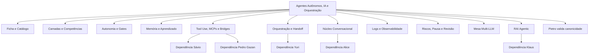
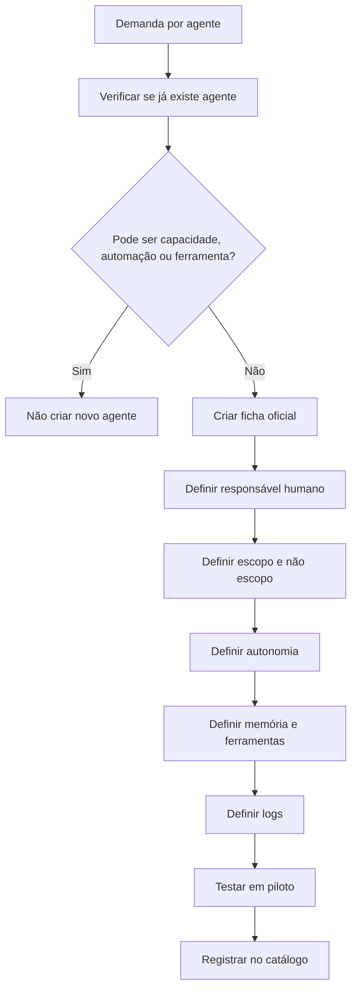
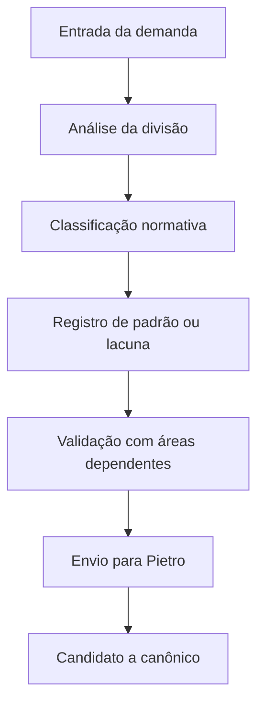
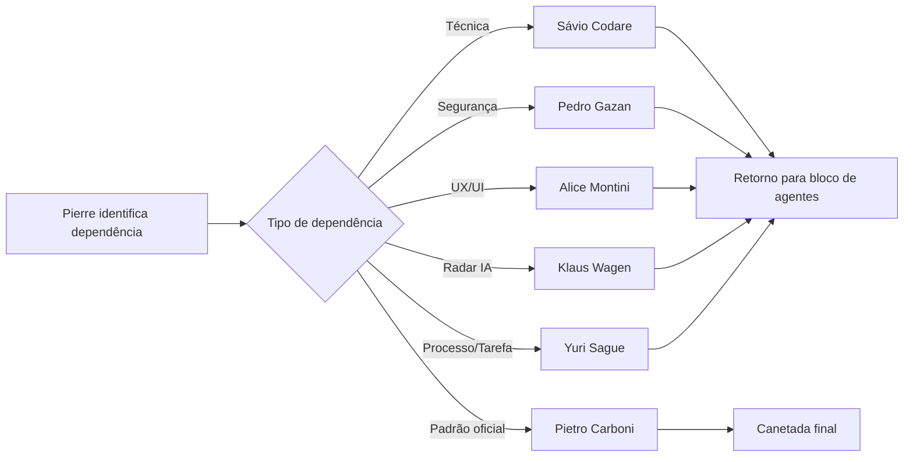
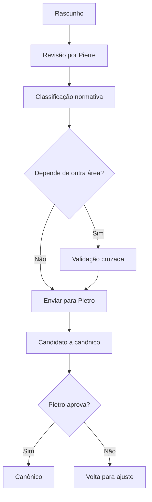
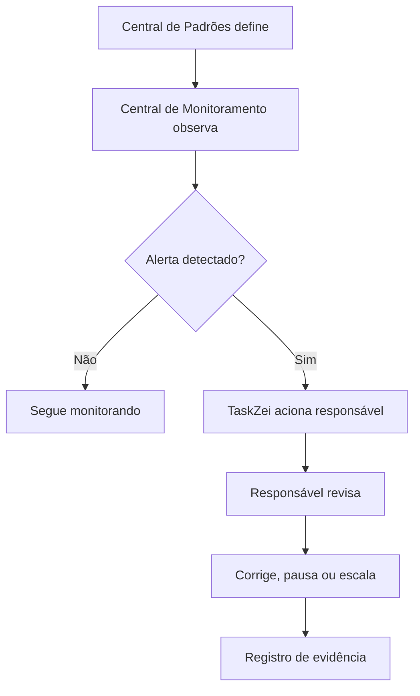

Perfeito, Rodrigues. Li o arquivo. Ele pede a criação de um **Documento Mestre de Padrões da Divisão**, com foco em reunir padrões reais da área, não um manual de como escrever documentos. Também exige classificação normativa, tabelas, matrizes, fluxos Mermaid, riscos, lacunas, monitoramento e próximos passos. 

Abaixo está o documento pronto.

---

# Documento Mestre de Padrões — Agentes Autônomos, IA e Orquestração — v1

| Campo           | Informação                                                                             |
| --------------- | -------------------------------------------------------------------------------------- |
| Documento       | Documento Mestre de Padrões — Agentes Autônomos, IA e Orquestração                     |
| Versão          | v1                                                                                     |
| Data            | 07/06/2026                                                                             |
| Responsável     | Pierre Zanulli                                                                         |
| Divisão         | Agentes Autônomos, IA e Orquestração                                                   |
| Documento base  | Auditoria e Revisão do Bloco Agentes Autônomos, IA e Orquestração — Central de Padrões |
| Status          | Em revisão                                                                             |
| Validação final | Pietro Carboni                                                                         |
| Uso previsto    | Alimentar a Central de Padrões do SagB / GrupoB / Loze                                 |

---

## Color code

| Código | Significado                              |
| ------ | ---------------------------------------- |
| 🟢     | Bom / aprovado / suficiente              |
| 🟡     | Atenção / parcial / precisa ajuste       |
| 🔴     | Crítico / ausente / risco alto           |
| 🔵     | Oportunidade estratégica                 |
| 🟣     | Governança / padrão / decisão estrutural |
| ⚫      | Contexto neutro                          |

---

## Classificação normativa

| Símbolo | Tipo               | Função                     |
| ------- | ------------------ | -------------------------- |
| 🔵      | Princípio          | Orienta                    |
| 🟣      | Política           | Posiciona                  |
| 🔴      | Regra              | Limita                     |
| 🟠      | Padrão             | Organiza                   |
| 🟢      | Protocolo          | Conduz situação específica |
| ⚙️      | Processo           | Conecta etapas             |
| 🧩      | Procedimento       | Executa passo específico   |
| ✅       | Checklist          | Confere                    |
| 📊      | Matriz             | Decide                     |
| 🧾      | Registro/evidência | Prova                      |
| ⚠️      | Risco              | Alerta                     |
| 💡      | Recomendação       | Sugere melhoria            |
| 📌      | Decisão            | Registra escolha           |
| ❓       | Dúvida/lacuna      | Exige validação            |
| 🚨      | Crítico            | Exige atenção imediata     |

---

# 1. Objetivo do documento

Este documento reúne, organiza e detalha os padrões reais da divisão **Agentes Autônomos, IA e Orquestração** dentro da Central de Padrões do SagB / GrupoB / Loze.

A finalidade é consolidar tudo que já foi definido sobre:

* agentes autônomos;
* camadas de agentes;
* ficha oficial de agente;
* catálogo de agentes;
* capacidades reutilizáveis;
* autonomia;
* memória;
* aprendizado revisado;
* tool use;
* MCPs e bridges usados por agentes;
* handoff;
* salas de reunião com agentes;
* logs;
* observabilidade;
* riscos;
* pausa;
* revisão;
* RAI e curadoria agentic de inteligências artificiais.

Este documento não é a canetada final. Ele é o **documento-mãe da divisão**, preparado para revisão e validação do Pietro Carboni.

---

# 2. Escopo da divisão

## Dentro do escopo

Esta divisão cobre:

* criação e estruturação de agentes;
* definição de agentes autônomos;
* agentes consultivos, operacionais, estratégicos e táticos;
* agentes de reunião;
* núcleo conversacional;
* ficha oficial de agente;
* catálogo oficial de agentes;
* ciclo de vida de agentes;
* macrocamadas dos agentes;
* competências;
* capacidades reutilizáveis;
* autonomia A0 a A6;
* gates de aprovação do ponto de vista do agente;
* memória aplicada a agentes;
* RAG do ponto de vista do agente;
* aprendizado revisado;
* tool use do ponto de vista do agente;
* MCPs e bridges usados por agentes;
* handoff entre agentes;
* prompt management;
* logs funcionais de agentes;
* observabilidade agentic;
* alucinação;
* confusão de contexto;
* pausa de agente;
* revisão de agente;
* mesa multi-LLM;
* curadoria agentic dentro do RAI.

## Fora do escopo

Esta divisão não define sozinha:

* arquitetura técnica, APIs, banco, Supabase, deploy, GitHub e repositórios — **Sávio Codare**;
* segurança digital, credenciais, tokens, chaves, RLS, dados sensíveis, incidentes e retenção — **Pedro Gazan**;
* UX/UI, telas, componentes, microcopy final, alertas visuais e usabilidade — **Alice Montini**;
* radar tecnológico amplo de IA e mercado global — **Klaus Wagen**;
* processos operacionais amplos, TaskZei e execução recorrente — **Yuri Sague**;
* padrão oficial e canetada normativa — **Pietro Carboni**;
* prioridade estratégica da Loze — **Kane Zas / Rodrigues**.

---

# 3. O que esta divisão define

A divisão define:

1. O que é um agente autônomo na Loze.
2. Como um agente deve nascer.
3. Quais camadas todo agente precisa ter.
4. Como diferenciar agente, capacidade reutilizável, automação, ferramenta, workflow e protocolo.
5. Como estruturar autonomia de agentes.
6. Como aplicar memória a agentes.
7. Como tratar aprendizado revisado.
8. Como agentes devem usar ferramentas.
9. Como agentes devem participar de reuniões.
10. Como agentes fazem handoff.
11. Como registrar logs funcionais de agentes.
12. Como pausar, revisar ou aposentar agentes.
13. Como organizar uma mesa multi-LLM.
14. Como avaliar tecnologias de IA do ponto de vista agentic.

---

# 4. O que esta divisão não define

A divisão não define:

* como codar o agente;
* onde fica a tabela no Supabase;
* qual arquitetura de backend será usada;
* como será o design visual final;
* quais permissões de segurança são liberadas;
* qual credencial o agente pode usar;
* como será o deploy;
* qual modelo de IA será escolhido estrategicamente;
* qual tecnologia entra no radar amplo de IA;
* qual documento vira canônico sem Pietro.

---

# 5. Fontes analisadas

Fontes consideradas:

1. Conversa completa deste chat com Pierre Zanulli.
2. Estrutura da Missão 1 do bloco da área.
3. Auditoria e Revisão do Bloco Agentes Autônomos, IA e Orquestração.
4. Discussões sobre as 3 macrocamadas dos agentes.
5. Discussões sobre capacidades reutilizáveis / skill.
6. Discussões sobre memória dos agentes.
7. Discussões sobre aprendizado revisado.
8. Discussões sobre tool use, MCPs e bridges.
9. Discussões sobre logs, observabilidade e riscos.
10. Discussões sobre salas de reunião com agentes.
11. Discussões sobre núcleo conversacional e Helen Dravet.
12. Discussões sobre mesa multi-LLM.
13. Discussões sobre RAI e painel de inteligências artificiais.
14. Diretrizes de Pietro para a Central de Padrões.
15. Documento enviado com a missão de criação do Documento Mestre.

---

# 6. Síntese executiva

🟢 A divisão já possui base suficiente para virar documento-mãe da Central de Padrões.

Os pontos mais fortes já definidos são:

* agente precisa de ficha oficial;
* agente precisa de responsável humano;
* agente precisa de escopo e não escopo;
* agente precisa de autonomia definida;
* cultura é camada obrigatória;
* aprendizado não vira verdade automaticamente;
* tool use precisa de controle;
* logs são obrigatórios em ações relevantes;
* agentes precisam poder escalar para humano;
* agentes precisam poder ser pausados;
* RAI deve ter recorte agentic;
* mesa multi-LLM já tem consultores definidos.

🟡 Ainda precisa validação:

* termo oficial: **Capacidade Reutilizável** ou **Skill**;
* autonomia máxima permitida na V1;
* autoridade para pausar agente;
* local oficial do catálogo de agentes;
* política de retenção de memória;
* escopo final da Helen Dravet;
* fronteira exata entre Pierre e Klaus no RAI;
* log mínimo viável com Sávio e Pedro.

🔴 Risco central:

> Criar agentes antes de consolidar ficha, autonomia, memória, tool use e logs gera um ecossistema aparentemente inteligente, mas não auditável.

---

# 7. Mapa visual da divisão



---

# 8. Princípios da área

## 🔵 P1 — Agente autônomo sem registro é risco operacional

Todo agente precisa existir como registro antes de operar.

## 🔵 P2 — Escopo antes de autonomia

Nenhum agente deve receber autonomia antes de ter escopo, não escopo, entradas, saídas e limites.

## 🔵 P3 — Cultura é parte do agente

O agente não é apenas uma função. Ele precisa ter postura, linguagem e comportamento.

## 🔵 P4 — Memória não é lembrar tudo

Memória é seleção governada, com origem, escopo, permissão e revisão.

## 🔵 P5 — Aprendizado precisa ser revisado

O agente pode capturar aprendizado candidato, mas não pode transformar tudo em verdade permanente.

## 🔵 P6 — Tool use exige controle

Toda ferramenta usada por agente precisa de permissão, limite, log e gate quando necessário.

## 🔵 P7 — Autonomia deve ser progressiva e reversível

Autonomia sobe por maturidade e pode ser reduzida, pausada ou bloqueada.

## 🔵 P8 — Agente deve saber recusar

Um agente bom não responde tudo. Ele sabe recusar, encaminhar e escalar.

## 🔵 P9 — Menos agentes, mais clareza

Nem toda função precisa virar agente. Pode ser capacidade, automação, ferramenta, checklist ou matriz.

## 🔵 P10 — Rastreabilidade é parte da entrega

Ação sem log não é confiável para operação.

---

# 9. Políticas da área

## 🟣 Política de Criação de Agentes

Todo agente novo deve passar por:

1. justificativa de necessidade;
2. verificação de reaproveitamento;
3. ficha oficial;
4. responsável humano;
5. escopo e não escopo;
6. autonomia;
7. memória;
8. ferramentas;
9. logs;
10. revisão.

## 🟣 Política de Camadas Obrigatórias

Todo agente deve ser estruturado em 3 macrocamadas:

1. Identidade, Competência e Entrega.
2. Cultura, Linguagem e Comportamento.
3. Governança, Segurança e Operação.

## 🟣 Política de Memória Governada

Todo uso de memória deve ter:

* origem;
* tipo;
* escopo;
* permissão;
* sensibilidade;
* retenção;
* revisão.

## 🟣 Política de Aprendizado Revisado

O agente pode registrar aprendizados candidatos, mas só humano responsável pode aprovar a incorporação.

## 🟣 Política de Tool Use por Agentes

Agentes só podem usar ferramentas autorizadas, com logs e limites definidos.

## 🟣 Política de Autonomia

Autonomia deve seguir a matriz A0 a A6.

## 🟣 Política de Observabilidade Agentic

Agentes em operação devem gerar evidências de execução, decisão, uso de memória, uso de ferramenta, escalonamento e erro.

## 🟣 Política de Mesa Multi-LLM

A mesa multi-LLM deve ser usada para análise comparativa e crítica, não para disputa de modelos.

## 🟣 Política do RAI Agentic

O RAI, quando analisado por Pierre, deve focar em relevância para agentes, multiagentes, RAG, memória, tool use, orquestração e observabilidade.

---

# 10. Regras centrais da área

## 🔴 R1 — Nenhum agente sem responsável humano

Todo agente precisa ter dono humano.

## 🔴 R2 — Nenhum agente sem ficha oficial

Ficha oficial é obrigatória antes do uso operacional.

## 🔴 R3 — Nenhum agente sem escopo e não escopo

O agente precisa saber onde atua e onde não atua.

## 🔴 R4 — Nenhum agente deve misturar clientes, unidades ou projetos

Mistura de contexto é incidente.

## 🔴 R5 — Nenhum aprendizado sensível vira verdade sem revisão

Aprendizado capturado não é padrão oficial.

## 🔴 R6 — Nenhuma ação sensível sem gate

Ações com impacto externo, financeiro, jurídico, dados ou segurança exigem aprovação.

## 🔴 R7 — Nenhuma tool call relevante sem log

Ferramenta usada por agente precisa deixar evidência.

## 🔴 R8 — Nenhum agente altera padrão oficial

Padrão oficial depende de Pietro.

## 🔴 R9 — Nenhum agente crítico opera sem observabilidade

Agente crítico sem rastreabilidade deve ser bloqueado.

## 🔴 R10 — Nenhum agente deve bajular ou concordar automaticamente

O agente deve analisar, discordar e alertar quando necessário.

---

# 11. Padrões oficiais e candidatos a padrão

## 🟠 Padrão de Ficha Oficial de Agente

Campos mínimos:

* agent_id;
* nome;
* domínio;
* objetivo;
* responsável humano;
* unidade;
* tipo;
* nível;
* competências;
* capacidades reutilizáveis;
* escopo;
* não escopo;
* entradas;
* saídas;
* cultura;
* autonomia;
* memória permitida;
* ferramentas;
* MCPs;
* bridges;
* dados proibidos;
* gatilhos de escalonamento;
* logs obrigatórios;
* versão;
* status.

## 🟠 Padrão de 3 Macrocamadas

### 1. Identidade, Competência e Entrega

Inclui:

* identidade;
* objetivo;
* competências;
* capacidades reutilizáveis;
* escopo;
* não escopo;
* entradas;
* saídas;
* critérios de qualidade.

### 2. Cultura, Linguagem e Comportamento

Inclui:

* tom de voz;
* postura;
* não bajulação;
* provocação respeitosa;
* palavras preferidas;
* palavras proibidas;
* forma de discordar;
* forma de recusar;
* forma de escalar;
* comportamento em reunião.

### 3. Governança, Segurança e Operação

Inclui:

* memória;
* autonomia;
* tool use;
* MCPs;
* bridges;
* protocolos;
* logs;
* observabilidade;
* revisão;
* pausa;
* incidentes.

## 🟠 Padrão de Capacidade Reutilizável

Termo sugerido: **Capacidade Reutilizável**.
Termo técnico opcional: **skill**.

Definição:

> Capacidade Reutilizável é uma função específica que pode ser usada por um ou vários agentes sem virar agente próprio.

Exemplos:

* gerar ata;
* extrair tarefas;
* classificar risco;
* revisar linguagem;
* consultar documento autorizado;
* validar formato de resposta;
* detectar pedido fora de escopo.

## 🟠 Padrão dos 8 Tipos de Memória

1. Contexto imediato.
2. Conversa.
3. Documental / RAG.
4. Semântica.
5. Episódica.
6. Procedural.
7. Operacional / estado.
8. Reflexiva / aprendizado.

## 🟠 Padrão de Mesa Multi-LLM

Mesa atual:

* Pierre Zanulli — orquestrador;
* Michael Park — OpenAI;
* Bryan Luck — Claude / Anthropic;
* Piter Many — Gemini;
* Alexer Chen — DeepSeek.

## 🟠 Padrão de Núcleo Conversacional

Candidato a padrão.

O núcleo conversacional deve:

* entender intenção;
* rotear para agente correto;
* registrar tarefas;
* gerar documentos no chat quando solicitado;
* respeitar gates;
* não executar ação sensível sem aprovação.

Status: **precisa validação**.

---

# 12. Protocolos reais da área

## 🟢 Protocolo de Escalonamento Humano

**Situação específica:** risco, dúvida relevante, ação sensível, baixa confiança ou pedido fora de escopo.
**Responsável:** agente executor + responsável humano.
**Saída esperada:** decisão humana registrada.

Etapas:

1. Pausar execução.
2. Classificar motivo.
3. Resumir contexto.
4. Indicar risco.
5. Recomendar próxima ação.
6. Registrar log.
7. Aguardar humano.

## 🟢 Protocolo de Pausa de Agente

**Situação específica:** erro recorrente, confusão de contexto, tool use indevido, comportamento fora do escopo.
**Responsável:** responsável humano + Pierre + área impactada.
**Saída esperada:** agente pausado, corrigido ou reativado.

Etapas:

1. Registrar evidência.
2. Classificar risco.
3. Pausar ou reduzir autonomia.
4. Notificar responsáveis.
5. Abrir revisão.
6. Corrigir causa.
7. Testar.
8. Reativar com validação.

## 🟢 Protocolo de Aprendizado Revisado

**Situação específica:** agente identifica possível aprendizado novo.
**Responsável:** agente + responsável humano + validador da área.
**Saída esperada:** aprendizado aprovado, ajustado, rejeitado ou arquivado.

Etapas:

1. Capturar aprendizado candidato.
2. Classificar tipo.
3. Registrar origem.
4. Classificar risco.
5. Definir validador.
6. Revisar.
7. Aprovar, ajustar ou rejeitar.
8. Aplicar com versionamento.
9. Gerar registro.

## 🟢 Protocolo de Correção de Memória

**Situação específica:** memória errada, ambígua, sem origem ou fora de escopo.
**Responsável:** responsável humano + responsável da informação.
**Saída esperada:** memória corrigida, invalidada ou removida.

## 🟢 Protocolo de Confusão de Contexto

**Situação específica:** agente mistura cliente, unidade, projeto, conversa ou documento.
**Responsável:** responsável humano + Pierre + Pedro Gazan se houver dado sensível.
**Saída esperada:** contexto corrigido e risco contido.

## 🟢 Protocolo de Incidente por Tool Use

**Situação específica:** ferramenta errada, execução sem permissão ou falha de gate.
**Responsável:** Pierre + Sávio + Pedro Gazan.
**Saída esperada:** incidente contido, ferramenta ajustada ou bloqueada.

## 🟢 Protocolo de Handoff entre Agentes

**Situação específica:** demanda precisa sair de um agente para outro.
**Responsável:** agente originador + agente receptor.
**Saída esperada:** passagem de contexto estruturada, registrada e sem vazamento.

---

# 13. Processos da área

## ⚙️ Processo de Criação de Agente



## ⚙️ Processo de Revisão Semanal de Aprendizados

1. Listar aprendizados capturados.
2. Classificar por risco.
3. Validar com responsável.
4. Aprovar, ajustar, rejeitar ou arquivar.
5. Atualizar memória, prompt, ficha ou documento.
6. Registrar versão.

## ⚙️ Processo de Liberação de Autonomia

1. Verificar autonomia atual.
2. Avaliar histórico.
3. Avaliar risco.
4. Confirmar logs.
5. Testar comportamento.
6. Validar com responsável.
7. Liberar novo nível.
8. Monitorar.

## ⚙️ Processo de Curadoria Agentic no RAI

1. Detectar tecnologia.
2. Classificar tipo.
3. Avaliar relevância agentic.
4. Identificar documentação oficial.
5. Avaliar maturidade.
6. Marcar risco de hype.
7. Registrar ficha.
8. Encaminhar para Klaus/Sávio se necessário.

---

# 14. Procedimentos operacionais

## 🧩 Procedimento de Recusa Fora do Escopo

Modelo base:

> “Esse tema não faz parte do meu escopo principal. Posso ajudar a encaminhar para o agente responsável ou registrar como ponto para análise.”

## 🧩 Procedimento de Sugestão sem Execução

Modelo base:

> “Posso preparar a recomendação e o rascunho da ação. A execução depende de aprovação.”

## 🧩 Procedimento de Documento no Chat / Canvas

Quando Rodrigues pedir “crie um documento” sem especificar arquivo externo, o agente deve criar o documento no próprio chat/canvas.

Arquivo externo só deve ser gerado quando solicitado explicitamente:

* PDF;
* DOCX;
* PPTX;
* planilha;
* download;
* Canva externo;
* arquivo exportável.

Status: **precisa validação de Rodrigues + Alice**.

## 🧩 Procedimento de Registro de Handoff

Registrar:

* agente originador;
* agente receptor;
* motivo;
* contexto compartilhado;
* limites;
* dados proibidos;
* saída esperada;
* status.

---

# 15. Checklists obrigatórios

## ✅ Checklist antes de criar agente

* Existe necessidade real?
* Já existe agente parecido?
* Pode ser capacidade reutilizável?
* Pode ser automação?
* Pode ser ferramenta?
* Tem responsável humano?
* Tem escopo?
* Tem não escopo?
* Tem cultura?
* Tem autonomia?
* Tem memória?
* Tem ferramenta?
* Tem logs?
* Tem risco classificado?

## ✅ Checklist de ficha oficial

* agent_id preenchido;
* nome oficial;
* objetivo;
* responsável humano;
* escopo;
* não escopo;
* competências;
* capacidades;
* cultura;
* autonomia;
* memória;
* ferramentas;
* logs;
* versão;
* status.

## ✅ Checklist antes de liberar ferramenta

* Ferramenta autorizada?
* Schema definido?
* Risco classificado?
* Gate necessário?
* Log definido?
* Fallback definido?
* Owner técnico definido?
* Segurança validada?

## ✅ Checklist antes de liberar autonomia

* Nível atual revisado?
* Novo nível justificado?
* Histórico positivo?
* Logs funcionando?
* Risco mapeado?
* Gate configurado?
* Responsável aprovou?
* Existe pausa rápida?

---

# 16. Matrizes obrigatórias

## 📊 Matriz de Autonomia A0 a A6

| Nível | Nome                 | O que permite                        | Validação                      |
| ----- | -------------------- | ------------------------------------ | ------------------------------ |
| A0    | Consultivo           | Responde e orienta                   | Pietro                         |
| A1    | Rascunho             | Cria drafts                          | Pietro                         |
| A2    | Recomendação         | Sugere ações                         | Pietro                         |
| A3    | Execução baixo risco | Executa ações simples e reversíveis  | Pietro + Sávio + Pedro         |
| A4    | Execução com gate    | Prepara e aguarda aprovação          | Pietro + Pedro                 |
| A5    | Autonomia restrita   | Executa dentro de limites rígidos    | Pedro + Sávio + Kane/Rodrigues |
| A6    | Crítica bloqueada    | Não executa sem autorização especial | Pedro + Kane/Rodrigues         |

## 📊 Matriz Agente x Capacidade x Automação x Ferramenta

| Necessidade                                            | Deve virar              |
| ------------------------------------------------------ | ----------------------- |
| Tem identidade, escopo, memória e interação recorrente | Agente                  |
| É função específica reaproveitável                     | Capacidade reutilizável |
| É fluxo previsível com etapas                          | Automação               |
| Executa ação externa ou consulta sistema               | Ferramenta              |
| É sequência obrigatória para situação específica       | Protocolo               |
| É lista de validação                                   | Checklist               |
| É critério de decisão                                  | Matriz                  |

## 📊 Matriz de Tipos de Memória

| Tipo                  | Função                            | Risco       |
| --------------------- | --------------------------------- | ----------- |
| Contexto imediato     | Entender o agora                  | Baixo/médio |
| Conversa              | Continuidade do chat/reunião      | Médio       |
| Documental/RAG        | Consultar documentos              | Médio/alto  |
| Semântica             | Guardar fatos estáveis            | Médio       |
| Episódica             | Guardar eventos                   | Médio       |
| Procedural            | Guardar como fazer                | Médio       |
| Operacional/estado    | Controlar andamento               | Médio/alto  |
| Reflexiva/aprendizado | Registrar aprendizados candidatos | Médio/alto  |

---

# 17. Registros e evidências obrigatórias

1. 🧾 Ficha oficial de agente.
2. 🧾 Registro de responsável humano.
3. 🧾 Registro de versão do agente.
4. 🧾 Registro de autonomia.
5. 🧾 Registro de memória permitida.
6. 🧾 Registro de capacidade reutilizável.
7. 🧾 Registro de tool use.
8. 🧾 Registro de aprovação humana.
9. 🧾 Registro de aprendizado candidato.
10. 🧾 Registro de aprendizado aprovado.
11. 🧾 Registro de incidente agentic.
12. 🧾 Registro de pausa de agente.
13. 🧾 Registro de revisão de agente.
14. 🧾 Ata de reunião com agentes.
15. 🧾 Registro de handoff.
16. 🧾 Ficha de tecnologia IA para RAI agentic.

---

# 18. Fluxos Mermaid da divisão

## 18.1 Fluxo geral da divisão



## 18.2 Fluxo de handoff com outras áreas



## 18.3 Fluxo de aprovação do padrão



## 18.4 Fluxo de monitoramento



---

# 19. Dependências com outras áreas

| Tema                         | Depende de quem | Motivo                  | Tipo de dependência | Arquivo/registro sugerido                  |
| ---------------------------- | --------------- | ----------------------- | ------------------- | ------------------------------------------ |
| APIs, MCPs, bridges          | Sávio Codare    | Implementação técnica   | Técnica             | dependencias_com_savio_codare.md           |
| Permissões e dados sensíveis | Pedro Gazan     | Segurança e risco       | Segurança           | dependencias_com_pedro_gazan.md            |
| UX de gates e recusa         | Alice Montini   | Microcopy e interface   | UX/UI               | dependencias_com_alice_montini.md          |
| Radar amplo de IA            | Klaus Wagen     | Modelos e mercado de IA | Radar tecnológico   | dependencias_com_klaus_wagen.md            |
| Conversa que vira tarefa     | Yuri Sague      | Processos e execução    | Operacional         | dependencias_com_yuri_sague.md             |
| Canonicidade                 | Pietro Carboni  | Aprovação final         | Normativa           | validacoes_pendentes_com_pietro.md         |
| Prioridade estratégica       | Kane/Rodrigues  | Direção Loze            | Estratégica         | validacoes_pendentes_com_kane_rodrigues.md |

---

# 20. Conflitos de escopo

## Pierre x Sávio

* Pierre define uso agentic.
* Sávio define implementação técnica.

## Pierre x Pedro Gazan

* Pierre define risco comportamental do agente.
* Pedro define segurança, permissão e dados sensíveis.

## Pierre x Alice

* Pierre define postura e comportamento.
* Alice define experiência, microcopy e interface.

## Pierre x Klaus

* Pierre define relevância agentic.
* Klaus define radar amplo de IA.

## Pierre x Yuri

* Pierre define intenção agentic.
* Yuri define processo, tarefa e execução.

---

# 21. Riscos se os padrões não forem seguidos

| Risco                    | Causa provável          | Impacto                      | Como prevenir                     | Quem acompanha  |
| ------------------------ | ----------------------- | ---------------------------- | --------------------------------- | --------------- |
| Agente sem dono humano   | Criação apressada       | Ninguém responde por erro    | Ficha obrigatória                 | Pierre + Pietro |
| Confusão de contexto     | Falta de namespace      | Vazamento ou erro de decisão | Isolamento e logs                 | Pedro + Pierre  |
| Execução indevida        | Autonomia alta demais   | Ação errada                  | Matriz A0-A6                      | Pietro + Pedro  |
| Aprendizado errado       | Memória sem revisão     | Desvio gradual               | Protocolo de aprendizado revisado | Pierre          |
| Tool use indevido        | Ferramenta sem gate     | Impacto externo              | Política de tool use              | Sávio + Pedro   |
| RAI virar lista genérica | Falta de taxonomia      | Decisão ruim por hype        | Curadoria agentic                 | Klaus + Pierre  |
| Agente bajulador         | Cultura fraca           | Decisão sem crítica          | Camada cultural obrigatória       | Pietro + Alice  |
| Falta de log             | Observabilidade ausente | Sem auditoria                | Log mínimo                        | Sávio + Pedro   |

---

# 22. O que deve ser monitorado pela Central de Monitoramento

| Item a monitorar             | Por que monitorar          | Origem do dado          | Responsável   | Ação se der alerta  |
| ---------------------------- | -------------------------- | ----------------------- | ------------- | ------------------- |
| Agentes sem ficha            | Risco operacional          | Catálogo de agentes     | Pierre        | Bloquear ativação   |
| Agentes sem responsável      | Risco de governança        | Ficha do agente         | Pietro/Pierre | Exigir dono         |
| Tool calls sem log           | Risco de auditoria         | Logs                    | Sávio/Pedro   | Pausar tool         |
| Confusão de contexto         | Risco crítico              | Logs e incidentes       | Pedro/Pierre  | Acionar protocolo   |
| Aprendizados pendentes       | Risco de drift             | Registro de aprendizado | Pierre        | Revisão semanal     |
| Autonomia acima do permitido | Risco de execução          | Matriz de autonomia     | Pietro/Pedro  | Reduzir autonomia   |
| Agentes pausados             | Controle de operação       | Registro de pausa       | Pierre        | Revisar causa       |
| RAI com fonte não oficial    | Risco de curadoria         | Ficha IA                | Klaus/Pierre  | Reclassificar       |
| Handoffs sem registro        | Risco de perda de contexto | Logs de reunião         | Pierre/Yuri   | Corrigir fluxo      |
| Prompts alterados sem versão | Risco de drift             | Changelog               | Pierre/Sávio  | Reverter ou revisar |

---

# 23. Relação com Biblioteca de Módulos Base

Esta divisão tem relação direta com a Biblioteca de Módulos Base Reutilizáveis do SagB.

Módulos candidatos:

* módulo de ficha oficial de agente;
* módulo de catálogo de agentes;
* módulo de autonomia A0-A6;
* módulo de logs de agente;
* módulo de aprendizado revisado;
* módulo de handoff;
* módulo de reunião com agentes;
* módulo RAI agentic;
* módulo de capabilities/capacidades reutilizáveis;
* módulo de tool use governado.

## Relação com Gate Modular Pré-Dev

Antes de desenvolver qualquer módulo agentic, deve passar por gate com perguntas:

* existe padrão da área?
* existe ficha?
* existe matriz?
* existe log?
* existe responsável?
* existe dependência com Sávio, Pedro ou Alice?

## Relação com Pacote Modular Pré-Dev

Todo pacote modular de agente deve conter:

* objetivo do módulo;
* ficha ou schema;
* risco;
* dependências;
* logs;
* validações;
* critérios de aceite.

---

# 24. Relação com TaskZei e Sala Dev

## Relação com TaskZei

TaskZei deve acionar responsáveis quando:

* agente está sem ficha;
* aprendizado está pendente;
* revisão semanal não foi feita;
* tool use falhou;
* agente precisa pausa;
* log está ausente;
* padrão precisa validação;
* RAI detectou mudança relevante.

## Relação com Sala Dev

Sala Dev deve receber demandas agentic apenas quando:

* padrão mínimo foi definido;
* escopo do agente está claro;
* dependências técnicas foram registradas;
* riscos foram classificados;
* logs mínimos foram definidos;
* validação de Sávio/Pedro/Alice foi mapeada.

---

# 25. Lacunas e validações pendentes

| Lacuna                                          | Impacto             | Quem valida                | Prioridade | Recomendação               |
| ----------------------------------------------- | ------------------- | -------------------------- | ---------- | -------------------------- |
| Termo oficial: Capacidade Reutilizável ou Skill | Afeta glossário     | Pietro + Rodrigues         | V1         | Validar termo oficial      |
| Helen Dravet como núcleo conversacional         | Afeta ficha e bloco | Rodrigues + Pietro + Alice | V1         | Confirmar agente           |
| Nível máximo de autonomia na V1                 | Afeta segurança     | Kane/Rodrigues + Pedro     | Crítico    | Começar com A0-A2          |
| Catálogo oficial de agentes                     | Afeta operação      | Pietro + Sávio             | V1         | Definir local oficial      |
| Log mínimo viável                               | Afeta auditoria     | Sávio + Pedro              | Crítico    | Criar modelo técnico       |
| Retenção de memória                             | Afeta segurança     | Pedro Gazan                | V1         | Criar política própria     |
| RAI automático ou revisado                      | Afeta curadoria     | Klaus + Pierre + Kane      | V1         | Começar com revisão humana |
| Documento no chat/canvas                        | Afeta UX            | Rodrigues + Alice          | V1         | Validar como preferência   |
| Autoridade de pausa                             | Afeta incidentes    | Pietro + Pedro + Kane      | Crítico    | Definir dono               |
| Tool router                                     | Afeta execução      | Sávio + Pedro              | V1         | Definir padrão técnico     |

---

# 26. Decisões já tomadas

| Decisão                                         | Status                | Observação                           |
| ----------------------------------------------- | --------------------- | ------------------------------------ |
| Loze é casa oficial de tecnologia aplicada      | Definido              | SagB segue padrões Loze              |
| SagB não terá padrão separado da Loze           | Definido              | Aplica padrões Loze                  |
| Agente precisa de responsável humano            | Definido              | Deve virar regra                     |
| Cultura é camada obrigatória                    | Definido              | Validar com Pietro/Alice             |
| Agente não deve bajular                         | Definido              | Regra cultural                       |
| Aprendizado precisa revisão                     | Definido              | Protocolo necessário                 |
| Mesa multi-LLM tem 4 consultores                | Definido              | OpenAI, Claude, Gemini, DeepSeek     |
| RAI será radar de IA                            | Definido como direção | Klaus/Pierre precisam separar escopo |
| Tool use precisa controle                       | Definido              | Implementação depende de Sávio/Pedro |
| Documento no chat/canvas é preferência provável | Sugestão              | Validar com Rodrigues/Alice          |

---

# 27. Documentos derivados que precisam nascer

1. Ficha Oficial de Agente — Loze.
2. Catálogo Oficial de Agentes — Loze.
3. Padrão de Macrocamadas dos Agentes — Loze.
4. Política de Capacidades Reutilizáveis — Loze.
5. Matriz Agente x Capacidade x Automação x Ferramenta — Loze.
6. Política de Memória e Aprendizado Revisado — Loze.
7. Matriz de Autonomia A0 a A6 — Loze.
8. Política de Tool Use por Agentes — Loze.
9. Modelo de Log Mínimo de Agente — Loze.
10. Protocolo de Escalonamento Humano — Loze.
11. Protocolo de Pausa de Agente — Loze.
12. Protocolo de Confusão de Contexto — Loze.
13. Protocolo de Incidente por Tool Use — Loze.
14. Padrão de Salas de Reunião com Agentes — Loze.
15. Padrão do Núcleo Conversacional — Loze.
16. Padrão de Mesa Multi-LLM — Loze.
17. Taxonomia Agentic para RAI — Loze.
18. Score de Relevância Agentic para RAI — Loze.

---

# 28. Padrões atômicos sugeridos para o módulo SagB

| Código sugerido | Nome do padrão                  | Tipo         | Resumo                       | Documento de origem | Status sugerido      |
| --------------- | ------------------------------- | ------------ | ---------------------------- | ------------------- | -------------------- |
| AGT-001         | Agente com ficha obrigatória    | 🔴 regra     | Todo agente precisa ficha    | Documento Mestre    | candidato a canônico |
| AGT-002         | Responsável humano obrigatório  | 🔴 regra     | Todo agente tem dono         | Documento Mestre    | candidato a canônico |
| AGT-003         | Escopo e não escopo obrigatório | 🔴 regra     | Agente precisa limites       | Documento Mestre    | candidato a canônico |
| AGT-004         | Macrocamadas do agente          | 🟠 padrão    | 3 macrocamadas               | Documento Mestre    | candidato a canônico |
| AGT-005         | Cultura obrigatória             | 🟣 política  | Linguagem e comportamento    | Documento Mestre    | candidato a canônico |
| AGT-006         | Autonomia A0-A6                 | 📊 matriz    | Define nível de ação         | Documento Mestre    | candidato a canônico |
| AGT-007         | Aprendizado revisado            | 🟢 protocolo | Captura e valida aprendizado | Documento Mestre    | candidato a canônico |
| AGT-008         | Tool use com gate               | 🟣 política  | Ferramenta com controle      | Documento Mestre    | candidato a canônico |
| AGT-009         | Log mínimo de agente            | 🧾 registro  | Execução auditável           | Documento Mestre    | candidato a canônico |
| AGT-010         | Pausa de agente                 | 🟢 protocolo | Contenção de risco           | Documento Mestre    | candidato a canônico |

---

# 29. Ordem recomendada de canonização

```text
Primeiro:
1. Ficha Oficial de Agente
2. Responsável Humano Obrigatório
3. Escopo e Não Escopo
4. Macrocamadas dos Agentes
5. Matriz de Autonomia

Depois:
6. Política de Memória e Aprendizado Revisado
7. Política de Tool Use
8. Modelo de Log Mínimo
9. Protocolo de Escalonamento Humano
10. Protocolo de Pausa de Agente

Em seguida:
11. Padrão de Salas de Reunião com Agentes
12. Núcleo Conversacional
13. Guia de Capacidades Reutilizáveis
14. Protocolo de Confusão de Contexto
15. Protocolo de Incidente por Tool Use

Por último:
16. Mesa Multi-LLM
17. Taxonomia Agentic para RAI
18. Score de Relevância Agentic
19. Observabilidade Avançada
20. Benchmark Interno de Agentes
```

---

# 30. Síntese final

A divisão **Agentes Autônomos, IA e Orquestração** já possui padrões suficientes para avançar como documento-mãe dentro da Central de Padrões.

A base principal já está formada por:

* ficha oficial de agente;
* responsável humano obrigatório;
* escopo e não escopo;
* macrocamadas;
* cultura;
* autonomia;
* memória governada;
* aprendizado revisado;
* tool use;
* logs;
* observabilidade;
* escalonamento humano;
* pausa;
* revisão;
* salas de reunião com agentes;
* mesa multi-LLM;
* RAI agentic.

A canonicidade final depende da validação de Pietro Carboni, principalmente nos pontos de:

* classificação normativa;
* termo oficial para capacidades reutilizáveis;
* autonomia máxima da V1;
* política de memória;
* log mínimo;
* núcleo conversacional;
* dependências com Sávio, Pedro, Alice, Klaus e Yuri.

> **Minha leitura final é que esta divisão possui padrões suficientes para avançar como documento-mãe da área dentro da Central de Padrões, mas a canonicidade final depende de validação do Pietro Carboni.**

---

# Próximas 10 ações recomendadas

1. Validar com Pietro a estrutura normativa deste documento.
2. Confirmar o termo oficial: Capacidade Reutilizável ou Skill.
3. Criar a Ficha Oficial de Agente — Loze.
4. Criar a Matriz de Autonomia A0 a A6.
5. Criar a Política de Memória e Aprendizado Revisado.
6. Criar a Política de Tool Use por Agentes.
7. Definir o Log Mínimo com Sávio e Pedro.
8. Validar o padrão de recusa e UX com Alice.
9. Separar o escopo RAI de Pierre e Klaus.
10. Definir se Helen Dravet será agente oficial do Núcleo Conversacional.

---

# Padrões que devem ser extraídos primeiro para o módulo SagB

1. Agente com ficha oficial obrigatória.
2. Responsável humano obrigatório por agente.
3. Escopo e não escopo obrigatório.
4. Macrocamadas dos agentes.
5. Cultura obrigatória dos agentes.
6. Matriz de autonomia A0 a A6.
7. Política de aprendizado revisado.
8. Política de memória governada.
9. Tool use com gate e log.
10. Protocolo de pausa e escalonamento humano.
