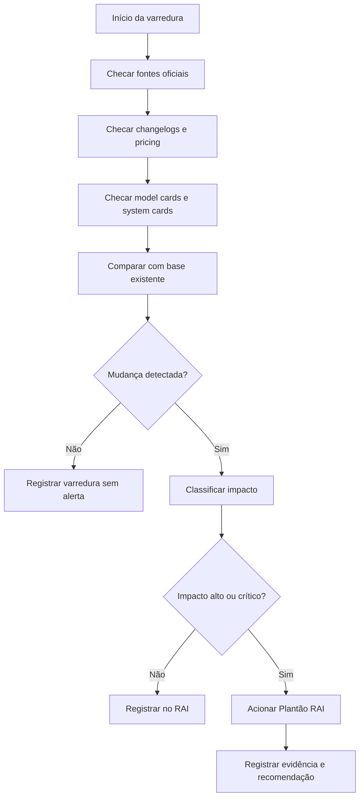
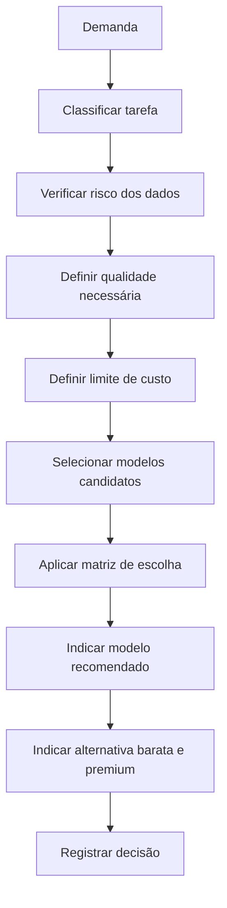
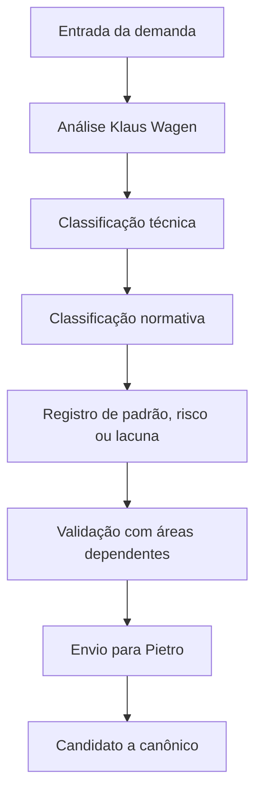
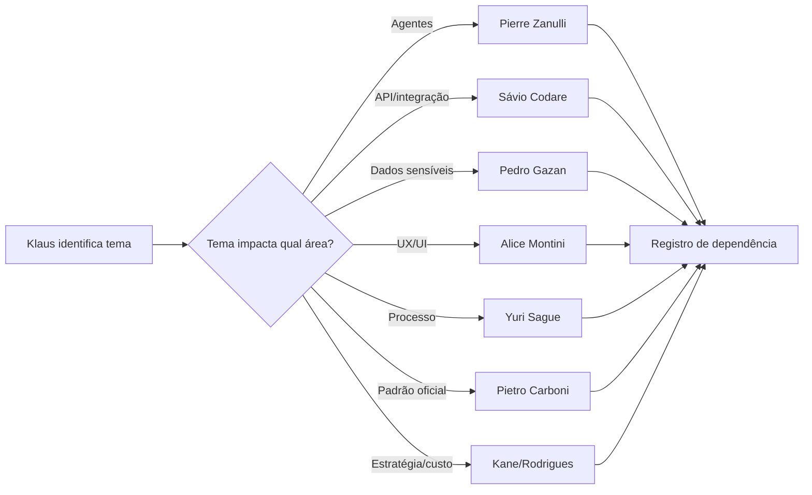
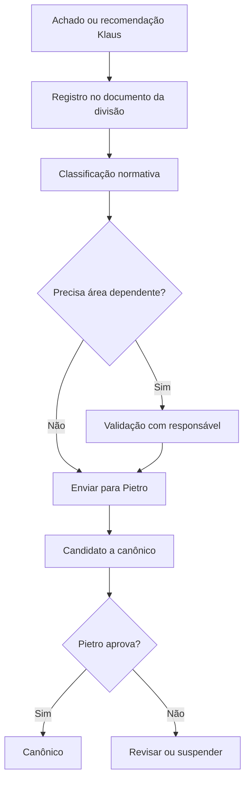
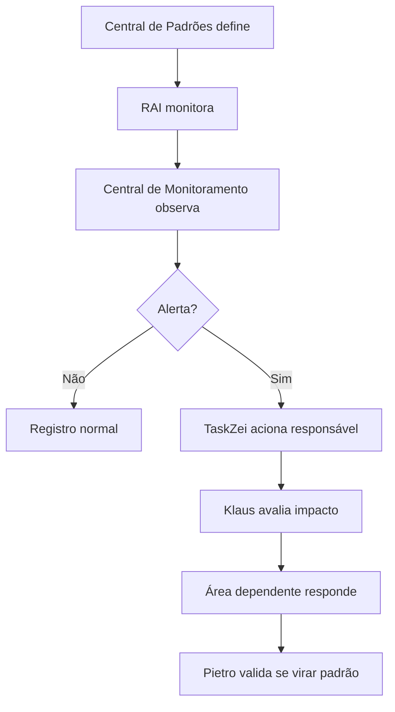

# Documento Mestre de Padrões — Modelos de IA, RAI e Radar Tecnológico — v1 — 06-06-2026

## Cabeçalho interno

| Campo | Informação |
|---|---|
| Documento | Documento Mestre de Padrões da Divisão |
| Divisão | Modelos de IA, RAI e Radar Tecnológico |
| Responsável | Klaus Wagen |
| Versão | v1 |
| Data da versão | 06-06-2026 |
| Status | candidato a documento-mãe da divisão |
| Formato | Markdown .md |
| Destino | Central de Padrões do SagB |
| Responsável pela validação final | Pietro Carboni |

---

## 1. Objetivo do documento

Este documento reúne, organiza e detalha os padrões reais da divisão **Modelos de IA, RAI e Radar Tecnológico**, sob responsabilidade de **Klaus Wagen**, dentro da Central de Padrões do GrupoB / Loze no SagB.

A divisão existe para transformar o movimento mundial da inteligência artificial em:

- curadoria técnica;
- análise de fornecedores;
- recomendação de modelos;
- avaliação de custo;
- monitoramento de APIs;
- acompanhamento de mudanças de mercado;
- registro de riscos;
- alertas estratégicos;
- padrões de escolha de IA;
- base para decisões do GrupoB, Loze e SagB.

Este documento não ensina apenas como documentar. Ele responde:

> Quais são os padrões, regras, políticas, processos, protocolos, checklists, matrizes, registros, riscos, lacunas e dependências da divisão de Modelos de IA, RAI e Radar Tecnológico?

---

## 2. Escopo da divisão

## 2.1. Dentro do escopo

A divisão de Klaus Wagen cobre:

- modelos de IA;
- LLMs;
- modelos multimodais;
- modelos de imagem;
- modelos de voz;
- modelos de áudio;
- modelos de vídeo;
- modelos de código;
- modelos de raciocínio;
- modelos para agentes;
- APIs de IA;
- custo por token;
- custo por imagem;
- custo por segundo de vídeo;
- custo por minuto de voz;
- fornecedores de IA;
- OpenAI, Anthropic, Google, DeepSeek, Qwen, Mistral, Meta, xAI e outros;
- famílias de modelos;
- modelos específicos;
- documentação oficial;
- model cards;
- system cards;
- pricing pages;
- changelogs;
- safety reports;
- benchmarks;
- testes internos;
- RAI — Radar de Inteligências Artificiais;
- Plantão RAI;
- alertas de mudança crítica;
- recomendação de modelo por tarefa;
- decisão entre modelo barato e modelo premium;
- riscos de fornecedor;
- retenção de dados;
- uso de dados para treinamento;
- descontinuação de modelos;
- mudança de comportamento de modelo;
- recomendações para Loze, SagB, AcadB, StartyB, 3forB e demais frentes.

---

## 2.2. Fora do escopo

A divisão de Klaus Wagen não define profundamente:

- arquitetura de agentes autônomos;
- autonomia A0–A6;
- memória aplicada de agentes;
- tool use operacional;
- orquestração multiagente;
- implementação técnica de APIs;
- deploy;
- infraestrutura;
- banco de dados do SagB;
- segurança digital operacional;
- credenciais;
- acessos;
- UX/UI;
- design system;
- metodologia educacional;
- naming de marcas;
- estratégia comercial final;
- aprovação normativa final.

Esses temas devem ser registrados como dependência quando aparecerem.

---

## 3. O que esta divisão define

A divisão define:

1. como classificar uma IA;
2. como separar fornecedor, família, modelo, produto, API, plataforma e ferramenta;
3. como avaliar fornecedores;
4. como avaliar modelos;
5. como comparar modelos;
6. como recomendar modelo por caso de uso;
7. como acompanhar custo por token/API;
8. como registrar mudanças de modelo;
9. como monitorar fontes oficiais;
10. como operar o RAI como radar de inteligência artificial;
11. como emitir alertas do Plantão RAI;
12. como registrar evidências de documentação oficial;
13. como identificar riscos de fornecedor;
14. como decidir testar, aprovar, monitorar ou rejeitar uma IA;
15. como comunicar áreas dependentes quando uma mudança afetar agentes, APIs, dados, UX ou estratégia.

---

## 4. O que esta divisão não define

A divisão não define:

| Tema | Responsável principal |
|---|---|
| Agentes autônomos, memória, tool use e orquestração | Pierre Zanulli |
| Sistemas, APIs, módulos, deploy e integrações | Sávio Codare |
| Segurança digital, acessos, credenciais e dados sensíveis | Pedro Gazan |
| UX/UI, interface, experiência e design system | Alice Montini |
| Classificação normativa final e canonicidade | Pietro Carboni |
| Processos sistêmicos e rotinas organizacionais | Yuri Sague |
| Decisão estratégica final de custo, fornecedor e prioridade | Kane/Rodrigues |

---

## 5. Fontes analisadas

Foram consideradas as seguintes fontes internas:

1. Conversas deste chat sobre Klaus Wagen.
2. Conversas sobre RAI — Radar de Inteligências Artificiais.
3. Documento de estrutura do bloco da Missão 1.
4. Documento de auditoria e revisão do bloco da Missão 2.
5. Discussões sobre tokens, custo, DeepSeek, OpenAI Codex e GPT-5.3-Codex.
6. Discussões sobre OpenAI, Google, Anthropic, DeepSeek, Qwen, Mistral, xAI e outros fornecedores.
7. Discussões sobre vídeo, voz, imagem, agentes e frameworks de IA.
8. Discussões sobre Observatório Global de IA no SagB.
9. Discussões sobre Plantão RAI.
10. Discussões sobre dados reais, dados simulados e dados mockados.
11. Discussões sobre model cards, system cards, benchmarks, pricing e documentação oficial.
12. Diretrizes normativas de Pietro Carboni para a Central de Padrões.
13. Novas frentes já definidas: Biblioteca de Módulos Base, Central de Monitoramento, TaskZei, Sala Dev e Central de Padrões.

---

## 6. Síntese executiva


### 6.1. Color code oficial

| Cor | Significado |
|---|---|
| 🟢 | bom / aprovado / suficiente |
| 🟡 | atenção / parcial / precisa ajuste |
| 🔴 | crítico / ausente / risco alto |
| 🔵 | oportunidade estratégica |
| 🟣 | governança / padrão / decisão estrutural |
| ⚫ | contexto neutro |

### 6.2. Classificação normativa obrigatória

| Ícone | Tipo | Função |
|---|---|---|
| 🔵 | princípio | Orienta decisões |
| 🟣 | política | Posiciona a área institucionalmente |
| 🔴 | regra | Limita ou obriga |
| 🟠 | padrão | Organiza forma recorrente |
| 🟢 | protocolo | Conduz situação específica com sequência obrigatória |
| ⚙️ | processo | Conecta etapas recorrentes |
| 🧩 | procedimento | Executa passo específico |
| ✅ | checklist | Confere itens obrigatórios |
| 📊 | matriz | Ajuda decisão comparativa |
| 🧾 | registro/evidência | Prova, histórico ou log |
| ⚠️ | risco | Ponto de atenção |
| 💡 | recomendação | Sugestão de ação |
| 📌 | decisão | Decisão já tomada |
| ❓ | dúvida/lacuna | Pendente de definição |
| 🚨 | crítico | Exige atenção prioritária |

🟢 A divisão já possui base forte para avançar como documento-mãe.

Os principais pontos definidos são:

- Klaus Wagen é o responsável pela frente de Modelos de IA, RAI e Radar Tecnológico.
- O RAI deve funcionar como radar vivo de inteligências artificiais.
- O Plantão RAI deve alertar Rodrigues e áreas responsáveis quando houver mudança crítica.
- A escolha de modelos deve considerar custo, qualidade, velocidade, risco, privacidade, documentação e caso de uso.
- Fornecedor, família, modelo, produto, API e ferramenta precisam ser separados.
- Dados simulados não podem ser tratados como dados reais.
- Mudanças de API, preço, termos, retenção, licença, comportamento ou disponibilidade precisam ser registradas.
- OpenAI, Anthropic, Google, DeepSeek, Qwen, Mistral, Meta, xAI e outros fornecedores devem ser monitorados.
- Modelos baratos devem ser usados para volume; modelos premium devem ser usados para decisão crítica, código complexo e validação final.

🟡 Ainda precisa validação:

- política oficial de uso de IA externa;
- critérios finais de uso de dados sensíveis;
- quem recebe alertas do Plantão RAI;
- onde o RAI será operado tecnicamente;
- quais modelos já estão em uso real no GrupoB;
- quais custos mensais são aceitáveis por frente;
- quais modelos entram como aprovados, monitorados ou rejeitados.

---

## 7. Mapa visual da divisão

```mermaid
flowchart TB
    A[Klaus Wagen] --> B[Modelos de IA]
    A --> C[Fornecedores de IA]
    A --> D[RAI]
    A --> E[Custos e APIs]
    A --> F[Documentações oficiais]
    A --> G[Testes e benchmarks]
    A --> H[Recomendações de uso]
    A --> I[Alertas e Plantão RAI]

    B --> B1[Famílias de modelos]
    B --> B2[Modelos específicos]
    B --> B3[Modelos por modalidade]
    B --> B4[Modelos por tarefa]

    C --> C1[Risco de fornecedor]
    C --> C2[Termos de uso]
    C --> C3[Retenção de dados]
    C --> C4[Uso para treinamento]

    D --> D1[Varredura diária]
    D --> D2[Registro de novidades]
    D --> D3[Classificação de impacto]
    D --> D4[Comunicação de alerta]

    E --> E1[Token]
    E --> E2[Imagem]
    E --> E3[Vídeo]
    E --> E4[Voz]
    E --> E5[API]
```



---

## 8. Princípios da área

## 🔵 PR-IA-01 — Princípio da classificação correta

Nenhuma tecnologia deve ser chamada genericamente de “IA” sem classificação técnica.

Deve-se diferenciar:

- fornecedor;
- laboratório;
- família de modelos;
- modelo específico;
- produto;
- API;
- SDK;
- plataforma;
- framework;
- ferramenta com IA embutida;
- interface sobre modelos de terceiros.

---

## 🔵 PR-IA-02 — Princípio da fonte oficial primeiro

Toda decisão relevante sobre modelo, preço, API, licença, retenção, uso de dados, descontinuação ou benchmark deve priorizar fonte oficial.

Fontes oficiais preferenciais:

- documentação oficial;
- API docs;
- pricing page;
- changelog;
- model card;
- system card;
- safety report;
- GitHub oficial;
- paper oficial;
- termos de uso;
- política de privacidade.

---

## 🔵 PR-IA-03 — Princípio da recomendação por caso de uso

Nenhum modelo deve ser recomendado como “o melhor” de forma absoluta.

Todo modelo deve ser recomendado considerando:

- tarefa;
- custo;
- risco;
- qualidade;
- velocidade;
- integração;
- privacidade;
- contexto;
- confiabilidade;
- disponibilidade.

---

## 🔵 PR-IA-04 — Princípio do modelo barato para volume e premium para decisão

Modelos baratos devem ser usados para:

- volume;
- leitura;
- triagem;
- rascunhos;
- varreduras;
- organização inicial;
- tarefas de baixo risco.

Modelos premium devem ser usados para:

- decisão estratégica;
- código crítico;
- arquitetura;
- revisão final;
- análise complexa;
- respostas para cliente relevante;
- validação de qualidade;
- situações em que erro custa caro.

---

## 🔵 PR-IA-05 — Princípio do radar vivo

O RAI não deve ser uma lista parada.

O RAI deve:

- monitorar;
- comparar;
- atualizar;
- registrar;
- alertar;
- recomendar;
- acionar responsáveis;
- manter histórico.

---

## 🔵 PR-IA-06 — Princípio da evidência antes do alerta

Nenhum alerta crítico deve ser emitido sem evidência mínima.

A evidência pode ser:

- documentação oficial;
- changelog;
- pricing page;
- API docs;
- print validado;
- CSV de uso;
- registro interno;
- fonte secundária marcada como não confirmada.

---

## 🔵 PR-IA-07 — Princípio da separação entre dado real e dado simulado

Todo painel, relatório ou análise deve indicar se o dado é:

- real;
- simulado;
- mockado;
- estimado;
- oficial;
- secundário;
- pendente de validação.

---

## 9. Políticas da área

## 🟣 POL-IA-01 — Política de monitoramento contínuo de fornecedores

O RAI deve manter monitoramento contínuo dos principais fornecedores de IA relevantes para GrupoB, Loze e SagB.

Fornecedores prioritários iniciais:

- OpenAI;
- Anthropic;
- Google / DeepMind;
- Microsoft;
- Meta;
- xAI;
- DeepSeek;
- Alibaba / Qwen;
- Mistral;
- Amazon;
- Cohere;
- AI21;
- ElevenLabs;
- Runway;
- Pika;
- Kling;
- Luma;
- fornecedores de voz, vídeo, imagem, agentes e frameworks relevantes.

Status: candidato a canônico.  
Validação: Pietro Carboni.

---

## 🟣 POL-IA-02 — Política de análise de custo por modelo

Todo modelo em uso recorrente deve ter custo registrado.

O custo deve ser classificado por unidade:

- input token;
- cached input token;
- output token;
- imagem;
- segundo de vídeo;
- minuto de áudio;
- caractere;
- crédito;
- request;
- plano mensal;
- enterprise.

Status: candidato a canônico.  
Validação: Pietro Carboni e Kane/Rodrigues quando envolver custo estratégico.

---

## 🟣 POL-IA-03 — Política de análise de retenção e treinamento de dados

Todo fornecedor externo deve ser avaliado quanto a:

- retenção de dados;
- uso dos dados para treinamento;
- política de privacidade;
- opt-out;
- DPA;
- termos de API;
- política enterprise;
- região de processamento, quando disponível.

Validação obrigatória com Pedro Gazan quando houver dados sensíveis.

---

## 🟣 POL-IA-04 — Política de revisão humana em mudanças críticas

Mudanças críticas não devem virar padrão ou recomendação oficial sem revisão humana.

Mudanças críticas incluem:

- mudança de preço;
- mudança de API;
- descontinuação;
- mudança de política de dados;
- alteração de licença;
- risco de segurança;
- mudança relevante de comportamento;
- nova limitação de uso;
- lançamento disruptivo.

---

## 🟣 POL-IA-05 — Política de recomendação por status

Todo item avaliado pelo RAI deve receber status:

- rascunho;
- em revisão;
- candidato a canônico;
- aprovado;
- legado;
- substituído;
- suspenso;
- precisa validação.

---

## 10. Regras centrais da área

## 🔴 REG-IA-01 — Todo modelo precisa estar vinculado a um fornecedor

Não pode existir modelo sem fornecedor identificado.

Campos mínimos:

- nome do modelo;
- fornecedor;
- país;
- família;
- documentação;
- status.

---

## 🔴 REG-IA-02 — Toda recomendação de modelo precisa ter caso de uso

Exemplos de caso de uso:

- código;
- análise;
- pesquisa;
- atendimento;
- imagem;
- voz;
- vídeo;
- agente;
- automação;
- documentos;
- baixo custo;
- alta qualidade;
- privacidade.

---

## 🔴 REG-IA-03 — Mudança relevante precisa de registro

Toda mudança relevante deve gerar registro.

Mudanças relevantes:

- preço;
- API;
- termos;
- licença;
- retenção;
- treinamento;
- disponibilidade;
- limite de contexto;
- qualidade;
- comportamento;
- descontinuação.

---

## 🔴 REG-IA-04 — Fonte secundária não aprova decisão crítica

Notícias, posts, redes sociais e rumores podem iniciar investigação, mas não aprovam decisão crítica sozinhos.

---

## 🔴 REG-IA-05 — Dados sensíveis exigem validação com Pedro Gazan

Se houver dados internos, dados de cliente, documentos sensíveis, credenciais ou dados estratégicos, Pedro Gazan deve validar.

---

## 🔴 REG-IA-06 — Integração técnica exige Sávio Codare

Klaus avalia custo, modelo e fornecedor.  
Sávio define a integração técnica.

---

## 🔴 REG-IA-07 — Uso em agentes exige Pierre Zanulli

Klaus recomenda modelo para agente.  
Pierre define arquitetura, autonomia, memória, tool use e orquestração.

---

## 🔴 REG-IA-08 — Canonicidade exige Pietro Carboni

Nenhum item é canônico final sem validação de Pietro.

---

## 11. Padrões oficiais e candidatos a padrão

## 🟠 PAD-IA-01 — Padrão de ficha de fornecedor de IA

Campos obrigatórios:

- nome oficial;
- nome popular;
- país;
- site;
- docs;
- API;
- modelos;
- famílias;
- pricing;
- política de dados;
- retenção;
- uso para treinamento;
- riscos;
- status no RAI;
- recomendação.

---

## 🟠 PAD-IA-02 — Padrão de ficha de modelo de IA

Campos obrigatórios:

- nome;
- fornecedor;
- família;
- versão;
- modalidade;
- lançamento;
- última atualização;
- status;
- contexto;
- custo;
- velocidade;
- qualidade;
- riscos;
- uso recomendado;
- uso não recomendado;
- docs oficiais;
- benchmarks;
- validações.

---

## 🟠 PAD-IA-03 — Padrão empresa → família → modelo → documento

Hierarquia obrigatória:

```text
Fornecedor
└── Família de modelos
    └── Modelo específico
        ├── Versão
        ├── Documentação
        ├── Benchmark
        ├── Pricing
        ├── Registro de atualização
        └── Recomendação de uso
```

---

## 🟠 PAD-IA-04 — Padrão de status da informação

Todo dado deve ser marcado como:

- oficial;
- real interno;
- estimado;
- simulado;
- mockado;
- secundário;
- pendente de validação.

---

## 🟠 PAD-IA-05 — Padrão de cálculo de custo

Todo custo deve indicar:

- unidade;
- preço unitário;
- volume usado;
- período;
- fonte;
- modelo;
- fornecedor;
- câmbio, se aplicável;
- observação.

---

## 🟠 PAD-IA-06 — Padrão de recomendação Klaus

Toda recomendação de Klaus deve conter:

1. o que é;
2. fornecedor;
3. custo;
4. risco;
5. uso recomendado;
6. uso não recomendado;
7. alternativa mais barata;
8. alternativa premium;
9. dependências;
10. próxima ação.

---

## 12. Protocolos reais da área

## 🟢 PROT-IA-01 — Protocolo de alerta de mudança crítica em IA

Quando usar:

- mudança de preço;
- mudança de API;
- mudança de termos;
- mudança de retenção;
- descontinuação;
- mudança de comportamento;
- lançamento de modelo disruptivo.

Responsável inicial: Klaus Wagen.

Saída esperada:

- alerta registrado;
- evidência anexada;
- impacto classificado;
- responsáveis informados;
- recomendação emitida.

Passos:

1. Identificar mudança.
2. Registrar evidência.
3. Confirmar fonte.
4. Classificar impacto.
5. Identificar áreas afetadas.
6. Informar responsáveis.
7. Recomendar ação.
8. Registrar decisão.

---

## 🟢 PROT-IA-02 — Protocolo de avaliação de nova IA

Quando usar:

- novo modelo;
- novo fornecedor;
- nova API;
- nova ferramenta;
- nova plataforma relevante.

Passos:

1. Identificar fornecedor.
2. Classificar tecnologia.
3. Verificar documentação.
4. Verificar custo.
5. Verificar termos.
6. Verificar risco de dados.
7. Comparar alternativas.
8. Definir status: testar, aprovar, monitorar, rejeitar.
9. Registrar no RAI.
10. Acionar dependências.

---

## 🟢 PROT-IA-03 — Protocolo de modelo descontinuado

Quando usar:

- modelo será removido;
- modelo virou legado;
- API será desligada;
- fornecedor recomendou substituto.

Passos:

1. Confirmar descontinuação.
2. Registrar fonte.
3. Identificar usos atuais.
4. Avaliar impacto.
5. Sugerir substituto.
6. Acionar Sávio se houver integração.
7. Acionar Pierre se houver agente.
8. Registrar plano de transição.

---

## 🟢 PROT-IA-04 — Protocolo de mudança de comportamento de modelo

Quando usar:

- qualidade caiu;
- recusa aumentou;
- tom mudou;
- formato mudou;
- raciocínio piorou;
- velocidade mudou;
- agente começou a falhar.

Passos:

1. Registrar comportamento observado.
2. Identificar modelo e período.
3. Comparar comportamento anterior.
4. Rodar teste de regressão.
5. Verificar changelog.
6. Classificar impacto.
7. Recomendar manter, monitorar, trocar ou testar alternativa.
8. Registrar evidência.

---

## 🟢 PROT-IA-05 — Protocolo de Plantão RAI

Quando usar:

- alerta alto ou crítico;
- novidade de impacto estratégico;
- mudança que afeta Loze, SagB ou custo;
- risco de dados;
- mudança em fornecedor principal.

Passos:

1. Confirmar relevância.
2. Preparar resumo curto.
3. Indicar impacto.
4. Indicar risco.
5. Indicar oportunidade.
6. Sugerir próxima ação.
7. Informar Rodrigues/Kane ou responsável certo.
8. Registrar alerta.

---

## 13. Processos da área

## ⚙️ PROC-IA-01 — Processo diário do RAI



---

## ⚙️ PROC-IA-02 — Processo de escolha de modelo



---

## ⚙️ PROC-IA-03 — Processo de comparação de modelos

Etapas:

1. definir tarefa;
2. escolher modelos candidatos;
3. coletar preço;
4. coletar contexto;
5. coletar benchmarks;
6. avaliar privacidade;
7. avaliar integração;
8. avaliar risco;
9. gerar matriz;
10. registrar recomendação.

---

## ⚙️ PROC-IA-04 — Processo de atualização de custo

Etapas:

1. acessar pricing oficial;
2. registrar data;
3. registrar unidade;
4. registrar preço;
5. comparar com preço anterior;
6. classificar variação;
7. gerar alerta se necessário;
8. atualizar matriz de custo.

---

## 14. Procedimentos operacionais

## 🧩 PROCED-IA-01 — Como decidir modelo barato vs premium

Use modelo barato quando:

- volume é alto;
- risco é baixo;
- tarefa é simples;
- resposta aproximada basta;
- custo é prioridade;
- dado não é sensível.

Use modelo premium quando:

- erro custa caro;
- há decisão estratégica;
- código é crítico;
- raciocínio é complexo;
- resposta vai para cliente;
- análise precisa ser confiável;
- output final exige alta qualidade.

---

## 🧩 PROCED-IA-02 — Como registrar custo de API

1. Identificar fornecedor.
2. Identificar modelo.
3. Identificar tipo de cobrança.
4. Registrar preço oficial.
5. Registrar volume de uso.
6. Separar input, cached input e output quando houver.
7. Calcular custo.
8. Comparar com alternativa.
9. Registrar recomendação.

---

## 🧩 PROCED-IA-03 — Como avaliar retenção de dados

1. Abrir termos de uso.
2. Abrir política de privacidade.
3. Abrir documentação de API.
4. Procurar retenção.
5. Procurar uso para treinamento.
6. Procurar opt-out.
7. Procurar termos enterprise.
8. Registrar evidência.
9. Acionar Pedro se houver risco.

---

## 🧩 PROCED-IA-04 — Como definir se IA entra no RAI

A IA entra no RAI se cumprir ao menos um critério:

- possui modelo próprio relevante;
- tem API relevante;
- tem documentação oficial;
- tem impacto no GrupoB;
- reduz custo;
- aumenta qualidade;
- afeta fornecedores existentes;
- gera risco;
- gera oportunidade;
- representa tendência relevante.

---

## 15. Checklists obrigatórios

## ✅ CHECK-IA-01 — Avaliação de novo modelo

- [ ] Fornecedor identificado.
- [ ] País registrado.
- [ ] Família identificada.
- [ ] Modelo específico identificado.
- [ ] Documentação oficial localizada.
- [ ] API localizada.
- [ ] Pricing localizado.
- [ ] Modalidade identificada.
- [ ] Contexto identificado.
- [ ] Custo estimado.
- [ ] Retenção verificada.
- [ ] Uso para treinamento verificado.
- [ ] Risco de fornecedor avaliado.
- [ ] Caso de uso definido.
- [ ] Status no RAI definido.
- [ ] Dependências registradas.

---

## ✅ CHECK-IA-02 — Retenção e treinamento de dados

- [ ] Política de privacidade localizada.
- [ ] Termos de uso localizados.
- [ ] API terms localizados.
- [ ] Retenção informada.
- [ ] Uso para treinamento informado.
- [ ] Opt-out existe?
- [ ] Plano enterprise muda a regra?
- [ ] Dados sensíveis envolvidos?
- [ ] Pedro Gazan precisa validar?
- [ ] Evidência registrada.

---

## ✅ CHECK-IA-03 — Alerta RAI

- [ ] Mudança identificada.
- [ ] Fonte registrada.
- [ ] Fonte oficial?
- [ ] Impacto classificado.
- [ ] Áreas afetadas identificadas.
- [ ] Responsável informado.
- [ ] Recomendação emitida.
- [ ] Registro criado.
- [ ] Necessita validação humana?

---

## ✅ CHECK-IA-04 — Modelo para uso em agentes

- [ ] Modelo suporta instruções longas?
- [ ] Modelo tem tool use/function calling?
- [ ] Modelo mantém contexto?
- [ ] Modelo tem custo adequado?
- [ ] Modelo é estável?
- [ ] Modelo tem baixa alucinação?
- [ ] Modelo é adequado para tarefa?
- [ ] Pierre precisa validar?
- [ ] Sávio precisa validar integração?
- [ ] Pedro precisa validar dados?

---

## 16. Matrizes obrigatórias

## 📊 MAT-IA-01 — Matriz de escolha de modelo

| Critério | Peso | Nota 1 | Nota 5 |
|---|---:|---|---|
| Custo | 1–5 | caro/incerto | barato/previsível |
| Qualidade | 1–5 | fraca | excelente |
| Velocidade | 1–5 | lenta | rápida |
| Raciocínio | 1–5 | fraco | forte |
| Privacidade | 1–5 | risco alto | adequado |
| Integração | 1–5 | difícil | fácil |
| Documentação | 1–5 | fraca | excelente |
| Estabilidade | 1–5 | instável | estável |
| Risco de fornecedor | 1–5 | alto | baixo |
| Relevância Loze/SagB | 1–5 | baixa | estratégica |

---

## 📊 MAT-IA-02 — Matriz modelo barato vs premium

| Situação | Modelo barato | Modelo premium |
|---|---|---|
| Triagem | recomendado | desnecessário |
| Rascunho | recomendado | opcional |
| Código crítico | não recomendado | recomendado |
| Decisão estratégica | não recomendado | recomendado |
| Alto volume | recomendado | caro |
| Resposta final a cliente | opcional | recomendado |
| Dados sensíveis | depende | depende de validação |
| Agente autônomo | depende | depende de custo e estabilidade |

---

## 📊 MAT-IA-03 — Matriz testar, aprovar, monitorar ou rejeitar

| Situação | Status sugerido |
|---|---|
| Tem docs, API, custo e caso de uso | testar |
| Foi testada e tem risco aceitável | aprovar |
| Promissora, mas imatura | monitorar |
| Sem docs oficiais | monitorar ou rejeitar |
| Sem fornecedor claro | rejeitar |
| Alto risco de dados | rejeitar ou validar com Pedro |
| Boa, mas cara | uso restrito |
| Descontinuada | legado/substituído |

---

## 17. Registros e evidências obrigatórias

## 🧾 REG-IA-01 — Registro de atualização de modelo

Campos:

- modelo;
- fornecedor;
- família;
- data;
- fonte;
- tipo de mudança;
- impacto;
- áreas afetadas;
- recomendação;
- responsável informado;
- status;
- decisão.

---

## 🧾 REG-IA-02 — Registro de custo por modelo

Campos:

- fornecedor;
- modelo;
- período;
- tokens input;
- tokens cached input;
- tokens output;
- preço por unidade;
- custo total;
- fonte;
- comparação;
- recomendação.

---

## 🧾 REG-IA-03 — Registro de avaliação de fornecedor

Campos:

- fornecedor;
- país;
- site;
- docs;
- modelos;
- API;
- pricing;
- termos;
- retenção;
- uso para treinamento;
- riscos;
- status;
- recomendação.

---

## 🧾 REG-IA-04 — Registro de documentação oficial

Campos:

- fornecedor;
- modelo;
- documento;
- tipo;
- link;
- data;
- cobre benchmark?
- cobre segurança?
- cobre pricing?
- cobre API?
- qualidade da documentação;
- observações.

---

## 18. Fluxos Mermaid da divisão

## 18.1. Fluxo geral da divisão



---

## 18.2. Fluxo de handoff com outras áreas



---

## 18.3. Fluxo de aprovação do padrão



---

## 18.4. Fluxo de monitoramento



---

## 19. Dependências com outras áreas

| Tema | Depende de quem | Motivo | Tipo de dependência | Arquivo/registro sugerido |
|---|---|---|---|---|
| Modelo para agente | Pierre Zanulli | Agente, autonomia, memória e tool use são dele | Técnica/conceitual | `dependencias_com_pierre_zanulli.md` |
| API de modelo | Sávio Codare | Integração, deploy e módulos são dele | Técnica | `dependencias_com_savio_codare.md` |
| Retenção de dados | Pedro Gazan | Segurança e dados sensíveis são dele | Segurança | `dependencias_com_pedro_gazan.md` |
| IA na interface | Alice Montini | UX/UI e experiência são dela | Interface | `dependencias_com_alice_montini.md` |
| Processo recorrente do RAI | Yuri Sague | Organização sistêmica e rotina operacional | Processo | `dependencias_com_yuri_sague.md` |
| Aprovação normativa | Pietro Carboni | Canonicidade e classificação oficial | Governança | `dependencias_com_pietro_carboni.md` |
| Custo estratégico | Kane/Rodrigues | Decisão executiva e orçamento | Estratégica | `dependencias_com_kane_rodrigues.md` |

---

## 20. Conflitos de escopo

## 20.1. Modelo de IA x agente de IA

Klaus define modelo.  
Pierre define agente.

## 20.2. API avaliada x API implementada

Klaus avalia API, custo e documentação.  
Sávio implementa.

## 20.3. Retenção analisada x segurança validada

Klaus coleta informação.  
Pedro valida risco.

## 20.4. Recomendação técnica x padrão oficial

Klaus recomenda.  
Pietro aprova.

## 20.5. IA para interface x UX/UI

Klaus avalia capacidade.  
Alice define experiência.

---

## 21. Riscos se os padrões não forem seguidos

| Risco | Causa provável | Impacto | Como prevenir | Quem acompanha |
|---|---|---|---|---|
| Escolher modelo caro demais | Falta de matriz de custo | Aumento de gasto | Registrar custo e comparar alternativas | Klaus/Kane |
| Usar IA com dados sensíveis | Falta de análise de retenção | Risco de privacidade | Checklist de dados + Pedro | Klaus/Pedro |
| Confundir produto com modelo | Classificação fraca | Decisão errada | Glossário e ficha técnica | Klaus/Pietro |
| Modelo mudar comportamento | Falta de regressão | Quebra de agente/processo | Registro e checklist de regressão | Klaus/Pierre |
| API mudar sem aviso interno | Falta de monitoramento | Integração quebra | Plantão RAI + Sávio | Klaus/Sávio |
| Dado mockado parecer real | Falta de status da informação | Perda de confiança | Padrão real/simulado | Klaus/Pietro |
| Hype virar prioridade | Falta de matriz de risco | Perda de foco | Matriz de hype | Klaus/Rodrigues |

---

## 22. O que deve ser monitorado pela Central de Monitoramento

| Item a monitorar | Por que monitorar | Origem do dado | Responsável | Ação se der alerta |
|---|---|---|---|---|
| Custo por modelo | Evitar gasto invisível | API/pricing/CSV | Klaus | Revisar modelo e recomendar alternativa |
| Mudança de preço | Impacta orçamento | Pricing oficial | Klaus | Plantão RAI |
| Mudança de API | Pode quebrar integração | Docs/changelog | Klaus/Sávio | Acionar Sávio |
| Modelo descontinuado | Exige migração | Changelog/docs | Klaus/Sávio | Plano de substituição |
| Retenção de dados | Risco de segurança | Termos/política | Klaus/Pedro | Acionar Pedro |
| Uso de dados para treinamento | Risco jurídico/estratégico | Termos/API | Klaus/Pedro | Validar uso |
| Mudança de comportamento | Afeta qualidade | Testes internos | Klaus/Pierre | Rodar regressão |
| Novos modelos | Oportunidade técnica | Docs/blogs | Klaus | Avaliar entrada no RAI |
| Benchmarks relevantes | Atualiza comparação | Papers/docs | Klaus | Revisar matriz |
| Alertas críticos | Evitar atraso | RAI | Klaus | Informar responsáveis |

---

## 23. Relação com Biblioteca de Módulos Base, se aplicável

A divisão tem relação indireta com a Biblioteca de Módulos Base quando as decisões de IA afetarem módulos reutilizáveis.

Exemplos:

- módulo de seleção de modelo;
- módulo de cálculo de custo;
- módulo de roteamento entre modelo barato e premium;
- módulo de registro de uso por token;
- módulo de alerta de fornecedor;
- módulo de ranking de modelos;
- módulo de painel RAI;
- módulo de documentação oficial;
- módulo de comparação de fornecedores.

Klaus não implementa os módulos.  
Klaus define requisitos de inteligência e decisão.  
Sávio e Sala Dev implementam quando aprovado.

---

## 24. Relação com TaskZei e Sala Dev, se aplicável

## TaskZei

TaskZei deve ser acionado quando:

- houver mudança crítica de API;
- houver modelo descontinuado;
- houver necessidade de teste técnico;
- houver revisão de custo;
- houver troca de fornecedor;
- houver risco de dados;
- houver implementação de painel RAI.

## Sala Dev

Sala Dev entra quando:

- houver integração com API;
- houver módulo novo;
- houver ajuste técnico;
- houver automação;
- houver dashboard;
- houver monitoramento real.

---

## 25. Lacunas e validações pendentes

| Lacuna | Impacto | Quem valida | Prioridade | Recomendação |
|---|---|---|---|---|
| Onde o RAI será executado tecnicamente | Pode virar só documento | Sávio/Yuri | V1 | Definir módulo, banco ou pasta operacional |
| Quem recebe Plantão RAI | Pode gerar ruído | Kane/Rodrigues/Pietro | V1 | Definir níveis e destinatários |
| Lista de modelos já em uso | Sem isso não há governança real | Klaus/Sávio | V1 | Levantamento inicial obrigatório |
| Política de IA externa | Risco de dados | Pedro/Pietro | crítico | Criar política |
| Testes internos padronizados | Falta comparação real | Klaus/Pietro | V2 | Criar benchmark interno GrupoB |
| Teto de custo por frente | Risco financeiro | Kane/Rodrigues | importante | Definir limites |
| Autonomia do RAI | Pode alertar demais/de menos | Pietro/Rodrigues | importante | Definir níveis de autonomia |

---

## 26. Decisões já tomadas

| Decisão | Status | Observação |
|---|---|---|
| Klaus Wagen é responsável por Modelos de IA, RAI e Radar Tecnológico | definido | Base da divisão |
| Klaus cuida de token, custo, API e fornecedores | definido | Confirmado em conversa |
| RAI deve funcionar como radar vivo | definido | Precisa operacionalização |
| Plantão RAI deve existir para alertas importantes | prática definida | Precisa validar destinatários |
| Tarefa/chat não representa pessoa na Máquina de Agentes | decisão de outra frente | Relevante apenas indiretamente |
| Dados do HTML do observatório eram mockados | definido | Exige padrão de status da informação |
| DeepSeek serve para volume e GPT/Codex premium para tarefas críticas | recomendação definida | Deve virar matriz/padrão |
| Modelo barato vs premium precisa de regra | definido | Deve virar matriz |

---

## 27. Documentos derivados que precisam nascer

1. `manual_do_rai.md`
2. `catalogo_oficial_de_fornecedores_de_ia.md`
3. `catalogo_oficial_de_modelos_de_ia.md`
4. `guia_de_escolha_de_modelos_de_ia.md`
5. `guia_de_custo_por_modelo.md`
6. `politica_de_uso_de_ia_externa.md`
7. `lista_de_modelos_recomendados_por_caso_de_uso.md`
8. `boletim_rai_modelo_padrao.md`
9. `relatorio_mensal_de_inteligencia_artificial.md`
10. `indice_de_risco_de_hype_em_ia.md`
11. `padrao_de_status_da_informacao_no_rai.md`
12. `protocolo_de_alerta_de_mudanca_critica_em_ia.md`
13. `matriz_modelo_barato_vs_modelo_premium.md`
14. `checklist_de_retencao_e_treinamento_de_dados.md`

---

## 28. Padrões atômicos sugeridos para o módulo SagB

| Código sugerido | Nome do padrão | Tipo | Resumo | Documento de origem | Status sugerido |
|---|---|---|---|---|---|
| IA-001 | Classificação técnica de IA | 🟠 padrão | Separar fornecedor, família, modelo, API e produto | Este documento | candidato a canônico |
| IA-002 | Fonte oficial primeiro | 🔴 regra | Priorizar docs oficiais para decisão crítica | Este documento | candidato a canônico |
| IA-003 | Ficha de fornecedor | 🟠 padrão | Cadastro mínimo de fornecedor de IA | Este documento | candidato a canônico |
| IA-004 | Ficha de modelo | 🟠 padrão | Cadastro mínimo de modelo de IA | Este documento | candidato a canônico |
| IA-005 | Matriz de escolha de modelo | 📊 matriz | Comparar custo, qualidade, risco e uso | Este documento | candidato a canônico |
| IA-006 | Cálculo de custo por modelo | 🟠 padrão | Registrar custo por token/imagem/vídeo/voz | Este documento | candidato a canônico |
| IA-007 | Status da informação | 🟠 padrão | Diferenciar real, mockado, estimado e validado | Este documento | candidato a canônico |
| IA-008 | Alerta crítico de IA | 🟢 protocolo | Reagir a mudança crítica | Este documento | candidato a canônico |
| IA-009 | Modelo barato vs premium | 📊 matriz | Decidir uso por risco/custo | Este documento | candidato a canônico |
| IA-010 | Registro de atualização de modelo | 🧾 registro | Guardar histórico de mudanças | Este documento | candidato a canônico |

---

## 29. Ordem recomendada de canonização

## Primeiro

1. `glossario_modelos_ia_rai.md`
2. `regra_de_fonte_oficial_primeiro.md`
3. `padrao_de_status_da_informacao_no_rai.md`
4. `ficha_padrao_de_fornecedor.md`
5. `ficha_padrao_de_modelo_de_ia.md`
6. `checklist_de_avaliacao_de_novo_modelo_de_ia.md`
7. `matriz_de_escolha_de_modelo_de_ia.md`
8. `registro_de_atualizacao_de_modelo.md`

## Depois

9. `manual_do_rai.md`
10. `plantao_rai.md`
11. `protocolo_de_alerta_de_mudanca_critica_em_ia.md`
12. `matriz_modelo_barato_vs_modelo_premium.md`
13. `checklist_de_retencao_e_treinamento_de_dados.md`
14. `guia_de_custo_por_modelo.md`

## Por último

15. `relatorio_mensal_de_inteligencia_artificial.md`
16. `indice_de_risco_de_hype_em_ia.md`
17. `mapa_global_de_fornecedores_de_ia.md`
18. `painel_de_benchmarks_de_modelos.md`

---

## 30. Síntese final

Minha leitura final é que esta divisão possui padrões suficientes para avançar como documento-mãe da área dentro da Central de Padrões, mas a canonicidade final depende de validação do Pietro Carboni.

A divisão de **Modelos de IA, RAI e Radar Tecnológico** já possui base sólida em:

- classificação de IA;
- fornecedores;
- modelos;
- custos;
- tokens;
- APIs;
- RAI;
- Plantão RAI;
- documentação oficial;
- benchmarks;
- riscos;
- recomendações por caso de uso;
- dependências com outras áreas.

As maiores lacunas ainda são:

- política oficial de uso de IA externa;
- definição operacional do RAI;
- lista real de modelos em uso;
- validação de retenção de dados;
- testes internos padronizados;
- teto de custo por frente;
- regra oficial de alertas para Rodrigues e Kane.

---

## Inventário normativo da divisão

| Código | Item | Tipo normativo | Status | Prioridade | Responsável | Validação necessária |
|---|---|---|---|---|---|---|
| PR-IA-01 | Classificação correta | 🔵 princípio | candidato a canônico | V1 | Klaus | Pietro |
| PR-IA-02 | Fonte oficial primeiro | 🔵 princípio | candidato a canônico | V1 | Klaus | Pietro |
| POL-IA-01 | Monitoramento contínuo de fornecedores | 🟣 política | em revisão | V1 | Klaus | Pietro |
| POL-IA-02 | Custo por modelo | 🟣 política | candidato a canônico | V1 | Klaus | Kane/Rodrigues |
| POL-IA-03 | Retenção e treinamento de dados | 🟣 política | precisa validação | crítico | Klaus | Pedro/Pietro |
| REG-IA-01 | Modelo vinculado a fornecedor | 🔴 regra | candidato a canônico | V1 | Klaus | Pietro |
| REG-IA-04 | Fonte secundária não aprova decisão crítica | 🔴 regra | candidato a canônico | V1 | Klaus | Pietro |
| PAD-IA-01 | Ficha de fornecedor | 🟠 padrão | rascunho | V1 | Klaus | Pietro |
| PAD-IA-02 | Ficha de modelo | 🟠 padrão | rascunho | V1 | Klaus | Pietro |
| PROT-IA-01 | Alerta de mudança crítica | 🟢 protocolo | rascunho | crítico | Klaus | Pietro |
| PROC-IA-01 | Processo diário do RAI | ⚙️ processo | rascunho | V1 | Klaus | Yuri/Sávio |
| CHECK-IA-01 | Checklist novo modelo | ✅ checklist | candidato a canônico | V1 | Klaus | Pietro |
| MAT-IA-01 | Matriz de escolha | 📊 matriz | candidato a canônico | V1 | Klaus | Pietro |
| REGISTRO-IA-01 | Registro de atualização | 🧾 registro | rascunho | V1 | Klaus | Pietro |

---

## Próximas 10 ações recomendadas

1. Criar o `glossario_modelos_ia_rai.md`.
2. Criar a ficha padrão de fornecedor de IA.
3. Criar a ficha padrão de modelo de IA.
4. Criar o checklist de avaliação de novo modelo.
5. Criar a matriz de escolha de modelo.
6. Criar o padrão de status da informação no RAI.
7. Criar o registro de atualização de modelo.
8. Criar o protocolo de alerta de mudança crítica.
9. Criar o manual operacional do RAI.
10. Validar política de IA externa com Pedro Gazan e Pietro Carboni.

---

## Padrões que devem ser extraídos primeiro para o módulo SagB

1. Classificação técnica de IA.
2. Fonte oficial primeiro.
3. Ficha de fornecedor.
4. Ficha de modelo.
5. Matriz de escolha de modelo.
6. Padrão de custo por modelo.
7. Status da informação.
8. Registro de atualização de modelo.
9. Alerta crítico de IA.
10. Modelo barato vs modelo premium.

---

---

## Confirmação final

Documento criado em Markdown .md.

Nome do arquivo:
documento-mestre-padroes-modelos-ia-rai-radar-tecnologico-v1-06-06-2026.md

Formato:
Markdown .md

Status:
Pronto para baixar e inserir na Central de Padrões do SagB.
