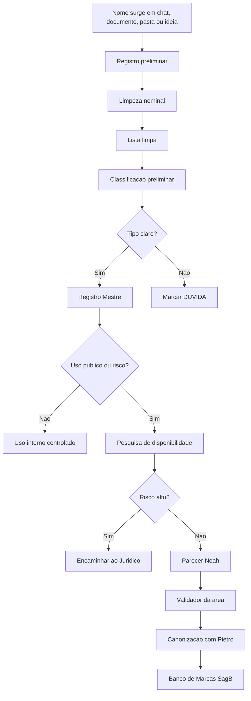
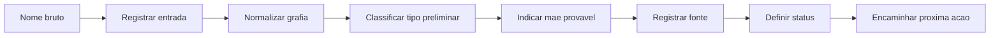
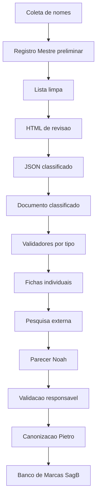
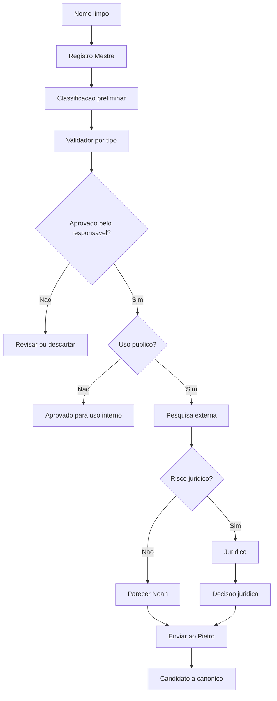
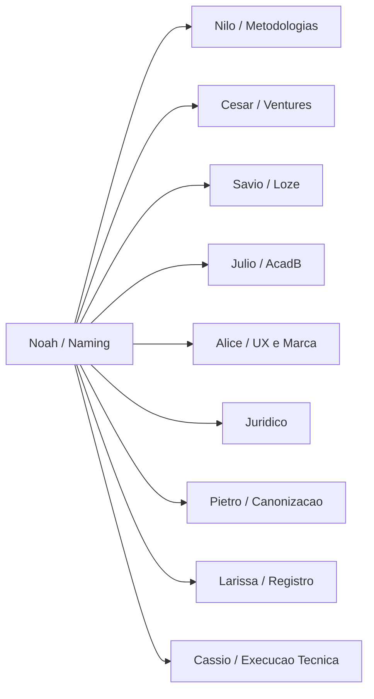
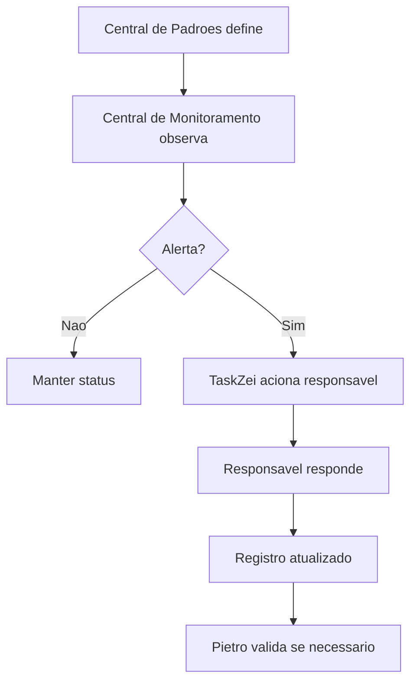
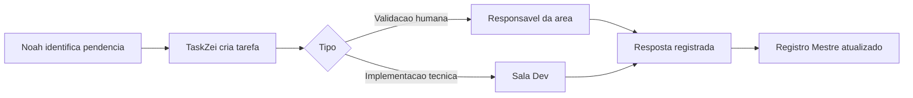

# Documento Mestre de Padrões — Naming, Disponibilidade e Banco de Marcas — v1 — 06-06-2026

## Cabeçalho interno

| Campo | Informação |
|---|---|
| Documento | Documento Mestre de Padrões da Divisão |
| Divisão | Naming, Disponibilidade e Banco de Marcas |
| Responsável | Noah Verdili |
| Versão | v1 |
| Data da versão | 06-06-2026 |
| Status | candidato a documento-mãe da divisão |
| Formato | Markdown .md |
| Destino | Central de Padrões do SagB |
| Responsável pela validação final | Pietro Carboni |

---

## 1. Objetivo do documento

Este documento reúne, organiza e detalha os padrões reais da divisão de **Naming, Disponibilidade e Banco de Marcas** do GrupoB, dentro da Central de Padrões do SagB.

A divisão existe para garantir que nomes, marcas, empresas, ventures, produtos digitais, apps, sistemas, metodologias, programas, frameworks, conceitos, treinamentos, cursos, mentorias, eventos, clientes e pastas operacionais sejam tratados de forma organizada, rastreável, validável e segura.

Este documento deve responder:

- quais padrões de naming já existem;
- quais decisões já foram tomadas pelo Rodrigues;
- quais nomes foram saneados;
- quais nomes foram excluídos;
- quais regras de grafia já foram definidas;
- como um nome novo deve entrar no banco;
- como um nome deve ser classificado;
- como avaliar disponibilidade preliminar;
- como registrar evidências;
- como tratar conflitos;
- como encaminhar nomes para validadores;
- como estruturar o Banco de Marcas no SagB;
- o que deve ser monitorado;
- quais documentos derivados precisam nascer;
- quais lacunas ainda dependem do Pietro Carboni ou de outros responsáveis.

O objetivo central da divisão é transformar a “ruma de nomes” do GrupoB em um sistema vivo de curadoria, governança e decisão.

> **Síntese da divisão:** nome sem tipo, mãe, status e evidência não é ativo organizado; é apenas ruído.

---

## 2. Escopo da divisão

A divisão de Naming cobre todo o ciclo de vida nominal do GrupoB: nascimento, registro, limpeza, classificação, pesquisa, validação, decisão, uso, legado e eventual descarte.

### 2.1. Itens dentro do escopo

| Item | Entra no escopo? | Tratamento |
|---|---:|---|
| Empresas B | Sim | Nome, status, guarda-chuva e relação institucional |
| Ventures | Sim | Nome, categoria, relação com StartyB/César/Rodrigues |
| Marcas | Sim | Curadoria, disponibilidade preliminar e risco de confusão |
| Apps | Sim | Nome, categoria, relação com Loze/Sávio/Sala Dev |
| Produtos digitais | Sim | Nome, tipo, status e evidências |
| Sistemas | Sim | Nome, risco de confundir com produto, app ou metodologia |
| Metodologias | Sim | Nome, sigla, variações, mãe metodológica e validador |
| Programas | Sim | Nome, relação com metodologia, área ou operação |
| Frameworks | Sim | Nome, tipo, mãe e validador metodológico |
| Conceitos | Sim | Nome, uso conceitual e relação com obra do Douglas |
| Treinamentos | Sim | Nome e relação com AcadB/Júlio |
| Cursos | Sim | Nome e relação com AcadB/Júlio |
| Mentorias | Sim | Nome e relação com AcadB/Rodrigues |
| Eventos | Sim | Nome e relação com AcadB, 3forB ou marketing |
| Clientes | Sim | Apenas para evitar confusão com venture/marca |
| Pastas operacionais | Sim | Apenas para separar de ativo real |
| Nomes excluídos | Sim | Entram em registro de exclusão, não na lista limpa |
| Nomes legados | Sim | Entram em registro histórico, não como nome ativo |
| Nomes em dúvida | Sim | Entram com status `precisa validação` |
| Disponibilidade externa | Sim | Pesquisa preliminar, não jurídica final |
| Pesquisa de domínio/redes/app stores | Sim | Evidência preliminar |
| Parecer de naming | Sim | Recomendação preliminar |
| Validação jurídica | Parcial | Apenas encaminhamento; validação formal é do jurídico |

### 2.2. Itens fora do escopo

| Item | Fora do escopo por quê? | Encaminhamento |
|---|---|---|
| Aprovação jurídica final de marca | Depende de INPI, contrato, classes e risco jurídico formal | Jurídico |
| Registro oficial de marca | Exige processo jurídico formal | Jurídico |
| Decisão de abrir empresa | Naming não define operação, CNPJ ou sociedade | César / StartyB / Rodrigues |
| Plano de negócio completo | Naming não define viabilidade ou captação | César |
| Estrutura técnica de app | Naming registra nome; arquitetura é técnica | Sávio / Loze / Sala Dev |
| Conteúdo profundo da metodologia | Naming classifica; Nilo valida o conteúdo | Nilo / Pietro |
| Ementa de curso | Naming registra; AcadB estrutura | Júlio / AcadB |
| Identidade visual final | Naming não define logo, paleta ou UI | Alice |
| Renomear pastas automaticamente | Pode quebrar histórico e links | Cássio / Sávio |
| Apagar arquivo antigo | Risco de perda de evidência | Pietro / Cássio / Sávio |
| Expor dados de cliente | Risco de privacidade e contrato | Pietro / Pedro Gazan / Jurídico |

---

## 3. O que esta divisão define

| Área | A divisão define |
|---|---|
| Nome oficial preliminar | Nome limpo usado na curadoria atual |
| Grafia de trabalho | MAIÚSCULO, sem pontuação em siglas e sem acento para pasta/arquivo |
| Status de naming | Ideia, análise, saneado, reservado, legado, descartado etc. |
| Categoria preliminar | Empresa B, venture, marca, app, produto, sistema, metodologia etc. |
| Categoria secundária | Quando o nome ainda toca mais de uma natureza |
| Mãe / guarda-chuva provável | A estrutura maior à qual o nome pertence |
| Registro de evidência | Onde apareceu, em qual documento, pasta, chat ou base |
| Registro de exclusão | Nome removido da lista limpa e motivo |
| Registro de legado | Nome antigo preservado sem continuar ativo |
| Parecer preliminar de naming | Avançar, validar, revisar, reservar, descartar ou jurídico |
| Pesquisa externa preliminar | Internet, domínio, redes, apps stores e presença digital |
| Risco de confusão | Nome parecido, categoria parecida, cliente confundido, marca colidindo |
| Handoff para responsável | Quem valida a categoria, o uso e o destino |

### 3.1. Classificação normativa da divisão

| Tipo normativo | Como aparece nesta divisão |
|---|---|
| 🔵 princípio | Crença geral de como o GrupoB trata nomes |
| 🟣 política | Diretriz recorrente para registro, pesquisa e validação |
| 🔴 regra | Determinação objetiva sobre grafia, exclusão, status ou processo |
| 🟠 padrão | Formato repetível de nome, tabela, ficha, status ou registro |
| 🟢 protocolo | Sequência obrigatória para situação específica |
| ⚙️ processo | Fluxo macro de trabalho da divisão |
| 🧩 procedimento | Passo operacional específico |
| ✅ checklist | Lista de conferência |
| 📊 matriz | Critérios de avaliação e decisão |
| 🧾 registro/evidência | Prova, fonte, histórico, log ou decisão |
| ⚠️ risco | Possível dano se o padrão não for seguido |
| 💡 recomendação | Próxima ação sugerida |
| 📌 decisão | Ponto já definido por Rodrigues/Pietro/Noah |
| ❓ dúvida/lacuna | Item sem definição suficiente |
| 🚨 crítico | Risco estrutural, jurídico, técnico ou reputacional alto |

---

## 4. O que esta divisão não define

| Tema | Não define | Quem define |
|---|---|---|
| Conteúdo final de metodologia | Etapas, teoria, matriz e aplicação | Nilo / Pietro |
| Negócio final de uma venture | Operação, receita, equipe, valuation | César / Rodrigues |
| Arquitetura técnica de sistema | Stack, repositório, deploy, banco, rotas | Sávio / Loze / Sala Dev |
| UI/UX de produto | Tela, componente, interface, protótipo | Alice |
| Curso/mentoria final | Ementa, trilha, aula, certificado | Júlio / AcadB |
| Segurança e privacidade | Tratamento de dados, risco digital, credenciais | Pedro Gazan |
| Canonicidade final | Aprovação oficial na Central de Padrões | Pietro Carboni |
| Registro jurídico | INPI, classes, contratos, marca pública | Jurídico |
| Mudança em arquivos reais | Renomear, mover, apagar ou arquivar | Cássio / Sávio, com autorização |

---

## 5. Fontes analisadas

| Fonte | Como alimenta este documento |
|---|---|
| Registro Mestre Preliminar de Nomes e Ativos | Base inicial de 100 nomes prováveis, variações, conflitos e status |
| Nomes Definidos da Curadoria | Lista limpa sem variações antigas e sem nomes descartados |
| Revisão Classificada em JSON | Classificação humana preliminar feita pelo Rodrigues |
| Documento classificado consolidado | Blocos por Empresa B, Venture, Marca, App, Metodologia etc. |
| Inventários de ventures e empresas | Fonte de nomes institucionais, marcas, produtos, clientes e clusters |
| Inventário de metodologias e programas | Fonte de métodos, programas, frameworks, conceitos e treinamentos |
| Conversa de curadoria com Rodrigues | Decisões de exclusão, limpeza e significado |
| Missões da Central de Padrões | Estrutura normativa exigida para documentos-mãe |
| Decisões de Pietro/Rodrigues no contexto | Critérios de canonicidade e validação final |
| HTML de revisão de nomes | Ferramenta operacional de triagem e exportação JSON |

---

## 6. Síntese executiva

A divisão de Naming já avançou de uma lista bagunçada de nomes, variações e dúvidas para uma base muito mais organizada.

### 6.1. O que já existe

| Entrega | Status | Observação |
|---|---|---|
| Registro Mestre Preliminar de Nomes e Ativos | em revisão | Base ampla, mas ainda com variações antigas |
| Lista limpa de nomes definidos | em revisão | Base atual sem nomes descartados |
| HTML de revisão visual | em revisão | Permite classificação por clique |
| JSON classificado pelo Rodrigues | em revisão | 96 nomes classificados preliminarmente |
| Documento classificado consolidado | em revisão | Organiza nomes por categoria |
| Regras de grafia | candidato a canônico | Tudo em MAIÚSCULO, sem pontos, sem acentos para pastas |
| Decisões de exclusão | em revisão | Já há nomes eliminados da base atual |
| Regras de separação | em revisão | Ex.: MOBZEI ≠ MOB HOME; DOMUSE ≠ DOMUSYS |

### 6.2. Leitura geral

| Tema | Situação |
|---|---|
| Naming | Forte, mas precisa virar banco estruturado |
| Disponibilidade | Ainda pendente de pesquisa externa por lote |
| Banco de Marcas | Conceitualmente definido, mas não implementado no SagB |
| Classificação por tipo | Avançada, mas com múltiplas categorias em vários itens |
| Validação por área | Pendente |
| Jurídico | Não iniciado |
| Monitoramento | Precisa virar painel ou rotina |
| Canonização | Depende de Pietro Carboni |

### 6.3. Quadro de síntese

| Bloco | Estado | Próximo passo |
|---|---|---|
| Lista limpa | em revisão | Congelar v1 após conferência |
| Categorias | em revisão | Definir principal e secundária |
| Tipo e mãe | precisa validação | Criar matriz |
| Pesquisa externa | rascunho | Rodar por lotes |
| Banco de Marcas | rascunho | Modelar no SagB |
| Fichas individuais | rascunho | Começar por críticos |
| Jurídico | precisa validação | Encaminhar nomes públicos |
| Monitoramento | rascunho | Definir indicadores |

---

## 7. Mapa visual da divisão



### 7.1. Color code oficial da divisão

| Código | Significado |
|---|---|
| 🟢 nome saneado | Nome limpo, sem variação confusa |
| 🟡 precisa validação | Falta categoria, mãe, evidência ou decisão |
| 🔴 conflito | Nome colide com outro ou causa confusão |
| 🔵 novo achado | Nome apareceu e ainda precisa ficha |
| 🟣 legado | Nome antigo preservado como histórico |
| ⚫ fora do escopo | Pasta, controle, cliente fora do recorte nominal |
| 🚨 crítico | Pode causar erro de marca, cliente, jurídico ou estrutura |
| 📌 decisão | Definido por Rodrigues/Pietro/Noah |
| 🧾 evidência | Fonte que sustenta a leitura |

---

## 8. Princípios da área

| Código | Princípio | Tipo normativo | Status | Prioridade |
|---|---|---|---|---|
| P-NAM-001 | 🔵 Nome sem registro não existe como ativo governável | princípio | candidato a canônico | V1 |
| P-NAM-002 | 🔵 Clareza vem antes de criatividade | princípio | candidato a canônico | V1 |
| P-NAM-003 | 🔵 Todo nome precisa de tipo e mãe | princípio | candidato a canônico | crítico |
| P-NAM-004 | 🔵 Nome público exige pesquisa e validação superior | princípio | candidato a canônico | crítico |
| P-NAM-005 | 🔵 Variação antiga não pode contaminar a lista limpa | princípio | candidato a canônico | V1 |
| P-NAM-006 | 🔵 Evidência vem antes de decisão | princípio | candidato a canônico | V1 |
| P-NAM-007 | 🔵 Pasta real não prova categoria final | princípio | candidato a canônico | V1 |
| P-NAM-008 | 🔵 Cliente nunca deve virar venture por acidente | princípio | candidato a canônico | crítico |
| P-NAM-009 | 🔵 Naming preliminar não substitui jurídico | princípio | candidato a canônico | crítico |
| P-NAM-010 | 🔵 Banco de Marcas é memória estratégica, não vitrine pública | princípio | candidato a canônico | V1 |

---

## 9. Políticas da área

| Código | Política | Tipo normativo | Status | Prioridade |
|---|---|---|---|---|
| POL-NAM-001 | 🟣 Todo nome novo deve ser registrado no Banco de Marcas ou Registro Mestre | política | candidato a canônico | V1 |
| POL-NAM-002 | 🟣 Todo nome com uso público deve passar por pesquisa de disponibilidade | política | em revisão | crítico |
| POL-NAM-003 | 🟣 Todo nome com risco jurídico deve ser enviado ao jurídico | política | candidato a canônico | crítico |
| POL-NAM-004 | 🟣 Todo nome deve ter categoria principal ou status de dúvida | política | candidato a canônico | V1 |
| POL-NAM-005 | 🟣 Nomes antigos devem ir para registro de legado ou exclusão | política | candidato a canônico | V1 |
| POL-NAM-006 | 🟣 Variações antigas não entram na lista limpa | política | candidato a canônico | V1 |
| POL-NAM-007 | 🟣 Nome de cliente deve ser identificado para evitar confusão com venture | política | candidato a canônico | crítico |
| POL-NAM-008 | 🟣 Nome de pasta operacional não deve ser tratado como ativo de marca | política | candidato a canônico | V1 |
| POL-NAM-009 | 🟣 Decisão de naming deve registrar fonte, data e responsável | política | candidato a canônico | V1 |
| POL-NAM-010 | 🟣 Validação final depende da área responsável e do Pietro | política | candidato a canônico | crítico |
| POL-NAM-011 | 🟣 O uso do B em nomes deve ter política própria | política | precisa validação | V2 |
| POL-NAM-012 | 🟣 Pesquisa externa deve ser registrada com evidências, não apenas conclusão | política | candidato a canônico | V1 |

---

## 10. Regras centrais da área

| Código | Regra | Tipo normativo | Status | Prioridade |
|---|---|---|---|---|
| R-NAM-001 | 🔴 A lista limpa usa nomes em MAIÚSCULO | regra | candidato a canônico | V1 |
| R-NAM-002 | 🔴 Siglas não usam pontos | regra | candidato a canônico | V1 |
| R-NAM-003 | 🔴 Títulos de pastas e arquivos devem ficar sem acento | regra | candidato a canônico | V1 |
| R-NAM-004 | 🔴 Nome antigo não entra como opção ativa na lista limpa | regra | candidato a canônico | V1 |
| R-NAM-005 | 🔴 PSC e P.S.C. foram eliminados; usar PSCAR | regra | candidato a canônico | V1 |
| R-NAM-006 | 🔴 CIA foi eliminado; usar CIN | regra | candidato a canônico | V1 |
| R-NAM-007 | 🔴 FVA foi marcado como inexistente e deve ser excluído | regra | em revisão | V1 |
| R-NAM-008 | 🔴 MOBZEI e MOB HOME são entidades separadas | regra | candidato a canônico | crítico |
| R-NAM-009 | 🔴 DOMUSE e DOMUSYS são entidades separadas | regra | candidato a canônico | crítico |
| R-NAM-010 | 🔴 DOMUSE é curadoria imobiliária | regra | candidato a canônico | V1 |
| R-NAM-011 | 🔴 DOMUSYS é empresa de segurança e instalação de câmeras | regra | candidato a canônico | V1 |
| R-NAM-012 | 🔴 ENFIM NOIVOS é app | regra | candidato a canônico | V1 |
| R-NAM-013 | 🔴 PI RODRIGUES é marca | regra | candidato a canônico | V1 |
| R-NAM-014 | 🔴 PERTY permanece; SEGURANCA PESSOAL sai | regra | candidato a canônico | V1 |
| R-NAM-015 | 🔴 GRANAOK é app | regra | candidato a canônico | V1 |
| R-NAM-016 | 🔴 NUEXUS é venture | regra | candidato a canônico | V1 |
| R-NAM-017 | 🔴 PRECO OK permanece como produto digital / precificação | regra | candidato a canônico | V1 |
| R-NAM-018 | 🔴 ZIPLIA ODONTO, AUDACUS VAULT, LOZE LABS, LOZE DNA, DTX CORE, PIBLO AUTOS e PIBLO IMOVEIS saem da lista limpa | regra | candidato a canônico | V1 |
| R-NAM-019 | 🔴 CRAVE, MAVE, EMPREENDA E VAI, PROFISSIONALIZA E VAI, OWNER MBA ODONTO, GO LIVE 30, SALA DE PERFORMANCE e CLT DONO não existem na base atual | regra | candidato a canônico | V1 |
| R-NAM-020 | 🔴 SEDDORE deve ser tratado como cliente, não como venture, salvo decisão futura explícita | regra | candidato a canônico | crítico |

---

## 11. Padrões oficiais e candidatos a padrão

### 11.1. Padrão oficial de nome limpo

| Campo | Padrão |
|---|---|
| Caixa | MAIÚSCULO |
| Pontos em siglas | Não usar |
| Acentos em nomes de pastas/arquivos | Não usar |
| Acentos em texto explicativo | Permitido, mas evitar em campos de sistema |
| Variações antigas | Não entram na lista limpa |
| Nomes descartados | Registro de exclusão |
| Nomes legados | Registro de legado |
| Nome com dúvida | Status `precisa validação` |
| Nome com múltiplas naturezas | Categoria principal + secundária |
| Nome de cliente | Identificar como cliente e proteger |
| Nome de app | Validar com Sávio/Loze |
| Nome de metodologia | Validar com Nilo/Pietro |
| Nome de venture | Validar com César/Rodrigues |
| Nome público | Pesquisar disponibilidade e avaliar jurídico |

### 11.2. Padrão de Registro Mestre

| Campo | Obrigatório | Observação |
|---|---:|---|
| ID | Sim | Sequencial ou UUID |
| Nome oficial | Sim | Nome limpo |
| Significado / leitura | Sim, se conhecido | Pode ficar vazio inicialmente |
| Categoria principal | Sim | Ou `DUVIDA` |
| Categorias secundárias | Opcional | Quando houver múltipla classificação |
| Mãe / guarda-chuva | Sim, se conhecido | Ex.: GrupoB, StartyB, Loze, GERAC, MAV |
| Status de naming | Sim | Enum padrão |
| Fonte principal | Sim | Pasta, arquivo, chat, inventário |
| Evidência curta | Sim | Resumo ou trecho |
| Confiança | Sim | Alta, média, baixa, indefinida |
| Validador | Sim | Responsável por tipo |
| Próxima ação | Sim | Validar, pesquisar, manter, excluir etc. |
| Observação | Opcional | Comentário curto |

### 11.3. Inventário normativo da divisão

| Código | Item | Tipo normativo | Status | Prioridade | Responsável | Validação necessária |
|---|---|---|---|---|---|---|
| INV-NAM-001 | Nome limpo em MAIÚSCULO | 🔴 regra | candidato a canônico | V1 | Noah | Pietro |
| INV-NAM-002 | Siglas sem pontos | 🔴 regra | candidato a canônico | V1 | Noah | Pietro |
| INV-NAM-003 | Registro Mestre de Nomes | 🧾 registro/evidência | em revisão | crítico | Noah | Pietro |
| INV-NAM-004 | Lista limpa de nomes definidos | 🧾 registro/evidência | em revisão | crítico | Noah | Rodrigues/Pietro |
| INV-NAM-005 | HTML de revisão de nomes | 🟠 padrão | em revisão | V1 | Noah/Cássio | Sávio |
| INV-NAM-006 | JSON de classificação | 🧾 registro/evidência | em revisão | V1 | Noah | Pietro |
| INV-NAM-007 | Protocolo de entrada de nome novo | 🟢 protocolo | rascunho | V1 | Noah | Pietro |
| INV-NAM-008 | Protocolo de conflito de nomes | 🟢 protocolo | rascunho | crítico | Noah | Pietro/Jurídico |
| INV-NAM-009 | Protocolo de pesquisa de disponibilidade | 🟢 protocolo | rascunho | crítico | Noah | Jurídico |
| INV-NAM-010 | Matriz Tipo e Mãe | 📊 matriz | rascunho | crítico | Noah/Nilo/Pietro | Pietro |
| INV-NAM-011 | Matriz de força do nome | 📊 matriz | rascunho | V1 | Noah | Pietro |
| INV-NAM-012 | Banco de Marcas SagB | 🟠 padrão | rascunho | crítico | Noah/Sávio | Pietro |
| INV-NAM-013 | Registro de nomes excluídos | 🧾 registro/evidência | rascunho | V1 | Noah | Pietro |
| INV-NAM-014 | Registro de nomes legados | 🧾 registro/evidência | rascunho | V1 | Noah | Pietro |
| INV-NAM-015 | Ficha individual de nome | 🟠 padrão | rascunho | V1 | Noah | Pietro |

---

## 12. Protocolos reais da área

### 12.1. Protocolo de entrada de novo nome

| Campo | Definição |
|---|---|
| Código | PROT-NAM-001 |
| Tipo | 🟢 protocolo |
| Situação específica | Um nome novo aparece em chat, pasta, documento, áudio, ideia, app, produto, metodologia ou venture |
| Responsável | Noah Verdili |
| Entrada | Nome bruto |
| Sequência obrigatória | Registrar, limpar, classificar, evidenciar, definir status e próxima ação |
| Saída esperada | Nome registrado no banco com status inicial |
| Status | rascunho |



### 12.2. Protocolo de limpeza nominal

| Etapa | Ação obrigatória |
|---:|---|
| 1 | Converter nome ativo para MAIÚSCULO |
| 2 | Remover pontos de siglas |
| 3 | Remover acentos para nomes de pasta/arquivo |
| 4 | Verificar se existe decisão de exclusão |
| 5 | Verificar se é variação antiga |
| 6 | Verificar se é entidade separada |
| 7 | Atualizar lista limpa |
| 8 | Registrar decisão ou dúvida |

### 12.3. Protocolo de conflito de nomes

| Etapa | Ação obrigatória |
|---:|---|
| 1 | Identificar nomes semelhantes |
| 2 | Verificar se são variações ou entidades distintas |
| 3 | Se forem entidades distintas, separar linhas |
| 4 | Se forem variações, manter apenas nome oficial na lista limpa |
| 5 | Registrar antigo como legado ou exclusão |
| 6 | Marcar risco |
| 7 | Encaminhar para validador |
| 8 | Atualizar Registro Mestre |

### 12.4. Protocolo de pesquisa de disponibilidade

| Etapa | Pesquisa mínima |
|---:|---|
| 1 | Busca geral na web |
| 2 | Domínio principal e variações |
| 3 | Instagram |
| 4 | LinkedIn |
| 5 | YouTube / TikTok, se aplicável |
| 6 | App Store, se app |
| 7 | Google Play, se app |
| 8 | Empresas ou marcas semelhantes |
| 9 | Registro de evidências |
| 10 | Parecer preliminar |

### 12.5. Protocolo de envio ao jurídico

| Condição | Encaminhar? |
|---|---:|
| Nome será usado publicamente | Sim |
| Nome será registrado | Sim |
| Nome tem concorrente semelhante | Sim |
| Nome é de categoria sensível | Sim |
| Nome envolve cliente ou contrato | Sim |
| Nome será marca de produto pago | Sim |
| Nome será apenas rascunho interno | Não, salvo risco evidente |

---

## 13. Processos da área

### 13.1. Processo macro de curadoria nominal



### 13.2. Processo de validação por tipo

| Tipo | Validador | Resultado esperado |
|---|---|---|
| Empresa B | Pietro / Rodrigues | Confirmação institucional |
| Venture | César / Rodrigues | Confirmação de negócio |
| Marca | Noah / Jurídico | Risco e disponibilidade |
| App | Sávio / Loze | Produto e rota técnica |
| Produto digital | Sávio / Loze | Produto e arquitetura |
| Sistema | Sávio / Loze | Sistema e escopo técnico |
| Metodologia | Nilo / Pietro | Categoria metodológica |
| Programa | Nilo / área responsável | Escopo e mãe |
| Framework | Nilo / Pietro | Estrutura conceitual |
| Conceito | Nilo / Pietro | Uso e guarda-chuva |
| Treinamento | Júlio / Nilo | Camada educacional |
| Curso | Júlio | Trilha e ementa |
| Mentoria | Júlio / Rodrigues | Produto educacional |
| Evento | Júlio / marketing | Formato e objetivo |
| Cliente | Rodrigues / Pietro | Tratamento e sensibilidade |

### 13.3. Processo de criação de ficha individual

| Bloco | Conteúdo |
|---|---|
| Identificação | Nome, tipo, mãe, status |
| Origem | Onde apareceu e quando |
| Significado | Acrônimo, leitura, intenção |
| Evidências | Pastas, arquivos, chats, prints, links |
| Classificação | Categoria principal e secundária |
| Pesquisa | Domínio, redes, app stores, web |
| Riscos | Confusão, jurídico, cliente, marca |
| Parecer | Noah recomenda avançar, validar, revisar, descartar |
| Validação | Quem decide |
| Próxima ação | Criar chat, pasta, documento, pesquisa ou jurídico |

---

## 14. Procedimentos operacionais

### 14.1. Procedimento para normalizar nome

1. Copiar o nome bruto.
2. Verificar se já existe na lista limpa.
3. Converter para MAIÚSCULO.
4. Remover pontos em siglas.
5. Remover acentos para pasta/arquivo.
6. Remover variações antigas.
7. Verificar se há decisão de exclusão.
8. Registrar significado se conhecido.
9. Classificar preliminarmente.
10. Salvar no Registro Mestre.

### 14.2. Procedimento para deduplicar nomes

1. Comparar por grafia.
2. Comparar por som.
3. Comparar por significado.
4. Comparar por pasta.
5. Comparar por categoria.
6. Verificar se são entidades separadas.
7. Se não forem separadas, manter uma linha.
8. Se forem separadas, criar linhas independentes.
9. Registrar decisão.
10. Encaminhar dúvida.

### 14.3. Procedimento para registrar exclusão

1. Confirmar decisão de exclusão.
2. Remover da lista limpa.
3. Registrar em `registro-de-nomes-excluidos`.
4. Informar motivo.
5. Informar fonte da decisão.
6. Não apagar evidência original.
7. Bloquear reaparecimento em futuras listas, salvo decisão nova.

### 14.4. Procedimento para atualizar o Banco de Marcas

1. Abrir registro do nome.
2. Atualizar categoria.
3. Atualizar status.
4. Atualizar mãe/guarda-chuva.
5. Atualizar evidências.
6. Atualizar decisão.
7. Registrar versão.
8. Criar tarefa se houver pendência.

---

## 15. Checklists obrigatórios

### 15.1. Checklist de entrada de nome

| Item | Conferir |
|---|---:|
| Nome registrado | ☐ |
| Nome normalizado | ☐ |
| Sigla sem pontos | ☐ |
| Pasta/arquivo sem acento | ☐ |
| Nome não está em lista de exclusão | ☐ |
| Nome não é variação antiga | ☐ |
| Categoria preliminar marcada | ☐ |
| Mãe provável indicada | ☐ |
| Fonte registrada | ☐ |
| Próxima ação definida | ☐ |

### 15.2. Checklist de avaliação de nome

| Item | Conferir |
|---|---:|
| Clareza avaliada | ☐ |
| Sonoridade avaliada | ☐ |
| Escrita avaliada | ☐ |
| Memorabilidade avaliada | ☐ |
| Risco de confusão avaliado | ☐ |
| Uso do B avaliado, se aplicável | ☐ |
| Categoria validada | ☐ |
| Mãe validada | ☐ |
| Status atribuído | ☐ |
| Validador definido | ☐ |

### 15.3. Checklist de pesquisa de disponibilidade

| Item | Conferir |
|---|---:|
| Busca web feita | ☐ |
| Domínio pesquisado | ☐ |
| Instagram pesquisado | ☐ |
| LinkedIn pesquisado | ☐ |
| App Store pesquisada, se app | ☐ |
| Google Play pesquisado, se app | ☐ |
| Empresas semelhantes pesquisadas | ☐ |
| Links registrados | ☐ |
| Prints salvos, se necessário | ☐ |
| Risco classificado | ☐ |
| Parecer registrado | ☐ |

### 15.4. Checklist antes de criar pasta ou chat

| Item | Conferir |
|---|---:|
| Nome está na lista limpa | ☐ |
| Nome não é descartado | ☐ |
| Nome tem categoria mínima | ☐ |
| Nome tem mãe provável | ☐ |
| Nome não é cliente sensível | ☐ |
| Nome não exige jurídico antes | ☐ |
| Nome de pasta está sem acento | ☐ |
| Nome de pasta está padronizado | ☐ |
| Responsável validou | ☐ |

---

## 16. Matrizes obrigatórias

### 16.1. Matriz de força do nome

| Critério | Peso | Baixo | Médio | Alto |
|---|---:|---|---|---|
| Clareza | 5 | Confuso | Entendível | Imediato |
| Memorabilidade | 5 | Esquecível | Médio | Forte |
| Sonoridade | 4 | Duro | Aceitável | Bom de falar |
| Escrita | 4 | Difícil | Média | Simples |
| Elasticidade | 4 | Preso | Parcial | Expansível |
| Encaixe GrupoB | 5 | Fraco | Médio | Forte |
| Potencial comercial | 4 | Baixo | Médio | Alto |
| Risco de confusão | 5 | Alto | Médio | Baixo |
| Disponibilidade digital | 4 | Baixa | Parcial | Alta |
| Potencial de marca | 5 | Fraco | Médio | Forte |

### 16.2. Matriz Tipo e Mãe

| Categoria | Mãe provável | Validador |
|---|---|---|
| Empresa B | GrupoB | Pietro / Rodrigues |
| Venture | StartyB / GrupoB | César / Rodrigues |
| Marca | GrupoB / StartyB / Loze | Noah / Jurídico |
| App | Loze / GrupoB | Sávio / Loze |
| Produto digital | Loze | Sávio / Loze |
| Sistema | Loze / SagB | Sávio / Pietro |
| Metodologia | Obra Douglas / Central de Padrões | Nilo / Pietro |
| Programa | Metodologia mãe ou área | Nilo / responsável |
| Framework | Metodologia mãe | Nilo |
| Conceito | Obra Douglas / área | Nilo / Pietro |
| Treinamento | AcadB | Júlio |
| Curso | AcadB | Júlio |
| Mentoria | AcadB / Rodrigues | Júlio / Rodrigues |
| Evento | AcadB / marketing | Júlio / 3forB |
| Cliente | Operação / 3forB | Rodrigues / Pietro |
| Pasta operacional | Central de Padrões / dev | Pietro / Cássio |

### 16.3. Matriz de risco

| Risco | Baixo | Médio | Alto | Crítico |
|---|---|---|---|---|
| Confusão de grafia | Interno claro | Exige nota | Pode confundir equipe | Pode virar marca errada |
| Confusão de categoria | Sem impacto | Exige validação | Pode mover para área errada | Pode criar empresa/produto errado |
| Uso público | Interno | Pré-lançamento | Público restrito | Marca comercial |
| Similaridade externa | Nenhuma | Parcial | Forte | Concorrente direto |
| Cliente confundido | Não há | Baixo | Alto | Exposição sensível |
| Jurídico | Sem indício | Atenção | Risco provável | Jurídico obrigatório |

### 16.4. Matriz de destino do nome

| Situação | Destino |
|---|---|
| Nome claro e interno | Registro Mestre |
| Nome estratégico | Ficha individual |
| Nome público | Pesquisa externa + jurídico |
| Nome técnico | Validar com Sávio/Loze |
| Nome metodológico | Validar com Nilo/Pietro |
| Nome educacional | Validar com Júlio/AcadB |
| Nome de venture | Validar com César/Rodrigues |
| Nome sensível de cliente | Validar com Pietro/Jurídico |
| Nome descartado | Registro de exclusão |
| Nome antigo | Registro de legado |

---

## 17. Registros e evidências obrigatórias

| Registro | Tipo normativo | Finalidade | Status |
|---|---|---|---|
| Registro Mestre de Nomes | 🧾 registro/evidência | Base central de nomes | em revisão |
| Lista Limpa de Nomes Definidos | 🧾 registro/evidência | Base sem variações antigas | em revisão |
| JSON de Revisão Classificada | 🧾 registro/evidência | Evidência da revisão humana | em revisão |
| Documento Classificado por Tipo | 🧾 registro/evidência | Organização por categoria | em revisão |
| Registro de Nomes Excluídos | 🧾 registro/evidência | Preservar decisões de retirada | rascunho |
| Registro de Nomes Legados | 🧾 registro/evidência | Preservar histórico | rascunho |
| Registro de Conflitos | 🧾 registro/evidência | Controlar nomes parecidos | rascunho |
| Ficha Individual de Nome | 🧾 registro/evidência | Dossiê por nome | rascunho |
| Registro de Pesquisa Externa | 🧾 registro/evidência | Evidências de disponibilidade | rascunho |
| Registro de Parecer Noah | 🧾 registro/evidência | Parecer preliminar | rascunho |
| Registro de Envio ao Jurídico | 🧾 registro/evidência | Controle de validação formal | rascunho |
| Registro de Decisão Rodrigues/Pietro | 🧾 registro/evidência | Canonicidade e histórico | rascunho |

---

## 18. Fluxos Mermaid da divisão

### 18.1. Fluxo de aprovação e canonização



### 18.2. Fluxo de dependências



### 18.3. Fluxo de monitoramento



---

## 19. Dependências com outras áreas

| Tema | Depende de quem | Motivo | Tipo de dependência | Arquivo/registro sugerido |
|---|---|---|---|---|
| Canonização final | Pietro Carboni | Definir o que vira padrão oficial | Governança | registro-de-decisao-pietro.md |
| Ventures e empresas | César Tulli / Rodrigues | Validar negócio e estrutura | Estratégica | dependencias-com-cesar-tulli.md |
| Metodologias | Nilo Barret / Pietro | Validar tipo, mãe e conteúdo | Metodológica | dependencias-com-nilo-barret.md |
| Apps e sistemas | Sávio Codare / Loze | Validar produto, sistema e repositório | Técnica | dependencias-com-savio-codare.md |
| Cursos e mentorias | Júlio Mosqueira | Validar categoria educacional | Acadêmica | dependencias-com-julio-mosqueira.md |
| Identidade visual | Alice Montini | Aplicação visual e UX | Design | dependencias-com-alice-montini.md |
| Segurança e dados | Pedro Gazan | Cliente sensível e privacidade | Segurança | dependencias-com-pedro-gazan.md |
| Registro administrativo | Larissa Bali | Acompanhamento e memória operacional | Administrativo | registro-de-decisoes-naming.md |
| Execução em arquivos | Cássio / Sala Dev | HTML, JSON, renomeação, automação | Técnica | registro-de-mudancas-tecnicas.md |
| Jurídico | Jurídico | INPI, contratos, registro, risco | Legal | registro-de-envio-ao-juridico.md |

---

## 20. Conflitos de escopo

| Conflito | Risco | Como resolver |
|---|---|---|
| Marca x venture | Tratar nome bonito como negócio real | Noah analisa nome; César valida venture |
| App x produto digital | Criar pasta técnica errada | Sávio/Loze valida categoria |
| Produto digital x sistema | Confundir produto vendável com infraestrutura | Sávio valida arquitetura |
| Metodologia x programa | Dar peso errado ao nome | Nilo valida tipo |
| Framework x conceito | Criar documento errado | Nilo/Pietro validam |
| Treinamento x curso | Errar camada AcadB | Júlio valida |
| Cliente x venture | Risco jurídico e reputacional | Rodrigues/Pietro validam |
| Pasta operacional x ativo | Inflar banco de marcas | Pietro/Noah separam |
| Nome antigo x nome atual | Reintroduzir confusão | Registro de legado/exclusão |
| Nome público x nome interno | Expor marca sem pesquisa | Pesquisa externa + jurídico |

---

## 21. Riscos se os padrões não forem seguidos

| Risco | Causa provável | Impacto | Como prevenir | Quem acompanha |
|---|---|---|---|---|
| Nome duplicado | Variações antigas no banco | Confusão e retrabalho | Lista limpa + registro de legado | Noah |
| Nome público sem pesquisa | Pressa de lançar | Risco jurídico | Protocolo de disponibilidade | Noah / Jurídico |
| Cliente tratado como venture | Pasta em local errado | Risco contratual e reputacional | Regra cliente ≠ venture | Pietro |
| Metodologia tratada como app | Categoria errada | Documento e pasta errados | Matriz Tipo e Mãe | Nilo / Sávio |
| App tratado como marca solta | Falta de vínculo técnico | Perda de roadmap | Validação Loze | Sávio |
| Nome antigo reaparece | Falta de registro de exclusão | Base bagunçada | Registro de nomes excluídos | Noah |
| Nome sem mãe | Ativo solto | Dificulta governança | Campo mãe obrigatório | Pietro |
| Excesso de categorias | Falta de validador | Indecisão | Definir categoria principal | Noah |
| Pasta renomeada sem plano | Quebra de links | Perda técnica | TaskZei + autorização | Cássio/Sávio |
| Dados sensíveis expostos | Cliente em relatório | Risco legal | Regra de proteção | Pedro Gazan/Pietro |

---

## 22. O que deve ser monitorado pela Central de Monitoramento

A lógica de monitoramento da divisão deve seguir:

```text
Central de Padrões define.
Central de Monitoramento observa.
TaskZei aciona.
Responsável responde.
```

| Item a monitorar | Por que monitorar | Origem do dado | Responsável | Ação se der alerta |
|---|---|---|---|---|
| Nome sem categoria | Impede governança | Banco de Marcas | Noah | Criar tarefa de classificação |
| Nome sem mãe | Ativo fica solto | Banco de Marcas | Noah/Pietro | Validar guarda-chuva |
| Nome com status `precisa validação` vencido | Pendência trava avanço | Banco de Marcas / TaskZei | Larissa/Noah | Acionar validador |
| Nome público sem pesquisa | Risco jurídico | Registro de uso público | Noah | Rodar pesquisa externa |
| Nome com risco alto | Pode gerar dano | Matriz de risco | Noah/Jurídico | Bloquear uso até validação |
| Nome de cliente em área errada | Risco sensível | Registro de clientes | Pietro | Corrigir classificação |
| Nome legado reaparecendo | Volta da confusão | Comparação de listas | Noah | Atualizar registro de legado |
| Pasta/chat com nome divergente | Quebra de padrão | Auditoria técnica | Cássio/Sávio | Abrir tarefa técnica |
| Nome enviado ao jurídico sem retorno | Decisão parada | Registro jurídico | Larissa/Jurídico | Cobrar retorno |
| Nome excluído reaparecendo | Falha de curadoria | Registro de exclusão | Noah | Revisar origem |

---

## 23. Relação com Biblioteca de Módulos Base, se aplicável

Esta divisão possui relação direta com a **Biblioteca de Módulos Base Reutilizáveis do SagB**, porque o Banco de Marcas e o fluxo de naming devem virar módulo operacional.

### 23.1. Módulos base necessários

| Módulo | Função |
|---|---|
| Módulo de Registro de Nome | Criar e editar nomes |
| Módulo de Categoria | Marcar categoria principal e secundária |
| Módulo de Tipo e Mãe | Relacionar nome ao guarda-chuva |
| Módulo de Status de Naming | Controlar ciclo de vida |
| Módulo de Evidências | Registrar fontes e links |
| Módulo de Pesquisa Externa | Registrar disponibilidade |
| Módulo de Parecer Noah | Emitir recomendação preliminar |
| Módulo de Validação por Responsável | Handoff para Nilo, César, Sávio, Júlio etc. |
| Módulo de Histórico | Antes/depois, decisão e versão |
| Módulo de Exportação | MD, CSV, JSON, HTML |
| Módulo de Alerta | Monitoramento de pendências |

### 23.2. Relação com Gate Modular Pré-Dev

Antes de desenvolver o módulo no SagB, o Gate Modular Pré-Dev deve validar:

| Gate | Pergunta |
|---|---|
| Necessidade real | O módulo resolve dor recorrente? |
| Campos mínimos | Os campos atômicos estão definidos? |
| Responsáveis | Quem cria, valida, aprova e monitora? |
| Integrações | TaskZei, Central de Monitoramento e Sala Dev estão previstos? |
| Riscos | Jurídico, cliente sensível e renomeação estão tratados? |
| Exportação | MD/CSV/JSON/HTML são necessários? |
| Histórico | Alterações ficam rastreáveis? |

### 23.3. Relação com Pacote Modular Pré-Dev

O Pacote Modular Pré-Dev deve conter:

1. escopo do módulo Banco de Marcas;
2. entidades e campos atômicos;
3. enums;
4. fluxos;
5. permissões;
6. telas;
7. componentes reutilizáveis;
8. regras de validação;
9. eventos e alertas;
10. critérios de aceite.

---

## 24. Relação com TaskZei e Sala Dev, se aplicável

### 24.1. Relação com TaskZei

TaskZei deve ser o acionador operacional das pendências de naming.

| Tipo de tarefa | Exemplo |
|---|---|
| Validar categoria | Validar se HUMANG é venture ou produto |
| Criar ficha | Criar ficha de GRANAOK |
| Pesquisar nome | Pesquisar disponibilidade de DOMUSYS |
| Enviar ao jurídico | Enviar SCALE ODONTO ao jurídico |
| Atualizar decisão | Atualizar decisão de FVA excluído |
| Criar pasta/chat | Criar chat de CIN |
| Corrigir divergência | Ajustar nome de pasta sem acento |
| Revisar legado | Verificar se nome antigo reapareceu |
| Validar mãe | Definir mãe de PERSET |

### 24.2. Relação com Sala Dev

Sala Dev entra quando:

- o nome envolve app;
- o nome envolve produto digital;
- o nome envolve sistema;
- o nome precisa virar módulo no SagB;
- o nome exige alteração de rota, pasta, slug ou repositório;
- o HTML de revisão precisa evoluir;
- o Banco de Marcas precisa implementação técnica;
- a Central de Monitoramento precisa alertas;
- exportações MD/CSV/JSON precisam ser padronizadas.

### 24.3. Fluxo TaskZei + Sala Dev



---

## 25. Lacunas e validações pendentes

| Lacuna | Impacto | Quem valida | Prioridade | Recomendação |
|---|---|---|---|---|
| Definir categoria principal dos itens com múltiplas categorias | Sem categoria final, a base fica preliminar | Noah + responsáveis | V1 | Criar validadores por tipo |
| Estruturar Banco de Marcas no SagB | Naming fica em arquivos soltos | Noah / Sávio / Pietro | crítico | Criar módulo operacional |
| Criar Matriz Tipo e Mãe final | Nomes ficam sem guarda-chuva | Pietro / Nilo / Noah | crítico | Criar documento próprio |
| Criar registro de nomes excluídos | Nomes descartados podem voltar | Noah / Larissa | V1 | Criar registro formal |
| Criar registro de nomes legados | Histórico pode se perder | Noah / Pietro | V1 | Criar registro formal |
| Definir política de uso do B | Pode haver uso excessivo ou inconsistente | Rodrigues / Pietro / Noah | V2 | Criar política própria |
| Definir pesquisa externa por lotes | Disponibilidade fica pendente | Noah | V1 | Rodar por categoria |
| Criar fichas dos nomes críticos | Decisões importantes ficam soltas | Noah / Pietro | crítico | Começar por SEDDORE, DOMUSE, DOMUSYS etc. |
| Integrar TaskZei | Pendências podem se perder | Yuri / Cássio / Noah | V1 | Criar tarefas padronizadas |
| Definir relação jurídica | Nomes públicos sem proteção | Jurídico / Noah | crítico | Criar protocolo de envio |

---

## 26. Decisões já tomadas

| Decisão | Tipo normativo | Status | Observação |
|---|---|---|---|
| Tudo em MAIÚSCULO na lista limpa | 📌 decisão / 🔴 regra | candidato a canônico | Aplica aos nomes ativos |
| Siglas sem pontos | 📌 decisão / 🔴 regra | candidato a canônico | Ex.: SIMV, PSCAR, APEX |
| Sem acento para pastas/arquivos | 📌 decisão / 🔴 regra | candidato a canônico | Ex.: PRECO OK |
| Não listar nomes antigos na lista limpa | 📌 decisão / 🟣 política | candidato a canônico | Legados ficam em registro próprio |
| PSC/P.S.C. eliminados; fica PSCAR | 📌 decisão | candidato a canônico | Nome ativo PSCAR |
| CIA eliminado; fica CIN | 📌 decisão | candidato a canônico | CIN = Conferência de Informação |
| FVA não existe; excluir | 📌 decisão | em revisão | Precisa registro de exclusão |
| FUNIL 5CS fica | 📌 decisão | candidato a canônico | Variações antigas saem |
| TRILHA 5 ESTRELAS fica | 📌 decisão | candidato a canônico | Rota sai |
| VEKCAR fica | 📌 decisão | candidato a canônico | Veccar sai |
| NAMINA fica | 📌 decisão | candidato a canônico | Decisões NaMiMa/NMM saem da lista limpa |
| MONEI fica | 📌 decisão | candidato a canônico | Nome ativo |
| SIMV fica | 📌 decisão | candidato a canônico | Sem pontos |
| MOBZEI é venture | 📌 decisão | candidato a canônico | Separado de MOB HOME |
| MOB HOME é venture | 📌 decisão | candidato a canônico | Separado de MOBZEI |
| DOMUSE é curadoria imobiliária | 📌 decisão | candidato a canônico | Separado de DOMUSYS |
| DOMUSYS é empresa de segurança e instalação de câmeras | 📌 decisão | candidato a canônico | Separado de DOMUSE |
| SEDDORE é cliente | 📌 decisão | candidato a canônico | Cuidado sensível |
| PERTY fica; SEGURANCA PESSOAL sai | 📌 decisão | candidato a canônico | PERTY é nome ativo |
| ENFIM NOIVOS é app | 📌 decisão | candidato a canônico | Separado de PI RODRIGUES |
| PI RODRIGUES é marca | 📌 decisão | candidato a canônico | Separado do app |
| PRECO OK fica | 📌 decisão | candidato a canônico | Produto digital / precificação |
| GRANAOK é app | 📌 decisão | candidato a canônico | Entrou na lista |
| NUEXUS é venture | 📌 decisão | candidato a canônico | Entrou na lista |
| ZIPLIA ODONTO, AUDACUS VAULT, LOZE LABS, LOZE DNA, DTX CORE, PIBLO AUTOS e PIBLO IMOVEIS saem da base limpa | 📌 decisão | candidato a canônico | Ficam como braços, módulos ou fora da lista principal |
| CRAVE, MAVE, EMPREENDA E VAI, PROFISSIONALIZA E VAI, OWNER MBA ODONTO, GO LIVE 30, SALA DE PERFORMANCE e CLT DONO não existem na base atual | 📌 decisão | candidato a canônico | Não entram na lista limpa |

---

## 27. Documentos derivados que precisam nascer

| Documento | Prioridade | Função |
|---|---|---|
| registro-mestre-oficial-de-nomes-grupob.md | crítico | Base final após validação |
| banco-de-marcas-grupob.md | crítico | Banco oficial de nomes, status e evidências |
| politica-de-naming-grupob.md | V1 | Diretrizes gerais |
| politica-de-disponibilidade-de-nomes.md | V1 | Pesquisa mínima |
| politica-de-uso-do-b.md | V2 | Quando usar B |
| protocolo-de-entrada-de-novo-nome.md | V1 | Fluxo de entrada |
| protocolo-de-conflito-de-nomes.md | V1 | Resolver duplicidades |
| protocolo-de-pesquisa-de-disponibilidade.md | V1 | Pesquisa externa |
| protocolo-de-envio-ao-juridico.md | crítico | Escalonamento legal |
| matriz-de-forca-de-nome.md | V1 | Avaliar nomes |
| matriz-tipo-e-mae.md | crítico | Categoria e guarda-chuva |
| checklist-de-avaliacao-de-nome.md | V1 | Conferência |
| checklist-pre-criacao-de-pasta-chat.md | V1 | Evitar criação errada |
| ficha-individual-de-nome.md | V1 | Dossiê por nome |
| registro-de-nomes-excluidos.md | V1 | Preservar decisões de exclusão |
| registro-de-nomes-legados.md | V1 | Preservar histórico |
| registro-de-pesquisa-externa.md | V1 | Evidência de disponibilidade |
| validador-de-metodologias-frameworks-conceitos.md | V1 | Nilo/Pietro |
| validador-de-ventures-marcas-empresas.md | V1 | César/Noah |
| validador-de-apps-produtos-sistemas.md | V1 | Sávio/Loze |
| validador-de-treinamentos-cursos-eventos.md | V1 | Júlio |

---

## 28. Padrões atômicos sugeridos para o módulo SagB

### 28.1. Campos atômicos

| Código sugerido | Nome do padrão | Tipo | Resumo | Documento de origem | Status sugerido |
|---|---|---|---|---|---|
| AT-NAM-001 | id_nome | Campo | Identificador único do nome | Banco de Marcas | rascunho |
| AT-NAM-002 | nome_oficial | Campo | Nome limpo e ativo | Lista limpa | candidato a canônico |
| AT-NAM-003 | nome_pasta | Campo | Nome sem acento para pasta/arquivo | Regra de grafia | candidato a canônico |
| AT-NAM-004 | significado | Campo | Leitura ou acrônimo | Registro Mestre | em revisão |
| AT-NAM-005 | categoria_principal | Enum | Tipo principal | JSON classificado | em revisão |
| AT-NAM-006 | categorias_secundarias | Lista | Outras categorias possíveis | JSON classificado | em revisão |
| AT-NAM-007 | mae_guardachuva | Relação | Estrutura maior | Matriz Tipo e Mãe | rascunho |
| AT-NAM-008 | status_naming | Enum | Ciclo de vida do nome | Banco de Marcas | rascunho |
| AT-NAM-009 | origem | Campo | Onde nasceu | Ficha de nome | rascunho |
| AT-NAM-010 | fonte_principal | Link/caminho | Evidência principal | Registro de evidência | rascunho |
| AT-NAM-011 | evidencia_curta | Texto | Trecho ou resumo | Registro Mestre | rascunho |
| AT-NAM-012 | confianca | Enum | Alta, média, baixa, indefinida | Registro Mestre | rascunho |
| AT-NAM-013 | risco | Enum | Baixo, médio, alto, crítico | Matriz de risco | rascunho |
| AT-NAM-014 | validador | Pessoa/agente | Responsável pela validação | Matriz Tipo x Validador | rascunho |
| AT-NAM-015 | proxima_acao | Enum | Manter, validar, pesquisar etc. | TaskZei | rascunho |
| AT-NAM-016 | parecer_noah | Texto longo | Parecer preliminar | Ficha individual | rascunho |
| AT-NAM-017 | juridico_necessario | Booleano | Precisa jurídico ou não | Protocolo jurídico | rascunho |
| AT-NAM-018 | data_criacao | Data | Data de entrada | Banco de Marcas | rascunho |
| AT-NAM-019 | data_ultima_revisao | Data | Última revisão | Banco de Marcas | rascunho |
| AT-NAM-020 | historico_alteracoes | Log | Mudanças e decisões | Registro de alterações | rascunho |
| AT-NAM-021 | ativo | Booleano | Nome ativo na base | Lista limpa | rascunho |
| AT-NAM-022 | motivo_exclusao | Texto | Motivo se excluído | Registro de exclusão | rascunho |

### 28.2. Enums sugeridos

```text
categoria_principal:
EMPRESA_B
VENTURE
MARCA
APP
PRODUTO_DIGITAL
SISTEMA
METODOLOGIA
PROGRAMA
FRAMEWORK
CONCEITO
TREINAMENTO
CURSO
MENTORIA
EVENTO
CLIENTE
PASTA_OPERACIONAL
DUVIDA
```

```text
status_naming:
IDEIA_DE_NOME
NOME_EM_ANALISE
NOME_SANEADO
NOME_RESERVADO_INTERNAMENTE
NOME_APROVADO_USO_INTERNO
NOME_APROVADO_MARCA_PUBLICA
NOME_EM_USO
NOME_LEGADO
NOME_DESCARTADO
NOME_COM_RISCO
NOME_ENVIADO_AO_JURIDICO
NOME_AGUARDANDO_DECISAO
```

---

## 29. Ordem recomendada de canonização

### Primeiro

1. Congelar a lista limpa atual.
2. Criar registro oficial de nomes excluídos.
3. Criar registro oficial de nomes legados.
4. Criar matriz Tipo e Mãe.
5. Criar validadores por tipo.
6. Criar fichas dos nomes críticos.
7. Definir campos atômicos do Banco de Marcas.
8. Validar com Pietro a estrutura da divisão.

### Depois

1. Executar pesquisa externa por lotes.
2. Separar categorias principais e secundárias.
3. Criar fichas individuais dos nomes estratégicos.
4. Integrar pendências ao TaskZei.
5. Modelar telas do módulo de Banco de Marcas.
6. Criar alertas da Central de Monitoramento.
7. Definir política de uso do B.
8. Criar protocolo jurídico formal.

### Por último

1. Renomear pastas e chats, se aprovado.
2. Arquivar legados.
3. Consolidar Banco de Marcas no SagB.
4. Marcar nomes como canônicos após Pietro.
5. Publicar padrões oficiais na Central de Padrões.
6. Iniciar pesquisa jurídica formal dos nomes públicos.

---

## 30. Síntese final

A divisão de **Naming, Disponibilidade e Banco de Marcas** já possui padrões suficientes para avançar como documento-mãe dentro da Central de Padrões do SagB.

A base atual inclui lista limpa de nomes, classificação preliminar feita pelo Rodrigues, decisões importantes sobre exclusões, regras de grafia, separação entre entidades, padrões de registro, fluxos de validação, protocolos reais e dependências claras com Pietro, César, Nilo, Sávio, Júlio, Alice, Jurídico, Cássio e Larissa.

O ponto principal agora é transformar os documentos e revisões em governança permanente: Banco de Marcas no SagB, matriz Tipo e Mãe, validadores por tipo, fichas individuais, pesquisa externa por lote, registro de nomes excluídos e monitoramento ativo.

Minha leitura final é que esta divisão possui padrões suficientes para avançar como documento-mãe da área dentro da Central de Padrões, mas a canonicidade final depende de validação do Pietro Carboni.

## Próximas 10 ações recomendadas

1. Congelar a lista limpa de nomes definidos v1.
2. Criar o registro oficial de nomes excluídos.
3. Criar o registro oficial de nomes legados.
4. Criar a Matriz Tipo e Mãe.
5. Criar os validadores por tipo.
6. Criar fichas individuais para os nomes críticos.
7. Criar a tarefa de pesquisa externa por lotes.
8. Modelar o Banco de Marcas no SagB.
9. Conectar pendências ao TaskZei.
10. Enviar este documento ao Pietro Carboni para validação.

## Padrões que devem ser extraídos primeiro para o módulo SagB

1. Campo `nome_oficial`.
2. Campo `nome_pasta`.
3. Enum `categoria_principal`.
4. Campo `categorias_secundarias`.
5. Campo `mae_guardachuva`.
6. Enum `status_naming`.
7. Campo `fonte_principal`.
8. Campo `evidencia_curta`.
9. Campo `validador`.
10. Campo `proxima_acao`.
