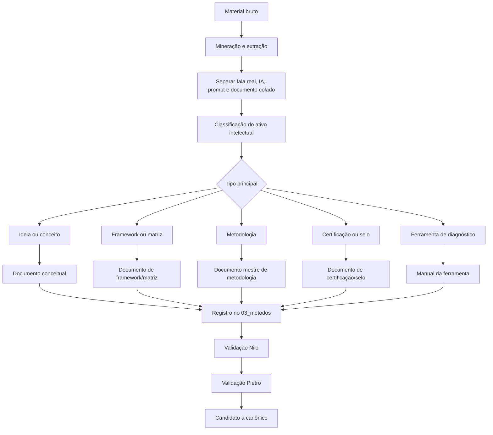
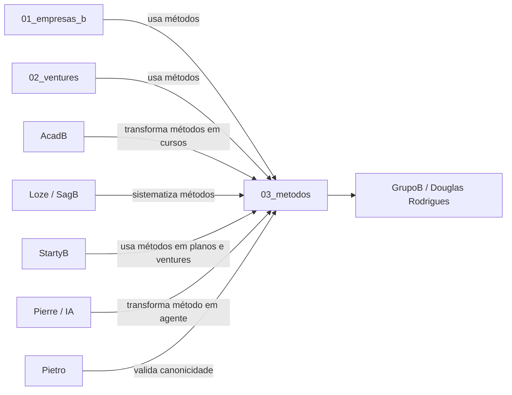
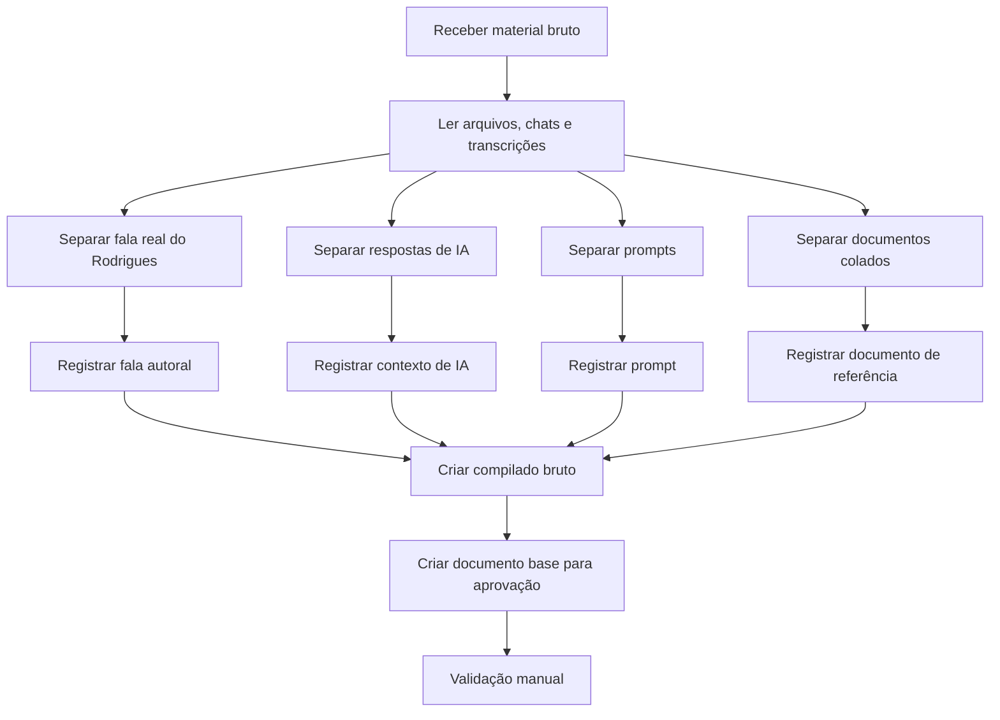
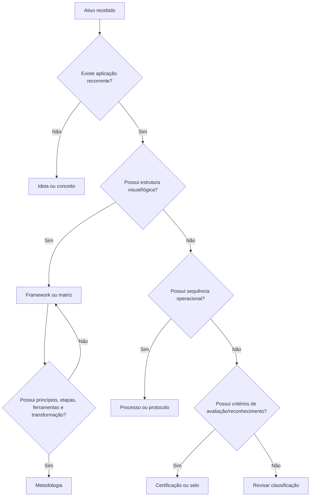
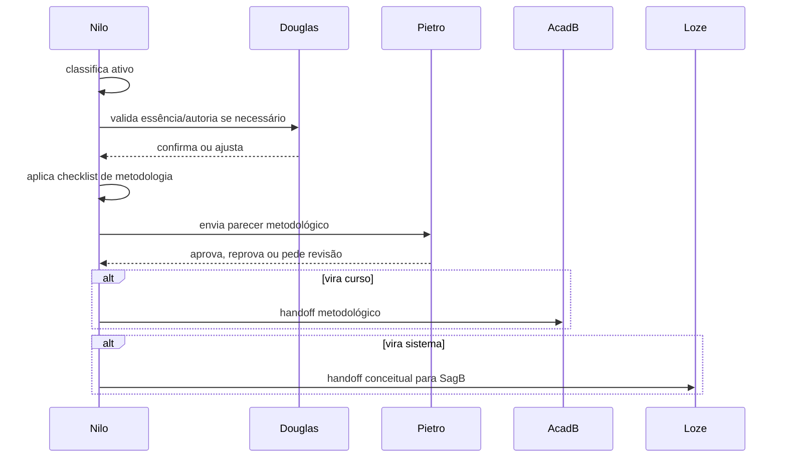
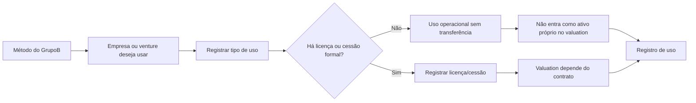
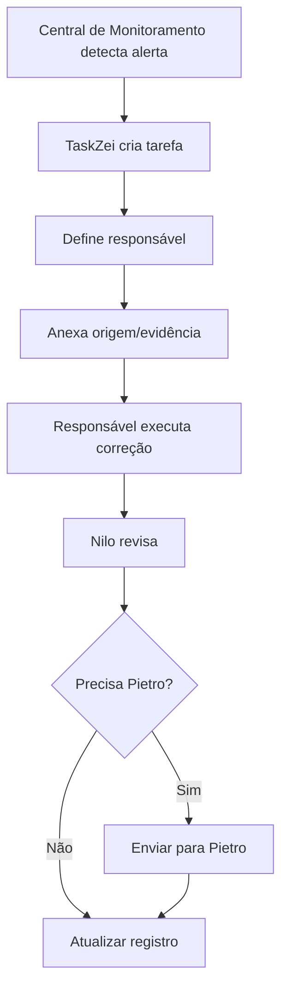

# Documento Mestre de Padrões — Metodologias, Frameworks e Estruturas Intelectuais — v1 — 06-06-2026

## Cabeçalho interno

| Campo | Informação |
|---|---|
| Documento | Documento Mestre de Padrões da Divisão |
| Divisão | Metodologias, Frameworks e Estruturas Intelectuais |
| Responsável | Nilo Barret |
| Versão | v1 |
| Data da versão | 06-06-2026 |
| Status | candidato a documento-mãe da divisão |
| Formato | Markdown .md |
| Destino | Central de Padrões do SagB |
| Responsável pela validação final | Pietro Carboni |

---

## Legenda normativa da divisão

| Símbolo | Tipo normativo | Uso correto |
|---|---|---|
| 🔵 | princípio | Verdade orientadora da divisão |
| 🟣 | política | Diretriz de governança e tomada de decisão |
| 🔴 | regra | Determinação obrigatória e verificável |
| 🟠 | padrão | Forma oficial ou candidata de organizar algo |
| 🟢 | protocolo | Sequência obrigatória para situação específica, com responsável e saída esperada |
| ⚙️ | processo | Fluxo recorrente de trabalho |
| 🧩 | procedimento | Instrução prática dentro de processo ou protocolo |
| ✅ | checklist | Lista de verificação objetiva |
| 📊 | matriz | Estrutura de comparação, classificação ou decisão |
| 🧾 | registro/evidência | Prova, histórico, fonte ou documento de comprovação |
| ⚠️ | risco | Possível dano, distorção ou perda de controle |
| 💡 | recomendação | Ação sugerida, ainda não canônica |
| 📌 | decisão | Definição já tomada no histórico da área |
| ❓ | dúvida/lacuna | Ponto pendente de validação |
| 🚨 | crítico | Item de alta prioridade ou alto risco |

---

## 1. Objetivo do documento

Este documento tem como objetivo consolidar os padrões da divisão **Metodologias, Frameworks e Estruturas Intelectuais** dentro da Central de Padrões do SagB.

A função desta divisão é organizar, classificar, estruturar, validar, versionar, proteger e preparar os ativos intelectuais proprietários do GrupoB para uso correto dentro do ecossistema.

Esta divisão não existe para escrever cursos, criar marcas, implementar sistemas ou negociar sociedades. Ela existe para responder, com precisão metodológica:

> O que é este ativo intelectual, qual é sua natureza real, quem é seu dono, como deve ser documentado, como pode ser usado e quais limites não podem ser ultrapassados?

O documento reúne princípios, políticas, regras, padrões, protocolos, processos, procedimentos, checklists, matrizes, registros, riscos, lacunas, decisões e dependências que devem alimentar a Central de Padrões do SagB.

---

## 2. Escopo da divisão

A divisão cobre os padrões relacionados a:

- metodologias;
- frameworks;
- matrizes conceituais;
- modelos mentais;
- ferramentas de diagnóstico;
- programas metodológicos;
- certificações e selos quando forem ativos intelectuais;
- sistemas conceituais;
- estruturas intelectuais proprietárias;
- classificação de ativos intelectuais;
- extração de falas reais de Douglas Rodrigues;
- separação entre autoria humana e conteúdo gerado por IA;
- documentação mestre de métodos;
- versionamento metodológico;
- titularidade intelectual;
- uso de métodos por empresas, ventures, produtos e cursos;
- relação entre `03_metodos/` e SagB;
- padrões de triagem, especialmente `99_triagem/`;
- handoff de métodos para AcadB, Loze, StartyB, Noah, Pierre e Pietro.

O escopo operacional desta divisão conversa diretamente com o repositório:

```text
grupob/
└── 03_metodos/
```

E com a estrutura macro:

```text
grupob/
├── 01_empresas_b/
├── 02_ventures/
└── 03_metodos/
```

---

## 3. O que esta divisão define

Esta divisão define:

1. 🔵 o que é metodologia dentro do GrupoB;
2. 🔵 o que é framework;
3. 🔵 o que é matriz conceitual;
4. 🔵 o que é modelo mental;
5. 🔵 o que é ferramenta de diagnóstico;
6. 🔵 o que é programa metodológico;
7. 🔵 o que é certificação, selo ou sistema de reconhecimento;
8. 🟠 os campos mínimos de cada tipo de ativo intelectual;
9. 🟠 o padrão de estrutura para documentos mestres de metodologia;
10. 🟠 o padrão de estrutura para documentos de framework;
11. 🟠 o padrão de registro de origem, autoria e fontes;
12. 🔴 a regra de separação entre fala real do Rodrigues, resposta de IA, prompt e documento colado;
13. 🔴 a regra de dono intelectual versus usuário do ativo;
14. 🔴 a regra de que método usado por empresa não significa método pertencente à empresa;
15. 🟣 a política de versionamento metodológico;
16. 🟣 a política de validação por Pietro Carboni antes de tornar algo canônico;
17. 📊 as matrizes de classificação, maturidade, titularidade, uso, licença e valuation;
18. 🧾 os registros necessários para evidenciar origem, autoria, uso, versão e validação;
19. ⚙️ os processos de mineração, triagem, normalização, classificação e consolidação;
20. 🟢 os protocolos reais de validação, extração e handoff.

---

## 4. O que esta divisão não define

Esta divisão não define:

| Tema | Responsável mais adequado | Motivo |
|---|---|---|
| Cursos finais, aulas, trilhas e mentorias | Júlio Mosqueira / AcadB | Nilo estrutura o método; AcadB transforma em educação |
| Planos de negócio, valuation, cap table e sociedade | César Tulli / StartyB | Envolve empresa, venture, sócios e capital |
| Naming definitivo e disponibilidade de nomes | Noah Verdili | Envolve arquitetura verbal, marca e disponibilidade |
| Sistema, banco de dados, deploy e arquitetura técnica | Sávio Codare / Loze | Envolve implementação no SagB |
| Agentes, prompts, memória e IA operacional | Pierre Zanulli | Envolve arquitetura de agentes e IA |
| Segurança digital, credenciais, risco técnico e proteção | Pedro Gazan | Envolve segurança operacional e digital |
| UX/UI, telas, componentes e design system | Alice Montini | Envolve interface e experiência visual |
| Gestão operacional de tarefas e TaskZei | Yuri Sague | Envolve execução, processos e registros de tarefa |
| Canonicidade final da Central de Padrões | Pietro Carboni | Pietro consolida e valida padrões finais |

---

## 5. Fontes analisadas

Este documento foi construído a partir das seguintes fontes internas do chat e das decisões já registradas:

1. Prompt de ativação de Nilo Barret como Especialista em Arquitetura de Metodologias.
2. Documento **Padrões de Metodologias, Frameworks e Estruturas Intelectuais — GrupoB**.
3. Estrutura da Missão 1 do bloco da área na Central de Padrões.
4. Documento de auditoria e revisão da Missão 2.
5. Discussões sobre `03_metodos/`.
6. Decisão de que os métodos pertencem ao **GrupoB / Douglas Rodrigues**, não às empresas que os usam.
7. Decisão de que o GERAC deve ser tratado principalmente como **certificação/selo**, não apenas metodologia.
8. Decisão de que `99_triagem/` é o padrão oficial de triagem.
9. Decisão de normalizar pastas em `snake_case`, sem espaço, acento, caractere especial ou `_` inicial.
10. Discussões sobre extração das falas reais do Rodrigues.
11. Separação entre fala autoral, resposta de IA, prompt e documento colado.
12. Relação entre `01_empresas_b/`, `02_ventures/` e `03_metodos/`.
13. Relação entre Nilo, Pietro, Júlio, César, Sávio, Noah e Pierre.
14. Relatório de Fase 01 e normalização de `03_metodos/`.
15. Modelo normativo geral da Central de Padrões.

---

## 6. Síntese executiva

A divisão **Metodologias, Frameworks e Estruturas Intelectuais** é responsável por proteger o núcleo intelectual do GrupoB.

Seu papel principal é impedir três distorções:

1. tratar qualquer ideia como metodologia;
2. tratar um método do GrupoB como ativo de uma empresa específica;
3. transformar material bruto, resposta de IA ou documento colado em documento oficial sem triagem, extração de fala real e validação.

A decisão central da divisão é:

> Os métodos, frameworks, matrizes, certificações, selos e estruturas intelectuais pertencem ao GrupoB / Douglas Rodrigues. Empresas, ventures, produtos, cursos e sistemas podem usar esses ativos, mas o uso não transfere a titularidade.

A divisão também estabelece que `03_metodos/` é o repositório operacional dos ativos intelectuais, enquanto a Central de Padrões define os padrões que governam esse repositório.

---

## 7. Mapa visual da divisão



### Mapa de relação com o ecossistema



---

## 8. Princípios da área

| Código | Princípio | Classificação | Status | Prioridade |
|---|---|---|---|---|
| MET-PRIN-001 | Nem toda ideia é metodologia | 🔵 princípio | candidato a canônico | 🚨 crítico |
| MET-PRIN-002 | Toda metodologia forte precisa de lógica, aplicação e repetição | 🔵 princípio | candidato a canônico | 🚨 crítico |
| MET-PRIN-003 | A fala real do Rodrigues é fonte primária de essência | 🔵 princípio | candidato a canônico | 🚨 crítico |
| MET-PRIN-004 | Resposta de IA organiza, mas não substitui autoria | 🔵 princípio | candidato a canônico | 🚨 crítico |
| MET-PRIN-005 | O GrupoB é dono dos métodos; empresas e ventures podem ser usuárias | 🔵 princípio | candidato a canônico | 🚨 crítico |
| MET-PRIN-006 | Método vem antes de curso, sistema, produto ou agente | 🔵 princípio | candidato a canônico | importante |
| MET-PRIN-007 | Clareza de limite protege o ativo intelectual | 🔵 princípio | candidato a canônico | importante |
| MET-PRIN-008 | Duplicidade metodológica enfraquece o patrimônio intelectual | 🔵 princípio | em revisão | importante |
| MET-PRIN-009 | Certificação/selo pode conter metodologia, mas não deve ser reduzida a metodologia | 🔵 princípio | candidato a canônico | importante |

---

## 9. Políticas da área

| Código | Política | Classificação | Status | Prioridade |
|---|---|---|---|---|
| MET-POL-001 | Todo ativo intelectual deve ser classificado antes de virar documento oficial | 🟣 política | candidato a canônico | 🚨 crítico |
| MET-POL-002 | Toda metodologia oficial precisa de validação de Pietro Carboni | 🟣 política | candidato a canônico | 🚨 crítico |
| MET-POL-003 | Todo método precisa registrar origem, autoria, responsável, versão e status | 🟣 política | candidato a canônico | 🚨 crítico |
| MET-POL-004 | Todo uso de método por empresa, venture, produto ou curso deve ser registrado | 🟣 política | candidato a canônico | 🚨 crítico |
| MET-POL-005 | O uso de método por empresa não transfere titularidade intelectual | 🟣 política | candidato a canônico | 🚨 crítico |
| MET-POL-006 | Método só pode ser transformado em curso após handoff para AcadB | 🟣 política | em revisão | importante |
| MET-POL-007 | Método só pode virar sistema após especificação conceitual validada com Loze | 🟣 política | em revisão | importante |
| MET-POL-008 | Naming de método deve passar por Noah quando houver risco de conflito ou marca | 🟣 política | em revisão | importante |
| MET-POL-009 | Agente de IA baseado em método deve passar por Pierre Zanulli | 🟣 política | em revisão | importante |
| MET-POL-010 | Métodos usados em valuation devem distinguir ativo próprio, licença, autorização e diferencial operacional | 🟣 política | precisa validação | 🚨 crítico |

---

## 10. Regras centrais da área

| Código | Regra | Classificação | Status | Prioridade |
|---|---|---|---|---|
| MET-REG-001 | Não chamar tudo de metodologia | 🔴 regra | candidato a canônico | 🚨 crítico |
| MET-REG-002 | Não chamar tudo de protocolo | 🔴 regra | candidato a canônico | 🚨 crítico |
| MET-REG-003 | Protocolo só existe com situação específica, sequência obrigatória, responsável e saída esperada | 🔴 regra | candidato a canônico | 🚨 crítico |
| MET-REG-004 | Framework não é ferramenta | 🔴 regra | candidato a canônico | importante |
| MET-REG-005 | Processo não é metodologia | 🔴 regra | candidato a canônico | importante |
| MET-REG-006 | Programa metodológico não é automaticamente programa educacional | 🔴 regra | em revisão | importante |
| MET-REG-007 | GERAC deve ser classificado como certificação/selo, com componentes metodológicos | 🔴 regra | candidato a canônico | 🚨 crítico |
| MET-REG-008 | `99_triagem/` é o nome oficial da pasta de triagem | 🔴 regra | candidato a canônico | importante |
| MET-REG-009 | Pastas de métodos devem usar `snake_case`, sem espaço, acento, caractere especial ou `_` inicial | 🔴 regra | candidato a canônico | importante |
| MET-REG-010 | Documento oficial não nasce antes da extração e separação da fala real | 🔴 regra | candidato a canônico | 🚨 crítico |
| MET-REG-011 | Arquivo bruto não deve ser apagado antes de consolidação validada | 🔴 regra | candidato a canônico | importante |
| MET-REG-012 | Todo método deve ter dono intelectual e usuário separados | 🔴 regra | candidato a canônico | 🚨 crítico |

---

## 11. Padrões oficiais e candidatos a padrão

| Código | Padrão | Tipo | Status | Prioridade |
|---|---|---|---|---|
| MET-PAD-001 | Estrutura padrão de um ativo em `03_metodos/` | 🟠 padrão | candidato a canônico | 🚨 crítico |
| MET-PAD-002 | Estrutura de `99_triagem/` | 🟠 padrão | candidato a canônico | 🚨 crítico |
| MET-PAD-003 | Modelo de Documento Mestre de Metodologia | 🟠 padrão | candidato a canônico | 🚨 crítico |
| MET-PAD-004 | Modelo de Documento de Framework | 🟠 padrão | em revisão | importante |
| MET-PAD-005 | Modelo de Documento de Matriz Conceitual | 🟠 padrão | em revisão | importante |
| MET-PAD-006 | Modelo de Documento de Ferramenta de Diagnóstico | 🟠 padrão | em revisão | importante |
| MET-PAD-007 | Modelo de Documento de Certificação/Selo | 🟠 padrão | precisa validação | 🚨 crítico |
| MET-PAD-008 | Padrão de campos mínimos de metodologia | 🟠 padrão | candidato a canônico | 🚨 crítico |
| MET-PAD-009 | Padrão de registro de origem e autoria | 🟠 padrão | candidato a canônico | 🚨 crítico |
| MET-PAD-010 | Padrão de handoff método → AcadB | 🟠 padrão | em revisão | importante |
| MET-PAD-011 | Padrão de handoff método → Loze | 🟠 padrão | em revisão | importante |
| MET-PAD-012 | Padrão de handoff método → StartyB | 🟠 padrão | em revisão | importante |

### Estrutura padrão de um método em `03_metodos/`

```text
03_metodos/
└── nome_do_metodo/
    ├── 00_status_e_visao_geral/
    ├── 01_documentos_oficiais/
    ├── 02_origem_autoria_e_historico/
    ├── 03_conceito_e_fundamentos/
    ├── 04_frameworks_matrizes_e_modelos/
    ├── 05_processos_protocolos_e_ferramentas/
    ├── 06_aplicacao_pratica/
    ├── 07_uso_em_empresas_ventures_e_produtos/
    ├── 08_treinamento_e_handoff_acadb/
    ├── 09_versionamento_e_governanca/
    └── 99_triagem/
```

### Estrutura padrão de `99_triagem/`

```text
99_triagem/
├── 01_compilado_bruto_existente.md
├── 02_novas_informacoes.md
├── 03_documento_base_consolidado_para_aprovacao.md
└── arquivo_morto/
```

---

## 12. Protocolos reais da área

### MET-PROT-001 — Protocolo de validação de metodologia

**Tipo:** 🟢 protocolo  
**Status:** candidato a canônico  
**Quando usar:** quando um conceito, framework, matriz, ferramenta ou processo estiver sendo considerado para virar metodologia oficial.  
**Responsável:** Nilo Barret.  
**Validador final:** Pietro Carboni.  
**Saída esperada:** aprovado como metodologia, reclassificado, devolvido para revisão ou arquivado.

#### Sequência obrigatória

1. Registrar o ativo.
2. Confirmar origem e autoria.
3. Classificar tipo atual.
4. Definir desafio que resolve.
5. Identificar público e contexto.
6. Estruturar princípios.
7. Estruturar pilares.
8. Estruturar etapas/processos.
9. Identificar ferramentas associadas.
10. Definir limites de aplicação.
11. Verificar duplicidade.
12. Validar maturidade.
13. Emitir parecer de Nilo.
14. Enviar para Pietro.
15. Registrar decisão.

---

### MET-PROT-002 — Protocolo de extração de fala autoral

**Tipo:** 🟢 protocolo  
**Status:** candidato a canônico  
**Quando usar:** quando houver chat, áudio, TXT, transcrição ou documento bruto com fala do Rodrigues misturada com IA, prompts ou documentos colados.  
**Responsável:** Nilo Barret ou agente de extração designado.  
**Validador:** Douglas Rodrigues, quando houver dúvida de autoria.  
**Saída esperada:** falas reais separadas e registradas.

#### Sequência obrigatória

1. Ler o material completo.
2. Identificar blocos de fala real.
3. Separar respostas de IA.
4. Separar prompts.
5. Separar documentos colados.
6. Separar decisões explícitas.
7. Extrair frases autorais relevantes.
8. Registrar origem.
9. Marcar dúvidas de autoria.
10. Salvar em registro de fala real.
11. Só depois consolidar documento-base.

---

### MET-PROT-003 — Protocolo de verificação de duplicidade metodológica

**Tipo:** 🟢 protocolo  
**Status:** em revisão  
**Quando usar:** antes de oficializar qualquer novo método, framework, matriz ou conceito.  
**Responsável:** Nilo Barret.  
**Validador:** Pietro Carboni.  
**Saída esperada:** novo ativo, fusão, variação, derivação ou arquivamento.

---

### MET-PROT-004 — Protocolo de handoff método → AcadB

**Tipo:** 🟢 protocolo  
**Status:** em revisão  
**Quando usar:** quando um método estiver pronto para virar curso, trilha, mentoria ou formação.  
**Responsável de saída:** Nilo Barret.  
**Responsável de entrada:** Júlio Mosqueira / AcadB.  
**Saída esperada:** briefing metodológico para arquitetura educacional.

---

### MET-PROT-005 — Protocolo de registro de uso de método por empresa ou venture

**Tipo:** 🟢 protocolo  
**Status:** precisa validação  
**Quando usar:** quando empresa, venture, produto ou curso usar um método do GrupoB.  
**Responsável:** Nilo Barret em conjunto com César Tulli quando houver impacto empresarial.  
**Saída esperada:** registro de uso sem transferência automática de titularidade.

---

## 13. Processos da área

| Código | Processo | Tipo | Status | Prioridade |
|---|---|---|---|---|
| MET-PROC-001 | Mineração, extração e triagem de ativos intelectuais | ⚙️ processo | candidato a canônico | 🚨 crítico |
| MET-PROC-002 | Classificação de ativo intelectual | ⚙️ processo | candidato a canônico | 🚨 crítico |
| MET-PROC-003 | Oficialização de metodologia | ⚙️ processo | candidato a canônico | 🚨 crítico |
| MET-PROC-004 | Normalização de pastas de métodos | ⚙️ processo | candidato a canônico | importante |
| MET-PROC-005 | Fase 01 — Triagem bruta | ⚙️ processo | em revisão | importante |
| MET-PROC-006 | Fase 01.6 — Validação manual de amostra | ⚙️ processo | em revisão | 🚨 crítico |
| MET-PROC-007 | Fase 02 — Consolidação oficial de documentos | ⚙️ processo | precisa validação | 🚨 crítico |
| MET-PROC-008 | Encaminhamento para AcadB, Loze, StartyB, Noah ou Pierre | ⚙️ processo | em revisão | importante |
| MET-PROC-009 | Revisão periódica de método oficial | ⚙️ processo | em revisão | importante |

### Processo MET-PROC-001 — Mineração, extração e triagem



---

## 14. Procedimentos operacionais

### MET-PROC-OP-001 — Como identificar fala real do Rodrigues

**Tipo:** 🧩 procedimento

Sinais comuns de fala real:

- linguagem oral;
- repetições;
- interrupções;
- raciocínio em construção;
- expressões como “entendeu?”, “tá entendendo?”, “a ideia é”, “é tipo assim”;
- decisões espontâneas;
- correções durante a fala.

### MET-PROC-OP-002 — Como diferenciar metodologia de processo

**Tipo:** 🧩 procedimento

1. Verificar se existe apenas sequência operacional.
2. Verificar se existem princípios.
3. Verificar se há promessa de transformação.
4. Verificar se pode ser replicado.
5. Verificar se há ferramentas e métricas.
6. Se houver só fluxo, classificar como processo.
7. Se houver lógica, aplicação, princípios e transformação, avaliar como metodologia.

### MET-PROC-OP-003 — Como diferenciar framework de ferramenta

**Tipo:** 🧩 procedimento

1. Se ajuda a pensar, classificar como framework.
2. Se ajuda a aplicar, medir ou executar, classificar como ferramenta.
3. Se possuir eixos de classificação, avaliar como matriz.
4. Se gerar pontuação ou diagnóstico, avaliar como ferramenta de diagnóstico.

### MET-PROC-OP-004 — Como registrar uso de método por empresa

**Tipo:** 🧩 procedimento

1. Identificar o método.
2. Confirmar dono intelectual.
3. Identificar empresa usuária.
4. Definir tipo de uso.
5. Registrar se há licença, cessão ou autorização.
6. Registrar impacto operacional.
7. Registrar se entra ou não em valuation como ativo próprio.
8. Enviar dúvidas para César / StartyB quando houver impacto societário.

---

## 15. Checklists obrigatórios

### ✅ Checklist para oficializar metodologia

- [ ] Nome definido ou provisório.
- [ ] Origem identificada.
- [ ] Autor/criador registrado.
- [ ] Dono intelectual registrado.
- [ ] Responsável atual definido.
- [ ] Objetivo claro.
- [ ] Desafio que resolve.
- [ ] Público de aplicação.
- [ ] Contexto de uso.
- [ ] Princípios definidos.
- [ ] Pilares definidos.
- [ ] Etapas/processos definidos.
- [ ] Ferramentas associadas.
- [ ] Métricas ou evidências.
- [ ] Limites de aplicação.
- [ ] Anti-padrões.
- [ ] Exemplos práticos.
- [ ] Verificação de duplicidade.
- [ ] Versão definida.
- [ ] Status definido.
- [ ] Parecer de Nilo.
- [ ] Validação de Pietro.

### ✅ Checklist de extração de falas reais

- [ ] Material lido por completo.
- [ ] Falas reais separadas.
- [ ] Respostas de IA separadas.
- [ ] Prompts separados.
- [ ] Documentos colados separados.
- [ ] Decisões explícitas identificadas.
- [ ] Dúvidas de autoria marcadas.
- [ ] Origem registrada.
- [ ] Arquivo salvo em `99_triagem/`.
- [ ] Documento base gerado apenas após separação.

### ✅ Checklist de handoff para AcadB

- [ ] Método classificado.
- [ ] Método minimamente estruturado.
- [ ] Princípios definidos.
- [ ] Etapas definidas.
- [ ] Ferramentas associadas.
- [ ] Limites de aplicação.
- [ ] Público de aprendizagem sugerido.
- [ ] O que não pode ser distorcido.
- [ ] Materiais de apoio anexados.
- [ ] Responsável AcadB definido.

### ✅ Checklist de titularidade e uso

- [ ] Dono intelectual registrado.
- [ ] Usuário interno registrado.
- [ ] Tipo de uso descrito.
- [ ] Licença/autorização informada.
- [ ] Impacto operacional descrito.
- [ ] Impacto em valuation marcado.
- [ ] Validação de César quando aplicável.
- [ ] Validação de Pietro quando envolver padrão oficial.

---

## 16. Matrizes obrigatórias

### 📊 Matriz de classificação de produto intelectual

| Categoria | Definição | Sinal principal | Documento recomendado |
|---|---|---|---|
| Ideia | Intenção inicial sem estrutura | Insight solto | Ficha de ideia |
| Conceito | Explicação central | Define visão, mas não possui etapas | Documento conceitual |
| Modelo mental | Forma de pensar | Ajuda a interpretar situação | Documento de modelo mental |
| Ferramenta | Instrumento prático | Ajuda a executar ou medir | Manual de ferramenta |
| Matriz | Estrutura de classificação | Tem eixos ou categorias | Documento de matriz |
| Framework | Estrutura lógica ou visual | Ajuda a diagnosticar ou decidir | Documento de framework |
| Metodologia | Sistema aplicável e replicável | Tem princípios, etapas, ferramentas e transformação | Documento mestre |
| Processo | Fluxo operacional | Tem começo, meio e fim | Documento de processo |
| Programa metodológico | Conjunto de aplicação do método | Organiza implantação ou prática | Arquitetura de programa |
| Certificação/selo | Sistema de reconhecimento | Possui critérios, auditoria ou validação | Documento de certificação/selo |
| Produto intelectual | Ativo pronto para uso/venda | Tem escopo e valor | Documento de produto intelectual |

### 📊 Matriz de maturidade metodológica

| Nível | Status | Descrição | Próximo passo |
|---|---|---|---|
| 0 | rascunho | Material bruto ou fala solta | Minerar e extrair |
| 1 | em revisão | Ideia estruturável | Classificar |
| 2 | em revisão | Conceito organizado | Testar aplicação |
| 3 | candidato a canônico | Framework ou matriz estruturada | Validar duplicidade |
| 4 | candidato a canônico | Metodologia em desenvolvimento | Validar campos mínimos |
| 5 | precisa validação | Pronta para Pietro | Submeter validação |
| 6 | aprovado | Validada por Pietro | Registrar versão |
| 7 | canônico | Oficial após aprovação final | Monitorar e versionar |

### 📊 Matriz de titularidade, uso, licença e valuation

| Ativo | Dono intelectual | Usado por | Tipo de uso | Entra como ativo próprio da empresa? | Validação |
|---|---|---|---|---|---|
| Jornada U.A.U. | GrupoB / Douglas Rodrigues | 3forB, AcadB, Scale Odonto | Operacional, educacional, comercial | Não, salvo cessão/licença formal | Pietro / César |
| GERAC | GrupoB / Douglas Rodrigues | InstitutoB, AcadB, empresas clientes | Certificação/selo | Não, salvo cessão/licença formal | Pietro |
| Funil 5Cs | GrupoB / Douglas Rodrigues | 3forB | Atendimento/vendas | Não, salvo cessão/licença formal | Nilo / Pietro |
| MAV | GrupoB / Douglas Rodrigues | 3forB, StartyB | Vendas/operação | Precisa validação | César / Pietro |
| EDA | GrupoB / Douglas Rodrigues | StartyB, Loze | Estrutura digital | Precisa validação | César / Sávio |

---

## 17. Registros e evidências obrigatórias

| Código | Registro | Tipo | Status | Prioridade |
|---|---|---|---|---|
| MET-REGIST-001 | Registro de metodologias | 🧾 registro/evidência | candidato a canônico | 🚨 crítico |
| MET-REGIST-002 | Registro de frameworks | 🧾 registro/evidência | em revisão | importante |
| MET-REGIST-003 | Registro de matrizes conceituais | 🧾 registro/evidência | em revisão | importante |
| MET-REGIST-004 | Registro de ferramentas de diagnóstico | 🧾 registro/evidência | em revisão | importante |
| MET-REGIST-005 | Registro de certificações e selos | 🧾 registro/evidência | precisa validação | 🚨 crítico |
| MET-REGIST-006 | Registro de origem, autoria e fontes | 🧾 registro/evidência | candidato a canônico | 🚨 crítico |
| MET-REGIST-007 | Registro de falas reais extraídas | 🧾 registro/evidência | candidato a canônico | 🚨 crítico |
| MET-REGIST-008 | Registro de validações do Pietro | 🧾 registro/evidência | candidato a canônico | 🚨 crítico |
| MET-REGIST-009 | Registro de uso por empresas, ventures e produtos | 🧾 registro/evidência | candidato a canônico | 🚨 crítico |
| MET-REGIST-010 | Registro de licenças, cessões e autorizações | 🧾 registro/evidência | precisa validação | 🚨 crítico |
| MET-REGIST-011 | Registro de versões | 🧾 registro/evidência | em revisão | importante |
| MET-REGIST-012 | Registro de decisões metodológicas | 🧾 registro/evidência | em revisão | importante |

---

## 18. Fluxos Mermaid da divisão

### Fluxo de classificação normativa



### Fluxo de validação metodológica



### Fluxo de uso por empresa sem transferência de propriedade



---

## 19. Dependências com outras áreas

### Tabela obrigatória — Dependências com outras áreas

| Tema | Depende de quem | Motivo | Tipo de dependência | Arquivo/registro sugerido |
|---|---|---|---|---|
| Validação canônica | Pietro Carboni | Aprovação final da Central de Padrões | validação normativa | `dependencia_com_pietro_carboni.md` |
| Essência e autoria | Douglas Rodrigues | Confirmar visão original e autoria | validação autoral | `dependencia_com_douglas_rodrigues.md` |
| Cursos, trilhas, mentorias | Júlio Mosqueira / AcadB | Transformar método em educação | handoff educacional | `dependencia_com_julio_mosqueira_acadb.md` |
| Planos, empresas, ventures e valuation | César Tulli / StartyB | Separar ativo do GrupoB de ativo da empresa | dependência estratégica/societária | `dependencia_com_cesar_tulli_startyb.md` |
| SagB e sistema | Sávio Codare / Loze | Implementar filtros, módulos e repositório | dependência técnica | `dependencia_com_savio_codare_loze.md` |
| Naming e disponibilidade | Noah Verdili | Nomear e validar nomes de ativos | dependência de naming | `dependencia_com_noah_verdili.md` |
| Agentes e IA | Pierre Zanulli | Transformar método em agente ou prompt | dependência de IA | `dependencia_com_pierre_zanulli.md` |
| Processos e TaskZei | Yuri Sague | Converter padrões em fluxos e tarefas | dependência operacional | `dependencia_com_yuri_sague.md` |

---

## 20. Conflitos de escopo

| Conflito | Risco | Resolução proposta |
|---|---|---|
| Metodologia x curso | AcadB criar curso antes do método estar maduro | Nilo estrutura; AcadB educa |
| Framework x ferramenta | Registrar ferramenta como framework ou vice-versa | Usar matriz de classificação |
| Processo x protocolo | Chamar qualquer fluxo de protocolo | Aplicar regra de protocolo real |
| Método do GrupoB x ativo de empresa | Inflar valuation de empresa com ativo que não pertence a ela | Registrar titularidade e uso |
| Certificação x metodologia | Reduzir GERAC a metodologia simples | Criar padrão de certificação/selo |
| Naming x metodologia | Nilo nomear sem validar disponibilidade | Acionar Noah |
| Método x sistema | Loze implementar antes de validar lógica | Handoff Nilo → Loze |
| Método x agente | Agente responder usando método sem governança | Handoff Nilo → Pierre |
| Programa metodológico x programa educacional | Confundir arquitetura de método com trilha AcadB | Criar fronteira Nilo x Júlio |

---

## 21. Riscos se os padrões não forem seguidos

### Tabela obrigatória — Riscos

| Risco | Causa provável | Impacto | Como prevenir | Quem acompanha |
|---|---|---|---|---|
| Oficializar metodologia imatura | Falta de checklist | Documentos fracos e confusos | Aplicar checklist de oficialização | Nilo / Pietro |
| Misturar fala do Rodrigues com IA | Falta de protocolo de extração | Autoria distorcida | Separar fala, IA, prompt e documento colado | Nilo |
| Método entrar errado em valuation | Falta de matriz de titularidade | Risco societário e negociação errada | Registrar dono, uso, licença e valuation | César / Nilo |
| GERAC ser tratado como metodologia simples | Classificação incompleta | Perda de força como certificação/selo | Criar padrão de certificação/selo | Nilo / Pietro |
| Duplicar métodos parecidos | Falta de matriz de duplicidade | Fragmentação do patrimônio intelectual | Verificar duplicidade antes de oficializar | Nilo |
| Criar curso antes de método maduro | Handoff prematuro | Curso distorce essência | Checklist de handoff para AcadB | Nilo / Júlio |
| Criar sistema antes do método estabilizar | Pressa de implementação | SagB cristaliza lógica errada | Handoff para Loze com especificação | Nilo / Sávio |
| Apagar material bruto cedo demais | Limpeza sem validação | Perda de origem e evidência | Manter `99_triagem` e `arquivo_morto` | Nilo / Sávio |
| Pastas fora do padrão | Falta de regra técnica | Automação quebra | `snake_case` e validação | Sávio / Nilo |

---

## 22. O que deve ser monitorado pela Central de Monitoramento

A Central de Padrões define.  
A Central de Monitoramento observa.  
TaskZei aciona.  
O responsável responde.

### Tabela obrigatória — Monitoramento

| Item a monitorar | Por que monitorar | Origem do dado | Responsável | Ação se der alerta |
|---|---|---|---|---|
| Método sem dono intelectual | Evitar ativo órfão | Registro de ativos | Nilo | Abrir tarefa de classificação |
| Método usado por empresa sem registro | Evitar confusão de titularidade | Registro de uso | Nilo / César | Solicitar registro de uso |
| Documento sem versão | Evitar uso de material desatualizado | Registro de versões | Nilo | Atualizar versionamento |
| Método oficial sem validação de Pietro | Evitar canonicidade indevida | Registro de validações | Pietro / Nilo | Rebaixar status para precisa validação |
| Ativo em `99_triagem` por muito tempo | Evitar acúmulo indefinido | Repositório `03_metodos` | Nilo | Rodar triagem |
| Falas reais não extraídas | Evitar documento sem fonte autoral | Registro de extração | Nilo | Executar protocolo de extração |
| Duplicidade metodológica detectada | Evitar fragmentação | Matriz de duplicidade | Nilo / Pietro | Abrir revisão |
| Handoff para AcadB sem checklist | Evitar curso desalinhado | Registro de handoff | Nilo / Júlio | Bloquear handoff |
| Handoff para Loze sem especificação | Evitar sistema errado | Registro de handoff | Nilo / Sávio | Solicitar especificação |
| GERAC classificado fora de certificação/selo | Evitar enquadramento errado | Registro de certificações | Nilo / Pietro | Reclassificar |

---

## 23. Relação com Biblioteca de Módulos Base, se aplicável

Esta divisão possui relação indireta e estratégica com a **Biblioteca de Módulos Base Reutilizáveis do SagB**.

A divisão não cria módulos técnicos, mas pode gerar insumos para módulos reutilizáveis, como:

- módulo de registro de metodologias;
- módulo de classificação de ativos intelectuais;
- módulo de matriz de maturidade;
- módulo de registro de falas reais;
- módulo de versionamento;
- módulo de validação por Pietro;
- módulo de titularidade e uso;
- módulo de licenças internas;
- módulo de handoff para AcadB;
- módulo de handoff para Loze;
- módulo de monitoramento de padrões vencidos.

### Relação com Gate Modular Pré-Dev

Antes de um método virar sistema, módulo, ferramenta digital ou automação, deve passar pelo Gate Modular Pré-Dev com:

1. classificação do ativo;
2. dono intelectual definido;
3. objetivo do módulo;
4. lógica metodológica estabilizada;
5. campos de dados mínimos;
6. entradas e saídas;
7. riscos de distorção;
8. responsável de negócio;
9. responsável técnico;
10. validação de Nilo e Sávio.

### Relação com Pacote Modular Pré-Dev

O pacote pré-dev de qualquer método transformado em módulo deve conter:

- documento mestre do método;
- matriz de classificação;
- glossário;
- regras de uso;
- fluxos Mermaid;
- entidades principais;
- permissões;
- dados monitorados;
- alertas esperados;
- critérios de aceite.

---

## 24. Relação com TaskZei e Sala Dev, se aplicável

Esta divisão se relaciona com **TaskZei** quando um padrão, lacuna, validação ou handoff precisa virar tarefa operacional.

Exemplos de gatilhos para TaskZei:

- método sem dono;
- método sem versão;
- ativo em `99_triagem` sem revisão;
- documento sem validação;
- duplicidade detectada;
- curso criado sem handoff;
- sistema criado sem especificação metodológica;
- empresa usando método sem registro;
- metodologia sem checklist preenchido;
- GERAC classificado incorretamente.

### Fluxo TaskZei



### Relação com Sala Dev

A Sala Dev só deve ser acionada quando:

- o método precisa virar módulo do SagB;
- há necessidade de banco de dados, telas, filtros ou automações;
- há integração com Biblioteca de Módulos Base;
- há recurso reaproveitável;
- há dependência técnica com Loze.

Nilo não define implementação técnica, mas deve entregar a lógica metodológica clara.

---

## 25. Lacunas e validações pendentes

### Tabela obrigatória — Lacunas e validações

| Lacuna | Impacto | Quem valida | Prioridade | Recomendação |
|---|---|---|---|---|
| Grafia oficial: Nilo Barret ou Nilo Barreti | Inconsistência documental | Pietro / Rodrigues | importante | Validar grafia oficial |
| Lista final de ativos de `03_metodos/` | Pode faltar ativo relevante | Nilo / Pietro | 🚨 crítico | Criar inventário completo |
| Status de cada método | Mistura bruto, legado e oficial | Nilo / Pietro | 🚨 crítico | Aplicar matriz de maturidade |
| GERAC como certificação/selo | Precisa arquitetura própria | Pietro / Douglas | 🚨 crítico | Criar documento de certificação/selo |
| Regra de licença interna dos métodos | Afeta valuation e sociedade | César / Pietro | 🚨 crítico | Criar matriz de titularidade |
| Critério entre programa metodológico e educacional | Conflito com AcadB | Júlio / Pietro / Nilo | importante | Criar matriz de fronteira |
| Qualidade da extração das falas reais | Risco de autoria errada | Nilo / Douglas | 🚨 crítico | Validar amostras |
| Integração `03_metodos` com SagB | Pode ficar só pasta sem sistema | Sávio / Nilo | importante | Definir campos de filtro |
| Replicação em `01_empresas_b` e `02_ventures` | Escopo pertence ao César | César / Nilo | importante | Nilo apoia só onde houver método |

---

## 26. Decisões já tomadas

| Decisão | Tipo | Status | Responsável |
|---|---|---|---|
| A raiz macro considera `01_empresas_b`, `02_ventures` e `03_metodos` | 📌 decisão | em revisão | Rodrigues / Sávio / César |
| Métodos ficam em `03_metodos/` | 📌 decisão | candidato a canônico | Rodrigues / Nilo |
| Métodos são do GrupoB / Douglas Rodrigues | 📌 decisão | candidato a canônico | Rodrigues |
| Empresas e ventures podem usar métodos, mas não são donas automaticamente | 📌 decisão | candidato a canônico | Rodrigues / Nilo |
| `99_triagem/` é o nome oficial da pasta de triagem | 📌 decisão | candidato a canônico | Rodrigues |
| Pastas devem usar `snake_case` | 📌 decisão | candidato a canônico | Rodrigues / Cássio |
| Remover `_` inicial das pastas | 📌 decisão | concluído | Cássio |
| Validar amostra antes da Fase 02 | 📌 decisão | em revisão | Nilo / Rodrigues |
| GERAC é certificação/selo, não apenas metodologia | 📌 decisão | candidato a canônico | Rodrigues / Nilo |
| Nilo estrutura método; AcadB transforma em curso/trilha/mentoria | 📌 decisão | candidato a canônico | Pietro / Rodrigues |

---

## 27. Documentos derivados que precisam nascer

| Documento | Tipo | Prioridade | Responsável |
|---|---|---|---|
| `matriz_de_classificacao_de_produto_intelectual.md` | 📊 matriz | 🚨 crítico | Nilo |
| `checklist_para_oficializar_metodologia.md` | ✅ checklist | 🚨 crítico | Nilo / Pietro |
| `processo_de_mineracao_extracao_e_triagem_de_ativos.md` | ⚙️ processo | 🚨 crítico | Nilo |
| `protocolo_de_extracao_de_fala_autoral.md` | 🟢 protocolo | 🚨 crítico | Nilo |
| `registro_de_origem_autoria_e_fontes.md` | 🧾 registro/evidência | 🚨 crítico | Nilo |
| `padrao_do_repositorio_03_metodos.md` | 🟠 padrão | 🚨 crítico | Nilo / Sávio |
| `padrao_99_triagem.md` | 🟠 padrão | 🚨 crítico | Nilo / Sávio |
| `regra_de_dono_intelectual_e_uso_por_empresas.md` | 🔴 regra | 🚨 crítico | Nilo / Pietro |
| `matriz_de_titularidade_uso_licenca_e_valuation.md` | 📊 matriz | 🚨 crítico | Nilo / César |
| `padrao_de_certificacao_selo_e_sistema_de_reconhecimento.md` | 🟠 padrão | importante | Nilo / Pietro |
| `guia_de_handoff_metodo_para_acadb.md` | 🟠 padrão | importante | Nilo / Júlio |
| `guia_de_handoff_metodo_para_loze.md` | 🟠 padrão | importante | Nilo / Sávio |
| `guia_de_handoff_metodo_para_startyb.md` | 🟠 padrão | importante | Nilo / César |

---

## 28. Padrões atômicos sugeridos para o módulo SagB

### Tabela obrigatória — Padrões atômicos sugeridos para o SagB

| Código sugerido | Nome do padrão | Tipo | Resumo | Documento de origem | Status sugerido |
|---|---|---|---|---|---|
| SAGB-MET-001 | Classificação de ativo intelectual | 🟠 padrão | Define tipo principal e secundário | Matriz de classificação | candidato a canônico |
| SAGB-MET-002 | Registro de dono intelectual | 🔴 regra | Todo ativo precisa de dono | Regra de dono intelectual | candidato a canônico |
| SAGB-MET-003 | Registro de usuário do método | 🧾 registro | Empresa/venture usuária deve ser registrada | Registro de uso | candidato a canônico |
| SAGB-MET-004 | Status do ativo | 🟠 padrão | rascunho, revisão, aprovado etc. | Matriz de maturidade | candidato a canônico |
| SAGB-MET-005 | Versionamento metodológico | 🟣 política | Todo método precisa de versão | Política de versionamento | em revisão |
| SAGB-MET-006 | Validação de Pietro | 🧾 registro | Canonicidade depende de validação | Registro de validações | candidato a canônico |
| SAGB-MET-007 | Extração de fala real | 🟢 protocolo | Separa fala autoral de IA | Protocolo de extração | candidato a canônico |
| SAGB-MET-008 | `99_triagem` | 🟠 padrão | Estrutura oficial de triagem | Padrão 99_triagem | candidato a canônico |
| SAGB-MET-009 | Handoff para AcadB | 🟠 padrão | Método maduro enviado para educação | Guia de handoff AcadB | em revisão |
| SAGB-MET-010 | Handoff para Loze | 🟠 padrão | Método enviado para virar módulo/sistema | Guia de handoff Loze | em revisão |
| SAGB-MET-011 | Handoff para StartyB | 🟠 padrão | Método usado em plano, venture ou valuation | Guia de handoff StartyB | em revisão |
| SAGB-MET-012 | Certificação/selo | 🟠 padrão | Categoria própria para GERAC e similares | Padrão de certificação/selo | precisa validação |
| SAGB-MET-013 | Alerta de duplicidade | 📊 matriz | Detecta métodos similares | Matriz de duplicidade | em revisão |
| SAGB-MET-014 | Bloqueio de canônico sem validação | 🔴 regra | Impede canonicidade sem Pietro | Política de validação | candidato a canônico |

---

## 29. Ordem recomendada de canonização

### Primeiro

1. `matriz_de_classificacao_de_produto_intelectual.md`
2. `processo_de_mineracao_extracao_e_triagem_de_ativos.md`
3. `protocolo_de_extracao_de_fala_autoral.md`
4. `regra_de_dono_intelectual_e_uso_por_empresas.md`
5. `padrao_do_repositorio_03_metodos.md`
6. `padrao_99_triagem.md`

### Depois

7. `checklist_para_oficializar_metodologia.md`
8. `modelo_documento_mestre_de_metodologia.md`
9. `matriz_de_maturidade_metodologica.md`
10. `matriz_de_titularidade_uso_licenca_e_valuation.md`
11. `padrao_de_certificacao_selo_e_sistema_de_reconhecimento.md`

### Por último

12. `guia_de_handoff_metodo_para_acadb.md`
13. `guia_de_handoff_metodo_para_loze.md`
14. `guia_de_handoff_metodo_para_startyb.md`
15. `mapa_de_duplicidades_metodologicas.md`
16. `manual_de_protecao_de_ativos_intelectuais.md`

---

## 30. Síntese final

A divisão **Metodologias, Frameworks e Estruturas Intelectuais** já possui uma base consistente para avançar como documento-mãe dentro da Central de Padrões.

Os principais pontos já estruturados são:

- distinção entre ideia, conceito, framework, matriz, ferramenta, metodologia, processo, programa metodológico e certificação/selo;
- regra de que método do GrupoB não é automaticamente ativo da empresa que usa;
- separação entre Nilo, AcadB, StartyB, Loze, Noah, Pierre e Pietro;
- necessidade de extração da fala real do Rodrigues antes de documento oficial;
- estrutura operacional de `03_metodos/`;
- uso de `99_triagem/` como padrão;
- necessidade de validação de Pietro para canonicidade.

As principais lacunas ainda são:

- validar a lista completa de ativos;
- classificar todos os métodos existentes;
- definir status de cada ativo;
- criar matriz de titularidade, uso, licença e valuation;
- criar documento próprio para GERAC como certificação/selo;
- validar critérios de handoff com AcadB, Loze e StartyB;
- consolidar a integração com monitoramento, TaskZei e SagB.

Minha leitura final é que esta divisão possui padrões suficientes para avançar como documento-mãe da área dentro da Central de Padrões, mas a canonicidade final depende de validação do Pietro Carboni.

---

## Próximas 10 ações recomendadas

1. Criar a matriz oficial de classificação de produto intelectual.
2. Criar o processo de mineração, extração e triagem de ativos.
3. Criar o protocolo de extração de fala autoral.
4. Criar o padrão oficial do repositório `03_metodos/`.
5. Criar o padrão oficial de `99_triagem/`.
6. Criar o checklist para oficializar metodologia.
7. Criar a matriz de titularidade, uso, licença e valuation.
8. Criar o documento específico de certificação/selo para GERAC.
9. Validar a lista completa de ativos de `03_metodos/`.
10. Submeter os documentos prioritários para Pietro Carboni.

---

## Padrões que devem ser extraídos primeiro para o módulo SagB

1. Classificação de ativo intelectual.
2. Dono intelectual.
3. Usuário do método.
4. Status do ativo.
5. Versão do ativo.
6. Validação de Pietro.
7. Registro de origem e autoria.
8. Registro de fala real extraída.
9. Registro de uso por empresa, venture ou produto.
10. Padrão de `99_triagem/`.

---

# Tabelas obrigatórias consolidadas

## Inventário normativo da divisão

| Código | Item | Tipo normativo | Status | Prioridade | Responsável | Validação necessária |
|---|---|---|---|---|---|---|
| MET-PRIN-001 | Nem toda ideia é metodologia | 🔵 princípio | candidato a canônico | 🚨 crítico | Nilo | Pietro |
| MET-POL-001 | Classificação prévia de ativo | 🟣 política | candidato a canônico | 🚨 crítico | Nilo | Pietro |
| MET-REG-001 | Não chamar tudo de metodologia | 🔴 regra | candidato a canônico | 🚨 crítico | Nilo | Pietro |
| MET-REG-002 | Não chamar tudo de protocolo | 🔴 regra | candidato a canônico | 🚨 crítico | Nilo | Pietro |
| MET-PAD-001 | Estrutura padrão `03_metodos/` | 🟠 padrão | candidato a canônico | 🚨 crítico | Nilo / Sávio | Pietro |
| MET-PAD-002 | Estrutura `99_triagem/` | 🟠 padrão | candidato a canônico | 🚨 crítico | Nilo / Sávio | Pietro |
| MET-PROT-001 | Validação de metodologia | 🟢 protocolo | candidato a canônico | 🚨 crítico | Nilo | Pietro |
| MET-PROT-002 | Extração de fala autoral | 🟢 protocolo | candidato a canônico | 🚨 crítico | Nilo | Douglas / Pietro |
| MET-PROC-001 | Mineração e triagem | ⚙️ processo | candidato a canônico | 🚨 crítico | Nilo | Pietro |
| MET-CHECK-001 | Checklist de oficialização | ✅ checklist | candidato a canônico | 🚨 crítico | Nilo | Pietro |
| MET-MAT-001 | Matriz de classificação | 📊 matriz | candidato a canônico | 🚨 crítico | Nilo | Pietro |
| MET-MAT-002 | Matriz de titularidade/uso | 📊 matriz | precisa validação | 🚨 crítico | Nilo / César | Pietro / César |
| MET-REGIST-001 | Registro de origem/autoria | 🧾 registro/evidência | candidato a canônico | 🚨 crítico | Nilo | Pietro |
| MET-RISCO-001 | Método usado como ativo de empresa | ⚠️ risco | em revisão | 🚨 crítico | Nilo / César | Pietro |
| MET-DEC-001 | GERAC como certificação/selo | 📌 decisão | candidato a canônico | 🚨 crítico | Nilo | Pietro |

## Padrões atômicos sugeridos para o SagB

| Código sugerido | Nome do padrão | Tipo | Resumo | Documento de origem | Status sugerido |
|---|---|---|---|---|---|
| SAGB-MET-001 | tipo_principal_do_ativo | 🟠 padrão | Campo que classifica o ativo | Matriz de classificação | candidato a canônico |
| SAGB-MET-002 | tipo_secundario_do_ativo | 🟠 padrão | Campo complementar de classificação | Matriz de classificação | candidato a canônico |
| SAGB-MET-003 | dono_intelectual | 🔴 regra | Todo método precisa de dono | Regra de titularidade | candidato a canônico |
| SAGB-MET-004 | usado_por | 🧾 registro/evidência | Empresas/ventures usuárias | Registro de uso | candidato a canônico |
| SAGB-MET-005 | status_metodologico | 🟠 padrão | Estado do ativo | Matriz de maturidade | candidato a canônico |
| SAGB-MET-006 | versao_do_ativo | 🟣 política | Controle de versão | Política de versionamento | em revisão |
| SAGB-MET-007 | validacao_pietro | 🧾 registro/evidência | Evidência de validação | Registro de validações | candidato a canônico |
| SAGB-MET-008 | origem_autoria | 🧾 registro/evidência | Fonte e criador do ativo | Registro de origem | candidato a canônico |
| SAGB-MET-009 | 99_triagem | 🟠 padrão | Padrão de triagem | Padrão 99_triagem | candidato a canônico |
| SAGB-MET-010 | alerta_duplicidade | ⚠️ risco | Detecção de ativos similares | Matriz de duplicidade | em revisão |

## Dependências com outras áreas

| Tema | Depende de quem | Motivo | Tipo de dependência | Arquivo/registro sugerido |
|---|---|---|---|---|
| Canonicidade | Pietro Carboni | Validação final | Normativa | `dependencia_com_pietro_carboni.md` |
| Essência | Douglas Rodrigues | Autoria e intenção original | Autoral | `dependencia_com_douglas_rodrigues.md` |
| Educação | Júlio Mosqueira / AcadB | Transformar método em curso | Handoff | `dependencia_com_julio_mosqueira_acadb.md` |
| Valuation | César Tulli / StartyB | Separar uso e propriedade | Estratégica/societária | `dependencia_com_cesar_tulli_startyb.md` |
| SagB | Sávio Codare / Loze | Implementação técnica | Técnica | `dependencia_com_savio_codare_loze.md` |
| Naming | Noah Verdili | Nomes oficiais | Naming | `dependencia_com_noah_verdili.md` |
| IA | Pierre Zanulli | Agentes e prompts | IA | `dependencia_com_pierre_zanulli.md` |
| Execução | Yuri Sague / TaskZei | Transformar alerta em tarefa | Operacional | `dependencia_com_yuri_sague.md` |

## Lacunas e validações

| Lacuna | Impacto | Quem valida | Prioridade | Recomendação |
|---|---|---|---|---|
| Grafia oficial de Nilo | Inconsistência documental | Pietro / Rodrigues | importante | Validar nome oficial |
| Lista completa de ativos | Pode faltar método relevante | Nilo / Pietro | 🚨 crítico | Criar inventário |
| Status de cada ativo | Risco de usar rascunho como oficial | Nilo / Pietro | 🚨 crítico | Aplicar matriz de maturidade |
| GERAC como certificação/selo | Risco de classificação fraca | Pietro / Douglas | 🚨 crítico | Criar documento próprio |
| Licença interna de métodos | Risco societário | César / Pietro | 🚨 crítico | Criar matriz de titularidade |
| Handoff com AcadB | Curso pode distorcer método | Júlio / Nilo | importante | Criar guia de handoff |
| Handoff com Loze | Sistema pode implementar lógica imatura | Sávio / Nilo | importante | Criar gate pré-dev |

## Riscos

| Risco | Causa provável | Impacto | Como prevenir | Quem acompanha |
|---|---|---|---|---|
| Documento oficial sem fala real | Pressa em consolidar | Perda de autoria | Protocolo de extração | Nilo |
| Metodologia imatura oficializada | Ausência de checklist | Padrão fraco | Checklist de oficialização | Nilo / Pietro |
| Método entrar em valuation errado | Confundir uso com propriedade | Risco societário | Matriz de titularidade | César / Nilo |
| GERAC reduzido a metodologia | Falta de categoria própria | Perda estratégica | Padrão de certificação/selo | Nilo / Pietro |
| Curso criado sem método maduro | Handoff ruim | Distorção educacional | Guia Nilo → AcadB | Nilo / Júlio |
| Sistema criado antes do método | Pressa técnica | Módulo errado | Gate Nilo → Loze | Nilo / Sávio |
| Duplicidade metodológica | Falta de comparação | Fragmentação | Matriz de duplicidade | Nilo |
| Material bruto apagado cedo | Limpeza sem validação | Perda de evidência | `99_triagem` e arquivo morto | Nilo / Sávio |

## Monitoramento

| Item a monitorar | Por que monitorar | Origem do dado | Responsável | Ação se der alerta |
|---|---|---|---|---|
| Método sem dono intelectual | Evitar ativo órfão | Registro de ativos | Nilo | Abrir tarefa no TaskZei |
| Método sem status | Evitar uso indevido | Matriz de maturidade | Nilo | Classificar status |
| Método usado sem registro | Evitar confusão de propriedade | Registro de uso | Nilo / César | Solicitar registro |
| Documento sem versão | Evitar documento desatualizado | Registro de versões | Nilo | Atualizar versão |
| Método canônico sem Pietro | Impedir canonicidade indevida | Registro de validações | Pietro / Nilo | Reclassificar como precisa validação |
| Ativo parado em `99_triagem` | Evitar acúmulo | Repositório 03_metodos | Nilo | Rodar triagem |
| Handoff sem checklist | Evitar distorção | Registro de handoff | Nilo | Bloquear handoff |
| Duplicidade detectada | Evitar fragmentação | Matriz de duplicidade | Nilo | Revisar/fundir |
| GERAC fora de certificação/selo | Corrigir classificação | Registro de certificações | Nilo / Pietro | Reclassificar |
| Método em sistema sem especificação | Evitar SagB errado | Gate pré-dev | Sávio / Nilo | Pausar desenvolvimento |
