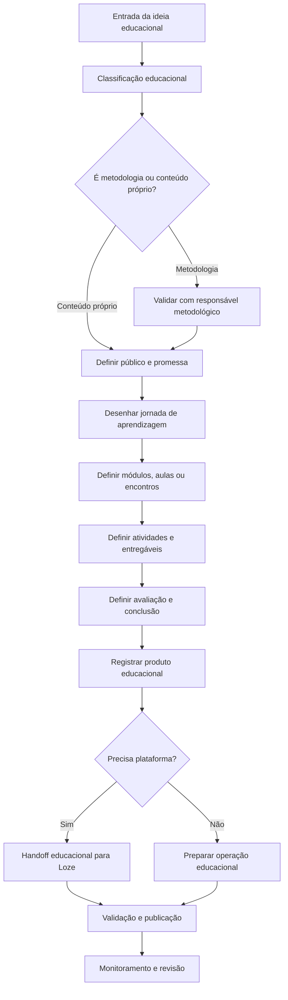
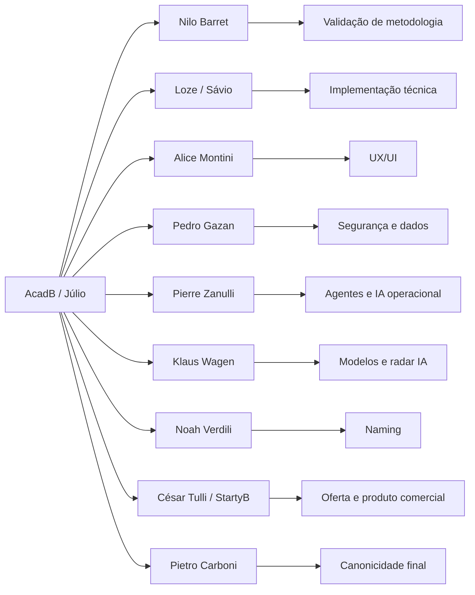
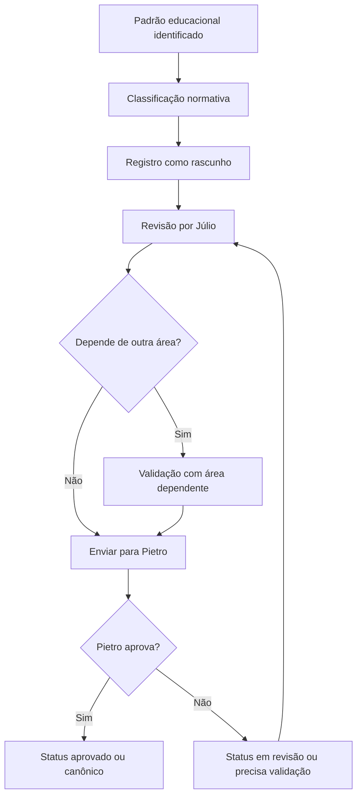
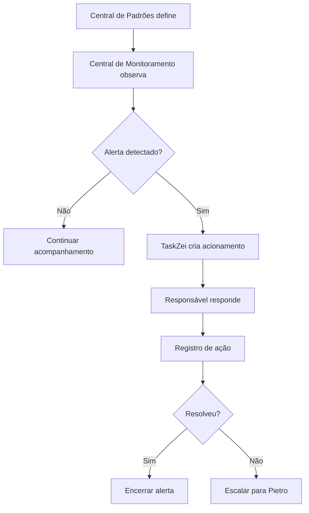
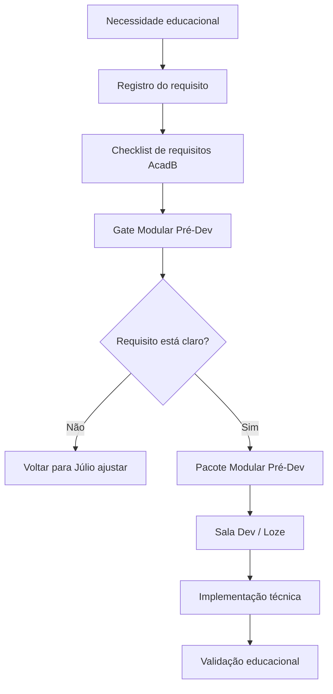

# Documento Mestre de Padrões — AcadB, Mentorias, Cursos e Trilhas — v1 — 06-06-2026

## Cabeçalho interno

| Campo | Informação |
|---|---|
| Documento | Documento Mestre de Padrões da Divisão |
| Divisão | AcadB, Mentorias, Cursos e Trilhas |
| Responsável | Júlio Mosqueira |
| Versão | v1 |
| Data da versão | 06-06-2026 |
| Status | candidato a documento-mãe da divisão |
| Formato | Markdown .md |
| Destino | Central de Padrões do SagB |
| Responsável pela validação final | Pietro Carboni |

---

## 1. Objetivo do documento

Este documento reúne, organiza e consolida os padrões da divisão **AcadB, Mentorias, Cursos e Trilhas** dentro da Central de Padrões do GrupoB / Loze no SagB.

A função deste documento é servir como documento-mãe da área educacional da AcadB, orientando a criação, revisão, publicação, acompanhamento, certificação e evolução de mentorias, cursos, trilhas, programas educacionais, formações, workshops, experiências de aprendizagem e produtos de conhecimento do GrupoB.

Este documento não é um guia genérico sobre como escrever documentos. Ele apresenta os padrões reais da divisão, com classificação normativa, dependências, lacunas, riscos, registros, fluxos, checklists, matrizes e decisões já tomadas.

A AcadB deve ser tratada como a plataforma educacional oficial do GrupoB, responsável por transformar conhecimento, metodologia, prática, mentoria, treinamento e experiência em aprendizagem organizada, aplicável, mensurável e escalável.

---

## 2. Escopo da divisão

A divisão **AcadB, Mentorias, Cursos e Trilhas** cobre os padrões relacionados a:

1. Mentorias.
2. Cursos.
3. Trilhas de aprendizagem.
4. Programas educacionais.
5. Formações.
6. Workshops.
7. Aulas.
8. Módulos de aprendizagem.
9. Certificações.
10. Materiais de apoio.
11. Exercícios práticos.
12. Avaliações.
13. Diagnósticos educacionais.
14. Experiência do aluno.
15. Jornada educacional.
16. Registro de evolução do aluno.
17. Encerramento de jornada.
18. Produtos educacionais gratuitos, pagos, corporativos e premium.
19. Requisitos educacionais para a plataforma AcadB.
20. Organização educacional de metodologias criadas pelo GrupoB.
21. Linhas educacionais sobre IA, agentes, automações, gestão, vendas, atendimento, liderança e operação.
22. Integração educacional com InstitutoB, 3forB, StartyB, PapoB e demais frentes quando houver conteúdo, trilha ou capacitação.

### Escopo operacional direto

Esta divisão define a lógica educacional. Ela responde à pergunta:

> Como transformar conhecimento, metodologia, treinamento, mentoria ou demanda prática em uma experiência de aprendizagem estruturada?

### Escopo de integração

Esta divisão também define requisitos educacionais que devem ser considerados por:

1. Loze / Sávio Codare, quando a experiência precisar virar sistema.
2. Alice Montini, quando a experiência precisar virar interface.
3. Pedro Gazan, quando houver dados sensíveis, certificados, progresso ou permissões.
4. Nilo Barret, quando houver metodologia, framework ou matriz intelectual.
5. Pierre Zanulli e Klaus Wagen, quando houver IA, agentes, automações ou modelos de IA.
6. César Tulli / StartyB, quando o produto educacional virar oferta comercial, venture ou produto premium.
7. Noah Verdili, quando houver naming de curso, programa, certificação ou trilha.
8. Pietro Carboni, quando algo precisar virar padrão oficial da Central de Padrões.

---

## 3. O que esta divisão define

Esta divisão define:

1. 🔵 Princípios educacionais da AcadB.
2. 🟣 Políticas de criação, publicação, revisão e certificação de produtos educacionais.
3. 🔴 Regras mínimas para mentorias, cursos, trilhas, programas, formações e workshops.
4. 🟠 Padrões de estrutura de curso, trilha, mentoria, programa, certificação e experiência do aluno.
5. 🟢 Protocolos reais para criação, publicação, certificação, encerramento e transformação de metodologia em produto educacional.
6. ⚙️ Processos de criação, produção, publicação, revisão, acompanhamento e arquivamento de produtos educacionais.
7. 🧩 Procedimentos operacionais para definir promessa, módulos, aulas, encontros, entregáveis, avaliação e evolução.
8. ✅ Checklists obrigatórios para criação, revisão, publicação, certificação e encerramento.
9. 📊 Matrizes para classificar tipos educacionais, níveis de aprendizagem, maturidade, origem de conteúdo, critérios de certificação e escada de produtos.
10. 🧾 Registros e evidências de produtos educacionais, evolução de alunos, certificados, decisões, versões e encerramentos.
11. ⚠️ Riscos educacionais ligados a falta de padrão, certificado sem critério, curso sem promessa, mentoria sem registro e plataforma sem requisito pedagógico.
12. 💡 Recomendações para evolução da AcadB como plataforma educacional e linha de produtos de conhecimento.
13. 📌 Decisões educacionais já tomadas neste chat.
14. ❓ Lacunas que dependem de validação de Pietro ou de outras áreas.
15. 🚨 Itens críticos para impedir retrabalho, duplicidade e mistura de escopo.

---

## 4. O que esta divisão não define

Esta divisão não define, de forma final ou profunda:

| Tema fora do escopo | Responsável principal | Como a AcadB participa |
|---|---|---|
| Metodologias, frameworks e matrizes intelectuais em si | Nilo Barret | Transforma em curso, trilha, mentoria ou programa educacional |
| Código, backend, banco de dados, APIs, deploy e arquitetura técnica | Loze / Sávio Codare | Define requisitos educacionais para o sistema |
| UX/UI visual, componentes, telas e design system | Alice Montini | Define a experiência de aprendizagem que precisa aparecer na interface |
| Segurança, acessos, permissões, LGPD, dados sensíveis e certificados seguros | Pedro Gazan | Define critérios educacionais e aciona validação de segurança |
| Agentes autônomos, orquestração de IA, tool use e operação com agentes | Pierre Zanulli | Cria treinamentos e trilhas sobre agentes, sem definir operação técnica |
| Modelos de IA, RAI, radar tecnológico e escolha técnica de LLMs | Klaus Wagen | Usa como fonte para conteúdos e formações sobre IA |
| Naming, disponibilidade e banco de marcas | Noah Verdili | Solicita validação de nomes de cursos, certificações e programas |
| Ventures, empresas, marcas e planos de negócio | César Tulli / StartyB | Estrutura cursos e produtos educacionais que podem virar oferta |
| Aprovação final de padrões oficiais | Pietro Carboni | Envia candidatos a padrão para validação final |

Regra de escopo:

> A AcadB ensina, estrutura e transforma conhecimento em aprendizagem. Ela não substitui a área dona do método, da tecnologia, da segurança, da marca ou da aprovação final.

---

## 5. Fontes analisadas

Foram consideradas as seguintes fontes e marcos do histórico deste chat:

1. Estrutura do Bloco da Área na Central de Padrões — Missão 1.
2. Auditoria e Revisão do Bloco Mentorias, Cursos, Trilhas, Programas Educacionais e Experiência de Aprendizagem — Missão 2.
3. Definição da AcadB como plataforma educacional oficial do GrupoB.
4. Definição de que a Loze desenvolve a plataforma AcadB.
5. Decisão de que KDB, AKDB, acadbee e CaddyB devem ser corrigidos para AcadB.
6. Discussões sobre dois sistemas iniciados da AcadB:
   - Sistema 1: antigo, visual, gamificado, com XP, ranking, badges, comunidade e notas.
   - Sistema 2: novo/Core LMS, com login, catálogo, player, progresso, quizzes e certificados.
7. Decisão de usar o Sistema 2 como base oficial do frontend e o Sistema 1 como fonte de gamificação.
8. Confirmação de que backend ainda não foi implementado.
9. Definição de estrutura externa `AcadB/` como produto e repositório `acadb_web/` como sistema/código.
10. Definição de `docs/` dentro do repositório como fonte técnica versionada.
11. Proposta de linha educacional de IA e agentes para AcadB.
12. Tese: **IA não é só prompt. IA bem aplicada vira colaborador digital, processo, sistema e vantagem competitiva.**
13. Proposta do MCD — Método Colaborador Digital.
14. Escada de produtos educacionais de IA: gratuito, live, workshop, curso, bootcamp, mentoria, programa premium e consultoria.
15. Conexões da AcadB com Jornada U.A.U., 3forB, InstitutoB, StartyB, PapoB, ConectaB, AGE e programas educacionais do ecossistema.
16. Modelo normativo da Central de Padrões: princípio, política, regra, padrão, protocolo, processo, procedimento, checklist, matriz, registro/evidência, risco, recomendação, decisão, dúvida/lacuna e crítico.

---

## 6. Síntese executiva

A divisão **AcadB, Mentorias, Cursos e Trilhas** já possui base suficiente para avançar como documento-mãe da área educacional do GrupoB, mas ainda não pode ser considerada canônica sem validação de Pietro Carboni.

A principal decisão estrutural é:

> **Nilo estrutura o método. Júlio transforma em experiência educacional. Loze desenvolve a plataforma. Pietro valida o padrão oficial.**

A AcadB deve ser organizada como uma plataforma educacional única, com cursos, trilhas, mentorias, programas, formações, certificações, produtos educacionais e linhas de conhecimento conectadas ao ecossistema GrupoB.

A frente de IA e agentes deve ser tratada como uma linha educacional estratégica da AcadB, sem assumir a responsabilidade técnica pelos agentes. A AcadB ensina empresas e pessoas a compreender, estruturar e aplicar IA com método, documentação, limites, segurança e responsabilidade.

A estrutura atual precisa priorizar:

1. Taxonomia educacional.
2. Registro de Produto Educacional.
3. Política de certificação.
4. Requisitos educacionais para plataforma.
5. Governança de versões e status.
6. Operação acadêmica.
7. Experiência do aluno.
8. Linha educacional de IA e agentes.
9. Matriz de dependências.
10. Integração com Central de Monitoramento, TaskZei, Biblioteca de Módulos Base e Sala Dev.

---

## 7. Mapa visual da divisão

```text
AcadB, Mentorias, Cursos e Trilhas
│
├── Núcleo Educacional
│   ├── Mentorias
│   ├── Cursos
│   ├── Trilhas
│   ├── Programas Educacionais
│   ├── Workshops
│   ├── Formações
│   └── Certificações
│
├── Núcleo de Experiência
│   ├── Jornada do aluno
│   ├── Onboarding
│   ├── Acompanhamento
│   ├── Suporte educacional
│   ├── Feedback
│   └── Encerramento
│
├── Núcleo de Conteúdo
│   ├── Metodologias do GrupoB
│   ├── Conteúdos da 3forB
│   ├── Conteúdos do InstitutoB
│   ├── Conteúdos da StartyB
│   ├── PapoB
│   ├── IA e agentes
│   └── Treinamentos de ferramentas
│
├── Núcleo de Plataforma
│   ├── Requisitos educacionais
│   ├── Catálogo
│   ├── Player
│   ├── Progresso
│   ├── Quizzes
│   ├── Certificados
│   ├── Gamificação
│   └── Painel do aluno
│
└── Núcleo de Governança
    ├── Status
    ├── Versão
    ├── Registros
    ├── Evidências
    ├── Decisões
    ├── Lacunas
    └── Validações
```

### Quadro de síntese da divisão

| Camada | Pergunta que responde | Principal saída |
|---|---|---|
| Estratégica | Por que esse produto educacional existe? | Promessa, público, objetivo e relação com GrupoB |
| Pedagógica | Como a pessoa aprende e aplica? | Jornada, módulos, aulas, encontros, atividades |
| Operacional | Como isso será executado? | Processos, checklists, registros e responsáveis |
| Tecnológica | Como isso aparece no sistema? | Requisitos para Loze / AcadB Web |
| Governança | Como controlar versão, status e validade? | Registros, decisões, monitoramento e validações |

---

## 8. Princípios da área

| Código | Princípio | Descrição | Status | Prioridade |
|---|---|---|---|---|
| ACADB-PRI-001 | 🔵 Transformação clara | Todo produto educacional deve declarar qual transformação pretende gerar. | candidato a canônico | crítico |
| ACADB-PRI-002 | 🔵 Aplicabilidade | A AcadB deve priorizar conhecimento aplicável, não teoria solta. | candidato a canônico | crítico |
| ACADB-PRI-003 | 🔵 Jornada | Todo produto educacional precisa ter começo, meio, fim e progressão. | candidato a canônico | crítico |
| ACADB-PRI-004 | 🔵 Evidência | Toda aprendizagem relevante deve gerar evidência de conclusão, aplicação ou evolução. | candidato a canônico | crítico |
| ACADB-PRI-005 | 🔵 Coerência metodológica | Quando um curso nasce de uma metodologia, deve respeitar a essência do método. | candidato a canônico | crítico |
| ACADB-PRI-006 | 🔵 Experiência do aluno | Aprendizagem é conteúdo, condução, clareza, ritmo, suporte e encerramento. | candidato a canônico | importante |
| ACADB-PRI-007 | 🔵 Versão | Todo produto educacional precisa de versão, status e responsável. | candidato a canônico | crítico |
| ACADB-PRI-008 | 🔵 Evolução contínua | Cursos, trilhas e mentorias devem ser revisados com dados, feedback e mudanças de contexto. | candidato a canônico | importante |
| ACADB-PRI-009 | 🔵 Unidade AcadB | AcadB é o nome oficial; KDB, AKDB, acadbee e CaddyB são variações legadas ou erros. | candidato a canônico | crítico |
| ACADB-PRI-010 | 🔵 Ensino com responsabilidade | A AcadB deve ensinar IA, negócios e metodologias com clareza, limite, segurança e aplicabilidade. | em revisão | importante |

---

## 9. Políticas da área

| Código | Política | Descrição | Status | Prioridade |
|---|---|---|---|---|
| ACADB-POL-001 | 🟣 Política de centralização educacional | Produtos educacionais oficiais do GrupoB devem ser catalogados pela AcadB. | candidato a canônico | crítico |
| ACADB-POL-002 | 🟣 Política de separação método/experiência | Metodologia pertence ao responsável metodológico; experiência educacional pertence à AcadB. | candidato a canônico | crítico |
| ACADB-POL-003 | 🟣 Política de documentação mínima | Nenhum produto educacional deve avançar sem registro mínimo. | candidato a canônico | crítico |
| ACADB-POL-004 | 🟣 Política de certificação | Certificados só devem existir com critério claro de conclusão, aprovação ou competência. | em revisão | crítico |
| ACADB-POL-005 | 🟣 Política de revisão de conteúdo | Todo conteúdo oficial precisa de periodicidade ou gatilho de revisão. | em revisão | importante |
| ACADB-POL-006 | 🟣 Política de dependências | Todo produto que tocar outra área deve registrar a dependência. | candidato a canônico | crítico |
| ACADB-POL-007 | 🟣 Política de status | Todo produto educacional deve ter status permitido: rascunho, em revisão, candidato a canônico, aprovado, canônico, legado, substituído, suspenso ou precisa validação. | candidato a canônico | crítico |
| ACADB-POL-008 | 🟣 Política de plataforma | A AcadB define requisitos educacionais; a Loze define implementação técnica. | candidato a canônico | crítico |
| ACADB-POL-009 | 🟣 Política de IA educacional | Treinamentos de IA devem diferenciar prompt, agente, automação, sistema, governança e segurança. | em revisão | importante |
| ACADB-POL-010 | 🟣 Política de produto comercial | Produtos educacionais vendáveis precisam de validação com StartyB/César quando envolver oferta, preço, mercado ou venture. | em revisão | importante |

---

## 10. Regras centrais da área

| Código | Regra | Descrição | Status | Prioridade |
|---|---|---|---|---|
| ACADB-REGRA-001 | 🔴 Regra da promessa educacional | Todo produto educacional precisa ter promessa clara. | candidato a canônico | crítico |
| ACADB-REGRA-002 | 🔴 Regra do público definido | Não existe produto educacional oficial sem público-alvo definido. | candidato a canônico | crítico |
| ACADB-REGRA-003 | 🔴 Regra da estrutura mínima | Produto educacional precisa ter nome, tipo, responsável, público, promessa, objetivo, formato, duração, estrutura, entregáveis, critério, status e versão. | candidato a canônico | crítico |
| ACADB-REGRA-004 | 🔴 Regra da não oficialização sem registro | Nada deve ser chamado de oficial sem registro. | candidato a canônico | crítico |
| ACADB-REGRA-005 | 🔴 Regra da dependência metodológica | Produto educacional derivado de metodologia exige validação do dono metodológico. | candidato a canônico | crítico |
| ACADB-REGRA-006 | 🔴 Regra do encerramento | Mentoria, formação e programa precisam ter encerramento definido. | candidato a canônico | importante |
| ACADB-REGRA-007 | 🔴 Regra da plataforma temporária | Enquanto não houver backend, login, progresso, quiz e certificado são provisórios. | em revisão | crítico |
| ACADB-REGRA-008 | 🔴 Regra de nome oficial | Usar AcadB como nome oficial em documentos. | candidato a canônico | crítico |
| ACADB-REGRA-009 | 🔴 Regra de certificação | Certificado sem critério não deve ser emitido. | em revisão | crítico |
| ACADB-REGRA-010 | 🔴 Regra de versão | Toda mudança relevante em curso, trilha ou programa deve atualizar versão ou histórico. | em revisão | importante |

---

## 11. Padrões oficiais e candidatos a padrão

### 11.1 🟠 Padrão de Produto Educacional Oficial

Um produto educacional oficial da AcadB deve conter, no mínimo:

1. Nome.
2. Tipo educacional.
3. Categoria.
4. Responsável.
5. Origem.
6. Público-alvo.
7. Promessa.
8. Objetivo de aprendizagem.
9. Formato.
10. Duração.
11. Estrutura de conteúdo.
12. Entregáveis.
13. Atividades ou exercícios.
14. Critério de conclusão.
15. Critério de certificação, se houver.
16. Status.
17. Versão.
18. Dependências.
19. Destino recomendado.
20. Evidência de validação.

Status: **candidato a canônico**.

### 11.2 🟠 Padrão de Mentoria Oficial

Mentoria oficial é uma jornada de desenvolvimento orientada por mentor, com diagnóstico, objetivo, encontros, acompanhamento, entregáveis, registro de evolução e encerramento.

Campos mínimos:

1. Nome da mentoria.
2. Mentor principal.
3. Responsável AcadB.
4. Público-alvo.
5. Dor/desafio/necessidade atendida.
6. Promessa.
7. Diagnóstico inicial.
8. Duração.
9. Número de encontros.
10. Estrutura dos encontros.
11. Entregáveis.
12. Exercícios.
13. Acompanhamento.
14. Registro de evolução.
15. Critérios de sucesso.
16. Encerramento.
17. Status.
18. Versão.

Status: **candidato a canônico**.

### 11.3 🟠 Padrão de Curso Oficial

Curso é uma unidade educacional organizada em módulos e aulas, com objetivo de aprendizagem específico, materiais, atividades e critério de conclusão.

Campos mínimos:

1. Nome.
2. Categoria.
3. Público-alvo.
4. Nível.
5. Promessa.
6. Objetivo.
7. Pré-requisitos.
8. Módulos.
9. Aulas.
10. Materiais.
11. Atividades.
12. Avaliação.
13. Critério de conclusão.
14. Certificado.
15. Próximo passo recomendado.
16. Status.
17. Versão.

Status: **candidato a canônico**.

### 11.4 🟠 Padrão de Trilha Oficial

Trilha é uma sequência organizada de cursos, módulos, atividades, mentorias ou materiais que conduzem o aluno de um nível de entrada a um nível de saída.

Campos mínimos:

1. Nome.
2. Público-alvo.
3. Nível de entrada.
4. Nível de saída.
5. Objetivo da trilha.
6. Componentes incluídos.
7. Ordem recomendada.
8. Atividades obrigatórias.
9. Critério de conclusão.
10. Certificação.
11. Tempo estimado.
12. Status.
13. Versão.

Status: **candidato a canônico**.

### 11.5 🟠 Padrão de Programa Educacional

Programa educacional é uma jornada mais ampla, com múltiplos componentes, podendo incluir curso, encontros, mentoria, diagnóstico, atividades, acompanhamento, avaliação, entregas e certificação.

Status: **candidato a canônico**.

### 11.6 🟠 Padrão de Linha Educacional de IA e Agentes

A AcadB deve tratar IA e agentes como linha educacional própria, baseada na tese:

> IA não é só prompt. IA bem aplicada vira colaborador digital, processo, sistema e vantagem competitiva.

Elementos obrigatórios:

1. Diferença entre prompt, agente, automação e sistema.
2. Agente como colaborador digital.
3. Camadas do agente: competência, comportamento/cultura, segurança/limites.
4. Documentos como material de estudo do agente.
5. Segurança, responsabilidade, logs e melhoria contínua.
6. Exercício prático de criação de ficha de agente.

Status: **em revisão**.

### 11.7 🟠 Padrão de Requisitos Educacionais para Plataforma

A AcadB deve fornecer à Loze os campos, regras, fluxos e critérios educacionais necessários para o sistema.

A Loze não deve implementar módulos acadêmicos sem requisitos mínimos de:

1. Curso.
2. Trilha.
3. Aula.
4. Progresso.
5. Quiz.
6. Certificado.
7. Status.
8. Versão.
9. Responsável.
10. Evidência.

Status: **em revisão**.

---

## 12. Protocolos reais da área

Protocolo só existe quando houver situação específica, sequência obrigatória, responsável e saída esperada.

| Código | Protocolo | Quando usar | Responsável | Saída esperada | Status |
|---|---|---|---|---|---|
| ACADB-PRO-001 | 🟢 Protocolo de Criação de Produto Educacional | Quando ideia, metodologia ou demanda virar curso, trilha, mentoria, workshop, formação ou programa | Júlio / AcadB | Registro de Produto Educacional criado | candidato a canônico |
| ACADB-PRO-002 | 🟢 Protocolo de Transformação de Metodologia em Produto Educacional | Quando método do Nilo ou de outra área virar experiência educacional | Júlio + dono da metodologia | Produto educacional validado metodologicamente | em revisão |
| ACADB-PRO-003 | 🟢 Protocolo de Publicação na AcadB | Antes de publicar na plataforma | Júlio + Loze | Produto publicado com requisitos mínimos | em revisão |
| ACADB-PRO-004 | 🟢 Protocolo de Certificação | Antes de liberar certificado | Júlio + Pedro + Loze | Certificação validada | em revisão |
| ACADB-PRO-005 | 🟢 Protocolo de Encerramento de Mentoria | Ao finalizar mentoria | Mentor / Júlio | Registro de encerramento | candidato a canônico |
| ACADB-PRO-006 | 🟢 Protocolo de Encerramento de Programa | Ao finalizar programa educacional | Responsável do programa | Encerramento, certificado e próximos passos | em revisão |
| ACADB-PRO-007 | 🟢 Protocolo de Revisão de Conteúdo | Quando conteúdo vencer, ficar obsoleto ou receber feedback crítico | Júlio / responsável do conteúdo | Nova versão ou arquivamento | em revisão |
| ACADB-PRO-008 | 🟢 Protocolo de Handoff Educacional para Loze | Quando requisito educacional precisar virar sistema | Júlio + Sávio | Pacote de requisitos educacionais | em revisão |

### Sequência base do Protocolo de Criação de Produto Educacional

1. Registrar a ideia educacional.
2. Classificar o tipo educacional.
3. Definir público-alvo.
4. Definir promessa.
5. Definir objetivo de aprendizagem.
6. Estruturar jornada.
7. Definir módulos, aulas ou encontros.
8. Definir exercícios e entregáveis.
9. Definir avaliação.
10. Definir critério de conclusão.
11. Verificar dependências.
12. Registrar versão.
13. Definir status.
14. Enviar para validação quando aplicável.

---

## 13. Processos da área

| Código | Processo | Entrada | Saída | Status |
|---|---|---|---|---|
| ACADB-PROC-001 | ⚙️ Processo de criação de curso | Ideia, demanda ou metodologia | Curso estruturado e registrado | candidato a canônico |
| ACADB-PROC-002 | ⚙️ Processo de criação de mentoria | Demanda de desenvolvimento | Mentoria estruturada e registrada | candidato a canônico |
| ACADB-PROC-003 | ⚙️ Processo de criação de trilha | Necessidade de progressão educacional | Trilha com ordem e critérios | candidato a canônico |
| ACADB-PROC-004 | ⚙️ Processo de criação de programa educacional | Transformação mais ampla | Programa com fases, entregáveis e encerramento | em revisão |
| ACADB-PROC-005 | ⚙️ Processo de publicação na plataforma | Produto educacional aprovado | Publicação na AcadB | em revisão |
| ACADB-PROC-006 | ⚙️ Processo de revisão e atualização de conteúdo | Feedback, vencimento ou mudança de contexto | Nova versão, suspensão ou substituição | em revisão |
| ACADB-PROC-007 | ⚙️ Processo de coleta de feedback | Conclusão, aula, encontro ou turma | Registro de feedback | em revisão |
| ACADB-PROC-008 | ⚙️ Processo de arquivamento de produto educacional | Produto obsoleto ou substituído | Status legado, suspenso ou substituído | em revisão |
| ACADB-PROC-009 | ⚙️ Processo de handoff para Loze | Requisito educacional | Pacote para desenvolvimento | em revisão |
| ACADB-PROC-010 | ⚙️ Processo de criação de linha educacional de IA | Tema estratégico de IA | Trilha, curso, workshop ou programa de IA | em revisão |

---

## 14. Procedimentos operacionais

### 🧩 14.1 Procedimento para definir promessa educacional

1. Identificar o público.
2. Identificar o desafio principal.
3. Definir o estado inicial do aluno.
4. Definir o estado final esperado.
5. Escrever a promessa em linguagem simples.
6. Validar se a promessa é realista.
7. Confirmar qual evidência prova a transformação.

Modelo:

> Este produto ajuda [público] a sair de [estado atual] para [estado desejado], por meio de [jornada/metodologia], gerando [resultado prático].

### 🧩 14.2 Procedimento para estruturar módulos

1. Listar tudo que o aluno precisa aprender.
2. Separar fundamentos, prática e aplicação.
3. Ordenar do simples ao complexo.
4. Agrupar por módulos.
5. Definir objetivo de cada módulo.
6. Definir atividade de cada módulo.
7. Definir evidência de aprendizagem.

### 🧩 14.3 Procedimento para medir evolução do aluno

1. Registrar diagnóstico inicial.
2. Definir indicador de progresso.
3. Registrar participação, conclusão ou entrega.
4. Aplicar atividade, quiz ou avaliação.
5. Comparar estado inicial e estado final.
6. Registrar feedback.
7. Definir próximo passo.

### 🧩 14.4 Procedimento para transformar metodologia em curso

1. Receber documento metodológico base.
2. Identificar princípios, etapas e aplicações.
3. Validar essência com responsável metodológico.
4. Traduzir em jornada de aprendizagem.
5. Criar módulos.
6. Criar aulas.
7. Criar exercícios.
8. Criar entregáveis.
9. Definir avaliação.
10. Registrar dependência.

### 🧩 14.5 Procedimento para preparar requisito educacional para Loze

1. Identificar necessidade da plataforma.
2. Descrever regra educacional.
3. Definir campos necessários.
4. Definir estados possíveis.
5. Definir ações do aluno.
6. Definir ações do gestor/admin.
7. Definir critérios de conclusão.
8. Definir evidências.
9. Registrar dependência com Loze.
10. Enviar para Gate Modular Pré-Dev quando aplicável.

---

## 15. Checklists obrigatórios

### ✅ Checklist de Criação de Mentoria

- [ ] Nome da mentoria definido.
- [ ] Público-alvo definido.
- [ ] Promessa clara.
- [ ] Diagnóstico inicial definido.
- [ ] Duração definida.
- [ ] Número de encontros definido.
- [ ] Estrutura dos encontros definida.
- [ ] Entregáveis definidos.
- [ ] Exercícios ou tarefas definidos.
- [ ] Forma de acompanhamento definida.
- [ ] Critérios de sucesso definidos.
- [ ] Encerramento definido.
- [ ] Responsável definido.
- [ ] Status definido.
- [ ] Versão definida.
- [ ] Dependências registradas.

### ✅ Checklist de Criação de Curso

- [ ] Objetivo de aprendizagem claro.
- [ ] Público-alvo definido.
- [ ] Nível definido.
- [ ] Promessa definida.
- [ ] Módulos organizados.
- [ ] Aulas descritas.
- [ ] Materiais definidos.
- [ ] Atividades definidas.
- [ ] Avaliação definida.
- [ ] Critério de conclusão definido.
- [ ] Certificado definido ou descartado.
- [ ] Próximo passo recomendado.
- [ ] Responsável definido.
- [ ] Status definido.
- [ ] Versão definida.

### ✅ Checklist de Criação de Trilha

- [ ] Nível de entrada definido.
- [ ] Nível de saída definido.
- [ ] Cursos ou módulos incluídos.
- [ ] Sequência definida.
- [ ] Pré-requisitos definidos.
- [ ] Atividades obrigatórias definidas.
- [ ] Critério de conclusão definido.
- [ ] Certificação definida.
- [ ] Tempo estimado definido.
- [ ] Responsável definido.
- [ ] Status e versão definidos.

### ✅ Checklist Pré-Publicação na AcadB

- [ ] Produto registrado.
- [ ] Promessa validada.
- [ ] Público validado.
- [ ] Estrutura revisada.
- [ ] Materiais anexados.
- [ ] Critérios de conclusão definidos.
- [ ] Certificado validado, se houver.
- [ ] Dependências resolvidas ou registradas.
- [ ] Status atualizado.
- [ ] Versão registrada.
- [ ] Handoff para Loze realizado, se aplicável.
- [ ] Validação de Pietro solicitada quando aplicável.

### ✅ Checklist de Certificação

- [ ] Tipo de certificado definido.
- [ ] Critério de emissão definido.
- [ ] Evidência exigida definida.
- [ ] Registro de certificação previsto.
- [ ] Segurança de dados validada com Pedro, se necessário.
- [ ] Implementação técnica alinhada com Loze, se necessário.
- [ ] Texto do certificado revisado.
- [ ] Versão do produto associada.

---

## 16. Matrizes obrigatórias

### 📊 Matriz de Classificação Educacional

| Tipo | Definição | Quando usar | Evidência esperada |
|---|---|---|---|
| Aula | Unidade mínima de ensino | Tema pequeno e específico | Aula concluída, atividade ou registro |
| Curso | Conjunto organizado de aulas | Objetivo de aprendizagem específico | Conclusão, avaliação ou certificado |
| Trilha | Sequência de cursos, aulas ou atividades | Progressão por etapas | Progresso completo da trilha |
| Mentoria | Jornada guiada por mentor | Desenvolvimento acompanhado | Registro de evolução e entregáveis |
| Workshop | Encontro prático concentrado | Aplicação rápida | Exercício ou entrega realizada |
| Formação | Jornada robusta de capacitação | Preparação para competência ou função | Avaliação, prática e certificado |
| Programa educacional | Estrutura ampla com múltiplos componentes | Transformação maior | Plano, entregas, acompanhamento e conclusão |
| Certificação | Reconhecimento formal | Validação de conclusão ou competência | Certificado emitido |
| Produto educacional oficial | Produto validado e registrado | Entrada no catálogo AcadB | Registro, versão e status oficial |

### 📊 Matriz Curso x Trilha x Programa x Mentoria

| Critério | Curso | Trilha | Programa | Mentoria |
|---|---|---|---|---|
| Foco | Ensinar tema específico | Conduzir sequência | Transformar por jornada ampla | Desenvolver com acompanhamento |
| Duração | Curta a média | Média | Média a longa | Variável |
| Condução | Autônoma ou leve | Sequencial | Guiada por fases | Guiada por mentor |
| Avaliação | Quiz ou atividade | Conclusão por etapas | Entregas e progresso | Evolução e aplicação |
| Certificação | Possível | Recomendável | Recomendável | Opcional |
| Registro | Curso | Trilha | Programa | Mentoria |

### 📊 Matriz de Maturidade do Produto Educacional

| Nível | Característica | Status sugerido |
|---|---|---|
| N0 | Ideia educacional bruta | rascunho |
| N1 | Produto registrado | em revisão |
| N2 | Jornada desenhada | em revisão |
| N3 | Conteúdo produzido | candidato a canônico |
| N4 | Produto publicado | aprovado |
| N5 | Produto validado por dados | candidato a canônico |
| N6 | Produto validado por Pietro | canônico |
| N7 | Produto antigo ou substituído | legado / substituído |

### 📊 Matriz de Escada de Produtos Educacionais

| Degrau | Produto | Objetivo | Ticket provável | Observação |
|---|---|---|---|---|
| 0 | Conteúdo gratuito | Atrair e educar mercado | Gratuito | Posts, vídeos, e-book, checklist |
| 1 | Live introdutória | Gerar consciência | Baixo | Entrada para workshop |
| 2 | Workshop pago | Primeira transformação prática | Baixo/médio | Produto rápido de vender |
| 3 | Curso prático | Ensinar método aplicável | Médio | Gravado ou híbrido |
| 4 | Bootcamp | Prática guiada em turma | Médio/alto | Forte para autoridade |
| 5 | Mentoria em grupo | Acompanhamento e aplicação | Alto | Produto de recorrência ou turma |
| 6 | Programa premium | Transformação empresarial | Alto/premium | Consultivo e estratégico |
| 7 | Consultoria/implantação | Resultado acompanhado | Premium | Depende de César/StartyB e Loze quando houver sistema |

---

## 17. Registros e evidências obrigatórias

| Código | Registro/evidência | Finalidade | Status | Prioridade |
|---|---|---|---|---|
| ACADB-REG-001 | 🧾 Registro de Produto Educacional | Cadastro mestre de qualquer produto educacional | candidato a canônico | crítico |
| ACADB-REG-002 | 🧾 Registro de Mentoria | Cadastro de mentorias oficiais | candidato a canônico | crítico |
| ACADB-REG-003 | 🧾 Registro de Curso | Cadastro de cursos oficiais | candidato a canônico | crítico |
| ACADB-REG-004 | 🧾 Registro de Trilha | Cadastro de trilhas oficiais | candidato a canônico | crítico |
| ACADB-REG-005 | 🧾 Registro de Programa Educacional | Cadastro de programas | candidato a canônico | crítico |
| ACADB-REG-006 | 🧾 Registro de Evolução do Aluno | Acompanhar progresso e aplicação | em revisão | importante |
| ACADB-REG-007 | 🧾 Registro de Feedback do Aluno | Alimentar melhoria contínua | em revisão | importante |
| ACADB-REG-008 | 🧾 Registro de Certificação | Evidenciar emissão de certificado | em revisão | crítico |
| ACADB-REG-009 | 🧾 Registro de Encerramento | Formalizar conclusão de mentoria/programa | em revisão | importante |
| ACADB-REG-010 | 🧾 Registro de Decisão Educacional | Registrar decisões da divisão | em revisão | crítico |
| ACADB-REG-011 | 🧾 Histórico de Versões | Controlar mudanças em produtos educacionais | em revisão | crítico |
| ACADB-REG-012 | 🧾 Registro de Transferência do Chat | Evidenciar marco de transferência para base local | em revisão | importante |

### Campos mínimos do Registro de Produto Educacional

| Campo | Obrigatório? | Observação |
|---|---|---|
| Nome | Sim | Nome oficial ou provisório |
| Tipo educacional | Sim | Aula, curso, trilha, mentoria, workshop, formação, programa, certificação |
| Categoria | Sim | Categoria AcadB ou origem |
| Responsável | Sim | Pessoa ou área |
| Origem | Sim | Nilo, 3forB, InstitutoB, StartyB, IA, PapoB, etc. |
| Público-alvo | Sim | Perfil do aluno |
| Promessa | Sim | Transformação prometida |
| Objetivo | Sim | Objetivo de aprendizagem |
| Formato | Sim | Gravado, ao vivo, híbrido, in company, mentoria, etc. |
| Duração | Sim | Tempo estimado |
| Estrutura | Sim | Módulos, aulas, encontros ou fases |
| Entregáveis | Sim | Materiais, planos, fichas, exercícios |
| Critério de conclusão | Sim | Progresso, presença, entrega, quiz, aprovação |
| Certificação | Sim | Sim, não ou precisa validação |
| Status | Sim | Status permitido |
| Versão | Sim | v0.1, v1, v2 etc. |
| Dependências | Sim | Outras áreas envolvidas |

---

## 18. Fluxos Mermaid da divisão

### 18.1 Fluxo geral de criação de produto educacional



### 18.2 Handoff com outras áreas



### 18.3 Fluxo de aprovação de padrão educacional



### 18.4 Fluxo de monitoramento educacional



### 18.5 Fluxo de requisitos educacionais para Sala Dev



---

## 19. Dependências com outras áreas

| Tema | Depende de quem | Motivo | Tipo de dependência | Arquivo/registro sugerido |
|---|---|---|---|---|
| Transformar metodologia em curso | Nilo Barret | Validar essência metodológica | Metodológica | `dependencias_com_nilo_barret.md` |
| Implementar plataforma AcadB | Loze / Sávio Codare | Código, módulos, banco, frontend/backend | Técnica | `dependencias_com_loze_savio_codare.md` |
| Criar interface do aluno | Alice Montini | UX/UI e componentes visuais | UX/UI | `dependencias_com_alice_montini.md` |
| Progresso, certificados e dados | Pedro Gazan | LGPD, segurança e permissões | Segurança | `dependencias_com_pedro_gazan.md` |
| Treinamentos sobre agentes | Pierre Zanulli | Agentes autônomos e IA operacional | IA operacional | `dependencias_com_pierre_zanulli.md` |
| Modelos de IA e radar | Klaus Wagen | Escolha e atualização de modelos e ferramentas | IA/modelos | `dependencias_com_klaus_wagen.md` |
| Nome de curso/programa | Noah Verdili | Naming e disponibilidade | Naming | `dependencias_com_noah_verdili.md` |
| Produto educacional vendável | César Tulli / StartyB | Oferta, mercado, preço e venture | Comercial/negócio | `dependencias_com_cesar_tulli_startyb.md` |
| Padrão oficial | Pietro Carboni | Validação final | Governança | `dependencias_com_pietro_carboni.md` |
| Programas sociais | InstitutoB | Público social, gratuidade, impacto e empregabilidade | Social/educacional | `dependencias_com_institutob.md` |
| Treinamentos de clientes | 3forB | Aplicação em clientes, vendas, atendimento e expansão | Comercial/operacional | `dependencias_com_3forb.md` |
| Conteúdo complementar | PapoB | Podcast, entrevistas, conteúdos de apoio | Conteúdo | `dependencias_com_papob.md` |

---

## 20. Conflitos de escopo

| Conflito | Risco | Correção proposta | Status |
|---|---|---|---|
| Metodologia x curso | AcadB documentar metodologia que pertence ao Nilo | Nilo define método; AcadB define experiência educacional | candidato a canônico |
| Plataforma x experiência educacional | Loze criar tela sem lógica educacional ou AcadB tentar decidir arquitetura técnica | AcadB define requisito; Loze implementa | em revisão |
| UX visual x jornada educacional | Confundir interface com aprendizagem | Júlio define jornada; Alice define interface | em revisão |
| Certificação x segurança | Certificado visual sem controle de dados | Júlio define critério; Pedro valida segurança; Loze implementa | em revisão |
| IA educacional x agentes operacionais | AcadB assumir operação de agentes | AcadB ensina; Pierre/Klaus validam tecnologia | em revisão |
| Produto educacional x produto comercial | AcadB definir preço/mercado sem StartyB | Júlio estrutura educação; César valida oferta | em revisão |
| Gamificação educacional x decoração visual | XP/badges sem relação com aprendizagem | Júlio define regra educacional; Alice/Loze implementam | em revisão |
| InstitutoB x AcadB | Misturar programa social com produto pago | Definir origem, público, acesso e política | precisa validação |

---

## 21. Riscos se os padrões não forem seguidos

| Risco | Causa provável | Impacto | Como prevenir | Quem acompanha |
|---|---|---|---|---|
| Curso sem promessa clara | Falta de registro de produto educacional | Baixa percepção de valor | Exigir Registro de Produto Educacional | Júlio |
| Mentoria virar conversa solta | Ausência de diagnóstico, encontros e registros | Perda de evidência de evolução | Usar checklist de mentoria e registro de evolução | Júlio / mentor |
| Certificado sem valor | Emissão sem critério claro | Enfraquecimento da AcadB | Política de certificação | Júlio + Pedro |
| Plataforma bonita, mas fraca educacionalmente | Desenvolvimento sem requisitos educacionais | Retrabalho técnico e baixa aprendizagem | Handoff educacional para Loze | Júlio + Sávio |
| Metodologia distorcida | Curso criado sem validação do Nilo | Perda de integridade intelectual | Protocolo de transformação de metodologia | Júlio + Nilo |
| IA virar curso genérico de prompt | Falta de tese própria | Perda de diferenciação | Linha MCD / Colaborador Digital | Júlio + Pierre + Klaus |
| Conteúdo obsoleto | Sem revisão de versão | Informação desatualizada | Política de revisão de conteúdo | Júlio |
| Dados de alunos expostos | Falta de validação de segurança | Risco jurídico e reputacional | Acionar Pedro Gazan | Pedro + Loze |
| Produto educacional mal vendido | Oferta sem validação comercial | Baixa conversão | Acionar César/StartyB | Júlio + César |
| Duplicidade de nomes | Falta de naming | Confusão de catálogo | Acionar Noah | Júlio + Noah |
| Decisão perdida | Falta de registro | Retrabalho e conflito | Registro de Decisão Educacional | Júlio + Pietro |

---

## 22. O que deve ser monitorado pela Central de Monitoramento

A lógica é:

> Central de Padrões define. Central de Monitoramento observa. TaskZei aciona. Responsável responde.

| Item a monitorar | Por que monitorar | Origem do dado | Responsável | Ação se der alerta |
|---|---|---|---|---|
| Curso sem versão | Evitar conteúdo sem controle | Registro de Curso | Júlio | Criar ou atualizar versão |
| Trilha sem critério de conclusão | Evitar progresso indefinido | Registro de Trilha | Júlio | Definir critério |
| Certificado sem evidência | Proteger credibilidade | Registro de Certificação | Júlio + Pedro | Suspender certificado até validação |
| Produto educacional sem responsável | Evitar abandono | Registro de Produto Educacional | Júlio | Designar responsável |
| Conteúdo vencido | Evitar obsolescência | Histórico de versões | Júlio | Abrir revisão |
| Dependência não resolvida | Evitar bloqueio com outras áreas | Matriz de dependências | Júlio | Acionar área responsável |
| Produto publicado sem checklist | Evitar publicação incompleta | Checklist pré-publicação | Júlio | Abrir TaskZei de correção |
| Requisito enviado à Loze sem clareza | Evitar retrabalho em dev | Pacote Modular Pré-Dev | Júlio + Sávio | Retornar para ajuste |
| Curso de IA sem validação técnica | Evitar conteúdo raso ou incorreto | Registro de produto IA | Júlio + Pierre/Klaus | Validar antes de publicar |
| Mentoria sem encerramento | Evitar jornada aberta sem conclusão | Registro de Encerramento | Mentor / Júlio | Agendar encerramento |
| Produto com status precisa validação há muito tempo | Evitar fila parada | Status da área | Júlio + Pietro | Revisar ou escalar |
| Decisão educacional sem registro | Preservar histórico | Registro de decisão | Júlio | Criar registro retroativo |

---

## 23. Relação com Biblioteca de Módulos Base, se aplicável

Esta divisão possui relação direta com a **Biblioteca de Módulos Base Reutilizáveis do SagB**, porque muitos padrões educacionais da AcadB deverão virar módulos reutilizáveis dentro da plataforma e do ecossistema SagB.

### Módulos base que podem nascer desta divisão

| Módulo base | Origem educacional | Finalidade |
|---|---|---|
| Cadastro de Produto Educacional | Registro de Produto Educacional | Criar cursos, trilhas, mentorias e programas no sistema |
| Catálogo de Cursos | Taxonomia AcadB | Exibir e classificar produtos educacionais |
| Player de Aulas | Curso e aula | Permitir consumo de conteúdo |
| Progresso do Aluno | Registro de evolução | Medir conclusão e avanço |
| Quiz e Avaliação | Critérios de aprendizagem | Validar conhecimento |
| Certificados | Política de certificação | Emitir comprovação com critério |
| Gamificação Educacional | XP, badges, ranking | Estimular engajamento sem virar decoração |
| Comunidade | Experiência do aluno | Apoiar interação e aprendizagem social |
| Painel Admin Educacional | Operação AcadB | Gerir cursos, alunos e status |
| Empresas, Turmas e Licenças | Produto corporativo | Atender B2B e in company |
| Agente Tutor Educacional | IA educacional | Apoio ao aluno, dependente de Pierre/Klaus |

### Gate Modular Pré-Dev

Antes de um requisito educacional entrar na Sala Dev, ele deve passar pelo Gate Modular Pré-Dev com:

1. Nome do módulo.
2. Objetivo educacional.
3. Campos necessários.
4. Regras educacionais.
5. Critérios de conclusão.
6. Evidências esperadas.
7. Dependências.
8. Riscos.
9. Status.
10. Responsável.

### Pacote Modular Pré-Dev

Cada pacote deve conter:

1. Documento de requisito educacional.
2. Checklist de validação.
3. Matriz de dependências.
4. Critério de aceite educacional.
5. Registro de decisão.
6. Observações de UX/UI, segurança e técnica quando aplicável.

---

## 24. Relação com TaskZei e Sala Dev, se aplicável

A divisão tem relação direta com TaskZei e Sala Dev quando um padrão educacional precisa virar tarefa, módulo, ajuste ou validação técnica.

### TaskZei

TaskZei deve acionar tarefas quando:

1. Curso estiver sem versão.
2. Certificação estiver sem critério.
3. Produto educacional estiver sem responsável.
4. Checklist de publicação estiver incompleto.
5. Dependência com outra área estiver pendente.
6. Conteúdo precisar revisão.
7. Requisito educacional precisar ser enviado à Loze.
8. Item estiver em status `precisa validação` por tempo excessivo.
9. Produto educacional precisar ser arquivado, substituído ou suspenso.
10. Padrão educacional precisar subir para validação de Pietro.

### Sala Dev

Sala Dev deve ser acionada quando houver:

1. Novo módulo da plataforma AcadB.
2. Ajuste em player, progresso, quiz ou certificado.
3. Implementação de campos educacionais.
4. Área do aluno.
5. Painel admin educacional.
6. Empresas, turmas e licenças.
7. Gamificação.
8. Comunidade.
9. Relatórios e analytics.
10. Integração futura com agentes ou IA.

### Regra de handoff para Sala Dev

A AcadB não deve enviar pedido técnico solto. Todo pedido deve chegar com:

1. Contexto educacional.
2. Objetivo.
3. Fluxo esperado.
4. Campos.
5. Critérios.
6. Evidências.
7. Dependências.
8. Prioridade.
9. Responsável.
10. Status.

---

## 25. Lacunas e validações pendentes

| Lacuna | Impacto | Quem valida | Prioridade | Recomendação |
|---|---|---|---|---|
| Taxonomia final da AcadB ainda não está aprovada | Confusão entre aula, curso, trilha, formação e programa | Júlio + Pietro | crítico | Validar Matriz de Classificação Educacional |
| Política de certificação ainda precisa validação | Certificados podem ser emitidos sem robustez | Júlio + Pedro + Pietro | crítico | Criar e validar política de certificação |
| Backend da AcadB ainda não existe | Progresso, login e certificados são temporários | Loze / Sávio + Pedro | crítico | Registrar como dependência técnica futura |
| Gamificação ainda não tem regra educacional final | XP e badges podem não medir aprendizagem | Júlio + Alice + Loze | importante | Criar requisitos educacionais de gamificação |
| Linha de IA e agentes ainda precisa validação | Risco de conteúdo genérico ou tecnicamente fraco | Júlio + Pierre + Klaus + Pietro | importante | Validar MCD e trilha IA |
| Relação InstitutoB x AcadB precisa formalização | Mistura de programa social e produto pago | Júlio + InstitutoB + Pietro | importante | Criar matriz de origem/destino |
| PapoB como conteúdo complementar precisa decisão | Pode virar conteúdo solto sem trilha | Júlio + PapoB + Pietro | opcional | Classificar como origem de conteúdo |
| Escada de produtos educacionais precisa validação comercial | Produto premium pode nascer sem modelo comercial | Júlio + César | importante | Validar com StartyB |
| Revisão de conteúdo ainda não tem periodicidade oficial | Conteúdos podem ficar obsoletos | Júlio | importante | Criar política de revisão |
| Registro de decisão educacional ainda não está operacional | Perda de histórico | Júlio + Pietro | crítico | Criar modelo de registro |

### Dúvidas em aberto

1. ❓ Toda trilha deve emitir certificado?
2. ❓ Curso curto pode emitir certificado ou só declaração de conclusão?
3. ❓ Mentoria individual entra na plataforma ou apenas no registro interno?
4. ❓ Workshop ao vivo vira replay obrigatório?
5. ❓ A AcadB terá certificação por competência ou apenas por conclusão?
6. ❓ Produtos sociais do InstitutoB seguem a mesma régua de certificação?
7. ❓ Cursos corporativos de clientes da 3forB terão versão por cliente?
8. ❓ PapoB será trilha complementar, conteúdo livre ou vitrine de entrada?
9. ❓ Linha de IA será categoria, vertical, trilha ou programa próprio?
10. ❓ Quem aprova retirada ou arquivamento de curso antigo?

---

## 26. Decisões já tomadas

| Código | Decisão | Status | Observação |
|---|---|---|---|
| ACADB-DEC-001 | 📌 AcadB é o nome oficial da plataforma educacional | candidato a canônico | KDB, AKDB, acadbee e CaddyB são variações legadas ou erros |
| ACADB-DEC-002 | 📌 Júlio Mosqueira é responsável pela experiência educacional da AcadB | candidato a canônico | Dentro da Central de Padrões |
| ACADB-DEC-003 | 📌 Nilo estrutura o método; Júlio transforma em experiência educacional | candidato a canônico | Regra de fronteira com metodologias |
| ACADB-DEC-004 | 📌 Loze desenvolve a plataforma AcadB | candidato a canônico | AcadB define requisitos educacionais |
| ACADB-DEC-005 | 📌 Sistema 2 é base oficial do frontend AcadB | em revisão | Decisão técnica depende de registro com Loze |
| ACADB-DEC-006 | 📌 Sistema 1 é fonte de gamificação, comunidade, XP, badges e notas | em revisão | Não é base oficial |
| ACADB-DEC-007 | 📌 Backend ainda não foi implementado | em revisão | Deve ser tratado como etapa futura |
| ACADB-DEC-008 | 📌 `AcadB/` organiza produto como negócio e `acadb_web/` guarda código | em revisão | Estrutura de produto/repo |
| ACADB-DEC-009 | 📌 `docs/` dentro do repositório é fonte técnica versionada | em revisão | Dependente de Loze |
| ACADB-DEC-010 | 📌 IA e agentes serão linha educacional estratégica da AcadB | em revisão | Precisa validação com Pierre/Klaus/Pietro |

---

## 27. Documentos derivados que precisam nascer

| Documento | Tipo | Por que precisa existir | Prioridade | Responsável |
|---|---|---|---|---|
| ACADB-DOC-001 — Documento Mestre da AcadB | Documento mestre | Consolidar a visão educacional | crítico | Júlio |
| ACADB-PAD-001 — Padrão de Produto Educacional | 🟠 padrão | Definir estrutura mínima de qualquer produto | crítico | Júlio |
| ACADB-MAT-001 — Matriz de Classificação Educacional | 📊 matriz | Diferenciar aula, curso, trilha, mentoria, workshop e programa | crítico | Júlio |
| ACADB-REG-001 — Registro de Produto Educacional | 🧾 registro | Criar cadastro mestre de produtos | crítico | Júlio |
| ACADB-PRO-001 — Protocolo de Criação de Produto Educacional | 🟢 protocolo | Definir sequência obrigatória de criação | crítico | Júlio |
| ACADB-POL-001 — Política de Certificação | 🟣 política | Proteger valor dos certificados | crítico | Júlio + Pedro |
| ACADB-REQ-001 — Requisitos Educacionais para Plataforma | 🟠 padrão | Orientar Loze | crítico | Júlio + Sávio |
| ACADB-PAD-002 — Padrão de Mentoria | 🟠 padrão | Regular mentorias oficiais | crítico | Júlio |
| ACADB-PAD-003 — Padrão de Curso | 🟠 padrão | Regular cursos oficiais | crítico | Júlio |
| ACADB-PAD-004 — Padrão de Trilha | 🟠 padrão | Regular trilhas oficiais | crítico | Júlio |
| ACADB-PAD-005 — Padrão de Programa Educacional | 🟠 padrão | Regular programas robustos | importante | Júlio |
| ACADB-PAD-006 — Padrão de Certificação | 🟠 padrão | Definir tipos e critérios | crítico | Júlio + Pedro |
| ACADB-PAD-007 — Padrão de Experiência do Aluno | 🟠 padrão | Garantir jornada, onboarding e suporte | importante | Júlio + Alice |
| ACADB-PAD-008 — Padrão de Linha Educacional de IA | 🟠 padrão | Organizar IA e agentes como educação | importante | Júlio + Pierre + Klaus |
| ACADB-MAT-002 — Matriz de Escada de Produtos Educacionais | 📊 matriz | Organizar gratuito, entrada, intermediário, premium e corporativo | importante | Júlio + César |
| ACADB-POL-002 — Política de Revisão de Conteúdo | 🟣 política | Manter conteúdos atualizados | importante | Júlio |

---

## 28. Padrões atômicos sugeridos para o módulo SagB

| Código sugerido | Nome do padrão | Tipo | Resumo | Documento de origem | Status sugerido |
|---|---|---|---|---|---|
| SAGB-ACADB-ATOM-001 | Produto Educacional com Promessa | 🟠 padrão | Todo produto precisa de promessa educacional clara | ACADB-PAD-001 | candidato a canônico |
| SAGB-ACADB-ATOM-002 | Produto Educacional com Público Definido | 🔴 regra | Produto sem público não pode ser oficial | ACADB-PAD-001 | candidato a canônico |
| SAGB-ACADB-ATOM-003 | Registro Obrigatório de Produto Educacional | 🔴 regra | Todo produto deve ter registro antes de publicação | ACADB-REG-001 | candidato a canônico |
| SAGB-ACADB-ATOM-004 | Certificação com Critério | 🔴 regra | Certificado exige critério de emissão | ACADB-POL-001 | em revisão |
| SAGB-ACADB-ATOM-005 | Classificação Educacional Obrigatória | 📊 matriz | Toda iniciativa deve ser classificada por tipo | ACADB-MAT-001 | candidato a canônico |
| SAGB-ACADB-ATOM-006 | Dependência Metodológica | 🔴 regra | Curso derivado de metodologia exige validação do dono | ACADB-PRO-002 | candidato a canônico |
| SAGB-ACADB-ATOM-007 | Handoff Educacional para Loze | ⚙️ processo | Requisitos educacionais devem anteceder desenvolvimento | ACADB-REQ-001 | em revisão |
| SAGB-ACADB-ATOM-008 | Status e Versão Obrigatórios | 🔴 regra | Todo produto precisa de status e versão | ACADB-POL-007 | candidato a canônico |
| SAGB-ACADB-ATOM-009 | IA não é só Prompt | 🔵 princípio | Treinamentos de IA devem ensinar agentes, documentos, limites e segurança | ACADB-PAD-008 | em revisão |
| SAGB-ACADB-ATOM-010 | Encerramento de Jornada | 🟢 protocolo | Mentorias e programas precisam de encerramento formal | ACADB-PRO-005 | candidato a canônico |
| SAGB-ACADB-ATOM-011 | Experiência do Aluno | 🟠 padrão | Aprendizagem envolve jornada, suporte, feedback e fechamento | ACADB-PAD-007 | em revisão |
| SAGB-ACADB-ATOM-012 | Revisão de Conteúdo | ⚙️ processo | Conteúdos precisam de revisão por versão ou gatilho | ACADB-POL-002 | em revisão |

---

## 29. Ordem recomendada de canonização

A canonização deve seguir a ordem abaixo para evitar que a área comece pelo documento errado.

### Primeiro

1. `ACADB-DOC-001 — Documento Mestre da AcadB`.
2. `ACADB-PAD-001 — Padrão de Produto Educacional`.
3. `ACADB-MAT-001 — Matriz de Classificação Educacional`.
4. `ACADB-REG-001 — Registro de Produto Educacional`.
5. `ACADB-PRO-001 — Protocolo de Criação de Produto Educacional`.

### Depois

6. `ACADB-PAD-002 — Padrão de Mentoria`.
7. `ACADB-PAD-003 — Padrão de Curso`.
8. `ACADB-PAD-004 — Padrão de Trilha`.
9. `ACADB-PAD-005 — Padrão de Programa Educacional`.
10. `ACADB-POL-001 — Política de Certificação`.

### Por último

11. `ACADB-REQ-001 — Requisitos Educacionais para Plataforma`.
12. `ACADB-PAD-007 — Padrão de Experiência do Aluno`.
13. `ACADB-PAD-008 — Padrão de Linha Educacional de IA`.
14. `ACADB-MAT-002 — Matriz de Escada de Produtos Educacionais`.
15. `ACADB-POL-002 — Política de Revisão de Conteúdo`.

---

## 30. Síntese final

A divisão **AcadB, Mentorias, Cursos e Trilhas** deve organizar a camada educacional do GrupoB, transformando conhecimento, metodologias, treinamentos, mentorias, programas e experiências práticas em produtos educacionais claros, aplicáveis, versionados, registráveis, certificáveis e monitoráveis.

A base da divisão já está bem definida em quatro pilares:

1. **Produto educacional com promessa clara.**
2. **Jornada de aprendizagem com estrutura.**
3. **Registro, versão, status e evidência.**
4. **Dependência correta com as áreas donas de método, tecnologia, segurança, UX, IA, naming, comercial e validação final.**

A principal fronteira de escopo é:

> A AcadB não cria a metodologia pura, não desenvolve a plataforma, não define segurança, não cria naming final, não aprova canonicidade final e não substitui StartyB em produto comercial. A AcadB transforma conhecimento em aprendizagem organizada.

Minha leitura final é que esta divisão possui padrões suficientes para avançar como documento-mãe da área dentro da Central de Padrões, mas a canonicidade final depende de validação do Pietro Carboni.

## Próximas 10 ações recomendadas

1. Validar com Pietro Carboni este Documento Mestre como candidato a documento-mãe da divisão.
2. Criar o `ACADB-PAD-001 — Padrão de Produto Educacional`.
3. Criar o `ACADB-MAT-001 — Matriz de Classificação Educacional`.
4. Criar o `ACADB-REG-001 — Registro de Produto Educacional`.
5. Criar o `ACADB-PRO-001 — Protocolo de Criação de Produto Educacional`.
6. Validar com Nilo Barret o fluxo de transformação de metodologia em curso, trilha ou mentoria.
7. Validar com Loze / Sávio Codare os requisitos educacionais mínimos para a plataforma AcadB.
8. Validar com Pedro Gazan a Política de Certificação e dados sensíveis de alunos.
9. Validar com Pierre Zanulli e Klaus Wagen a linha educacional de IA e agentes.
10. Criar o painel de monitoramento inicial da AcadB dentro da lógica Central de Monitoramento → TaskZei → Responsável.

## Padrões que devem ser extraídos primeiro para o módulo SagB

1. Produto Educacional com Promessa Clara.
2. Registro Obrigatório de Produto Educacional.
3. Matriz de Classificação Educacional.
4. Regra de Público-Alvo Definido.
5. Política de Certificação com Critério.
6. Protocolo de Criação de Produto Educacional.
7. Padrão de Mentoria Oficial.
8. Padrão de Curso Oficial.
9. Padrão de Trilha Oficial.
10. Handoff Educacional para Loze / Gate Modular Pré-Dev.
