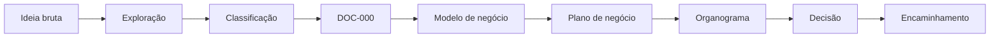
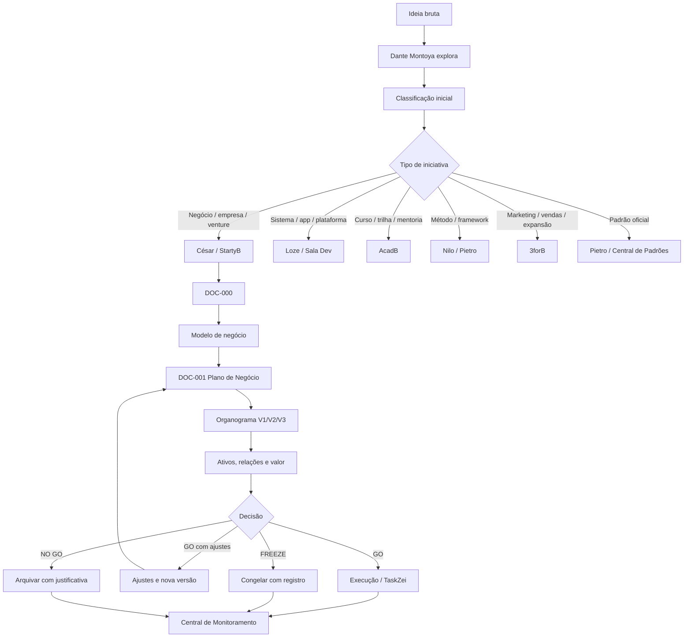
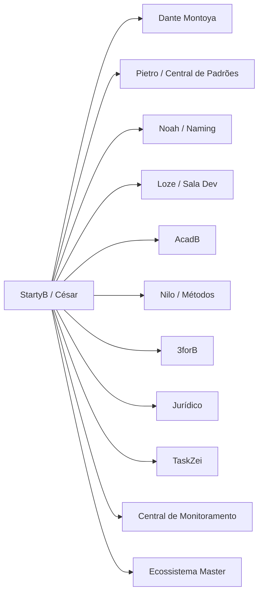
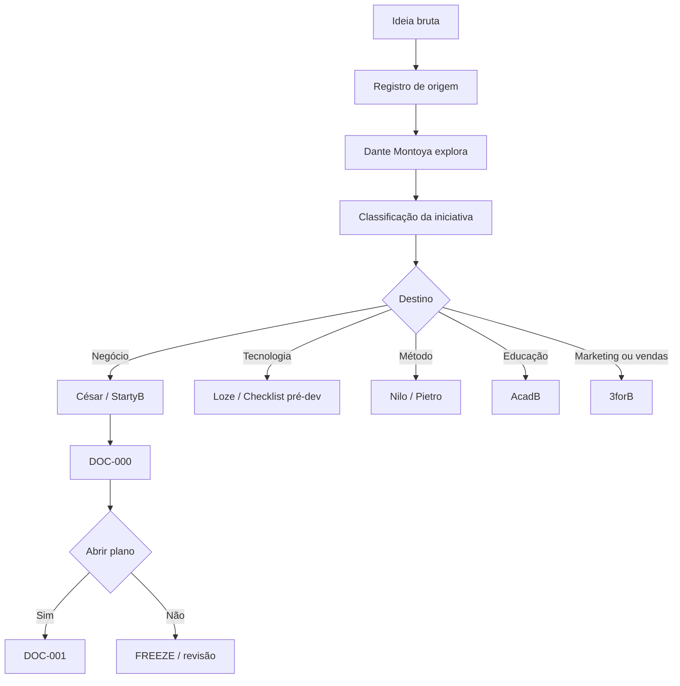
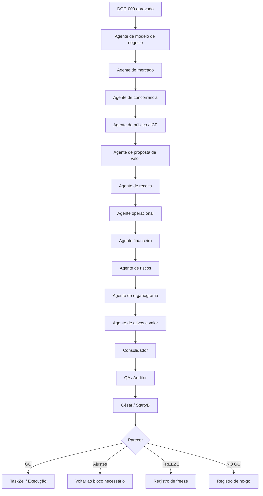
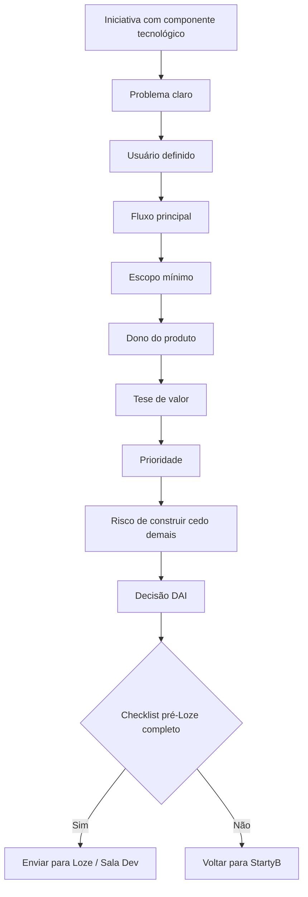
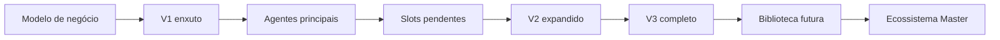
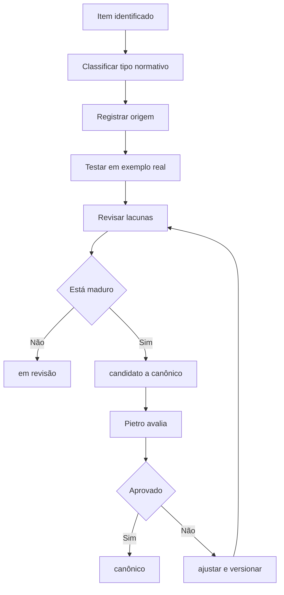
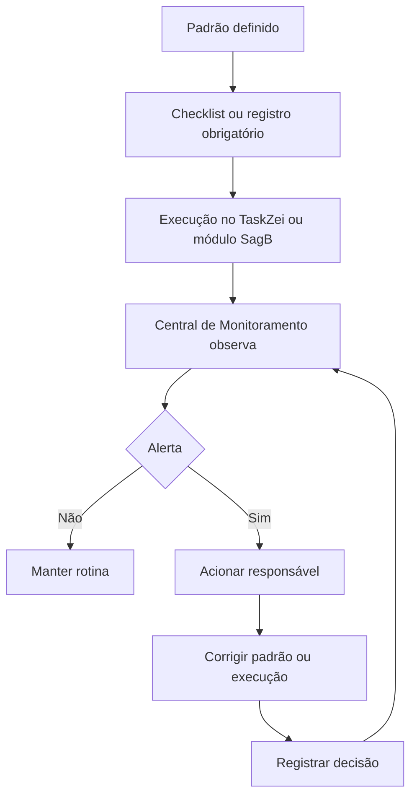

# Documento Mestre de Padrões — StartyB, Marcas, Empresas e Ventures — v1 — 06-06-2026

## Cabeçalho interno

| Campo | Informação |
|---|---|
| Documento | Documento Mestre de Padrões da Divisão |
| Divisão | StartyB, Marcas, Empresas e Ventures |
| Responsável | César Tulli |
| Versão | v1 |
| Data da versão | 06-06-2026 |
| Status | candidato a documento-mãe da divisão |
| Formato | Markdown .md |
| Destino | Central de Padrões do SagB |
| Responsável pela validação final | Pietro Carboni |

---

## Índice

1. [Objetivo do documento](#1-objetivo-do-documento)  
2. [Escopo da divisão](#2-escopo-da-divisão)  
3. [O que esta divisão define](#3-o-que-esta-divisão-define)  
4. [O que esta divisão não define](#4-o-que-esta-divisão-não-define)  
5. [Fontes analisadas](#5-fontes-analisadas)  
6. [Síntese executiva](#6-síntese-executiva)  
7. [Mapa visual da divisão](#7-mapa-visual-da-divisão)  
8. [Princípios da área](#8-princípios-da-área)  
9. [Políticas da área](#9-políticas-da-área)  
10. [Regras centrais da área](#10-regras-centrais-da-área)  
11. [Padrões oficiais e candidatos a padrão](#11-padrões-oficiais-e-candidatos-a-padrão)  
12. [Protocolos reais da área](#12-protocolos-reais-da-área)  
13. [Processos da área](#13-processos-da-área)  
14. [Procedimentos operacionais](#14-procedimentos-operacionais)  
15. [Checklists obrigatórios](#15-checklists-obrigatórios)  
16. [Matrizes obrigatórias](#16-matrizes-obrigatórias)  
17. [Registros e evidências obrigatórias](#17-registros-e-evidências-obrigatórias)  
18. [Fluxos Mermaid da divisão](#18-fluxos-mermaid-da-divisão)  
19. [Dependências com outras áreas](#19-dependências-com-outras-áreas)  
20. [Conflitos de escopo](#20-conflitos-de-escopo)  
21. [Riscos se os padrões não forem seguidos](#21-riscos-se-os-padrões-não-forem-seguidos)  
22. [O que deve ser monitorado pela Central de Monitoramento](#22-o-que-deve-ser-monitorado-pela-central-de-monitoramento)  
23. [Relação com Biblioteca de Módulos Base, se aplicável](#23-relação-com-biblioteca-de-módulos-base-se-aplicável)  
24. [Relação com TaskZei e Sala Dev, se aplicável](#24-relação-com-taskzei-e-sala-dev-se-aplicável)  
25. [Lacunas e validações pendentes](#25-lacunas-e-validações-pendentes)  
26. [Decisões já tomadas](#26-decisões-já-tomadas)  
27. [Documentos derivados que precisam nascer](#27-documentos-derivados-que-precisam-nascer)  
28. [Padrões atômicos sugeridos para o módulo SagB](#28-padrões-atômicos-sugeridos-para-o-módulo-sagb)  
29. [Ordem recomendada de canonização](#29-ordem-recomendada-de-canonização)  
30. [Síntese final](#30-síntese-final)  

---

## Color code e classificação normativa

| Símbolo | Classificação | Uso correto |
|---|---|---|
| 🔵 | princípio | Diretriz estrutural que orienta decisões |
| 🟣 | política | Direção institucional que governa uma frente |
| 🔴 | regra | Obrigação objetiva, com certo/errado |
| 🟠 | padrão | Forma recomendada e repetível de estruturar algo |
| 🟢 | protocolo | Sequência obrigatória, com situação, responsável e saída esperada |
| ⚙️ | processo | Fluxo amplo com etapas e responsáveis |
| 🧩 | procedimento | Passo operacional específico |
| ✅ | checklist | Lista de verificação |
| 📊 | matriz | Estrutura de comparação, decisão ou classificação |
| 🧾 | registro/evidência | Prova, log, documento, decisão ou rastro |
| ⚠️ | risco | Possibilidade de falha, dano ou confusão |
| 💡 | recomendação | Sugestão ainda não obrigatória |
| 📌 | decisão | Definição já tomada |
| ❓ | dúvida/lacuna | Algo indefinido ou incompleto |
| 🚨 | crítico | Ponto que pode travar ou desorganizar o sistema |

Regra de classificação:

```txt
Não chamar tudo de padrão.
Não chamar tudo de protocolo.
Protocolo só existe quando houver situação específica, sequência obrigatória, responsável e saída esperada.
```

---

## Inventário normativo da divisão

| Código | Item | Tipo normativo | Status | Prioridade | Responsável | Validação necessária |
|---|---|---|---|---|---|---|
| SMBEV-001 | Ideia não é empresa | 🔵 princípio | candidato a canônico | alta | César Tulli | Pietro Carboni |
| SMBEV-002 | Toda iniciativa precisa ser classificada antes de execução | 🔴 regra | candidato a canônico | crítica | César Tulli | Pietro Carboni |
| SMBEV-003 | DOC-000 antes do plano completo quando a ideia ainda está imatura | 🟠 padrão | candidato a canônico | alta | César Tulli | Pietro Carboni |
| SMBEV-004 | DOC-001 como plano de negócio oficial | 🟠 padrão | candidato a canônico | crítica | César Tulli | Pietro Carboni |
| SMBEV-005 | Venture é empresa em formação, não pasta de ideia | 🟣 política | candidato a canônico | alta | César Tulli | Pietro Carboni |
| SMBEV-006 | Organograma V1/V2/V3 por estágio da empresa | 🟠 padrão | candidato a canônico | alta | César Tulli | Pietro Carboni |
| SMBEV-007 | Organograma ativo separado de biblioteca futura | 🔴 regra | candidato a canônico | alta | César Tulli | Pietro Carboni |
| SMBEV-008 | Ativo próprio separado de ativo do GrupoB usado | 🔴 regra | candidato a canônico | crítica | César Tulli | Pietro / Jurídico / Valuation |
| SMBEV-009 | Passagem para Loze exige briefing mínimo | 🟢 protocolo | em revisão | crítica | César / Sávio | Sávio Codare / Pietro |
| SMBEV-010 | Operações por conta atendida | 🟠 padrão | em revisão | alta | César / Yuri | Yuri Sague |
| SMBEV-011 | NIDE estrutura; StartyB decide | 🟣 política | precisa validação | alta | César Tulli | Rodrigues / Pietro / responsável NIDE |
| SMBEV-012 | DAI obrigatório para decisão crítica de negócio | 🟢 protocolo | candidato a canônico | alta | César Tulli | Pietro |
| SMBEV-013 | Matriz GO / GO com ajustes / FREEZE / NO GO | 📊 matriz | candidato a canônico | alta | César Tulli | Pietro |
| SMBEV-014 | Falas reais do Rodrigues não podem ser misturadas com IA | 🔴 regra | candidato a canônico | crítica | César / Yuri | Pietro |
| SMBEV-015 | Toda empresa/venture deve ter visão geral inicial antes de consolidação profunda | 🟠 padrão | em revisão | média | César Tulli | Pietro |
| SMBEV-016 | Toda empresa/venture deve ter 99_triagem | 🟠 padrão | em revisão | média | Yuri / César | Yuri / Pietro |
| SMBEV-017 | Ecossistema Master deve representar empresas, ventures, métodos e agentes como entidades | 🟠 padrão | em revisão | média | César / Sávio / Alice | Pietro |
| SMBEV-018 | Esteira multiagente de plano de negócio | ⚙️ processo | em revisão | alta | César / Rian | Rodrigues / Pietro |
| SMBEV-019 | Checklist pré-Loze | ✅ checklist | precisa validação | crítica | César / Sávio | Sávio / Pietro |
| SMBEV-020 | Registro de decisão StartyB | 🧾 registro/evidência | candidato a canônico | alta | César Tulli | Pietro |

---

## 1. Objetivo do documento

Este documento reúne, organiza e formaliza os padrões reais da divisão **StartyB, Marcas, Empresas e Ventures** para alimentar a **Central de Padrões do SagB**.

A divisão atua na transformação de ideias em estruturas empresariais analisáveis, versionáveis e decidíveis. Ela organiza o caminho entre uma ideia bruta e uma possível empresa, venture, produto, método, curso, plataforma, sistema, organograma, plano de negócio ou encaminhamento para outra área do GrupoB.

Este documento existe para responder:

```txt
Quais padrões governam a criação, classificação, validação,
estruturação e evolução de marcas, empresas, ventures e planos de negócio no GrupoB?
```

Ele também serve para impedir que ideias fortes fiquem espalhadas em chats, sejam confundidas com decisões ou entrem em execução antes da classificação correta.

---

## 2. Escopo da divisão

A divisão cobre o ciclo de nascimento, análise, estruturação e encaminhamento de iniciativas que possam virar negócio, marca, empresa, venture ou plano.

| Frente | Entra no escopo? | Observação |
|---|---:|---|
| Exploração de ideias de negócio | 🟢 Sim | Em conjunto com Dante Montoya |
| Classificação de iniciativas | 🟢 Sim | Ideia, projeto, produto, empresa, venture, método, curso, sistema |
| Criação de empresas | 🟢 Sim | Estrutura estratégica, não abertura jurídica final |
| Criação e estruturação de ventures | 🟢 Sim | Venture como empresa em formação |
| Plano de negócio | 🟢 Sim | DOC-001 como documento oficial |
| DOC-000 — descrição inicial da empresa | 🟢 Sim | Documento intermediário antes do plano completo |
| Modelo de negócio | 🟢 Sim | Valor, receita, entrega, canais e sustentabilidade |
| Modelo de receita | 🟢 Sim | Em interface com CRO / Rian e especialistas financeiros |
| Organograma V1/V2/V3 | 🟢 Sim | Estrutura evolutiva da empresa/venture |
| Agentes de plano de negócio | 🟢 Sim | Esteira multiagente para criação de plano |
| Ativos, relações e valuation estrutural | 🟡 Parcial | A divisão organiza; valuation final depende de especialista |
| Naming e disponibilidade | 🟡 Parcial | A divisão aponta necessidade; Noah valida nomes |
| Tecnologia, sistemas e automações | 🟡 Parcial | A divisão prepara briefing; Loze executa |
| Cursos, mentorias e trilhas | 🟡 Parcial | A divisão classifica; AcadB estrutura educação |
| Métodos e frameworks | 🟡 Parcial | A divisão classifica; Nilo/Pietro governam método |
| Jurídico, sociedade e contratos | 🟡 Parcial | A divisão aponta risco; jurídico valida |
| Execução operacional | 🟡 Parcial | A divisão define estrutura; área executora opera |

### 2.1. Escopo visual



---

## 3. O que esta divisão define

| Tema | Definição da divisão | Tipo normativo | Status |
|---|---|---|---|
| Ideia bruta | Como uma ideia entra e é registrada | ⚙️ processo | candidato a canônico |
| Exploração inicial | Como Dante organiza a primeira leitura | 🟢 protocolo | candidato a canônico |
| Classificação de iniciativa | Como separar ideia, produto, empresa, venture, método, curso e sistema | 📊 matriz | candidato a canônico |
| DOC-000 | Documento descritivo estrutural temporário | 🟠 padrão | candidato a canônico |
| DOC-001 | Plano de negócio oficial | 🟠 padrão | candidato a canônico |
| Venture | Empresa em formação com potencial de operação, captação, venda ou autonomia | 🟣 política | candidato a canônico |
| Organograma V1/V2/V3 | Versões progressivas de estrutura organizacional | 🟠 padrão | candidato a canônico |
| Agente ativo | Pessoa/agente com nome, função, limite, ID e decisão | 🔴 regra | em revisão |
| Biblioteca futura | Funções/agentes possíveis, mas não ativos | 🟠 padrão | candidato a canônico |
| Ativos e valor | Separação entre ativo próprio e ativo usado | 📊 matriz | candidato a canônico |
| Parecer final | GO, GO com ajustes, FREEZE ou NO GO | 📊 matriz | candidato a canônico |
| Handoff para Loze | Requisitos mínimos para passar a tecnologia | 🟢 protocolo | em revisão |
| Handoff para 3forB | Quando envolve marketing, vendas ou expansão | ⚙️ processo | em revisão |
| Handoff para AcadB | Quando vira curso, trilha, mentoria ou programa | ⚙️ processo | em revisão |
| Handoff para métodos | Quando vira metodologia, framework ou estrutura intelectual | ⚙️ processo | em revisão |

---

## 4. O que esta divisão não define

| Tema | Quem deve definir | Por que não é da divisão |
|---|---|---|
| Disponibilidade final de nome | Noah Verdili | Requer curadoria, busca, risco e banco de marcas |
| Identidade visual | Alice Montini / UX/UI | É design, marca visual e experiência |
| Arquitetura técnica | Sávio Codare / Loze / Sala Dev | A divisão só define problema e briefing |
| Desenvolvimento de sistema | Loze / Sala Dev | Execução técnica não é da StartyB |
| Segurança digital | Pedro Gazan | Acessos, risco digital e proteção são outra área |
| Contrato, sociedade e parecer jurídico final | Jurídico / Audacus | A divisão levanta risco, não dá parecer final |
| Valuation final | Especialista de valuation / financeiro | A divisão organiza ativos e hipóteses |
| Currículo de curso | AcadB / Júlio Mosqueira | Educação tem governança própria |
| Método canônico | Nilo Barret / Pietro Carboni | Métodos são ativos intelectuais do GrupoB |
| Execução comercial diária | 3forB | A divisão estrutura; 3forB executa marketing, vendas e expansão |
| Organização sistêmica de pastas | Yuri Sague / Sávio | A divisão aponta necessidade; processos/sistemas estruturam |
| Canonicidade final | Pietro Carboni | A Central de Padrões valida |

---

## 5. Fontes analisadas

| Fonte | Tipo | Uso neste documento |
|---|---|---|
| Histórico deste chat com César Tulli | Conversa estratégica | Base principal das decisões sobre StartyB, ventures, empresas, planos e organogramas |
| Missão 1 — Estrutura do Bloco | Estrutura inicial | Definiu arquitetura do bloco dentro da Central de Padrões |
| Missão 2 — Auditoria e Revisão do Bloco | Auditoria | Levantou lacunas, dependências e estrutura revisada |
| Padrão Canônico de Organograma de Ventures | Padrão derivado | Base para organogramas de ventures |
| Aplicação prática na 3forB | Exemplo aplicado | Testou organograma ativo, biblioteca futura e matriz de autoridade |
| Padrão documental Markdown | Padrão-mãe | Regras de arquivo, cabeçalho, índice, visual e Mermaid |
| Padrão de nomenclatura | Padrão-mãe | Nome visual, ID, código, pasta, chat e tarefa |
| Discussões sobre NIDE | Decisão estratégica | Integração da StartyB como domínio estruturável |
| Discussões sobre triagem | Processo | Fase 01, Fase 02 e Fase 03 de materiais brutos |
| Discussões sobre Ecossistema Master | Visualização | Entidades, agentes, empresas, ventures, filtros e relações |
| Discussões sobre TaskZei e Sala Dev | Execução | Conversão de decisões em tarefas e passagem para tecnologia |

---

## 6. Síntese executiva

A divisão **StartyB, Marcas, Empresas e Ventures** já possui padrões suficientes para ser organizada como bloco estruturante da Central de Padrões.

### 6.1. Pontos fortes

| Ponto | Status | Leitura |
|---|---|---|
| Fluxo ideia → negócio | 🟢 Forte | Já existe lógica de entrada, exploração, classificação e encaminhamento |
| Papel de Dante | 🟢 Forte | Explorador inicial, não decisor final |
| Papel de César / StartyB | 🟢 Forte | Estrutura, avalia, decide plano e encaminha |
| DOC-000 | 🟢 Forte | Resolve fase intermediária antes do plano completo |
| Plano de negócio | 🟢 Forte | Documento central da divisão |
| Organograma V1/V2/V3 | 🟢 Forte | Define evolução progressiva sem inflar empresa |
| Organograma ativo vs biblioteca futura | 🟢 Forte | Padrão validado na 3forB |
| Ativo próprio vs ativo usado | 🟢 Forte | Essencial para valuation, sócios e captação |
| Handoff para Loze | 🟡 Parcial | Conceito forte, falta checklist final |
| Esteira multiagente | 🟡 Parcial | Precisa teste operacional |
| NIDE | 🟡 Parcial | Faz sentido, mas depende de validação |
| Monitoramento | 🟡 Parcial | Precisa transformar em alertas e registros |

### 6.2. Quadro de maturidade

| Dimensão | Maturidade | Observação |
|---|---:|---|
| Conceitos centrais | 🟢 Alta | Ideia, empresa, venture, DOC-000 e DOC-001 estão claros |
| Regras | 🟢 Alta | Há regras consistentes sobre classificação, ativos e organograma |
| Protocolos | 🟡 Média | Alguns precisam virar documentos próprios |
| Checklists | 🟡 Média | Muitos estão definidos conceitualmente, faltam arquivos finais |
| Matrizes | 🟢 Alta | Classificação, decisão e ativos estão bem encaminhados |
| Integração com SagB | 🟡 Média | Precisa modularizar |
| Integração com Loze | 🟡 Média | Falta checklist pré-dev |
| Integração com monitoramento | 🟡 Média | Ainda precisa instrumentar |
| Risco de escopo | 🔴 Alto | Pode confundir com naming, tecnologia, jurídico, métodos ou AcadB |

---

## 7. Mapa visual da divisão



### 7.1. Mapa de dependências macro



---

## 8. Princípios da área

| Código | Princípio | Explicação | Status |
|---|---|---|---|
| PR-SMBEV-001 | Ideia não é empresa | Toda ideia precisa de exploração e classificação antes de virar estrutura empresarial | candidato a canônico |
| PR-SMBEV-002 | Velocidade com rastreabilidade | O GrupoB deve criar rápido sem perder origem, decisão e responsável | candidato a canônico |
| PR-SMBEV-003 | Negócio antes de tecnologia | Tecnologia não deve ser usada para validar uma tese que ainda não foi estruturada | candidato a canônico |
| PR-SMBEV-004 | Venture é empresa em formação | Venture precisa ser autônoma o bastante para operar, captar, vender ou virar empresa | candidato a canônico |
| PR-SMBEV-005 | Organograma é autoridade e fluxo | Organograma não é desenho decorativo; é decisão, execução e responsabilidade | candidato a canônico |
| PR-SMBEV-006 | Ativo usado não é ativo próprio | Métodos e ativos do GrupoB usados por uma empresa não pertencem automaticamente a ela | candidato a canônico |
| PR-SMBEV-007 | Biblioteca futura não é operação ativa | Funções futuras não podem inflar o organograma atual | candidato a canônico |
| PR-SMBEV-008 | IA organiza, humano valida | IA pode estruturar e analisar, mas decisões críticas exigem validação humana | candidato a canônico |
| PR-SMBEV-009 | Padrão central não copia caso específico | A 3forB pode inspirar, mas não virar molde universal de todas as ventures | candidato a canônico |
| PR-SMBEV-010 | Canônico depende de validação | Nada vira canônico final sem Pietro Carboni | candidato a canônico |
| PR-SMBEV-011 | Documento canônico deve ser visual | Canônico não significa seco; significa claro, visual, rastreável e executável | candidato a canônico |
| PR-SMBEV-012 | Estrutura deve anteceder expansão | Antes de escalar, é preciso saber modelo, oferta, responsável, fluxo e risco | candidato a canônico |

---

## 9. Políticas da área

| Código | Política | Aplicação | Status |
|---|---|---|---|
| POL-SMBEV-001 | Política de entrada de ideias | Toda ideia relevante deve ser registrada antes de avançar | candidato a canônico |
| POL-SMBEV-002 | Política de classificação | Toda iniciativa deve receber tipo antes de execução | candidato a canônico |
| POL-SMBEV-003 | Política de abertura de DOC-000 | Ideia com potencial, mas ainda imatura, vira DOC-000 | candidato a canônico |
| POL-SMBEV-004 | Política de abertura de plano | Plano completo só começa com tese mínima validada | candidato a canônico |
| POL-SMBEV-005 | Política de ventures | Venture deve ser tratada como empresa em formação | candidato a canônico |
| POL-SMBEV-006 | Política de passagem para tecnologia | Loze só recebe demanda com problema, usuário, fluxo, escopo e dono | em revisão |
| POL-SMBEV-007 | Política de ativos e valuation | Ativos usados e próprios devem ser separados | candidato a canônico |
| POL-SMBEV-008 | Política de congelamento | Ideias boas, mas imaturas, entram em FREEZE com condição de reabertura | candidato a canônico |
| POL-SMBEV-009 | Política de NIDE | NIDE estrutura e versiona; StartyB decide negócio | precisa validação |
| POL-SMBEV-010 | Política de triagem documental | Separar bruto, fala real, IA, prompt, decisão, hipótese e lacuna | candidato a canônico |
| POL-SMBEV-011 | Política de organograma evolutivo | Toda empresa/venture deve poder existir em V1, V2 e V3 | candidato a canônico |
| POL-SMBEV-012 | Política de Ecossistema Master | Entidades devem ser preparadas para visualização e filtros | em revisão |

---

## 10. Regras centrais da área

| Código | Regra | Obrigatório? | Status |
|---|---|---:|---|
| REG-SMBEV-001 | Toda ideia deve ter origem registrada | Sim | candidato a canônico |
| REG-SMBEV-002 | Toda iniciativa deve ser classificada antes de execução | Sim | candidato a canônico |
| REG-SMBEV-003 | Não tratar resposta de IA como fala do Rodrigues | Sim | candidato a canônico |
| REG-SMBEV-004 | Não tratar hipótese como decisão | Sim | candidato a canônico |
| REG-SMBEV-005 | DOC-000 não substitui plano de negócio | Sim | candidato a canônico |
| REG-SMBEV-006 | Plano de negócio não começa sem entrada mínima | Sim | candidato a canônico |
| REG-SMBEV-007 | Nenhuma demanda vai para Loze sem briefing mínimo | Sim | em revisão |
| REG-SMBEV-008 | Organograma ativo deve ficar separado da biblioteca futura | Sim | candidato a canônico |
| REG-SMBEV-009 | Slot pendente não é agente ativo | Sim | candidato a canônico |
| REG-SMBEV-010 | Agente ativo precisa ter função, limite, nome, ID e decisão | Sim | em revisão |
| REG-SMBEV-011 | Método usado por empresa precisa ter dono e tipo de uso | Sim | candidato a canônico |
| REG-SMBEV-012 | Decisão GO/FREEZE/NO GO deve ser registrada | Sim | candidato a canônico |
| REG-SMBEV-013 | Venture não deve ser tratada como pasta solta de ideia | Sim | candidato a canônico |
| REG-SMBEV-014 | Documento médio ou grande deve ter índice | Sim | aprovado |
| REG-SMBEV-015 | Documento canônico deve usar recurso visual útil | Sim | candidato a canônico |
| REG-SMBEV-016 | Operação própria da empresa pode ser tratada como conta atendida | Sim | em revisão |
| REG-SMBEV-017 | A própria empresa pode ser cliente operacional dela mesma | Sim | em revisão |
| REG-SMBEV-018 | Padrões específicos não substituem padrões-mãe | Sim | candidato a canônico |

---

## 11. Padrões oficiais e candidatos a padrão

| Código | Padrão | Tipo normativo | Status | Prioridade | Responsável | Validação necessária |
|---|---|---|---|---|---|---|
| PAD-SMBEV-001 | Padrão de registro de ideia | 🧾 registro/evidência | candidato a canônico | alta | César / Dante | Pietro |
| PAD-SMBEV-002 | Padrão de classificação de iniciativas | 📊 matriz | candidato a canônico | crítica | César | Pietro |
| PAD-SMBEV-003 | Padrão DOC-000 — Descritivo Estrutural | 🟠 padrão | candidato a canônico | alta | César | Pietro |
| PAD-SMBEV-004 | Padrão DOC-001 — Plano de Negócio Oficial | 🟠 padrão | candidato a canônico | crítica | César | Pietro |
| PAD-SMBEV-005 | Padrão de modelo de negócio | 🟠 padrão | candidato a canônico | alta | César / Rian | Pietro |
| PAD-SMBEV-006 | Padrão de modelo de receita | 🟠 padrão | em revisão | alta | Rian / César | Pietro |
| PAD-SMBEV-007 | Padrão de organograma V1/V2/V3 | 🟠 padrão | candidato a canônico | alta | César | Pietro |
| PAD-SMBEV-008 | Padrão Canônico de Organograma de Ventures | 🟠 padrão | candidato a canônico | alta | César | Pietro |
| PAD-SMBEV-009 | Padrão de ativos, relações e valor | 📊 matriz | candidato a canônico | crítica | César / Valuation / Jurídico | Pietro |
| PAD-SMBEV-010 | Padrão de triagem Fase 01 | ⚙️ processo | em revisão | alta | Yuri / César | Pietro |
| PAD-SMBEV-011 | Padrão de triagem Fase 02 | ⚙️ processo | em revisão | alta | Yuri / César | Pietro |
| PAD-SMBEV-012 | Padrão de documento base consolidado Fase 03 | 🟠 padrão | em revisão | média | Yuri / César | Pietro |
| PAD-SMBEV-013 | Padrão de passagem para Loze | 🟢 protocolo | precisa validação | crítica | César / Sávio | Sávio / Pietro |
| PAD-SMBEV-014 | Padrão de operações por conta atendida | 🟠 padrão | em revisão | alta | César / Yuri | Pietro |
| PAD-SMBEV-015 | Padrão de esteira multiagente de plano de negócio | ⚙️ processo | em revisão | alta | César / Rian | Pietro |
| PAD-SMBEV-016 | Padrão de visualização no Ecossistema Master | 🟠 padrão | em revisão | média | César / Alice / Sávio | Pietro |
| PAD-SMBEV-017 | Padrão de domínio StartyB/NIDE | 🟣 política | precisa validação | alta | César | Rodrigues / Pietro |

---

## 12. Protocolos reais da área

| Código | Protocolo | Situação específica | Sequência obrigatória | Responsável | Saída esperada | Status |
|---|---|---|---|---|---|---|
| PROT-SMBEV-001 | Protocolo de exploração de ideia | Nova ideia relevante entra no GrupoB | registrar → explorar → levantar perguntas → indicar destino | Dante Montoya | tese preliminar | candidato a canônico |
| PROT-SMBEV-002 | Protocolo de abertura de DOC-000 | Ideia tem potencial, mas ainda não tem plano | classificar → preencher mínimo → marcar lacunas → validar | César / StartyB | DOC-000 | candidato a canônico |
| PROT-SMBEV-003 | Protocolo de abertura de plano de negócio | DOC-000 está suficientemente claro | validar entrada → acionar agentes → consolidar → QA | César / StartyB | DOC-001 | candidato a canônico |
| PROT-SMBEV-004 | Protocolo de passagem para Loze | Iniciativa exige sistema, app, plataforma ou automação | problema → usuário → fluxo → escopo → dono → decisão | César / Sávio | briefing pré-dev | precisa validação |
| PROT-SMBEV-005 | Protocolo de congelamento FREEZE | Ideia não deve avançar agora | motivo → condição de reabertura → registro → monitoramento | César / Pietro | registro de freeze | candidato a canônico |
| PROT-SMBEV-006 | Protocolo de NO GO | Ideia não deve avançar | evidência → justificativa → registro → arquivo | César / StartyB | registro de no-go | candidato a canônico |
| PROT-SMBEV-007 | Protocolo de ativação de agente | Slot precisa virar agente ativo | validar função → nome → ID → pasta → DAI → organograma | César / dono da venture | agente ativo | candidato a canônico |
| PROT-SMBEV-008 | Protocolo DAI de decisão de negócio | Decisão afeta empresa, venture, plano, capital ou tecnologia | contexto → opções → impacto → decisão → registro | responsável + Rodrigues/Kane quando aplicável | decisão registrada | candidato a canônico |
| PROT-SMBEV-009 | Protocolo de entrada de sócio/captação | Venture pode receber sócio ou captar | ativos → valuation → riscos → jurídico → data room | César / jurídico / valuation | pacote de análise | em revisão |
| PROT-SMBEV-010 | Protocolo de extração de visão geral inicial | Pasta de empresa/venture contém materiais brutos | ler → separar origem → sintetizar → lacunas → próximo passo | agente designado | visão geral inicial .md | em revisão |

---

## 13. Processos da área

| Código | Processo | Entrada | Etapas macro | Saída |
|---|---|---|---|---|
| PROC-SMBEV-001 | Nascimento de ideia | Ideia bruta | registro → exploração → classificação | tese preliminar |
| PROC-SMBEV-002 | Classificação de iniciativa | tese preliminar | matriz → destino → responsável | tipo e destino |
| PROC-SMBEV-003 | Criação de DOC-000 | ideia classificada | descrição → público → problema → solução → lacunas | DOC-000 |
| PROC-SMBEV-004 | Criação de DOC-001 | DOC-000 validado | mercado → modelo → operação → financeiro → riscos → QA | plano de negócio |
| PROC-SMBEV-005 | Esteira multiagente | briefing do plano | especialistas por bloco → consolidação → auditoria | plano v1 + QA |
| PROC-SMBEV-006 | Organograma evolutivo | modelo de negócio | V1 → V2 → V3 → biblioteca futura | organograma canônico |
| PROC-SMBEV-007 | Estrutura de venture | tese de venture | status → plano → produto → operação → métricas → data room | pasta autônoma de venture |
| PROC-SMBEV-008 | Ativos e valuation estrutural | plano + métodos + tecnologia | ativo próprio → ativo usado → licença → impacto | mapa de ativos |
| PROC-SMBEV-009 | Encaminhamento para ecossistema | iniciativa classificada | destino → briefing → handoff → registro | transição rastreável |
| PROC-SMBEV-010 | Triagem de material bruto | pasta com arquivos | compilar → separar → extrair → consolidar | material organizado |

---

## 14. Procedimentos operacionais

| Código | Procedimento | Passos mínimos | Saída |
|---|---|---|---|
| POP-SMBEV-001 | Registrar ideia | capturar origem → resumir → data → responsável → status | registro de ideia |
| POP-SMBEV-002 | Separar fala real de IA | identificar linguagem oral → marcar origem → classificar confiança | tabela de origem |
| POP-SMBEV-003 | Criar visão geral inicial | ler pasta → extrair ideias → separar falas → lacunas → mapa visual | arquivo .md único |
| POP-SMBEV-004 | Criar DOC-000 | nome → o que é → para quem → problema → solução → lacunas | DOC-000 |
| POP-SMBEV-005 | Abrir plano | validar entrada mínima → acionar agentes → registrar versão | plano iniciado |
| POP-SMBEV-006 | Acionar agente de bloco | enviar entrada → definir saída → receber bloco → checar consistência | bloco do plano |
| POP-SMBEV-007 | Criar organograma | tipo de venture → autoridade → agentes ativos → slots → biblioteca | organograma |
| POP-SMBEV-008 | Registrar ativo usado | nome → dono → tipo de uso → autorização → entra no valuation? | registro de ativo |
| POP-SMBEV-009 | Preparar briefing Loze | problema → usuário → fluxo → escopo → dono → DAI | pacote pré-dev |
| POP-SMBEV-010 | Emitir parecer | consolidar → QA → matriz decisão → DAI → próximo passo | parecer StartyB |
| POP-SMBEV-011 | Abrir TaskZei | título → origem → responsável → documento base → saída esperada | tarefa rastreável |
| POP-SMBEV-012 | Preparar Ecossistema Master | entidade → tipo → área → status → vínculos → filtros | dados de visualização |

---

## 15. Checklists obrigatórios

| Checklist | Finalidade | Prioridade | Status |
|---|---|---:|---|
| checklist-entrada-de-ideia.md | Verificar origem, contexto e responsável | alta | candidato a canônico |
| checklist-classificacao-iniciativa.md | Definir tipo e destino da iniciativa | crítica | candidato a canônico |
| checklist-doc-000.md | Validar se o descritivo estrutural está suficiente | alta | candidato a canônico |
| checklist-abertura-plano-negocio.md | Verificar se pode abrir DOC-001 | crítica | candidato a canônico |
| checklist-pesquisa-mercado-concorrencia.md | Evitar pesquisa fraca ou inventada | alta | em revisão |
| checklist-modelo-receita-operacao.md | Cruzar receita, margem e capacidade | alta | em revisão |
| checklist-organograma-v1-v2-v3.md | Verificar estrutura ativa e evolução futura | alta | candidato a canônico |
| checklist-ativos-relacoes-valor.md | Separar ativos próprios e usados | crítica | candidato a canônico |
| checklist-passagem-para-loze.md | Impedir tecnologia prematura | crítica | precisa validação |
| checklist-freeze-no-go.md | Registrar congelamento ou descarte corretamente | alta | candidato a canônico |
| checklist-entrada-socio-captacao.md | Preparar captação e sociedade | média | em revisão |
| checklist-ecossistema-master.md | Preparar entidades para visualização | média | em revisão |

### 15.1. Checklist mínimo para abrir plano de negócio

| Item | Confirmação |
|---|---|
| A ideia tem origem registrada | ☐ |
| A iniciativa foi classificada | ☐ |
| Existe problema claro | ☐ |
| Existe público provável | ☐ |
| Existe hipótese de solução | ☐ |
| Existe hipótese de modelo de receita | ☐ |
| Existem lacunas registradas | ☐ |
| Foi definido responsável pela análise | ☐ |
| Foi definido se precisa de pesquisa externa | ☐ |
| Foi registrado se é GO para plano ou não | ☐ |

---

## 16. Matrizes obrigatórias

| Matriz | Finalidade | Status |
|---|---|---|
| matriz-ideia-projeto-produto-empresa-venture.md | Classificar a natureza da iniciativa | candidato a canônico |
| matriz-destino-ecossistema.md | Encaminhar para StartyB, Loze, AcadB, 3forB, Métodos ou Pietro | candidato a canônico |
| matriz-go-ajustes-freeze-no-go.md | Definir decisão final | candidato a canônico |
| matriz-ativo-proprio-vs-ativo-usado.md | Separar propriedade e uso de ativos | candidato a canônico |
| matriz-maturidade-iniciativa.md | Medir evolução da ideia até operação | em revisão |
| matriz-prontidao-plano-negocio.md | Verificar se DOC-001 pode começar | candidato a canônico |
| matriz-prontidao-loze.md | Verificar se pode ir para tecnologia | precisa validação |
| matriz-organograma-v1-v2-v3.md | Definir estrutura evolutiva | candidato a canônico |
| matriz-risco-negocio.md | Avaliar risco de mercado, operação, caixa, jurídico e reputação | candidato a canônico |
| matriz-prontidao-captacao.md | Preparar venture para sócio/captação | em revisão |

### 16.1. Matriz de classificação inicial

| Pergunta | Se sim, provável destino |
|---|---|
| Resolve uma dor com modelo de receita próprio? | Empresa / venture |
| É uma funcionalidade, app, sistema ou plataforma? | Loze |
| É método, framework ou estrutura intelectual? | Métodos / Pietro / Nilo |
| É curso, formação, trilha ou mentoria? | AcadB |
| É campanha, mídia, comunidade ou conteúdo? | PapoB / 3forB / AcadB |
| É processo interno ou padrão operacional? | Yuri / Central de Padrões |
| É nome, marca ou nomenclatura? | Noah / Pietro |
| É apenas hipótese inicial? | Dante / StartyB / DOC-000 |

---

## 17. Registros e evidências obrigatórias

| Registro | Finalidade | Quando usar | Status |
|---|---|---|---|
| registro-de-ideia.md | Guardar origem e contexto | toda nova ideia | candidato a canônico |
| registro-de-falas-reais-rodrigues.md | Preservar autoria e intenção | em triagens e visões gerais | candidato a canônico |
| registro-de-exploracao-dante.md | Guardar tese preliminar | após exploração inicial | candidato a canônico |
| registro-de-classificacao.md | Registrar tipo e destino | antes de plano ou handoff | candidato a canônico |
| registro-doc-000.md | Guardar descritivo estrutural | antes do plano completo | candidato a canônico |
| registro-de-decisao-startyb.md | Registrar decisão estratégica de negócio | quando StartyB decidir | candidato a canônico |
| registro-de-freeze.md | Congelar iniciativa com motivo | quando não avançar agora | candidato a canônico |
| registro-de-no-go.md | Descartar com justificativa | quando não fizer sentido | candidato a canônico |
| registro-de-ativo-usado.md | Separar ativos próprios e do GrupoB | em valuation e sociedade | candidato a canônico |
| registro-de-passagem-para-loze.md | Rastrear envio para tecnologia | antes de Sala Dev | precisa validação |
| registro-de-qa-plano.md | Guardar lacunas e inconsistências | antes do parecer final | candidato a canônico |
| registro-dai-negocio.md | Registrar decisão assistida por inteligência | em decisões críticas | candidato a canônico |

---

## 18. Fluxos Mermaid da divisão

### 18.1. Fluxo geral de nascimento da ideia



### 18.2. Fluxo da esteira multiagente de plano de negócio



### 18.3. Fluxo de passagem para Loze



### 18.4. Fluxo de organograma V1/V2/V3



### 18.5. Fluxo de validação canônica



---

## 19. Dependências com outras áreas

| Tema | Depende de quem | Motivo | Tipo de dependência | Arquivo/registro sugerido |
|---|---|---|---|---|
| Naming e disponibilidade | Noah Verdili | Nome oficial, banco de marcas, disponibilidade e risco | validação | dependencias-com-noah-verdili.md |
| Central de Padrões | Pietro Carboni | Canonicidade final e classificação normativa | governança | validacoes-com-pietro-carboni.md |
| Exploração inicial | Dante Montoya | Ideias brutas precisam ser lapidadas antes do plano | processo | dependencias-com-dante-montoya.md |
| Métodos e frameworks | Nilo Barret / Pietro | Métodos não pertencem automaticamente à empresa | escopo | dependencias-com-nilo-barret.md |
| Tecnologia | Loze / Sávio Codare | Sistemas, apps, plataformas e automações | handoff | protocolo-passagem-para-loze.md |
| UX/UI | Alice Montini | Telas, QG, Ecossistema Master e visualização | visual | dependencias-com-alice-montini.md |
| Organização documental | Yuri Sague | Pastas, fontes canônicas, triagem e organização sistêmica | operacional | dependencias-com-yuri-sague.md |
| Segurança digital | Pedro Gazan | Acessos, risco digital, credenciais e proteção | validação | dependencias-com-pedro-gazan.md |
| AcadB | Júlio Mosqueira / AcadB | Quando ideia vira curso, trilha ou mentoria | handoff | dependencias-com-acadb.md |
| 3forB | Zara / equipe 3forB | Marketing, vendas, expansão e operações por conta | handoff | dependencias-com-3forb.md |
| Jurídico | Audacus / jurídico | Contratos, sociedade, cap table, risco regulatório | validação crítica | dependencias-com-juridico.md |
| Valuation | Especialista de valuation / financeiro | Avaliação, sócios e captação | validação crítica | dependencias-com-valuation.md |
| TaskZei | Yuri / responsável de execução | Transformar padrão e plano em tarefas | execução | registro-taskzei.md |
| Sala Dev | Loze / Sávio | Desenvolvimento após Gate Pré-Dev | pré-dev | pacote-modular-pre-dev.md |
| Central de Monitoramento | Responsável do monitoramento | Alertas e evidências de cumprimento | monitoramento | itens-monitoraveis-startyb.md |

---

## 20. Conflitos de escopo

| Conflito | Risco | Resolução recomendada |
|---|---|---|
| Marca vs empresa | Todo nome virar empresa | Usar matriz de classificação |
| Produto digital vs venture | App virar empresa sem modelo | Separar produto, plataforma, sistema e venture |
| Método vs curso | Framework virar trilha educacional sem critério | Validar com Nilo/Pietro e AcadB |
| Marketing da empresa vs entrega para clientes | Criar departamentos duplicados | Usar operações por conta atendida |
| Ativo do GrupoB vs ativo da empresa | Inflar valuation | Usar matriz de ativos |
| Resposta de IA vs fala real | Documento sem autoria real | Separar origem e confiança |
| DOC-000 vs plano completo | Exigir plano cedo demais | Usar DOC-000 como camada intermediária |
| NIDE vs StartyB | NIDE assumir decisão estratégica | NIDE estrutura; StartyB decide |
| Loze vs StartyB | Tecnologia começar sem validação de negócio | Checklist pré-Loze |
| Central de Padrões vs divisão | Divisão se autodeclarar canônica | Pietro valida |
| Organograma ativo vs biblioteca futura | Estrutura ficar inchada | Separar ativo, slot e futuro |
| Conta interna vs cliente externo | Confusão operacional | Tratar a própria empresa como conta atendida quando aplicável |

---

## 21. Riscos se os padrões não forem seguidos

| Risco | Causa provável | Impacto | Como prevenir | Quem acompanha |
|---|---|---|---|---|
| Criar empresas demais | Ideia não classificada | Inchaço estratégico | Matriz de classificação | César / Pietro |
| Construir tecnologia cedo demais | Falta de checklist pré-Loze | Custo, retrabalho e produto errado | Protocolo pré-Loze | César / Sávio |
| Confundir IA com decisão | Triagem sem origem | Documento sem intenção real | Registro de fala real | Yuri / César |
| Inflar valuation | Ativo usado tratado como próprio | Risco societário | Matriz de ativos | César / jurídico |
| Organograma gigante e inútil | Biblioteca futura vira ativa | Confusão operacional | Padrão de organograma | César |
| Perder ideia forte | Sem registro | Oportunidade some em chat | Registro de ideia | Dante / César |
| Plano bonito sem decisão | Consolidação sem parecer | Documento sem ação | Matriz GO/FREEZE/NO GO | César |
| Invadir outra área | Falta de dependência | Conflito de escopo | Arquivo de dependência | Pietro |
| Falha de execução | Padrão não vira tarefa | Nada acontece | TaskZei | responsável |
| Falha de monitoramento | Sem item monitorável | Padrão ignorado | Central de Monitoramento | Pietro / responsável |
| Marca nascer sem disponibilidade | Naming ignorado | Risco jurídico/posicionamento | Noah valida | Noah / Pietro |
| Curso nascer como empresa | Falha de classificação | Confusão de produto | Matriz de destino | César / AcadB |
| Método virar ativo da venture indevidamente | Falta de registro de uso | Problema de valuation | Registro de ativo usado | Nilo / César |

---

## 22. O que deve ser monitorado pela Central de Monitoramento

A lógica operacional é:

```txt
Central de Padrões define.
Central de Monitoramento observa.
TaskZei aciona.
Responsável responde.
```

| Item a monitorar | Por que monitorar | Origem do dado | Responsável | Ação se der alerta |
|---|---|---|---|---|
| Ideias sem classificação | Evita execução precoce | registros de ideia | Dante / César | classificar ou arquivar |
| DOC-000 sem validação | Evita documento virar oficial sem decisão | documentos | César | pedir validação |
| Plano sem QA | Reduz erro e contradição | registro de QA | César | bloquear parecer final |
| Passagem para Loze sem checklist | Evita desenvolvimento prematuro | TaskZei / Sala Dev | Sávio / César | devolver para pré-dev |
| Organograma sem matriz de autoridade | Evita organograma decorativo | documento de organograma | César | exigir matriz |
| Agente sem ficha, ID ou função | Evita agente solto | Núcleo de Agentes / Ecossistema Master | dono da venture | bloquear ativação |
| Ativo usado sem dono registrado | Protege valuation e métodos | registro de ativos | César / Nilo | exigir registro |
| Decisão GO/FREEZE/NO GO sem DAI | Evita decisão sem rastreabilidade | registro DAI | César / Pietro | registrar decisão |
| Venture sem 99_triagem | Evita perda de materiais brutos | estrutura de pastas | Yuri | criar triagem |
| Padrão candidato parado | Evita acúmulo sem canonização | Central de Padrões | Pietro | revisar ou suspender |
| Documento sem índice | Mantém legibilidade | auditoria documental | Yuri | ajustar documento |
| Tarefa sem documento de origem | Evita execução solta | TaskZei | responsável da tarefa | vincular documento base |
| Nome sem validação | Evita risco de marca | banco de marcas | Noah | validar ou bloquear |
| Produto digital sem dono do produto | Evita dev sem responsabilidade | Sala Dev | Loze / César | definir owner |

### 22.1. Fluxo de monitoramento



---

## 23. Relação com Biblioteca de Módulos Base, se aplicável

Esta divisão possui relação direta com a **Biblioteca de Módulos Base Reutilizáveis do SagB**, porque seus padrões podem virar módulos reutilizáveis de classificação, criação de planos, geração de organogramas, registros DAI, gates pré-dev e esteiras de agentes.

| Elemento da divisão | Relação com Biblioteca de Módulos Base | Status |
|---|---|---|
| Template DOC-000 | Pode virar template reutilizável no SagB | candidato |
| Template DOC-001 | Pode virar módulo/assistente de plano de negócio | candidato |
| Matriz de classificação | Pode virar componente base para várias áreas | candidato |
| Esteira multiagente de plano | Pode virar fluxo base de agentes | em revisão |
| Checklist pré-Loze | Pode virar Gate Modular Pré-Dev | precisa validação |
| Pacote de briefing para Loze | Pode virar Pacote Modular Pré-Dev | precisa validação |
| Organograma canônico de ventures | Pode virar visual e cadastro no Ecossistema Master | candidato |
| Registro DAI | Pode virar componente comum de decisão | em revisão |
| Registro de ativos | Pode virar módulo de valuation/ativos | futuro |
| Painel de maturidade da venture | Pode virar módulo de monitoramento | futuro |

### 23.1. Gate Modular Pré-Dev

| Requisito | Obrigatório? |
|---|---:|
| Problema claro | Sim |
| Usuário definido | Sim |
| Fluxo principal | Sim |
| Escopo mínimo | Sim |
| Dono do produto | Sim |
| Tese de valor | Sim |
| Prioridade | Sim |
| Risco de construir cedo demais | Sim |
| Decisão registrada | Sim |
| Checklist pré-Loze preenchido | Sim |

---

## 24. Relação com TaskZei e Sala Dev, se aplicável

### 24.1. Relação com TaskZei

TaskZei deve transformar decisões, padrões e planos em tarefas rastreáveis.

| Situação | Deve virar tarefa? | Título sugerido |
|---|---:|---|
| Criar DOC-000 | Sim | `[venture] | DOC-000 | Criar descritivo estrutural` |
| Rodar pesquisa de mercado | Sim | `[venture] | Mercado | Pesquisar e evidenciar` |
| Acionar agente especialista | Sim | `[venture] | Plano | Acionar agente [bloco]` |
| Revisar lacunas | Sim | `[venture] | QA | Revisar lacunas do plano` |
| Preparar handoff para Loze | Sim | `[venture] | Pré-Dev | Preparar briefing para Loze` |
| Validar ativos | Sim | `[venture] | Ativos | Separar ativo próprio e usado` |
| Atualizar organograma | Sim | `[venture] | Organograma | Atualizar V1/V2/V3` |
| Preparar Ecossistema Master | Sim | `[venture] | Ecossistema | Preparar entidade visual` |

### 24.2. Relação com Sala Dev

Sala Dev só deve receber demanda de negócio após o **Gate Modular Pré-Dev**.

| Entrada mínima para Sala Dev | Obrigatório? |
|---|---:|
| Documento base da iniciativa | Sim |
| Problema claro | Sim |
| Usuário / persona | Sim |
| Fluxo principal | Sim |
| Escopo mínimo | Sim |
| Dono do produto | Sim |
| Prioridade | Sim |
| Risco de construir cedo | Sim |
| Decisão DAI | Sim |
| Checklist pré-Loze preenchido | Sim |

---

## 25. Lacunas e validações pendentes

| Lacuna | Impacto | Quem valida | Prioridade | Recomendação |
|---|---|---|---|---|
| Nome oficial final da divisão | Pode haver dúvida entre StartyB e Negócios/Ventures/Planos | Pietro / Rodrigues | média | Validar se fica StartyB, Marcas, Empresas e Ventures |
| Papel exato do NIDE | Pode sobrepor StartyB | Rodrigues / Pietro / responsável NIDE | alta | Formalizar NIDE estrutura; StartyB decide |
| Lista final dos 43 tópicos do plano | Necessária para agentes especialistas | César / Rodrigues | alta | Consolidar mapa oficial |
| Checklist pré-Loze | Evita tecnologia prematura | Sávio / César | crítica | Criar documento específico |
| Códigos genéricos de áreas para ventures | Afeta agentes e Ecossistema Master | Pietro / Yuri / Núcleo de Agentes | média | Criar padrão GrupoB |
| Matriz de ativos e valuation | Afeta sociedade e captação | Jurídico / valuation / César | crítica | Criar padrão específico |
| Operações por conta atendida | Afeta 3forB, Loze e outras empresas | Yuri / César / Sávio | alta | Criar padrão transversal |
| Fluxo de monitoramento | Sem isso o padrão pode ser ignorado | Central de Monitoramento / Pietro | alta | Definir eventos e alertas |
| Integração com Ecossistema Master | Afeta visualização de agentes e empresas | Alice / Sávio / César | média | Criar entidade padrão |
| Data room de ventures | Afeta captação, venda e sociedade | Jurídico / financeiro / César | futura | Criar quando venture amadurecer |
| Critério final para marca virar empresa | Evita excesso de empresas | Rodrigues / Pietro / César | alta | Criar matriz específica |
| Critério de uso do B | Evita nomes inconsistentes | Noah / Pietro | alta | Conectar com Naming |
| Critério de Empresa B vs Venture | Afeta raiz de pastas e governança | Rodrigues / Yuri / Pietro | alta | Formalizar na arquitetura do ecossistema |

---

## 26. Decisões já tomadas

| Decisão | Status | Observação |
|---|---|---|
| DOC-000 existe antes do plano completo | candidato a canônico | Descritivo estrutural temporário |
| DOC-001 é o plano de negócio oficial | candidato a canônico | Documento principal da área |
| Toda empresa/venture deve ter visão geral, plano, organograma e registros | candidato a canônico | Base da estrutura |
| Organograma precisa ter V1/V2/V3 | candidato a canônico | Evolução por maturidade |
| Organograma ativo deve ficar separado da biblioteca futura | candidato a canônico | Validado na 3forB |
| 3forB é exemplo aplicado, não padrão universal | candidato a canônico | Evita copiar marketing/vendas/expansão em todos |
| Venture deve ser autônoma como empresa em formação | candidato a canônico | Pode operar, captar, vender ou virar empresa |
| Loze não deve receber ideia crua para dev | candidato a canônico | Requer checklist pré-Loze |
| Métodos usados por empresas não viram ativo próprio automaticamente | candidato a canônico | Afeta valuation |
| Operações por conta atendida é lógica correta para empresas prestadoras | em revisão | A própria empresa pode ser conta atendida |
| NIDE pode comportar arquitetura de negócios e ventures | precisa validação | Não deve absorver decisão da StartyB |
| Ecossistema Master deve visualizar agentes, empresas, ventures e métodos | em revisão | Precisa campos e filtros |
| Documento canônico deve ter visual forte | candidato a canônico | Mermaid, tabelas, matrizes, checklists |
| Canonicidade final depende de Pietro Carboni | candidato a canônico | Regra de governança |

---

## 27. Documentos derivados que precisam nascer

| Documento | Tipo | Por que precisa existir | Prioridade | Responsável |
|---|---|---|---:|---|
| escopo-da-divisao-startyb-marcas-empresas-ventures-v1-06-06-2026.md | guia/escopo | Evita invasão de outras áreas | 1 | César |
| matriz-ideia-projeto-produto-empresa-venture-v1-06-06-2026.md | 📊 matriz | Classificação inicial | 1 | César / Pietro |
| matriz-destino-ecossistema-grupob-v1-06-06-2026.md | 📊 matriz | Encaminhamento correto | 1 | César / Pietro |
| padrao-doc-000-descritivo-estrutural-v1-06-06-2026.md | 🟠 padrão | Documento antes do plano | 1 | César |
| padrao-doc-001-plano-negocio-oficial-v1-06-06-2026.md | 🟠 padrão | Plano de negócio oficial | 1 | César |
| checklist-abertura-plano-negocio-v1-06-06-2026.md | ✅ checklist | Evita plano prematuro | 1 | César |
| checklist-passagem-para-loze-v1-06-06-2026.md | ✅ checklist | Evita dev prematuro | 1 | César / Sávio |
| matriz-ativo-proprio-vs-ativo-usado-v1-06-06-2026.md | 📊 matriz | Protege valuation | 1 | César / Jurídico |
| padrao-organograma-v1-v2-v3-v1-06-06-2026.md | 🟠 padrão | Estrutura evolutiva | 1 | César |
| protocolo-freeze-no-go-v1-06-06-2026.md | 🟢 protocolo | Registrar congelamento e descarte | 2 | César |
| esteira-multiagente-plano-negocio-v1-06-06-2026.md | ⚙️ processo | Teste de automação com agentes | 2 | César / Rian |
| modelo-parecer-startyb-v1-06-06-2026.md | 🟠 padrão | Parecer GO/FREEZE/NO GO | 2 | César |
| padrao-operacoes-por-conta-atendida-v1-06-06-2026.md | 🟠 padrão | Resolve interno vs cliente | 2 | César / Yuri |
| padrao-dominio-arquitetura-negocios-ventures-nide-v1-06-06-2026.md | 🟣 política | Integra NIDE e StartyB | 2 | César / NIDE |
| painel-monitoramento-startyb-marcas-empresas-ventures-v1-06-06-2026.md | ⚙️ monitoramento | Define alertas | 3 | César / Monitoramento |
| mapa-entidades-ecossistema-master-startyb-v1-06-06-2026.md | 🟠 padrão | Visualização no ecossistema | 3 | César / Alice / Sávio |

---

## 28. Padrões atômicos sugeridos para o módulo SagB

| Código sugerido | Nome do padrão | Tipo | Resumo | Documento de origem | Status sugerido |
|---|---|---|---|---|---|
| SMBEV-ATOM-001 | Registro obrigatório de ideia | 🧾 registro/evidência | Toda ideia precisa de origem, data e responsável | Documento Mestre | candidato a canônico |
| SMBEV-ATOM-002 | Classificação antes de execução | 🔴 regra | Nenhuma iniciativa avança sem tipo definido | Documento Mestre | candidato a canônico |
| SMBEV-ATOM-003 | Separação fala real vs IA | 🔴 regra | IA não pode virar decisão sem validação | Triagem / Documento Mestre | candidato a canônico |
| SMBEV-ATOM-004 | DOC-000 antes do plano completo | 🟠 padrão | Descritivo estrutural precede DOC-001 quando a ideia está imatura | Histórico César | candidato a canônico |
| SMBEV-ATOM-005 | Gate de abertura do DOC-001 | ✅ checklist | Plano só abre com entrada mínima | Esteira StartyB | candidato a canônico |
| SMBEV-ATOM-006 | Matriz GO/FREEZE/NO GO | 📊 matriz | Toda saída precisa decisão | Histórico César | candidato a canônico |
| SMBEV-ATOM-007 | Checklist pré-Loze | ✅ checklist | Tecnologia só recebe briefing validado | Histórico Loze/StartyB | precisa validação |
| SMBEV-ATOM-008 | Ativo próprio vs ativo usado | 📊 matriz | Protege valuation e métodos | Histórico GrupoB | candidato a canônico |
| SMBEV-ATOM-009 | Organograma ativo separado de biblioteca futura | 🔴 regra | Evita organograma inchado | Padrão Organograma Ventures | candidato a canônico |
| SMBEV-ATOM-010 | Slot pendente não é agente ativo | 🔴 regra | Agente só nasce com validação | Padrão Organograma Ventures | candidato a canônico |
| SMBEV-ATOM-011 | DAI para decisão crítica de negócio | 🟢 protocolo | Decisões estratégicas precisam registro | Histórico DAI | candidato a canônico |
| SMBEV-ATOM-012 | Operações por conta atendida | 🟠 padrão | A própria empresa pode ser conta atendida | Discussão 3forB | em revisão |
| SMBEV-ATOM-013 | Venture como empresa em formação | 🟣 política | Venture não é pasta de ideia | Discussão Ventures | candidato a canônico |
| SMBEV-ATOM-014 | NIDE estrutura, StartyB decide | 🟣 política | Evita sobreposição de autoridade | Discussão NIDE | precisa validação |
| SMBEV-ATOM-015 | Todo padrão precisa status | 🔴 regra | Usar apenas status permitidos | Documento Mestre | candidato a canônico |
| SMBEV-ATOM-016 | Documento canônico deve ser visual | 🟠 padrão | Usar tabela, Mermaid, matriz, checklist e color code | Padrão documental ampliado | candidato a canônico |
| SMBEV-ATOM-017 | Handoff obrigatório entre áreas | ⚙️ processo | Toda transição precisa origem, destino e saída esperada | Documento Mestre | candidato a canônico |
| SMBEV-ATOM-018 | Visão geral inicial de empresa/venture | 🟠 padrão | Arquivo único .md para entender materiais brutos | Histórico César | em revisão |
| SMBEV-ATOM-019 | Matriz de destino no ecossistema | 📊 matriz | Decide StartyB, Loze, AcadB, 3forB, Métodos, Pietro | Documento Mestre | candidato a canônico |
| SMBEV-ATOM-020 | Central de Monitoramento observa desvios | ⚙️ processo | Monitorar padrões, checklists e decisões ausentes | Documento Mestre | em revisão |

---

## 29. Ordem recomendada de canonização

| Ordem | Item | Motivo |
|---:|---|---|
| 1 | Escopo da divisão | Evita invasão de outras áreas |
| 2 | Matriz de classificação de iniciativas | Base de todo fluxo |
| 3 | Matriz de destino no ecossistema | Evita encaminhamento errado |
| 4 | DOC-000 | Resolve fase intermediária |
| 5 | DOC-001 | Documento central da divisão |
| 6 | Checklist de abertura de plano | Evita plano prematuro |
| 7 | Checklist pré-Loze | Evita desenvolvimento cedo demais |
| 8 | Matriz ativo próprio vs ativo usado | Protege valuation e sociedade |
| 9 | Padrão organograma V1/V2/V3 | Estrutura empresas e ventures |
| 10 | Protocolo DAI de decisão de negócio | Garante rastreabilidade |
| 11 | Esteira multiagente de plano | Permite teste autônomo |
| 12 | Padrão de operações por conta atendida | Resolve conflito interno vs cliente |
| 13 | Monitoramento da divisão | Fecha ciclo de governança |
| 14 | Integração com TaskZei | Transforma padrão em execução |
| 15 | Integração com Ecossistema Master | Visualiza entidades e agentes |
| 16 | Domínio NIDE de Arquitetura de Negócios | Integra módulo sem perder StartyB |

---

## 30. Síntese final

A divisão **StartyB, Marcas, Empresas e Ventures** possui uma função estrutural dentro do GrupoB: transformar ideias em negócios compreensíveis, classificáveis, versionáveis, validáveis e encaminháveis.

A divisão não deve virar dona de tudo. Ela deve ser a camada que organiza a lógica empresarial antes de tecnologia, marketing, educação, método, naming, jurídico ou execução.

O que já está mais forte:

- entrada e classificação de ideias;
- papel de Dante na exploração inicial;
- papel de César/StartyB na estruturação e decisão;
- DOC-000 como descritivo inicial;
- DOC-001 como plano de negócio oficial;
- organograma V1/V2/V3;
- organograma ativo separado de biblioteca futura;
- matriz de ativos próprios vs ativos usados;
- passagem controlada para Loze;
- matriz GO / GO com ajustes / FREEZE / NO GO;
- preparação para Ecossistema Master;
- integração com TaskZei, Sala Dev e Central de Monitoramento.

O que ainda precisa evoluir:

- checklist pré-Loze;
- consolidação dos 43 tópicos do plano de negócio;
- validação oficial do papel do NIDE;
- matriz de uso do “B” conectada com Naming;
- data room de ventures;
- padrão de operações por conta atendida;
- monitoramento automatizado dos desvios;
- arquivos derivados menores para canonização.

Minha leitura final é que esta divisão possui padrões suficientes para avançar como documento-mãe da área dentro da Central de Padrões, mas a canonicidade final depende de validação do Pietro Carboni.

---

## Próximas 10 ações recomendadas

1. Validar com Pietro o nome oficial da divisão: **StartyB, Marcas, Empresas e Ventures**.  
2. Criar o documento `escopo-da-divisao-startyb-marcas-empresas-ventures-v1-06-06-2026.md`.  
3. Criar a matriz `matriz-ideia-projeto-produto-empresa-venture-v1-06-06-2026.md`.  
4. Criar a matriz `matriz-destino-ecossistema-grupob-v1-06-06-2026.md`.  
5. Criar o padrão oficial do `DOC-000 — Descritivo Estrutural`.  
6. Criar o padrão oficial do `DOC-001 — Plano de Negócio Oficial`.  
7. Criar o checklist obrigatório de passagem para Loze.  
8. Criar a matriz de ativos próprios vs ativos usados.  
9. Criar a esteira multiagente enxuta para teste de plano de negócio.  
10. Enviar o pacote inicial para Pietro validar como candidatos a canônico.  

---

## Padrões que devem ser extraídos primeiro para o módulo SagB

1. Registro obrigatório de ideia.  
2. Matriz de classificação de iniciativas.  
3. Matriz de destino no ecossistema GrupoB.  
4. DOC-000 — Descritivo Estrutural.  
5. DOC-001 — Plano de Negócio Oficial.  
6. Checklist de abertura de plano de negócio.  
7. Checklist de passagem para Loze.  
8. Matriz ativo próprio vs ativo usado.  
9. Padrão de organograma V1/V2/V3.  
10. Matriz GO / GO com ajustes / FREEZE / NO GO.  
