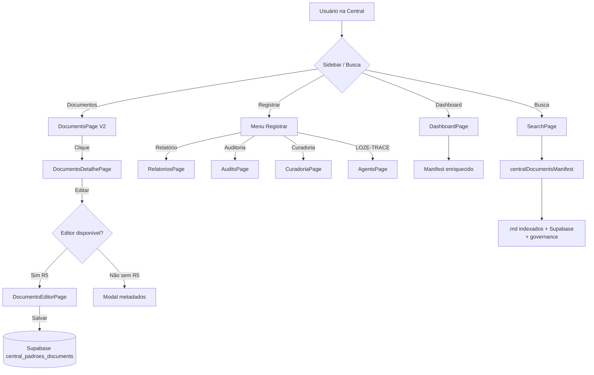

# 📋 Plano — Document Hub V1 — Central de Documentos e Padrões — 12-06-2026

## 🎯 Objetivo

Transformar a Central de Documentos e Padrões de "índice + dashboard + CRUDs separados" em **módulo-mestre de documentos do SagB** (Document Hub V1), reutilizável em outros projetos como TaskZei, Loze e futuros aplicativos.

---

## 🔬 1. Diagnóstico Completo do Estado Atual

### 1.1 Tabelas Supabase Existentes

| Tabela | Existe? | Campos atuais | Completa para Hub V1? |
|---|---|---|---|
| `central_padroes_documents` | ✅ V1 | id, title, source_path, status, category, area_id, destination_type, created_at, updated_at, deleted_at | 🔴 Faltam 12 campos |
| `central_padroes_standards` | ✅ V1 | id, standard_key, title, normative_type, status, area_id, owner_name, summary, content_md, risk_level, version, agent_available, canonical_level, ... | 🟡 Completa mas é para padrões |
| `central_padroes_reports` | ✅ V2 | id, title, slug, type, category, status, risk_level, path_absolute, path_relative, summary, content, tags, owner, source, ... | 🟢 Completa (governance) |
| `central_padroes_audits` | ✅ V2 | id, title, slug, type, category, status, risk_level, path_absolute, path_relative, summary, content, tags, owner, source, ... | 🟢 Completa (governance) |
| `central_padroes_curadoria` | ✅ V3 | id, title, slug, type, category, status, risk_level, path_absolute, path_relative, summary, content, tags, owner, source, ... | 🟢 Completa (governance) |
| `central_padroes_trace_logs` | ✅ V2 | id, execution_id, project, module, executor, task_title, risk_max, status, commands_json, files_changed_json, errors_json, summary, ... | 🟢 Completa (LOZE-TRACE) |
| `central_padroes_search_index` | ✅ V5 | id, entity_type, entity_id, title, summary, chunks, tags, owner_name, status, normative_type, area_id, route, canonical_level, embedding, search_vector | 🟢 Pronto para busca semântica |

### 1.2 Campos Faltantes na Tabela `central_padroes_documents`

Comparando com o schema alvo do Document Hub V1:

| Campo | Existe? | Descrição do gap |
|---|---|---|
| `id` | ✅ | — |
| `title` | ✅ | — |
| `slug` | 🔴 | **Não existe.** Necessário para URLs amigáveis |
| `type` | 🔴 | **Não existe.** Hoje é inferido via `destination_type` |
| `category` | ✅ | — |
| `status` | ✅ | Mas só 6 valores: bruto, revisao, canonico, legado, externo, registro |
| `risk_level` | 🔴 | **Não existe.** Essencial para matriz de risco |
| `owner` | 🔴 | **Não existe.** Hoje usa `area_id` como proxy (owner é o dono da área, não do documento) |
| `tags` | 🔴 | **Não existe.** tags[] jsonb |
| `summary` | 🔴 | **Não existe.** Só existe em standards e governance tables |
| `content` | 🔴 | **Não existe.** O campo `source_path` é um caminho, não conteúdo |
| `path_absolute` | 🔴 | **Não existe.** Só `source_path` |
| `path_relative` | 🔴 | **Não existe.** |
| `source` | 🔴 | **Não existe.** Para indicar: `md_indexado`, `supabase`, `manual` |
| `module` | 🔴 | **Não existe.** Para contexto de origem |
| `division` | 🔴 | **Não existe.** Divisão organizacional |
| `canonical_level` | 🔴 | **Não existe.** Nível de canonicidade |
| `created_by` | 🔴 | **Não existe.** |
| `updated_by` | 🔴 | **Não existe.** |

**Total: 12 de 19 campos faltando (63% de gap estrutural)**

### 1.3 Arquivos que NÃO Existem (Precisam ser Criados)

| Arquivo | Status | Prioridade |
|---|---|---|
| `data/centralDocumentsIndex.ts` | 🔴 Não existe | V1 |
| `data/centralDocumentsManifest.ts` | 🔴 Não existe | V1 |
| `pages/DocumentoDetalhePage.tsx` | 🔴 Não existe | V1 |
| `pages/DocumentoEditorPage.tsx` | 🔴 Não existe | V1 (ou R5) |
| `components/MarkdownPreview.tsx` | 🔴 Não existe | V1 |
| `services/centralPadroesDocumentService.ts` | 🔴 Não existe | V1 (unificado) |

### 1.4 Arquivos Existentes que Precisam ser Atualizados

| Arquivo | Gravidade da mudança | O que fazer |
|---|---|---|
| `pages/DocumentsPage.tsx` | 🔴 Grande | Refatorar para Hub V1 com filtros, colunas, ações |
| `pages/StandardsPage.tsx` | 🟡 Média | Adicionar filtro de tipos e link para detalhe |
| `types/index.ts` | 🔴 Grande | Expandir `CentralDocument` de 6 para 19 campos |
| `services/centralPadroesCrudService.ts` | 🔴 Grande | Expandir `mapDocument()` e adicionar campos |
| `services/centralPadroesRepository.ts` | 🟡 Média | Integrar governance counts no `getMetrics()` |
| `services/centralPadroesSearchService.ts` | 🟡 Média | Adicionar indicador de origem nos resultados |
| `layout/CentralPadroesLayout.tsx` | 🟡 Média | Adicionar views `documento-detalhe`, `documento-editor` |
| `data/sidebarConfig.ts` | 🟢 Pequena | Sem mudanças estruturais necessárias |
| `components/StatusBadge.tsx` | 🟡 Média | Expandir para novos status de documento |
| `styles/centralDocs.css` | 🟡 Média | Adicionar estilos para preview markdown, detail page |

### 1.5 Capacidades Atuais vs Necessárias

| Capacidade | Atual | Hub V1 |
|---|---|---|
| Listar documentos | ✅ Básico (título, path, status, área) | 🔴 Precisa de tipo, risco, owner, tags, resumo |
| Abrir documento | 🔴 Não existe tela de detalhe | 🔴 Precisa criar DocumentoDetalhePage |
| Ver detalhes completos | 🔴 Só mostra 4 campos no modal | 🔴 Precisa de 12+ campos |
| Editar metadados | ✅ 4 campos (title, path, category, areaId) | 🔴 Precisa de 10+ campos |
| Editar conteúdo markdown | 🔴 Não existe | 🔴 R5 necessário para persistir |
| Preview markdown | 🔴 Não existe | 🟡 Pode usar react-markdown (já instalado) |
| Criar novo documento | ✅ 4 campos | 🔴 Precisa de formulário completo |
| Salvar documento | ✅ Via Supabase | 🔴 Limitado a 6 campos |
| Buscar documento | ✅ Textual básica | 🟡 Precisa de indicador de origem |
| Filtrar por tipo | 🔴 Não tem campo type | 🔴 Precisa inferir ou campo real |
| Filtrar por status | ✅ 6 status | 🟡 Expandir para 7 status |
| Filtrar por risco | 🔴 Não tem campo | 🔴 Precisa R5 ou inferência |
| Filtrar por owner | 🔴 Usa area_id como proxy | 🔴 Precisa campo owner real |
| Filtrar por tag | 🔴 Não tem campo | 🔴 Precisa R5 ou inferência |
| Copiar caminho | ✅ Nos governance records | 🟡 Adicionar nos documentos |
| Marcar incompleto | 🔴 Não existe | 🟡 Estado local ou status |
| Enviar para curadoria | 🔴 Não existe integração | 🟡 Rota para CuradoriaPage |
| Dark mode | ✅ Funciona | 🟢 OK |
| Sidebar | ✅ Completa | 🟢 OK |

---

## 🗺️ 2. Estratégia de Implementação — Duas Frentes

### Frente A: V1 Sem R5 (Sem Migration Supabase)

Implementável imediatamente, sem alterar banco:

1. **Criar `centralDocumentsManifest.ts`** — enriquece documentos com metadados inferidos do caminho e contexto
2. **Expandir tipo `CentralDocument`** — adicionar campos opcionais com defaults inferidos
3. **Criar `DocumentoDetalhePage.tsx`** — tela de visualização rica com todos os metadados disponíveis
4. **Criar `MarkdownPreview.tsx`** — componente simples usando `react-markdown` (já em dependencies)
5. **Refatorar `DocumentsPage.tsx`** — adicionar filtros, colunas expandidas, ações
6. **Expandir `mapDocument()`** — mapear campos que existem na tabela mas não no tipo
7. **Dashboard** — integrar contadores de governance tables (relatórios, auditorias, curadoria, trace)
8. **Busca** — adicionar indicador de origem (`.md indexado`, `Supabase`, `snapshot`)

### Frente B: V1 Com R5 (Migration Supabase — Requer Autorização)

Requer `ALTER TABLE central_padroes_documents`:

1. **Migration R5**: Adicionar colunas faltantes (content, summary, risk_level, owner, tags, slug, source, module, division, canonical_level, created_by, updated_by)
2. **Criar `DocumentoEditorPage.tsx`** — editor completo com persistência real
3. **Habilitar salvamento de conteúdo** — markdown completo em `content`
4. **Criar índices** para os novos campos (owner, risk_level, canonical_level, tags)
5. **Atualizar RLS policies** se necessário (provavelmente não precisa — policies atuais cobrem SELECT/INSERT/UPDATE)

---

## 📐 3. Arquitetura do Document Hub V1



### Fluxo de Dados

```
Documentos .md no disco
  → centralDocumentsManifest.ts (inferência de metadados)
    → centralPadroesDocumentService (unificação)
      → DocumentsPage (lista enriquecida)
        → DocumentoDetalhePage (visualização rica)
          → DocumentoEditorPage (edição — R5)
            → Supabase (persistência)
```

---

## 📝 4. Plano de Execução Detalhado

### Etapa 1: Manifest e Tipos (V1 sem R5)

**Arquivos a criar:**
- `data/centralDocumentsManifest.ts`

**Arquivos a modificar:**
- `types/index.ts`

**O que fazer:**
1. Criar `centralDocumentsManifest.ts`:
   - Função `buildDocumentManifest()` que lê `.md` do disco (via lista estática ou import.meta.glob)
   - Infere: tipo (pelo path), categoria, status (incompleto se sem metadado), risco, owner, tags
   - Gera `path_absolute` e `path_relative` a partir do caminho do arquivo
   - Marca documentos sem metadados como `source: 'md_indexado'`, `status: 'incompleto'`
   - Enriquece documentos do Supabase com os mesmos campos

2. Expandir `CentralDocument`:
   - Adicionar campos opcionais: `slug?`, `type?`, `riskLevel?`, `owner?`, `tags?`, `summary?`, `content?`, `pathAbsolute?`, `pathRelative?`, `source?`, `module?`, `division?`, `canonicalLevel?`, `createdBy?`, `updatedBy?`
   - Manter compatibilidade com campos existentes

### Etapa 2: Tela de Detalhe e Preview (V1 sem R5)

**Arquivos a criar:**
- `pages/DocumentoDetalhePage.tsx`
- `components/MarkdownPreview.tsx`

**O que fazer:**
1. `MarkdownPreview.tsx`:
   - Usa `react-markdown` (já instalado em `package.json`)
   - Props: `content: string`, `mode: 'light' | 'dark'`
   - Renderiza markdown com estilos da Central
   - Fallback: "Conteúdo não disponível (documento indexado de .md ou sem conteúdo)"

2. `DocumentoDetalhePage.tsx`:
   - Layout: sidebar com metadados + área principal com preview
   - Mostra: título, tipo, status, risco, owner, tags, categoria, caminho, origem, módulo, divisão, nível canônico
   - Ações: Editar metadados (modal), Copiar caminho, Enviar para curadoria, Marcar incompleto
   - Preview: se `content` existe → MarkdownPreview; senão → mensagem informativa
   - Estado: loading, erro, documento não encontrado, documento incompleto

### Etapa 3: Refatorar DocumentsPage (V1 sem R5)

**Arquivos a modificar:**
- `pages/DocumentsPage.tsx`

**O que fazer:**
1. Adicionar colunas: Tipo, Risco, Owner, Tags
2. Adicionar filtros: tipo, risco, owner, tag (além dos existentes query e status)
3. Botão "Abrir" em cada linha → navega para DocumentoDetalhePage
4. Manter CRUD modal para metadados básicos
5. Integrar com `centralDocumentsManifest` para dados enriquecidos
6. Badge de origem: `.md` vs `Supabase` vs `Governance`

### Etapa 4: Integrar no Layout (V1 sem R5)

**Arquivos a modificar:**
- `layout/CentralPadroesLayout.tsx`

**O que fazer:**
1. Adicionar `'documento-detalhe'` ao tipo `CentralPadroesView`
2. Adicionar case no `renderCurrentView()`: `case 'documento-detalhe': return <DocumentoDetalhePage ... />`
3. Passar `documentId` como prop ou estado

### Etapa 5: Expandir CRUD Service (V1 sem R5)

**Arquivos a modificar:**
- `services/centralPadroesCrudService.ts`

**O que fazer:**
1. Expandir `mapDocument()` para mapear campos adicionais do Supabase quando disponíveis
2. Adicionar `updateDocumentContent()` se necessário
3. Adicionar `getDocumentEnriched()` que combina Supabase + manifest

### Etapa 6: Dashboard — Governance Counts (V1 sem R5)

**Arquivos a modificar:**
- `services/centralPadroesRepository.ts`
- `pages/DashboardPage.tsx`

**O que fazer:**
1. Adicionar `reportCount`, `auditCount`, `curadoriaCount`, `traceCount` ao `getMetrics()`
2. Buscar counts via `centralPadroesGovernanceService.listRecords()` com count
3. Adicionar MetricCards no dashboard para Relatórios, Auditorias, Curadoria, LOZE-TRACE

### Etapa 7: Busca — Indicador de Origem (V1 sem R5)

**Arquivos a modificar:**
- `services/centralPadroesSearchService.ts`

**O que fazer:**
1. Adicionar campo `sourceOrigin` nos resultados: `'md_indexado'`, `'supabase'`, `'snapshot'`, `'curadoria'`, `'relatorio'`, `'auditoria'`, `'trace_log'`
2. Exibir badge de origem nos resultados da busca

### Etapa 8 (R5): Migration Supabase

**NOVO arquivo:**
- `supabase/migrations/20260612000102_central_padroes_document_hub_v1.sql`

**O que a migration faz:**
```sql
ALTER TABLE public.central_padroes_documents
  ADD COLUMN IF NOT EXISTS slug text,
  ADD COLUMN IF NOT EXISTS type text NOT NULL DEFAULT 'documento',
  ADD COLUMN IF NOT EXISTS risk_level text NOT NULL DEFAULT 'baixo',
  ADD COLUMN IF NOT EXISTS owner text,
  ADD COLUMN IF NOT EXISTS tags text[] NOT NULL DEFAULT '{}',
  ADD COLUMN IF NOT EXISTS summary text,
  ADD COLUMN IF NOT EXISTS content text,
  ADD COLUMN IF NOT EXISTS path_absolute text,
  ADD COLUMN IF NOT EXISTS path_relative text,
  ADD COLUMN IF NOT EXISTS source text NOT NULL DEFAULT 'manual',
  ADD COLUMN IF NOT EXISTS module text,
  ADD COLUMN IF NOT EXISTS division text,
  ADD COLUMN IF NOT EXISTS canonical_level text,
  ADD COLUMN IF NOT EXISTS created_by uuid REFERENCES auth.users(id),
  ADD COLUMN IF NOT EXISTS updated_by uuid REFERENCES auth.users(id);

CREATE INDEX IF NOT EXISTS idx_cp_documents_type ON public.central_padroes_documents(type);
CREATE INDEX IF NOT EXISTS idx_cp_documents_risk ON public.central_padroes_documents(risk_level);
CREATE INDEX IF NOT EXISTS idx_cp_documents_owner ON public.central_padroes_documents(owner);
CREATE INDEX IF NOT EXISTS idx_cp_documents_source ON public.central_padroes_documents(source);
```

### Etapa 9 (R5): DocumentoEditorPage

**Arquivo a criar:**
- `pages/DocumentoEditorPage.tsx`

**O que fazer:**
1. Modo visualizar / modo editar (toggle)
2. Campos: título, slug, tipo, categoria, status, risco, owner, tags, resumo, caminho absoluto, caminho relativo, source, módulo, divisão, nível canônico
3. Editor markdown: textarea com preview em tempo real
4. Botões: Salvar, Cancelar, Copiar caminho, Enviar para curadoria
5. Feedback: toast de sucesso/erro, loading state
6. Indicador de documento incompleto

---

## 📊 5. Tabela de Impacto por Etapa

| Etapa | R5? | Arquivos Novos | Arquivos Modificados | Risco |
|---|---|---|---|---|
| 1. Manifest + Tipos | Não | 1 | 1 | R2 |
| 2. Detalhe + Preview | Não | 2 | 0 | R2 |
| 3. Refatorar DocumentsPage | Não | 0 | 1 | R3 |
| 4. Integrar Layout | Não | 0 | 1 | R1 |
| 5. Expandir CRUD | Não | 0 | 1 | R2 |
| 6. Dashboard Counts | Não | 0 | 2 | R2 |
| 7. Busca Origins | Não | 0 | 1 | R1 |
| 8. Migration R5 | **Sim** | 1 | 0 | **R5** |
| 9. Editor Page | **Sim** | 1 | 1 | R3 |

---

## 🚦 6. Dependências e Ordem de Execução

```
Etapa 1 (Manifest + Tipos)
  ├── Etapa 2 (Detalhe + Preview)
  ├── Etapa 3 (Refatorar DocumentsPage)
  ├── Etapa 5 (Expandir CRUD)
  └── Etapa 7 (Busca Origins)

Etapa 4 (Layout) → depende da Etapa 2

Etapa 6 (Dashboard) → independente

Etapa 8 (Migration R5) → BLOQUEADA até autorização
  └── Etapa 9 (Editor Page) → depende da Etapa 8 + Etapa 2
```

---

## 📦 7. Resumo de Entregáveis

### Sem R5 (7 etapas, ~8 arquivos):
- [ ] `data/centralDocumentsManifest.ts` — **NOVO**
- [ ] `pages/DocumentoDetalhePage.tsx` — **NOVO**
- [ ] `components/MarkdownPreview.tsx` — **NOVO**
- [ ] `types/index.ts` — **MODIFICAR** (CentralDocument expandido)
- [ ] `pages/DocumentsPage.tsx` — **MODIFICAR** (Hub V1)
- [ ] `layout/CentralPadroesLayout.tsx` — **MODIFICAR** (nova view)
- [ ] `services/centralPadroesCrudService.ts` — **MODIFICAR** (mapDocument)
- [ ] `services/centralPadroesRepository.ts` — **MODIFICAR** (getMetrics)
- [ ] `pages/DashboardPage.tsx` — **MODIFICAR** (novos cards)
- [ ] `services/centralPadroesSearchService.ts` — **MODIFICAR** (origins)

### Com R5 (2 etapas adicionais):
- [ ] `supabase/migrations/20260612000102_central_padroes_document_hub_v1.sql` — **NOVO**
- [ ] `pages/DocumentoEditorPage.tsx` — **NOVO**

---

## ⚠️ 8. Riscos e Bloqueios

| Risco | Nível | Mitigação |
|---|---|---|
| Migration R5 não autorizada | Alto | Toda a V1 sem R5 é funcional como leitura + metadados; edição de conteúdo fica pendente |
| `react-markdown` não lida com todos os formatos | Baixo | Usar renderização básica; sintaxe comum cobre 95% dos docs |
| Documentos .md sem metadados inferíveis | Médio | Marcar como `incompleto` com badge visual; não esconder |
| Browser não salva em .md no disco | — | Por design — conteúdo vivo vai para Supabase; exportação .md é etapa futura |
| Performance com muitos documentos | Baixo | Manifest é estático (build time); busca textual já é client-side |

---

## 🎯 9. Critério de Pronto para Document Hub V1

- [x] Documentos aparecem na lista enriquecida
- [x] Documentos abrem em tela de detalhe
- [x] Metadados são exibidos (tipo, status, risco, owner, tags, caminho, origem)
- [x] Preview markdown funciona (quando conteúdo disponível)
- [x] Filtros funcionam (tipo, status, risco, owner, tag)
- [x] Busca global encontra documentos com indicador de origem
- [x] Dashboard mostra contadores de governance tables
- [x] Copiar caminho funciona
- [x] Dark mode continua OK
- [x] Sidebar continua OK
- [x] Build passa
- [x] Testes passam
- [ ] Criar/Salvar conteúdo funciona (🔴 pendente R5)
- [ ] Editor completo funciona (🔴 pendente R5)

---

## 📁 10. Caminhos Absolutos

**Este plano:**
```
Z:\00_sagb\src\modules\central_padroes\docs\plans\plano-document-hub-v1-central-padroes-12-06-2026.md
```

**Módulo:**
```
Z:\00_sagb\src\modules\central_padroes
```

**Arquivos-chave existentes:**
- `Z:\00_sagb\src\modules\central_padroes\data\fallbackData.ts`
- `Z:\00_sagb\src\modules\central_padroes\types\index.ts`
- `Z:\00_sagb\src\modules\central_padroes\pages\DocumentsPage.tsx`
- `Z:\00_sagb\src\modules\central_padroes\pages\StandardsPage.tsx`
- `Z:\00_sagb\src\modules\central_padroes\services\centralPadroesCrudService.ts`
- `Z:\00_sagb\src\modules\central_padroes\services\centralPadroesRepository.ts`
- `Z:\00_sagb\src\modules\central_padroes\layout\CentralPadroesLayout.tsx`
- `Z:\00_sagb\src\modules\central_padroes\styles\centralDocs.css`

**Arquivos a criar (Sem R5):**
- `Z:\00_sagb\src\modules\central_padroes\data\centralDocumentsManifest.ts`
- `Z:\00_sagb\src\modules\central_padroes\pages\DocumentoDetalhePage.tsx`
- `Z:\00_sagb\src\modules\central_padroes\components\MarkdownPreview.tsx`

**Arquivos a criar (Com R5):**
- `Z:\00_sagb\supabase\migrations\20260612000102_central_padroes_document_hub_v1.sql`
- `Z:\00_sagb\src\modules\central_padroes\pages\DocumentoEditorPage.tsx`

---

## 📊 11. Métricas do Estado Atual

| Métrica | Valor |
|---|---|
| Documentos .md no módulo | 126 |
| Tabelas Supabase | 14+ |
| Páginas existentes | 26 |
| Serviços existentes | 14+ |
| Tipos TypeScript | 30+ |
| Status de build | 🟢 |
| Status de testes | 🟢 12/12 |
| Gap de campos na tabela documents | 12 de 19 (63%) |
| Arquivos a criar (sem R5) | 3 |
| Arquivos a modificar (sem R5) | 7 |
| Arquivos a criar (com R5) | 2 |
