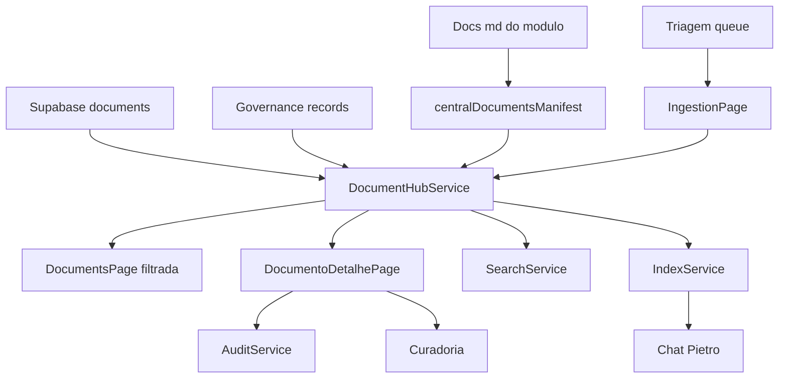

# Plano 01.12 — Execução Consolidada Document Hub V1 — Central de Padrões

Data: 2026-06-13  
Módulo: `src/modules/central_padroes`  
Escopo: consolidação dos planos `01.05`, `01.10` e `01.11`, com nova varredura do estado atual do módulo.  
Restrição aplicada: somente leitura, análise e documentação; nenhum arquivo de código-fonte foi modificado.

---

## 1. Resumo executivo

A Central de Documentos e Padrões já possui uma base operacional relevante: layout próprio, sidebar ampla, dashboard, CRUDs principais, busca textual ampliada, Chat Pietro, serviços de índice, auditoria, permissões, triagem, storage, governança, relatórios, auditorias, curadoria, LOZE-TRACE e testes unitários para serviços centrais.

O Document Hub V1, porém, ainda não está consolidado como hub mestre de documentos. O núcleo documental atual continua baseado em uma entidade `CentralDocument` curta e na tabela `central_padroes_documents` com campos limitados. Há ainda ausência de tela de detalhe documental, preview markdown, manifest documental enriquecido, editor persistente, normalizadores, filtros avançados, navegação real para documentos individuais e reconciliação específica entre `.md`, Supabase e registros de governança.

A execução deve ser dividida em duas trilhas:

1. **Sem R5:** consolidar o Hub como camada de leitura, indexação, busca, detalhe, filtros, curadoria, auditoria e navegação, sem alterar schema/storage/RPC remoto.
2. **Com R5:** ampliar schema de `central_padroes_documents`, resolver storage/RPC/buckets, criar persistência real de conteúdo markdown e editor completo.

---

## 2. Resumo dos três planos base

### 2.1 Plano 01.05 — plano técnico principal

O plano `01.05-plano-document-hub-v1-central-padroes-12-06-2026-deep-v4-pro.md` identifica o gap estrutural central: a tabela `central_padroes_documents` existe, mas não possui campos suficientes para operar como Document Hub V1.

Pontos principais:

- transformar a Central de “índice + dashboard + CRUDs separados” em módulo-mestre documental;
- expandir `CentralDocument` de entidade curta para entidade documental rica;
- criar manifest documental enriquecido;
- criar `DocumentoDetalhePage` e `MarkdownPreview`;
- refatorar `DocumentsPage` com filtros, colunas, ações e origem;
- integrar contadores de governance tables no dashboard;
- adicionar origem em resultados de busca;
- separar implementação sem R5 da implementação com R5;
- criar migration R5 para `central_padroes_documents` com `slug`, `type`, `risk_level`, `owner`, `tags`, `summary`, `content`, caminhos, origem, módulo, divisão e autoria;
- criar `DocumentoEditorPage` apenas após schema/persistência adequados.

### 2.2 Plano 01.10 — auditoria complementar sistêmica

O plano `01.10-plano-document-hub-v1-central-padroes-12-06-2026-codex-5-5.md` complementa o plano técnico e detecta riscos que poderiam deixar o Hub visualmente funcional, mas sistemicamente inconsistente.

Pontos principais:

- já existe `centralPadroesIndexService.ts`; um novo manifest não pode duplicar fonte de verdade;
- Chat Pietro usa índice antigo e rotas fictícias por item;
- `InternalDocsPage`, `ExternalDocsPage` e `ArchivePage` são wrappers simples de `DocumentsPage`;
- há serviço real de triagem (`centralPadroesTriagemService.ts`) enquanto a UI de `ingestion` ainda é planned view;
- `centralPadroesStorageService.ts` usa nomes de buckets diferentes dos buckets oficiais da migration V5;
- auditoria documental não está integrada a criar/editar/status/curadoria/delete;
- matriz de permissões é centrada em padrões, não em documentos;
- status/tipos/risco precisam de normalização;
- `deleteDocument()` usa DELETE real, apesar de haver soft delete no schema;
- reconciliação não entende documentos físicos `.md`, documentos vivos e governance records;
- Documentos Mestres precisam entrar no renderer comum do Hub;
- integrações TaskZei e Monitoramento estão mockadas/futuras;
- EvidencePage e Tags continuam planned views;
- faltam testes específicos do Hub.

### 2.3 Plano 01.11 — comparativo e método de auditoria cascata

O relatório `01.11-comparativo-planos-document-hub-v1-central-padroes-12-06-2026.md` compara as abordagens anteriores e propõe um padrão de auditoria profunda.

Pontos principais:

- a auditoria ideal precisa cruzar produto, inventário, dados, UI, serviços, navegação, busca/IA, persistência, governança, integrações, testes e R5;
- a matriz entidade × camada é necessária para evitar lacunas;
- procurar “promessas falsas” como `plannedView`, `return []`, `console.info`, `future`, `fallback`, rotas fictícias e storage divergente;
- seguir fluxos do clique ao banco: botão → handler → service → tipo → REST/RPC → tabela/bucket → RLS → auditoria → reindex → reload;
- separar tudo em P0/P1/P2 sem R5 e R5 schema/storage/RLS/RPC.

---

## 3. Estado atual do módulo

### 3.1 Entry points e contrato do módulo

| Arquivo | Finalidade atual | Observação Document Hub |
|---|---|---|
| `index.ts` | Exporta manifest, routes e module doc. | Barrel mínimo e adequado. |
| `manifest.ts` | Define id `central_padroes`, base route `/central_padroes`, owner Zico Padron. | Route usa underscore, enquanto alguns serviços geram `/central-padroes/...` com hífen. |
| `routes.tsx` | Registra `CentralPadroesLayout` em `/central_padroes/*`. | Não há rotas reais por item/documento. |
| `module-doc.ts` | Documenta propósito, limites e dependências de dados. | Buckets listados (`canonical-documents`, `evidence-files`) divergem dos buckets oficiais atuais (`cp-documents`, `cp-evidence`) e do service (`central-padroes-*`). |

### 3.2 Layout, navegação e sidebar

| Arquivo | Finalidade atual | Observação Document Hub |
|---|---|---|
| `layout/CentralPadroesLayout.tsx` | Shell principal com sidebar, topbar, registrar, seed e renderização por estado interno `currentView`. | Não possui view `documento-detalhe` nem estado de `selectedDocumentId`. |
| `data/sidebarConfig.ts` | Fonte da sidebar e breadcrumbs. | Inclui `tags`, `ingestion` e `evidence`, mas essas views ainda são planned views no layout. |

Views planejadas detectadas:

- `tags`: classificação futura;
- `ingestion`: triagem visual planejada apesar de existir service real;
- `evidence`: evidências planejadas apesar de existir audit/evidence plumbing parcial e bucket oficial.

### 3.3 Páginas documentais e de governança

| Arquivo | Finalidade atual | Lacuna para Document Hub |
|---|---|---|
| `pages/DocumentsPage.tsx` | Lista documentos do snapshot, filtra por texto/status, cria/edita metadados básicos, chama ingestão via RPC ao criar. | Não mostra tipo, risco, owner real, tags, resumo, origem, caminhos absoluto/relativo, preview, detalhe ou ações de curadoria. |
| `pages/InternalDocsPage.tsx` | Wrapper de `DocumentsPage`. | Precisa filtro contextual interno. |
| `pages/ExternalDocsPage.tsx` | Wrapper de `DocumentsPage`. | Precisa filtro contextual externo. |
| `pages/ArchivePage.tsx` | Wrapper de `DocumentsPage`. | Precisa listar legado/arquivado/soft-deleted conforme permissão. |
| `pages/DocumentosMestresPage.tsx` | Lista standards `DM-*` de `documentacao_tecnica`, com detalhe inline e edição de metadados. | Deve usar renderer comum do Hub e não ficar isolada. |
| `pages/DocumentoBasePage.tsx` | Mostra Documento-base 99 a partir do acervo/fallback. | Deve ser mapeado como documento especial no Hub. |
| `pages/SubdocumentosPrevistosPage.tsx` | Lista subdocumentos planejados. | Deve alimentar manifest/índice como previstos/incompletos. |
| `pages/CentralGovernanceRecordsPage.tsx` | CRUD genérico para reports/audits/curadoria com campos ricos. | Já é referência de formulário rico para o Hub. |
| `pages/RelatoriosPage.tsx` | Wrapper governance para `central_padroes_reports`. | Operacional. |
| `pages/AuditsPage.tsx` | Wrapper governance para `central_padroes_audits`. | Operacional. |
| `pages/CuradoriaPage.tsx` | Wrapper governance para `central_padroes_curadoria`. | Operacional e deve receber ações do Hub. |
| `pages/AgentsPage.tsx` | Lista e cria LOZE-TRACE. | Operacional sobre `central_padroes_trace_logs`. |
| `pages/SearchPage.tsx` | Busca textual ampliada em snapshot + governance + trace. | Navegação por resultado volta à view geral, não ao detalhe do item. |
| `pages/ChatPietroPage.tsx` | UI do Chat Pietro. | Ao clicar fonte dispara `sagb:navigate` com rota gerada, mas o layout atual não processa navegação por item. |
| `pages/DashboardPage.tsx` | Cards de métricas do snapshot e aprovações. | Ainda não inclui contadores de reports/audits/curadoria/trace. |

### 3.4 Tipos e modelo de domínio

| Arquivo | Estado atual | Lacuna para Document Hub |
|---|---|---|
| `types/index.ts` | Tipos ricos para standards, auditoria, permissões, search, index e Chat Pietro. | `CentralDocument` permanece curto: `id`, `title`, `path`, `status`, `category`, `areaId`, `shouldBecome`, soft delete. |
| `types/index.ts` | `CentralAction` cobre ações de padrões e agente. | Não cobre ações documentais como criar, editar metadados, editar conteúdo, publicar, arquivar, enviar para curadoria. |
| `types/index.ts` | `DocumentIndexEntry` cobre busca para Pietro. | Não inclui origem, path absoluto/relativo, contentAvailability, tipo documental real ou risk separado para documento. |
| `types/index.ts` | `SearchResult` já tem `originLabel` e `meta` rico. | Documentos do snapshot ainda não preenchem meta rica porque o tipo/fonte é limitada. |

### 3.5 Serviços existentes

| Serviço | Finalidade atual | Observação Document Hub |
|---|---|---|
| `centralPadroesRepository.ts` | Monta snapshot fallback + Supabase + governance_rules legadas. | Metrics ainda não contam governance tables. |
| `centralPadroesSyncService.ts` | Busca online via CRUD service e monta snapshot. | Só inclui entidades clássicas; governance records entram pela busca, não pelo snapshot. |
| `centralPadroesCrudService.ts` | CRUD de áreas, standards, documents, decisions, checklists, modules e agents. | `mapDocument` e inputs só cobrem campos antigos; `deleteDocument` usa DELETE real. |
| `centralPadroesIndexService.ts` | Constrói índice em memória para standards, documents e decisions, com cache e permissões. | Rotas fictícias e documento limitado; deve virar consumidor do Hub/manifest. |
| `centralPadroesSearchService.ts` | Busca textual ampliada em snapshot, reports, audits, curadoria e trace logs. | Boa base, mas não unificada com index/Pietro e sem detalhe por item. |
| `centralPadroesChatPietroService.ts` | Pergunta/resposta sobre índice e fallback textual. | Usa rotas fictícias e não inclui governance tables na camada de índice. |
| `centralPadroesTriagemService.ts` | Lista fila de ingestão, aceita e ignora sugestões. | Falta página real de triagem. |
| `centralPadroesStorageService.ts` | Chama RPC `central_padroes_ingest_document` e declara buckets. | Buckets divergentes dos oficiais; não faz upload em storage. |
| `centralPadroesAuditService.ts` | Loga eventos críticos, owner, status, evidência, Chat Pietro e consultas. | Não está conectado ao CRUD documental. |
| `centralPadroesPermissionService.ts` | Resolve role e matriz de ações. | Permissões documentais ausentes. |
| `centralPadroesReconciliationService.ts` | Compara fallback vs Supabase por entidade clássica. | Não reconcilia `.md` físico, governance records, snapshots e documentos vivos. |
| `centralPadroesGovernanceService.ts` | CRUD genérico para reports/audits/curadoria e trace logs. | Base madura para registros ricos do Hub. |
| `centralPadroesReportsService.ts` | Wrapper de reports. | Operacional. |
| `centralPadroesAuditsService.ts` | Wrapper de audits. | Operacional. |
| `centralPadroesCuradoriaService.ts` | Wrapper de curadoria. | Operacional. |
| `centralPadroesTraceLogsService.ts` | Wrapper de LOZE-TRACE. | Operacional. |
| `centralPadroesSeedService.ts` | Sincroniza fallback para Supabase. | Útil, mas não deve reconciliar automaticamente documentos físicos sem confirmação. |
| `centralPadroesValidationService.ts` | Valida campos mínimos de CRUDs. | Validação documental precisa expandir com campos do Hub. |

### 3.6 Componentes reutilizáveis

| Componente | Finalidade atual | Lacuna para Document Hub |
|---|---|---|
| `CentralPageShell.tsx` | Shell visual de página. | Reutilizável. |
| `SectionPanel.tsx` | Painel de seção. | Reutilizável. |
| `CrudModal.tsx` | Modal CRUD. | Reutilizável, mas editor documental precisa componentes específicos. |
| `FormField.tsx` | Input/textarea simples. | Insuficiente para selects, tags, validação, disabled, hint, required e markdown. |
| `StatusBadge.tsx` | Badge para vários status/risco. | Precisa normalizadores e novos status documentais. |
| `Toast.tsx`, `ConfirmDialog.tsx`, `EmptyState.tsx`, `MetricCard.tsx` | UI de apoio. | Reutilizáveis. |
| `StandardTable.tsx`, `ChecklistPanel.tsx`, `AgentRunBoard.tsx`, `ApprovalBadge.tsx` | Componentes específicos. | Úteis, mas não substituem tabela/detail do Hub. |

Componentes ausentes para o Hub:

- `MarkdownPreview.tsx`;
- `MarkdownEditor.tsx` ou editor interno;
- `TagsField.tsx`;
- `SelectField.tsx`;
- `RiskSelect.tsx`;
- `StatusSelect.tsx`;
- `DocumentMetadataPanel.tsx` opcional;
- `DocumentAuditTimeline.tsx` opcional.

### 3.7 Docs, reports e audits existentes

O diretório `docs/` já contém acervo significativo:

- `docs/plans/`: planos 01.00, 01.05, 01.10, 01.11 e planos anteriores de correção, curadoria e UI/UX;
- `docs/reports/`: relatórios de fechamento, integração de busca/CRUDs, LOZE-TRACE, QA, reconciliação, dark mode e Supabase;
- `docs/audits/`: auditorias de uso real, UI/UX, dark mode, histórico Supabase, testes e comparação com TaskZei;
- `docs/overview/`: mapa documental e mapa de navegação;
- `docs/standards/`: padrões LOZE e documentação guiada;
- `docs/MD-central-de-padroes/`: acervo de Documentos Mestres e fontes originais;
- `docs/99-curadoria/fora-do-padrao/`: materiais preservados fora do padrão.

Esse acervo deve ser inventariado pelo manifest do Hub, mas não deve ser automaticamente “salvo” como documento vivo no Supabase sem fluxo de triagem/curadoria.

### 3.8 Testes existentes

Testes encontrados:

- `__tests__/auditService.test.ts`;
- `__tests__/canonicalGateService.test.ts`;
- `__tests__/fase2_integration.test.ts`;
- `__tests__/permissionService.test.ts`;
- `__tests__/reconciliationService.test.ts`;
- `__tests__/types.test.ts`.

Lacuna: não há testes específicos para manifest documental, normalizadores, `DocumentsPage` parametrizada, wrappers documentais, detalhe documental, Chat Pietro com origem, busca com detalhe e permissões documentais.

### 3.9 Supabase/migrations relacionados

Estado identificado nas migrations:

- `central_padroes_documents` foi criada com campos mínimos: `id`, `title`, `source_path`, `status`, `category`, `area_id`, `destination_type`, `created_at`, `updated_at`;
- migration V3 adicionou `deleted_at` e `deleted_by` e RLS de soft delete via update;
- existe tabela `central_padroes_ingestion_queue` e RPC `central_padroes_ingest_document`;
- migration V5 criou buckets oficiais `cp-documents` e `cp-evidence`;
- migration V5 criou `central_padroes_search_index` com pgvector/search_vector;
- migration 20260612000101 criou `central_padroes_reports`, `central_padroes_audits`, `central_padroes_trace_logs` e `central_padroes_curadoria` com campos ricos.

---

## 4. Análise de lacunas — existe vs precisa criar

### 4.1 Núcleo documental

| Capacidade | Existe hoje | Necessário no Document Hub V1 | Classificação |
|---|---|---|---|
| Listar documentos | Sim, básico em `DocumentsPage`. | Lista enriquecida com tipo, risco, owner, tags, summary, origem e caminho. | Sem R5 para inferência; R5 para persistir. |
| Abrir detalhe | Não. | `DocumentoDetalhePage` com metadata panel, preview e ações. | Sem R5. |
| Preview markdown | Não. | `MarkdownPreview` com fallback seguro. | Sem R5. |
| Editar metadados ricos | Parcial, só campos básicos. | Form completo com normalização e permissões. | Sem R5 parcial; R5 para persistir campos novos. |
| Editar conteúdo markdown | Não. | Editor com preview e salvamento. | R5. |
| Manifest `.md` | Não. | Manifest enriquecido alimentando Hub/index/search/Pietro. | Sem R5. |
| Documento vivo Supabase | Parcial. | Documento com `content`, `summary`, `tags`, `owner`, `source`, `canonical_level`. | R5. |
| Reconciliação `.md` ↔ Supabase | Não. | Relatório de divergência Document Hub. | Sem R5 para relatório; R5 para aplicar merge persistente. |

### 4.2 Busca, índice e Chat Pietro

| Capacidade | Existe hoje | Lacuna |
|---|---|---|
| Busca textual global | Sim, em `centralPadroesSearchService`. | Não usa o mesmo índice do Pietro e documentos não têm metadados ricos. |
| Índice Pietro | Sim, em `centralPadroesIndexService`. | Não consome manifest e gera rotas por item inexistentes. |
| Chat Pietro | Sim, UI + service. | Fontes não navegam corretamente para detalhe; governance records não entram no índice principal. |
| Search index Supabase | Existe schema. | Frontend ainda usa fallback textual; pgvector/híbrida fica futura. |

### 4.3 Navegação e UX

| Item | Existe hoje | Lacuna |
|---|---|---|
| Layout por view | Sim. | Falta seleção por entidade e detail views. |
| Sidebar | Sim. | Entradas planned devem virar reais ou claramente limitadas. |
| Wrappers internos/externos/arquivo | Sim, wrappers. | Precisam filtros e contexto visual. |
| Botão abrir origem da busca | Sim. | Vai para view geral, não item específico. |
| Fonte do Chat Pietro | Sim. | Dispara evento com rota que o layout não entende. |

### 4.4 Governança, segurança e auditoria

| Item | Existe hoje | Lacuna |
|---|---|---|
| Auditoria | Service e tabela existem. | CRUD documental não registra eventos. |
| Permissões | Service e matriz existem. | Ações documentais ausentes. |
| Soft delete | Schema e RLS existem. | Service ainda usa DELETE real. |
| Curadoria | Página e tabela existem. | Ações do Hub não enviam documento para curadoria com rastreabilidade. |
| Evidence | Plumbing parcial. | UI planned e buckets divergentes nos contratos. |

---

## 5. Faseamento proposto

### Fase P0-A — Contrato documental unificado sem R5

Dependências: nenhuma.

- [ ] Criar `services/centralPadroesDocumentHubService.ts` como fachada única para documentos do Hub.
- [ ] Criar `data/centralDocumentsManifest.ts` com inventário estático/`import.meta.glob` dos `.md` relevantes.
- [ ] Definir tipo documental enriquecido com campos opcionais em `CentralDocument`.
- [ ] Criar normalizadores `normalizeDocumentStatus`, `normalizeDocumentType`, `normalizeRiskLevel`.
- [ ] Criar mapeamento de origem: `supabase_live`, `md_indexado`, `governance_report`, `governance_audit`, `governance_curadoria`, `trace_log`, `fallback`.
- [ ] Garantir que o manifest alimente o DocumentHubService e que o IndexService consuma essa fachada, não um índice paralelo.

### Fase P0-B — Tela de detalhe e preview sem R5

Dependências: P0-A.

- [ ] Criar `components/MarkdownPreview.tsx`.
- [ ] Criar `pages/DocumentoDetalhePage.tsx`.
- [ ] Exibir metadados ricos: título, tipo, status normalizado, risco, owner, tags, categoria, caminhos, origem, módulo, divisão, nível canônico e disponibilidade de conteúdo.
- [ ] Exibir preview quando `content` existir e fallback quando conteúdo não estiver disponível.
- [ ] Adicionar ações seguras: copiar caminho, marcar incompleto localmente/metadata quando possível, enviar para curadoria, voltar para lista.
- [ ] Exibir timeline de auditoria quando houver logs e fallback silencioso quando audit log falhar.

### Fase P0-C — Navegação interna por documento

Dependências: P0-B.

- [ ] Expandir `CentralPadroesView` com `documento-detalhe`.
- [ ] Adicionar estado `selectedDocumentId`/`selectedDocumentRef` no layout.
- [ ] Passar callback `onOpenDocument` para `DocumentsPage`, `SearchPage` e Chat Pietro.
- [ ] Padronizar rotas internas geradas por services para view/action do layout, evitando `/central-padroes/documents/{id}` fictício.
- [ ] Fazer clique em busca e fontes do Pietro abrir detalhe real.

### Fase P0-D — Refatorar lista documental e wrappers

Dependências: P0-A e P0-C.

- [ ] Parametrizar `DocumentsPage` com `initialFilters`, `title`, `subtitle`, `context` e `sourceScope`.
- [ ] Adicionar colunas: tipo, risco, owner, tags, origem, caminho.
- [ ] Adicionar filtros: tipo, risco, owner, tag, origem e status normalizado.
- [ ] Adicionar ação “Abrir” por linha.
- [ ] Transformar `InternalDocsPage` em filtro de internos.
- [ ] Transformar `ExternalDocsPage` em filtro de externos.
- [ ] Transformar `ArchivePage` em filtro de legado/arquivado/soft-deleted quando permitido.
- [ ] Integrar `DocumentosMestresPage`, `DocumentoBasePage` e `SubdocumentosPrevistosPage` ao renderer/detalhe comum sem duplicar entidade.

### Fase P0-E — Busca, índice e Pietro consistentes

Dependências: P0-A e P0-C.

- [ ] Atualizar `centralPadroesIndexService.ts` para consumir DocumentHubService.
- [ ] Expandir `DocumentIndexEntry` com origem, paths, risk, tags ricas e contentAvailability.
- [ ] Atualizar `centralPadroesSearchService.ts` para usar metadados do Hub em documentos e manter governance records.
- [ ] Atualizar `centralPadroesChatPietroService.ts` para usar o índice unificado e incluir origem/canonicidade nas fontes.
- [ ] Atualizar `ChatPietroPage` para abrir detalhe por callback/evento entendido pelo layout.

### Fase P1-A — Triagem real e curadoria operacional

Dependências: P0-A.

- [ ] Criar `pages/TriagemIngestaoPage.tsx` ou `pages/IngestionPage.tsx`.
- [ ] Conectar a `centralPadroesTriagemService.listQueue`, `acceptSuggestion` e `ignore`.
- [ ] Ao aceitar item, abrir criação/edição de documento ou enviar para curadoria.
- [ ] Registrar evento de auditoria de triagem.
- [ ] Substituir `plannedView` de `ingestion` por página real.

### Fase P1-B — Auditoria, permissões e soft delete documental

Dependências: P0-A e P0-D.

- [ ] Expandir `CentralAction` com ações documentais.
- [ ] Atualizar `CENTRAL_PERMISSION_MATRIX` para documentos.
- [ ] Adicionar helpers `canEditDocument`, `canPublishDocument`, `canArchiveDocument`, `canSendDocumentToCuradoria`.
- [ ] Integrar `centralPadroesAuditService` em create/update/status/curadoria/delete/restore/copy path quando aplicável.
- [ ] Trocar `deleteDocument()` para soft delete via `deleted_at`/`deleted_by`.
- [ ] Exibir botões desabilitados e estado somente leitura conforme perfil.

### Fase P1-C — Dashboard e governança cruzada

Dependências: P0-A.

- [ ] Expandir `CentralDashboardMetrics` com `reports`, `audits`, `curadoria`, `traceLogs`, `documentsIncomplete`, `documentsWithoutOwner`.
- [ ] Atualizar `centralPadroesRepository.getMetrics()` ou criar metrics service dedicado.
- [ ] Adicionar MetricCards no dashboard para Relatórios, Auditorias, Curadoria e LOZE-TRACE.
- [ ] Adicionar seção de lacunas documentais: sem owner, sem tag, sem resumo, sem path, sem conteúdo, duplicados.

### Fase P1-D — Reconciliação Document Hub

Dependências: P0-A.

- [ ] Atualizar `centralPadroesReconciliationService.ts` para reconhecer `md_indexado`, `supabase_live`, `governance_record` e `fallback`.
- [ ] Gerar relatório específico de divergências Document Hub.
- [ ] Marcar `.md` sem registro Supabase e Supabase sem `.md` correspondente.
- [ ] Não aplicar seed/merge automático sem confirmação explícita.

### Fase P2-A — Evidence, tags e integrações com transparência operacional

Dependências: P1-B e decisão de storage.

- [ ] Criar EvidencePage mínima ou manter planned view com mensagem de limitação real.
- [ ] Criar TagsPage mínima ou incorporar tags como filtro/gestão no Hub.
- [ ] Marcar TaskZei e Monitoramento como não operacionais quando retornarem mock/`return []`.
- [ ] Remover ou bloquear botões que prometem integração real sem persistência.

### Fase P2-B — Testes e QA do Hub

Dependências: P0/P1 correspondentes.

- [ ] Testar manifest/enriquecimento.
- [ ] Testar normalizadores.
- [ ] Testar DocumentHubService.
- [ ] Testar IndexService com documentos enriquecidos.
- [ ] Testar SearchService com origem e navegação.
- [ ] Testar Chat Pietro retornando documentos, reports, audits e curadoria.
- [ ] Testar permissões documentais.
- [ ] Testar wrappers `InternalDocsPage`, `ExternalDocsPage`, `ArchivePage`.
- [ ] Executar build/test após blocos de implementação.

---

## 6. Itens que requerem R5

Os itens abaixo exigem alteração de Supabase remoto, schema, storage, RLS/policies ou RPC e devem ficar isolados em plano próprio.

| Item | Tipo R5 | Motivo |
|---|---|---|
| Adicionar campos ricos em `central_padroes_documents` | Schema | Persistir `slug`, `type`, `risk_level`, `owner`, `tags`, `summary`, `content`, paths, origem, módulo, divisão, canonicalidade e autoria. |
| Índices em campos novos | Schema/performance | Filtros por tipo, risco, owner, origem, tags e canonicalidade. |
| Ajustar RLS para campos e ações documentais | RLS/policy | Garantir leitura, edição, publicação, arquivamento e conteúdo por perfil. |
| Trocar delete real por soft delete obrigatório | Schema/RLS/service | Schema já tem soft delete, mas políticas e service precisam convergir. |
| Padronizar buckets | Storage | Service usa `central-padroes-documents`, `central-padroes-evidence`, `central-padroes-templates`; migration criou `cp-documents`, `cp-evidence`; module-doc cita outros nomes. |
| Implementar upload real de documento/evidência | Storage/RLS | Hoje `centralPadroesStorageService` só chama RPC, não faz upload em bucket. |
| Revisar/estender `central_padroes_ingest_document` | RPC | RPC existe, mas precisa confirmar contrato com Hub, storage, raw content, triagem, auditoria e retorno estruturado. |
| Usar `central_padroes_search_index`/pgvector operacionalmente | Schema/RPC/job | Tabela existe, mas frontend ainda usa busca textual. Reindex semântico exigiria pipeline/RPC/job. |
| Persistir conteúdo markdown editado | Schema/storage | Requer `content` ou storage path oficial. |
| Editor documental completo | Depende de schema/storage | UI pode existir sem salvar conteúdo, mas salvamento real é R5. |

Plano R5 correspondente: `01.13-plano-r5-document-hub.md`.

---

## 7. Riscos e bloqueios conhecidos

| Risco/bloqueio | Impacto | Mitigação |
|---|---|---|
| Duplicar manifest e index service | Busca/Pietro inconsistentes. | Criar DocumentHubService como fonte única e fazer IndexService consumir a fachada. |
| Rotas fictícias `/central-padroes/...` | Fontes do Pietro e busca não abrem item real. | Navegação por estado interno e callbacks do layout. |
| Schema limitado de `central_padroes_documents` | Não persiste conteúdo/metadados ricos. | Fazer Hub sem R5 com campos inferidos e separar persistência no plano R5. |
| Buckets divergentes | Upload/ingestão falham. | Padronizar nomes em R5 antes de prometer storage. |
| DELETE real em documentos | Perda de histórico ou falha por RLS. | Migrar service para soft delete e auditoria. |
| Permissões documentais ausentes | Leitores podem ver ações indevidas ou editors podem salvar indevidamente. | Expandir matriz e bloquear UI/service. |
| Planned views parecem prontas | Usuário encontra telas sem operação real. | Transformar triagem em real; evidências/tags com aviso explícito ou implementação mínima. |
| Adapters mockados | Integração aparente sem efeito real. | Sinalizar não operacional e remover promessas de automação. |
| Documentos `.md` sem metadados | Lista fica incompleta/confusa. | Marcar como incompleto e permitir curadoria. |
| Busca textual vs pgvector | Expectativa de IA sem semântica real. | Manter rótulo “textual” até pipeline semântico R5/posterior. |
| Editor sem R5 | Falso salvamento de markdown. | Não criar botão de salvar conteúdo real antes da persistência. |

---

## 8. Mermaid — arquitetura consolidada

---

## 9. Ordem consolidada de execução

1. Implementar contrato do Hub sem R5: tipos opcionais, normalizadores, manifest e DocumentHubService.
2. Conectar IndexService, SearchService e Chat Pietro ao contrato unificado.
3. Criar detalhe documental e preview markdown read-only.
4. Ajustar layout para abrir documento específico.
5. Refatorar DocumentsPage e wrappers internos/externos/arquivo.
6. Integrar Documentos Mestres, Documento-base 99 e Subdocumentos Previstos ao renderer comum.
7. Criar Triagem/IngestionPage real.
8. Adicionar auditoria e permissões documentais.
9. Corrigir soft delete documental no service.
10. Expandir dashboard com governance counts e lacunas documentais.
11. Atualizar reconciliação para Document Hub.
12. Adicionar testes unitários e QA.
13. Executar plano R5 separado para schema/storage/RPC antes de editor persistente.

---

## 10. Critérios de pronto do Document Hub V1 sem R5

- [ ] Documentos Supabase, `.md` indexados e registros de governança aparecem em visão unificada ou claramente segmentada.
- [ ] Cada documento pode abrir tela de detalhe real.
- [ ] Metadados ricos são exibidos, mesmo quando inferidos.
- [ ] Documentos incompletos são marcados como incompletos, não ocultados.
- [ ] Preview markdown funciona quando conteúdo estiver disponível.
- [ ] Nenhum fluxo promete salvar markdown local em `Z:\`.
- [ ] Busca e Chat Pietro usam fonte compatível e abrem item real.
- [ ] Wrappers internos/externos/arquivo têm filtros próprios.
- [ ] Triagem deixa de ser planned view ou fica explicitamente limitada.
- [ ] Auditoria e permissões protegem ações documentais.
- [ ] Soft delete substitui delete real.
- [ ] Dashboard mostra lacunas e contadores de governança.
- [ ] Testes específicos do Hub passam.

---

## 11. Entregáveis principais

### Sem R5

- `data/centralDocumentsManifest.ts` — novo.
- `services/centralPadroesDocumentHubService.ts` — novo.
- `utils` ou serviço de normalizadores documentais — novo.
- `components/MarkdownPreview.tsx` — novo.
- `pages/DocumentoDetalhePage.tsx` — novo.
- `pages/TriagemIngestaoPage.tsx` ou `pages/IngestionPage.tsx` — novo.
- `types/index.ts` — expandir tipos.
- `layout/CentralPadroesLayout.tsx` — navegação por detalhe.
- `pages/DocumentsPage.tsx` — refatorar lista e filtros.
- `pages/InternalDocsPage.tsx`, `ExternalDocsPage.tsx`, `ArchivePage.tsx` — filtros contextuais.
- `pages/SearchPage.tsx`, `ChatPietroPage.tsx` — abrir detalhe real.
- `services/centralPadroesIndexService.ts`, `centralPadroesSearchService.ts`, `centralPadroesChatPietroService.ts` — fonte unificada.
- `services/centralPadroesCrudService.ts` — mapDocument expandido e soft delete.
- `services/centralPadroesAuditService.ts`, `centralPadroesPermissionService.ts` — integração documental.
- Testes novos para Hub.

### Com R5

- Migration de schema para `central_padroes_documents`.
- Padronização de storage buckets.
- Revisão/expansão da RPC `central_padroes_ingest_document`.
- Políticas RLS/policies para ações documentais.
- Editor markdown persistente.
- Integração opcional com `central_padroes_search_index`/pgvector.

---

## 12. Conclusão

O caminho seguro é não iniciar pelo editor. A prioridade é primeiro criar uma fonte documental unificada que use o que já existe: CRUD, governance records, índice, busca, Chat Pietro, triagem, auditoria, permissões e acervo `.md`. Depois, a UI deve abrir detalhe real, filtrar corretamente e expor lacunas sem falso salvamento. Só então faz sentido executar o plano R5 para persistir conteúdo e metadados ricos no Supabase.

