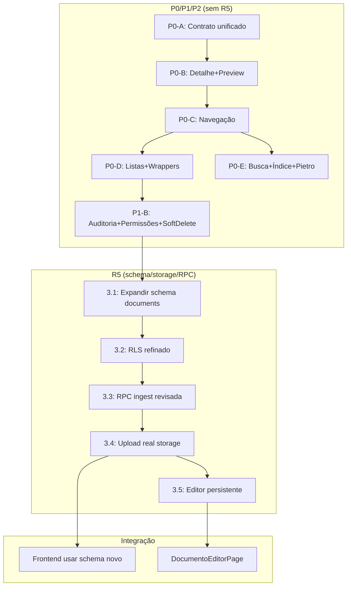

# Plano 01.14 — Recomendações Pré-R5 — Document Hub V1

**Data:** 13-06-2026  
**Módulo:** `src/modules/central_padroes`  
**Origem:** Auditoria de consistência entre plano R5 (01.13) e documentação oficial do módulo.  
**Restrição:** Apenas documentação. Nenhuma migration, código ou storage foi alterado nesta etapa.

---

## 1. Resumo Executivo

O plano R5 original (01.13) listou corretamente as necessidades de schema/storage/RPC, mas não considerou que **3 dos 9 itens já foram executados** em migrations anteriores do Supabase (V5 e governance extension). Este documento revisa o que realmente precisa ser feito.

---

## 2. Itens do R5 que JÁ FORAM EXECUTADOS

| Item do plano 01.13 | Onde já foi feito | Ação |
|---|---|---|
| **Padronizar buckets** (`cp-documents`, `cp-evidence`) | Migration V5: `20260603000001_central_padroes_v5_producao.sql` — buckets criados com policies | ❌ Remover do R5 |
| **Ativar search index/pgvector** | Migration V5: `central_padroes_search_index` criada com embedding(1536), search_vector, RLS, trigger | ❌ Remover do R5 (é tarefa de frontend P0-E) |
| **Criar tabelas de governance** (reports, audits, trace_logs, curadoria) | Migration `20260612000101_central_padroes_documents_governance_extension.sql` — tabelas criadas com RLS | ❌ Remover do R5 |
| **RPCs de aprovação/publicação/busca** | Migration V5: `cp_approve_standard`, `cp_reject_standard`, `cp_publish_standard`, `cp_search_standards`, `cp_get_dashboard_metrics` | ❌ Remover do R5 |

---

## 3. Itens do R5 que AINDA PRECISAM SER FEITOS

### 3.1 — Expandir Schema de `central_padroes_documents`

**Migration necessária:** Adicionar 14 campos à tabela existente.

```sql
alter table public.central_padroes_documents
  add column if not exists slug text,
  add column if not exists type text,
  add column if not exists risk_level text,
  add column if not exists owner text,
  add column if not exists tags text[],
  add column if not exists summary text,
  add column if not exists content text,
  add column if not exists path_absolute text,
  add column if not exists path_relative text,
  add column if not exists source text,
  add column if not exists module text,
  add column if not exists division text,
  add column if not exists canonical_level text,
  add column if not exists created_by uuid references auth.users(id),
  add column if not exists updated_by uuid references auth.users(id);
```

**Índices:**
```sql
create index if not exists idx_cp_documents_slug on public.central_padroes_documents(slug);
create index if not exists idx_cp_documents_type on public.central_padroes_documents(type);
create index if not exists idx_cp_documents_risk on public.central_padroes_documents(risk_level);
create index if not exists idx_cp_documents_owner on public.central_padroes_documents(owner);
create index if not exists idx_cp_documents_source on public.central_padroes_documents(source);
create index if not exists idx_cp_documents_canonical_level on public.central_padroes_documents(canonical_level);
create index if not exists idx_cp_documents_tags on public.central_padroes_documents using gin(tags);
```

**Nome sugerido:** `20260613XXXXXX_central_padroes_document_hub_v1_documents.sql`  
⚠️ Verificar timestamp livre em `supabase/migrations/` antes de nomear.

### 3.2 — Refinar RLS/policies para Ações Documentais

Substituir policies genéricas por action-based:

| Ação | Perfil | Policy |
|---|---|---|
| SELECT (visualizar) | leitor+ | `cp_documents_select` |
| INSERT (criar) | editor+ | `cp_documents_insert` |
| UPDATE metadados | curador+ | `cp_documents_update_metadata` |
| UPDATE conteúdo | curador+ | `cp_documents_update_content` |
| Soft delete (archive) | curador+ | `cp_documents_archive` |
| Restore | administrador | `cp_documents_restore` |
| Publish/canonizar | aprovador+ | `cp_documents_publish` |

### 3.3 — Revisar RPC `central_padroes_ingest_document`

Expandir contrato atual (p_title, p_source_path, p_raw_content, p_source_kind) para:

```sql
p_title text,
p_source_path text default null,
p_raw_content text default null,
p_source_kind text default 'manual',
p_storage_bucket text default null,
p_storage_path text default null,
p_owner text default null,
p_tags text[] default '{}',
p_risk_level text default 'baixo',
p_module text default null,
p_division text default null,
p_create_document boolean default false
```

**Retorno sugerido:**
```json
{
  "queue_id": "uuid",
  "document_id": "uuid|null",
  "status": "queued|created|triage|blocked",
  "warnings": [],
  "source": "manual|md_indexado|upload|external"
}
```

### 3.4 — Upload Real de Documento/Evidência em Storage

- Implementar upload funcional usando buckets oficiais `cp-documents` e `cp-evidence`
- Path convention:
  - `documents/{document_id}/{slug}.md`
  - `documents/{document_id}/attachments/{filename}`
  - `evidence/{entity_type}/{entity_id}/{timestamp}-{filename}`
- Atualizar `centralPadroesStorageService.ts` (já corrigido com os nomes de buckets corretos)

### 3.5 — Editor Markdown Persistente

- Último passo da trilha R5
- Depende de schema expandido (3.1), RLS refinado (3.2), RPC revisada (3.3) e upload funcional (3.4)
- Criar `DocumentoEditorPage` apenas quando persistência estiver confirmada
- Botão "Salvar conteúdo" oculto/desabilitado sem R5

---

## 4. Correções Imediatas (já executadas)

| Arquivo | O que foi corrigido | Status |
|---|---|---|
| `src/modules/central_padroes/services/centralPadroesStorageService.ts` | Buckets `central-padroes-documents/evidence/templates` → `cp-documents`/`cp-evidence` | ✅ Feito |
| `src/modules/central_padroes/module-doc.ts` | Verificado: já estava correto com `cp-documents`/`cp-evidence` | ✅ Conforme |

---

## 5. Dependências entre Trilhas



---

## 6. Ordem de Execução Recomendada

### Passo 1 — Correções Imediatas (já feito)
- ✅ Buckets de storage padronizados no service
- ✅ module-doc.ts conforme

### Passo 2 — P0/P1/P2 (sem R5)
- Executar conforme plano 01.12
- P0-A a P0-E, P1-A a P1-D, P2-A a P2-B

### Passo 3 — R5 Schema
1. Confirmar vocabulário final de `type`, `status`, `risk_level`, `source`, `canonical_level`
2. **Aplicar migration** de campos ricos em `central_padroes_documents`
3. Aplicar índices
4. Refinar RLS/policies documentais

### Passo 4 — R5 Storage/RPC
5. Revisar RPC `central_padroes_ingest_document`
6. Implementar upload real em storage
7. Atualizar service frontend para schema/RPC novos
8. Trocar DELETE real por soft delete no frontend (P1-B)

### Passo 5 — R5 Editor
9. Implementar salvamento real de conteúdo markdown
10. Integrar audit log e reindex
11. Validar com testes e QA autenticado
12. Liberar `DocumentoEditorPage` persistente

---

## 7. Riscos e Alertas

| Risco | Impacto | Mitigação |
|---|---|---|
| Aplicar migration sem verificar timestamp livre | Conflito com migration existente | Listar `supabase/migrations/` antes de nomear |
| Constraints fortes antes de normalizar dados legados | Falhas em registros existentes | Adicionar `check` constraints após saneamento |
| RLS permissiva/restritiva demais | Bloqueio ou alteração indevida | Testes por perfil antes de liberar |
| Conteúdo markdown crescer na tabela | Performance ruim | Storage para arquivos grandes; `content` na tabela só para texto curto |
| Service `centralPadroesStorageService.ts` só chama RPC (não faz upload) | Upload não funcional | Implementar upload real no passo 4 |
| module-doc.ts pode precisar de revisão de versão | Documentação desatualizada | Atualizar `version` no module-doc.ts após aplicar mudanças |

---

## 8. Padrões do Módulo a Seguir

| Padrão | Documento | Regra |
|---|---|---|
| Documentação Guiada | `docs/standards/padrao-documentacao-guiada-loze-12-06-2026.md` | Responder: O que é, Para que serve, Onde fica, Como funciona, O que afeta, Quando mexer, Como testar, Qual risco, Quem aprova |
| Caminhos Copiáveis | `docs/standards/padrao-resposta-entrega-caminhos-copiaveis-loze-12-06-2026.md` | Toda entrega deve ter caminho absoluto + relativo |
| Datas de Documentos | `docs/standards/padrao-datas-documentos-governanca-loze-12-06-2026.md` | Nomes de arquivo em kebab-case, data dd-mm-aaaa no final |
| LOZE-TRACE | `docs/standards/loze-trace-protocolo-rastreabilidade-execucao-tecnica-loze-12-06-2026.md` | Registrar cada execução técnica |
| Matriz de Risco | `docs/standards/matriz-risco-comandos-tecnicos-loze-12-06-2026.md` | R5 exige autorização explícita |
| Navegação Interna | `layout/CentralPadroesLayout.tsx` + `data/sidebarConfig.ts` | Views gerenciadas por estado `currentView`, não URL |
