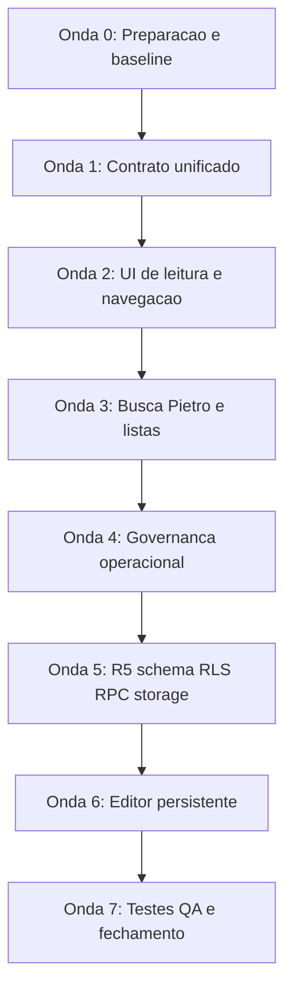

# Plano 01.15 — Mega Tarefa Document Hub V1 Completo — Central de Padrões

**Data:** 13-06-2026  
**Módulo:** `src/modules/central_padroes`  
**Origem:** Consolidação operacional dos planos `01.12`, `01.13` e `01.14`.  
**Objetivo:** Executar, em uma frente única e coordenada, tudo que falta para transformar a Central de Padrões em um Document Hub V1 completo.  
**Regra de segurança:** A execução pode ser tratada como uma mega tarefa, mas deve respeitar checkpoints técnicos. Itens R5 continuam exigindo autorização explícita antes de qualquer migration, alteração de RLS, RPC, storage ou persistência remota.

---

## 1. Resumo Executivo

Esta mega tarefa consolida em um único plano a execução completa do Document Hub V1:

1. Unificar contrato documental, manifest, normalização e fonte de verdade.
2. Criar detalhe documental, preview markdown, navegação real por documento e listas enriquecidas.
3. Integrar busca, índice e Chat Pietro ao mesmo contrato documental.
4. Operacionalizar triagem, curadoria, auditoria, permissões, soft delete, dashboard e reconciliação.
5. Executar R5 com schema rico, RLS action-based, RPC revisada, upload real e editor persistente.
6. Validar tudo com testes, QA autenticado e documentação de fechamento.

O módulo não será tratado como quebrado. Ele já possui base operacional relevante. A mega tarefa é uma evolução de escopo: de Central de Padrões para hub mestre documental.

---

## 2. Resultado Esperado

Ao final, o módulo deve permitir:

| Capacidade | Resultado esperado |
|---|---|
| Criar documentos | Criar documento com metadados ricos, origem, risco, owner, tags e persistência segura. |
| Alterar documentos | Editar metadados e conteúdo conforme perfil autorizado. |
| Excluir documentos | Usar archive/soft delete com auditoria, sem DELETE real destrutivo. |
| Restaurar documentos | Restaurar documento arquivado quando perfil permitir. |
| Comparar documentos | Comparar `.md`, Supabase, fallback e registros de governança. |
| Analisar documentos | Exibir lacunas, métricas, status, riscos, owners, tags, origem e canonicidade. |
| Buscar documentos | Usar busca unificada com origem e navegação para detalhe real. |
| Conversar com Pietro | Chat Pietro usando o índice unificado e abrindo fontes reais. |
| Fazer upload | Enviar documentos e evidências para buckets oficiais. |
| Editar markdown | Salvar conteúdo markdown com preview e rastreabilidade. |
| Auditar ações | Registrar eventos de criação, edição, publicação, arquivamento, restauração, curadoria, upload e busca crítica. |
| Governar o acervo | Integrar relatórios, auditorias, curadoria, trace logs e evidências ao Hub. |

---

## 3. Princípio de Execução

Apesar de ser uma mega tarefa, a execução deve ser feita em ondas encadeadas para evitar falso progresso:



Cada onda precisa deixar o módulo compilando e navegável antes de avançar. A execução pode ser feita em uma única iniciativa, mas não deve misturar migration, UI e editor sem checkpoints.

---

## 4. Onda 0 — Preparação e Baseline

### Objetivo

Confirmar o estado atual antes de iniciar a mega execução.

### Tarefas

- [ ] Listar arquivos atuais do módulo `src/modules/central_padroes`.
- [ ] Ler os pontos centrais dos planos `01.12`, `01.13`, `01.14`.
- [ ] Confirmar se `01.14-recomendacoes-pre-r5.md` existe e é a referência para R5 revisado.
- [ ] Listar `supabase/migrations/` antes de criar qualquer migration nova.
- [ ] Confirmar que buckets oficiais são `cp-documents` e `cp-evidence`.
- [ ] Confirmar se `centralPadroesStorageService.ts` já usa buckets oficiais.
- [ ] Confirmar status de `module-doc.ts`.
- [ ] Rodar inspeção estática dos arquivos principais antes de editar.
- [ ] Registrar riscos iniciais em entrega técnica.

### Critério de pronto

- [ ] Baseline entendido.
- [ ] Próximo timestamp livre de migration conhecido.
- [ ] Nenhuma alteração remota executada sem autorização explícita.

---

## 5. Onda 1 — Contrato Documental Unificado

### Objetivo

Criar uma fonte única para documentos do Hub, evitando duplicidade entre manifest, CRUD, busca, índice e Chat Pietro.

### Arquivos prováveis

| Arquivo | Ação |
|---|---|
| `src/modules/central_padroes/types/index.ts` | Expandir tipos documentais. |
| `src/modules/central_padroes/data/centralDocumentsManifest.ts` | Criar manifest documental. |
| `src/modules/central_padroes/services/centralPadroesDocumentHubService.ts` | Criar fachada única do Hub. |
| `src/modules/central_padroes/services/centralPadroesCrudService.ts` | Expandir mapper documental. |
| `src/modules/central_padroes/utils/documentNormalizers.ts` | Criar normalizadores se não existir padrão melhor. |

### Tarefas

- [ ] Expandir `CentralDocument` com campos opcionais ricos: `slug`, `type`, `riskLevel`, `owner`, `tags`, `summary`, `content`, `pathAbsolute`, `pathRelative`, `source`, `module`, `division`, `canonicalLevel`, `createdBy`, `updatedBy`, `contentAvailability`.
- [ ] Criar vocabulário inicial para status, tipo, risco, origem e nível canônico.
- [ ] Criar normalizadores para status documental.
- [ ] Criar normalizadores para tipo documental.
- [ ] Criar normalizadores para nível de risco.
- [ ] Criar normalizadores para origem documental.
- [ ] Criar manifest documental dos `.md` relevantes do módulo.
- [ ] Criar `centralPadroesDocumentHubService.ts` como fachada única.
- [ ] Fazer a fachada consolidar documentos Supabase, manifest `.md`, fallback e registros de governança quando aplicável.
- [ ] Marcar documentos incompletos com flags explícitas, sem ocultar lacunas.
- [ ] Evitar duplicar fonte de verdade no `centralPadroesIndexService.ts`.

### Critério de pronto

- [ ] Existe uma entidade documental enriquecida.
- [ ] Existe uma fachada única para consumir documentos.
- [ ] O módulo ainda compila sem exigir R5.

---

## 6. Onda 2 — UI de Leitura, Detalhe e Navegação Real

### Objetivo

Permitir abrir documento específico, visualizar metadados ricos e preview markdown sem prometer edição persistente antes do R5.

### Arquivos prováveis

| Arquivo | Ação |
|---|---|
| `src/modules/central_padroes/components/MarkdownPreview.tsx` | Criar preview markdown seguro. |
| `src/modules/central_padroes/pages/DocumentoDetalhePage.tsx` | Criar página de detalhe. |
| `src/modules/central_padroes/layout/CentralPadroesLayout.tsx` | Adicionar view de detalhe e estado de seleção. |
| `src/modules/central_padroes/types/index.ts` | Expandir `CentralPadroesView` se estiver centralizado. |
| `src/modules/central_padroes/pages/DocumentsPage.tsx` | Adicionar callback abrir documento. |
| `src/modules/central_padroes/pages/SearchPage.tsx` | Abrir detalhe real. |
| `src/modules/central_padroes/pages/ChatPietroPage.tsx` | Abrir fonte real. |

### Tarefas

- [ ] Criar `MarkdownPreview` com tratamento seguro para conteúdo ausente.
- [ ] Criar `DocumentoDetalhePage` com painel de metadados.
- [ ] Exibir título, tipo, status, risco, owner, tags, categoria, paths, origem, módulo, divisão e canonicidade.
- [ ] Exibir aviso quando conteúdo markdown não estiver disponível.
- [ ] Criar ações seguras: copiar caminho, voltar, enviar para curadoria quando disponível.
- [ ] Adicionar view `documento-detalhe` ao layout.
- [ ] Adicionar estado `selectedDocumentId` ou referência equivalente.
- [ ] Passar callback `onOpenDocument` para páginas que listam ou retornam documentos.
- [ ] Remover navegação fictícia para `/central-padroes/documents/{id}` onde existir.
- [ ] Garantir que busca e Pietro abram detalhe real pelo layout.

### Critério de pronto

- [ ] Um documento pode ser aberto em detalhe real.
- [ ] O detalhe mostra metadados ricos mesmo que parte deles seja inferida.
- [ ] Preview markdown funciona quando há conteúdo.
- [ ] Não existe botão de salvar conteúdo antes da onda R5/editor.

---

## 7. Onda 3 — Listas, Wrappers, Busca, Índice e Chat Pietro

### Objetivo

Transformar documentos em experiência navegável, filtrável e pesquisável de forma consistente.

### Arquivos prováveis

| Arquivo | Ação |
|---|---|
| `src/modules/central_padroes/pages/DocumentsPage.tsx` | Refatorar lista principal. |
| `src/modules/central_padroes/pages/InternalDocsPage.tsx` | Aplicar filtro contextual. |
| `src/modules/central_padroes/pages/ExternalDocsPage.tsx` | Aplicar filtro contextual. |
| `src/modules/central_padroes/pages/ArchivePage.tsx` | Aplicar filtro de arquivo/arquivados. |
| `src/modules/central_padroes/pages/DocumentosMestresPage.tsx` | Integrar ao renderer comum. |
| `src/modules/central_padroes/pages/DocumentoBasePage.tsx` | Integrar como documento especial. |
| `src/modules/central_padroes/pages/SubdocumentosPrevistosPage.tsx` | Integrar como previstos/incompletos. |
| `src/modules/central_padroes/services/centralPadroesIndexService.ts` | Consumir DocumentHubService. |
| `src/modules/central_padroes/services/centralPadroesSearchService.ts` | Usar metadados ricos. |
| `src/modules/central_padroes/services/centralPadroesChatPietroService.ts` | Usar índice unificado. |

### Tarefas

- [ ] Parametrizar `DocumentsPage` com filtros iniciais, título, subtítulo, contexto e escopo.
- [ ] Adicionar colunas: tipo, risco, owner, tags, origem, caminho e disponibilidade de conteúdo.
- [ ] Adicionar filtros por tipo, risco, owner, tag, origem e status.
- [ ] Adicionar ação abrir por linha.
- [ ] Transformar `InternalDocsPage` em lista filtrada real.
- [ ] Transformar `ExternalDocsPage` em lista filtrada real.
- [ ] Transformar `ArchivePage` em lista de legado/arquivados conforme permissão.
- [ ] Integrar Documentos Mestres ao renderer comum.
- [ ] Integrar Documento-base 99 ao Hub como documento especial.
- [ ] Integrar Subdocumentos Previstos como documentos planejados/incompletos.
- [ ] Atualizar `centralPadroesIndexService.ts` para consumir a fachada do Hub.
- [ ] Expandir entradas de índice com origem, paths, risk, tags e content availability.
- [ ] Atualizar `centralPadroesSearchService.ts` para usar metadados do Hub.
- [ ] Atualizar `centralPadroesChatPietroService.ts` para usar índice unificado.
- [ ] Atualizar fontes do Pietro para abrir detalhe real.

### Critério de pronto

- [ ] As listas documentais usam o mesmo contrato.
- [ ] Busca e Pietro usam a mesma base.
- [ ] Wrappers deixam de ser apenas cópias visuais da lista geral.

---

## 8. Onda 4 — Governança Operacional, Triagem, Auditoria, Permissões e Reconciliação

### Objetivo

Conectar o Hub às capacidades reais de governança já existentes no módulo.

### Arquivos prováveis

| Arquivo | Ação |
|---|---|
| `src/modules/central_padroes/pages/TriagemIngestaoPage.tsx` | Criar página real de triagem. |
| `src/modules/central_padroes/pages/IngestionPage.tsx` | Alternativa caso nome existente seja preferível. |
| `src/modules/central_padroes/services/centralPadroesTriagemService.ts` | Conectar UI. |
| `src/modules/central_padroes/services/centralPadroesAuditService.ts` | Integrar eventos documentais. |
| `src/modules/central_padroes/services/centralPadroesPermissionService.ts` | Expandir ações documentais. |
| `src/modules/central_padroes/services/centralPadroesCrudService.ts` | Trocar DELETE real por soft delete. |
| `src/modules/central_padroes/services/centralPadroesReconciliationService.ts` | Reconciliação do Hub. |
| `src/modules/central_padroes/pages/DashboardPage.tsx` | Métricas cruzadas. |

### Tarefas

- [ ] Criar página real de triagem/ingestão.
- [ ] Conectar listagem da fila de ingestão.
- [ ] Conectar aceitar sugestão.
- [ ] Conectar ignorar sugestão.
- [ ] Ao aceitar item, abrir criação/edição ou enviar para curadoria.
- [ ] Registrar auditoria de triagem.
- [ ] Expandir ações documentais em `CentralAction`.
- [ ] Atualizar matriz de permissões para ações documentais.
- [ ] Criar helpers `canEditDocument`, `canPublishDocument`, `canArchiveDocument`, `canRestoreDocument`, `canSendDocumentToCuradoria`.
- [ ] Integrar auditoria em criação, edição, status, curadoria, archive, restore, upload e publicação.
- [ ] Trocar DELETE real por soft delete com `deleted_at` e `deleted_by`.
- [ ] Exibir botões bloqueados/desabilitados conforme perfil.
- [ ] Expandir dashboard com contadores de reports, audits, curadoria, trace logs e lacunas documentais.
- [ ] Atualizar reconciliação para comparar `.md`, Supabase, fallback e governance records.
- [ ] Gerar relatório de divergências sem aplicar merge automático.
- [ ] Implementar TagsPage mínima ou gestão de tags no Hub.
- [ ] Implementar EvidencePage mínima ou aviso operacional honesto até storage R5.
- [ ] Sinalizar integrações mockadas como não operacionais.

### Critério de pronto

- [ ] Triagem deixa de ser apenas planned view.
- [ ] Auditoria e permissões protegem ações documentais.
- [ ] Soft delete substitui delete real.
- [ ] Dashboard mostra lacunas úteis.
- [ ] Reconciliação documental existe sem automação destrutiva.

---

## 9. Onda 5 — R5 Schema, RLS, RPC e Storage

### Objetivo

Executar a camada remota necessária para persistência rica e upload real.

### Atenção

Esta onda exige autorização explícita. Não executar migrations, policies, RPCs ou storage remoto sem confirmação.

### Arquivos prováveis

| Arquivo | Ação |
|---|---|
| `supabase/migrations/20260613XXXXXX_central_padroes_document_hub_v1_documents.sql` | Criar migration de schema/índices. |
| `supabase/migrations/20260613XXXXXX_central_padroes_document_hub_v1_rls.sql` | Criar ou ajustar policies se separado. |
| `supabase/migrations/20260613XXXXXX_central_padroes_document_hub_v1_ingest_rpc.sql` | Revisar RPC de ingestão. |
| `src/modules/central_padroes/services/centralPadroesStorageService.ts` | Implementar upload real. |
| `src/modules/central_padroes/services/centralPadroesCrudService.ts` | Persistir campos ricos. |

### Tarefas

- [ ] Listar `supabase/migrations/` e escolher timestamp livre.
- [ ] Confirmar vocabulário final de `type`, `status`, `risk_level`, `source` e `canonical_level`.
- [ ] Criar migration para adicionar campos ricos em `central_padroes_documents`.
- [ ] Criar índices para `slug`, `type`, `risk_level`, `owner`, `source`, `canonical_level` e `tags`.
- [ ] Evitar constraints fortes antes de sanear dados legados.
- [ ] Refinar RLS/policies para ações documentais: select, insert, update metadata, update content, archive, restore e publish.
- [ ] Revisar RPC `central_padroes_ingest_document` com contrato expandido.
- [ ] Retornar payload estruturado com `queue_id`, `document_id`, `status`, `warnings` e `source`.
- [ ] Implementar upload real em `cp-documents`.
- [ ] Implementar upload real em `cp-evidence`.
- [ ] Aplicar convenção `documents/{document_id}/{slug}.md`.
- [ ] Aplicar convenção `documents/{document_id}/attachments/{filename}`.
- [ ] Aplicar convenção `evidence/{entity_type}/{entity_id}/{timestamp}-{filename}`.
- [ ] Atualizar services frontend para usar campos e RPC novos.
- [ ] Garantir fallback quando campos novos ainda estiverem vazios.
- [ ] Testar RLS por perfil antes de liberar UI completa.

### Critério de pronto

- [ ] Schema rico existe.
- [ ] Campos ricos persistem.
- [ ] RLS protege ações por perfil.
- [ ] RPC revisada funciona.
- [ ] Upload real funciona nos buckets oficiais.

---

## 10. Onda 6 — Editor Markdown Persistente

### Objetivo

Liberar edição e salvamento real de conteúdo markdown apenas depois de schema/storage/RPC confirmados.

### Arquivos prováveis

| Arquivo | Ação |
|---|---|
| `src/modules/central_padroes/components/MarkdownEditor.tsx` | Criar editor. |
| `src/modules/central_padroes/pages/DocumentoEditorPage.tsx` | Criar página de edição. |
| `src/modules/central_padroes/pages/DocumentoDetalhePage.tsx` | Adicionar ação editar. |
| `src/modules/central_padroes/services/centralPadroesCrudService.ts` | Salvar conteúdo/metadados. |
| `src/modules/central_padroes/services/centralPadroesAuditService.ts` | Registrar edição. |
| `src/modules/central_padroes/services/centralPadroesIndexService.ts` | Reindexar quando necessário. |

### Tarefas

- [ ] Criar editor markdown com preview.
- [ ] Criar `DocumentoEditorPage`.
- [ ] Adicionar edição de metadados ricos.
- [ ] Adicionar edição de conteúdo markdown.
- [ ] Bloquear edição conforme perfil.
- [ ] Implementar botão salvar conteúdo apenas com R5 validado.
- [ ] Persistir `content` ou storage path conforme decisão técnica.
- [ ] Registrar auditoria de edição.
- [ ] Atualizar índice/busca após salvamento.
- [ ] Exibir feedback de sucesso/erro.
- [ ] Evitar salvar localmente em `Z:\`.

### Critério de pronto

- [ ] Editor salva de verdade.
- [ ] Preview e conteúdo persistido batem.
- [ ] Auditoria registra edição.
- [ ] Busca reflete alteração após atualização/reload.

---

## 11. Onda 7 — Testes, QA e Fechamento

### Objetivo

Validar que a mega tarefa não deixou regressões e que o Hub completo cumpre o escopo.

### Arquivos prováveis

| Arquivo | Ação |
|---|---|
| `src/modules/central_padroes/__tests__/documentHubService.test.ts` | Criar testes do Hub. |
| `src/modules/central_padroes/__tests__/documentNormalizers.test.ts` | Criar testes de normalizadores. |
| `src/modules/central_padroes/__tests__/documentNavigation.test.tsx` | Criar ou adaptar teste de navegação se houver setup. |
| `src/modules/central_padroes/__tests__/permissionService.test.ts` | Expandir testes de permissões. |
| `src/modules/central_padroes/__tests__/reconciliationService.test.ts` | Expandir reconciliação. |
| `src/modules/central_padroes/docs/reports/` | Criar relatório de fechamento. |

### Tarefas

- [ ] Testar normalizadores documentais.
- [ ] Testar DocumentHubService.
- [ ] Testar manifest documental.
- [ ] Testar lista documental filtrada.
- [ ] Testar detalhe documental.
- [ ] Testar busca com origem e navegação.
- [ ] Testar Chat Pietro com fontes reais.
- [ ] Testar permissões documentais.
- [ ] Testar soft delete.
- [ ] Testar reconciliação documental.
- [ ] Testar upload real com usuário autorizado.
- [ ] Testar editor markdown persistente.
- [ ] Rodar build.
- [ ] Rodar testes relevantes.
- [ ] Criar relatório de fechamento com caminhos alterados, riscos, validações e pendências.
- [ ] Atualizar documentação do módulo se versão/escopo mudar.

### Critério de pronto

- [ ] Build passa.
- [ ] Testes relevantes passam.
- [ ] QA autenticado executado por perfis principais.
- [ ] Relatório de fechamento criado.
- [ ] Não há planned view prometendo operação inexistente.

---

## 12. Ordem Recomendada da Mega Execução

1. Fazer baseline e confirmar timestamps de migrations.
2. Implementar tipos, normalizadores, manifest e DocumentHubService.
3. Criar detalhe documental e preview markdown read-only.
4. Ajustar layout para abrir documento específico.
5. Refatorar lista principal e wrappers.
6. Integrar busca, índice e Chat Pietro.
7. Criar triagem real e ligar curadoria.
8. Expandir auditoria e permissões.
9. Corrigir soft delete no service.
10. Expandir dashboard e reconciliação.
11. Solicitar autorização explícita para R5.
12. Aplicar schema rico e índices.
13. Refinar RLS/policies.
14. Revisar RPC de ingestão.
15. Implementar upload real em storage.
16. Atualizar frontend para campos/RPC/storage novos.
17. Criar editor markdown persistente.
18. Integrar auditoria e reindex após edição.
19. Rodar testes e build.
20. Fazer QA autenticado.
21. Criar relatório de fechamento.

---

## 13. Checkpoints Obrigatórios

| Checkpoint | Quando acontece | O que precisa estar verdadeiro |
|---|---|---|
| C1 — Baseline | Antes de editar | Estado atual entendido e plano aceito. |
| C2 — Contrato | Depois da Onda 1 | Existe fonte documental única. |
| C3 — Navegação | Depois da Onda 2 | Documento abre em detalhe real. |
| C4 — Consistência | Depois da Onda 3 | Busca, listas e Pietro usam a mesma base. |
| C5 — Governança | Depois da Onda 4 | Auditoria, permissões, soft delete e triagem estão integrados. |
| C6 — Autorização R5 | Antes da Onda 5 | Usuário autorizou migration/RLS/RPC/storage. |
| C7 — Persistência | Depois da Onda 5 | Campos ricos, RPC e upload funcionam. |
| C8 — Editor | Depois da Onda 6 | Markdown salva e audita. |
| C9 — Fechamento | Depois da Onda 7 | Build, testes e relatório concluídos. |

---

## 14. Riscos da Mega Tarefa

| Risco | Impacto | Mitigação |
|---|---|---|
| Fazer tudo sem checkpoints | Regressão ampla e difícil de isolar | Executar por ondas com build/test entre blocos. |
| Misturar UI com migration sem baseline | Quebra de telas por schema parcial | Usar campos opcionais e fallback até R5 validar. |
| Aplicar R5 sem autorização | Alteração remota indevida | Checkpoint C6 obrigatório. |
| Timestamp de migration conflitante | Falha de deploy Supabase | Listar migrations antes de nomear. |
| RLS restritiva demais | Usuários não conseguem operar | Testar por perfil. |
| RLS permissiva demais | Alteração indevida | Validar ações por perfil e service. |
| Editor salvar falso | Perda de confiança operacional | Só liberar botão salvar após R5. |
| Busca/Pietro em bases diferentes | Resultados contraditórios | DocumentHubService como fonte única. |
| Reconciliação aplicar merge automático | Perda/duplicação de acervo | Relatório primeiro, merge só com confirmação. |
| Upload sem auditoria | Evidência sem rastreabilidade | Integrar AuditService em upload. |

---

## 15. Critério de Pronto Final

- [ ] Documentos Supabase, `.md`, fallback e governance records aparecem de forma unificada ou claramente segmentada.
- [ ] Cada documento abre detalhe real.
- [ ] Lista documental tem filtros ricos.
- [ ] Busca abre documento específico.
- [ ] Chat Pietro usa fontes reais e navegáveis.
- [ ] Triagem é operacional.
- [ ] Curadoria recebe ações do Hub.
- [ ] Permissões documentais existem no frontend e no RLS.
- [ ] Soft delete substitui DELETE real.
- [ ] Dashboard mostra lacunas documentais.
- [ ] Reconciliação compara acervos sem merge automático.
- [ ] Schema rico existe no Supabase.
- [ ] RPC de ingestão tem contrato expandido.
- [ ] Upload real funciona em `cp-documents` e `cp-evidence`.
- [ ] Editor markdown salva conteúdo de verdade.
- [ ] Auditoria registra ações relevantes.
- [ ] Testes relevantes passam.
- [ ] Build passa.
- [ ] Relatório de fechamento foi criado.

---

## 16. Prompt de Handoff para Execução em Code Mode

Use o texto abaixo para iniciar a implementação em modo de código:

```markdown
Executar a mega tarefa do Document Hub V1 da Central de Padrões conforme o plano `src/modules/central_padroes/docs/plans/01.15-mega-tarefa-document-hub-v1-completo.md`.

Regras:
- Trabalhar por ondas e checkpoints.
- Não aplicar migrations, RLS, RPC ou storage remoto sem autorização explícita para R5.
- Manter o módulo compilando entre blocos.
- Usar `DocumentHubService` como fonte documental única.
- Não liberar editor markdown persistente antes de schema/storage/RPC validados.
- Trocar DELETE real por soft delete com auditoria.
- Criar ou atualizar testes relevantes.
- Ao final, criar relatório de fechamento em `src/modules/central_padroes/docs/reports/`.
```

---

## 17. Decisão Recomendada

A mega tarefa é viável, desde que seja executada como uma iniciativa única com ondas internas, e não como uma alteração monolítica sem validação. O caminho recomendado é iniciar pelo contrato documental e navegação real, avançar para governança e somente então executar R5 e editor persistente.
