# 📡 Integração com Monitoramento de Execuções Técnicas — Loze

**Data:** 12-06-2026  
**Status:** 🟢 Desenho oficial inicial

---

## 📌 Resumo executivo

O Monitoramento deve receber execuções, erros, comandos, logs, risco, status, tempo, arquivos alterados, falhas, bloqueios e ações com Supabase, GitHub, Netlify, MCP e CLI.

---

## 🧭 Fluxo futuro

```mermaid
sequenceDiagram
  participant A as Agente
  participant L as LOZE-TRACE
  participant M as Monitoramento
  participant H as Humano
  A->>L: registra comando, risco e resultado
  L->>M: envia evento técnico
  M->>M: agrupa falhas e bloqueios
  M->>H: alerta quando precisa aprovação
```

---

## 🧾 Evento mínimo

| Campo | Exemplo |
|---|---|
| execution_id | `loze-trace-id` |
| project | `taskzei-loze-web` |
| executor | `agent` |
| status | 🟢 success / 🟡 partial / 🔴 failed / ⚫ blocked |
| max_risk | `R5` |
| commands | lista sanitizada |
| files_changed | lista |
| errors | lista sem segredo |

---

## ✅ Regras

- Todo R5/R6 deve gerar evento.
- Todo erro de comando deve gerar evento.
- Toda execução bloqueada deve gerar evento.
- Segredos nunca devem ser enviados em valor real.
- Eventos repetidos devem ser agrupados.
