# 🛡️ Matriz de Risco de Comandos Técnicos — Loze

**Data:** 12-06-2026  
**Status:** 🟢 Oficial inicial  
**Padrão relacionado:** LOZE-TRACE

---

## 📌 Resumo executivo

Esta matriz define como classificar comandos técnicos antes de executar qualquer ação. Ela existe para proteger código, banco, produção, segredos e dados reais.

> 🔵 **Em linguagem simples:** antes de rodar comando, o agente precisa saber se está apenas olhando, alterando arquivo, mexendo em Git, mexendo em banco ou tocando produção.

---

## Matriz visual de risco

| Nível | Cor | Nome | Exemplo | Pode executar sozinho? | Exige autorização? |
|---|---|---|---|---|---|
| R0 | 🟢 | Leitura / inspeção | `ls`, `pwd`, `cat README.md` | Sim | Não |
| R1 | 🟢 | Validação local segura | `npm run typecheck` | Sim | Não |
| R2 | 🟡 | Alteração local de arquivo | editar `.md`, `.ts`, `.tsx` | Sim, com log | Depende |
| R3 | 🟠 | Instalação/build/geração | `npm install`, `npm run build` | Com cuidado | Depende |
| R4 | 🟠 | Git/branch/commit/push | `git commit`, `git push` | Não sem regra | Sim |
| R5 | 🔴 | Banco/Supabase/migration/remoto | `supabase db push`, SQL remoto | Não | Sim |
| R6 | ⚫ | Produção/segredo/irreversível | deploy prod, secret, delete dados | Não | Sim, obrigatório |

---

## 🧭 Fluxo de decisão antes de executar

```mermaid
flowchart TD
  A[Agente vai executar comando] --> B{Qual risco?}
  B -->|R0/R1| C[Executa e registra]
  B -->|R2/R3| D[Executa com LOZE-TRACE e validação]
  B -->|R4| E[Exige regra Git e autorização]
  B -->|R5| F[Exige autorização, backup e rollback]
  B -->|R6| G[Bloqueado até aprovação humana explícita]
```

---

## ⚙️ Exemplos de comandos

| Comando / ação | Risco | O que pode dar errado | Registrar no LOZE-TRACE |
|---|---|---|---|
| `pwd` | 🟢 R0 | Nada persistente | Pasta atual |
| `ls` | 🟢 R0 | Nada persistente | Caminho listado |
| `npm run typecheck` | 🟢 R1 | Falhar por erro TS | Resultado e erros |
| `npm run build` | 🟠 R1/R3 | Build falhar ou gerar artefatos | Resultado, tempo e saída |
| `npm install` | 🟠 R3 | Alterar lockfile/deps | Pacotes afetados |
| editar `.md` | 🟡 R2 | Quebrar padrão documental | Arquivo alterado |
| editar `.ts/.tsx` | 🟠 R2/R3 | Quebrar build/runtime | Arquivo e validação |
| `git commit` | 🟠 R4 | Registrar mudança errada | Hash e mensagem |
| `git push` | 🟠 R4 | Alterar remoto | Branch e autorização |
| `npx supabase db push` | 🔴 R5 | Alterar banco remoto | Projeto, migration, rollback |
| SQL remoto | 🔴 R5 | Quebrar dados/RLS | SQL, resultado, backup |
| deploy prod | ⚫ R6 | Afetar usuários reais | Aprovação explícita |
| expor segredo real | ⚫ R6 bloqueado | Incidente de segurança | Mascarar e registrar incidente |

---

## 🔴 R5 — Banco/Supabase/Migration

Este nível representa comandos que mexem em banco remoto, Supabase ou estrutura de dados.

**Em linguagem simples:** é quando o agente pode mudar onde os dados reais ficam salvos.

Exemplos:

- executar SQL no Supabase;
- rodar migration;
- alterar RLS;
- criar tabela;
- alterar policy.

Riscos:

- quebrar salvamento;
- abrir acesso indevido;
- travar tela;
- afetar dados reais.

Regra: **não executar sem autorização explícita e registro LOZE-TRACE**.

---

## ✅ Checklist obrigatório antes de R5/R6

| Pergunta | Status |
|---|---|
| Afeta banco remoto? | ⬜ |
| Afeta produção? | ⬜ |
| Altera env? | ⬜ |
| Usa segredo? | ⬜ |
| Altera deploy? | ⬜ |
| Pode apagar dados? | ⬜ |
| Tem rollback? | ⬜ |
| Tem backup? | ⬜ |
| Tem autorização? | ⬜ |
| Tem relatório? | ⬜ |
| Tem teste depois? | ⬜ |
