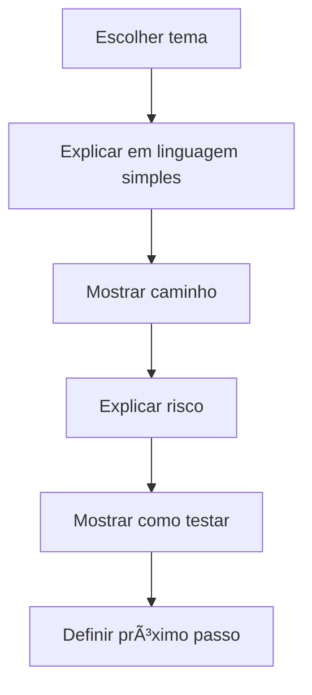

# 🧠 Padrão de Documentação Guiada — Loze

**Data:** 12-06-2026  
**Status:** 🟢 Oficial inicial

---

## 📌 Resumo executivo

Documentação Guiada explica tecnologia em linguagem humana, sem perder precisão técnica.

| Pergunta | Todo documento deve responder |
|---|---|
| O que é? | ✅ |
| Para que serve? | ✅ |
| Onde fica? | ✅ |
| Como funciona? | ✅ |
| O que afeta? | ✅ |
| Quando mexer? | ✅ |
| Como testar? | ✅ |
| Qual risco? | ✅ |
| Quem aprova? | ✅ |

---

## 🧠 Exemplos TaskZei

> ⚙️ **Migration:** arquivo SQL que altera banco de dados de forma controlada.  
> 🧩 **Service:** camada que conversa com banco, API ou regra de negócio.  
> 🧱 **Componente:** peça visual da tela, como botão, modal, card ou tabela.

---

## 🧭 Fluxo para escrever documentação guiada

---

## ✅ Checklist

- [ ] Tem resumo executivo?
- [ ] Tem caminho copiável?
- [ ] Tem exemplo prático?
- [ ] Tem risco?
- [ ] Tem validação?
- [ ] Tem próximo passo?
