# 🧭 Padrão de Recursos Visuais para Documentação — Loze

**Data:** 12-06-2026  
**Status:** 🟢 Oficial inicial  
**Tipo:** Padrão visual de Markdown para documentos humanos  
**Aplicação:** padrões, auditorias, matrizes, relatórios, planos, guias e decisões.

---

## 📌 Sumário navegável

- [📌 Resumo executivo](#-resumo-executivo)
- [✅ Regra principal](#-regra-principal)
- [## Legenda visual](#legenda-visual)
- [🧱 Estrutura recomendada](#-estrutura-recomendada)
- [🧾 Blocos visuais obrigatórios](#-blocos-visuais-obrigatórios)
- [🧭 Fluxo visual recomendado](#-fluxo-visual-recomendado)
- [🧪 Critérios de pronto](#-critérios-de-pronto)

---

## 📌 Resumo executivo

Documentos oficiais da Loze não devem ser apenas texto corrido. Eles precisam orientar leitura, decisão e execução com recursos visuais claros.

> 🔵 **Em linguagem simples:** um documento oficial precisa permitir que uma pessoa entenda rápido o status, o risco, o caminho, a decisão e o próximo passo.

---

## ✅ Regra principal

Todo documento oficial deve usar, quando fizer sentido:

- ✅ status visual;
- 🔴 risco crítico;
- 🟠 risco alto;
- 🟡 atenção;
- 🟢 aprovado/seguro;
- 🔵 informação;
- 🟣 decisão;
- âš« bloqueado;
- 📌 resumo executivo;
- 🧭 navegação;
- 🧱 estrutura;
- 🧪 validação;
- 🛡️ segurança;
- 🧾 evidência;
- 🧠 explicação guiada;
- 🧩 módulo;
- ⚙️ comando técnico;
- 🚫 não fazer;
- ➡️ próximo passo.

---

## Legenda visual

| Símbolo | Significado | Uso |
|---|---|---|
| 🟢 | Seguro / aprovado | Pode seguir |
| 🟡 | Atenção | Revisar antes |
| 🟠 | Alto risco | Precisa cuidado |
| 🔴 | Crítico | Exige autorização |
| ⚫ | Bloqueado | Não executar |
| 🧾 | Evidência | Prova/registro |
| 🧪 | Teste | Validação obrigatória |
| 🛡️ | Segurança | Chaves, acesso, RLS, segredo |
| 🟣 | Decisão | Direção aprovada ou recomendada |
| ⚙️ | Comando técnico | CLI, script, build, migration |
| ➡️ | Próximo passo | Continuidade recomendada |

---

## 🧱 Estrutura recomendada

```text
documento.md
├── 📌 Resumo executivo
├── 🧭 Sumário navegável
├── 🧾 Contexto e evidências
├── 🧱 Estrutura / escopo
├── 🛡️ Riscos e segurança
├── 🧪 Validação
├── 🟣 Decisão
├── ✅ Critérios de pronto
└── ➡️ Próximos passos
```

---

## 🧾 Blocos visuais obrigatórios

### 🔴 Bloco de risco

> 🔴 **Risco crítico:** esta ação pode afetar produção, banco remoto, secrets ou dados reais. Exige autorização explícita.

### 🟣 Bloco de decisão

> 🟣 **Decisão recomendada:** manter a Central de Padrões como módulo oficial e usar o TaskZei como piloto documental.

### 🧪 Bloco de validação

| Validação | Status | Evidência |
|---|---|---|
| Build | 🟢 OK | `npm run build` |
| Typecheck | 🟡 Pendente | erros preexistentes |

### ✅ Checklist

- [ ] Tem resumo executivo?
- [ ] Tem legenda visual?
- [ ] Tem caminhos copiáveis?
- [ ] Tem riscos?
- [ ] Tem critérios de pronto?
- [ ] Não expõe segredo?

---

## 🧭 Fluxo visual recomendado

```mermaid
flowchart TD
  A[Documento oficial] --> B[Resumo executivo]
  B --> C[Legenda visual]
  C --> D[Contexto e decisão]
  D --> E[Riscos e validação]
  E --> F[Caminhos copiáveis]
  F --> G[Próximos passos]
```



---

## 🔁 Exemplo antes/depois

### 🚫 Antes

```text
R5 = Supabase migration.
```

### ✅ Depois

> 🔴 **R5 — Banco/Supabase/Migration**  
> Este nível representa comandos que mexem em banco remoto, Supabase ou estrutura de dados.  
> Em linguagem simples: é quando o agente pode mudar onde os dados reais ficam salvos.  
> **Regra:** não executar sem autorização explícita, rollback e LOZE-TRACE.

---

## 🧪 Critérios de pronto

| Critério | Status esperado |
|---|---|
| Sumário navegável | 🟢 Presente |
| Legenda visual | 🟢 Presente |
| Tabelas visuais | 🟢 Presentes |
| Mermaid quando útil | 🟢 Presente |
| Caminhos copiáveis | 🟢 Presentes |
| Segredos expostos | 🟢 Não |
| Próximos passos | 🟢 Claros |
