# 🧾 LOZE-TRACE — Protocolo de Rastreabilidade de Execução Técnica Loze

**Data:** 12-06-2026  
**Status:** 🟢 Oficial inicial  
**Escopo:** pessoa, agente, CLI, MCP, automação e execução assistida.

---

## 📌 Resumo executivo

LOZE-TRACE é o protocolo para registrar 100% das ações técnicas feitas em projetos Loze/SagB.

> 🔵 **Em linguagem simples:** se alguém ou algum agente mexeu em código, arquivo, banco, deploy, CLI ou automação, precisa ficar claro o que foi feito, onde foi feito, por que foi feito, qual risco tinha e como foi validado.

---

## 🧭 Fluxo visual da execução

```mermaid
flowchart LR
  A[Tarefa recebida] --> B[Leitura do contexto]
  B --> C[Classificação de risco]
  C --> D[Execução controlada]
  D --> E[Registro comando a comando]
  E --> F[Validação]
  F --> G[Relatório LOZE-TRACE]
  G --> H[Monitoramento SagB]
```

---

## ✅ O que nunca pode faltar

| Campo | Obrigatório? | Por quê |
|---|---|---|
| Tarefa | ✅ | Identifica o motivo |
| Executor | ✅ | Pessoa/agente responsável |
| Projeto | ✅ | Evita confusão entre repositórios |
| Caminho | ✅ | Permite reproduzir |
| Comando | ✅ | Mostra ação real |
| Pasta do comando | ✅ | Contexto de execução |
| Risco | ✅ | Define autorização |
| Resultado | ✅ | Mostra se funcionou |
| Erro | ✅ | Ajuda diagnóstico |
| Arquivos afetados | ✅ | Mostra impacto |
| Validação | ✅ | Prova final |
| Segredos | ✅ sem valor | Segurança |

---

## ⚙️ Tabela obrigatória de comandos

| Ordem | Data/hora | Pasta | Comando | Objetivo | Risco | Resultado | Erro | Arquivos afetados | Observação |
|---|---|---|---|---|---|---|---|---|---|

---

## 🧪 Checklist antes/depois

### Antes

- [ ] Entendi a tarefa?
- [ ] Sei a pasta correta?
- [ ] Classifiquei o risco?
- [ ] Precisa autorização?
- [ ] Pode expor segredo?
- [ ] Tem rollback se for R5/R6?

### Depois

- [ ] Registrei comandos?
- [ ] Registrei erros?
- [ ] Listei arquivos afetados?
- [ ] Rodei validação?
- [ ] Registrei pendências?
- [ ] Não expus segredo?

---

## 🧾 Exemplo preenchido

| Ordem | Data/hora | Pasta | Comando | Objetivo | Risco | Resultado | Erro | Arquivos afetados | Observação |
|---|---|---|---|---|---|---|---|---|---|
| 1 | 12-06-2026 00:00 | `Z:\projeto` | `npm run build` | Validar build | 🟠 R3 | ✅ OK | — | `dist` | Build local |

---

## 🟡 Erro comum

> 🚫 **Erro:** dizer “rodei build e deu erro” sem copiar o erro.  
> ✅ **Correto:** registrar comando, pasta, saída, arquivo afetado e decisão tomada depois.

---

## 🛡️ Segurança

Nunca registrar valores reais de service role, tokens, API keys, senhas, chaves privadas ou connection strings sensíveis.

Se aparecer segredo, mascarar com `********`.

---

## 📡 Como alimenta o Monitoramento

O Monitoramento SagB deve receber eventos de execução, comandos, falhas, risco, duração, bloqueios e arquivos alterados. Isso permite saber onde o agente falhou, qual comando quebrou e se a tarefa deve ser quebrada em partes menores.
