# Relatório LOZE-TRACE — [Projeto] — [dd-mm-aaaa]

## 📌 Resumo executivo

| Campo | Valor |
|---|---|
| Projeto |  |
| Executor |  |
| Ambiente |  |
| Início |  |
| Fim |  |
| Resultado | 🟢 Aprovado / 🟡 Parcial / 🔴 Falhou |
| Maior risco executado | R0-R6 |

---

## Legenda de risco

| Risco | Símbolo | Significado |
|---|---|---|
| R0 | 🟢 | Leitura / inspeção |
| R1 | 🟢 | Validação local segura |
| R2 | 🟡 | Alteração local |
| R3 | 🟠 | Build/instalação/geração |
| R4 | 🟠 | Git remoto/local relevante |
| R5 | 🔴 | Banco/Supabase/remoto |
| R6 | ⚫ | Produção/segredo/irreversível |

---

## 🧭 Fluxo da execução

```mermaid
flowchart TD
  A[Início] --> B[Diagnóstico]
  B --> C[Execução]
  C --> D[Validação]
  D --> E[Relatório]
```

---

## ⚙️ Comandos executados

| Ordem | Risco | Pasta | Comando | Objetivo | Resultado | Erro | Evidência |
|---|---|---|---|---|---|---|---|
| 1 | 🟢 R0 | `Z:\...` | `npm run build` | Validar build | ✅ OK | — | log |

---

## 🧱 Arquivos afetados

### Criados

| Arquivo | Motivo | Risco |
|---|---|---|

### Alterados

| Arquivo | Motivo | Risco |
|---|---|---|

### Removidos

| Arquivo | Motivo | Risco |
|---|---|---|

---

## 🧾 Evidências

| Evidência | Resultado |
|---|---|
| Build |  |
| Typecheck |  |
| Smoke test |  |

---

## 🔴 Erros encontrados

| Erro | Impacto | Decisão |
|---|---|---|

---

## ⚫ Ações bloqueadas

| Ação | Motivo | Próximo passo |
|---|---|---|

---

## ➡️ Próximos passos

| Ordem | Ação | Responsável |
|---|---|---|
