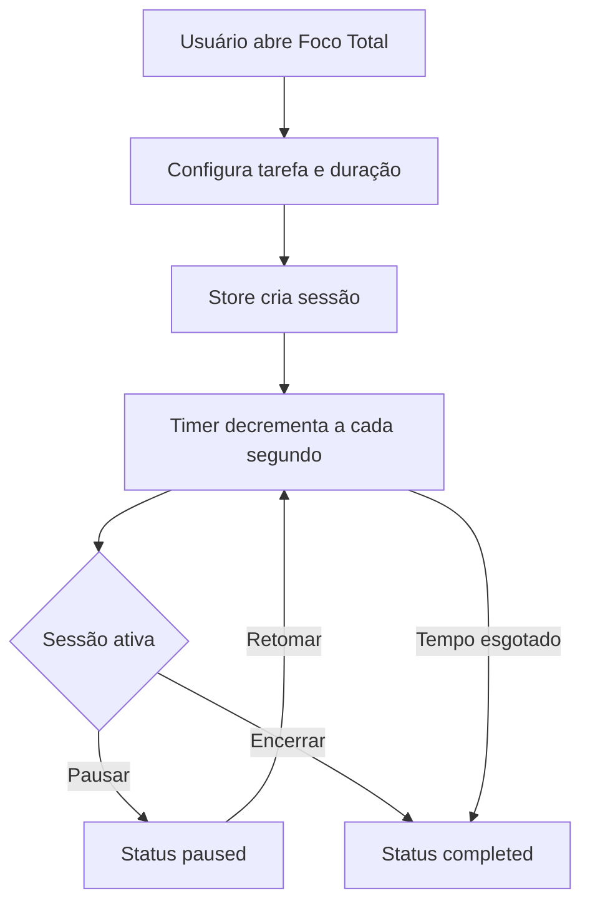

# Auditoria Técnica Geral — Foco Total v1

**Data:** 13-06-2026  
**Escopo auditado:** `Z:\00_sagb\src\modules\foco_total`  
**Arquivo de registro:** `src/modules/foco_total/docs/plans/00-00-auditoria-tecnica-geral-foco-total-v1.13-06-2026.md`  
**Modo de auditoria:** análise estática completa por leitura de arquivos, busca de referências e verificação de integração modular.  
**Status geral:** módulo funcional em MVP, porém com inconsistências de governança, arquitetura, UX, persistência e promessas de produto ainda não implementadas.

---

## 1. Resumo executivo

O módulo **Foco Total / Zen Folk | Foco AI** existe como módulo registrado no SagB, com rota ativa, página principal, modal de configuração, timer, store Zustand compartilhada e serviço de voz com fallback para Web Speech API.

O estado atual é de **MVP operacional parcial**:

- O usuário consegue iniciar uma sessão de foco com tarefa e duração.
- O timer decrementa a cada segundo enquanto a sessão está em execução.
- Existem ações de pausar, retomar e encerrar.
- Existe voz via `gemini_tts` com fallback para `speechSynthesis` do navegador.
- Existe integração indireta com o TaskZei por meio do widget `FocusWidget`, que reutiliza a store do Foco Total.

Porém, o módulo ainda não cumpre vários pontos declarados no próprio `module-doc.ts`, como histórico local, fechamento obrigatório com resultado, mensagens motivacionais por checkpoint, aprendizado progressivo, rastreamento e documentação modular no padrão canônico.

### Diagnóstico final

| Área | Situação | Risco |
|---|---|---|
| Registro modular | Registrado no `moduleRegistry` | Baixo |
| Rota | Ativa em `/foco-total/*` | Baixo |
| Timer | Funciona, mas suscetível a drift e múltiplos consumidores | Médio |
| Store | Centraliza estado, mas mistura regra de negócio e side effects | Médio |
| Voz | Tem fallback, mas depende de ação `gemini_tts` e pode sofrer bloqueio de autoplay | Médio |
| Persistência | Não existe histórico local nem remoto | Alto |
| Documentação | Incompleta, fora do contrato `ModuleDoc`, com mojibake no changelog | Alto |
| UX / acessibilidade | Funcional, mas com `alert`, sem foco gerenciado e hardcodes visuais | Médio |
| Integração TaskZei | Existe, mas acopla diretamente store interna | Médio |

---

## 2. Estrutura encontrada

```text
src/modules/foco_total/
├── changelog.md
├── decisions.md
├── index.ts
├── manifest.ts
├── module-doc.ts
├── routes.tsx
├── _triagem/
├── agent/
├── components/
│   ├── FocusTimer.tsx
│   └── SessionConfigModal.tsx
├── docs/
│   └── plans/
│       └── 00-00-auditoria-tecnica-geral-foco-total-v1.13-06-2026.md
├── pages/
│   └── FocoTotalPage.tsx
├── services/
│   └── zenVoice.ts
├── stores/
│   └── focusStore.ts
└── types/
    └── index.ts
```

---

## 3. Arquivos auditados

| Arquivo | Função atual | Observação |
|---|---|---|
| `manifest.ts` | Manifesto plugável do módulo | Registrado e ativo |
| `routes.tsx` | Rota `/foco-total/*` | Simples e funcional |
| `index.ts` | Barrel export | Correto |
| `module-doc.ts` | Documento técnico do módulo | Fora do contrato canônico `ModuleDoc` |
| `changelog.md` | Registro de mudanças | Conteúdo com mojibake de encoding |
| `decisions.md` | Decisões estruturais | Básico, desatualizado diante da implementação atual |
| `pages/FocoTotalPage.tsx` | Página principal | Funcional, mas hardcoded e pouco aderente ao design system |
| `components/FocusTimer.tsx` | Timer visual principal | Funcional, mas sem proteção contra drift |
| `components/SessionConfigModal.tsx` | Configuração de sessão | Funcional, mas usa `alert` e não tem acessibilidade robusta |
| `stores/focusStore.ts` | Estado e lifecycle da sessão | Concentra lógica, logs e voz; sem persistência |
| `services/zenVoice.ts` | Voz Gemini TTS e fallback browser | Robusto em fallback, mas com riscos de autoplay/custo |
| `types/index.ts` | Tipos de sessão e log | Simples, porém há status e tipos pouco usados |

---

## 4. Estado funcional atual

### Fluxo principal implementado



### O que funciona

- Criação de sessão com `task`, `durationMinutes`, `timeRemainingSeconds`, `status` e `logs`.
- Pausa, retomada e encerramento manual.
- Encerramento automático ao chegar em zero.
- Logs básicos de início, pausa, retomada e parada.
- Voz no início, pausa, retomada e fim da sessão.
- Fallback de voz do Gemini TTS para Web Speech API.
- Integração com widget do TaskZei usando a mesma `useFocusStore`.

### O que ainda não existe

- Histórico local persistido.
- Persistência Supabase ou SQLite.
- Fechamento obrigatório com registro de resultado.
- Checkpoints automáticos com mensagens motivacionais.
- Registro de sessões concluídas em lista ou dashboard.
- Métricas de foco, taxa de conclusão, tempo real executado ou score.
- Detecção de perda de foco da janela.
- Detecção de ociosidade.
- Perfil de tom do agente.
- Consentimento explícito para monitoramento avançado.
- Testes unitários ou integração.

---

## 5. Achados críticos e inconsistências

### FT-001 — `module-doc.ts` fora do contrato canônico `ModuleDoc`

**Severidade:** Alta  
**Arquivo:** `module-doc.ts`  
**Evidência:** O contrato oficial em `src/core/modules/module.types.ts` espera campos como `displayName`, `purpose`, `version`, `boundaries`, `integrations` e `dataDependencies`. O módulo exporta campos customizados em português: `nome_oficial`, `versao`, `resumo`, `proposta_de_valor`, `ownership`, `pilares_mvp`, `roadmap_faseado`.

**Impacto:**

- Ferramentas de observabilidade modular podem não conseguir ler nome, versão, dependências e integrações.
- A documentação fica invisível ou parcialmente incompatível com painéis que esperam `ModuleDoc`.
- O módulo perde rastreabilidade canônica dentro do SagB.

**Recomendação:** Reescrever `module-doc.ts` implementando o contrato `ModuleDoc`, mantendo os campos estratégicos em uma seção adicional se necessário.

---

### FT-002 — Changelog com encoding corrompido

**Severidade:** Alta  
**Arquivo:** `changelog.md`  
**Evidência:** termos como `mudanças`, `módulo`, `técnico-estratégico`.

**Impacto:**

- Documento de governança perde qualidade e legibilidade.
- Pode contaminar índices, buscas e documentação central.

**Recomendação:** Regravar arquivo em UTF-8 limpo e padronizar datas no formato `dd-mm-aaaa`.

---

### FT-003 — Promessa de histórico local não implementada

**Severidade:** Alta  
**Arquivo:** `module-doc.ts`, `focusStore.ts`  
**Evidência:** `module-doc.ts` declara `Histórico local de sessões para aprendizado progressivo`, mas `focusStore.ts` mantém apenas `currentSession` em memória.

**Impacto:**

- Ao recarregar a página, a sessão e seus logs são perdidos.
- Não existe aprendizado progressivo nem análise de sessões anteriores.
- MVP fica aquém do próprio pilar declarado.

**Recomendação:** Criar `sessionsHistory` persistido em `localStorage` com schema versionado e, futuramente, provider Supabase/SQLite.

---

### FT-004 — Fechamento obrigatório não implementado

**Severidade:** Alta  
**Arquivo:** `focusStore.ts`, `FocusTimer.tsx`, `FocoTotalPage.tsx`  
**Evidência:** Ao encerrar, a store define `status: 'completed'` e `timeRemainingSeconds: 0`, mas não solicita resultado, bloqueio de fechamento, nota de progresso ou avaliação.

**Impacto:**

- O produto não captura aprendizado nem resultado real da sessão.
- Não há base para evolução de coaching por IA.

**Recomendação:** Implementar modal de fechamento com campos obrigatórios: resultado, progresso percebido, bloqueios e próximo passo.

---

### FT-005 — Mensagens de agente por checkpoint não implementadas

**Severidade:** Média/Alta  
**Arquivo:** `focusStore.ts`, `FocoTotalPage.tsx`  
**Evidência:** O tipo `SessionLog` aceita `checkpoint` e `agent_message`, e a UI filtra `agent_message`, mas a store nunca cria logs desses tipos automaticamente.

**Impacto:**

- O painel `Zen Folk Coach` fica quase sempre limitado a logs operacionais.
- O MVP promete sustentação ativa de foco, mas entrega somente voz em eventos básicos.

**Recomendação:** Criar agenda de checkpoints por percentual ou tempo restante, por exemplo início, 25%, 50%, 75% e reta final.

---

### FT-006 — Timer suscetível a drift e throttling de browser

**Severidade:** Média  
**Arquivo:** `FocusTimer.tsx`, `focusStore.ts`, `TaskZei FocusWidget.tsx`  
**Evidência:** O timer reduz `timeRemainingSeconds` por `setInterval` a cada 1000 ms. Em abas em background, browsers podem atrasar intervalos. Além disso, múltiplos componentes consumidores podem chamar `tick()` se renderizados simultaneamente.

**Impacto:**

- Sessões podem terminar fora do tempo real esperado.
- Em cenários com múltiplos widgets montados, o tempo pode decrementar mais rápido.

**Recomendação:** Armazenar `startTime`, `pausedAccumulatedMs`, `targetEndTime` e calcular tempo restante por relógio real (`Date.now()`), com um único motor de timer na store.

---

### FT-007 — Store mistura estado, regra de negócio e efeitos colaterais de voz

**Severidade:** Média  
**Arquivo:** `focusStore.ts`  
**Evidência:** `startSession`, `pauseSession`, `resumeSession`, `stopSession` e `tick` chamam diretamente `zenVoice.speak()`.

**Impacto:**

- Dificulta testes unitários.
- Acopla lifecycle de sessão ao serviço de voz.
- Qualquer falha futura no serviço de voz pode afetar lógica de estado, mesmo que hoje esteja parcialmente protegida por fallback.

**Recomendação:** Separar domínio (`focusSessionService`) de side effects (`focusEffectsService` ou subscriber da store).

---

### FT-008 — `crypto.randomUUID()` sem fallback

**Severidade:** Média  
**Arquivo:** `focusStore.ts`  
**Evidência:** IDs de sessão e logs dependem diretamente de `crypto.randomUUID()`.

**Impacto:**

- Pode falhar em contextos antigos, WebViews ou ambientes não seguros.
- Reduz robustez para Tauri ou mobile.

**Recomendação:** Criar helper `createFocusId()` com fallback seguro baseado em timestamp e random.

---

### FT-009 — `resume` é registrado, mas não aparece no painel do coach

**Severidade:** Baixa/Média  
**Arquivo:** `FocoTotalPage.tsx`  
**Evidência:** A UI filtra logs de tipos `agent_message`, `start`, `stop`, `pause`, mas omite `resume`.

**Impacto:**

- O usuário não vê evento de retomada no painel lateral.
- Histórico visual fica inconsistente.

**Recomendação:** Incluir `resume` no filtro ou exibir todos os logs relevantes por categoria.

---

### FT-010 — Modal usa `alert()` para validação

**Severidade:** Baixa/Média  
**Arquivo:** `SessionConfigModal.tsx`  
**Evidência:** Validações usam `alert('Por favor...')` e `alert('A duração...')`.

**Impacto:**

- UX bloqueante e pouco profissional.
- Quebra padrão visual do SagB.
- Menor acessibilidade.

**Recomendação:** Substituir por estado de erro inline, com `aria-live` e mensagem visível.

---

### FT-011 — Sem limite máximo para duração customizada

**Severidade:** Baixa/Média  
**Arquivo:** `SessionConfigModal.tsx`  
**Evidência:** input custom aceita qualquer número maior que zero.

**Impacto:**

- Usuário pode iniciar sessões absurdamente longas.
- Métricas futuras e UX podem ser degradadas.

**Recomendação:** Definir limites operacionais, por exemplo mínimo 1 e máximo 180 minutos, com feedback inline.

---

### FT-012 — Hardcodes visuais e baixa aderência ao design system

**Severidade:** Média  
**Arquivo:** `FocoTotalPage.tsx`, `FocusTimer.tsx`, `SessionConfigModal.tsx`  
**Evidência:** uso extensivo de classes como `bg-[#0a0f1c]`, `bg-[#121a2b]`, `bg-indigo-600`, `text-gray-100`, `border-white/10`.

**Impacto:**

- Módulo fica desalinhado de temas e tokens centrais.
- Manutenção visual fica custosa.
- Difere do widget TaskZei, que já usa `var(--sagb-*)`.

**Recomendação:** Migrar para tokens canônicos `--sagb-*` e remover hex hardcoded.

---

### FT-013 — Acessibilidade incompleta no modal e controles

**Severidade:** Média  
**Arquivo:** `SessionConfigModal.tsx`, `FocusTimer.tsx`, `FocoTotalPage.tsx`  
**Evidência:** Modal sem `role="dialog"`, `aria-modal`, título associado, Escape para fechar, focus trap ou restauração de foco. Botões com ícones dependem de `title`, não `aria-label`.

**Impacto:**

- Usuários por teclado e leitores de tela têm experiência inferior.
- Pode falhar em padrões mínimos de acessibilidade.

**Recomendação:** Implementar acessibilidade de modal e labels explícitos nos controles.

---

### FT-014 — Voz por Gemini TTS pode gerar custo e latência sem política clara

**Severidade:** Média  
**Arquivo:** `zenVoice.ts`  
**Evidência:** Cada evento de sessão chama `callAiProxy('gemini_tts')`, com fallback apenas após erro ou retorno vazio.

**Impacto:**

- Possível custo de API por evento simples.
- Latência perceptível em ações frequentes.
- Dependência de backend `/api/ai` e ação `gemini_tts`.

**Recomendação:** Permitir modo `browser_only`, cache de frases comuns, fila/debounce de áudio e configuração por ambiente.

---

### FT-015 — `audio.play()` e `speechSynthesis` podem ser bloqueados pelo navegador

**Severidade:** Média  
**Arquivo:** `zenVoice.ts`  
**Evidência:** `audio.play()` é chamado após resposta assíncrona. Navegadores podem bloquear áudio sem gesto recente do usuário.

**Impacto:**

- Voz pode falhar silenciosamente em alguns navegadores.
- Fallback também pode ser bloqueado dependendo da política do browser.

**Recomendação:** Exigir ativação explícita de voz, registrar estado de permissão e mostrar feedback quando áudio for bloqueado.

---

### FT-016 — `window.speechSynthesis.onvoiceschanged` é sobrescrito globalmente

**Severidade:** Baixa/Média  
**Arquivo:** `zenVoice.ts`  
**Evidência:** Constructor atribui diretamente `window.speechSynthesis.onvoiceschanged = ...`.

**Impacto:**

- Pode sobrescrever handler de outro módulo.
- Sem cleanup se o serviço evoluir para instâncias múltiplas.

**Recomendação:** Usar `addEventListener` quando disponível ou preservar handler anterior.

---

### FT-017 — Integração com TaskZei acopla diretamente store interna

**Severidade:** Média  
**Arquivo externo relacionado:** `src/modules/taskzei/components/tasks/FocusWidget.tsx`  
**Evidência:** O widget importa `useFocusStore` diretamente de `../../../foco_total/stores/focusStore`.

**Impacto:**

- TaskZei depende da implementação interna do Foco Total.
- Mudanças na store podem quebrar outro módulo.
- Não há contrato público de integração.

**Recomendação:** Exportar uma API pública do módulo, por exemplo `focusSessionFacade`, e fazer o TaskZei consumir somente esse contrato.

---

### FT-018 — Estado `idle` existe no tipo, mas não é usado

**Severidade:** Baixa  
**Arquivo:** `types/index.ts`, `focusStore.ts`  
**Evidência:** `SessionStatus = 'idle' | 'running' | 'paused' | 'completed'`, mas `currentSession` é `null` quando ocioso.

**Impacto:**

- Modelo de estado ambíguo.
- Pode gerar ramificações mortas no futuro.

**Recomendação:** Remover `idle` ou trocar `currentSession: null` por sessão explícita `idle`.

---

### FT-019 — `moduleDocPath` aponta para caminho relativo pouco útil

**Severidade:** Baixa  
**Arquivo:** `FocoTotalPage.tsx`  
**Evidência:** `moduleDocPath="../module-doc.ts"` é passado ao `ModuleHeader`, mas o handler atual só faz `console.log`.

**Impacto:**

- Botão de documentação não abre documentação real.
- Caminho pode ser confuso para navegação documental futura.

**Recomendação:** Integrar com central de documentos ou remover botão até haver ação real.

---

### FT-020 — Fonte de origem documentada com caminho errado

**Severidade:** Baixa  
**Arquivo:** `module-doc.ts`  
**Evidência:** `fonte_de_origem: ['src/modules/.foco_total/_triagem/foco ai coach chat gpt']`; a pasta real é `src/modules/foco_total/_triagem`.

**Impacto:**

- Rastreabilidade documental incorreta.

**Recomendação:** Corrigir caminho e, se possível, mover triagem para área de curadoria se não for código ativo.

---

### FT-021 — `internalName` com ponto inicial pode divergir do padrão atual

**Severidade:** Baixa/Média  
**Arquivo:** `manifest.ts`  
**Evidência:** `internalName: '.foco_total'`, enquanto a pasta real é `foco_total`.

**Impacto:**

- Pode gerar divergência em catálogos, documentação e automações.

**Recomendação:** Validar se o ponto inicial é legado intencional. Se não for, padronizar para `foco_total`.

---

### FT-022 — Stack documentada não reflete implementação real

**Severidade:** Média  
**Arquivo:** `module-doc.ts`, `decisions.md`  
**Evidência:** Documentação cita `React`, `Tauri`, `OpenAI`, `SQLite local`. Implementação atual usa React, Zustand, Supabase auth shim, AI proxy e Gemini TTS.

**Impacto:**

- Equipe pode tomar decisões com base em documentação desatualizada.

**Recomendação:** Atualizar documentação para separar `stack atual` de `stack alvo futura`.

---

## 6. Matriz de riscos

| Código | Risco | Severidade | Probabilidade | Prioridade |
|---|---|---:|---:|---:|
| FT-001 | Documentação fora do contrato `ModuleDoc` | Alta | Alta | P0 |
| FT-002 | Changelog com encoding corrompido | Alta | Alta | P0 |
| FT-003 | Histórico local inexistente | Alta | Alta | P0 |
| FT-004 | Fechamento obrigatório ausente | Alta | Alta | P0 |
| FT-006 | Timer com drift ou múltiplos ticks | Média | Média | P1 |
| FT-007 | Store acoplada a side effects de voz | Média | Média | P1 |
| FT-012 | Hardcodes visuais fora do padrão | Média | Alta | P1 |
| FT-013 | Acessibilidade incompleta | Média | Alta | P1 |
| FT-014 | Custo e latência de TTS sem política | Média | Média | P1 |
| FT-017 | Acoplamento direto TaskZei ↔ Foco Total | Média | Média | P1 |

---

## 7. Plano recomendado de correção

### P0 — Estabilização e governança

- [ ] Reescrever `module-doc.ts` no contrato oficial `ModuleDoc`.
- [ ] Corrigir encoding de `changelog.md` e registrar versão atual em UTF-8.
- [ ] Criar `README.md` do módulo com visão, uso, arquitetura e limites.
- [ ] Implementar histórico local de sessões em `localStorage` com versionamento.
- [ ] Implementar fechamento obrigatório de sessão com resultado e próximos passos.

### P1 — Robustez funcional

- [ ] Refatorar timer para cálculo por tempo real, evitando drift.
- [ ] Centralizar engine do timer na store ou em service único.
- [ ] Separar efeitos de voz da lógica de estado.
- [ ] Criar checkpoints automáticos e logs `agent_message`.
- [ ] Adicionar fallback para `crypto.randomUUID()`.

### P1 — UX, acessibilidade e visual

- [ ] Substituir `alert()` por validação inline.
- [ ] Adicionar `role="dialog"`, `aria-modal`, Escape, focus trap e `aria-label`.
- [ ] Migrar cores hardcoded para tokens `--sagb-*`.
- [ ] Exibir evento `resume` no painel lateral.
- [ ] Definir limite máximo de duração customizada.

### P2 — Integração e evolução

- [ ] Criar facade pública `focusSessionFacade`.
- [ ] Fazer TaskZei consumir contrato público em vez da store interna.
- [ ] Criar política de voz: browser only, Gemini TTS, mudo por padrão ou configuração por usuário.
- [ ] Criar testes unitários para store e timer.
- [ ] Planejar provider Supabase/SQLite para histórico e métricas.

---

## 8. Checklist de validação futura

- [ ] Build TypeScript passa sem erros.
- [ ] Sessão inicia, pausa, retoma e encerra sem regressão.
- [ ] Timer mantém precisão após alternar aba do navegador.
- [ ] Uma sessão encerrada gera resumo obrigatório.
- [ ] Histórico persiste após reload.
- [ ] Voz funciona com Gemini TTS e fallback browser.
- [ ] Usuário consegue mutar e desmutar voz sem áudio residual.
- [ ] Modal é navegável por teclado.
- [ ] Widget do TaskZei continua iniciando sessão de foco.
- [ ] `module-doc.ts` aparece corretamente em painéis de documentação/monitoramento.

---

## 9. Conclusão

O módulo **Foco Total** está integrado ao SagB e possui uma base funcional suficiente para MVP visual e operacional. A arquitetura, porém, ainda está em estágio inicial: a store concentra responsabilidades demais, a documentação não segue o contrato canônico, não há persistência de histórico e funcionalidades declaradas como pilares do MVP ainda não foram implementadas.

A prioridade recomendada é tratar primeiro governança e dados de sessão: corrigir `module-doc.ts`, limpar o `changelog.md`, implementar histórico local e criar fechamento obrigatório. Em seguida, deve-se robustecer o timer, desacoplar voz da store e criar uma API pública de integração para impedir que outros módulos dependam diretamente da implementação interna do Foco Total.

---

## 10. Sumário executivo para handoff

**Estado atual:** MVP funcional parcial.  
**Principais quebras:** documentação fora do contrato, changelog corrompido, histórico inexistente, fechamento obrigatório ausente.  
**Principais riscos técnicos:** drift de timer, acoplamento de side effects na store, dependência direta do TaskZei na store interna, voz sem política de custo/permissão.  
**Próximo passo recomendado:** criar uma tarefa de correção P0 focada em governança documental, persistência local e fechamento obrigatório de sessão.
