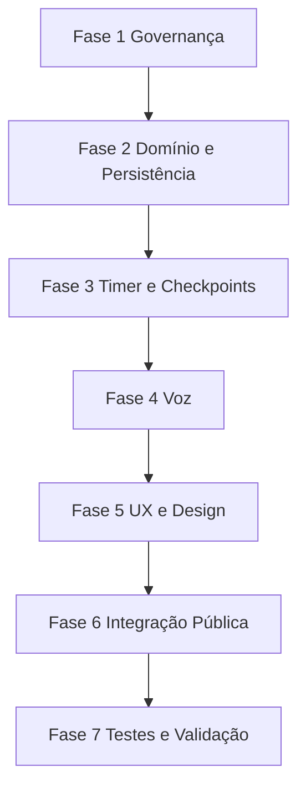

# Plano de Correção Total — Foco Total v1

**Data:** 13-06-2026  
**Origem:** Auditoria técnica geral registrada em `src/modules/foco_total/docs/plans/00-00-auditoria-tecnica-geral-foco-total-v1.13-06-2026.md`  
**Escopo:** `Z:\00_sagb\src\modules\foco_total` e integração direta com `src/modules/taskzei/components/tasks/FocusWidget.tsx`  
**Objetivo:** Corrigir todos os achados FT-001 a FT-022, estabilizando o módulo Foco Total como MVP canônico, persistente, acessível, integrado por contrato público e aderente aos padrões do SagB.

---

## 1. Diretriz executiva

O módulo **Foco Total / Zen Folk | Foco AI** deve sair do estado atual de MVP parcial para uma base estável com:

- documentação canônica;
- histórico local versionado;
- fechamento obrigatório de sessão;
- timer robusto por tempo real;
- checkpoints automáticos do agente;
- UX acessível;
- design alinhado a tokens `--sagb-*`;
- voz configurável e segura;
- integração pública para o TaskZei;
- validação técnica mínima.

Este plano organiza as correções em fases para reduzir risco e permitir implementação incremental.

---

## 2. Mapa dos achados por fase

| Achado | Tema | Fase | Prioridade |
|---|---|---|---|
| FT-001 | `module-doc.ts` fora do contrato `ModuleDoc` | Fase 1 | P0 |
| FT-002 | `changelog.md` com encoding corrompido | Fase 1 | P0 |
| FT-020 | Fonte de origem com caminho errado | Fase 1 | P0 |
| FT-022 | Stack documentada desatualizada | Fase 1 | P0 |
| FT-021 | `internalName` com ponto inicial | Fase 1 | P1 |
| FT-003 | Histórico local inexistente | Fase 2 | P0 |
| FT-004 | Fechamento obrigatório ausente | Fase 2 | P0 |
| FT-018 | Estado `idle` não utilizado | Fase 2 | P1 |
| FT-008 | `crypto.randomUUID()` sem fallback | Fase 2 | P1 |
| FT-006 | Timer com drift/múltiplos ticks | Fase 3 | P1 |
| FT-005 | Checkpoints do agente ausentes | Fase 3 | P1 |
| FT-007 | Store misturando side effects de voz | Fase 3 | P1 |
| FT-014 | Custo/latência de Gemini TTS sem política | Fase 4 | P1 |
| FT-015 | Bloqueio de autoplay/voz | Fase 4 | P1 |
| FT-016 | `onvoiceschanged` sobrescrito globalmente | Fase 4 | P2 |
| FT-010 | `alert()` no modal | Fase 5 | P1 |
| FT-011 | Duração custom sem limite | Fase 5 | P1 |
| FT-012 | Hardcodes visuais | Fase 5 | P1 |
| FT-013 | Acessibilidade incompleta | Fase 5 | P1 |
| FT-009 | `resume` omitido no painel | Fase 5 | P2 |
| FT-017 | Acoplamento direto TaskZei ↔ store | Fase 6 | P1 |
| FT-019 | `moduleDocPath` pouco útil | Fase 6 | P2 |

---

## 3. Arquivos previstos para alteração

### Dentro do módulo Foco Total

| Arquivo | Motivo |
|---|---|
| `src/modules/foco_total/module-doc.ts` | Reescrever em contrato `ModuleDoc` e atualizar stack/integrações |
| `src/modules/foco_total/changelog.md` | Corrigir encoding e registrar correções |
| `src/modules/foco_total/decisions.md` | Registrar decisões de persistência, timer, voz e integração pública |
| `src/modules/foco_total/manifest.ts` | Validar/padronizar `internalName` |
| `src/modules/foco_total/README.md` | Criar documentação operacional do módulo |
| `src/modules/foco_total/types/index.ts` | Expandir tipos de sessão, logs, fechamento, voz e histórico |
| `src/modules/foco_total/stores/focusStore.ts` | Refatorar lifecycle, persistência, fechamento e timer |
| `src/modules/foco_total/services/zenVoice.ts` | Política de voz, fallback, permissão e listener seguro |
| `src/modules/foco_total/services/focusSessionStorage.ts` | Novo serviço para histórico local versionado |
| `src/modules/foco_total/services/focusSessionClock.ts` | Novo serviço/helper para cálculo por tempo real |
| `src/modules/foco_total/services/focusSessionFacade.ts` | Novo contrato público de integração |
| `src/modules/foco_total/services/focusEffects.ts` | Novo serviço para side effects: voz, checkpoints e mensagens |
| `src/modules/foco_total/components/FocusTimer.tsx` | Consumir timer robusto, acessibilidade e tokens visuais |
| `src/modules/foco_total/components/SessionConfigModal.tsx` | Validação inline, limites e acessibilidade |
| `src/modules/foco_total/components/SessionCloseModal.tsx` | Novo modal obrigatório de fechamento |
| `src/modules/foco_total/components/SessionHistoryPanel.tsx` | Novo painel de histórico local |
| `src/modules/foco_total/pages/FocoTotalPage.tsx` | Integrar fechamento, histórico, logs completos, tokens e UX |

### Fora do módulo Foco Total

| Arquivo | Motivo |
|---|---|
| `src/modules/taskzei/components/tasks/FocusWidget.tsx` | Trocar import direto da store por facade pública |

---

## 4. Plano de execução por fases

## Fase 1 — Governança documental e contrato modular

### Objetivo

Corrigir inconsistências documentais e alinhar o módulo aos contratos do SagB antes de mexer em comportamento funcional.

### Tarefas

- [ ] Reescrever `module-doc.ts` usando o contrato oficial `ModuleDoc` com os campos `displayName`, `purpose`, `version`, `boundaries`, `integrations` e `dataDependencies`.
- [ ] Manter informações estratégicas atuais de `module-doc.ts` em campos complementares ou comentários estruturados, sem quebrar o contrato principal.
- [ ] Corrigir `fonte_de_origem` ou equivalente para apontar para `src/modules/foco_total/_triagem/foco ai coach chat gpt`.
- [ ] Atualizar stack documentada, separando `stack atual` de `stack futura`.
- [ ] Corrigir `changelog.md` para UTF-8 limpo, removendo mojibake.
- [ ] Registrar no `changelog.md` a versão de correção inicial do Foco Total.
- [ ] Atualizar `decisions.md` com decisões sobre histórico local, timer por tempo real, voz configurável e facade pública.
- [ ] Criar `README.md` do módulo com visão, execução, arquitetura, limites e próximos passos.
- [ ] Validar se `internalName: '.foco_total'` é legado intencional; se não houver dependência, padronizar para `foco_total`.

### Critérios de aceite

- [ ] `module-doc.ts` exporta objeto compatível com `ModuleDoc`.
- [ ] `changelog.md` não contém caracteres corrompidos.
- [ ] `README.md` existe e descreve o estado real do módulo.
- [ ] Documentação distingue claramente o que existe hoje e o que é roadmap.

---

## Fase 2 — Modelo de domínio, histórico local e fechamento obrigatório

### Objetivo

Transformar a sessão de foco em entidade persistível, com resultado obrigatório e histórico local versionado.

### Tarefas

- [ ] Expandir `FocusSession` em `types/index.ts` com campos de controle: `createdAt`, `startedAt`, `pausedAt`, `completedAt`, `targetEndAt`, `elapsedSeconds`, `pauseAccumulatedSeconds`.
- [ ] Criar tipo `FocusSessionClosePayload` com `resultSummary`, `progressScore`, `blockers`, `nextStep` e `completedBy`.
- [ ] Criar tipo `FocusSessionHistoryItem` para sessões encerradas.
- [ ] Decidir e aplicar modelo de ociosidade: remover `idle` do tipo ou passar a representar estado ocioso explicitamente.
- [ ] Criar helper `createFocusId()` com fallback para ambientes sem `crypto.randomUUID()`.
- [ ] Criar `focusSessionStorage.ts` com chave versionada, por exemplo `sagb:foco_total:sessions:v1`.
- [ ] Implementar leitura segura de histórico local com `safeParse` e fallback para array vazio.
- [ ] Implementar gravação segura com limite de retenção configurável.
- [ ] Adicionar `sessionsHistory` e ações de carregamento/limpeza no `focusStore.ts`.
- [ ] Criar `SessionCloseModal.tsx` para fechamento obrigatório.
- [ ] Alterar `stopSession` para abrir fluxo de fechamento em vez de completar sem resultado, exceto quando encerramento técnico automático exigir estado intermediário.
- [ ] Implementar ação `completeSession(payload)` que salva fechamento e move sessão para histórico.
- [ ] Criar `SessionHistoryPanel.tsx` para listar sessões concluídas na página.

### Critérios de aceite

- [ ] Sessão concluída exige preenchimento do fechamento.
- [ ] Histórico permanece após reload.
- [ ] Dados inválidos em `localStorage` não quebram o módulo.
- [ ] Encerrar sessão não apaga logs nem resultado.
- [ ] `currentSession` e `sessionsHistory` têm contratos claros.

---

## Fase 3 — Timer robusto, checkpoints e separação de efeitos

### Objetivo

Eliminar drift do timer, evitar múltiplos ticks concorrentes e habilitar presença real do agente Zen Folk durante a sessão.

### Tarefas

- [ ] Criar `focusSessionClock.ts` para calcular tempo restante com base em `Date.now()` e `targetEndAt`.
- [ ] Refatorar `tick()` para recalcular estado por relógio real, não apenas subtrair `1`.
- [ ] Garantir que apenas uma camada controle o intervalo ativo de sessão.
- [ ] Definir checkpoints em percentual/tempo: início, 25%, 50%, 75%, reta final e encerramento.
- [ ] Adicionar controle de checkpoints disparados na sessão para evitar repetição.
- [ ] Criar mensagens base do Zen Folk para checkpoints sem depender obrigatoriamente de IA remota.
- [ ] Gerar logs `checkpoint` e `agent_message` automaticamente.
- [ ] Incluir `resume` e tipos relevantes no painel de logs.
- [ ] Criar `focusEffects.ts` para orquestrar voz e mensagens sem misturar tudo na store.
- [ ] Remover chamadas diretas de `zenVoice.speak()` de ações puramente de estado ou isolá-las por camada de efeito.

### Critérios de aceite

- [ ] Timer mantém precisão ao alternar aba do navegador.
- [ ] O tempo não decrementa dobrado se página e widget estiverem montados.
- [ ] Logs de agente aparecem durante a sessão.
- [ ] Pausar e retomar preservam corretamente o tempo restante.
- [ ] A store fica testável sem depender de áudio.

---

## Fase 4 — Política de voz, permissões e custo

### Objetivo

Tornar a voz confiável, controlável e sem custo inesperado.

### Tarefas

- [ ] Expandir estado de voz com `mode: 'muted' | 'browser' | 'gemini_tts'`.
- [ ] Criar configuração de ambiente para modo padrão de voz.
- [ ] Implementar opção explícita de ativação de voz pelo usuário antes do primeiro áudio.
- [ ] Tratar erro de `audio.play()` e mostrar feedback amigável.
- [ ] Implementar cache simples de frases comuns para evitar chamadas repetidas ao TTS.
- [ ] Implementar fila ou cancelamento controlado de áudio para evitar sobreposição.
- [ ] Substituir sobrescrita direta de `window.speechSynthesis.onvoiceschanged` por listener seguro ou preservação de handler anterior.
- [ ] Expor `getVoiceStatus()` para UI exibir se voz está mutada, browser ou Gemini.

### Critérios de aceite

- [ ] Usuário sabe qual modo de voz está ativo.
- [ ] Mutar cancela áudio Gemini e browser.
- [ ] Falha de Gemini não quebra sessão.
- [ ] Bloqueio de autoplay é tratado com mensagem clara.
- [ ] Não há sobrescrita global insegura de `onvoiceschanged`.

---

## Fase 5 — UX, acessibilidade e design system

### Objetivo

Elevar qualidade visual e acessível do módulo, removendo `alert()` e hardcodes fora do padrão.

### Tarefas

- [ ] Substituir `alert()` no `SessionConfigModal.tsx` por validação inline.
- [ ] Adicionar limites de duração: mínimo e máximo operacional.
- [ ] Adicionar `role="dialog"`, `aria-modal`, título associado e `aria-describedby` aos modais.
- [ ] Implementar fechamento por Escape nos modais.
- [ ] Implementar foco inicial, focus trap e restauração de foco.
- [ ] Adicionar `aria-label` em todos os botões de ícone.
- [ ] Migrar cores hardcoded para tokens `--sagb-*` em `FocoTotalPage.tsx`, `FocusTimer.tsx` e `SessionConfigModal.tsx`.
- [ ] Harmonizar o visual da página principal com o padrão usado no widget do TaskZei.
- [ ] Revisar textos de UX para refletir o estado real: MVP local, sem tracking avançado.
- [ ] Exibir histórico, status de voz e logs em áreas semanticamente claras.

### Critérios de aceite

- [ ] Nenhuma validação usa `alert()`.
- [ ] Modal é utilizável por teclado.
- [ ] Botões de ícone possuem `aria-label`.
- [ ] Cores principais usam tokens `--sagb-*`.
- [ ] Página continua responsiva e legível.

---

## Fase 6 — Contrato público e integração TaskZei

### Objetivo

Reduzir acoplamento entre módulos e preparar integração limpa com TaskZei e futuros módulos.

### Tarefas

- [ ] Criar `focusSessionFacade.ts` com métodos públicos: `startFocusSession`, `pauseFocusSession`, `resumeFocusSession`, `requestStopFocusSession`, `completeFocusSession`, `getCurrentFocusSession`.
- [ ] Exportar a facade pelo `index.ts` do módulo.
- [ ] Refatorar `TaskZei FocusWidget.tsx` para usar facade/contrato público em vez de importar `useFocusStore` diretamente.
- [ ] Manter compatibilidade do widget durante a transição.
- [ ] Documentar contrato de integração no `README.md` e em `module-doc.ts`.
- [ ] Revisar `moduleDocPath` no `ModuleHeader`: apontar para documentação útil ou remover botão se continuar sem ação real.

### Critérios de aceite

- [ ] TaskZei não importa mais `stores/focusStore.ts` diretamente.
- [ ] `index.ts` exporta contrato público documentado.
- [ ] Mudanças internas na store não quebram consumidores externos.
- [ ] Documentação deixa claro como outros módulos iniciam uma sessão de foco.

---

## Fase 7 — Testes e validação final

### Objetivo

Garantir que as correções não quebrem o SagB e que o Foco Total tenha validação mínima de qualidade.

### Tarefas

- [ ] Criar testes unitários para helpers de ID.
- [ ] Criar testes unitários para `focusSessionStorage.ts` com dados válidos, vazios e corrompidos.
- [ ] Criar testes unitários para cálculo de timer em `focusSessionClock.ts`.
- [ ] Criar testes da store para iniciar, pausar, retomar, pedir fechamento e completar sessão.
- [ ] Criar teste de contrato da facade.
- [ ] Executar build/typecheck do projeto SagB.
- [ ] Fazer smoke manual: iniciar sessão, pausar, retomar, encerrar, preencher fechamento, recarregar e validar histórico.
- [ ] Fazer smoke manual pelo TaskZei `FocusWidget`.

### Critérios de aceite

- [ ] Build/typecheck passa.
- [ ] Testes de domínio passam.
- [ ] Fluxo principal funciona pela página Foco Total.
- [ ] Fluxo principal funciona pelo TaskZei.
- [ ] Histórico e fechamento persistem corretamente.

---

## 5. Ordem recomendada de implementação

---

## 6. Dependências entre correções

| Dependência | Motivo |
|---|---|
| Fase 1 antes da Fase 2 | O contrato documental deve refletir corretamente os dados que serão implementados |
| Fase 2 antes da Fase 3 | Timer robusto precisa de modelo de sessão expandido |
| Fase 3 antes da Fase 4 | Side effects de voz devem ser separados antes de sofisticar voz |
| Fase 5 após Fase 2 | Modal de fechamento e histórico devem existir antes do polimento visual completo |
| Fase 6 após estabilização da store | Facade deve encapsular o modelo já corrigido |
| Fase 7 ao final | Testes devem validar comportamento final e integração externa |

---

## 7. Critérios finais de conclusão da missão

- [ ] Todos os achados FT-001 a FT-022 possuem correção implementada ou decisão formal documentada.
- [ ] O módulo mantém rota ativa `/foco-total/*`.
- [ ] O usuário consegue iniciar, pausar, retomar, encerrar e registrar resultado de sessão.
- [ ] Histórico local é preservado após reload.
- [ ] Timer é calculado por tempo real e não sofre drift crítico.
- [ ] Logs do Zen Folk aparecem por checkpoint.
- [ ] Voz é opcional, configurável e resiliente a falhas.
- [ ] Documentação do módulo segue `ModuleDoc`.
- [ ] TaskZei integra via contrato público.
- [ ] Build/typecheck passa.
- [ ] Auditoria original pode ser marcada como remediada.

---

## 8. Handoff para implementação

O modo de implementação deve iniciar pela **Fase 1** e só avançar para a próxima fase após validar os critérios de aceite da fase corrente.

Arquivos críticos que exigem cuidado especial:

- `src/modules/foco_total/stores/focusStore.ts` — alto impacto, usado também pelo TaskZei.
- `src/modules/taskzei/components/tasks/FocusWidget.tsx` — consumidor externo da store atual.
- `src/modules/foco_total/services/zenVoice.ts` — envolve browser APIs, AI proxy e fallback.
- `src/modules/foco_total/types/index.ts` — qualquer alteração deve ser compatível com componentes atuais.

Não implementar tracking de janela, ociosidade, leitura de tela ou contexto avançado nesta remediação. Esses itens permanecem como roadmap futuro e dependem de consentimento explícito e desenho de privacidade.

---

## 9. Resultado esperado

Ao final deste plano, o Foco Total deve estar em estado de **MVP canônico e confiável**:

- documentação corrigida;
- sessão persistida;
- fechamento obrigatório;
- timer robusto;
- coach com checkpoints;
- voz segura;
- UX acessível;
- visual alinhado;
- integração limpa com TaskZei;
- base preparada para métricas, Supabase/SQLite e tracking futuro.
